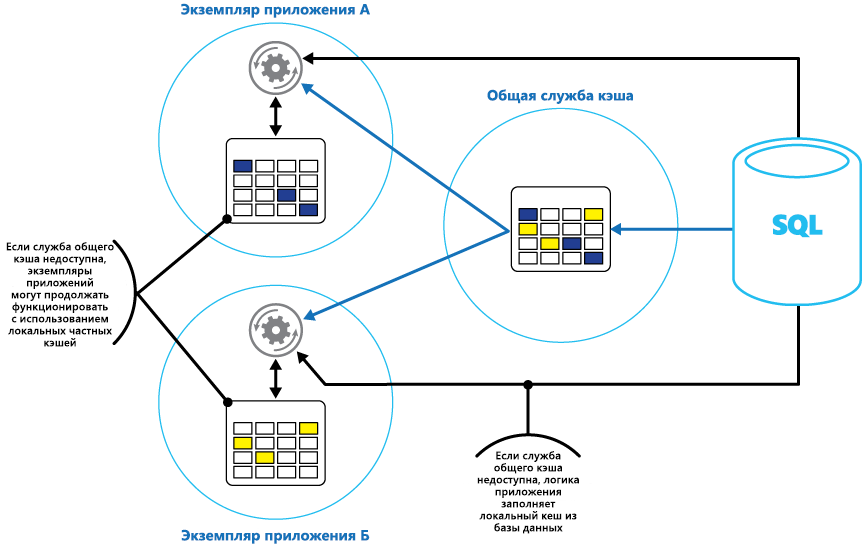

# <a name="caching"></a><span data-ttu-id="99fac-103">Caching</span><span class="sxs-lookup"><span data-stu-id="99fac-103">Caching</span></span>

<span data-ttu-id="99fac-104">Кэширование — это распространенный способ, который предназначен для повышения производительности и масштабируемости системы.</span><span class="sxs-lookup"><span data-stu-id="99fac-104">Caching is a common technique that aims to improve the performance and scalability of a system.</span></span> <span data-ttu-id="99fac-105">Для этого часто запрашиваемые данные временно копируются в быстрое хранилище данных, расположенное ближе к приложению.</span><span class="sxs-lookup"><span data-stu-id="99fac-105">It does this by temporarily copying frequently accessed data to fast storage that's located close to the application.</span></span> <span data-ttu-id="99fac-106">Если это быстрое хранилище данных находится ближе к приложению, чем исходный оригинал, кэширование может значительно улучшить время отклика для клиентских приложений путем более быстрой обработки данных.</span><span class="sxs-lookup"><span data-stu-id="99fac-106">If this fast data storage is located closer to the application than the original source, then caching can significantly improve response times for client applications by serving data more quickly.</span></span>

<span data-ttu-id="99fac-107">Кэширование становится наиболее эффективным, когда экземпляр клиента несколько раз считывает те же данные, особенно в том случае, если к исходному хранилищу данных применяются все указанные далее условия.</span><span class="sxs-lookup"><span data-stu-id="99fac-107">Caching is most effective when a client instance repeatedly reads the same data, especially if all the following conditions apply to the original data store:</span></span>

- <span data-ttu-id="99fac-108">Оно остается относительно статичным.</span><span class="sxs-lookup"><span data-stu-id="99fac-108">It remains relatively static.</span></span>
- <span data-ttu-id="99fac-109">Оно является медленным по сравнению со скоростью кэша.</span><span class="sxs-lookup"><span data-stu-id="99fac-109">It's slow compared to the speed of the cache.</span></span>
- <span data-ttu-id="99fac-110">Оно является объектом высокого числа конкурентных запросов.</span><span class="sxs-lookup"><span data-stu-id="99fac-110">It's subject to a high level of contention.</span></span>
- <span data-ttu-id="99fac-111">Оно находится далеко, из-за чего задержки в сети могут вызвать снижение скорости доступа.</span><span class="sxs-lookup"><span data-stu-id="99fac-111">It's far away when network latency can cause access to be slow.</span></span>

## <a name="caching-in-distributed-applications"></a><span data-ttu-id="99fac-112">Кэширование в распределенных приложениях</span><span class="sxs-lookup"><span data-stu-id="99fac-112">Caching in distributed applications</span></span>

<span data-ttu-id="99fac-113">Распределенные приложения обычно реализуют одну или обе из следующих стратегий кэширования данных.</span><span class="sxs-lookup"><span data-stu-id="99fac-113">Distributed applications typically implement either or both of the following strategies when caching data:</span></span>

- <span data-ttu-id="99fac-114">С помощью частного кэша, где данные хранятся локально на компьютере, где запущен экземпляр приложения или службы.</span><span class="sxs-lookup"><span data-stu-id="99fac-114">Using a private cache, where data is held locally on the computer that's running an instance of an application or service.</span></span>
- <span data-ttu-id="99fac-115">С помощью общего кэша, служащего общим источником, который может использоваться несколькими процессами и/или машинами.</span><span class="sxs-lookup"><span data-stu-id="99fac-115">Using a shared cache, serving as a common source which can be accessed by multiple processes and/or machines.</span></span>

<span data-ttu-id="99fac-116">В обоих случаях кэширование может быть выполнено на стороне клиента и (или) сервера.</span><span class="sxs-lookup"><span data-stu-id="99fac-116">In both cases, caching can be performed client-side and/or server-side.</span></span> <span data-ttu-id="99fac-117">Кэширование на стороне клиента выполняется процессом, предоставляющим пользовательский интерфейс для системы, например веб-браузер или классическое приложение.</span><span class="sxs-lookup"><span data-stu-id="99fac-117">Client-side caching is done by the process that provides the user interface for a system, such as a web browser or desktop application.</span></span> <span data-ttu-id="99fac-118">Кэширование на стороне сервера выполняется процессом, предоставляющим бизнес-службы, работающие удаленно.</span><span class="sxs-lookup"><span data-stu-id="99fac-118">Server-side caching is done by the process that provides the business services that are running remotely.</span></span>

### <a name="private-caching"></a><span data-ttu-id="99fac-119">Частный кэш</span><span class="sxs-lookup"><span data-stu-id="99fac-119">Private caching</span></span>

<span data-ttu-id="99fac-120">Самый простой тип кэша — это хранилище в памяти.</span><span class="sxs-lookup"><span data-stu-id="99fac-120">The most basic type of cache is an in-memory store.</span></span> <span data-ttu-id="99fac-121">Оно создается в адресном пространстве одного процесса, а доступ к нему осуществляется непосредственно кодом, выполняемым в этом процессе.</span><span class="sxs-lookup"><span data-stu-id="99fac-121">It's held in the address space of a single process and accessed directly by the code that runs in that process.</span></span> <span data-ttu-id="99fac-122">Этот тип кэша обладает очень высокой скоростью доступа.</span><span class="sxs-lookup"><span data-stu-id="99fac-122">This type of cache is very quick to access.</span></span> <span data-ttu-id="99fac-123">Кроме того, он обеспечивает чрезвычайно эффективную стратегию хранения ограниченного объема статических данных, так как объем кэша обычно ограничивается размером памяти, доступной на компьютере, где размещен процесс.</span><span class="sxs-lookup"><span data-stu-id="99fac-123">It can also provide an extremely effective means for storing modest amounts of static data, since the size of a cache is typically constrained by the volume of memory that's available on the machine hosting the process.</span></span>

<span data-ttu-id="99fac-124">Если необходимо кэшировать больше данных, чем физически возможно разместить в памяти, можно сохранить кэшированные данные в локальной файловой системе.</span><span class="sxs-lookup"><span data-stu-id="99fac-124">If you need to cache more information than is physically possible in memory, you can write cached data to the local file system.</span></span> <span data-ttu-id="99fac-125">Такие данные будут иметь меньшую скорость доступа по сравнению с данными, хранимыми в памяти, но такая схема по-прежнему будет быстрее и надежнее, чем получение данных по сети.</span><span class="sxs-lookup"><span data-stu-id="99fac-125">This will be slower to access than data that's held in-memory, but should still be faster and more reliable than retrieving data across a network.</span></span>

<span data-ttu-id="99fac-126">Если имеется несколько экземпляров приложения, использующего эту модель, которые выполняются одновременно, каждый экземпляр приложения будет иметь собственный независимый кэш со своей копией данных.</span><span class="sxs-lookup"><span data-stu-id="99fac-126">If you have multiple instances of an application that uses this model running concurrently, each application instance has its own independent cache holding its own copy of the data.</span></span>

<span data-ttu-id="99fac-127">Представляйте кэш как моментальный снимок исходных данных в определенный момент в прошлом.</span><span class="sxs-lookup"><span data-stu-id="99fac-127">Think of a cache as a snapshot of the original data at some point in the past.</span></span> <span data-ttu-id="99fac-128">Если эти данные не являются статическими, то вполне вероятно, что различные экземпляры приложения будут содержать разные версии данных в кэше.</span><span class="sxs-lookup"><span data-stu-id="99fac-128">If this data is not static, it is likely that different application instances hold different versions of the data in their caches.</span></span> <span data-ttu-id="99fac-129">Таким образом, результат выполнения одинаковых запросов этими экземплярами может быть различным, как показано на рисунке 1.</span><span class="sxs-lookup"><span data-stu-id="99fac-129">Therefore, the same query performed by these instances can return different results, as shown in Figure 1.</span></span>


<span data-ttu-id="99fac-131">*Рис. 1. Использование кэша в памяти в разных экземплярах приложения.*</span><span class="sxs-lookup"><span data-stu-id="99fac-131">*Figure 1: Using an in-memory cache in different instances of an application.*</span></span>

### <a name="shared-caching"></a><span data-ttu-id="99fac-132">Общий кэш</span><span class="sxs-lookup"><span data-stu-id="99fac-132">Shared caching</span></span>

<span data-ttu-id="99fac-133">Использование общего кэша может помочь устранить проблему различия в данных в каждом кэше, как это может произойти при использовании кэширования в памяти.</span><span class="sxs-lookup"><span data-stu-id="99fac-133">Using a shared cache can help alleviate concerns that data might differ in each cache, which can occur with in-memory caching.</span></span> <span data-ttu-id="99fac-134">Общее кэширование гарантирует, что различные экземпляры приложения будут иметь одинаковое представление кэшированных данных.</span><span class="sxs-lookup"><span data-stu-id="99fac-134">Shared caching ensures that different application instances see the same view of cached data.</span></span> <span data-ttu-id="99fac-135">Для этого кэш размещается в отдельном месте, что, как правило, выполняется в рамках отдельной службы, как показано на рисунке 2.</span><span class="sxs-lookup"><span data-stu-id="99fac-135">It does this by locating the cache in a separate location, typically hosted as part of a separate service, as shown in Figure 2.</span></span>


<span data-ttu-id="99fac-137">*Рис. 2. Использование общего кэша.*</span><span class="sxs-lookup"><span data-stu-id="99fac-137">*Figure 2: Using a shared cache.*</span></span>

<span data-ttu-id="99fac-138">Важным преимуществом использования общего кэширования является возможность масштабируемости.</span><span class="sxs-lookup"><span data-stu-id="99fac-138">An important benefit of the shared caching approach is the scalability it provides.</span></span> <span data-ttu-id="99fac-139">Многие службы общего кэша реализуются с помощью кластера серверов и используют программное обеспечение, которое распределяет данные по кластеру прозрачным образом.</span><span class="sxs-lookup"><span data-stu-id="99fac-139">Many shared cache services are implemented by using a cluster of servers, and utilize software that distributes the data across the cluster in a transparent manner.</span></span> <span data-ttu-id="99fac-140">Экземпляр приложения просто отправляет запрос к службе кэша.</span><span class="sxs-lookup"><span data-stu-id="99fac-140">An application instance simply sends a request to the cache service.</span></span> <span data-ttu-id="99fac-141">Базовая инфраструктура отвечает за определение расположения кэшированных данных в кластере.</span><span class="sxs-lookup"><span data-stu-id="99fac-141">The underlying infrastructure is responsible for determining the location of the cached data in the cluster.</span></span> <span data-ttu-id="99fac-142">Можно легко масштабировать кэш путем добавления дополнительных серверов.</span><span class="sxs-lookup"><span data-stu-id="99fac-142">You can easily scale the cache by adding more servers.</span></span>

<span data-ttu-id="99fac-143">Общее кэширование имеет два основных недостатка:</span><span class="sxs-lookup"><span data-stu-id="99fac-143">There are two main disadvantages of the shared caching approach:</span></span>

- <span data-ttu-id="99fac-144">более низкая скорость доступа к кэшу, поскольку данные больше не располагаются локально для каждого экземпляра приложения;</span><span class="sxs-lookup"><span data-stu-id="99fac-144">The cache is slower to access because it is no longer held locally to each application instance.</span></span>
- <span data-ttu-id="99fac-145">необходимость реализации отдельной службы кэша может усложнить решение.</span><span class="sxs-lookup"><span data-stu-id="99fac-145">The requirement to implement a separate cache service might add complexity to the solution.</span></span>

## <a name="considerations-for-using-caching"></a><span data-ttu-id="99fac-146">Рекомендации по использованию кэширования</span><span class="sxs-lookup"><span data-stu-id="99fac-146">Considerations for using caching</span></span>

<span data-ttu-id="99fac-147">В следующих разделах подробно описываются рекомендации по разработке и использованию кэша.</span><span class="sxs-lookup"><span data-stu-id="99fac-147">The following sections describe in more detail the considerations for designing and using a cache.</span></span>

### <a name="decide-when-to-cache-data"></a><span data-ttu-id="99fac-148">Определение необходимости кэширования данных</span><span class="sxs-lookup"><span data-stu-id="99fac-148">Decide when to cache data</span></span>

<span data-ttu-id="99fac-149">Кэширование может значительно повысить производительность, масштабируемость и доступность данных.</span><span class="sxs-lookup"><span data-stu-id="99fac-149">Caching can dramatically improve performance, scalability, and availability.</span></span> <span data-ttu-id="99fac-150">Преимущества кэширования становятся все заметнее с увеличением объемов данных и числа пользователей, которым необходим доступ к этим данным.</span><span class="sxs-lookup"><span data-stu-id="99fac-150">The more data that you have and the larger the number of users that need to access this data, the greater the benefits of caching become.</span></span> <span data-ttu-id="99fac-151">Это происходит потому, что кэширование снижает задержку и число конфликтов, связанных с обработкой больших объемов параллельных запросов в хранилище исходных данных.</span><span class="sxs-lookup"><span data-stu-id="99fac-151">That's because caching reduces the latency and contention that's associated with handling large volumes of concurrent requests in the original data store.</span></span>

<span data-ttu-id="99fac-152">Например, база данных может поддерживать ограниченное число одновременных подключений.</span><span class="sxs-lookup"><span data-stu-id="99fac-152">For example, a database might support a limited number of concurrent connections.</span></span> <span data-ttu-id="99fac-153">Но извлечение данных из общего кэша, а не из самой базы данных позволит клиентскому приложению получить доступ к этим данным, даже если число доступных в настоящее время подключений исчерпано.</span><span class="sxs-lookup"><span data-stu-id="99fac-153">Retrieving data from a shared cache, however, rather than the underlying database, makes it possible for a client application to access this data even if the number of available connections is currently exhausted.</span></span> <span data-ttu-id="99fac-154">Кроме того, если база данных становится недоступной, клиентские приложения могут продолжить свою работу, используя данные, хранящиеся в кэше.</span><span class="sxs-lookup"><span data-stu-id="99fac-154">Additionally, if the database becomes unavailable, client applications might be able to continue by using the data that's held in the cache.</span></span>

<span data-ttu-id="99fac-155">Рекомендуется предусмотреть кэширование часто читаемых, но редко изменяемых данных (например: данных с более высоким объемом операций чтения, чем операций записи).</span><span class="sxs-lookup"><span data-stu-id="99fac-155">Consider caching data that is read frequently but modified infrequently (for example, data that has a higher proportion of read operations than write operations).</span></span> <span data-ttu-id="99fac-156">Однако не следует использовать кэш как полномочное хранилище критически важной информации.</span><span class="sxs-lookup"><span data-stu-id="99fac-156">However, we don't recommend that you use the cache as the authoritative store of critical information.</span></span> <span data-ttu-id="99fac-157">Необходимо убедиться, что все критически важные изменения, которые не должны быть потеряны приложением, всегда сохраняются в постоянном хранилище данных.</span><span class="sxs-lookup"><span data-stu-id="99fac-157">Instead, ensure that all changes that your application cannot afford to lose are always saved to a persistent data store.</span></span> <span data-ttu-id="99fac-158">Таким образом, если кэш недоступен, приложение может продолжить работу, используя хранилище данных, и важные сведения не будут потеряны.</span><span class="sxs-lookup"><span data-stu-id="99fac-158">This means that if the cache is unavailable, your application can still continue to operate by using the data store, and you won't lose important information.</span></span>

### <a name="determine-how-to-cache-data-effectively"></a><span data-ttu-id="99fac-159">Определение способа эффективного кэширования данных</span><span class="sxs-lookup"><span data-stu-id="99fac-159">Determine how to cache data effectively</span></span>

<span data-ttu-id="99fac-160">Ключом к эффективному использованию кэша является определение наиболее подходящих данных для помещения в кэш и их кэширование в правильный момент времени.</span><span class="sxs-lookup"><span data-stu-id="99fac-160">The key to using a cache effectively lies in determining the most appropriate data to cache, and caching it at the appropriate time.</span></span> <span data-ttu-id="99fac-161">Данные могут добавляться в кэш по требованию, как только они впервые извлекаются приложением.</span><span class="sxs-lookup"><span data-stu-id="99fac-161">The data can be added to the cache on demand the first time it is retrieved by an application.</span></span> <span data-ttu-id="99fac-162">Это означает, что приложению будет необходимо извлечь данные из хранилища данных только один раз, а последующий доступ к ним уже может осуществляться с помощью кэша.</span><span class="sxs-lookup"><span data-stu-id="99fac-162">This means that the application needs to fetch the data only once from the data store, and that subsequent access can be satisfied by using the cache.</span></span>

<span data-ttu-id="99fac-163">Кроме того, кэш может полностью или частично заполняться данными заранее, обычно при запуске приложения (этот подход известен как "заполнение").</span><span class="sxs-lookup"><span data-stu-id="99fac-163">Alternatively, a cache can be partially or fully populated with data in advance, typically when the application starts (an approach known as seeding).</span></span> <span data-ttu-id="99fac-164">Тем не менее не рекомендуется использовать метод заполнения для большого кэша, так как этот подход может вызвать возникновение резкой, высокой нагрузки на хранилище исходных данных при запуске приложения.</span><span class="sxs-lookup"><span data-stu-id="99fac-164">However, it might not be advisable to implement seeding for a large cache because this approach can impose a sudden, high load on the original data store when the application starts running.</span></span>

<span data-ttu-id="99fac-165">Часто анализ шаблонов использования может помочь решить, следует ли выполнить полное или частичное предварительное заполнение кэша, а также выбрать данные для кэширования.</span><span class="sxs-lookup"><span data-stu-id="99fac-165">Often an analysis of usage patterns can help you decide whether to fully or partially prepopulate a cache, and to choose the data to cache.</span></span> <span data-ttu-id="99fac-166">Например, было бы полезно заполнить кэш статическими пользовательскими данными профилей клиентов, использующих приложение регулярно (к примеру, каждый день), но не клиентов, которые используют приложение только один раз в неделю.</span><span class="sxs-lookup"><span data-stu-id="99fac-166">For example, it can be useful to seed the cache with the static user profile data for customers who use the application regularly (perhaps every day), but not for customers who use the application only once a week.</span></span>

<span data-ttu-id="99fac-167">Кэширование обычно хорошо работает с данными, которые являются неизменяемыми или изменяются редко.</span><span class="sxs-lookup"><span data-stu-id="99fac-167">Caching typically works well with data that is immutable or that changes infrequently.</span></span> <span data-ttu-id="99fac-168">Примеры включают справочные сведения, такие как информация о продукте и сведения о ценах в приложении электронной коммерции или общие статические ресурсы, которые довольно сложно создать.</span><span class="sxs-lookup"><span data-stu-id="99fac-168">Examples include reference information such as product and pricing information in an e-commerce application, or shared static resources that are costly to construct.</span></span> <span data-ttu-id="99fac-169">Все эти данные или некоторые из них могут загружаться в кэш при запуске приложения для минимизации ресурсных требований и повышения производительности.</span><span class="sxs-lookup"><span data-stu-id="99fac-169">Some or all of this data can be loaded into the cache at application startup to minimize demand on resources and to improve performance.</span></span> <span data-ttu-id="99fac-170">Также может быть удобно иметь фоновый процесс, который будет периодически обновлять данные в кэше, чтобы гарантировать их актуальность, или обновлять кэш в соответствии с изменениями справочных данных.</span><span class="sxs-lookup"><span data-stu-id="99fac-170">It might also be appropriate to have a background process that periodically updates reference data in the cache to ensure it is up to date, or that refreshes the cache when reference data changes.</span></span>

<span data-ttu-id="99fac-171">Кэширование менее полезно для динамических данных, хотя существуют и некоторые исключения (для получения дополнительных сведений обратитесь к разделу "Кэширование высокодинамичных данных" далее в этом руководстве).</span><span class="sxs-lookup"><span data-stu-id="99fac-171">Caching is less useful for dynamic data, although there are some exceptions to this consideration (see the section Cache highly dynamic data later in this article for more information).</span></span> <span data-ttu-id="99fac-172">Когда происходит регулярное изменение исходных данных, кэшированные данные очень быстро могут устареть или затраты на синхронизацию кэша с исходным хранилищем данных снизят эффективность кэширования.</span><span class="sxs-lookup"><span data-stu-id="99fac-172">When the original data changes regularly, either the cached information becomes stale very quickly or the overhead of synchronizing the cache with the original data store reduces the effectiveness of caching.</span></span>

<span data-ttu-id="99fac-173">Обратите внимание, что кэш не включает полный набор данных для сущности.</span><span class="sxs-lookup"><span data-stu-id="99fac-173">Note that a cache does not have to include the complete data for an entity.</span></span> <span data-ttu-id="99fac-174">Допустим, если элемент данных является многозначным объектом, например хранящим данные о клиенте банка с именем, адресом и балансом счета, то некоторые из этих элементов могут оставаться статическими (имя и адрес), тогда как другие (баланс счета) могут быть более динамическими.</span><span class="sxs-lookup"><span data-stu-id="99fac-174">For example, if a data item represents a multivalued object such as a bank customer with a name, address, and account balance, some of these elements might remain static (such as the name and address), while others (such as the account balance) might be more dynamic.</span></span> <span data-ttu-id="99fac-175">В таких ситуациях может быть полезно реализовать кэширование статических фрагментов данных и получать (или вычислять) только оставшиеся данные, когда это необходимо.</span><span class="sxs-lookup"><span data-stu-id="99fac-175">In these situations, it can be useful to cache the static portions of the data and retrieve (or calculate) only the remaining information when it is required.</span></span>

<span data-ttu-id="99fac-176">Чтобы определить, следует ли использовать метод предварительного заполнения или метод загрузки данных из кэша по требованию (или сочетание этих методов), рекомендуется провести тестирование производительности и анализ загруженности.</span><span class="sxs-lookup"><span data-stu-id="99fac-176">We recommend that you carry out performance testing and usage analysis to determine whether pre-population or on-demand loading of the cache, or a combination of both, is appropriate.</span></span> <span data-ttu-id="99fac-177">Решение должно быть основано на информации об изменчивости данных и характере их использования.</span><span class="sxs-lookup"><span data-stu-id="99fac-177">The decision should be based on the volatility and usage pattern of the data.</span></span> <span data-ttu-id="99fac-178">Анализ загруженности кэша и производительности особенно важен для приложений, которые сталкиваются с высокой нагрузкой и должны обладать высоким уровнем масштабируемости.</span><span class="sxs-lookup"><span data-stu-id="99fac-178">Cache utilization and performance analysis is particularly important in applications that encounter heavy loads and must be highly scalable.</span></span> <span data-ttu-id="99fac-179">Например, в сценариях с высокой степенью масштабирования имеет смысл заполнить кэш, чтобы сократить нагрузку на хранилище данных в часы пик.</span><span class="sxs-lookup"><span data-stu-id="99fac-179">For example, in highly scalable scenarios it might make sense to seed the cache to reduce the load on the data store at peak times.</span></span>

<span data-ttu-id="99fac-180">Кэширование может также использоваться во избежание повторения вычислений во время работы приложения.</span><span class="sxs-lookup"><span data-stu-id="99fac-180">Caching can also be used to avoid repeating computations while the application is running.</span></span> <span data-ttu-id="99fac-181">Если операция преобразует данные или выполняет сложные вычисления, можно сохранить результаты операции в кэше.</span><span class="sxs-lookup"><span data-stu-id="99fac-181">If an operation transforms data or performs a complicated calculation, it can save the results of the operation in the cache.</span></span> <span data-ttu-id="99fac-182">Если проведение таких же вычислений потребуется впоследствии, приложение может просто получить результаты из кэша.</span><span class="sxs-lookup"><span data-stu-id="99fac-182">If the same calculation is required afterward, the application can simply retrieve the results from the cache.</span></span>

<span data-ttu-id="99fac-183">Приложения могут изменять данные, хранящиеся в кэше.</span><span class="sxs-lookup"><span data-stu-id="99fac-183">An application can modify data that's held in a cache.</span></span> <span data-ttu-id="99fac-184">Однако кэш следует рассматривать как хранилище временных данных, которое может стать недоступным в любое время.</span><span class="sxs-lookup"><span data-stu-id="99fac-184">However, we recommend thinking of the cache as a transient data store that could disappear at any time.</span></span> <span data-ttu-id="99fac-185">Не храните ценные данные только в кэше и убедитесь, что информация также сохранена в хранилище исходных данных.</span><span class="sxs-lookup"><span data-stu-id="99fac-185">Do not store valuable data in the cache only; make sure that you maintain the information in the original data store as well.</span></span> <span data-ttu-id="99fac-186">Таким образом, если кэш станет недоступным, можно свести к минимуму вероятность потери данных.</span><span class="sxs-lookup"><span data-stu-id="99fac-186">This means that if the cache becomes unavailable, you minimize the chance of losing data.</span></span>

### <a name="cache-highly-dynamic-data"></a><span data-ttu-id="99fac-187">Кэширование высокодинамичных данных</span><span class="sxs-lookup"><span data-stu-id="99fac-187">Cache highly dynamic data</span></span>

<span data-ttu-id="99fac-188">Хранение быстро изменяющейся информации в постоянном хранилище данных может создать нагрузку на систему.</span><span class="sxs-lookup"><span data-stu-id="99fac-188">When you store rapidly-changing information in a persistent data store, it can impose an overhead on the system.</span></span> <span data-ttu-id="99fac-189">Например, рассмотрим устройство, которое постоянно сообщает о состоянии или производит какие-либо других измерения.</span><span class="sxs-lookup"><span data-stu-id="99fac-189">For example, consider a device that continually reports status or some other measurement.</span></span> <span data-ttu-id="99fac-190">Если приложение примет решение не кэшировать эти данные на основе того, что кэшированные данные почти всегда будут устаревшими, то же самое может произойти при отправке и получении этих сведений из хранилища данных.</span><span class="sxs-lookup"><span data-stu-id="99fac-190">If an application chooses not to cache this data on the basis that the cached information will nearly always be outdated, then the same consideration could be true when storing and retrieving this information from the data store.</span></span> <span data-ttu-id="99fac-191">В течение времени, необходимого для сохранения и получения данных, эти данные уже могут быть изменены.</span><span class="sxs-lookup"><span data-stu-id="99fac-191">In the time it takes to save and fetch this data, it might have changed.</span></span>

<span data-ttu-id="99fac-192">В подобной ситуации следует рассмотреть преимущества хранения динамических данных непосредственно в кэше, а не в постоянном хранилище данных.</span><span class="sxs-lookup"><span data-stu-id="99fac-192">In a situation such as this, consider the benefits of storing the dynamic information directly in the cache instead of in the persistent data store.</span></span> <span data-ttu-id="99fac-193">Если данные некритические и не требуют контроля, то не имеет значения, если случайные изменения будут потеряны.</span><span class="sxs-lookup"><span data-stu-id="99fac-193">If the data is non-critical and does not require auditing, then it doesn't matter if the occasional change is lost.</span></span>

### <a name="manage-data-expiration-in-a-cache"></a><span data-ttu-id="99fac-194">Управление истечением срока актуальности данных в кэше</span><span class="sxs-lookup"><span data-stu-id="99fac-194">Manage data expiration in a cache</span></span>

<span data-ttu-id="99fac-195">В большинстве случаев данные, хранящиеся в кэше, являются копией данных, находящихся в хранилище исходных данных.</span><span class="sxs-lookup"><span data-stu-id="99fac-195">In most cases, data that's held in a cache is a copy of data that's held in the original data store.</span></span> <span data-ttu-id="99fac-196">Данные в хранилище исходных данных могут измениться после того, как были кэшированы, в результате чего кэшированные данные устаревают.</span><span class="sxs-lookup"><span data-stu-id="99fac-196">The data in the original data store might change after it was cached, causing the cached data to become stale.</span></span> <span data-ttu-id="99fac-197">Многие системы кэширования позволяют установить срок актуальности кэшированных данных и сократить период, в течение которого данные могут быть устаревшими.</span><span class="sxs-lookup"><span data-stu-id="99fac-197">Many caching systems enable you to configure the cache to expire data and reduce the period for which data may be out of date.</span></span>

<span data-ttu-id="99fac-198">Когда кэшированные данные устаревают, они удаляются из кэша и приложение должно получить данные из исходного хранилища данных (приложение может загрузить вновь извлеченные данные обратно в кэш).</span><span class="sxs-lookup"><span data-stu-id="99fac-198">When cached data expires, it's removed from the cache, and the application must retrieve the data from the original data store (it can put the newly-fetched information back into cache).</span></span> <span data-ttu-id="99fac-199">Можно задать политику истечения срока действия по умолчанию при настройке кэша.</span><span class="sxs-lookup"><span data-stu-id="99fac-199">You can set a default expiration policy when you configure the cache.</span></span> <span data-ttu-id="99fac-200">Во многих службах кэша можно также указать срок для отдельных объектов при их программном хранении в кэше.</span><span class="sxs-lookup"><span data-stu-id="99fac-200">In many cache services, you can also stipulate the expiration period for individual objects when you store them programmatically in the cache.</span></span> <span data-ttu-id="99fac-201">Некоторые службы кэша позволяют указать срок актуальности как абсолютное значение или как скользящее значение, которое приводит к удалению объекта из кэша, если к нему не было обращений в течение указанного времени.</span><span class="sxs-lookup"><span data-stu-id="99fac-201">Some caches enable you to specify the expiration period as an absolute value, or as a sliding value that causes the item to be removed from the cache if it is not accessed within the specified time.</span></span> <span data-ttu-id="99fac-202">Этот параметр переопределяет любые политики срока действия кэша, но только для указанных объектов.</span><span class="sxs-lookup"><span data-stu-id="99fac-202">This setting overrides any cache-wide expiration policy, but only for the specified objects.</span></span>

> [!NOTE]
> <span data-ttu-id="99fac-203">Следует тщательно обдумать выбор срока актуальности кэша и объектов, содержащихся в нем.</span><span class="sxs-lookup"><span data-stu-id="99fac-203">Consider the expiration period for the cache and the objects that it contains carefully.</span></span> <span data-ttu-id="99fac-204">Если вы сделаете его слишком коротким, объекты устареют слишком быстро, что уменьшит преимущества использования кэша.</span><span class="sxs-lookup"><span data-stu-id="99fac-204">If you make it too short, objects will expire too quickly and you will reduce the benefits of using the cache.</span></span> <span data-ttu-id="99fac-205">Если будет установлен слишком длинный период, то существует риск, что данные перестанут быть актуальными.</span><span class="sxs-lookup"><span data-stu-id="99fac-205">If you make the period too long, you risk the data becoming stale.</span></span>

<span data-ttu-id="99fac-206">Также возможно переполнение кэша, если допустить нахождение данных в кэше в течение длительного времени.</span><span class="sxs-lookup"><span data-stu-id="99fac-206">It's also possible that the cache might fill up if data is allowed to remain resident for a long time.</span></span> <span data-ttu-id="99fac-207">В этом случае запросы для добавления новых элементов в кэш могут привести к тому, что некоторые элементы будут принудительно удалены в ходе процесса, называемого вытеснением.</span><span class="sxs-lookup"><span data-stu-id="99fac-207">In this case, any requests to add new items to the cache might cause some items to be forcibly removed in a process known as eviction.</span></span> <span data-ttu-id="99fac-208">Службы кэша обычно исключают данные на основе принципа наиболее давно использовавшихся (LRU) элементов, но обычно можно переопределить эту политику, чтобы предотвратить удаление элементов.</span><span class="sxs-lookup"><span data-stu-id="99fac-208">Cache services typically evict data on a least-recently-used (LRU) basis, but you can usually override this policy and prevent items from being evicted.</span></span> <span data-ttu-id="99fac-209">Однако, если будет применен такой подход, существует риск, что размер кэша превысит объем доступной памяти.</span><span class="sxs-lookup"><span data-stu-id="99fac-209">However, if you adopt this approach, you risk exceeding the memory that's available in the cache.</span></span> <span data-ttu-id="99fac-210">Приложение, которое попытается добавить элемент в кэш, завершится ошибкой с исключением.</span><span class="sxs-lookup"><span data-stu-id="99fac-210">An application that attempts to add an item to the cache will fail with an exception.</span></span>

<span data-ttu-id="99fac-211">Некоторые реализации кэширования могут предоставлять дополнительные политики вытеснения.</span><span class="sxs-lookup"><span data-stu-id="99fac-211">Some caching implementations might provide additional eviction policies.</span></span> <span data-ttu-id="99fac-212">Существует несколько типов политик вытеснения.</span><span class="sxs-lookup"><span data-stu-id="99fac-212">There are several types of eviction policies.</span></span> <span data-ttu-id="99fac-213">в частности такие:</span><span class="sxs-lookup"><span data-stu-id="99fac-213">These include:</span></span>

- <span data-ttu-id="99fac-214">Политика наиболее недавно использовавшегося элемента (с предположением, что данные не потребуются снова).</span><span class="sxs-lookup"><span data-stu-id="99fac-214">A most-recently-used policy (in the expectation that the data will not be required again).</span></span>
- <span data-ttu-id="99fac-215">Политика "первым прибыл, первым обслужен" (сначала вытесняются более старые данные).</span><span class="sxs-lookup"><span data-stu-id="99fac-215">A first-in-first-out policy (oldest data is evicted first).</span></span>
- <span data-ttu-id="99fac-216">Политика явного удаления на основе запущенного события (например, изменяемые данные).</span><span class="sxs-lookup"><span data-stu-id="99fac-216">An explicit removal policy based on a triggered event (such as the data being modified).</span></span>

### <a name="invalidate-data-in-a-client-side-cache"></a><span data-ttu-id="99fac-217">Данные кэша на стороне клиента, утратившие актуальность</span><span class="sxs-lookup"><span data-stu-id="99fac-217">Invalidate data in a client-side cache</span></span>

<span data-ttu-id="99fac-218">Данные, хранящиеся в кэше на стороне клиента, обычно рассматриваются как находящиеся за пределами ответственности службы, предоставляющей данные для клиента.</span><span class="sxs-lookup"><span data-stu-id="99fac-218">Data that's held in a client-side cache is generally considered to be outside the auspices of the service that provides the data to the client.</span></span> <span data-ttu-id="99fac-219">Служба не может напрямую заставить клиента добавить или удалить сведения из клиентского кэша.</span><span class="sxs-lookup"><span data-stu-id="99fac-219">A service cannot directly force a client to add or remove information from a client-side cache.</span></span>

<span data-ttu-id="99fac-220">Это означает, что клиент, использующий неправильно настроенный кэш, будет продолжать пользоваться устаревшей информацией.</span><span class="sxs-lookup"><span data-stu-id="99fac-220">This means that it's possible for a client that uses a poorly configured cache to continue using outdated information.</span></span> <span data-ttu-id="99fac-221">Например, если политики срока действия кэша не реализованы должным образом, клиент может использовать устаревшие данные, кэшируемые локально при изменении информации в исходном источнике данных.</span><span class="sxs-lookup"><span data-stu-id="99fac-221">For example, if the expiration policies of the cache aren't properly implemented, a client might use outdated information that's cached locally when the information in the original data source has changed.</span></span>

<span data-ttu-id="99fac-222">При создании веб-приложения, которое обслуживает данные по протоколу HTTP, можно неявно указать веб-клиенту (браузеру или веб-прокси-серверу) получать самые последние данные.</span><span class="sxs-lookup"><span data-stu-id="99fac-222">If you are building a web application that serves data over an HTTP connection, you can implicitly force a web client (such as a browser or web proxy) to fetch the most recent information.</span></span> <span data-ttu-id="99fac-223">Это можно сделать, если ресурс обновляется путем изменения URI ресурса.</span><span class="sxs-lookup"><span data-stu-id="99fac-223">You can do this if a resource is updated by a change in the URI of that resource.</span></span> <span data-ttu-id="99fac-224">Веб-клиенты обычно используют URI ресурса как ключ для кэша на стороне клиента, поэтому при изменении URI веб-клиент игнорирует любые ранее кэшированные версии ресурса и получает вместо них новую версию данных.</span><span class="sxs-lookup"><span data-stu-id="99fac-224">Web clients typically use the URI of a resource as the key in the client-side cache, so if the URI changes, the web client ignores any previously cached versions of a resource and fetches the new version instead.</span></span>

## <a name="managing-concurrency-in-a-cache"></a><span data-ttu-id="99fac-225">Управление параллелизмом в кэше</span><span class="sxs-lookup"><span data-stu-id="99fac-225">Managing concurrency in a cache</span></span>

<span data-ttu-id="99fac-226">Кэши часто предназначены для совместного использования нескольких экземпляров одного приложения.</span><span class="sxs-lookup"><span data-stu-id="99fac-226">Caches are often designed to be shared by multiple instances of an application.</span></span> <span data-ttu-id="99fac-227">Каждый экземпляр приложения может считывать и изменять данные в кэше.</span><span class="sxs-lookup"><span data-stu-id="99fac-227">Each application instance can read and modify data in the cache.</span></span> <span data-ttu-id="99fac-228">Следовательно, та же проблема параллелизма, присущая любому хранилищу данных, применима и к кэшу.</span><span class="sxs-lookup"><span data-stu-id="99fac-228">Consequently, the same concurrency issues that arise with any shared data store also apply to a cache.</span></span> <span data-ttu-id="99fac-229">В ситуации, когда приложению требуется изменить данные, хранящиеся в кэше, нужно удостовериться, что изменения, сделанные одним экземпляром приложения, не перезапишут изменения, внесенные другим экземпляром.</span><span class="sxs-lookup"><span data-stu-id="99fac-229">In a situation where an application needs to modify data that's held in the cache, you might need to ensure that updates made by one instance of the application do not overwrite the changes made by another instance.</span></span>

<span data-ttu-id="99fac-230">В зависимости от характера данных и вероятности конфликтов можно пользоваться одним из двух подходов к решению вопроса параллелизма.</span><span class="sxs-lookup"><span data-stu-id="99fac-230">Depending on the nature of the data and the likelihood of collisions, you can adopt one of two approaches to concurrency:</span></span>

- <span data-ttu-id="99fac-231">**Оптимистичный подход.**</span><span class="sxs-lookup"><span data-stu-id="99fac-231">**Optimistic**.</span></span> <span data-ttu-id="99fac-232">Приложение проверяет, изменялись ли данные в кэше с момента получения, непосредственно перед их обновлением.</span><span class="sxs-lookup"><span data-stu-id="99fac-232">Immediately prior to updating the data, the application checks to see whether the data in the cache has changed since it was retrieved.</span></span> <span data-ttu-id="99fac-233">Если данные не изменялись, то можно произвести изменения.</span><span class="sxs-lookup"><span data-stu-id="99fac-233">If the data is still the same, the change can be made.</span></span> <span data-ttu-id="99fac-234">В противном случае приложение должно принять решение, следует ли обновить данные.</span><span class="sxs-lookup"><span data-stu-id="99fac-234">Otherwise, the application has to decide whether to update it.</span></span> <span data-ttu-id="99fac-235">(Бизнес-логика, которая управляет этим решением, будет зависеть от конкретного приложения.) Этот подход используется в ситуациях, где обновления происходят редко или где конфликты вряд ли будут возникать.</span><span class="sxs-lookup"><span data-stu-id="99fac-235">(The business logic that drives this decision will be application-specific.) This approach is suitable for situations where updates are infrequent, or where collisions are unlikely to occur.</span></span>
- <span data-ttu-id="99fac-236">**Пессимистичный подход.**</span><span class="sxs-lookup"><span data-stu-id="99fac-236">**Pessimistic**.</span></span> <span data-ttu-id="99fac-237"> Извлекая данные, приложение блокирует их в кэше, чтобы предотвратить их изменение другим экземпляром.</span><span class="sxs-lookup"><span data-stu-id="99fac-237">When it retrieves the data, the application locks it in the cache to prevent another instance from changing it.</span></span> <span data-ttu-id="99fac-238">Этот процесс исключает возникновение конфликтов, но может блокировать другие экземпляры, которым также необходимо работать с этими данными.</span><span class="sxs-lookup"><span data-stu-id="99fac-238">This process ensures that collisions cannot occur, but they can also block other instances that need to process the same data.</span></span> <span data-ttu-id="99fac-239">Пессимистичный параллелизм может повлиять на масштабируемость решения и рекомендуется к использованию только для кратковременных операций.</span><span class="sxs-lookup"><span data-stu-id="99fac-239">Pessimistic concurrency can affect the scalability of a solution and is recommended only for short-lived operations.</span></span> <span data-ttu-id="99fac-240">Этот подход более подходит для ситуаций, где возникновение конфликтов наиболее вероятно, особенно в том случае, если приложение обновляет несколько элементов в кэше, и необходимо убедиться, что эти изменения применяются последовательно.</span><span class="sxs-lookup"><span data-stu-id="99fac-240">This approach might be appropriate for situations where collisions are more likely, especially if an application updates multiple items in the cache and must ensure that these changes are applied consistently.</span></span>

### <a name="implement-high-availability-and-scalability-and-improve-performance"></a><span data-ttu-id="99fac-241">Реализация высокой доступности и масштабируемости и повышение производительности</span><span class="sxs-lookup"><span data-stu-id="99fac-241">Implement high availability and scalability, and improve performance</span></span>

<span data-ttu-id="99fac-242">Кэш не следует использовать в качестве основного хранилища данных. Эту роль должно выполнять хранилище исходных данных, из которого заполняется кэш.</span><span class="sxs-lookup"><span data-stu-id="99fac-242">Avoid using a cache as the primary repository of data; this is the role of the original data store from which the cache is populated.</span></span> <span data-ttu-id="99fac-243">Исходное хранилище данных отвечает за постоянное хранение данных.</span><span class="sxs-lookup"><span data-stu-id="99fac-243">The original data store is responsible for ensuring the persistence of the data.</span></span>

<span data-ttu-id="99fac-244">Будьте внимательны и не создавайте критической зависимости от доступности службы общего кэша в своих решениях.</span><span class="sxs-lookup"><span data-stu-id="99fac-244">Be careful not to introduce critical dependencies on the availability of a shared cache service into your solutions.</span></span> <span data-ttu-id="99fac-245">Приложения должны иметь возможность продолжать функционирование при недоступности службы общего кэша.</span><span class="sxs-lookup"><span data-stu-id="99fac-245">An application should be able to continue functioning if the service that provides the shared cache is unavailable.</span></span> <span data-ttu-id="99fac-246">Приложение не должно зависать или завершаться сбоем во время ожидания возобновления службы кэша.</span><span class="sxs-lookup"><span data-stu-id="99fac-246">The application should not hang or fail while waiting for the cache service to resume.</span></span>

<span data-ttu-id="99fac-247">Таким образом, приложение должно быть способно определить доступность службы кэширования и переключиться на исходное хранилище данных, если кэш недоступен.</span><span class="sxs-lookup"><span data-stu-id="99fac-247">Therefore, the application must be prepared to detect the availability of the cache service and fall back to the original data store if the cache is inaccessible.</span></span> <span data-ttu-id="99fac-248">Для обработки такой ситуации полезен [шаблон "Автоматическое выключение"](../patterns/circuit-breaker.md) (Circuit-Breaker Pattern).</span><span class="sxs-lookup"><span data-stu-id="99fac-248">The [Circuit-Breaker pattern](../patterns/circuit-breaker.md) is useful for handling this scenario.</span></span> <span data-ttu-id="99fac-249">Служба кэша может быть восстановлена, и как только она станет доступной, кэш может начать заполняться по мере считывания данных из хранилища исходных данных, следуя стратегии [шаблона "Отдельно от кэша"](../patterns/cache-aside.md)(Cache-Aside pattern).</span><span class="sxs-lookup"><span data-stu-id="99fac-249">The service that provides the cache can be recovered, and once it becomes available, the cache can be repopulated as data is read from the original data store, following a strategy such as the [Cache-aside pattern](../patterns/cache-aside.md).</span></span>

<span data-ttu-id="99fac-250">Однако обращение приложения к исходному хранилищу данных, если кэш временно недоступен, может повлиять на масштабируемость системы.</span><span class="sxs-lookup"><span data-stu-id="99fac-250">However, there might be a scalability impact on the system if the application falls back to the original data store when the cache is temporarily unavailable.</span></span> <span data-ttu-id="99fac-251">Пока хранилище данных восстанавливается, исходное хранилище данных может быть загружено множеством запросов к данным, что приведет к увеличению времени ожидания и к сбоям соединения.</span><span class="sxs-lookup"><span data-stu-id="99fac-251">While the data store is being recovered, the original data store could be swamped with requests for data, resulting in timeouts and failed connections.</span></span>

<span data-ttu-id="99fac-252">Рассмотрите возможность реализации локального частного кэша в каждом экземпляре приложения вместе с общим кэшем, к которому все экземпляры приложения имеют доступ.</span><span class="sxs-lookup"><span data-stu-id="99fac-252">Consider implementing a local, private cache in each instance of an application, together with the shared cache that all application instances access.</span></span> <span data-ttu-id="99fac-253">Когда приложение получает элемент, оно может проверить сначала свой локальный кэш, затем общий кэш и только потом хранилище исходных данных.</span><span class="sxs-lookup"><span data-stu-id="99fac-253">When the application retrieves an item, it can check first in its local cache, then in the shared cache, and finally in the original data store.</span></span> <span data-ttu-id="99fac-254">Локальный кэш может быть заполнен с помощью данных из общего кэша или базы данных, если общий кэш недоступен.</span><span class="sxs-lookup"><span data-stu-id="99fac-254">The local cache can be populated using the data in either the shared cache, or in the database if the shared cache is unavailable.</span></span>

<span data-ttu-id="99fac-255">Этот подход требует внимательной настройки, чтобы предотвратить устаревание локального кэша по отношению к общему кэшу.</span><span class="sxs-lookup"><span data-stu-id="99fac-255">This approach requires careful configuration to prevent the local cache from becoming too stale with respect to the shared cache.</span></span> <span data-ttu-id="99fac-256">Однако локальный кэш будет служить буфером, если общий кэш недоступен.</span><span class="sxs-lookup"><span data-stu-id="99fac-256">However, the local cache acts as a buffer if the shared cache is unreachable.</span></span> <span data-ttu-id="99fac-257">Эта структура показана на рис. 3.</span><span class="sxs-lookup"><span data-stu-id="99fac-257">Figure 3 shows this structure.</span></span>



<span data-ttu-id="99fac-259">*Рис. 3. Использование локального частного кэша с общим кэшем.*</span><span class="sxs-lookup"><span data-stu-id="99fac-259">*Figure 3: Using a local private cache with a shared cache.*</span></span>

<span data-ttu-id="99fac-260">Для поддержки крупных кэшей, содержащих данные с относительно большим временем выполнения, некоторые службы кэша предоставляют параметр высокого уровня доступности, который реализует автоматический переход на другой ресурс, если кэш становится недоступным.</span><span class="sxs-lookup"><span data-stu-id="99fac-260">To support large caches that hold relatively long-lived data, some cache services provide a high-availability option that implements automatic failover if the cache becomes unavailable.</span></span> <span data-ttu-id="99fac-261">Этот подход обычно подразумевает репликацию кэшированных данных, хранящихся на сервере основного кэша, на сервер вторичного кэша и переключение на работу со вторичным сервером в случае сбоя основного сервера или при потере связи.</span><span class="sxs-lookup"><span data-stu-id="99fac-261">This approach typically involves replicating the cached data that's stored on a primary cache server to a secondary cache server, and switching to the secondary server if the primary server fails or connectivity is lost.</span></span>

<span data-ttu-id="99fac-262">Чтобы сократить задержки, связанные с записью в несколько местоположений, репликация на вторичный сервер может происходить асинхронно, если данные записываются в кэш на основной сервер.</span><span class="sxs-lookup"><span data-stu-id="99fac-262">To reduce the latency that's associated with writing to multiple destinations, the replication to the secondary server might occur asynchronously when data is written to the cache on the primary server.</span></span> <span data-ttu-id="99fac-263">Этот подход может привести к тому, что некоторые кэшированные данные могут быть потеряны в случае сбоя, но часть этих данных должна быть небольшой по сравнению с общим размером кэша.</span><span class="sxs-lookup"><span data-stu-id="99fac-263">This approach leads to the possibility that some cached information might be lost in the event of a failure, but the proportion of this data shuld be small compared to the overall size of the cache.</span></span>

<span data-ttu-id="99fac-264">При большом объеме общего кэша может быть полезным произвести секционирование кэшированных данных по узлам, чтобы снизить вероятность конфликтов и повысить масштабируемость.</span><span class="sxs-lookup"><span data-stu-id="99fac-264">If a shared cache is large, it might be beneficial to partition the cached data across nodes to reduce the chances of contention and improve scalability.</span></span> <span data-ttu-id="99fac-265">Многие службы общего кэша поддерживают возможность динамического добавления (и удаления) узлов и изменения баланса данных по секциям.</span><span class="sxs-lookup"><span data-stu-id="99fac-265">Many shared caches support the ability to dynamically add (and remove) nodes and rebalance the data across partitions.</span></span> <span data-ttu-id="99fac-266">Этот подход может включать кластеризацию, когда коллекция узлов представляется клиентским приложениям в виде целого, единого кэша.</span><span class="sxs-lookup"><span data-stu-id="99fac-266">This approach might involve clustering, in which the collection of nodes is presented to client applications as a seamless, single cache.</span></span> <span data-ttu-id="99fac-267">Но внутри данные распределены между узлами в соответствии с некоторыми стандартными стратегиями распределения, что равномерно распределяет нагрузку.</span><span class="sxs-lookup"><span data-stu-id="99fac-267">Internally, however, the data is dispersed between nodes following a predefined distribution strategy that balances the load evenly.</span></span> <span data-ttu-id="99fac-268">См. дополнительные сведения о [секционировании данных](https://msdn.microsoft.com/library/dn589795.aspx).</span><span class="sxs-lookup"><span data-stu-id="99fac-268">For more information about possible partitioning strategies, see [Data partitioning guidance](https://msdn.microsoft.com/library/dn589795.aspx).</span></span>

<span data-ttu-id="99fac-269">Кластеризация может также повысить уровень доступности кэша.</span><span class="sxs-lookup"><span data-stu-id="99fac-269">Clustering can also increase the availability of the cache.</span></span> <span data-ttu-id="99fac-270">В случае сбоя узла остальная часть кэша по-прежнему остается доступной.</span><span class="sxs-lookup"><span data-stu-id="99fac-270">If a node fails, the remainder of the cache is still accessible.</span></span> <span data-ttu-id="99fac-271">Кластеризация часто используется в сочетании с репликации и отработкой отказов.</span><span class="sxs-lookup"><span data-stu-id="99fac-271">Clustering is frequently used in conjunction with replication and failover.</span></span> <span data-ttu-id="99fac-272">Каждый узел может быть реплицирован, а реплика — быстро переведена в оперативный режим, если на узле происходит сбой.</span><span class="sxs-lookup"><span data-stu-id="99fac-272">Each node can be replicated, and the replica can be quickly brought online if the node fails.</span></span>

<span data-ttu-id="99fac-273">Множественные операции чтения и записи, скорее всего, будут выполняться с единым значением данных или объектов.</span><span class="sxs-lookup"><span data-stu-id="99fac-273">Many read and write operations are likely to involve single data values or objects.</span></span> <span data-ttu-id="99fac-274">Однако иногда это необходимо для быстрого хранения и извлечения больших объемов данных.</span><span class="sxs-lookup"><span data-stu-id="99fac-274">However, at times it might be necessary to store or retrieve large volumes of data quickly.</span></span> <span data-ttu-id="99fac-275">Например, заполнение кэша может предполагать запись сотен или тысяч элементов в кэш.</span><span class="sxs-lookup"><span data-stu-id="99fac-275">For example, seeding a cache could involve writing hundreds or thousands of items to the cache.</span></span> <span data-ttu-id="99fac-276">Или приложению может потребоваться получить большое количество связанных элементов из кэша как часть того же запроса.</span><span class="sxs-lookup"><span data-stu-id="99fac-276">An application might also need to retrieve a large number of related items from the cache as part of the same request.</span></span>

<span data-ttu-id="99fac-277">Для этих целей многие крупномасштабные кэши позволяют выполнять пакетные операции.</span><span class="sxs-lookup"><span data-stu-id="99fac-277">Many large-scale caches provide batch operations for these purposes.</span></span> <span data-ttu-id="99fac-278">Это позволяет клиентскому приложению сгруппировать большое количество элементов в один запрос и сократить издержки, связанные с выполнением большого количества небольших запросов.</span><span class="sxs-lookup"><span data-stu-id="99fac-278">This enables a client application to package up a large volume of items into a single request and reduces the overhead that's associated with performing a large number of small requests.</span></span>

## <a name="caching-and-eventual-consistency"></a><span data-ttu-id="99fac-279">Кэширование и окончательная согласованность</span><span class="sxs-lookup"><span data-stu-id="99fac-279">Caching and eventual consistency</span></span>

<span data-ttu-id="99fac-280">Чтобы шаблон "Отдельно от кэша" работал, экземпляр приложения, который заполняет кэш, должен иметь доступ к самым актуальным и согласованным данным.</span><span class="sxs-lookup"><span data-stu-id="99fac-280">For the cache-aside pattern to work, the instance of the application that populates the cache must have access to the most recent and consistent version of the data.</span></span> <span data-ttu-id="99fac-281">В системе, которая реализует окончательную согласованность (реплицируемое хранилище данных), это может быть не так.</span><span class="sxs-lookup"><span data-stu-id="99fac-281">In a system that implements eventual consistency (such as a replicated data store) this might not be the case.</span></span>

<span data-ttu-id="99fac-282">Один экземпляр приложения может изменить элемент данных и сделать кэшированную версию этого элемента недействительной.</span><span class="sxs-lookup"><span data-stu-id="99fac-282">One instance of an application could modify a data item and invalidate the cached version of that item.</span></span> <span data-ttu-id="99fac-283">Другой экземпляр приложения может попытаться прочитать этот элемент из кэша, что приведет к промаху кэша, поэтому он считает данные из хранилища данных и добавит их в кэш.</span><span class="sxs-lookup"><span data-stu-id="99fac-283">Another instance of the application might attempt to read this item from a cache, which causes a cache-miss, so it reads the data from the data store and adds it to the cache.</span></span> <span data-ttu-id="99fac-284">Тем не менее, если хранилище данных не было полностью синхронизировано с другими репликами, экземпляр приложения может считать данные и заполнить кэш старым значением.</span><span class="sxs-lookup"><span data-stu-id="99fac-284">However, if the data store has not been fully synchronized with the other replicas, the application instance could read and populate the cache with the old value.</span></span>

<span data-ttu-id="99fac-285">Дополнительные сведения см. в [руководстве по обеспечению согласованности данных](https://msdn.microsoft.com/library/dn589800.aspx).</span><span class="sxs-lookup"><span data-stu-id="99fac-285">For more information about handling data consistency, see the [Data consistency primer](https://msdn.microsoft.com/library/dn589800.aspx).</span></span>

### <a name="protect-cached-data"></a><span data-ttu-id="99fac-286">Защита кэшированных данных</span><span class="sxs-lookup"><span data-stu-id="99fac-286">Protect cached data</span></span>

<span data-ttu-id="99fac-287">Независимо от используемой службы кэша следует рассмотреть вопрос защиты данных, хранящихся в кэше, от несанкционированного доступа.</span><span class="sxs-lookup"><span data-stu-id="99fac-287">Irrespective of the cache service you use, consider how to protect the data that's held in the cache from unauthorized access.</span></span> <span data-ttu-id="99fac-288">Существуют две основные проблемы.</span><span class="sxs-lookup"><span data-stu-id="99fac-288">There are two main concerns:</span></span>

- <span data-ttu-id="99fac-289">Конфиденциальность данных в кэше.</span><span class="sxs-lookup"><span data-stu-id="99fac-289">The privacy of the data in the cache.</span></span>
- <span data-ttu-id="99fac-290">Конфиденциальность данных в процессе их передачи между кэшем и приложением, в котором используется этот кэш.</span><span class="sxs-lookup"><span data-stu-id="99fac-290">The privacy of data as it flows between the cache and the application that's using the cache.</span></span>

<span data-ttu-id="99fac-291">Для защиты данных в кэше служба кэша может реализовать механизм проверки подлинности, который требует от приложений указывать следующие моменты:</span><span class="sxs-lookup"><span data-stu-id="99fac-291">To protect data in the cache, the cache service might implement an authentication mechanism that requires that applications specify the following:</span></span>

- <span data-ttu-id="99fac-292">какие удостоверения могут обращаться к данным в кэше;</span><span class="sxs-lookup"><span data-stu-id="99fac-292">Which identities can access data in the cache.</span></span>
- <span data-ttu-id="99fac-293">какие операции (чтение и запись) разрешено выполнять этим удостоверениям.</span><span class="sxs-lookup"><span data-stu-id="99fac-293">Which operations (read and write) that these identities are allowed to perform.</span></span>

<span data-ttu-id="99fac-294">Чтобы снизить издержки, связанные с чтением и записью данных, после того как удостоверению был предоставлен доступ к записи или чтению в кэш, удостоверение может использовать любые данные в кэше.</span><span class="sxs-lookup"><span data-stu-id="99fac-294">To reduce overhead that's associated with reading and writing data, after an identity has been granted write and/or read access to the cache, that identity can use any data in the cache.</span></span>

<span data-ttu-id="99fac-295">Если требуется ограничить доступ к подмножествам кэшированных данных, можно сделать следующее:</span><span class="sxs-lookup"><span data-stu-id="99fac-295">If you need to restrict access to subsets of the cached data, you can do one of the following:</span></span>

- <span data-ttu-id="99fac-296">Разбить кэш на секции (с помощью различных серверов кэширования) и предоставить доступ удостоверениям только к тем секциям, которые они должны использовать.</span><span class="sxs-lookup"><span data-stu-id="99fac-296">Split the cache into partitions (by using different cache servers) and only grant access to identities for the partitions that they should be allowed to use.</span></span>
- <span data-ttu-id="99fac-297">Зашифровать данные в каждом подмножестве с помощью различных ключей и предоставить ключи шифрования только тем удостоверениям, которые должны иметь доступ к каждому подмножеству.</span><span class="sxs-lookup"><span data-stu-id="99fac-297">Encrypt the data in each subset by using different keys, and provide the encryption keys only to identities that should have access to each subset.</span></span> <span data-ttu-id="99fac-298">Клиентское приложение по-прежнему сможет получить все данные в кэше, но при этом расшифровать только те данные, для которых имеются ключи.</span><span class="sxs-lookup"><span data-stu-id="99fac-298">A client application might still be able to retrieve all of the data in the cache, but it will only be able to decrypt the data for which it has the keys.</span></span>

<span data-ttu-id="99fac-299">Необходимо также обеспечить защиту данных по мере поступления в кэш и из него.</span><span class="sxs-lookup"><span data-stu-id="99fac-299">You must also protect the data as it flows in and out of the cache.</span></span> <span data-ttu-id="99fac-300">Эта защита зависит от средств безопасности, предоставляемых сетевой инфраструктурой, которую клиентские приложения используют для подключения к кэшу.</span><span class="sxs-lookup"><span data-stu-id="99fac-300">To do this, you depend on the security features provided by the network infrastructure that client applications use to connect to the cache.</span></span> <span data-ttu-id="99fac-301">Если кэш реализуется на локальном сервере той же организации, где размещены клиентские приложения, то изоляция самой сети может позволить не предпринимать никаких дополнительных действий.</span><span class="sxs-lookup"><span data-stu-id="99fac-301">If the cache is implemented using an on-site server within the same organization that hosts the client applications, then the isolation of the network itself might not require you to take additional steps.</span></span> <span data-ttu-id="99fac-302">Если кэш расположен в удаленном месте и требует подключения TCP или HTTP через общедоступную сеть (например Интернет), рассмотрите возможность реализации SSL.</span><span class="sxs-lookup"><span data-stu-id="99fac-302">If the cache is located remotely and requires a TCP or HTTP connection over a public network (such as the Internet), consider implementing SSL.</span></span>

## <a name="considerations-for-implementing-caching-in-azure"></a><span data-ttu-id="99fac-303">Рекомендации по реализации кэширования в Azure</span><span class="sxs-lookup"><span data-stu-id="99fac-303">Considerations for implementing caching in Azure</span></span>

<span data-ttu-id="99fac-304">[Кэш Redis для Azure](/azure/redis-cache/) — это реализация кэша Redis, который выполняется как служба с открытым кодом в центре обработки данных Azure.</span><span class="sxs-lookup"><span data-stu-id="99fac-304">[Azure Redis Cache](/azure/redis-cache/) is an implementation of the open source Redis cache that runs as a service in an Azure datacenter.</span></span> <span data-ttu-id="99fac-305">Он предоставляет службу кэша, к которой можно получить доступ из любого приложения Azure, вне зависимости от того, как реализовано приложение — в виде облачной службы, веб-сайта либо в виртуальной машине Azure.</span><span class="sxs-lookup"><span data-stu-id="99fac-305">It provides a caching service that can be accessed from any Azure application, whether the application is implemented as a cloud service, a website, or inside an Azure virtual machine.</span></span> <span data-ttu-id="99fac-306">Кэши могут совместно использоваться клиентскими приложениями, имеющими соответствующие ключи доступа.</span><span class="sxs-lookup"><span data-stu-id="99fac-306">Caches can be shared by client applications that have the appropriate access key.</span></span>

<span data-ttu-id="99fac-307">Кэш Redis для Azure представляет собой высокопроизводительное решение кэширования, обеспечивающее доступность, масштабируемость и безопасность.</span><span class="sxs-lookup"><span data-stu-id="99fac-307">Azure Redis Cache is a high-performance caching solution that provides availability, scalability and security.</span></span> <span data-ttu-id="99fac-308">Данное решение обычно запускается как служба, распределенная между одной или несколькими выделенными машинами.</span><span class="sxs-lookup"><span data-stu-id="99fac-308">It typically runs as a service spread across one or more dedicated machines.</span></span> <span data-ttu-id="99fac-309">Оно пытается сохранить как можно больший объем информации в памяти для обеспечения быстрого доступа.</span><span class="sxs-lookup"><span data-stu-id="99fac-309">It attempts to store as much information as it can in memory to ensure fast access.</span></span> <span data-ttu-id="99fac-310">Такая архитектура предназначена для обеспечения малой задержки и высокой пропускной способности, уменьшая необходимость выполнения медленных операций ввода-вывода.</span><span class="sxs-lookup"><span data-stu-id="99fac-310">This architecture is intended to provide low latency and high throughput by reducing the need to perform slow I/O operations.</span></span>

<span data-ttu-id="99fac-311">Кэш Redis для Azure совместим со многими различными API, которые используются клиентскими приложениями.</span><span class="sxs-lookup"><span data-stu-id="99fac-311">Azure Redis Cache is compatible with many of the various APIs that are used by client applications.</span></span> <span data-ttu-id="99fac-312">При наличии существующих приложений, которые уже используют кэш Redis для Azure локально, кэш Redis для Azure предоставляет возможность быстрого перехода к кэшированию в облаке.</span><span class="sxs-lookup"><span data-stu-id="99fac-312">If you have existing applications that already use Azure Redis Cache running on-premises, the Azure Redis Cache provides a quick migration path to caching in the cloud.</span></span>

### <a name="features-of-redis"></a><span data-ttu-id="99fac-313">Функции Redis</span><span class="sxs-lookup"><span data-stu-id="99fac-313">Features of Redis</span></span>

<span data-ttu-id="99fac-314">Redis — это больше, чем простой сервер кэширования.</span><span class="sxs-lookup"><span data-stu-id="99fac-314">Redis is more than a simple cache server.</span></span> <span data-ttu-id="99fac-315">Он предоставляет распределенную базу данных в памяти с набором расширенных команд, который поддерживает многие распространенные сценарии.</span><span class="sxs-lookup"><span data-stu-id="99fac-315">It provides a distributed in-memory database with an extensive command set that supports many common scenarios.</span></span> <span data-ttu-id="99fac-316">Они описаны далее в этом документе в разделе "Варианты использования кэширования Redis".</span><span class="sxs-lookup"><span data-stu-id="99fac-316">These are described later in this document, in the section Using Redis caching.</span></span> <span data-ttu-id="99fac-317">В этом разделе перечислены некоторые ключевые функции, которые предоставляет Redis.</span><span class="sxs-lookup"><span data-stu-id="99fac-317">This section summarizes some of the key features that Redis provides.</span></span>

### <a name="redis-as-an-in-memory-database"></a><span data-ttu-id="99fac-318">Redis в качестве базы данных в памяти</span><span class="sxs-lookup"><span data-stu-id="99fac-318">Redis as an in-memory database</span></span>

<span data-ttu-id="99fac-319">Redis поддерживает операции чтения и записи.</span><span class="sxs-lookup"><span data-stu-id="99fac-319">Redis supports both read and write operations.</span></span> <span data-ttu-id="99fac-320">В Redis запись может быть защищена от сбоя системы либо путем периодического размещения в локальном файле моментальных снимков, либо в файле журнала только для добавления.</span><span class="sxs-lookup"><span data-stu-id="99fac-320">In Redis, writes can be protected from system failure either by being stored periodically in a local snapshot file or in an append-only log file.</span></span> <span data-ttu-id="99fac-321">В этом заключается отличие от многих кэшей (которые следует рассматривать как временные хранилища данных).</span><span class="sxs-lookup"><span data-stu-id="99fac-321">This is not the case in many caches (which should be considered transitory data stores).</span></span>

<span data-ttu-id="99fac-322">Все операции записи являются асинхронными и не блокируют чтение и запись данных клиентами.</span><span class="sxs-lookup"><span data-stu-id="99fac-322">All writes are asynchronous and do not block clients from reading and writing data.</span></span> <span data-ttu-id="99fac-323">Когда Redis начинает работу, он считывает данные из файла моментальных снимков или из журнала и использует эти данные для создания кэша в памяти.</span><span class="sxs-lookup"><span data-stu-id="99fac-323">When Redis starts running, it reads the data from the snapshot or log file and uses it to construct the in-memory cache.</span></span> <span data-ttu-id="99fac-324">Дополнительные сведения см. в разделе [Redis persistence](https://redis.io/topics/persistence) (Сохраняемость Redis) на веб-сайте Redis.</span><span class="sxs-lookup"><span data-stu-id="99fac-324">For more information, see [Redis persistence](https://redis.io/topics/persistence) on the Redis website.</span></span>

> [!NOTE]
> <span data-ttu-id="99fac-325">Redis не гарантирует, что все операции записи будут сохранены в случае сбоя, но в худшем случае будут потеряны данные только за несколько секунд.</span><span class="sxs-lookup"><span data-stu-id="99fac-325">Redis does not guarantee that all writes will be saved in the event of a catastrophic failure, but at worst you might lose only a few seconds worth of data.</span></span> <span data-ttu-id="99fac-326">Помните, что кэш не предназначен для работы в качестве полномочного источника данных, и в компетенции приложений, использующих кэш, находится обеспечение успешного сохранения критически важных данных в хранилище.</span><span class="sxs-lookup"><span data-stu-id="99fac-326">Remember that a cache is not intended to act as an authoritative data source, and it is the responsibility of the applications using the cache to ensure that critical data is saved successfully to an appropriate data store.</span></span> <span data-ttu-id="99fac-327">Дополнительные сведения см. в статье о [шаблоне программирования отдельно от кэша](../patterns/cache-aside.md).</span><span class="sxs-lookup"><span data-stu-id="99fac-327">For more information, see the [Cache-aside pattern](../patterns/cache-aside.md).</span></span>

#### <a name="redis-data-types"></a><span data-ttu-id="99fac-328">Типы данных Redis</span><span class="sxs-lookup"><span data-stu-id="99fac-328">Redis data types</span></span>

<span data-ttu-id="99fac-329">Redis представляет собой хранилище "ключ-значение", где значения могут содержать простые типы или сложные структуры данных в виде хэшей, списков и наборов.</span><span class="sxs-lookup"><span data-stu-id="99fac-329">Redis is a key-value store, where values can contain simple types or complex data structures such as hashes, lists, and sets.</span></span> <span data-ttu-id="99fac-330">Он поддерживает ряд атомарных операций с этими типами данных.</span><span class="sxs-lookup"><span data-stu-id="99fac-330">It supports a set of atomic operations on these data types.</span></span> <span data-ttu-id="99fac-331">Ключи могут быть постоянными или ограниченными по времени действия, по достижении которого ключ и соответствующие ему значения будут автоматически удалены из кэша.</span><span class="sxs-lookup"><span data-stu-id="99fac-331">Keys can be permanent or tagged with a limited time-to-live, at which point the key and its corresponding value are automatically removed from the cache.</span></span> <span data-ttu-id="99fac-332">Для получения дополнительных сведений о ключах и значениях Redis посетите страницу [Введение в типы данных Redis и абстракции](https://redis.io/topics/data-types-intro) на веб-сайте Redis.</span><span class="sxs-lookup"><span data-stu-id="99fac-332">For more information about Redis keys and values, visit the page [An introduction to Redis data types and abstractions](https://redis.io/topics/data-types-intro) on the Redis website.</span></span>

#### <a name="redis-replication-and-clustering"></a><span data-ttu-id="99fac-333">Репликация и кластеризация Redis</span><span class="sxs-lookup"><span data-stu-id="99fac-333">Redis replication and clustering</span></span>

<span data-ttu-id="99fac-334">Redis поддерживает главную/подчиненную репликацию для обеспечения доступности данных и поддержания пропускной способности.</span><span class="sxs-lookup"><span data-stu-id="99fac-334">Redis supports master/subordinate replication to help ensure availability and maintain throughput.</span></span> <span data-ttu-id="99fac-335">Операции записи на главном узле Redis реплицируются на один или более подчиненных узлов.</span><span class="sxs-lookup"><span data-stu-id="99fac-335">Write operations to a Redis master node are replicated to one or more subordinate nodes.</span></span> <span data-ttu-id="99fac-336">Операции считывания могут обрабатываться главными или всеми подчиненными репликациями.</span><span class="sxs-lookup"><span data-stu-id="99fac-336">Read operations can be served by the master or any of the subordinates.</span></span>

<span data-ttu-id="99fac-337">В случае нарушения связности сети подчиненные объекты могут продолжать обслуживать данные и затем выполнят прозрачную синхронизацию с главной репликацией при повторном подключении.</span><span class="sxs-lookup"><span data-stu-id="99fac-337">In the event of a network partition, subordinates can continue to serve data and then transparently resynchronize with the master when the connection is reestablished.</span></span> <span data-ttu-id="99fac-338">Для получения дополнительных сведений посетите страницу [Репликации](https://redis.io/topics/replication) на веб-сайте Redis.</span><span class="sxs-lookup"><span data-stu-id="99fac-338">For further details, visit the [Replication](https://redis.io/topics/replication) page on the Redis website.</span></span>

<span data-ttu-id="99fac-339">Redis также предоставляет возможность кластеризации, что позволяет выполнять прозрачное секционирование данных на сегменты на серверах и распределение нагрузки.</span><span class="sxs-lookup"><span data-stu-id="99fac-339">Redis also provides clustering, which enables you to transparently partition data into shards across servers and spread the load.</span></span> <span data-ttu-id="99fac-340">Эта функция повышает масштабируемость, так как можно добавлять новые серверы Redis, в то время как данные будут секционированы по мере увеличения размера кэша.</span><span class="sxs-lookup"><span data-stu-id="99fac-340">This feature improves scalability, because new Redis servers can be added and the data repartitioned as the size of the cache increases.</span></span>

<span data-ttu-id="99fac-341">Кроме того, каждый сервер в кластере может реплицироваться путем метода главной/подчиненной репликации.</span><span class="sxs-lookup"><span data-stu-id="99fac-341">Furthermore, each server in the cluster can be replicated by using master/subordinate replication.</span></span> <span data-ttu-id="99fac-342">Это обеспечивает доступность каждого узла в кластере.</span><span class="sxs-lookup"><span data-stu-id="99fac-342">This ensures availability across each node in the cluster.</span></span> <span data-ttu-id="99fac-343">Дополнительные сведения о кластеризации и сегментировании можно найти на странице [Руководство по кластеризации Redis](https://redis.io/topics/cluster-tutorial) на веб-сайте Redis.</span><span class="sxs-lookup"><span data-stu-id="99fac-343">For more information about clustering and sharding, visit the [Redis cluster tutorial page](https://redis.io/topics/cluster-tutorial) on the Redis website.</span></span>

### <a name="redis-memory-use"></a><span data-ttu-id="99fac-344">Использование памяти Redis</span><span class="sxs-lookup"><span data-stu-id="99fac-344">Redis memory use</span></span>

<span data-ttu-id="99fac-345">Кэш Redis имеет ограниченный размер в зависимости от доступных ресурсов на главном компьютере.</span><span class="sxs-lookup"><span data-stu-id="99fac-345">A Redis cache has a finite size that depends on the resources available on the host computer.</span></span> <span data-ttu-id="99fac-346">При настройке сервера Redis можно указать максимальный объем памяти, который может использоваться.</span><span class="sxs-lookup"><span data-stu-id="99fac-346">When you configure a Redis server, you can specify the maximum amount of memory it can use.</span></span> <span data-ttu-id="99fac-347">Кроме того, ключу кэша Redis можно задать срок действия, после чего он автоматически удаляется из кэша.</span><span class="sxs-lookup"><span data-stu-id="99fac-347">You can also configure a key in a Redis cache to have an expiration time, after which it is automatically removed from the cache.</span></span> <span data-ttu-id="99fac-348">Эта функция помогает предотвратить заполняемость кэша в памяти старыми или устаревшими данными.</span><span class="sxs-lookup"><span data-stu-id="99fac-348">This feature can help prevent the in-memory cache from filling with old or stale data.</span></span>

<span data-ttu-id="99fac-349">При заполнении памяти Redis можно автоматически исключить ключи и значения, выполнив ряд политик.</span><span class="sxs-lookup"><span data-stu-id="99fac-349">As memory fills up, Redis can automatically evict keys and their values by following a number of policies.</span></span> <span data-ttu-id="99fac-350">Значение по умолчанию — LRU (наиболее давно использовавшийся), но можно также выбрать другие политики, такие как исключение ключей случайным образом или отключение вытеснения полностью (в этом случае попытка добавления элементов в кэш завершится ошибкой, если он заполнен).</span><span class="sxs-lookup"><span data-stu-id="99fac-350">The default is LRU (least recently used), but you can also select other policies such as evicting keys at random or turning off eviction altogether (in which, case attempts to add items to the cache fail if it is full).</span></span> <span data-ttu-id="99fac-351">Дополнительные сведения можно найти на странице [Использование Redis в качестве кэша LRU](https://redis.io/topics/lru-cache) .</span><span class="sxs-lookup"><span data-stu-id="99fac-351">The page [Using Redis as an LRU cache](https://redis.io/topics/lru-cache) provides more information.</span></span>

### <a name="redis-transactions-and-batches"></a><span data-ttu-id="99fac-352">Транзакции и пакетные операции Redis</span><span class="sxs-lookup"><span data-stu-id="99fac-352">Redis transactions and batches</span></span>

<span data-ttu-id="99fac-353">Redis позволяет клиентскому приложению осуществлять серию операций чтения и записи данных в кэше путем единой атомарной транзакции.</span><span class="sxs-lookup"><span data-stu-id="99fac-353">Redis enables a client application to submit a series of operations that read and write data in the cache as an atomic transaction.</span></span> <span data-ttu-id="99fac-354">Все команды в транзакции будут гарантированно выполнены последовательно, и никакие команды других параллельных клиентов не будут выполняться между ними.</span><span class="sxs-lookup"><span data-stu-id="99fac-354">All the commands in the transaction are guaranteed to run sequentially, and no commands issued by other concurrent clients will be interwoven between them.</span></span>

<span data-ttu-id="99fac-355">Однако они не будут являться натуральными транзакциями, как они выполнялись бы в реляционной базе данных.</span><span class="sxs-lookup"><span data-stu-id="99fac-355">However, these are not true transactions as a relational database would perform them.</span></span> <span data-ttu-id="99fac-356">Обработка транзакций состоит из двух этапов: постановка команд в очередь и выполнение команд.</span><span class="sxs-lookup"><span data-stu-id="99fac-356">Transaction processing consists of two stages--the first is when the commands are queued, and the second is when the commands are run.</span></span> <span data-ttu-id="99fac-357">На этапе постановки команд в очередь команды, которые составляют транзакцию, отправляются клиентом.</span><span class="sxs-lookup"><span data-stu-id="99fac-357">During the command queuing stage, the commands that comprise the transaction are submitted by the client.</span></span> <span data-ttu-id="99fac-358">Если на данном этапе возникает какая-либо ошибка (например синтаксическая ошибка или появление неправильного количества параметров), Redis отклонит обработку всей транзакции и удалит ее.</span><span class="sxs-lookup"><span data-stu-id="99fac-358">If some sort of error occurs at this point (such as a syntax error, or the wrong number of parameters) then Redis refuses to process the entire transaction and discards it.</span></span>

<span data-ttu-id="99fac-359">На этапе выполнения Redis выполняет каждую команду из очереди последовательно.</span><span class="sxs-lookup"><span data-stu-id="99fac-359">During the run phase, Redis performs each queued command in sequence.</span></span> <span data-ttu-id="99fac-360">Если во время этого этапа команда завершается с ошибкой, Redis перейдет к выполнению следующей команды в очереди и не будет выполнять откат результатов любых команд, которые уже были выполнены.</span><span class="sxs-lookup"><span data-stu-id="99fac-360">If a command fails during this phase, Redis continues with the next queued command and does not roll back the effects of any commands that have already been run.</span></span> <span data-ttu-id="99fac-361">Такая упрощенная форма транзакции помогает поддерживать производительность и избегать проблем с ней, вызванных конфликтами доступа.</span><span class="sxs-lookup"><span data-stu-id="99fac-361">This simplified form of transaction helps to maintain performance and avoid performance problems that are caused by contention.</span></span>

<span data-ttu-id="99fac-362">Redis реализует вариант оптимистичной блокировки для поддержания согласованности данных.</span><span class="sxs-lookup"><span data-stu-id="99fac-362">Redis does implement a form of optimistic locking to assist in maintaining consistency.</span></span> <span data-ttu-id="99fac-363">Для получения подробных сведений о транзакциях и блокировке с Redis посетите страницу [Транзакции](https://redis.io/topics/transactions) веб-сайта Redis.</span><span class="sxs-lookup"><span data-stu-id="99fac-363">For detailed information about transactions and locking with Redis, visit the [Transactions page](https://redis.io/topics/transactions) on the Redis website.</span></span>

<span data-ttu-id="99fac-364">Redis также поддерживает нетранзакционную пакетную обработку запросов.</span><span class="sxs-lookup"><span data-stu-id="99fac-364">Redis also supports non-transactional batching of requests.</span></span> <span data-ttu-id="99fac-365">Протокол Redis, используемый клиентами для отправки команд для сервера Redis, позволяет клиенту отправлять ряд операций в рамках одного запроса.</span><span class="sxs-lookup"><span data-stu-id="99fac-365">The Redis protocol that clients use to send commands to a Redis server enables a client to send a series of operations as part of the same request.</span></span> <span data-ttu-id="99fac-366">Это может помочь снизить уровень фрагментации пакетов в сети.</span><span class="sxs-lookup"><span data-stu-id="99fac-366">This can help to reduce packet fragmentation on the network.</span></span> <span data-ttu-id="99fac-367">При обработке пакета выполняется каждая команда.</span><span class="sxs-lookup"><span data-stu-id="99fac-367">When the batch is processed, each command is performed.</span></span> <span data-ttu-id="99fac-368">Если любая из этих команд окажется в неправильном формате, она будет отклонена (что не происходит с транзакцией), однако остальные команды будут выполнены.</span><span class="sxs-lookup"><span data-stu-id="99fac-368">If any of these commands are malformed, they will be rejected (which doesn't happen with a transaction), but the remaining commands will be performed.</span></span> <span data-ttu-id="99fac-369">Кроме того, нет никакой гарантии относительно порядка обработки команд в пакете.</span><span class="sxs-lookup"><span data-stu-id="99fac-369">There is also no guarantee about the order in which the commands in the batch will be processed.</span></span>

### <a name="redis-security"></a><span data-ttu-id="99fac-370">Безопасность Redis</span><span class="sxs-lookup"><span data-stu-id="99fac-370">Redis security</span></span>

<span data-ttu-id="99fac-371">Redis предназначен исключительно для предоставления быстрого доступа к данным и для выполнения в безопасных средах, доступных только доверенным клиентам.</span><span class="sxs-lookup"><span data-stu-id="99fac-371">Redis is focused purely on providing fast access to data, and is designed to run inside a trusted environment that can be accessed only by trusted clients.</span></span> <span data-ttu-id="99fac-372">Redis поддерживает ограниченную модель безопасности на основе проверки подлинности с помощью пароля.</span><span class="sxs-lookup"><span data-stu-id="99fac-372">Redis supports a limited security model based on password authentication.</span></span> <span data-ttu-id="99fac-373">(Имеется возможность полностью убрать проверку подлинности, хотя это не рекомендуется.)</span><span class="sxs-lookup"><span data-stu-id="99fac-373">(It is possible to remove authentication completely, although we don't recommend this.)</span></span>

<span data-ttu-id="99fac-374">Все клиенты, прошедшие проверку подлинности, совместно используют один и тот же глобальный пароль и имеют доступ к тем же ресурсам.</span><span class="sxs-lookup"><span data-stu-id="99fac-374">All authenticated clients share the same global password and have access to the same resources.</span></span> <span data-ttu-id="99fac-375">Если требуется более сложная модель безопасности для входа в систему, необходимо реализовать собственный уровень безопасности перед сервером Redis, и все клиентские запросы должны проходить через этот дополнительный уровень.</span><span class="sxs-lookup"><span data-stu-id="99fac-375">If you need more comprehensive sign-in security, you must implement your own security layer in front of the Redis server, and all client requests should pass through this additional layer.</span></span> <span data-ttu-id="99fac-376">Redis не должен быть непосредственно доступен ненадежным или не прошедшим проверку подлинности клиентам.</span><span class="sxs-lookup"><span data-stu-id="99fac-376">Redis should not be directly exposed to untrusted or unauthenticated clients.</span></span>

<span data-ttu-id="99fac-377">Можно ограничить доступ к командам путем их отключения или переименования (и предоставив новые имена только привилегированным клиентам).</span><span class="sxs-lookup"><span data-stu-id="99fac-377">You can restrict access to commands by disabling them or renaming them (and by providing only privileged clients with the new names).</span></span>

<span data-ttu-id="99fac-378">Redis непосредственно не поддерживает шифрование данных ни в какой форме, поэтому все шифрование должно выполняться клиентскими приложениями.</span><span class="sxs-lookup"><span data-stu-id="99fac-378">Redis does not directly support any form of data encryption, so all encoding must be performed by client applications.</span></span> <span data-ttu-id="99fac-379">Кроме того, Redis не поддерживает безопасность доставки данных ни в какой форме.</span><span class="sxs-lookup"><span data-stu-id="99fac-379">Additionally, Redis does not provide any form of transport security.</span></span> <span data-ttu-id="99fac-380">Если необходимо защитить данные при передаче по сети, рекомендуется реализовать прокси-сервер SSL.</span><span class="sxs-lookup"><span data-stu-id="99fac-380">If you need to protect data as it flows across the network, we recommend implementing an SSL proxy.</span></span>

<span data-ttu-id="99fac-381">Дополнительные сведения можно найти на странице [Безопасность Redis](https://redis.io/topics/security) на веб-сайте Redis.</span><span class="sxs-lookup"><span data-stu-id="99fac-381">For more information, visit the [Redis security](https://redis.io/topics/security) page on the Redis website.</span></span>

> [!NOTE]
> <span data-ttu-id="99fac-382">Кэш Redis для Azure предоставляет свой собственный уровень безопасности, через который клиенты производят подключение.</span><span class="sxs-lookup"><span data-stu-id="99fac-382">Azure Redis Cache provides its own security layer through which clients connect.</span></span> <span data-ttu-id="99fac-383">Базовые серверы Redis недоступны из общей сети.</span><span class="sxs-lookup"><span data-stu-id="99fac-383">The underlying Redis servers are not exposed to the public network.</span></span>

### <a name="azure-redis-cache"></a><span data-ttu-id="99fac-384">Кэш Redis для Azure</span><span class="sxs-lookup"><span data-stu-id="99fac-384">Azure Redis cache</span></span>

<span data-ttu-id="99fac-385">Кэш Redis для Azure предоставляет доступ к серверам Redis, размещенным в центре обработки данных Azure.</span><span class="sxs-lookup"><span data-stu-id="99fac-385">Azure Redis Cache provides access to Redis servers that are hosted at an Azure datacenter.</span></span> <span data-ttu-id="99fac-386">Он служит интерфейсом, обеспечивающим контроль доступа и безопасность.</span><span class="sxs-lookup"><span data-stu-id="99fac-386">It acts as a façade that provides access control and security.</span></span> <span data-ttu-id="99fac-387">Подготовить кэш можно с помощью портала Azure.</span><span class="sxs-lookup"><span data-stu-id="99fac-387">You can provision a cache by using the Azure portal.</span></span>

<span data-ttu-id="99fac-388">Портал предоставляет ряд стандартных конфигураций.</span><span class="sxs-lookup"><span data-stu-id="99fac-388">The portal provides a number of predefined configurations.</span></span> <span data-ttu-id="99fac-389">Минимальное предложение — кэш размером 53 ГБ, который выполняется в виде выделенной службы, поддерживает SSL-подключения (для обеспечения конфиденциальности) и главные или подчиненные репликации с соглашением об уровне обслуживания (доступность 99,9 %). Максимальный вариант — кэш размером 250 МБ без репликации (без гарантии доступности), который выполняется на общем оборудовании.</span><span class="sxs-lookup"><span data-stu-id="99fac-389">These range from a 53 GB cache running as a dedicated service that supports SSL communications (for privacy) and master/subordinate replication with an SLA of 99.9% availability, down to a 250 MB cache without replication (no availability guarantees) running on shared hardware.</span></span>

<span data-ttu-id="99fac-390">С помощью портала Azure можно также настроить политику вытеснения данных из кэша и управлять доступом к кэшу, добавляя пользователей к предоставленным ролям.</span><span class="sxs-lookup"><span data-stu-id="99fac-390">Using the Azure portal, you can also configure the eviction policy of the cache, and control access to the cache by adding users to the roles provided.</span></span> <span data-ttu-id="99fac-391">В число этих ролей, которые определяют операции, выполняемые членами роли, входят "Владелец", "Участник", "Для чтения".</span><span class="sxs-lookup"><span data-stu-id="99fac-391">These roles, which define the operations that members can perform, include Owner, Contributor, and Reader.</span></span> <span data-ttu-id="99fac-392">Например, члены роли "Владелец" имеют полный контроль над кэшем (включая безопасность) и его содержимым, члены роли "Участник" могут читать и записывать данные в кэш, а члены роли "Для чтения" могут только получать данные из кэша.</span><span class="sxs-lookup"><span data-stu-id="99fac-392">For example, members of the Owner role have complete control over the cache (including security) and its contents, members of the Contributor role can read and write information in the cache, and members of the Reader role can only retrieve data from the cache.</span></span>

<span data-ttu-id="99fac-393">Большинство административных задач выполняются через портал Azure.</span><span class="sxs-lookup"><span data-stu-id="99fac-393">Most administrative tasks are performed through the Azure portal.</span></span> <span data-ttu-id="99fac-394">По этой причине многие из административных команд, доступных в стандартной версии Redis, недоступны, включая возможность изменения конфигурации программными средствами, завершение работы сервера Redis, настройку дополнительных подчиненных объектов или принудительное сохранение данных на диске.</span><span class="sxs-lookup"><span data-stu-id="99fac-394">For this reason, many of the administrative commands that are available in the standard version of Redis are not available, including the ability to modify the configuration programmatically, shut down the Redis server, configure additional subordinates, or forcibly save data to disk.</span></span>

<span data-ttu-id="99fac-395">Портал Azure имеет удобное графическое отображение, что позволяет отслеживать производительность кэша.</span><span class="sxs-lookup"><span data-stu-id="99fac-395">The Azure portal includes a convenient graphical display that enables you to monitor the performance of the cache.</span></span> <span data-ttu-id="99fac-396">Например, можно просмотреть количество подключений, число выполняемых запросов, количество операций чтения и записи и срабатываний кэша по отношению к промахам.</span><span class="sxs-lookup"><span data-stu-id="99fac-396">For example, you can view the number of connections being made, the number of requests being performed, the volume of reads and writes, and the number of cache hits versus cache misses.</span></span> <span data-ttu-id="99fac-397">С помощью этих сведений можно определить эффективность кэша и при необходимости переключить его на другую конфигурацию или изменить политику вытеснения.</span><span class="sxs-lookup"><span data-stu-id="99fac-397">Using this information, you can determine the effectiveness of the cache and if necessary, switch to a different configuration or change the eviction policy.</span></span>

<span data-ttu-id="99fac-398">Кроме того, можно создать оповещения, которые будут отправлять сообщения по электронной почте администратору, если один или несколько важных показателей выходят за пределы ожидаемого диапазона.</span><span class="sxs-lookup"><span data-stu-id="99fac-398">Additionally, you can create alerts that send email messages to an administrator if one or more critical metrics fall outside of an expected range.</span></span> <span data-ttu-id="99fac-399">Например, можно настроить отправку оповещений администратору, если указанное значение превышает число промахов кэша за последний час, поскольку кэш может быть слишком мал или данные могут удаляться слишком быстро.</span><span class="sxs-lookup"><span data-stu-id="99fac-399">For example, you might want to alert an administrator if the number of cache misses exceeds a specified value in the last hour, because it means the cache might be too small or data might be being evicted too quickly.</span></span>

<span data-ttu-id="99fac-400">Также можно отслеживать загрузку ЦП, памяти и использования сети для кэша.</span><span class="sxs-lookup"><span data-stu-id="99fac-400">You can also monitor the CPU, memory, and network usage for the cache.</span></span>

<span data-ttu-id="99fac-401">Для получения дополнительных сведений и примеров, показывающих, как создать и настроить кэш Redis для Azure, посетите страницу [Знакомство с функциями кэша Redis для Azure](https://azure.microsoft.com/blog/2014/06/04/lap-around-azure-redis-cache-preview/) в блоге Azure.</span><span class="sxs-lookup"><span data-stu-id="99fac-401">For further information and examples showing how to create and configure an Azure Redis Cache, visit the page [Lap around Azure Redis Cache](https://azure.microsoft.com/blog/2014/06/04/lap-around-azure-redis-cache-preview/) on the Azure blog.</span></span>

## <a name="caching-session-state-and-html-output"></a><span data-ttu-id="99fac-402">Кэширование состояния сеанса и результат в формате HTML</span><span class="sxs-lookup"><span data-stu-id="99fac-402">Caching session state and HTML output</span></span>

<span data-ttu-id="99fac-403">Если вы создаете веб-приложение ASP.NET, которое запускается с помощью веб-ролей Azure, можно сохранить информацию о состоянии сеанса и результат в формате HTML в кэш Redis для Azure.</span><span class="sxs-lookup"><span data-stu-id="99fac-403">If you're building ASP.NET web applications that run by using Azure web roles, you can save session state information and HTML output in an Azure Redis Cache.</span></span> <span data-ttu-id="99fac-404">Поставщик состояний сеансов для кэша Redis для Azure дает возможность совместного использования информации сеанса между различными экземплярами веб-приложения ASP.NET, что может быть очень полезным в случаях функционирования в формате веб-фермы, когда сопоставление "клиент-сервер" недоступно и кэширование сеанса данных в памяти не приемлемо.</span><span class="sxs-lookup"><span data-stu-id="99fac-404">The session state provider for Azure Redis Cache enables you to share session information between different instances of an ASP.NET web application, and is very useful in web farm situations where client-server affinity is not available and caching session data in-memory would not be appropriate.</span></span>

<span data-ttu-id="99fac-405">Использование поставщика состояния сеанса с кэшем Redis для Azure предоставляет несколько преимуществ, включая следующие.</span><span class="sxs-lookup"><span data-stu-id="99fac-405">Using the session state provider with Azure Redis Cache delivers several benefits, including:</span></span>

- <span data-ttu-id="99fac-406">Совместное использование состояния сеанса с большим числом экземпляров веб-приложений ASP.NET.</span><span class="sxs-lookup"><span data-stu-id="99fac-406">Sharing session state with a large number of instances of ASP.NET web applications.</span></span>
- <span data-ttu-id="99fac-407">Обеспечение улучшенной масштабируемости.</span><span class="sxs-lookup"><span data-stu-id="99fac-407">Providing improved scalability.</span></span>
- <span data-ttu-id="99fac-408">Поддержка контролируемого параллельного доступа к тем же данным состояния сеанса для нескольких читателей и одного писателя.</span><span class="sxs-lookup"><span data-stu-id="99fac-408">Supporting controlled, concurrent access to the same session state data for multiple readers and a single writer.</span></span>
- <span data-ttu-id="99fac-409">Использование сжатия для экономии памяти и повышения производительности сети.</span><span class="sxs-lookup"><span data-stu-id="99fac-409">Using compression to save memory and improve network performance.</span></span>

<span data-ttu-id="99fac-410">Дополнительные сведения см. в статье [Поставщик состояний сеансов ASP.NET для кэша Redis для Azure](/azure/redis-cache/cache-aspnet-session-state-provider/).</span><span class="sxs-lookup"><span data-stu-id="99fac-410">For more information, see [ASP.NET session state provider for Azure Redis Cache](/azure/redis-cache/cache-aspnet-session-state-provider/).</span></span>

> [!NOTE]
> <span data-ttu-id="99fac-411">Не используйте поставщик состояний сеансов для кэша Redis для Azure для приложений ASP.NET, работающих вне среды Azure.</span><span class="sxs-lookup"><span data-stu-id="99fac-411">Do not use the session state provider for Azure Redis Cache with ASP.NET applications that run outside of the Azure environment.</span></span> <span data-ttu-id="99fac-412">Задержка доступа к кэшу не из среды Azure может исключить преимущества от кэширования данных.</span><span class="sxs-lookup"><span data-stu-id="99fac-412">The latency of accessing the cache from outside of Azure can eliminate the performance benefits of caching data.</span></span>

<span data-ttu-id="99fac-413">Аналогично, поставщик кэша вывода для кэша Redis для Azure позволяет сохранять ответы HTTP, созданные веб-приложением ASP.NET.</span><span class="sxs-lookup"><span data-stu-id="99fac-413">Similarly, the output cache provider for Azure Redis Cache enables you to save the HTTP responses generated by an ASP.NET web application.</span></span> <span data-ttu-id="99fac-414">Использование поставщика кэша вывода для кэша Redis для Azure может улучшить время отклика приложений, которые отображают сложные выходные данные HTML.</span><span class="sxs-lookup"><span data-stu-id="99fac-414">Using the output cache provider with Azure Redis Cache can improve the response times of applications that render complex HTML output.</span></span> <span data-ttu-id="99fac-415">Экземпляры приложения, генерирующие подобные ответы, могут использовать фрагменты общих выходных данных в кэше вместо создания таких выходных данных HTML заново.</span><span class="sxs-lookup"><span data-stu-id="99fac-415">Application instances that generate similar responses can make use of the shared output fragments in the cache rather than generating this HTML output afresh.</span></span> <span data-ttu-id="99fac-416">Дополнительные сведения см. в статье [Поставщик кэша вывода ASP.NET для кэша Redis для Azure](/azure/redis-cache/cache-aspnet-output-cache-provider/).</span><span class="sxs-lookup"><span data-stu-id="99fac-416">For more information, see [ASP.NET output cache provider for Azure Redis Cache](/azure/redis-cache/cache-aspnet-output-cache-provider/).</span></span>

## <a name="building-a-custom-redis-cache"></a><span data-ttu-id="99fac-417">Построение пользовательского кэша Redis</span><span class="sxs-lookup"><span data-stu-id="99fac-417">Building a custom Redis cache</span></span>

<span data-ttu-id="99fac-418">Кэш Redis для Azure выступает в качестве оболочки для основных серверов Redis.</span><span class="sxs-lookup"><span data-stu-id="99fac-418">Azure Redis Cache acts as a façade to the underlying Redis servers.</span></span> <span data-ttu-id="99fac-419">Если требуется дополнительная конфигурация, не предоставляемая кэшем Redis для Azure (например кэш больше 53 ГБ), можно создать и поддерживать собственные серверы Redis с помощью виртуальных машин Azure.</span><span class="sxs-lookup"><span data-stu-id="99fac-419">If you require an advanced configuration that is not covered by the Azure Redis cache (such as a cache bigger than 53 GB) you can build and host your own Redis servers by using Azure virtual machines.</span></span>

<span data-ttu-id="99fac-420">Это потенциально сложный процесс, поскольку может потребоваться создать несколько виртуальных машин в качестве главного и подчиненного узлов, если нужно реализовать репликацию.</span><span class="sxs-lookup"><span data-stu-id="99fac-420">This is a potentially complex process because you might need to create several VMs to act as master and subordinate nodes if you want to implement replication.</span></span> <span data-ttu-id="99fac-421">Кроме того, если вы хотите создать кластер, будет необходимо наличие нескольких главных и подчиненных серверов.</span><span class="sxs-lookup"><span data-stu-id="99fac-421">Furthermore, if you wish to create a cluster, then you need multiple masters and subordinate servers.</span></span> <span data-ttu-id="99fac-422">Минимальная кластеризованная топология репликации, обеспечивающая высокий уровень доступности и масштабируемости, состоит по крайней мере из шести виртуальных машин, организованных в виде трех пар главных/подчиненных серверов (кластер должен содержать по крайней мере три основных узла).</span><span class="sxs-lookup"><span data-stu-id="99fac-422">A minimal clustered replication topology that provides a high degree of availability and scalability comprises at least six VMs organized as three pairs of master/subordinate servers (a cluster must contain at least three master nodes).</span></span>

<span data-ttu-id="99fac-423">Каждая пара главный/подчиненный должна располагаться рядом друг с другом, чтобы свести к минимуму задержки.</span><span class="sxs-lookup"><span data-stu-id="99fac-423">Each master/subordinate pair should be located close together to minimize latency.</span></span> <span data-ttu-id="99fac-424">Но каждый набор пар может работать в разных центрах обработки данных Azure, находящихся в разных регионах, если вы хотите разместить кэшированные данные рядом с приложениями, которые, скорее всего, будут использовать эти данные.</span><span class="sxs-lookup"><span data-stu-id="99fac-424">However, each set of pairs can be running in different Azure datacenters located in different regions, if you wish to locate cached data close to the applications that are most likely to use it.</span></span> <span data-ttu-id="99fac-425">Пример создания и настройки узла Redis, который выполняется как виртуальная машина Azure, см. в статье о [запуске Redis на виртуальной машине CentOS Linux в Azure](https://blogs.msdn.microsoft.com/tconte/2012/06/08/running-redis-on-a-centos-linux-vm-in-windows-azure/).</span><span class="sxs-lookup"><span data-stu-id="99fac-425">For an example of building and configuring a Redis node running as an Azure VM, see [Running Redis on a CentOS Linux VM in Azure](https://blogs.msdn.microsoft.com/tconte/2012/06/08/running-redis-on-a-centos-linux-vm-in-windows-azure/).</span></span>

> [!NOTE]
> <span data-ttu-id="99fac-426">Обратите внимание, что при реализации кэша Redis таким образом вы несете ответственность за мониторинг, управление и обеспечение безопасности службы.</span><span class="sxs-lookup"><span data-stu-id="99fac-426">Please note that if you implement your own Redis cache in this way, you are responsible for monitoring, managing, and securing the service.</span></span>

## <a name="partitioning-a-redis-cache"></a><span data-ttu-id="99fac-427">Секционирование кэша Redis</span><span class="sxs-lookup"><span data-stu-id="99fac-427">Partitioning a Redis cache</span></span>

<span data-ttu-id="99fac-428">Секционирование кэша предполагает разделение кэша на несколько компьютеров.</span><span class="sxs-lookup"><span data-stu-id="99fac-428">Partitioning the cache involves splitting the cache across multiple computers.</span></span> <span data-ttu-id="99fac-429">Такая структура дает следующие преимущества по сравнению с использованием кэша на одном сервере.</span><span class="sxs-lookup"><span data-stu-id="99fac-429">This structure gives you several advantages over using a single cache server, including:</span></span>

- <span data-ttu-id="99fac-430">Возможность создания более объемного кэша, чем может храниться на одном сервере.</span><span class="sxs-lookup"><span data-stu-id="99fac-430">Creating a cache that is much bigger than can be stored on a single server.</span></span>
- <span data-ttu-id="99fac-431">Распределение данных между серверами, повышение доступности.</span><span class="sxs-lookup"><span data-stu-id="99fac-431">Distributing data across servers, improving availability.</span></span> <span data-ttu-id="99fac-432">Если один сервер неисправен или становится недоступным, данные, которые он содержит, также оказываются недоступны. Однако данные на остальных серверах по-прежнему остаются доступными.</span><span class="sxs-lookup"><span data-stu-id="99fac-432">If one server fails or becomes inaccessible, the data that it holds is unavailable, but the data on the remaining servers can still be accessed.</span></span> <span data-ttu-id="99fac-433">Для кэша это становится не важно, так как кэшированные данные являются всего лишь временной копией данных, которые содержатся в базе данных.</span><span class="sxs-lookup"><span data-stu-id="99fac-433">For a cache, this is not crucial because the cached data is only a transient copy of the data that's held in a database.</span></span> <span data-ttu-id="99fac-434">Кэшированные данные на сервере, который становится недоступным, могут быть кэшированы на другом сервере.</span><span class="sxs-lookup"><span data-stu-id="99fac-434">Cached data on a server that becomes inaccessible can be cached on a different server instead.</span></span>
- <span data-ttu-id="99fac-435">Распределение нагрузки между серверами,чем улучшается производительность и масштабируемость.</span><span class="sxs-lookup"><span data-stu-id="99fac-435">Spreading the load across servers, thereby improving performance and scalability.</span></span>
- <span data-ttu-id="99fac-436">Данные расположены ближе к пользователям географически, что уменьшает задержку.</span><span class="sxs-lookup"><span data-stu-id="99fac-436">Geolocating data close to the users that access it, thus reducing latency.</span></span>

<span data-ttu-id="99fac-437">Для кэша наиболее распространенной формой секционирования является сегментирование.</span><span class="sxs-lookup"><span data-stu-id="99fac-437">For a cache, the most common form of partitioning is sharding.</span></span> <span data-ttu-id="99fac-438">В этой стратегии каждая секция (или сегмент) представляет собой кэш Redis сама по себе.</span><span class="sxs-lookup"><span data-stu-id="99fac-438">In this strategy, each partition (or shard) is a Redis cache in its own right.</span></span> <span data-ttu-id="99fac-439">Данные направляются в определенную секцию в соответствии с логикой сегментирования, которая может использовать различные подходы для распределения данных.</span><span class="sxs-lookup"><span data-stu-id="99fac-439">Data is directed to a specific partition by using sharding logic, which can use a variety of approaches to distribute the data.</span></span> <span data-ttu-id="99fac-440">[Шаблон сегментирования](../patterns/sharding.md) содержит более подробные сведения о реализации сегментирования.</span><span class="sxs-lookup"><span data-stu-id="99fac-440">The [Sharding pattern](../patterns/sharding.md) provides more information about implementing sharding.</span></span>

<span data-ttu-id="99fac-441">Для реализации секционирования в кэше Redis можно использовать один из следующих подходов:</span><span class="sxs-lookup"><span data-stu-id="99fac-441">To implement partitioning in a Redis cache, you can take one of the following approaches:</span></span>

- <span data-ttu-id="99fac-442">*Маршрутизация запросов на стороне сервера.*</span><span class="sxs-lookup"><span data-stu-id="99fac-442">*Server-side query routing.*</span></span> <span data-ttu-id="99fac-443">В этом методе клиентское приложение отправляет запрос на один из серверов Redis, являющийся кэшем (возможно, ближайший сервер).</span><span class="sxs-lookup"><span data-stu-id="99fac-443">In this technique, a client application sends a request to any of the Redis servers that comprise the cache (probably the closest server).</span></span> <span data-ttu-id="99fac-444">Каждый сервер Redis хранит метаданные, описывающие секции, которые он содержит, и также содержит сведения о том, какие разделы находятся на других серверах.</span><span class="sxs-lookup"><span data-stu-id="99fac-444">Each Redis server stores metadata that describes the partition that it holds, and also contains information about which partitions are located on other servers.</span></span> <span data-ttu-id="99fac-445">Сервер Redis проверяет запрос клиента.</span><span class="sxs-lookup"><span data-stu-id="99fac-445">The Redis server examines the client request.</span></span> <span data-ttu-id="99fac-446">Если он может быть обработан локально, сервер выполнит запрошенную операцию.</span><span class="sxs-lookup"><span data-stu-id="99fac-446">If it can be resolved locally, it will perform the requested operation.</span></span> <span data-ttu-id="99fac-447">В противном случае запрос будет перенаправлен на соответствующий сервер.</span><span class="sxs-lookup"><span data-stu-id="99fac-447">Otherwise it will forward the request on to the appropriate server.</span></span> <span data-ttu-id="99fac-448">Эта модель реализуется путем кластеризации Redis и более подробно описана на странице [Redis cluster tutorial](https://redis.io/topics/cluster-tutorial) (Учебник по кластеризации Redis) на веб-сайте Redis.</span><span class="sxs-lookup"><span data-stu-id="99fac-448">This model is implemented by Redis clustering, and is described in more detail on the [Redis cluster tutorial](https://redis.io/topics/cluster-tutorial) page on the Redis website.</span></span> <span data-ttu-id="99fac-449">Кластеризация Redis прозрачна для клиентских приложений, и в кластер можно добавлять дополнительные серверы Redis (а также повторно секционировать данные) без необходимости перенастройки клиентов.</span><span class="sxs-lookup"><span data-stu-id="99fac-449">Redis clustering is transparent to client applications, and additional Redis servers can be added to the cluster (and the data re-partitioned) without requiring that you reconfigure the clients.</span></span>
- <span data-ttu-id="99fac-450">*Секционирование на стороне клиента.*</span><span class="sxs-lookup"><span data-stu-id="99fac-450">*Client-side partitioning.*</span></span> <span data-ttu-id="99fac-451">В этой модели клиентское приложение содержит логику (возможно, в виде библиотеки), которая перенаправляет запросы на соответствующие серверы Redis.</span><span class="sxs-lookup"><span data-stu-id="99fac-451">In this model, the client application contains logic (possibly in the form of a library) that routes requests to the appropriate Redis server.</span></span> <span data-ttu-id="99fac-452">Этот подход может использоваться с кэшем Redis для Azure.</span><span class="sxs-lookup"><span data-stu-id="99fac-452">This approach can be used with Azure Redis Cache.</span></span> <span data-ttu-id="99fac-453">Создайте несколько кэшей Redis для Azure (по одному для каждой секции данных) и реализуйте клиентскую логику, которая направляет запросы к правильному кэшу.</span><span class="sxs-lookup"><span data-stu-id="99fac-453">Create multiple Azure Redis Caches (one for each data partition) and implement the client-side logic that routes the requests to the correct cache.</span></span> <span data-ttu-id="99fac-454">При изменении схемы секционирования (например, если создаются дополнительные кэши Redis для Azure) может потребоваться изменить конфигурацию клиентских приложений.</span><span class="sxs-lookup"><span data-stu-id="99fac-454">If the partitioning scheme changes (if additional Azure Redis Caches are created, for example), client applications might need to be reconfigured.</span></span>
- <span data-ttu-id="99fac-455">*Секционирование с помощью прокси-сервера.*</span><span class="sxs-lookup"><span data-stu-id="99fac-455">*Proxy-assisted partitioning.*</span></span> <span data-ttu-id="99fac-456">В этой схеме клиентские приложения отправляют запросы к промежуточной прокси-службе, которая хранит информацию о секционировании данных и передает запрос на соответствующий сервер Redis.</span><span class="sxs-lookup"><span data-stu-id="99fac-456">In this scheme, client applications send requests to an intermediary proxy service which understands how the data is partitioned and then routes the request to the appropriate Redis server.</span></span> <span data-ttu-id="99fac-457">Этот подход также может использоваться с кэшем Redis для Azure; служба прокси-сервера может быть реализована в виде облачной службы Azure.</span><span class="sxs-lookup"><span data-stu-id="99fac-457">This approach can also be used with Azure Redis Cache; the proxy service can be implemented as an Azure cloud service.</span></span> <span data-ttu-id="99fac-458">Этот подход подразумевает наличие дополнительного уровня сложности для реализации службы, и запросы могут занять больше времени, чем с помощью секционирования на стороне клиента.</span><span class="sxs-lookup"><span data-stu-id="99fac-458">This approach requires an additional level of complexity to implement the service, and requests might take longer to perform than using client-side partitioning.</span></span>

<span data-ttu-id="99fac-459">Подробнее о реализации секционирования с помощью Redis см. на странице [Partitioning: how to split data among multiple Redis instances](https://redis.io/topics/partitioning) (Секционирование: распределение данных между несколькими экземплярами Redis) на веб-сайте Redis.</span><span class="sxs-lookup"><span data-stu-id="99fac-459">The page [Partitioning: how to split data among multiple Redis instances](https://redis.io/topics/partitioning) on the Redis website provides further information about implementing partitioning with Redis.</span></span>

### <a name="implement-redis-cache-client-applications"></a><span data-ttu-id="99fac-460">Реализация клиентских приложений кэша Redis</span><span class="sxs-lookup"><span data-stu-id="99fac-460">Implement Redis cache client applications</span></span>

<span data-ttu-id="99fac-461">Redis поддерживает клиентские приложения, написанные на различных языках программирования.</span><span class="sxs-lookup"><span data-stu-id="99fac-461">Redis supports client applications written in numerous programming languages.</span></span> <span data-ttu-id="99fac-462">При создании новых приложений с помощью .NET Framework, рекомендуется использовать клиентскую библиотеку StackExchange.Redis.</span><span class="sxs-lookup"><span data-stu-id="99fac-462">If you are building new applications by using the .NET Framework, the recommended approach is to use the StackExchange.Redis client library.</span></span> <span data-ttu-id="99fac-463">Эта библиотека предоставляет объектную модель платформы .NET Framework, абстрагирующую подробные сведения для соединения с сервером Redis, отправки команд и получения ответов.</span><span class="sxs-lookup"><span data-stu-id="99fac-463">This library provides a .NET Framework object model that abstracts the details for connecting to a Redis server, sending commands, and receiving responses.</span></span> <span data-ttu-id="99fac-464">Она доступна в Visual Studio как пакет NuGet.</span><span class="sxs-lookup"><span data-stu-id="99fac-464">It is available in Visual Studio as a NuGet package.</span></span> <span data-ttu-id="99fac-465">Эту же библиотеку можно использовать для подключения к кэшу Redis для Azure или пользовательскому кэшу Redis, размещенному на виртуальной машине.</span><span class="sxs-lookup"><span data-stu-id="99fac-465">You can use this same library to connect to an Azure Redis Cache, or a custom Redis cache hosted on a VM.</span></span>

<span data-ttu-id="99fac-466">Для подключения к серверу Redis следует использовать статический `Connect` метод `ConnectionMultiplexer` класса.</span><span class="sxs-lookup"><span data-stu-id="99fac-466">To connect to a Redis server you use the static `Connect` method of the `ConnectionMultiplexer` class.</span></span> <span data-ttu-id="99fac-467">Подключение, которое создает этот метод, предназначается для использования во время работы клиентского приложения, и то же подключение может использоваться несколькими параллельными потоками.</span><span class="sxs-lookup"><span data-stu-id="99fac-467">The connection that this method creates is designed to be used throughout the lifetime of the client application, and the same connection can be used by multiple concurrent threads.</span></span> <span data-ttu-id="99fac-468">Не следует повторно подключаться и отсоединяться каждый раз при выполнении операции Redis, так как это может привести к снижению производительности.</span><span class="sxs-lookup"><span data-stu-id="99fac-468">Do not reconnect and disconnect each time you perform a Redis operation because this can degrade performance.</span></span>

<span data-ttu-id="99fac-469">Можно указать параметры подключения, например адрес узла Redis и пароль.</span><span class="sxs-lookup"><span data-stu-id="99fac-469">You can specify the connection parameters, such as the address of the Redis host and the password.</span></span> <span data-ttu-id="99fac-470">При использовании кэша Redis для Azure пароль является либо первичным, либо вторичным ключом, который генерируется для кэша Redis для Azure с помощью портала управления Azure.</span><span class="sxs-lookup"><span data-stu-id="99fac-470">If you are using Azure Redis Cache, the password is either the primary or secondary key that is generated for Azure Redis Cache by using the Azure Management portal.</span></span>

<span data-ttu-id="99fac-471">После подключения к серверу Redis можно получить дескриптор в базе данных Redis, который выступает в качестве кэша.</span><span class="sxs-lookup"><span data-stu-id="99fac-471">After you have connected to the Redis server, you can obtain a handle on the Redis database that acts as the cache.</span></span> <span data-ttu-id="99fac-472">Подключение Redis для этого предоставляет метод `GetDatabase` .</span><span class="sxs-lookup"><span data-stu-id="99fac-472">The Redis connection provides the `GetDatabase` method to do this.</span></span> <span data-ttu-id="99fac-473">Далее можно извлекать элементы из кэша и хранить данные в кэше, используя методы `StringGet` и `StringSet`.</span><span class="sxs-lookup"><span data-stu-id="99fac-473">You can then retrieve items from the cache and store data in the cache by using the `StringGet` and `StringSet` methods.</span></span> <span data-ttu-id="99fac-474">Эти методы ожидают ключ как параметр и возвращают элемент в кэше с соответствующим значением (`StringGet`) или добавляют элемент в кэш с этим ключом (`StringSet`).</span><span class="sxs-lookup"><span data-stu-id="99fac-474">These methods expect a key as a parameter, and return the item either in the cache that has a matching value (`StringGet`) or add the item to the cache with this key (`StringSet`).</span></span>

<span data-ttu-id="99fac-475">В зависимости от расположения сервера Redis многие операции могут выполняться с задержкой, пока запрос передается на сервер и ответ возвращается клиенту.</span><span class="sxs-lookup"><span data-stu-id="99fac-475">Depending on the location of the Redis server, many operations might incur some latency while a request is transmitted to the server and a response is returned to the client.</span></span> <span data-ttu-id="99fac-476">Библиотека StackExchange предоставляет асинхронные версии для множества методов, способных помочь клиентским приложениям избежать зависаний.</span><span class="sxs-lookup"><span data-stu-id="99fac-476">The StackExchange library provides asynchronous versions of many of the methods that it exposes to help client applications remain responsive.</span></span> <span data-ttu-id="99fac-477">Эти методы поддерживают [асинхронную модель на основе задач](/dotnet/standard/asynchronous-programming-patterns/task-based-asynchronous-pattern-tap) в .NET Framework.</span><span class="sxs-lookup"><span data-stu-id="99fac-477">These methods support the [Task-based Asynchronous pattern](/dotnet/standard/asynchronous-programming-patterns/task-based-asynchronous-pattern-tap) in the .NET Framework.</span></span>

<span data-ttu-id="99fac-478">В приведенном ниже фрагменте кода показан метод с именем `RetrieveItem`.</span><span class="sxs-lookup"><span data-stu-id="99fac-478">The following code snippet shows a method named `RetrieveItem`.</span></span> <span data-ttu-id="99fac-479">Он иллюстрирует пример реализации шаблона отдельно от кэша на основе Redis и библиотеки StackExchange.</span><span class="sxs-lookup"><span data-stu-id="99fac-479">It illustrates an implementation of the cache-aside pattern based on Redis and the StackExchange library.</span></span> <span data-ttu-id="99fac-480">Метод получает строковое значение ключа и пытается получить соответствующий элемент из кэша Redis, вызвав метод `StringGetAsync` (асинхронная версия `StringGet`).</span><span class="sxs-lookup"><span data-stu-id="99fac-480">The method takes a string key value and attempts to retrieve the corresponding item from the Redis cache by calling the `StringGetAsync` method (the asynchronous version of `StringGet`).</span></span>

<span data-ttu-id="99fac-481">Если элемент не найден, он извлекается из базового источника данных с использованием метода `GetItemFromDataSourceAsync` (который является локальным методом и не входит в состав библиотеки StackExchange).</span><span class="sxs-lookup"><span data-stu-id="99fac-481">If the item is not found, it is fetched from the underlying data source using the `GetItemFromDataSourceAsync` method (which is a local method and not part of the StackExchange library).</span></span> <span data-ttu-id="99fac-482">Затем он добавляется в кэш с помощью метода `StringSetAsync` , поэтому в следующий раз его можно будет получить быстрее.</span><span class="sxs-lookup"><span data-stu-id="99fac-482">It's then added to the cache by using the `StringSetAsync` method so it can be retrieved more quickly next time.</span></span>

```csharp
// Connect to the Azure Redis cache
ConfigurationOptions config = new ConfigurationOptions();
config.EndPoints.Add("<your DNS name>.redis.cache.windows.net");
config.Password = "<Redis cache key from management portal>";
ConnectionMultiplexer redisHostConnection = ConnectionMultiplexer.Connect(config);
IDatabase cache = redisHostConnection.GetDatabase();
...
private async Task<string> RetrieveItem(string itemKey)
{
    // Attempt to retrieve the item from the Redis cache
    string itemValue = await cache.StringGetAsync(itemKey);

    // If the value returned is null, the item was not found in the cache
    // So retrieve the item from the data source and add it to the cache
    if (itemValue == null)
    {
        itemValue = await GetItemFromDataSourceAsync(itemKey);
        await cache.StringSetAsync(itemKey, itemValue);
    }

    // Return the item
    return itemValue;
}
```

<span data-ttu-id="99fac-483">Методы `StringGet` и `StringSet` не ограничиваются задачами извлечения или сохранения строковых значений.</span><span class="sxs-lookup"><span data-stu-id="99fac-483">The `StringGet` and `StringSet` methods are not restricted to retrieving or storing string values.</span></span> <span data-ttu-id="99fac-484">Они могут принимать любые элементы, упорядоченные в виде массива байтов.</span><span class="sxs-lookup"><span data-stu-id="99fac-484">They can take any item that is serialized as an array of bytes.</span></span> <span data-ttu-id="99fac-485">Если необходимо сохранить объект .NET, можно упорядочить его как поток байтов и использовать метод `StringSet` для записи в кэш.</span><span class="sxs-lookup"><span data-stu-id="99fac-485">If you need to save a .NET object, you can serialize it as a byte stream and use the `StringSet` method to write it to the cache.</span></span>

<span data-ttu-id="99fac-486">Аналогичным образом можно считать объект из кэша с помощью метода `StringGet` и разупорядочить его как объект .NET.</span><span class="sxs-lookup"><span data-stu-id="99fac-486">Similarly, you can read an object from the cache by using the `StringGet` method and deserializing it as a .NET object.</span></span> <span data-ttu-id="99fac-487">В приведенном далее коде показан набор методов расширения для интерфейса IDatabase (метод `GetDatabase` подключения Redis возвращает объект `IDatabase`) и некоторые образцы кода, использующие эти методы для чтения и записи в кэш объектов `BlogPost`.</span><span class="sxs-lookup"><span data-stu-id="99fac-487">The following code shows a set of extension methods for the IDatabase interface (the `GetDatabase` method of a Redis connection returns an `IDatabase` object),  and some sample code that uses these methods to read and write a `BlogPost` object to the cache:</span></span>

```csharp
public static class RedisCacheExtensions
{
    public static async Task<T> GetAsync<T>(this IDatabase cache, string key)
    {
        return Deserialize<T>(await cache.StringGetAsync(key));
    }

    public static async Task<object> GetAsync(this IDatabase cache, string key)
    {
        return Deserialize<object>(await cache.StringGetAsync(key));
    }

    public static async Task SetAsync(this IDatabase cache, string key, object value)
    {
        await cache.StringSetAsync(key, Serialize(value));
    }

    static byte[] Serialize(object o)
    {
        byte[] objectDataAsStream = null;

        if (o != null)
        {
            BinaryFormatter binaryFormatter = new BinaryFormatter();
            using (MemoryStream memoryStream = new MemoryStream())
            {
                binaryFormatter.Serialize(memoryStream, o);
                objectDataAsStream = memoryStream.ToArray();
            }
        }

        return objectDataAsStream;
    }

    static T Deserialize<T>(byte[] stream)
    {
        T result = default(T);

        if (stream != null)
        {
            BinaryFormatter binaryFormatter = new BinaryFormatter();
            using (MemoryStream memoryStream = new MemoryStream(stream))
            {
                result = (T)binaryFormatter.Deserialize(memoryStream);
            }
        }

        return result;
    }
}
```

<span data-ttu-id="99fac-488">В следующем коде демонстрируется метод с именем `RetrieveBlogPost`, использующий эти методы расширения для чтения и записи	упорядочиваемого объекта `BlogPost` в кэш согласно шаблону «Отдельно от кэша».</span><span class="sxs-lookup"><span data-stu-id="99fac-488">The following code illustrates a method named `RetrieveBlogPost` that uses these extension methods to read and write a serializable `BlogPost` object to the cache following the cache-aside pattern:</span></span>

```csharp
// The BlogPost type
[Serializable]
public class BlogPost
{
    private HashSet<string> tags;

    public BlogPost(int id, string title, int score, IEnumerable<string> tags)
    {
        this.Id = id;
        this.Title = title;
        this.Score = score;
        this.tags = new HashSet<string>(tags);
    }

    public int Id { get; set; }
    public string Title { get; set; }
    public int Score { get; set; }
    public ICollection<string> Tags => this.tags;
}
...
private async Task<BlogPost> RetrieveBlogPost(string blogPostKey)
{
    BlogPost blogPost = await cache.GetAsync<BlogPost>(blogPostKey);
    if (blogPost == null)
    {
        blogPost = await GetBlogPostFromDataSourceAsync(blogPostKey);
        await cache.SetAsync(blogPostKey, blogPost);
    }

    return blogPost;
}
```

<span data-ttu-id="99fac-489">Redis поддерживает команды конвейеризации, если клиентское приложение отправляет несколько асинхронных запросов.</span><span class="sxs-lookup"><span data-stu-id="99fac-489">Redis supports command pipelining if a client application sends multiple asynchronous requests.</span></span> <span data-ttu-id="99fac-490">Redis может мультиплексировать запросы в том же соединении вместо получения и обработки команд в строгой последовательности.</span><span class="sxs-lookup"><span data-stu-id="99fac-490">Redis can multiplex the requests using the same connection rather than receiving and responding to commands in a strict sequence.</span></span>

<span data-ttu-id="99fac-491">Такой подход позволяет сократить задержку путем более эффективного использования сети.</span><span class="sxs-lookup"><span data-stu-id="99fac-491">This approach helps to reduce latency by making more efficient use of the network.</span></span> <span data-ttu-id="99fac-492">В следующем фрагменте кода показан пример, который получает сведения о двух клиентах одновременно.</span><span class="sxs-lookup"><span data-stu-id="99fac-492">The following code snippet shows an example that retrieves the details of two customers concurrently.</span></span> <span data-ttu-id="99fac-493">Код отправляет два запроса, а затем выполняет некоторую обработку (не показано) перед ожиданием для получения результатов.</span><span class="sxs-lookup"><span data-stu-id="99fac-493">The code submits two requests and then performs some other processing (not shown) before waiting to receive the results.</span></span> <span data-ttu-id="99fac-494">Метод `Wait` объекта кэша аналогичен методу .NET Framework `Task.Wait`.</span><span class="sxs-lookup"><span data-stu-id="99fac-494">The `Wait` method of the cache object is similar to the .NET Framework `Task.Wait` method:</span></span>

```csharp
ConnectionMultiplexer redisHostConnection = ...;
IDatabase cache = redisHostConnection.GetDatabase();
...
var task1 = cache.StringGetAsync("customer:1");
var task2 = cache.StringGetAsync("customer:2");
...
var customer1 = cache.Wait(task1);
var customer2 = cache.Wait(task2);
```

<span data-ttu-id="99fac-495">Дополнительные сведения о создании клиентских приложений, в которых используется кэш Redis для Azure, см. в [документации по кэшу Redis для Azure](https://azure.microsoft.com/documentation/services/cache/).</span><span class="sxs-lookup"><span data-stu-id="99fac-495">For additional information on writing client applications that can the Azure Redis Cache, see [Azure Redis Cache documentation](https://azure.microsoft.com/documentation/services/cache/).</span></span> <span data-ttu-id="99fac-496">Дополнительные сведения вы найдете на сайте [StackExchange.Redis](https://github.com/StackExchange/StackExchange.Redis/blob/master/Docs/Basics.md).</span><span class="sxs-lookup"><span data-stu-id="99fac-496">More information is also available at [StackExchange.Redis](https://github.com/StackExchange/StackExchange.Redis/blob/master/Docs/Basics.md).</span></span>

<span data-ttu-id="99fac-497">На странице [Конвейеры и мультиплексоры](https://stackexchange.github.io/StackExchange.Redis/PipelinesMultiplexers) на том же веб-сайте содержатся дополнительные сведения об асинхронных операциях и конвейеризации с Redis при использовании библиотеки StackExchange.</span><span class="sxs-lookup"><span data-stu-id="99fac-497">The page [Pipelines and multiplexers](https://stackexchange.github.io/StackExchange.Redis/PipelinesMultiplexers) on the same website provides more information about asynchronous operations and pipelining with Redis and the StackExchange library.</span></span> 

## <a name="using-redis-caching"></a><span data-ttu-id="99fac-498">Варианты использования кэша Redis</span><span class="sxs-lookup"><span data-stu-id="99fac-498">Using Redis caching</span></span>

<span data-ttu-id="99fac-499">Простое использование кэширования Redis подразумевает хранение пар "ключ-значение", где значением является строка без интерпретации произвольной длины, которая может содержать любые двоичные данные.</span><span class="sxs-lookup"><span data-stu-id="99fac-499">The simplest use of Redis for caching concerns is key-value pairs where the value is an uninterpreted string of arbitrary length that can contain any binary data.</span></span> <span data-ttu-id="99fac-500">(Это фактически массив байтов, который может рассматриваться как строка.)</span><span class="sxs-lookup"><span data-stu-id="99fac-500">(It is essentially an array of bytes that can be treated as a string).</span></span> <span data-ttu-id="99fac-501">Этот сценарий был описан в разделе "Реализация клиентских приложений кэша Redis" ранее в этой статье.</span><span class="sxs-lookup"><span data-stu-id="99fac-501">This scenario was illustrated in the section Implement Redis Cache client applications earlier in this article.</span></span>

<span data-ttu-id="99fac-502">Следует отметить, что ключи также содержат данные без интерпретации, поэтому в качестве ключа можно использовать любые двоичные данные.</span><span class="sxs-lookup"><span data-stu-id="99fac-502">Note that keys also contain uninterpreted data, so you can use any binary information as the key.</span></span> <span data-ttu-id="99fac-503">Чем длиннее ключ, тем больше места ему будет необходимо для хранения и тем больше времени потребуется для выполнения операции поиска.</span><span class="sxs-lookup"><span data-stu-id="99fac-503">The longer the key is, however, the more space it will take to store, and the longer it will take to perform lookup operations.</span></span> <span data-ttu-id="99fac-504">Для удобства и простоты обслуживания рекомендуется более тщательно создавать пространство ключей и использовать содержательные (но не многословные) ключи.</span><span class="sxs-lookup"><span data-stu-id="99fac-504">For usability and ease of maintenance, design your keyspace carefully and use meaningful (but not verbose) keys.</span></span>

<span data-ttu-id="99fac-505">Например, можно использовать структурированные ключи, такие как "customer:100", для представления ключа для клиента с идентификатором 100, а не просто "100".</span><span class="sxs-lookup"><span data-stu-id="99fac-505">For example, use structured keys such as "customer:100" to represent the key for the customer with ID 100 rather than simply "100".</span></span> <span data-ttu-id="99fac-506">Эта схема позволяет легко различать значения, которые хранят различные типы данных.</span><span class="sxs-lookup"><span data-stu-id="99fac-506">This scheme enables you to easily distinguish between values that store different data types.</span></span> <span data-ttu-id="99fac-507">Например, можно также использовать ключ "orders:100" для представления ключа для заказа с идентификатором 100.</span><span class="sxs-lookup"><span data-stu-id="99fac-507">For example, you could also use the key "orders:100" to represent the key for the order with ID 100.</span></span>

<span data-ttu-id="99fac-508">Помимо одномерных двоичных строк значение в паре "ключ-значение" Redis также может содержать более структурированные данные, включая списки, наборы (отсортированные и несортированные) и хэши.</span><span class="sxs-lookup"><span data-stu-id="99fac-508">Apart from one-dimensional binary strings, a value in a Redis key-value pair can also hold more structured information, including lists, sets (sorted and unsorted), and hashes.</span></span> <span data-ttu-id="99fac-509">Redis предоставляет набор комплексных команд, с помощью которых можно работать с этими типами данных, и многие из этих команд доступны для приложений .NET Framework через клиентскую библиотеку, например StackExchange.</span><span class="sxs-lookup"><span data-stu-id="99fac-509">Redis provides a comprehensive command set that can manipulate these types, and many of these commands are available to .NET Framework applications through a client library such as StackExchange.</span></span> <span data-ttu-id="99fac-510">На странице [Введение в типы данных Redis и абстракции](https://redis.io/topics/data-types-intro) веб-сайта Redis предоставлен более подробный обзор этих типов и команды, которые позволяют работать с ними.</span><span class="sxs-lookup"><span data-stu-id="99fac-510">The page [An introduction to Redis data types and abstractions](https://redis.io/topics/data-types-intro) on the Redis website provides a more detailed overview of these types and the commands that you can use to manipulate them.</span></span>

<span data-ttu-id="99fac-511">В этом разделе перечислены некоторые распространенные варианты использования этих типов данных и команд.</span><span class="sxs-lookup"><span data-stu-id="99fac-511">This section summarizes some common use cases for these data types and commands.</span></span>

### <a name="perform-atomic-and-batch-operations"></a><span data-ttu-id="99fac-512">Выполнение атомарных и пакетных операций</span><span class="sxs-lookup"><span data-stu-id="99fac-512">Perform atomic and batch operations</span></span>

<span data-ttu-id="99fac-513">Redis поддерживает ряд атомарных операций get и set для строковых значений.</span><span class="sxs-lookup"><span data-stu-id="99fac-513">Redis supports a series of atomic get-and-set operations on string values.</span></span> <span data-ttu-id="99fac-514">Эти операции помогают избежать рисков возможных конфликтов доступа, которые могут возникнуть при использовании отдельных команд `GET` и `SET`.</span><span class="sxs-lookup"><span data-stu-id="99fac-514">These operations remove the possible race hazards that might occur when using separate `GET` and `SET` commands.</span></span> <span data-ttu-id="99fac-515">Доступные следующие операции:</span><span class="sxs-lookup"><span data-stu-id="99fac-515">The operations that are available include:</span></span>

- <span data-ttu-id="99fac-516">`INCR`, `INCRBY`, `DECR` и `DECRBY`, которые выполняют операции инкремента и декремента целочисленных значений числовых данных.</span><span class="sxs-lookup"><span data-stu-id="99fac-516">`INCR`, `INCRBY`, `DECR`, and `DECRBY`, which perform atomic increment and decrement operations on integer numeric data values.</span></span> <span data-ttu-id="99fac-517">Библиотека StackExchange предоставляет перегруженные версии методов `IDatabase.StringIncrementAsync` и `IDatabase.StringDecrementAsync` для выполнения этих операций и возвращения результирующих значений, хранящихся в кэше.</span><span class="sxs-lookup"><span data-stu-id="99fac-517">The StackExchange library provides overloaded versions of the `IDatabase.StringIncrementAsync` and `IDatabase.StringDecrementAsync` methods to perform these operations and return the resulting value that is stored in the cache.</span></span> <span data-ttu-id="99fac-518">В следующем фрагменте кода показано, как использовать эти методы.</span><span class="sxs-lookup"><span data-stu-id="99fac-518">The following code snippet illustrates how to use these methods:</span></span>

  ```csharp
  ConnectionMultiplexer redisHostConnection = ...;
  IDatabase cache = redisHostConnection.GetDatabase();
  ...
  await cache.StringSetAsync("data:counter", 99);
  ...
  long oldValue = await cache.StringIncrementAsync("data:counter");
  // Increment by 1 (the default)
  // oldValue should be 100
  
  long newValue = await cache.StringDecrementAsync("data:counter", 50);
  // Decrement by 50
  // newValue should be 50
  ```

- <span data-ttu-id="99fac-519">`GETSET`, которая извлекает значение, связанное с ключом, и изменяет его на новое значение.</span><span class="sxs-lookup"><span data-stu-id="99fac-519">`GETSET`, which retrieves the value that's associated with a key and changes it to a new value.</span></span> <span data-ttu-id="99fac-520">Библиотека StackExchange предоставляет эту операцию в методе `IDatabase.StringGetSetAsync`.</span><span class="sxs-lookup"><span data-stu-id="99fac-520">The StackExchange library makes this operation available through the `IDatabase.StringGetSetAsync` method.</span></span> <span data-ttu-id="99fac-521">В следующем фрагменте кода показан пример этого метода.</span><span class="sxs-lookup"><span data-stu-id="99fac-521">The code snippet below shows an example of this method.</span></span> <span data-ttu-id="99fac-522">Этот код возвращает текущее значение, связанное с ключом "данные:счетчик", из предыдущего примера.</span><span class="sxs-lookup"><span data-stu-id="99fac-522">This code returns the current value that's associated with the key "data:counter" from the previous example.</span></span> <span data-ttu-id="99fac-523">Затем он сбрасывает значение для этого ключа к нулю, все в рамках одной операции.</span><span class="sxs-lookup"><span data-stu-id="99fac-523">Then it resets the value for this key back to zero, all as part of the same operation:</span></span>

  ```csharp
  ConnectionMultiplexer redisHostConnection = ...;
  IDatabase cache = redisHostConnection.GetDatabase();
  ...
  string oldValue = await cache.StringGetSetAsync("data:counter", 0);
  ```

- <span data-ttu-id="99fac-524">`MGET` и `MSET`, которые могут вернуть или изменить набор строковых значений за одну операцию.</span><span class="sxs-lookup"><span data-stu-id="99fac-524">`MGET` and `MSET`, which can return or change a set of string values as a single operation.</span></span> <span data-ttu-id="99fac-525">`IDatabase.StringGetAsync` и `IDatabase.StringSetAsync` являются перегруженными методами для поддержки этих функций, как показано в следующем примере.</span><span class="sxs-lookup"><span data-stu-id="99fac-525">The `IDatabase.StringGetAsync` and `IDatabase.StringSetAsync` methods are overloaded to support this functionality, as shown in the following example:</span></span>

  ```csharp
  ConnectionMultiplexer redisHostConnection = ...;
  IDatabase cache = redisHostConnection.GetDatabase();
  ...
  // Create a list of key-value pairs
  var keysAndValues =
      new List<KeyValuePair<RedisKey, RedisValue>>()
      {
          new KeyValuePair<RedisKey, RedisValue>("data:key1", "value1"),
          new KeyValuePair<RedisKey, RedisValue>("data:key99", "value2"),
          new KeyValuePair<RedisKey, RedisValue>("data:key322", "value3")
      };
  
  // Store the list of key-value pairs in the cache
  cache.StringSet(keysAndValues.ToArray());
  ...
  // Find all values that match a list of keys
  RedisKey[] keys = { "data:key1", "data:key99", "data:key322"};
  // values should contain { "value1", "value2", "value3" }
  RedisValue[] values = cache.StringGet(keys);

  ```

<span data-ttu-id="99fac-526">Также можно объединить несколько операций в одну транзакцию Redis, как описано в разделе "Транзакции и пакетные операции Redis" в этой статье.</span><span class="sxs-lookup"><span data-stu-id="99fac-526">You can also combine multiple operations into a single Redis transaction as described in the Redis transactions and batches section earlier in this article.</span></span> <span data-ttu-id="99fac-527">Библиотека StackExchange обеспечивает поддержку транзакций через интерфейс `ITransaction`.</span><span class="sxs-lookup"><span data-stu-id="99fac-527">The StackExchange library provides support for transactions through the `ITransaction` interface.</span></span>

<span data-ttu-id="99fac-528">Можно создать объект `ITransaction` с помощью метода `IDatabase.CreateTransaction`.</span><span class="sxs-lookup"><span data-stu-id="99fac-528">You create an `ITransaction` object by using the `IDatabase.CreateTransaction` method.</span></span> <span data-ttu-id="99fac-529">Вызовите команды для транзакции с помощью методов, предоставленных объектом `ITransaction` .</span><span class="sxs-lookup"><span data-stu-id="99fac-529">You invoke commands to the transaction by using the methods provided by the `ITransaction` object.</span></span>

<span data-ttu-id="99fac-530">Интерфейс `ITransaction` предоставляет доступ к аналогичному набору методов, доступных с помощью интерфейса `IDatabase`, за исключением того, что все методы являются асинхронными.</span><span class="sxs-lookup"><span data-stu-id="99fac-530">The `ITransaction` interface provides access to a set of methods that's similar to those accessed by the `IDatabase` interface, except that all the methods are asynchronous.</span></span> <span data-ttu-id="99fac-531">Это означает, что они выполняются только при условии вызова метода `ITransaction.Execute` .</span><span class="sxs-lookup"><span data-stu-id="99fac-531">This means that they are only performed when the `ITransaction.Execute` method is invoked.</span></span> <span data-ttu-id="99fac-532">Значение, возвращаемое методом `ITransaction.Execute` , указывает, была ли транзакция создана успешно (true) или неудачно (false).</span><span class="sxs-lookup"><span data-stu-id="99fac-532">The value that's returned by the `ITransaction.Execute` method indicates whether the transaction was created successfully (true) or if it failed (false).</span></span>

<span data-ttu-id="99fac-533">В следующем фрагменте кода показан пример увеличения и уменьшения двух счетчиков в рамках одной транзакции.</span><span class="sxs-lookup"><span data-stu-id="99fac-533">The following code snippet shows an example that increments and decrements two counters as part of the same transaction:</span></span>

```csharp
ConnectionMultiplexer redisHostConnection = ...;
IDatabase cache = redisHostConnection.GetDatabase();
...
ITransaction transaction = cache.CreateTransaction();
var tx1 = transaction.StringIncrementAsync("data:counter1");
var tx2 = transaction.StringDecrementAsync("data:counter2");
bool result = transaction.Execute();
Console.WriteLine("Transaction {0}", result ? "succeeded" : "failed");
Console.WriteLine("Result of increment: {0}", tx1.Result);
Console.WriteLine("Result of decrement: {0}", tx2.Result);
```

<span data-ttu-id="99fac-534">Помните, что транзакции Redis отличаются от транзакций в реляционных базах данных.</span><span class="sxs-lookup"><span data-stu-id="99fac-534">Remember that Redis transactions are unlike transactions in relational databases.</span></span> <span data-ttu-id="99fac-535">Метод `Execute` просто помещает в очередь все команды, которые составляют транзакцию для выполнения, а если какая-либо из них имеет неправильный формат, транзакция прерывается.</span><span class="sxs-lookup"><span data-stu-id="99fac-535">The `Execute` method simply queues all the commands that comprise the transaction to be run, and if any of them is malformed then the transaction is stopped.</span></span> <span data-ttu-id="99fac-536">Если все команды были помещены в очередь успешно, каждая команда будет выполняться асинхронно.</span><span class="sxs-lookup"><span data-stu-id="99fac-536">If all the commands have been queued successfully, each command runs asynchronously.</span></span>

<span data-ttu-id="99fac-537">Если какая-либо из команд завершается ошибкой, другие по-прежнему будут продолжать работу.</span><span class="sxs-lookup"><span data-stu-id="99fac-537">If any command fails, the others still continue processing.</span></span> <span data-ttu-id="99fac-538">Если необходимо убедиться, что команда выполнена успешно, нужно получить результаты выполнения команды с помощью свойства **Result** соответствующей задачи, как показано в приведенном выше примере.</span><span class="sxs-lookup"><span data-stu-id="99fac-538">If you need to verify that a command has completed successfully, you must fetch the results of the command by using the **Result** property of the corresponding task, as shown in the example above.</span></span> <span data-ttu-id="99fac-539">Возможность чтения свойства **Result** будет блокировать вызывающий поток до завершения задачи.</span><span class="sxs-lookup"><span data-stu-id="99fac-539">Reading the **Result** property will block the calling thread until the task has completed.</span></span>

<span data-ttu-id="99fac-540">Дополнительные сведения см. в статье о [транзакциях в Redis](https://stackexchange.github.io/StackExchange.Redis/Transactions).</span><span class="sxs-lookup"><span data-stu-id="99fac-540">For more information, see [Transactions in Redis](https://stackexchange.github.io/StackExchange.Redis/Transactions).</span></span>

<span data-ttu-id="99fac-541">Для выполнения пакетных операций можно использовать интерфейс `IBatch` библиотеки StackExchange.</span><span class="sxs-lookup"><span data-stu-id="99fac-541">When performing batch operations, you can use the `IBatch` interface of the StackExchange library.</span></span> <span data-ttu-id="99fac-542">Этот интерфейс предоставляет доступ к аналогичному набору методов, доступных с помощью интерфейса `IDatabase` , за исключением того, что все методы являются асинхронными.</span><span class="sxs-lookup"><span data-stu-id="99fac-542">This interface provides access to a set of methods similar to those accessed by the `IDatabase` interface, except that all the methods are asynchronous.</span></span>

<span data-ttu-id="99fac-543">Создать объект `IBatch` можно с помощью метода `IDatabase.CreateBatch`, а затем запустить пакетную операцию с помощью метода `IBatch.Execute`, как показано в следующем примере.</span><span class="sxs-lookup"><span data-stu-id="99fac-543">You create an `IBatch` object by using the `IDatabase.CreateBatch` method, and then run the batch by using the `IBatch.Execute` method, as shown in the following example.</span></span> <span data-ttu-id="99fac-544">Этот код просто задает строковое значение и увеличивает и уменьшает счетчики, используемые в предыдущем примере, и отображает результат.</span><span class="sxs-lookup"><span data-stu-id="99fac-544">This code simply sets a string value, increments and decrements the same counters used in the previous example, and displays the results:</span></span>

```csharp
ConnectionMultiplexer redisHostConnection = ...;
IDatabase cache = redisHostConnection.GetDatabase();
...
IBatch batch = cache.CreateBatch();
batch.StringSetAsync("data:key1", 11);
var t1 = batch.StringIncrementAsync("data:counter1");
var t2 = batch.StringDecrementAsync("data:counter2");
batch.Execute();
Console.WriteLine("{0}", t1.Result);
Console.WriteLine("{0}", t2.Result);
```

<span data-ttu-id="99fac-545">Важно понимать, что в отличие от транзакции, если команда в пакете завершается с ошибкой из-за неправильного формата, другие команды могут выполняться.</span><span class="sxs-lookup"><span data-stu-id="99fac-545">It is important to understand that unlike a transaction, if a command in a batch fails because it is malformed, the other commands might still run.</span></span> <span data-ttu-id="99fac-546">Метод `IBatch.Execute` не возвращает какого-либо указания об успехе или неудаче выполнения команд.</span><span class="sxs-lookup"><span data-stu-id="99fac-546">The `IBatch.Execute` method does not return any indication of success or failure.</span></span>

### <a name="perform-fire-and-forget-cache-operations"></a><span data-ttu-id="99fac-547">Выполнение автономных операций кэша</span><span class="sxs-lookup"><span data-stu-id="99fac-547">Perform fire and forget cache operations</span></span>

<span data-ttu-id="99fac-548">Redis поддерживает автономные операции с помощью командной строки.</span><span class="sxs-lookup"><span data-stu-id="99fac-548">Redis supports fire and forget operations by using command flags.</span></span> <span data-ttu-id="99fac-549">В этом случае клиент просто запускает операцию, но не заинтересован в результатах и не ожидает завершения команды.</span><span class="sxs-lookup"><span data-stu-id="99fac-549">In this situation, the client simply initiates an operation but has no interest in the result and does not wait for the command to be completed.</span></span> <span data-ttu-id="99fac-550">В приведенном ниже примере показано, как выполнить команду INCR в виде автономной операции.</span><span class="sxs-lookup"><span data-stu-id="99fac-550">The example below shows how to perform the INCR command as a fire and forget operation:</span></span>

```csharp
ConnectionMultiplexer redisHostConnection = ...;
IDatabase cache = redisHostConnection.GetDatabase();
...
await cache.StringSetAsync("data:key1", 99);
...
cache.StringIncrement("data:key1", flags: CommandFlags.FireAndForget);
```

### <a name="specify-automatically-expiring-keys"></a><span data-ttu-id="99fac-551">Указание автоматически устаревающих ключей</span><span class="sxs-lookup"><span data-stu-id="99fac-551">Specify automatically expiring keys</span></span>

<span data-ttu-id="99fac-552">При сохранении элемента в кэше Redis можно указать время ожидания, после которого элемент будет автоматически удален из кэша.</span><span class="sxs-lookup"><span data-stu-id="99fac-552">When you store an item in a Redis cache, you can specify a timeout after which the item will be automatically removed from the cache.</span></span> <span data-ttu-id="99fac-553">Можно также узнать, сколько времени осталось до истечения срока действия ключа с помощью команды `TTL` .</span><span class="sxs-lookup"><span data-stu-id="99fac-553">You can also query how much more time a key has before it expires by using the `TTL` command.</span></span> <span data-ttu-id="99fac-554">Эта команда доступна для приложений StackExchange с использованием метода `IDatabase.KeyTimeToLive` .</span><span class="sxs-lookup"><span data-stu-id="99fac-554">This command is available to StackExchange applications by using the `IDatabase.KeyTimeToLive` method.</span></span>

<span data-ttu-id="99fac-555">В следующем фрагменте кода показан пример настройки времени окончания срока действия в 20 секунд для ключа и запрос оставшегося времени действия ключа.</span><span class="sxs-lookup"><span data-stu-id="99fac-555">The following code snippet shows how to set an expiration time of 20 seconds on a key, and query the remaining lifetime of the key:</span></span>

```csharp
ConnectionMultiplexer redisHostConnection = ...;
IDatabase cache = redisHostConnection.GetDatabase();
...
// Add a key with an expiration time of 20 seconds
await cache.StringSetAsync("data:key1", 99, TimeSpan.FromSeconds(20));
...
// Query how much time a key has left to live
// If the key has already expired, the KeyTimeToLive function returns a null
TimeSpan? expiry = cache.KeyTimeToLive("data:key1");
```

<span data-ttu-id="99fac-556">Также можно задать в качестве срока действия определенную дату и время. Для этого служит команда EXPIRE, доступная в библиотеке StackExchange как метод `KeyExpireAsync`.</span><span class="sxs-lookup"><span data-stu-id="99fac-556">You can also set the expiration time to a specific date and time by using the EXPIRE command, which is available in the StackExchange library as the `KeyExpireAsync` method:</span></span>

```csharp
ConnectionMultiplexer redisHostConnection = ...;
IDatabase cache = redisHostConnection.GetDatabase();
...
// Add a key with an expiration date of midnight on 1st January 2015
await cache.StringSetAsync("data:key1", 99);
await cache.KeyExpireAsync("data:key1",
    new DateTime(2015, 1, 1, 0, 0, 0, DateTimeKind.Utc));
...
```

> [!TIP]
> <span data-ttu-id="99fac-557">Вы можете вручную удалить объект из кэша с помощью команды DEL, которая доступна в библиотеке StackExchange как метод `IDatabase.KeyDeleteAsync`.</span><span class="sxs-lookup"><span data-stu-id="99fac-557">You can manually remove an item from the cache by using the DEL command, which is available through the StackExchange library as the `IDatabase.KeyDeleteAsync` method.</span></span>

### <a name="use-tags-to-cross-correlate-cached-items"></a><span data-ttu-id="99fac-558">Использование тегов для взаимной корреляции кэшированных элементов</span><span class="sxs-lookup"><span data-stu-id="99fac-558">Use tags to cross-correlate cached items</span></span>

<span data-ttu-id="99fac-559">Набор Redis — это совокупность нескольких элементов, которые совместно используют один ключ.</span><span class="sxs-lookup"><span data-stu-id="99fac-559">A Redis set is a collection of multiple items that share a single key.</span></span> <span data-ttu-id="99fac-560">Можно создать набор с помощью команды SADD.</span><span class="sxs-lookup"><span data-stu-id="99fac-560">You can create a set by using the SADD command.</span></span> <span data-ttu-id="99fac-561">Элементы в наборе можно получить с помощью команды SMEMBERS.</span><span class="sxs-lookup"><span data-stu-id="99fac-561">You can retrieve the items in a set by using the SMEMBERS command.</span></span> <span data-ttu-id="99fac-562">Библиотека StackExchange реализует команду SADD через метод `IDatabase.SetAddAsync` и команду SMEMBERS через метод `IDatabase.SetMembersAsync`.</span><span class="sxs-lookup"><span data-stu-id="99fac-562">The StackExchange library implements the SADD command with the `IDatabase.SetAddAsync` method, and the SMEMBERS command with the `IDatabase.SetMembersAsync` method.</span></span>

<span data-ttu-id="99fac-563">Можно также объединять существующие наборы данных для создания новых наборов с помощью команды SUNION (объединение), SINTER (пересечение) и SDIFF (разность).</span><span class="sxs-lookup"><span data-stu-id="99fac-563">You can also combine existing sets to create new sets by using the SDIFF (set difference), SINTER (set intersection), and SUNION (set union) commands.</span></span> <span data-ttu-id="99fac-564">Библиотека StackExchange объединяет эти операции в методе `IDatabase.SetCombineAsync` .</span><span class="sxs-lookup"><span data-stu-id="99fac-564">The StackExchange library unifies these operations in the `IDatabase.SetCombineAsync` method.</span></span> <span data-ttu-id="99fac-565">Первый параметр в этом методе указывает операцию с набором, которую нужно выполнить.</span><span class="sxs-lookup"><span data-stu-id="99fac-565">The first parameter to this method specifies the set operation to perform.</span></span>

<span data-ttu-id="99fac-566">В следующих фрагментах кода показано, как можно использовать наборы для быстрого хранения и получения коллекции связанных элементов.</span><span class="sxs-lookup"><span data-stu-id="99fac-566">The following code snippets show how sets can be useful for quickly storing and retrieving collections of related items.</span></span> <span data-ttu-id="99fac-567">Этот код использует объект типа `BlogPost` , который был описан в разделе "Реализация клиентских приложений кэша Redis" ранее в этой статье.</span><span class="sxs-lookup"><span data-stu-id="99fac-567">This code uses the `BlogPost` type that was described in the section Implement Redis Cache Client Applications earlier in this article.</span></span>

<span data-ttu-id="99fac-568">Объект `BlogPost` содержит четыре поля — идентификатор, заголовок, оценка ранжирования и набор тегов.</span><span class="sxs-lookup"><span data-stu-id="99fac-568">A `BlogPost` object contains four fields—an ID, a title, a ranking score, and a collection of tags.</span></span> <span data-ttu-id="99fac-569">Первый фрагмент кода ниже показывает пример данных, используемых для заполнения списка C# объектов `BlogPost` .</span><span class="sxs-lookup"><span data-stu-id="99fac-569">The first code snippet below shows the sample data that's used for populating a C# list of `BlogPost` objects:</span></span>

```csharp
List<string[]> tags = new List<string[]>
{
    new[] { "iot","csharp" },
    new[] { "iot","azure","csharp" },
    new[] { "csharp","git","big data" },
    new[] { "iot","git","database" },
    new[] { "database","git" },
    new[] { "csharp","database" },
    new[] { "iot" },
    new[] { "iot","database","git" },
    new[] { "azure","database","big data","git","csharp" },
    new[] { "azure" }
};

List<BlogPost> posts = new List<BlogPost>();
int blogKey = 1;
int numberOfPosts = 20;
Random random = new Random();
for (int i = 0; i < numberOfPosts; i++)
{
    blogKey++;
    posts.Add(new BlogPost(
        blogKey,                  // Blog post ID
        string.Format(CultureInfo.InvariantCulture, "Blog Post #{0}",
            blogKey),             // Blog post title
        random.Next(100, 10000),  // Ranking score
        tags[i % tags.Count]));   // Tags--assigned from a collection
                                  // in the tags list
}
```

<span data-ttu-id="99fac-570">Теги для каждого объекта `BlogPost` можно сохранить в виде набора в кэше Redis и связать каждый набор с идентификатором `BlogPost`.</span><span class="sxs-lookup"><span data-stu-id="99fac-570">You can store the tags for each `BlogPost` object as a set in a Redis cache and associate each set with the ID of the `BlogPost`.</span></span> <span data-ttu-id="99fac-571">Это позволяет приложению быстро находить все теги, относящиеся к конкретной записи блога.</span><span class="sxs-lookup"><span data-stu-id="99fac-571">This enables an application to quickly find all the tags that belong to a specific blog post.</span></span> <span data-ttu-id="99fac-572">Чтобы активировать поиск в обратном направлении и найти все сообщения в блогах, имеющие указанный тег, можно создать другой набор, содержащий записи блога со ссылкой на идентификатор тега в ключе.</span><span class="sxs-lookup"><span data-stu-id="99fac-572">To enable searching in the opposite direction and find all blog posts that share a specific tag, you can create another set that holds the blog posts referencing the tag ID in the key:</span></span>

```csharp
ConnectionMultiplexer redisHostConnection = ...;
IDatabase cache = redisHostConnection.GetDatabase();
...
// Tags are easily represented as Redis Sets
foreach (BlogPost post in posts)
{
    string redisKey = string.Format(CultureInfo.InvariantCulture,
        "blog:posts:{0}:tags", post.Id);
    // Add tags to the blog post in Redis
    await cache.SetAddAsync(
        redisKey, post.Tags.Select(s => (RedisValue)s).ToArray());

    // Now do the inverse so we can figure how which blog posts have a given tag
    foreach (var tag in post.Tags)
    {
        await cache.SetAddAsync(string.Format(CultureInfo.InvariantCulture,
            "tag:{0}:blog:posts", tag), post.Id);
    }
}
```

<span data-ttu-id="99fac-573">Эти структуры позволяют эффективно выполнять многие общие запросы.</span><span class="sxs-lookup"><span data-stu-id="99fac-573">These structures enable you to perform many common queries very efficiently.</span></span> <span data-ttu-id="99fac-574">Например, можно найти и отобразить все теги для записи блога 1 следующим образом.</span><span class="sxs-lookup"><span data-stu-id="99fac-574">For example, you can find and display all of the tags for blog post 1 like this:</span></span>

```csharp
// Show the tags for blog post #1
foreach (var value in await cache.SetMembersAsync("blog:posts:1:tags"))
{
    Console.WriteLine(value);
}
```

<span data-ttu-id="99fac-575">Можно найти все теги, которые являются общими для записей блогов 1 и 2, выполняя операцию пересечения наборов следующим образом.</span><span class="sxs-lookup"><span data-stu-id="99fac-575">You can find all tags that are common to blog post 1 and blog post 2 by performing a set intersection operation, as follows:</span></span>

```csharp
// Show the tags in common for blog posts #1 and #2
foreach (var value in await cache.SetCombineAsync(SetOperation.Intersect, new RedisKey[]
    { "blog:posts:1:tags", "blog:posts:2:tags" }))
{
    Console.WriteLine(value);
}
```

<span data-ttu-id="99fac-576">И вы найдете все записи блога, содержащие определенный тег.</span><span class="sxs-lookup"><span data-stu-id="99fac-576">And you can find all blog posts that contain a specific tag:</span></span>

```csharp
// Show the ids of the blog posts that have the tag "iot".
foreach (var value in await cache.SetMembersAsync("tag:iot:blog:posts"))
{
    Console.WriteLine(value);
}
```

### <a name="find-recently-accessed-items"></a><span data-ttu-id="99fac-577">Поиск последних использовавшихся элементов</span><span class="sxs-lookup"><span data-stu-id="99fac-577">Find recently accessed items</span></span>

<span data-ttu-id="99fac-578">Распространенной задачей, необходимой для многих приложений, является поиск недавно использовавшихся элементов.</span><span class="sxs-lookup"><span data-stu-id="99fac-578">A common task required of many applications is to find the most recently accessed items.</span></span> <span data-ttu-id="99fac-579">Например, веб-сайту может потребоваться отобразить сведения о наиболее недавно прочитанных записях блога.</span><span class="sxs-lookup"><span data-stu-id="99fac-579">For example, a blogging site might want to display information about the most recently read blog posts.</span></span>

<span data-ttu-id="99fac-580">Эту функциональность можно реализовать с помощью списка Redis.</span><span class="sxs-lookup"><span data-stu-id="99fac-580">You can implement this functionality by using a Redis list.</span></span> <span data-ttu-id="99fac-581">Список Redis содержит несколько элементов, которые совместно используют тот же ключ.</span><span class="sxs-lookup"><span data-stu-id="99fac-581">A Redis list contains multiple items that share the same key.</span></span> <span data-ttu-id="99fac-582">Сам список действует как двусторонняя очередь.</span><span class="sxs-lookup"><span data-stu-id="99fac-582">The list acts as a double-ended queue.</span></span> <span data-ttu-id="99fac-583">Можно отправить элементы в любой конец списка с помощью команд RPUSH (добавить справа) и LPUSH (добавить слева).</span><span class="sxs-lookup"><span data-stu-id="99fac-583">You can push items to either end of the list by using the LPUSH (left push) and RPUSH (right push) commands.</span></span> <span data-ttu-id="99fac-584">Можно извлекать элементы из любого конца списка с помощью команды LPOP и RPOP.</span><span class="sxs-lookup"><span data-stu-id="99fac-584">You can retrieve items from either end of the list by using the LPOP and RPOP commands.</span></span> <span data-ttu-id="99fac-585">Также можно получить набор элементов с помощью команд LRANGE и RRANGE.</span><span class="sxs-lookup"><span data-stu-id="99fac-585">You can also return a set of elements by using the LRANGE and RRANGE commands.</span></span>

<span data-ttu-id="99fac-586">Фрагменты кода ниже показывают, как эти операции можно выполнить с помощью библиотеки StackExchange.</span><span class="sxs-lookup"><span data-stu-id="99fac-586">The code snippets below show how you can perform these operations by using the StackExchange library.</span></span> <span data-ttu-id="99fac-587">Этот код использует объект типа `BlogPost` из предыдущих примеров.</span><span class="sxs-lookup"><span data-stu-id="99fac-587">This code uses the `BlogPost` type from the previous examples.</span></span> <span data-ttu-id="99fac-588">По мере чтения пользователями записей в блоге заголовки этих записей помещаются в список, связанный с ключом "blog:recent_posts", в кэше Redis с помощью метода `IDatabase.ListLeftPushAsync`.</span><span class="sxs-lookup"><span data-stu-id="99fac-588">As a blog post is read by a user, the `IDatabase.ListLeftPushAsync` method pushes the title of the blog post onto a list that's associated with the key "blog:recent_posts" in the Redis cache.</span></span>

```csharp
ConnectionMultiplexer redisHostConnection = ...;
IDatabase cache = redisHostConnection.GetDatabase();
...
string redisKey = "blog:recent_posts";
BlogPost blogPost = ...; // Reference to the blog post that has just been read
await cache.ListLeftPushAsync(
    redisKey, blogPost.Title); // Push the blog post onto the list
```

<span data-ttu-id="99fac-589">При чтении дополнительных сообщений в блогах их заголовки помещаются в этот же список.</span><span class="sxs-lookup"><span data-stu-id="99fac-589">As more blog posts are read, their titles are pushed onto the same list.</span></span> <span data-ttu-id="99fac-590">Список упорядочен по последовательности, в которой были добавлены заголовки.</span><span class="sxs-lookup"><span data-stu-id="99fac-590">The list is ordered by the sequence in which the titles have been added.</span></span> <span data-ttu-id="99fac-591">Недавно прочитанные записи блога располагаются ближе к левому концу списка.</span><span class="sxs-lookup"><span data-stu-id="99fac-591">The most recently read blog posts are towards the left end of the list.</span></span> <span data-ttu-id="99fac-592">(Если одна и та же запись блога будет прочитана несколько раз, список будет содержать несколько таких записей.)</span><span class="sxs-lookup"><span data-stu-id="99fac-592">(If the same blog post is read more than once, it will have multiple entries in the list.)</span></span>

<span data-ttu-id="99fac-593">Отобразить названия недавно прочитанных записей можно с помощью метода `IDatabase.ListRange` .</span><span class="sxs-lookup"><span data-stu-id="99fac-593">You can display the titles of the most recently read posts by using the `IDatabase.ListRange` method.</span></span> <span data-ttu-id="99fac-594">Этот метод получает ключ, который содержит список, начальную точку и конечную точку.</span><span class="sxs-lookup"><span data-stu-id="99fac-594">This method takes the key that contains the list, a starting point, and an ending point.</span></span> <span data-ttu-id="99fac-595">Следующий код извлекает заголовки 10 записей блога (элементы от 0 до 9) в конце списка слева.</span><span class="sxs-lookup"><span data-stu-id="99fac-595">The following code retrieves the titles of the 10 blog posts (items from 0 to 9) at the left-most end of the list:</span></span>

```csharp
// Show latest ten posts
foreach (string postTitle in await cache.ListRangeAsync(redisKey, 0, 9))
{
    Console.WriteLine(postTitle);
}
```

<span data-ttu-id="99fac-596">Обратите внимание, что метод `ListRangeAsync` не удаляет элементы из списка.</span><span class="sxs-lookup"><span data-stu-id="99fac-596">Note that the `ListRangeAsync` method does not remove items from the list.</span></span> <span data-ttu-id="99fac-597">Для этого можно использовать методы `IDatabase.ListLeftPopAsync` и `IDatabase.ListRightPopAsync`.</span><span class="sxs-lookup"><span data-stu-id="99fac-597">To do this, you can use the `IDatabase.ListLeftPopAsync` and `IDatabase.ListRightPopAsync` methods.</span></span>

<span data-ttu-id="99fac-598">Чтобы предотвратить бесконечный рост списка, вы может периодически исключать элементы, сокращая список.</span><span class="sxs-lookup"><span data-stu-id="99fac-598">To prevent the list from growing indefinitely, you can periodically cull items by trimming the list.</span></span> <span data-ttu-id="99fac-599">В следующем фрагменте кода показано, как удалить все элементы из списка, кроме пяти самых левых.</span><span class="sxs-lookup"><span data-stu-id="99fac-599">The code snippet below shows you how to remove all but the five left-most items from the list:</span></span>

```csharp
await cache.ListTrimAsync(redisKey, 0, 5);
```

### <a name="implement-a-leader-board"></a><span data-ttu-id="99fac-600">Реализация "таблицы лидеров"</span><span class="sxs-lookup"><span data-stu-id="99fac-600">Implement a leader board</span></span>

<span data-ttu-id="99fac-601">По умолчанию элементы в наборе не располагаются в каком-либо порядке.</span><span class="sxs-lookup"><span data-stu-id="99fac-601">By default, the items in a set are not held in any specific order.</span></span> <span data-ttu-id="99fac-602">Упорядоченный набор можно создать с помощью команды ZADD (метод `IDatabase.SortedSetAdd` в библиотеке StackExchange).</span><span class="sxs-lookup"><span data-stu-id="99fac-602">You can create an ordered set by using the ZADD command (the `IDatabase.SortedSetAdd` method in the StackExchange library).</span></span> <span data-ttu-id="99fac-603">Элементы упорядочиваются с помощью числового значения, называемого оценкой, которое передается в качестве параметра команды.</span><span class="sxs-lookup"><span data-stu-id="99fac-603">The items are ordered by using a numeric value called a score, which is provided as a parameter to the command.</span></span>

<span data-ttu-id="99fac-604">В следующем фрагменте кода заголовок записи блога добавляется в упорядоченный список.</span><span class="sxs-lookup"><span data-stu-id="99fac-604">The following code snippet adds the title of a blog post to an ordered list.</span></span> <span data-ttu-id="99fac-605">В этом примере каждая запись блога также содержит поле оценки, содержащее ранг записи блога.</span><span class="sxs-lookup"><span data-stu-id="99fac-605">In this example, each blog post also has a score field that contains the ranking of the blog post.</span></span>

```csharp
ConnectionMultiplexer redisHostConnection = ...;
IDatabase cache = redisHostConnection.GetDatabase();
...
string redisKey = "blog:post_rankings";
BlogPost blogPost = ...; // Reference to a blog post that has just been rated
await cache.SortedSetAddAsync(redisKey, blogPost.Title, blogPost.Score);
```

<span data-ttu-id="99fac-606">Вы можете получить записи блога и оценки по их возрастанию, используя метод `IDatabase.SortedSetRangeByRankWithScores`.</span><span class="sxs-lookup"><span data-stu-id="99fac-606">You can retrieve the blog post titles and scores in ascending score order by using the `IDatabase.SortedSetRangeByRankWithScores` method:</span></span>

```csharp
foreach (var post in await cache.SortedSetRangeByRankWithScoresAsync(redisKey))
{
    Console.WriteLine(post);
}
```

> [!NOTE]
> <span data-ttu-id="99fac-607">Библиотека StackExchange также предоставляет метод `IDatabase.SortedSetRangeByRankAsync`, который возвращает данные в порядке оценки, но не возвращает сами оценки.</span><span class="sxs-lookup"><span data-stu-id="99fac-607">The StackExchange library also provides the `IDatabase.SortedSetRangeByRankAsync` method, which returns the data in score order, but does not return the scores.</span></span>

<span data-ttu-id="99fac-608">Можно извлекать элементы в порядке убывания оценок и ограничить число возвращаемых элементов, предоставляя дополнительные параметры в метод `IDatabase.SortedSetRangeByRankWithScoresAsync`.</span><span class="sxs-lookup"><span data-stu-id="99fac-608">You can also retrieve items in descending order of scores, and limit the number of items that are returned by providing additional parameters to the `IDatabase.SortedSetRangeByRankWithScoresAsync` method.</span></span> <span data-ttu-id="99fac-609">Следующий пример отображает заголовки и оценки 10 самых популярных записей в блогах.</span><span class="sxs-lookup"><span data-stu-id="99fac-609">The next example displays the titles and scores of the top 10 ranked blog posts:</span></span>

```csharp
foreach (var post in await cache.SortedSetRangeByRankWithScoresAsync(
                               redisKey, 0, 9, Order.Descending))
{
    Console.WriteLine(post);
}
```

<span data-ttu-id="99fac-610">В следующем примере применяется метод `IDatabase.SortedSetRangeByScoreWithScoresAsync` , который можно использовать для ограничения количества возвращаемых элементов только теми, которые попадают в данный диапазон оценок.</span><span class="sxs-lookup"><span data-stu-id="99fac-610">The next example uses the `IDatabase.SortedSetRangeByScoreWithScoresAsync` method, which you can use to limit the items that are returned to those that fall within a given score range:</span></span>

```csharp
// Blog posts with scores between 5000 and 100000
foreach (var post in await cache.SortedSetRangeByScoreWithScoresAsync(
                               redisKey, 5000, 100000))
{
    Console.WriteLine(post);
}
```

### <a name="message-by-using-channels"></a><span data-ttu-id="99fac-611">Обмен сообщениями с использованием каналов</span><span class="sxs-lookup"><span data-stu-id="99fac-611">Message by using channels</span></span>

<span data-ttu-id="99fac-612">Помимо функционирования в качестве кэша данных сервер Redis обеспечивает обмен сообщениями через высокопроизводительный механизм "издатель-подписчик".</span><span class="sxs-lookup"><span data-stu-id="99fac-612">Apart from acting as a data cache, a Redis server provides messaging through a high-performance publisher/subscriber mechanism.</span></span> <span data-ttu-id="99fac-613">Клиентские приложения могут подписываться на канал, и другие приложения или службы могут публиковать сообщения в этот канал.</span><span class="sxs-lookup"><span data-stu-id="99fac-613">Client applications can subscribe to a channel, and other applications or services can publish messages to the channel.</span></span> <span data-ttu-id="99fac-614">Подписанные приложения будут получать эти сообщения с возможностью последующей обработки.</span><span class="sxs-lookup"><span data-stu-id="99fac-614">Subscribing applications will then receive these messages and can process them.</span></span>

<span data-ttu-id="99fac-615">Чтобы подписаться на канал, для клиентских приложений в Redis предусмотрена команда SUBSCRIBE.</span><span class="sxs-lookup"><span data-stu-id="99fac-615">Redis provides the SUBSCRIBE command for client applications to use to subscribe to channels.</span></span> <span data-ttu-id="99fac-616">Эта команда получает имя одного или нескольких каналов, с которых приложение будет принимать сообщения.</span><span class="sxs-lookup"><span data-stu-id="99fac-616">This command expects the name of one or more channels on which the application will accept messages.</span></span> <span data-ttu-id="99fac-617">Библиотека StackExchange содержит интерфейс `ISubscription`, который позволяет приложению .NET Framework подписываться на каналы и публиковать в них сообщения.</span><span class="sxs-lookup"><span data-stu-id="99fac-617">The StackExchange library includes the `ISubscription` interface, which enables a .NET Framework application to subscribe and publish to channels.</span></span>

<span data-ttu-id="99fac-618">Создать объект `ISubscription` можно с помощью метода `GetSubscriber` подключения к серверу Redis.</span><span class="sxs-lookup"><span data-stu-id="99fac-618">You create an `ISubscription` object by using the `GetSubscriber` method of the connection to the Redis server.</span></span> <span data-ttu-id="99fac-619">Затем можно прослушивать сообщения по каналу с помощью метода `SubscribeAsync` этого объекта.</span><span class="sxs-lookup"><span data-stu-id="99fac-619">Then you listen for messages on a channel by using the `SubscribeAsync` method of this object.</span></span> <span data-ttu-id="99fac-620">В следующем примере кода показано, как подписаться на канал с именем "messages:blogPosts".</span><span class="sxs-lookup"><span data-stu-id="99fac-620">The following code example shows how to subscribe to a channel named "messages:blogPosts":</span></span>

```csharp
ConnectionMultiplexer redisHostConnection = ...;
ISubscriber subscriber = redisHostConnection.GetSubscriber();
...
await subscriber.SubscribeAsync("messages:blogPosts", (channel, message) => Console.WriteLine("Title is: {0}", message));
```

<span data-ttu-id="99fac-621">Первый параметр метода `Subscribe` является именем канала.</span><span class="sxs-lookup"><span data-stu-id="99fac-621">The first parameter to the `Subscribe` method is the name of the channel.</span></span> <span data-ttu-id="99fac-622">Это имя следует тем же правилам, что и используемые ключи в кэше.</span><span class="sxs-lookup"><span data-stu-id="99fac-622">This name follows the same conventions that are used by keys in the cache.</span></span> <span data-ttu-id="99fac-623">Имя может содержать любые двоичные данные. Несмотря на это, для обеспечения высокой производительности и удобства поддержки целесообразно использовать относительно небольшие значимые строки.</span><span class="sxs-lookup"><span data-stu-id="99fac-623">The name can contain any binary data, although it is advisable to use relatively short, meaningful strings to help ensure good performance and maintainability.</span></span>

<span data-ttu-id="99fac-624">Следует отметить, что пространство имен, используемое каналами, отделено от такого же пространства, используемого ключами.</span><span class="sxs-lookup"><span data-stu-id="99fac-624">Note also that the namespace used by channels is separate from that used by keys.</span></span> <span data-ttu-id="99fac-625">Поэтому можно иметь каналы и ключи с одинаковыми именами, несмотря на то, что это может затруднить работу с кодом приложения.</span><span class="sxs-lookup"><span data-stu-id="99fac-625">This means you can have channels and keys that have the same name, although this may make your application code more difficult to maintain.</span></span>

<span data-ttu-id="99fac-626">Второй параметр — делегат Action.</span><span class="sxs-lookup"><span data-stu-id="99fac-626">The second parameter is an Action delegate.</span></span> <span data-ttu-id="99fac-627">Этот делегат выполняется асинхронно при появлении нового сообщения по каналу.</span><span class="sxs-lookup"><span data-stu-id="99fac-627">This delegate runs asynchronously whenever a new message appears on the channel.</span></span> <span data-ttu-id="99fac-628">В этом примере сообщение просто отображается на консоль (сообщение будет содержать заголовок записи блога).</span><span class="sxs-lookup"><span data-stu-id="99fac-628">This example simply displays the message on the console (the message will contain the title of a blog post).</span></span>

<span data-ttu-id="99fac-629">Чтобы опубликовать канал, приложение может использовать команду Redis PUBLISH.</span><span class="sxs-lookup"><span data-stu-id="99fac-629">To publish to a channel, an application can use the Redis PUBLISH command.</span></span> <span data-ttu-id="99fac-630">Для выполнения этой операции библиотека StackExchange предоставляет метод `IServer.PublishAsync` .</span><span class="sxs-lookup"><span data-stu-id="99fac-630">The StackExchange library provides the `IServer.PublishAsync` method to perform this operation.</span></span> <span data-ttu-id="99fac-631">В следующем фрагменте кода показан способ публикации сообщения в канал "messages: blogPosts".</span><span class="sxs-lookup"><span data-stu-id="99fac-631">The next code snippet shows how to publish a message to the "messages:blogPosts" channel:</span></span>

```csharp
ConnectionMultiplexer redisHostConnection = ...;
ISubscriber subscriber = redisHostConnection.GetSubscriber();
...
BlogPost blogPost = ...;
subscriber.PublishAsync("messages:blogPosts", blogPost.Title);
```

<span data-ttu-id="99fac-632">Существует несколько моментов, на которые необходимо обратить внимание, если речь идет о механизме публикации/подписки.</span><span class="sxs-lookup"><span data-stu-id="99fac-632">There are several points you should understand about the publish/subscribe mechanism:</span></span>

- <span data-ttu-id="99fac-633">Несколько подписчиков могут подписываться на тот же канал, и они будут получать сообщения, опубликованные в этом канале.</span><span class="sxs-lookup"><span data-stu-id="99fac-633">Multiple subscribers can subscribe to the same channel, and they will all receive the messages that are published to that channel.</span></span>
- <span data-ttu-id="99fac-634">Подписчики получают только сообщения, которые были опубликованы после того, как они подписались.</span><span class="sxs-lookup"><span data-stu-id="99fac-634">Subscribers only receive messages that have been published after they have subscribed.</span></span> <span data-ttu-id="99fac-635">Каналы не буферизируются, и после публикации сообщения инфраструктура Redis отправляет сообщение каждому подписчику, а затем удаляет его.</span><span class="sxs-lookup"><span data-stu-id="99fac-635">Channels are not buffered, and once a message is published, the Redis infrastructure pushes the message to each subscriber and then removes it.</span></span>
- <span data-ttu-id="99fac-636">По умолчанию сообщения принимаются подписчиками в том порядке, в котором они отправлены.</span><span class="sxs-lookup"><span data-stu-id="99fac-636">By default, messages are received by subscribers in the order in which they are sent.</span></span> <span data-ttu-id="99fac-637">В системе с высокой активностью с большим количеством сообщений и многими подписчиками и издателями гарантированная последовательная доставка сообщений может снизить производительность системы.</span><span class="sxs-lookup"><span data-stu-id="99fac-637">In a highly active system with a large number of messages and many subscribers and publishers, guaranteed sequential delivery of messages can slow performance of the system.</span></span> <span data-ttu-id="99fac-638">Если каждое сообщение является независимым и порядок не имеет значения, можно включить параллельную обработку системой Redis, что может помочь повысить скорость реагирования.</span><span class="sxs-lookup"><span data-stu-id="99fac-638">If each message is independent and the order is unimportant, you can enable concurrent processing by the Redis system, which can help to improve responsiveness.</span></span> <span data-ttu-id="99fac-639">Этого можно добиться в клиенте StackExchange, установив параметр PreserveAsyncOrder соединения, используемого подписчиком, в значение false:</span><span class="sxs-lookup"><span data-stu-id="99fac-639">You can achieve this in a StackExchange client by setting the PreserveAsyncOrder of the connection used by the subscriber to false:</span></span>

```csharp
ConnectionMultiplexer redisHostConnection = ...;
redisHostConnection.PreserveAsyncOrder = false;
ISubscriber subscriber = redisHostConnection.GetSubscriber();
```

### <a name="serialization-considerations"></a><span data-ttu-id="99fac-640">Рекомендации по сериализации</span><span class="sxs-lookup"><span data-stu-id="99fac-640">Serialization considerations</span></span>

<span data-ttu-id="99fac-641">При выборе формата сериализации важно правильно оценить компромиссы между производительностью, взаимодействием, управлением версиями, совместимостью с существующими системами, сжатием данных и затратами памяти.</span><span class="sxs-lookup"><span data-stu-id="99fac-641">When you choose a serialization format, consider tradeoffs between performance, interoperability, versioning, compatibility with existing systems, data compression, and memory overhead.</span></span> <span data-ttu-id="99fac-642">Если вы оцениваете производительность, не забывайте, что результаты тестов в значительной мере зависят от контекста.</span><span class="sxs-lookup"><span data-stu-id="99fac-642">When you are evaluating performance, remember that benchmarks are highly dependent on context.</span></span> <span data-ttu-id="99fac-643">Они могут не соответствовать характеру реальной рабочей нагрузки или не охватывать новые библиотеки либо версии.</span><span class="sxs-lookup"><span data-stu-id="99fac-643">They may not reflect your actual workload, and may not consider newer libraries or versions.</span></span> <span data-ttu-id="99fac-644">Не существует "идеального" сериализатора для всех возможных применений.</span><span class="sxs-lookup"><span data-stu-id="99fac-644">There is no single "fastest" serializer for all scenarios.</span></span>

<span data-ttu-id="99fac-645">Вот некоторые варианты, на которые мы рекомендуем обратить внимание:</span><span class="sxs-lookup"><span data-stu-id="99fac-645">Some options to consider include:</span></span>

- <span data-ttu-id="99fac-646">[Protocol Buffers](https://github.com/google/protobuf) (protobuf) — это формат, разработанный Google для эффективной сериализации структурированных данных.</span><span class="sxs-lookup"><span data-stu-id="99fac-646">[Protocol Buffers](https://github.com/google/protobuf) (also called protobuf) is a serialization format developed by Google for serializing structured data efficiently.</span></span> <span data-ttu-id="99fac-647">В нем используются файлы определений со строгой типизацией для определения структур сообщений.</span><span class="sxs-lookup"><span data-stu-id="99fac-647">It uses strongly-typed definition files to define message structures.</span></span> <span data-ttu-id="99fac-648">Эти файлы определений компилируются в код определенного языка для сериализации и десериализации сообщений.</span><span class="sxs-lookup"><span data-stu-id="99fac-648">These definition files are then compiled to language-specific code for serializing and deserializing messages.</span></span> <span data-ttu-id="99fac-649">Protobuf можно использовать поверх существующих механизмов RPC или создать с его помощью новую службу RPC.</span><span class="sxs-lookup"><span data-stu-id="99fac-649">Protobuf can be used over existing RPC mechanisms, or it can generate an RPC service.</span></span>

- <span data-ttu-id="99fac-650">В [Apache Thrift](https://thrift.apache.org/) используется аналогичный подход со строгой типизацией файлов определений и процессом компиляции, при помощи которого создается код сериализации и службы RPC.</span><span class="sxs-lookup"><span data-stu-id="99fac-650">[Apache Thrift](https://thrift.apache.org/) uses a similar approach, with strongly typed definition files and a compilation step to generate the serialization code and RPC services.</span></span>

- <span data-ttu-id="99fac-651">[Apache Avro](https://avro.apache.org/) действует примерно так же, как Protocol Buffers Thrift, но без этапа компиляции.</span><span class="sxs-lookup"><span data-stu-id="99fac-651">[Apache Avro](https://avro.apache.org/) provides similar functionality to Protocol Buffers and Thrift, but there is no compilation step.</span></span> <span data-ttu-id="99fac-652">Вместо этого во все сериализованные данные добавляется схема с описанием структуры.</span><span class="sxs-lookup"><span data-stu-id="99fac-652">Instead, serialized data always includes a schema that describes the structure.</span></span>

- <span data-ttu-id="99fac-653">В открытом стандарте [JSON](https://json.org/) используются текстовые поля в понятном для человека формате.</span><span class="sxs-lookup"><span data-stu-id="99fac-653">[JSON](https://json.org/) is an open standard that uses human-readable text fields.</span></span> <span data-ttu-id="99fac-654">Он поддерживается множеством разных платформ.</span><span class="sxs-lookup"><span data-stu-id="99fac-654">It has broad cross-platform support.</span></span> <span data-ttu-id="99fac-655">Для JSON не используются схемы сообщений.</span><span class="sxs-lookup"><span data-stu-id="99fac-655">JSON does not use message schemas.</span></span> <span data-ttu-id="99fac-656">Как и любой другой текстовый формат, он не очень эффективен для передачи данных по сети.</span><span class="sxs-lookup"><span data-stu-id="99fac-656">Being a text-based format, it is not very efficient over the wire.</span></span> <span data-ttu-id="99fac-657">Но иногда кэшированные элементы возвращаются напрямую клиенту по протоколу HTTP. В таком случае хранение в формате JSON позволит избежать затрат на десериализацию из другого формата с последующей сериализацией в JSON.</span><span class="sxs-lookup"><span data-stu-id="99fac-657">In some cases, however, you may be returning cached items directly to a client via HTTP, in which case storing JSON could save the cost of deserializing from another format and then serializing to JSON.</span></span>

- <span data-ttu-id="99fac-658">Для формата двоичной сериализации [BSON](http://bsonspec.org/) используется структура, аналогичная JSON.</span><span class="sxs-lookup"><span data-stu-id="99fac-658">[BSON](http://bsonspec.org/) is a binary serialization format that uses a structure similar to JSON.</span></span> <span data-ttu-id="99fac-659">Формат BSON проще, чем JSON, в обработке и просмотре и обеспечивает более высокую скорость сериализации и десериализации.</span><span class="sxs-lookup"><span data-stu-id="99fac-659">BSON was designed to be lightweight, easy to scan, and fast to serialize and deserialize, relative to JSON.</span></span> <span data-ttu-id="99fac-660">Размер полезных данных примерно такой же, как для JSON.</span><span class="sxs-lookup"><span data-stu-id="99fac-660">Payloads are comparable in size to JSON.</span></span> <span data-ttu-id="99fac-661">В зависимости от конкретных данных полезные данные BSON могут занять меньше или больше пространства, чем полезные данные JSON.</span><span class="sxs-lookup"><span data-stu-id="99fac-661">Depending on the data, a BSON payload may be smaller or larger than a JSON payload.</span></span> <span data-ttu-id="99fac-662">BSON поддерживает несколько дополнительных типов данных, которые недоступны в формате JSON, в частности Date и BinData (для массивов байтов).</span><span class="sxs-lookup"><span data-stu-id="99fac-662">BSON has some additional data types that are not available in JSON, notably BinData (for byte arrays) and Date.</span></span>

- <span data-ttu-id="99fac-663">[MessagePack](https://msgpack.org/) — это формат двоичной сериализации, который обеспечивает компактность при передаче по сети.</span><span class="sxs-lookup"><span data-stu-id="99fac-663">[MessagePack](https://msgpack.org/) is a binary serialization format that is designed to be compact for transmission over the wire.</span></span> <span data-ttu-id="99fac-664">В нем не предусмотрены схемы сообщений и проверка их типа.</span><span class="sxs-lookup"><span data-stu-id="99fac-664">There are no message schemas or message type checking.</span></span>

- <span data-ttu-id="99fac-665">[Bond](https://microsoft.github.io/bond/) — это кроссплатформенная платформа для работы со схематизированными данными.</span><span class="sxs-lookup"><span data-stu-id="99fac-665">[Bond](https://microsoft.github.io/bond/) is a cross-platform framework for working with schematized data.</span></span> <span data-ttu-id="99fac-666">Она поддерживает межъязыковую сериализацию и десериализацию.</span><span class="sxs-lookup"><span data-stu-id="99fac-666">It supports cross-language serialization and deserialization.</span></span> <span data-ttu-id="99fac-667">Важные отличия от других систем из этого списка заключаются в поддержке наследования, псевдонимов типов и универсальных шаблонов.</span><span class="sxs-lookup"><span data-stu-id="99fac-667">Notable differences from other systems listed here are support for inheritance, type aliases, and generics.</span></span>

- <span data-ttu-id="99fac-668">[gRPC](https://www.grpc.io/) представляет собой систему RPC с открытым кодом, которую разработала компания Google.</span><span class="sxs-lookup"><span data-stu-id="99fac-668">[gRPC](https://www.grpc.io/) is an open source RPC system developed by Google.</span></span> <span data-ttu-id="99fac-669">По умолчанию она использует Protocol Buffers как язык определений и базовый формат обмена сообщениями.</span><span class="sxs-lookup"><span data-stu-id="99fac-669">By default, it uses Protocol Buffers as its definition language and underlying message interchange format.</span></span>

## <a name="related-patterns-and-guidance"></a><span data-ttu-id="99fac-670">Связанные шаблоны и рекомендации</span><span class="sxs-lookup"><span data-stu-id="99fac-670">Related patterns and guidance</span></span>

<span data-ttu-id="99fac-671">Следующие шаблоны также могут относиться к сценариям реализации кэширования в приложениях:</span><span class="sxs-lookup"><span data-stu-id="99fac-671">The following patterns might also be relevant to your scenario when you implement caching in your applications:</span></span>

- <span data-ttu-id="99fac-672">[Шаблон программирования отдельно от кэша.](../patterns/cache-aside.md) В этом шаблоне описан способ загрузки данных по требованию из хранилища данных в кэш.</span><span class="sxs-lookup"><span data-stu-id="99fac-672">[Cache-aside pattern](../patterns/cache-aside.md): This pattern describes how to load data on demand into a cache from a data store.</span></span> <span data-ttu-id="99fac-673">Этот шаблон также помогает поддерживать согласованность данных, хранящихся в кэше, и данных в хранилище исходных данных.</span><span class="sxs-lookup"><span data-stu-id="99fac-673">This pattern also helps to maintain consistency between data that's held in the cache and the data in the original data store.</span></span>

- <span data-ttu-id="99fac-674">[Шаблон сегментирования](../patterns/sharding.md) содержит сведения о реализации горизонтального секционирования для улучшения масштабируемости при хранении и доступе к большим объемам данных.</span><span class="sxs-lookup"><span data-stu-id="99fac-674">The [Sharding pattern](../patterns/sharding.md) provides information about implementing horizontal partitioning to help improve scalability when storing and accessing large volumes of data.</span></span>

## <a name="more-information"></a><span data-ttu-id="99fac-675">Дополнительные сведения</span><span class="sxs-lookup"><span data-stu-id="99fac-675">More information</span></span>

- [<span data-ttu-id="99fac-676">Документация по Кэшу Redis для Azure</span><span class="sxs-lookup"><span data-stu-id="99fac-676">Azure Redis Cache documentation</span></span>](https://azure.microsoft.com/documentation/services/cache/) 
- <span data-ttu-id="99fac-677">[Azure Cache for Redis FAQ](/azure/redis-cache/cache-faq) (Кэш Redis для Azure. Вопросы и ответы)</span><span class="sxs-lookup"><span data-stu-id="99fac-677">[Azure Redis Cache FAQ](/azure/redis-cache/cache-faq)</span></span>
- [<span data-ttu-id="99fac-678">Асинхронная модель на основе задач</span><span class="sxs-lookup"><span data-stu-id="99fac-678">Task-based Asynchronous pattern</span></span>](/dotnet/standard/asynchronous-programming-patterns/task-based-asynchronous-pattern-tap)
- [<span data-ttu-id="99fac-679">Документация по Redis</span><span class="sxs-lookup"><span data-stu-id="99fac-679">Redis documentation</span></span>](https://redis.io/documentation)
- [<span data-ttu-id="99fac-680">StackExchange.Redis</span><span class="sxs-lookup"><span data-stu-id="99fac-680">StackExchange.Redis</span></span>](https://stackexchange.github.io/StackExchange.Redis/)
- [<span data-ttu-id="99fac-681">Руководство по секционированию данных</span><span class="sxs-lookup"><span data-stu-id="99fac-681">Data partitioning guide</span></span>](https://msdn.microsoft.com/library/dn589795.aspx)
