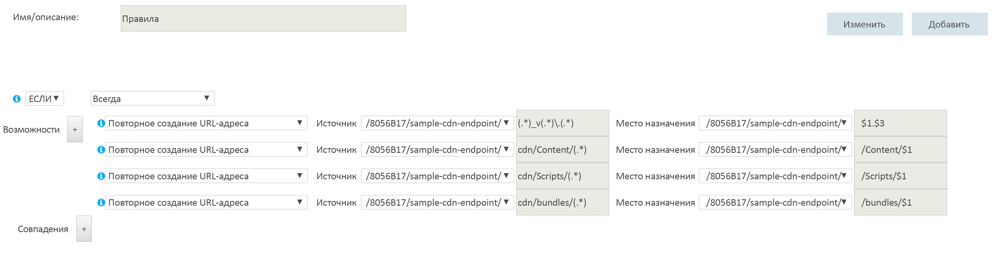

# <a name="content-delivery-network"></a><span data-ttu-id="6a130-103">Сеть доставки содержимого</span><span class="sxs-lookup"><span data-stu-id="6a130-103">Content Delivery Network</span></span>
[!INCLUDE [header](../_includes/header.md)]

<span data-ttu-id="6a130-104">[Сеть доставки содержимого (CDN)](/azure/cdn/cdn-overview) Microsoft Azure предлагает разработчикам глобальное решение по доставке содержимого, размещенного в Azure или любом другом расположении, по сети с высокой пропускной способностью.</span><span class="sxs-lookup"><span data-stu-id="6a130-104">The Microsoft Azure [Content Delivery Network (CDN)](/azure/cdn/cdn-overview) offers developers a global solution for delivering high-bandwidth content that is hosted in Azure or any other location.</span></span> <span data-ttu-id="6a130-105">Используя CDN, вы можете кэшировать общедоступные объекты, загруженные из хранилища BLOB-объектов, веб-приложения, виртуальной машины, папки приложения или другого расположения HTTP или HTTPS.</span><span class="sxs-lookup"><span data-stu-id="6a130-105">Using the CDN, you can cache publicly available objects loaded from Azure blob storage, a web application, virtual machine, application folder, or other HTTP/HTTPS location.</span></span> <span data-ttu-id="6a130-106">Кэш CDN может храниться в стратегически важных местах для обеспечения максимальной пропускной способности при доставке содержимого пользователям.</span><span class="sxs-lookup"><span data-stu-id="6a130-106">The CDN cache can be held at strategic locations to provide maximum bandwidth for delivering content to users.</span></span> <span data-ttu-id="6a130-107">CDN обычно используется для доставки статического содержимого, например изображений, таблиц стилей, документов, файлов, клиентских скриптов и HTML-страниц.</span><span class="sxs-lookup"><span data-stu-id="6a130-107">The CDN is typically used for delivering static content such as images, style sheets, documents, files, client-side scripts, and HTML pages.</span></span>

<span data-ttu-id="6a130-108">CDN можно также использовать как кэш для обслуживания динамического содержимого, например отчетов в формате PDF или графа на основе указанных входных данных. Если одни и те же входные значения предоставляются разными пользователями, выходные данные должны быть одинаковыми.</span><span class="sxs-lookup"><span data-stu-id="6a130-108">You can also use the CDN as a cache for serving dynamic content, such as a PDF report or graph based on specified inputs; if the same input values are provided by different users the result should be the same.</span></span>

<span data-ttu-id="6a130-109">Основные преимущества использования CDN: небольшая задержка и ускоренная доставка содержимого пользователям независимо от их географического расположения относительно центра обработки данных, в котором размещено приложение.</span><span class="sxs-lookup"><span data-stu-id="6a130-109">The major advantages of using the CDN are lower latency and faster delivery of content to users irrespective of their geographical location in relation to the datacenter where the application is hosted.</span></span>  


<span data-ttu-id="6a130-111">Использование CDN также позволяет снизить нагрузку на приложение благодаря отсутствию необходимости выполнять обработку, необходимую для доступа к содержимому и его доставки.</span><span class="sxs-lookup"><span data-stu-id="6a130-111">Using the CDN should also help to reduce the load on application because it is relieved of the processing required to access and deliver the content.</span></span> <span data-ttu-id="6a130-112">Уменьшение нагрузки позволяет повысить производительность и масштабируемость приложения, а также минимизировать затраты на размещение путем сокращения объема вычислительных ресурсов, необходимых для получения определенного уровня производительности и доступности.</span><span class="sxs-lookup"><span data-stu-id="6a130-112">This reduction in load can help to increase the performance and scalability of the application, as well as minimizing hosting costs by reducing the processing resources required to achieve a specific level of performance and availability.</span></span>

## <a name="how-and-why-a-cdn-is-used"></a><span data-ttu-id="6a130-113">Как и для чего используется CDN</span><span class="sxs-lookup"><span data-stu-id="6a130-113">How and why a CDN is used</span></span>
<span data-ttu-id="6a130-114">К типичным случаям использования CDN относятся:</span><span class="sxs-lookup"><span data-stu-id="6a130-114">Typical uses for a CDN include:</span></span>  

* <span data-ttu-id="6a130-115">Доставка статических ресурсов для клиентских приложений, часто с веб-сайта.</span><span class="sxs-lookup"><span data-stu-id="6a130-115">Delivering static resources for client applications, often from a website.</span></span> <span data-ttu-id="6a130-116">Это могут быть изображения, таблицы стилей, документы, файлы, клиентские скрипты, HTML-страницы, фрагменты HTML или любое другое содержимое, которое серверу не нужно изменять по каждому запросу.</span><span class="sxs-lookup"><span data-stu-id="6a130-116">These resources can be images, style sheets, documents, files, client-side scripts, HTML pages, HTML fragments, or any other content that the server does not need to modify for each request.</span></span> <span data-ttu-id="6a130-117">Приложение может создавать элементы во время выполнения и предоставлять их в сеть CDN (например, путем создания списка текущих новостей), но оно делает это не для каждого запроса.</span><span class="sxs-lookup"><span data-stu-id="6a130-117">The application can create items at runtime and make them available to the CDN (for example, by creating a list of current news headlines), but it does not do so for each request.</span></span>
* <span data-ttu-id="6a130-118">Доставка общедоступного статического и общего содержимого на устройства, например мобильные телефоны и планшетные компьютеры.</span><span class="sxs-lookup"><span data-stu-id="6a130-118">Delivering public static and shared content to devices such as mobile phones and tablet computers.</span></span> <span data-ttu-id="6a130-119">Само приложение является веб-службой, которая предоставляет доступ к API клиентам, запущенным на разных устройствах.</span><span class="sxs-lookup"><span data-stu-id="6a130-119">The application itself is a web service that offers an API to clients running on the various devices.</span></span> <span data-ttu-id="6a130-120">CDN также может доставлять статические наборы данных (через веб-службу) для использования клиентами, в том числе для создания пользовательского интерфейса клиента.</span><span class="sxs-lookup"><span data-stu-id="6a130-120">The CDN can also deliver static datasets (via the web service) for the clients to use, perhaps to generate the client UI.</span></span> <span data-ttu-id="6a130-121">Например, CDN можно использовать для распределения документов JSON или XML.</span><span class="sxs-lookup"><span data-stu-id="6a130-121">For example, the CDN could be used to distribute JSON or XML documents.</span></span>
* <span data-ttu-id="6a130-122">Предоставление веб-сайтов целиком (при условии, что они состоят только из общедоступного статического содержимого) клиентам без необходимости использовать выделенные вычислительные ресурсы.</span><span class="sxs-lookup"><span data-stu-id="6a130-122">Serving entire websites that consist of only public static content to clients, without requiring any dedicated compute resources.</span></span>
* <span data-ttu-id="6a130-123">Потоковая передача видеофайлов в клиент по запросу.</span><span class="sxs-lookup"><span data-stu-id="6a130-123">Streaming video files to the client on demand.</span></span> <span data-ttu-id="6a130-124">Видео передаются с низкой задержкой и по надежному подключению, доступному из центров обработки данных, расположенных по всему миру, которые предлагают подключения к сети CDN.</span><span class="sxs-lookup"><span data-stu-id="6a130-124">Video benefits from the low latency and reliable connectivity available from the globally located datacenters that offer CDN connections.</span></span> <span data-ttu-id="6a130-125">Службы мультимедиа Microsoft Azure (AMS) интегрируется с Azure CDN и напрямую доставляют в CDN содержимое для дальнейшего распространения.</span><span class="sxs-lookup"><span data-stu-id="6a130-125">Microsoft Azure Media Services (AMS) integrates with Azure CDN to deliver content directly to the CDN for further distribution.</span></span> <span data-ttu-id="6a130-126">Дополнительные сведения см. в статье [Общие сведения о конечных точках потоковой передачи](/azure/media-services/media-services-streaming-endpoints-overview).</span><span class="sxs-lookup"><span data-stu-id="6a130-126">For more information, see [Streaming endpoints overview](/azure/media-services/media-services-streaming-endpoints-overview).</span></span>
* <span data-ttu-id="6a130-127">Оптимизация взаимодействия для пользователей, особенно для тех, кто находится далеко от центра обработки, в котором размещено приложение.</span><span class="sxs-lookup"><span data-stu-id="6a130-127">Generally improving the experience for users, especially those located far from the datacenter hosting the application.</span></span> <span data-ttu-id="6a130-128">В противном случае такие пользователи могут испытывать большие задержки.</span><span class="sxs-lookup"><span data-stu-id="6a130-128">These users might otherwise suffer higher latency.</span></span> <span data-ttu-id="6a130-129">Большой объем содержимого в веб-приложении часто является статическим, а использование CDN поможет поддерживать производительность и общее качество взаимодействия с пользователями на нужном уровне, исключая при этом необходимость развертывания приложения в нескольких центрах обработки данных.</span><span class="sxs-lookup"><span data-stu-id="6a130-129">A large proportion of the total size of the content in a web application is often static, and using the CDN can help to maintain performance and overall user experience while eliminating the requirement to deploy the application to multiple data centers.</span></span>
* <span data-ttu-id="6a130-130">Обработка возрастающих нагрузок в приложениях с поддержкой решений IoT (Интернет вещей).</span><span class="sxs-lookup"><span data-stu-id="6a130-130">Handling the growing load on applications that support IoT (Internet of Things) solutions.</span></span> <span data-ttu-id="6a130-131">Большое количество таких устройств может легко перегрузить приложение, если оно используется для обработки широковещательных сообщений и управления обновлением встроенного ПО непосредственно для каждого устройства.</span><span class="sxs-lookup"><span data-stu-id="6a130-131">The huge numbers of such devices and appliances involved could easily overwhelm an application if it was required to process broadcast messages and manage firmware update distribution directly to each device.</span></span>
* <span data-ttu-id="6a130-132">Обработка пиковых нагрузок и бросков напряжения в использовании без масштабирования приложения и увеличения последующих затрат на его работу.</span><span class="sxs-lookup"><span data-stu-id="6a130-132">Coping with peaks and surges in demand without requiring the application to scale, avoiding the consequent increased running costs.</span></span> <span data-ttu-id="6a130-133">Например, при выпуске обновления операционной системы для оборудования (например, определенной модели маршрутизатора) либо пользовательского устройства (например, смарт-ТВ), возникает пиковое количество запросов, ведь оно скачивается миллионами пользователей и устройств за короткий период времени.</span><span class="sxs-lookup"><span data-stu-id="6a130-133">For example, when an update to an operating system is released for a hardware device such as a specific model of router, or for a consumer device such as a smart TV, there will be a huge peak in demand as it is downloaded by millions of users and devices over a short period.</span></span>

<span data-ttu-id="6a130-134">В следующем списке показаны примеры медианы времени до получения первого байта из разных географических расположений.</span><span class="sxs-lookup"><span data-stu-id="6a130-134">The following list shows examples of the median time to first byte from various geographic locations.</span></span> <span data-ttu-id="6a130-135">Целевая веб-роль развертывается в регионе "Запад США" Azure.</span><span class="sxs-lookup"><span data-stu-id="6a130-135">The target web role is deployed to Azure West US.</span></span> <span data-ttu-id="6a130-136">Чем ближе приложение к узлу CDN, тем значительнее ускорение работы от использования этой сети.</span><span class="sxs-lookup"><span data-stu-id="6a130-136">There is a strong correlation between greater boost due to the CDN and proximity to a CDN node.</span></span> <span data-ttu-id="6a130-137">Полный список расположений узлов Azure CDN доступен на странице [Расположения узлов сети доставки содержимого Azure](/azure/cdn/cdn-pop-locations/).</span><span class="sxs-lookup"><span data-stu-id="6a130-137">A complete list of Azure CDN node locations is available at [Azure Content Delivery Network (CDN) Node Locations](/azure/cdn/cdn-pop-locations/).</span></span>

|  | <span data-ttu-id="6a130-138">Время (мс) до получения первого байта (источник)</span><span class="sxs-lookup"><span data-stu-id="6a130-138">Time (ms) to First Byte (Origin)</span></span> | <span data-ttu-id="6a130-139">Время (мс) до первого (CDN)</span><span class="sxs-lookup"><span data-stu-id="6a130-139">Time (ms) to First (CDN)</span></span> | <span data-ttu-id="6a130-140">Улучшение времени CDN (%)</span><span class="sxs-lookup"><span data-stu-id="6a130-140">%CDN time improvement</span></span> |
| --- | --- | --- | --- |
| <span data-ttu-id="6a130-141">\*Сан-Хосе, Калифорния</span><span class="sxs-lookup"><span data-stu-id="6a130-141">\*San Jose, CA</span></span> |<span data-ttu-id="6a130-142">47,5</span><span class="sxs-lookup"><span data-stu-id="6a130-142">47.5</span></span> |<span data-ttu-id="6a130-143">46,5</span><span class="sxs-lookup"><span data-stu-id="6a130-143">46.5</span></span> |<span data-ttu-id="6a130-144">2 %</span><span class="sxs-lookup"><span data-stu-id="6a130-144">2%</span></span> |
| <span data-ttu-id="6a130-145">\*\*Даллес, Вирджиния</span><span class="sxs-lookup"><span data-stu-id="6a130-145">\*\*Dulles, VA</span></span> |<span data-ttu-id="6a130-146">109</span><span class="sxs-lookup"><span data-stu-id="6a130-146">109</span></span> |<span data-ttu-id="6a130-147">40,5</span><span class="sxs-lookup"><span data-stu-id="6a130-147">40.5</span></span> |<span data-ttu-id="6a130-148">169%</span><span class="sxs-lookup"><span data-stu-id="6a130-148">169%</span></span> |
| <span data-ttu-id="6a130-149">Буэнос-Айрес, Аргентина</span><span class="sxs-lookup"><span data-stu-id="6a130-149">Buenos Aires, AR</span></span> |<span data-ttu-id="6a130-150">210</span><span class="sxs-lookup"><span data-stu-id="6a130-150">210</span></span> |<span data-ttu-id="6a130-151">151</span><span class="sxs-lookup"><span data-stu-id="6a130-151">151</span></span> |<span data-ttu-id="6a130-152">39%</span><span class="sxs-lookup"><span data-stu-id="6a130-152">39%</span></span> |
| <span data-ttu-id="6a130-153">\*Лондон, Великобритания</span><span class="sxs-lookup"><span data-stu-id="6a130-153">\*London, UK</span></span> |<span data-ttu-id="6a130-154">195</span><span class="sxs-lookup"><span data-stu-id="6a130-154">195</span></span> |<span data-ttu-id="6a130-155">44</span><span class="sxs-lookup"><span data-stu-id="6a130-155">44</span></span> |<span data-ttu-id="6a130-156">343%</span><span class="sxs-lookup"><span data-stu-id="6a130-156">343%</span></span> |
| <span data-ttu-id="6a130-157">Шанхай, Китай</span><span class="sxs-lookup"><span data-stu-id="6a130-157">Shanghai, CN</span></span> |<span data-ttu-id="6a130-158">242</span><span class="sxs-lookup"><span data-stu-id="6a130-158">242</span></span> |<span data-ttu-id="6a130-159">206</span><span class="sxs-lookup"><span data-stu-id="6a130-159">206</span></span> |<span data-ttu-id="6a130-160">17%</span><span class="sxs-lookup"><span data-stu-id="6a130-160">17%</span></span> |
| <span data-ttu-id="6a130-161">\*Сингапур</span><span class="sxs-lookup"><span data-stu-id="6a130-161">\*Singapore</span></span> |<span data-ttu-id="6a130-162">214</span><span class="sxs-lookup"><span data-stu-id="6a130-162">214</span></span> |<span data-ttu-id="6a130-163">74</span><span class="sxs-lookup"><span data-stu-id="6a130-163">74</span></span> |<span data-ttu-id="6a130-164">189 %</span><span class="sxs-lookup"><span data-stu-id="6a130-164">189%</span></span> |
| <span data-ttu-id="6a130-165">\*Токио, Япония</span><span class="sxs-lookup"><span data-stu-id="6a130-165">\*Tokyo, JP</span></span> |<span data-ttu-id="6a130-166">163</span><span class="sxs-lookup"><span data-stu-id="6a130-166">163</span></span> |<span data-ttu-id="6a130-167">48</span><span class="sxs-lookup"><span data-stu-id="6a130-167">48</span></span> |<span data-ttu-id="6a130-168">204 %</span><span class="sxs-lookup"><span data-stu-id="6a130-168">204%</span></span> |
| <span data-ttu-id="6a130-169">Сеул, Корея</span><span class="sxs-lookup"><span data-stu-id="6a130-169">Seoul, KR</span></span> |<span data-ttu-id="6a130-170">190</span><span class="sxs-lookup"><span data-stu-id="6a130-170">190</span></span> |<span data-ttu-id="6a130-171">190</span><span class="sxs-lookup"><span data-stu-id="6a130-171">190</span></span> |<span data-ttu-id="6a130-172">0%</span><span class="sxs-lookup"><span data-stu-id="6a130-172">0%</span></span> |

<span data-ttu-id="6a130-173">\* Узел Azure CDN расположен в одном городе.</span><span class="sxs-lookup"><span data-stu-id="6a130-173">\* Has an Azure CDN node in the same city.</span></span>  
<span data-ttu-id="6a130-174">\*\* Узел Azure CDN расположен в соседнем городе.</span><span class="sxs-lookup"><span data-stu-id="6a130-174">\*\* Has an Azure CDN node in a neighboring city.</span></span>  

## <a name="challenges"></a><span data-ttu-id="6a130-175">Сложности</span><span class="sxs-lookup"><span data-stu-id="6a130-175">Challenges</span></span>
<span data-ttu-id="6a130-176">При планировании использования CDN следует учитывать некоторые сложности.</span><span class="sxs-lookup"><span data-stu-id="6a130-176">There are several challenges to take into account when planning to use the CDN:</span></span>  

* <span data-ttu-id="6a130-177">**Развертывание**.</span><span class="sxs-lookup"><span data-stu-id="6a130-177">**Deployment**.</span></span> <span data-ttu-id="6a130-178">Определите источник, из которого CDN получает содержимое, а также решите, нужно ли развертывать содержимое больше, чем в одной системе хранения данных (например, в CDN и альтернативном расположении).</span><span class="sxs-lookup"><span data-stu-id="6a130-178">Decide the origin from which the CDN fetches the content, and whether you need to deploy the content in more than one storage system (such as in the CDN and an alternative location).</span></span>

  <span data-ttu-id="6a130-179">Механизм развертывания приложения должен учитывать особенности процесса развертывания не только статического содержимого и ресурсов, но и файлов приложений, например страниц ASPX.</span><span class="sxs-lookup"><span data-stu-id="6a130-179">Your application deployment mechanism must take into account the process for deploying static content and resources as well as deploying the application files, such as ASPX pages.</span></span> <span data-ttu-id="6a130-180">Например, вам может понадобиться выполнить отдельное действие по загрузке содержимого в хранилище BLOB-объектов Azure.</span><span class="sxs-lookup"><span data-stu-id="6a130-180">For example, you may need to implement a separate step to load content into Azure blob storage.</span></span>
* <span data-ttu-id="6a130-181">**Управление версиями и кэшем**.</span><span class="sxs-lookup"><span data-stu-id="6a130-181">**Versioning and cache-control**.</span></span> <span data-ttu-id="6a130-182">Выберите способы обновления статического содержимого и развертывания новых версий.</span><span class="sxs-lookup"><span data-stu-id="6a130-182">Consider how you will update static content and deploy new versions.</span></span> <span data-ttu-id="6a130-183">Содержимое CDN можно [очищать](/azure/cdn/cdn-purge-endpoint/) с помощью портала Azure, когда появляются новые версии ресурсов.</span><span class="sxs-lookup"><span data-stu-id="6a130-183">The CDN content may be [purged](/azure/cdn/cdn-purge-endpoint/) using the Azure portal when new versions of your assets are available.</span></span> <span data-ttu-id="6a130-184">Это задача аналогична задаче управления кэшированием на стороне клиента, например в браузере.</span><span class="sxs-lookup"><span data-stu-id="6a130-184">This is a similar challenge to managing client-side caching, such as that which occurs in a web browser.</span></span>
* <span data-ttu-id="6a130-185">**Тестирование**.</span><span class="sxs-lookup"><span data-stu-id="6a130-185">**Testing**.</span></span> <span data-ttu-id="6a130-186">Выполнение локального тестирования параметров CDN при разработке и тестировании приложения локально или в промежуточной среде может представлять сложности.</span><span class="sxs-lookup"><span data-stu-id="6a130-186">It can be difficult to perform local testing of your CDN settings when developing and testing an application locally or in a staging environment.</span></span>
* <span data-ttu-id="6a130-187">**Оптимизация для поисковых систем (SEO)**.</span><span class="sxs-lookup"><span data-stu-id="6a130-187">**Search engine optimization (SEO)**.</span></span> <span data-ttu-id="6a130-188">Содержимое, например изображения и документы, передаются из другого домена при использовании CDN,</span><span class="sxs-lookup"><span data-stu-id="6a130-188">Content such as images and documents are served from a different domain when you use the CDN.</span></span> <span data-ttu-id="6a130-189">что может повлиять на SEO для этого содержимого.</span><span class="sxs-lookup"><span data-stu-id="6a130-189">This can have an effect on SEO for this content.</span></span>
* <span data-ttu-id="6a130-190">**Безопасность содержимого**.</span><span class="sxs-lookup"><span data-stu-id="6a130-190">**Content security**.</span></span> <span data-ttu-id="6a130-191">Многие службы CDN, например Azure CDN, сейчас не предлагают какие-либо типы контроля доступа к содержимому.</span><span class="sxs-lookup"><span data-stu-id="6a130-191">Many CDN services such as Azure CDN do not currently offer any type of access control for the content.</span></span>
* <span data-ttu-id="6a130-192">**Безопасность клиента**.</span><span class="sxs-lookup"><span data-stu-id="6a130-192">**Client security**.</span></span> <span data-ttu-id="6a130-193">Клиенты могут подключаться из среды, которая не разрешает доступ к ресурсам в CDN.</span><span class="sxs-lookup"><span data-stu-id="6a130-193">Clients might connect from an environment that does not allow access to resources on the CDN.</span></span> <span data-ttu-id="6a130-194">Это может быть среда с правилами безопасности, которая предоставляет доступ только к набору известных ресурсов или которая предотвращает загрузку ресурсов из любого расположения, кроме исходной страницы.</span><span class="sxs-lookup"><span data-stu-id="6a130-194">This could be a security-constrained environment that limits access to only a set of known sources, or one that prevents loading of resources from anything other than the page origin.</span></span> <span data-ttu-id="6a130-195">В таких случаях требуется выполнить откат.</span><span class="sxs-lookup"><span data-stu-id="6a130-195">A fallback implementation is required to handle these cases.</span></span>
* <span data-ttu-id="6a130-196">**Устойчивость**.</span><span class="sxs-lookup"><span data-stu-id="6a130-196">**Resilience**.</span></span> <span data-ttu-id="6a130-197">CDN — это потенциальная единая точка отказа для приложения.</span><span class="sxs-lookup"><span data-stu-id="6a130-197">The CDN is a potential single point of failure for an application.</span></span> <span data-ttu-id="6a130-198">Она имеет соглашение об уровне обслуживания с более низкой доступностью по сравнению с хранилищем больших двоичных объектов (которое можно использовать для доставки содержимого напрямую), поэтому вам может потребоваться реализовать механизм отработки отказа для критически важного содержимого.</span><span class="sxs-lookup"><span data-stu-id="6a130-198">It has a lower availability SLA than blob storage (which can be used to deliver content directly) so you may need to consider implementing a fallback mechanism for critical content.</span></span>

  <span data-ttu-id="6a130-199">Вы можете отслеживать доступность содержимого CDN, пропускную способность, передаваемые данные, попадания в кэш, коэффициент попаданий в кэш, а также метрики кэша на портале Azure [в режиме реального времени](/azure/cdn/cdn-real-time-stats/) и (или) [в статистических отчетах](/azure/cdn/cdn-analyze-usage-patterns/).</span><span class="sxs-lookup"><span data-stu-id="6a130-199">You can monitor your CDN content availability, bandwidth, data transferred, hits, cache hit ratio, and cache metrics from the Azure portal in [real-time](/azure/cdn/cdn-real-time-stats/) and [aggregate reports](/azure/cdn/cdn-analyze-usage-patterns/).</span></span>

<span data-ttu-id="6a130-200">Сценарии, в которых сеть CDN может быть менее эффективной.</span><span class="sxs-lookup"><span data-stu-id="6a130-200">Scenarios where CDN may be less useful include:</span></span>  

* <span data-ttu-id="6a130-201">Если содержимое используется редко, к нему выполняется мало обращений, пока оно остается действительным (в зависимости от указанного срока жизни).</span><span class="sxs-lookup"><span data-stu-id="6a130-201">If the content has a low hit rate, it might be accessed only few times while it is valid (determined by its time-to-live setting).</span></span> <span data-ttu-id="6a130-202">При первом скачивании элемента с вас взимается плата за две транзакции (от источника в CDN, а затем от CDN пользователю).</span><span class="sxs-lookup"><span data-stu-id="6a130-202">The first time an item is downloaded you incur two transaction charges from the origin to the CDN, and then from the CDN to the customer.</span></span>
* <span data-ttu-id="6a130-203">Если данные являются конфиденциальными, например в больших организациях или экосистемах цепочки поставок.</span><span class="sxs-lookup"><span data-stu-id="6a130-203">If the data is private, such as for large enterprises or supply chain ecosystems.</span></span>

## <a name="general-guidelines-and-good-practices"></a><span data-ttu-id="6a130-204">Общие инструкции и рекомендации</span><span class="sxs-lookup"><span data-stu-id="6a130-204">General guidelines and good practices</span></span>
<span data-ttu-id="6a130-205">Использование CDN — это хороший способ минимизировать нагрузку на приложение и максимально повысить доступность и производительность.</span><span class="sxs-lookup"><span data-stu-id="6a130-205">Using the CDN is a good way to minimize the load on your application, and maximize availability and performance.</span></span> <span data-ttu-id="6a130-206">Попробуйте внедрить эту стратегию для всего содержимого и любых ресурсов, которые использует ваше приложение.</span><span class="sxs-lookup"><span data-stu-id="6a130-206">Consider adopting this strategy for all of the appropriate content and resources your application uses.</span></span> <span data-ttu-id="6a130-207">При разработке стратегии по использованию CDN необходимо учитывать следующее.</span><span class="sxs-lookup"><span data-stu-id="6a130-207">Consider the points in the following sections when designing your strategy to use the CDN:</span></span>  

### <a name="origin"></a><span data-ttu-id="6a130-208">Исходный домен</span><span class="sxs-lookup"><span data-stu-id="6a130-208">Origin</span></span>
<span data-ttu-id="6a130-209">Для развертывания содержимого в CDN необходимо просто указать [конечную точку](/azure/cdn/cdn-create-new-endpoint) HTTP и (или) HTTPS, которую служба CDN будет использовать для доступа к содержимому и его кэширования.</span><span class="sxs-lookup"><span data-stu-id="6a130-209">Deploying content through the CDN simply requires you to specify an HTTP and/or HTTPS [endpoint](/azure/cdn/cdn-create-new-endpoint) that the CDN service will use to access and cache the content.</span></span>

<span data-ttu-id="6a130-210">Конечная точка может определять контейнер хранилища BLOB-объектов Azure, содержащий статическое содержимое, которое будет поставляться через CDN.</span><span class="sxs-lookup"><span data-stu-id="6a130-210">The endpoint can specify an Azure blob storage container that holds the static content you want to deliver through the CDN.</span></span> <span data-ttu-id="6a130-211">Контейнер должен быть помечен как общедоступный.</span><span class="sxs-lookup"><span data-stu-id="6a130-211">The container must be marked as public.</span></span> <span data-ttu-id="6a130-212">В сети CDN будут доступны только большие двоичные объекты, размещенные в общедоступном контейнере с открытым доступом на чтение.</span><span class="sxs-lookup"><span data-stu-id="6a130-212">Only blobs in a public container that have public read access are available through the CDN.</span></span>

<span data-ttu-id="6a130-213">Конечная точка может указать папку с именем **cdn** в корне одного из вычислительных слоев приложения (например, веб-роли или виртуальной машины).</span><span class="sxs-lookup"><span data-stu-id="6a130-213">The endpoint can specify a folder named **cdn** in the root of one of application’s compute layers (such as a web role or a virtual machine).</span></span> <span data-ttu-id="6a130-214">Результаты запросов на ресурсы, включая динамические ресурсы, такие как страницы ASPX, будут кэшированы в CDN.</span><span class="sxs-lookup"><span data-stu-id="6a130-214">The results from requests for resources, including dynamic resources such as ASPX pages, will be cached on the CDN.</span></span> <span data-ttu-id="6a130-215">Минимальный период кэширования составляет 300 секунд.</span><span class="sxs-lookup"><span data-stu-id="6a130-215">The minimum cache period is 300 seconds.</span></span> <span data-ttu-id="6a130-216">Более короткий период не позволяет выполнить развертывание содержимого в CDN (дополнительные сведения см. в разделе *Управление кэшем* ниже).</span><span class="sxs-lookup"><span data-stu-id="6a130-216">Any shorter period prevents the content from being deployed to the CDN (for more information, see the following heading *Cache control* below).</span></span>

<span data-ttu-id="6a130-217">При использовании веб-приложений в качестве конечной точки задается корневая папка сайта. Для этого необходимо выбрать сайт при создании экземпляра CDN.</span><span class="sxs-lookup"><span data-stu-id="6a130-217">If you are using Azure Web Apps, the endpoint is set to the root folder of the site by selecting the site when creating the CDN instance.</span></span> <span data-ttu-id="6a130-218">Все содержимое сайта будет доступно в CDN.</span><span class="sxs-lookup"><span data-stu-id="6a130-218">All of the content for the site will be available through the CDN.</span></span>

<span data-ttu-id="6a130-219">В большинстве случаев вы можете увеличить гибкость и контроль, если конечная точка CDN будет указывать на папку в одном из вычислительных слоев приложения.</span><span class="sxs-lookup"><span data-stu-id="6a130-219">In most cases, pointing your CDN endpoint at a folder within one of the compute layers of your application offers more flexibility and control.</span></span> <span data-ttu-id="6a130-220">Например, станет проще управлять текущими и будущими требованиями к маршрутизации, а также динамически создавать статическое содержимое, например эскизы изображений.</span><span class="sxs-lookup"><span data-stu-id="6a130-220">For instance, it makes it easier to manage current and future routing requirements, and dynamically generate static content such as image thumbnails.</span></span>

<span data-ttu-id="6a130-221">Если содержимое поставляется из динамических источников, таких как страницы ASPX, то для разделения объектов кэша можно использовать [строки запросов](/azure/cdn/cdn-query-string/).</span><span class="sxs-lookup"><span data-stu-id="6a130-221">You can use [query strings](/azure/cdn/cdn-query-string/) to differentiate objects in the cache when content is delivered from dynamic sources, such as ASPX pages.</span></span> <span data-ttu-id="6a130-222">Это поведение можно отключить, установив соответствующий параметр на портале Azure при указании конечной точки CDN.</span><span class="sxs-lookup"><span data-stu-id="6a130-222">However, this behavior can be disabled by a setting in the Azure portal when you specify the CDN endpoint.</span></span> <span data-ttu-id="6a130-223">При доставке содержимого из хранилища больших двоичных объектов строки запросов рассматриваются как строковые литералы, поэтому два элемента с одинаковыми именами и разными строками запроса сохраняются в CDN в виде отдельных элементов.</span><span class="sxs-lookup"><span data-stu-id="6a130-223">When delivering content from blob storage, query strings are treated as string literals so two items that have the same name but different query strings are stored as separate items on the CDN.</span></span>

<span data-ttu-id="6a130-224">Для таких ресурсов, как скрипты и другое содержимое, можно использовать переопределение URL-адресов, чтобы избежать перемещения файлов в папку источника CDN.</span><span class="sxs-lookup"><span data-stu-id="6a130-224">You can utilize URL rewriting for resources, such as scripts and other content, to avoid moving your files to the CDN origin folder.</span></span>

<span data-ttu-id="6a130-225">Если вы используете для хранения содержимого сети CDN большие двоичные объекты Azure, для имен контейнеров и больших двоичных объектов в URL-адресах ресурсов учитывается регистр.</span><span class="sxs-lookup"><span data-stu-id="6a130-225">When using Azure storage blobs to hold content for the CDN, the URL of the resources in blobs is case-sensitive for the container and blob name.</span></span>

<span data-ttu-id="6a130-226">При использовании пользовательских источников или веб-приложений Azure следует указать путь к экземпляру CDN в ссылках на ресурсы.</span><span class="sxs-lookup"><span data-stu-id="6a130-226">When using custom origins or Azure Web Apps, you specify the path to the CDN instance in the links to resources.</span></span> <span data-ttu-id="6a130-227">Например, ниже указан файл изображения в папке **Images** (Изображения) для сайта, который будет доставлен через CDN:</span><span class="sxs-lookup"><span data-stu-id="6a130-227">For example, the following specifies an image file in the **Images** folder of the site that will be delivered through the CDN:</span></span>

```XML

```

### <a name="deployment"></a><span data-ttu-id="6a130-228">Развертывание</span><span class="sxs-lookup"><span data-stu-id="6a130-228">Deployment</span></span>
<span data-ttu-id="6a130-229">Может потребоваться подготовить и развернуть статическое содержимое независимо от приложения, если вы не включите его в пакет или процесс развертывания приложения.</span><span class="sxs-lookup"><span data-stu-id="6a130-229">Static content may need to be provisioned and deployed independently from the application if you do not include it in the application deployment package or process.</span></span> <span data-ttu-id="6a130-230">Рассмотрите, как это повлияет на подход к управлению версиями, который используется для компонентов приложения и содержимого статических ресурсов.</span><span class="sxs-lookup"><span data-stu-id="6a130-230">Consider how this will affect the versioning approach you use to manage both the application components and the static resource content.</span></span>

<span data-ttu-id="6a130-231">Узнайте, как будет обрабатываться объединение (совмещение нескольких файлов в один) и минификация (удаление ненужных символов, например пробелов, символов новой строки, комментариев и других символов) для скрипта и CSS-файлов.</span><span class="sxs-lookup"><span data-stu-id="6a130-231">Consider how bundling (combining several files into one file) and minification (removing unnecessary characters such as white space, new line characters, comments, and other characters) for script and CSS files will be handled.</span></span> <span data-ttu-id="6a130-232">Эти распространенные подходы позволяют сократить время загрузки для клиентов; кроме того, они совместимы с доставкой содержимого через CDN.</span><span class="sxs-lookup"><span data-stu-id="6a130-232">These are commonly used techniques that can reduce load times for clients, and are compatible with delivering content through the CDN.</span></span> <span data-ttu-id="6a130-233">Дополнительные сведения см. в статье [Объединение и минификация](http://www.asp.net/mvc/tutorials/mvc-4/bundling-and-minification).</span><span class="sxs-lookup"><span data-stu-id="6a130-233">For more information, see [Bundling and Minification](http://www.asp.net/mvc/tutorials/mvc-4/bundling-and-minification).</span></span>

<span data-ttu-id="6a130-234">Если вам нужно развернуть содержимое в дополнительное расположение, это потребуется сделать в дополнительном шаге развертывания.</span><span class="sxs-lookup"><span data-stu-id="6a130-234">If you need to deploy the content to an additional location, this will be an extra step in the deployment process.</span></span> <span data-ttu-id="6a130-235">Если приложение обновляет содержимое для CDN регулярно или в ответ на событие, оно должно сохранять обновленное содержимое и конечную точку CDN во всех дополнительных расположениях.</span><span class="sxs-lookup"><span data-stu-id="6a130-235">If the application updates the content for the CDN, perhaps at regular intervals or in response to an event, it must store the updated content in any additional locations as well as the endpoint for the CDN.</span></span>

<span data-ttu-id="6a130-236">Задать конечную точку CDN для приложения в локальном эмуляторе Azure в Visual Studio нельзя.</span><span class="sxs-lookup"><span data-stu-id="6a130-236">You cannot set up a CDN endpoint for an application in the local Azure emulator in Visual Studio.</span></span> <span data-ttu-id="6a130-237">Это ограничение повлияет на модульное и функциональное тестирование, а также финальное тестирование перед развертыванием.</span><span class="sxs-lookup"><span data-stu-id="6a130-237">This restriction will affect unit testing, functional testing, and final pre-deployment testing.</span></span> <span data-ttu-id="6a130-238">Это необходимо учесть и реализовать альтернативный механизм.</span><span class="sxs-lookup"><span data-stu-id="6a130-238">You must allow for this by implementing an alternative mechanism.</span></span> <span data-ttu-id="6a130-239">Например, вы можете предварительно развернуть содержимое в CDN с помощью пользовательского приложения или служебной программы, а затем выполнить тестирование во время периода кэширования.</span><span class="sxs-lookup"><span data-stu-id="6a130-239">For example, you could pre-deploy the content to the CDN using a custom application or utility, and perform testing during the period in which it is cached.</span></span> <span data-ttu-id="6a130-240">Кроме того, можно воспользоваться директивами компилятора или глобальными константами для управления расположением, из которого приложение загружает ресурсы.</span><span class="sxs-lookup"><span data-stu-id="6a130-240">Alternatively, use compile directives or global constants to control from where the application loads the resources.</span></span> <span data-ttu-id="6a130-241">Например, при запуске в режиме отладки можно загрузить такие ресурсы, как клиентские наборы скриптов и другое содержимое из локальной папки, и использовать CDN при запуске в режиме выпуска.</span><span class="sxs-lookup"><span data-stu-id="6a130-241">For example, when running in debug mode it could load resources such as client-side script bundles and other content from a local folder, and use the CDN when running in release mode.</span></span>

<span data-ttu-id="6a130-242">Выберите метод сжатия, который должен поддерживаться CDN.</span><span class="sxs-lookup"><span data-stu-id="6a130-242">Consider which compression approach you want your CDN to support:</span></span>

* <span data-ttu-id="6a130-243">Можно [включить сжатие](/azure/cdn/cdn-improve-performance/) на сервере-источнике. В этом случае CDN будет поддерживать сжатие по умолчанию и доставлять клиентам содержимое, сжатое в таких форматах, как ZIP или GZIP.</span><span class="sxs-lookup"><span data-stu-id="6a130-243">You can [enable compression](/azure/cdn/cdn-improve-performance/) on your origin server, in which case the CDN will support compression by default and deliver compressed content to clients in a format such as zip or gzip.</span></span> <span data-ttu-id="6a130-244">При использовании папки приложения в качестве конечной точки CDN сервер может сжимать часть содержимого автоматически — так же, как и при доставке непосредственно в браузер или другой тип клиента.</span><span class="sxs-lookup"><span data-stu-id="6a130-244">When using an application folder as the CDN endpoint, the server may compress some content automatically in the same way as when delivering it directly to a web browser or other type of client.</span></span> <span data-ttu-id="6a130-245">Формат зависит от значения заголовка **Accept-Encoding** в запросе, отправленном клиентом.</span><span class="sxs-lookup"><span data-stu-id="6a130-245">The format depends on the value of the **Accept-Encoding** header in the request sent by the client.</span></span> <span data-ttu-id="6a130-246">В Azure содержимое автоматически сжимается по умолчанию, если загрузка ЦП не превышает 50 %.</span><span class="sxs-lookup"><span data-stu-id="6a130-246">In Azure the default mechanism is to automatically compress content when CPU utilization is below 50%.</span></span> <span data-ttu-id="6a130-247">Если приложение размещается в облачной службе, возможно, при изменении параметров потребуется выполнить задачу запуска, чтобы включить сжатие динамических выходных данных в IIS.</span><span class="sxs-lookup"><span data-stu-id="6a130-247">If you are using a cloud service to host the application, changing the settings may require using a startup task to turn on compression of dynamic output in IIS.</span></span> <span data-ttu-id="6a130-248">Дополнительные сведения см. в статье [Включение сжатия GZIP в Microsoft Azure CDN с помощью веб-роли](http://blogs.msdn.com/b/avkashchauhan/archive/2012/03/05/enableing-gzip-compression-with-windows-azure-cdn-through-web-role.aspx).</span><span class="sxs-lookup"><span data-stu-id="6a130-248">See [Enabling gzip compression with Microsoft Azure CDN through a Web Role](http://blogs.msdn.com/b/avkashchauhan/archive/2012/03/05/enableing-gzip-compression-with-windows-azure-cdn-through-web-role.aspx) for more information.</span></span>
* <span data-ttu-id="6a130-249">Можно включить сжатие непосредственно на пограничных серверах CDN — в таком случае CDN будет сжимать файлы и доставлять их конечным пользователям.</span><span class="sxs-lookup"><span data-stu-id="6a130-249">You can enable compression directly on CDN edge servers, in which case the CDN will compress the files and serve it to end users.</span></span> <span data-ttu-id="6a130-250">Дополнительные сведения см. в статье [Сжатие Azure CDN](/azure/cdn/cdn-improve-performance/).</span><span class="sxs-lookup"><span data-stu-id="6a130-250">For more information, see [Azure CDN Compression](/azure/cdn/cdn-improve-performance/).</span></span>

### <a name="routing-and-versioning"></a><span data-ttu-id="6a130-251">Маршрутизация и управление версиями</span><span class="sxs-lookup"><span data-stu-id="6a130-251">Routing and versioning</span></span>
<span data-ttu-id="6a130-252">Вы можете использовать разные экземпляры CDN в разные моменты времени.</span><span class="sxs-lookup"><span data-stu-id="6a130-252">You may need to use different CDN instances at various times.</span></span> <span data-ttu-id="6a130-253">Например, при развертывании новой версии приложения можно использовать новую сеть CDN, а старую сеть CDN (вместе с содержимым в старом формате) оставить для предыдущих версий.</span><span class="sxs-lookup"><span data-stu-id="6a130-253">For example, when you deploy a new version of the application you may want to use a new CDN and retain the old CDN (holding content in an older format) for previous versions.</span></span> <span data-ttu-id="6a130-254">Если вы используете хранилище больших двоичных объектов Azure в качестве источника содержимого, вы можете создать отдельную учетную запись хранения или отдельный контейнер и указать его в качестве конечной точки CDN.</span><span class="sxs-lookup"><span data-stu-id="6a130-254">If you use Azure blob storage as the content origin, you can create a separate storage account or a separate container and point the CDN endpoint to it.</span></span> <span data-ttu-id="6a130-255">Если вы используете корневую папку cdn в качестве конечной точки CDN в приложении, с помощью переопределения URL-адресов вы можете направлять запросы в другую папку.</span><span class="sxs-lookup"><span data-stu-id="6a130-255">If you use the cdn root folder within the application as the CDN endpoint, you can use URL rewriting techniques to direct requests to a different folder.</span></span>

<span data-ttu-id="6a130-256">Не используйте строку запроса для указания разных версий приложения в ссылках на ресурсы CDN, так как при получении содержимого из хранилища BLOB-объектов Azure строка запроса является частью имени ресурса (имени большого двоичного объекта).</span><span class="sxs-lookup"><span data-stu-id="6a130-256">Do not use the query string to denote different versions of the application in links to resources on the CDN because, when retrieving content from Azure blob storage, the query string is part of the resource name (the blob name).</span></span> <span data-ttu-id="6a130-257">Это может повлиять на способ кэширования ресурсов клиентом.</span><span class="sxs-lookup"><span data-stu-id="6a130-257">This approach can also affect how the client caches resources.</span></span>

<span data-ttu-id="6a130-258">Развертывание новых версий статического содержимого при обновлении приложения может представлять сложность, если предыдущие ресурсы кэшировались в CDN.</span><span class="sxs-lookup"><span data-stu-id="6a130-258">Deploying new versions of static content when you update an application can be a challenge if the previous resources are cached on the CDN.</span></span> <span data-ttu-id="6a130-259">Дополнительные сведения см. в статье *Управление кэшем*.</span><span class="sxs-lookup"><span data-stu-id="6a130-259">For more information, see the section *Cache control*).</span></span>

<span data-ttu-id="6a130-260">Доступ к содержимому CDN можно ограничивать по странам.</span><span class="sxs-lookup"><span data-stu-id="6a130-260">Consider restricting the CDN content access by country.</span></span> <span data-ttu-id="6a130-261">Azure CDN позволяет отфильтровывать запросы на основе страны происхождения, ограничивая доставку содержимого.</span><span class="sxs-lookup"><span data-stu-id="6a130-261">Azure CDN allows you to filter requests based on the country of origin and restrict the content delivered.</span></span> <span data-ttu-id="6a130-262">Дополнительные сведения см. в статье [Ограничение доступа к содержимому по странам](/azure/cdn/cdn-restrict-access-by-country/).</span><span class="sxs-lookup"><span data-stu-id="6a130-262">For more information, see [Restrict access to your content by country](/azure/cdn/cdn-restrict-access-by-country/).</span></span>

### <a name="cache-control"></a><span data-ttu-id="6a130-263">управление кэшем;</span><span class="sxs-lookup"><span data-stu-id="6a130-263">Cache control</span></span>
<span data-ttu-id="6a130-264">Выберите способ управления кэшированием в системе.</span><span class="sxs-lookup"><span data-stu-id="6a130-264">Consider how to manage caching within the system.</span></span> <span data-ttu-id="6a130-265">Например, при использовании папки в качестве источника CDN вы можете указать возможность кэширования страниц, которые создают содержимое, а также срок истечения действия содержимого для всех ресурсов в определенной папке.</span><span class="sxs-lookup"><span data-stu-id="6a130-265">For example, when using a folder as the CDN origin you can specify the cacheability of pages that generate the content, and the content expiry time for all the resources in a specific folder.</span></span> <span data-ttu-id="6a130-266">Вы можете также указать свойства кэша для CDN и для клиента, использующего стандартные заголовки HTTP.</span><span class="sxs-lookup"><span data-stu-id="6a130-266">You can also specify cache properties for the CDN, and for the client using standard HTTP headers.</span></span> <span data-ttu-id="6a130-267">Хотя вы, скорее всего, уже управляете кэшированием на сервере и клиенте, сеть CDN позволит получить дополнительные сведения о способе и месте кэширования содержимого.</span><span class="sxs-lookup"><span data-stu-id="6a130-267">Although you should already be managing caching on the server and client, using the CDN will help to make you more aware of how your content is cached, and where.</span></span>

<span data-ttu-id="6a130-268">Чтобы запретить доступ к объектам в CDN, их можно удалить из источника (контейнера больших двоичных объектов или корневой папки *cdn* приложения). Кроме того, можно удалить конечную точку CDN или, в случае хранилища BLOB-объектов, сделать контейнер или большой двоичный объект закрытым.</span><span class="sxs-lookup"><span data-stu-id="6a130-268">To prevent objects from being available on the CDN you can delete them from the origin (blob container or application *cdn* root folder), remove or delete the CDN endpoint, or, in the case of blob storage, make the container or blob private.</span></span> <span data-ttu-id="6a130-269">При этом элементы будут удалены из CDN только по истечении их срока жизни.</span><span class="sxs-lookup"><span data-stu-id="6a130-269">However, items will be removed from the CDN only when their time-to-live expires.</span></span> <span data-ttu-id="6a130-270">Если период истечения срока действия кэша не указан (например, если содержимое загружается из хранилища BLOB-объектов), оно хранится в CDN не более 7 дней.</span><span class="sxs-lookup"><span data-stu-id="6a130-270">If no cache expiry period is specified (such as when content is loaded from blob storage), it is cached on the CDN for up to seven days.</span></span>  <span data-ttu-id="6a130-271">Можно также вручную [очистить конечную точку CDN](/azure/cdn/cdn-purge-endpoint/).</span><span class="sxs-lookup"><span data-stu-id="6a130-271">You can also manually [purge a CDN endpoint](/azure/cdn/cdn-purge-endpoint/).</span></span>

<span data-ttu-id="6a130-272">В веб-приложении можно задать параметры кэширования и срок истечения действия для всего содержимого с помощью элемента *clientCache* в разделе *system.webServer/staticContent* файла web.config.</span><span class="sxs-lookup"><span data-stu-id="6a130-272">In a web application, you can set the caching and expiry for all content by using the *clientCache* element in the *system.webServer/staticContent* section of the web.config file.</span></span> <span data-ttu-id="6a130-273">Учтите, что размещение файла web.config в какой-либо папке влияет на файлы в этой папке и всех вложенных папках.</span><span class="sxs-lookup"><span data-stu-id="6a130-273">Remember that when you place a web.config file in a folder it affects the files in that folder and all subfolders.</span></span>

<span data-ttu-id="6a130-274">Если содержимое для CDN создается динамически (например, в коде вашего приложения), убедитесь, что вы указали свойство *Cache.SetExpires* на каждой странице.</span><span class="sxs-lookup"><span data-stu-id="6a130-274">If you create the content for the CDN dynamically (in your application code for example), ensure that you specify the *Cache.SetExpires* property on each page.</span></span> <span data-ttu-id="6a130-275">CDN не будет кэшировать выходные данные со страниц, которые используют для возможности кэширования стандартный параметр *public*.</span><span class="sxs-lookup"><span data-stu-id="6a130-275">The CDN will not cache the output from pages that use the default cacheability setting of *public*.</span></span>  <span data-ttu-id="6a130-276">Задайте нужное значение для срока истечения действия кэша, чтобы гарантировать, что содержимое не будет удаляться или перезагружаться из приложения через очень короткие интервалы времени.</span><span class="sxs-lookup"><span data-stu-id="6a130-276">Set the cache expiry period to a suitable value to ensure that the content is not discarded and reloaded from the application at very short intervals.</span></span>  

### <a name="security"></a><span data-ttu-id="6a130-277">Безопасность</span><span class="sxs-lookup"><span data-stu-id="6a130-277">Security</span></span>
<span data-ttu-id="6a130-278">CDN может доставлять содержимое по протоколу HTTPS (SSL), используя предоставленный CDN сертификат, а также по стандартному протоколу HTTP.</span><span class="sxs-lookup"><span data-stu-id="6a130-278">The CDN can deliver content over HTTPS (SSL), by using the certificate provided by the CDN, as well as over standard HTTP.</span></span> <span data-ttu-id="6a130-279">Чтобы избежать предупреждений браузера о смешанном содержимом, следует применять HTTPS для запроса статического содержимого на тех страницах, которые были получены по протоколу HTTPS.</span><span class="sxs-lookup"><span data-stu-id="6a130-279">To avoid browser warnings about mixed content, you might need to use HTTPS to request static content that is displayed in pages loaded through HTTPS.</span></span>

<span data-ttu-id="6a130-280">Если вы используете CDN для передачи статических активов, таких как файлы шрифтов, некоторые проблемы может вызвать политика одного источника, например при использовании *XMLHttpRequest* для получения ресурсов из другого домена.</span><span class="sxs-lookup"><span data-stu-id="6a130-280">If you deliver static assets such as font files by using the CDN, you might encounter same-origin policy issues if you use an *XMLHttpRequest* call to request these resources from a different domain.</span></span> <span data-ttu-id="6a130-281">Многие веб-браузеры предотвращают общий доступ к ресурсам независимо от источника (CORS), если сервер не настроен для задания соответствующих заголовков ответов.</span><span class="sxs-lookup"><span data-stu-id="6a130-281">Many web browsers prevent cross-origin resource sharing (CORS) unless the web server is configured to set the appropriate response headers.</span></span> <span data-ttu-id="6a130-282">Вы можете настроить в CDN поддержку CORS, используя любой из следующих методов.</span><span class="sxs-lookup"><span data-stu-id="6a130-282">You can configure the CDN to support CORS by using one of the following methods:</span></span>

* <span data-ttu-id="6a130-283">Добавьте заголовки ответов CORS с помощью обработчика правил CDN.</span><span class="sxs-lookup"><span data-stu-id="6a130-283">Use the CDN rules engine to add CORS headers to the responses.</span></span> <span data-ttu-id="6a130-284">Обычно это самый лучший метод, поскольку он поддерживает подстановочные знаки и несколько явно разрешенных источников.</span><span class="sxs-lookup"><span data-stu-id="6a130-284">This method is usually the best one to use because both wildcard and multiple specific-allowed origins are supported.</span></span> <span data-ttu-id="6a130-285">Дополнительные сведения см. в статье [Использование Azure CDN с CORS](https://docs.microsoft.com/en-us/azure/cdn/cdn-cors).</span><span class="sxs-lookup"><span data-stu-id="6a130-285">For more information, see [Using Azure CDN with CORS](https://docs.microsoft.com/en-us/azure/cdn/cdn-cors).</span></span> 
* <span data-ttu-id="6a130-286">Добавьте *CorsRule* в свойства службы.</span><span class="sxs-lookup"><span data-stu-id="6a130-286">Add a *CorsRule* to the service properties.</span></span> <span data-ttu-id="6a130-287">Этот метод удобен, если вы доставляете содержимое из хранилища BLOB-объектов Azure.</span><span class="sxs-lookup"><span data-stu-id="6a130-287">You can use this method if the origin from which you are delivering content is Azure blob storage.</span></span> <span data-ttu-id="6a130-288">Правило может указать разрешенные источники для запросов CORS, разрешенные методы, например GET, и максимальный возраст правила в секундах (период, в течение которого клиент должен запросить связанные ресурсы после загрузки исходного содержимого).</span><span class="sxs-lookup"><span data-stu-id="6a130-288">The rule can specify the allowed origins for CORS requests, the allowed methods such as GET, and the maximum age in seconds for the rule (the period within which the client must request the linked resources after loading the original content).</span></span> <span data-ttu-id="6a130-289">Если вы применяете CORS для хранилища, которое используется с CDN, в списке разрешенных источников поддерживается только подстановочный знак "\*".</span><span class="sxs-lookup"><span data-stu-id="6a130-289">When you set CORS on Storage to use with CDN, only the ‘\*’ wildcard is supported for the allowed origins list.</span></span> <span data-ttu-id="6a130-290">Дополнительные сведения см. в статье [Поддержка общего доступа к ресурсам независимо от источника (CORS) для служб хранилища Azure](http://msdn.microsoft.com/library/azure/dn535601.aspx).</span><span class="sxs-lookup"><span data-stu-id="6a130-290">For more information, see [Cross-Origin Resource Sharing (CORS) Support for the Azure Storage Services](http://msdn.microsoft.com/library/azure/dn535601.aspx).</span></span>
* <span data-ttu-id="6a130-291">Настройте правила для исходящих подключений в файле конфигурации приложения, чтобы добавлять заголовок *Access-Control-Allow-Origin* во все ответы.</span><span class="sxs-lookup"><span data-stu-id="6a130-291">Configure outbound rules in the application configuration file to set an *Access-Control-Allow-Origin* header on all responses.</span></span> <span data-ttu-id="6a130-292">Этот метод можно использовать, если исходный сервер работает под управлением IIS.</span><span class="sxs-lookup"><span data-stu-id="6a130-292">You can use this method if the origin server is running IIS.</span></span> <span data-ttu-id="6a130-293">Если вы применяете этот метод для CDN, в списке разрешенных источников поддерживается только подстановочный знак "\*".</span><span class="sxs-lookup"><span data-stu-id="6a130-293">When you use this method with CDN, only the ‘\*’ wildcard is supported for the allowed origins list.</span></span> <span data-ttu-id="6a130-294">Дополнительные сведения об использовании правил переопределения см. в статье [Модуль переопределения URL-адресов](http://www.iis.net/learn/extensions/url-rewrite-module).</span><span class="sxs-lookup"><span data-stu-id="6a130-294">For more information about using rewrite rules, see [URL Rewrite Module](http://www.iis.net/learn/extensions/url-rewrite-module).</span></span>

### <a name="custom-domains"></a><span data-ttu-id="6a130-295">Личные домены</span><span class="sxs-lookup"><span data-stu-id="6a130-295">Custom domains</span></span>
<span data-ttu-id="6a130-296">Сеть Azure CDN позволяет указывать [имя личного домена](/azure/cdn/cdn-map-content-to-custom-domain/), а также использовать его для доступа к ресурсам через CDN.</span><span class="sxs-lookup"><span data-stu-id="6a130-296">The Azure CDN allows you to specify a [custom domain name](/azure/cdn/cdn-map-content-to-custom-domain/) and use it to access resources through the CDN.</span></span> <span data-ttu-id="6a130-297">Вы можете также настроить пользовательское поддоменное имя с помощью записи *CNAME* в DNS.</span><span class="sxs-lookup"><span data-stu-id="6a130-297">You can also set up a custom subdomain name using a *CNAME* record in your DNS.</span></span> <span data-ttu-id="6a130-298">Этот подход обеспечит дополнительный уровень абстракции и контроля.</span><span class="sxs-lookup"><span data-stu-id="6a130-298">Using this approach can provide an additional layer of abstraction and control.</span></span>

<span data-ttu-id="6a130-299">При использовании *CNAME*вы не можете использовать SSL, так как в CDN есть собственный SSL-сертификат, который не соответствует пользовательским именам доменов и поддоменов.</span><span class="sxs-lookup"><span data-stu-id="6a130-299">If you use a *CNAME*, you cannot use SSL because the CDN uses its own single SSL certificate, and this certificate will not match your custom domain/subdomain names.</span></span>

### <a name="cdn-fallback"></a><span data-ttu-id="6a130-300">Резервная сеть CDN</span><span class="sxs-lookup"><span data-stu-id="6a130-300">CDN fallback</span></span>
<span data-ttu-id="6a130-301">Оцените, как приложение будет обрабатывать сбои в CDN и (или) временную недоступность.</span><span class="sxs-lookup"><span data-stu-id="6a130-301">Consider how your application will cope with a failure or temporary unavailability of the CDN.</span></span> <span data-ttu-id="6a130-302">Клиентские приложения могут использовать копии ресурсов, которые были кэшированы локально (на клиенте) во время предыдущих запросов. Также вы можете включить код, который обнаруживает сбой и запрашивает ресурсы из источника (папки приложения или контейнера больших двоичных объектов Azure, в котором содержатся ресурсы), если сеть CDN недоступна.</span><span class="sxs-lookup"><span data-stu-id="6a130-302">Client applications may be able to use copies of the resources that were cached locally (on the client) during previous requests, or you can include code that detects failure and instead requests resources from the origin (the application folder or Azure blob container that holds the resources) if the CDN is unavailable.</span></span>

<span data-ttu-id="6a130-303">Следующий пример демонстрирует резервные механизмы на основе [вспомогательных функций тегов](https://docs.microsoft.com/en-us/aspnet/core/mvc/views/tag-helpers/intro) в представлении Razor.</span><span class="sxs-lookup"><span data-stu-id="6a130-303">The example below shows the fallback mechanisms using [Tag Helpers](https://docs.microsoft.com/en-us/aspnet/core/mvc/views/tag-helpers/intro) in a Razor view.</span></span>

```HTML
...
<link rel="stylesheet" href="https://[your-cdn-endpoint].azureedge.net/lib/bootstrap/dist/css/bootstrap.min.css"
      asp-fallback-href="~/lib/bootstrap/dist/css/bootstrap.min.css"
      asp-fallback-test-class="sr-only" asp-fallback-test-property="position" asp-fallback-test-value="absolute"/>
<link rel="stylesheet" href="~/css/site.min.css" asp-append-version="true"/>
...
<script src="https://[your-cdn-endpoint].azureedge.net/lib/jquery/dist/jquery-2.2.0.min.js"
        asp-fallback-src="~/lib/jquery/dist/jquery.min.js"
        asp-fallback-test="window.jQuery">
</script>
<script src="https://[your-cdn-endpoint].azureedge.net/lib/bootstrap/dist/js/bootstrap.min.js"
        asp-fallback-src="~/lib/bootstrap/dist/js/bootstrap.min.js"
        asp-fallback-test="window.jQuery && window.jQuery.fn && window.jQuery.fn.modal">
</script>
...
```

### <a name="search-engine-optimization"></a><span data-ttu-id="6a130-304">Оптимизация для поисковых систем</span><span class="sxs-lookup"><span data-stu-id="6a130-304">Search engine optimization</span></span>
<span data-ttu-id="6a130-305">Если SEO является важной частью приложения, выполните следующие задачи.</span><span class="sxs-lookup"><span data-stu-id="6a130-305">If SEO is an important consideration in your application, perform the following tasks:</span></span>

* <span data-ttu-id="6a130-306">Включите канонический заголовок *Rel* на каждой странице или в каждом ресурсе.</span><span class="sxs-lookup"><span data-stu-id="6a130-306">Include a *Rel* canonical header in each page or resource.</span></span>
* <span data-ttu-id="6a130-307">Используйте запись поддомена *CNAME* и обращайтесь к ресурсам с помощью этого имени.</span><span class="sxs-lookup"><span data-stu-id="6a130-307">Use a *CNAME* subdomain record and access the resources using this name.</span></span>
* <span data-ttu-id="6a130-308">Учитывайте возможность того, что IP-адрес CDN может быть страной или регионом, который отличается от самого приложения.</span><span class="sxs-lookup"><span data-stu-id="6a130-308">Consider the impact of the fact that the IP address of the CDN may be a country or region that differs from that of the application itself.</span></span>
* <span data-ttu-id="6a130-309">При использовании хранилища больших двоичных объектов Azure в качестве источника сохраните ту же структуру файлов для ресурсов в CDN, что и в папках приложения.</span><span class="sxs-lookup"><span data-stu-id="6a130-309">When using Azure blob storage as the origin, maintain the same file structure for resources on the CDN as in the application folders.</span></span>

### <a name="monitoring-and-logging"></a><span data-ttu-id="6a130-310">Мониторинг и ведение журнала</span><span class="sxs-lookup"><span data-stu-id="6a130-310">Monitoring and logging</span></span>
<span data-ttu-id="6a130-311">Включите CDN в стратегию мониторинга приложений, чтобы обнаруживать и измерять сбои приложения или длительные задержки.</span><span class="sxs-lookup"><span data-stu-id="6a130-311">Include the CDN as part of your application monitoring strategy to detect and measure failures or extended latency occurrences.</span></span>  <span data-ttu-id="6a130-312">Мониторинг можно выполнять в диспетчере профилей CDN, который доступен на сайте портала Azure.</span><span class="sxs-lookup"><span data-stu-id="6a130-312">Monitoring is available from the CDN profile manager located on the Azure portal site.</span></span>

<span data-ttu-id="6a130-313">Включите ведение журнала для CDN и выполняйте мониторинг этого журнала как часть ежедневных операций.</span><span class="sxs-lookup"><span data-stu-id="6a130-313">Enable logging for the CDN and monitor this log as part of your daily operations.</span></span>

<span data-ttu-id="6a130-314">Выполните анализ трафика CDN для схем использования.</span><span class="sxs-lookup"><span data-stu-id="6a130-314">Consider analyzing the CDN traffic for usage patterns.</span></span> <span data-ttu-id="6a130-315">Портал Azure предоставляет средства, которые позволяют отслеживать следующие показатели:</span><span class="sxs-lookup"><span data-stu-id="6a130-315">The Azure portal provides tools that enable you to monitor:</span></span>

* <span data-ttu-id="6a130-316">пропускная способность;</span><span class="sxs-lookup"><span data-stu-id="6a130-316">Bandwidth,</span></span>
* <span data-ttu-id="6a130-317">переданные данные;</span><span class="sxs-lookup"><span data-stu-id="6a130-317">Data Transferred,</span></span>
* <span data-ttu-id="6a130-318">попадания в кэш (коды состояния);</span><span class="sxs-lookup"><span data-stu-id="6a130-318">Hits (status codes),</span></span>
* <span data-ttu-id="6a130-319">состояние кэша;</span><span class="sxs-lookup"><span data-stu-id="6a130-319">Cache Status,</span></span>
* <span data-ttu-id="6a130-320">коэффициент попаданий в кэш;</span><span class="sxs-lookup"><span data-stu-id="6a130-320">Cache HIT Ratio, and</span></span>
* <span data-ttu-id="6a130-321">доля запросов IPV4 и IPV6.</span><span class="sxs-lookup"><span data-stu-id="6a130-321">Ratio of IPV4/IPV6 requests.</span></span>

<span data-ttu-id="6a130-322">Дополнительные сведения см. в статье [Анализ вариантов использования CDN](/azure/cdn/cdn-analyze-usage-patterns/).</span><span class="sxs-lookup"><span data-stu-id="6a130-322">For more information, see [Analyze CDN usage patterns](/azure/cdn/cdn-analyze-usage-patterns/).</span></span>

### <a name="cost-implications"></a><span data-ttu-id="6a130-323">Потенциальные затраты</span><span class="sxs-lookup"><span data-stu-id="6a130-323">Cost implications</span></span>
<span data-ttu-id="6a130-324">За передачу исходящих данных из сети CDN производится тарификация.</span><span class="sxs-lookup"><span data-stu-id="6a130-324">You are charged for outbound data transfers from the CDN.</span></span>  <span data-ttu-id="6a130-325">Кроме того, если вы используете хранилище больших двоичных объектов для размещения ресурсов, начисляется плата за хранение транзакций, когда CDN загружает данные из приложения.</span><span class="sxs-lookup"><span data-stu-id="6a130-325">Additionally, if you're using blob storage to host your assets, you are charged for storage transactions when the CDN loads data from your application.</span></span> <span data-ttu-id="6a130-326">Устанавливайте разумные сроки действия, чтобы содержимое оставалось актуальным, но не слишком часто загружалось в CDN из приложения или хранилища больших двоичных объектов.</span><span class="sxs-lookup"><span data-stu-id="6a130-326">Set realistic cache expiry periods for content to ensure freshness, but not so short as to cause repeated reloading of content from the application or blob storage to the CDN.</span></span>

<span data-ttu-id="6a130-327">Редко скачиваемые элементы повлекут расходы на две транзакции, не сильно уменьшая нагрузку на сервер.</span><span class="sxs-lookup"><span data-stu-id="6a130-327">Items that are rarely downloaded will incur the two transaction charges without providing any significant reduction in server load.</span></span>

### <a name="bundling-and-minification"></a><span data-ttu-id="6a130-328">Объединение и минификация</span><span class="sxs-lookup"><span data-stu-id="6a130-328">Bundling and minification</span></span>
<span data-ttu-id="6a130-329">Используйте объединение и минификацию, чтобы уменьшить размер таких ресурсов, как код JavaScript и HTML-страницы, которые хранятся в сети CDN.</span><span class="sxs-lookup"><span data-stu-id="6a130-329">Use bundling and minification to reduce the size of resources such as JavaScript code and HTML pages stored in the CDN.</span></span> <span data-ttu-id="6a130-330">Эта стратегия позволяет сократить время, необходимое для загрузки этих элементов на клиент.</span><span class="sxs-lookup"><span data-stu-id="6a130-330">This strategy can help to reduce the time taken to download these items to the client.</span></span>

<span data-ttu-id="6a130-331">Объединение и минификацию может обрабатывать ASP.NET.</span><span class="sxs-lookup"><span data-stu-id="6a130-331">Bundling and minification can be handled by ASP.NET.</span></span> <span data-ttu-id="6a130-332">В проекте MVC вы определяете наборы в *BundleConfig.cs*.</span><span class="sxs-lookup"><span data-stu-id="6a130-332">In an MVC project, you define your bundles in *BundleConfig.cs*.</span></span> <span data-ttu-id="6a130-333">Ссылка на набор минифицированных скриптов создается путем вызова метода *Script.Render* , обычно в коде класса представления.</span><span class="sxs-lookup"><span data-stu-id="6a130-333">A reference to the minified script bundle is created by calling the *Script.Render* method, typically in code in the view class.</span></span> <span data-ttu-id="6a130-334">Эта ссылка содержит строку запроса, которая включает хэш, основанный на содержимом набора.</span><span class="sxs-lookup"><span data-stu-id="6a130-334">This reference contains a query string that includes a hash, which is based on the content of the bundle.</span></span> <span data-ttu-id="6a130-335">При изменении содержимого набора созданный хэш также изменится.</span><span class="sxs-lookup"><span data-stu-id="6a130-335">If the bundle contents change, the generated hash will also change.</span></span>  

<span data-ttu-id="6a130-336">По умолчанию в экземплярах Azure CDN параметр *Состояние строки запроса* отключен.</span><span class="sxs-lookup"><span data-stu-id="6a130-336">By default, Azure CDN instances have the *Query String Status* setting disabled.</span></span> <span data-ttu-id="6a130-337">Чтобы обновленные наборы скриптов правильно обрабатывались CDN, необходимо включить параметр *Состояние строки запроса* для экземпляра CDN.</span><span class="sxs-lookup"><span data-stu-id="6a130-337">In order for updated script bundles to be handled properly by the CDN, you must enable the *Query String Status* setting for the CDN instance.</span></span> <span data-ttu-id="6a130-338">Учтите, что активация этого параметра может занять больше часа.</span><span class="sxs-lookup"><span data-stu-id="6a130-338">Note that it may take an hour or more before the setting takes effect.</span></span>

### <a name="features"></a><span data-ttu-id="6a130-339">Функции</span><span class="sxs-lookup"><span data-stu-id="6a130-339">Features</span></span>

<span data-ttu-id="6a130-340">Azure предлагает несколько продуктов CDN.</span><span class="sxs-lookup"><span data-stu-id="6a130-340">Azure has several CDN products.</span></span> <span data-ttu-id="6a130-341">При выборе CDN внимательно оцените, какие возможности поддерживаются для каждого из них.</span><span class="sxs-lookup"><span data-stu-id="6a130-341">When selecting a CDN, consider the features that each product supports.</span></span> <span data-ttu-id="6a130-342">Дополнительные сведения см. в разделе [Компоненты Azure CDN][cdn-features].</span><span class="sxs-lookup"><span data-stu-id="6a130-342">See [Azure CDN Features][cdn-features] for details.</span></span> <span data-ttu-id="6a130-343">Возможно, вас заинтересуют эти дополнительные возможности.</span><span class="sxs-lookup"><span data-stu-id="6a130-343">Premium features that you may wish to consider include:</span></span>

- <span data-ttu-id="6a130-344">**[Обработчик правил](/azure/cdn/cdn-rules-engine)**.</span><span class="sxs-lookup"><span data-stu-id="6a130-344">**[Rules engine](/azure/cdn/cdn-rules-engine)**.</span></span> <span data-ttu-id="6a130-345">Обработчик правил позволяет настроить способ обработки HTTP-запросов, например блокировку доставки определенных типов содержимого, определение политики кэширования и изменение заголовков HTTP.</span><span class="sxs-lookup"><span data-stu-id="6a130-345">The rules engine allows you to customize how HTTP requests are handled, such as blocking the delivery of certain types of content, defining a caching policy, and modifying HTTP headers.</span></span> 

- <span data-ttu-id="6a130-346">**[Статистика в реальном времени](/azure/cdn/cdn-real-time-stats)**.</span><span class="sxs-lookup"><span data-stu-id="6a130-346">**[Real-time statistics](/azure/cdn/cdn-real-time-stats)**.</span></span> <span data-ttu-id="6a130-347">Отслеживайте в реальном времени такие данные, как пропускная способность, состояния кэша и количество одновременных подключений к профилю CDN, а также получайте [оповещения в реальном времени](/azure/cdn/cdn-real-time-alerts).</span><span class="sxs-lookup"><span data-stu-id="6a130-347">Monitor real-time data, such as bandwidth, cache statuses, and concurrent connections to your CDN profile, and receive [real-time alerts](/azure/cdn/cdn-real-time-alerts).</span></span> 


## <a name="rules-engine-url-rewriting-example"></a><span data-ttu-id="6a130-348">Пример переопределения URL-адресов с помощью обработчика правил</span><span class="sxs-lookup"><span data-stu-id="6a130-348">Rules engine URL rewriting example</span></span>

<span data-ttu-id="6a130-349">На следующей схеме показано, как правильно выполнять [переопределение URL-адресов](https://technet.microsoft.com/library/ee215194.aspx) при использовании CDN.</span><span class="sxs-lookup"><span data-stu-id="6a130-349">The following diagram demonstrates how to perform [URL rewriting](https://technet.microsoft.com/library/ee215194.aspx) when using the CDN.</span></span> <span data-ttu-id="6a130-350">Запросы на кэшируемое содержимое из CDN будут перенаправляться в определенные папки в корне приложения на основе типа ресурса (например, скрипты и изображения).</span><span class="sxs-lookup"><span data-stu-id="6a130-350">Requests from the CDN for content that is cached are redirected to specific folders within the application root based on the type of the resource (such as scripts and images).</span></span>  



<span data-ttu-id="6a130-352">Эти правила переопределения выполняют следующие переопределения.</span><span class="sxs-lookup"><span data-stu-id="6a130-352">These rewrite rules perform the following redirections:</span></span>

* <span data-ttu-id="6a130-353">Первое правило позволяет внедрить версию в имя файла ресурса, которая потом пропускается.</span><span class="sxs-lookup"><span data-stu-id="6a130-353">The first rule allows you to embed a version in the file name of a resource, which is then ignored.</span></span> <span data-ttu-id="6a130-354">Например, *Filename_v123.jpg* переопределяется как *Filename.jpg*.</span><span class="sxs-lookup"><span data-stu-id="6a130-354">For example, *Filename_v123.jpg* is rewritten as *Filename.jpg*.</span></span>
* <span data-ttu-id="6a130-355">Следующие четыре правила показывают, как перенаправлять запросы, если вы не хотите сохранять ресурсы в папке с именем *cdn*\* в корневом каталоге веб-роли.</span><span class="sxs-lookup"><span data-stu-id="6a130-355">The next four rules show how to redirect requests if you do not want to store the resources in a folder named *cdn*\* in the root of the web role.</span></span> <span data-ttu-id="6a130-356">Правило сопоставляет URL-адреса *cdn/Images*, *cdn/Content*, *cdn/Scripts* и *cdn/bundles* с соответствующими корневыми папками в веб-роли.</span><span class="sxs-lookup"><span data-stu-id="6a130-356">The rules map the *cdn/Images*, *cdn/Content*, *cdn/Scripts*, and *cdn/bundles* URLs to their respective root folders in the web role.</span></span>

<span data-ttu-id="6a130-357">Учтите, что при использовании переопределения URL-адресов требуется внести некоторые изменения в объединение ресурсов.</span><span class="sxs-lookup"><span data-stu-id="6a130-357">Note that using URL rewriting requires you to make some changes to the bundling of resources.</span></span>     

## <a name="more-information"></a><span data-ttu-id="6a130-358">Дополнительные сведения</span><span class="sxs-lookup"><span data-stu-id="6a130-358">More information</span></span>
* [<span data-ttu-id="6a130-359">Azure CDN</span><span class="sxs-lookup"><span data-stu-id="6a130-359">Azure CDN</span></span>](https://azure.microsoft.com/services/cdn/)
* [<span data-ttu-id="6a130-360">Документация по сетям доставки содержимого Azure (CDN)</span><span class="sxs-lookup"><span data-stu-id="6a130-360">Azure Content Delivery Network (CDN) Documentation</span></span>](https://azure.microsoft.com/documentation/services/cdn/)
* [<span data-ttu-id="6a130-361">Использование Azure CDN</span><span class="sxs-lookup"><span data-stu-id="6a130-361">Using Azure CDN</span></span>](/azure/cdn/cdn-create-new-endpoint/)
* <span data-ttu-id="6a130-362">[Интеграция облачной службы с Azure CDN](/azure/cdn/cdn-cloud-service-with-cdn/)(https://azure.microsoft.com/blog/2011/03/18/best-practices-for-the-windows-azure-content-delivery-network/)</span><span class="sxs-lookup"><span data-stu-id="6a130-362">[Integrate a cloud service with Azure CDN](/azure/cdn/cdn-cloud-service-with-cdn/)(https://azure.microsoft.com/blog/2011/03/18/best-practices-for-the-windows-azure-content-delivery-network/)</span></span>


<!-- links -->

[cdn-features]: /azure/cdn/cdn-overview#azure-cdn-features
