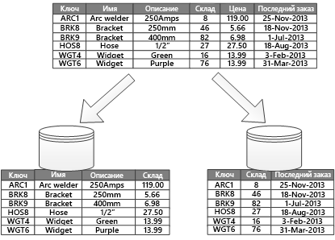
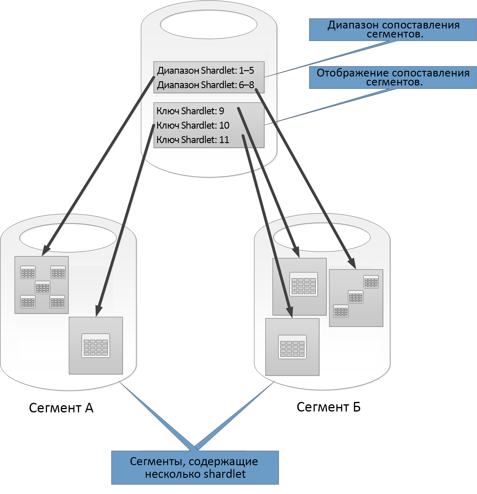
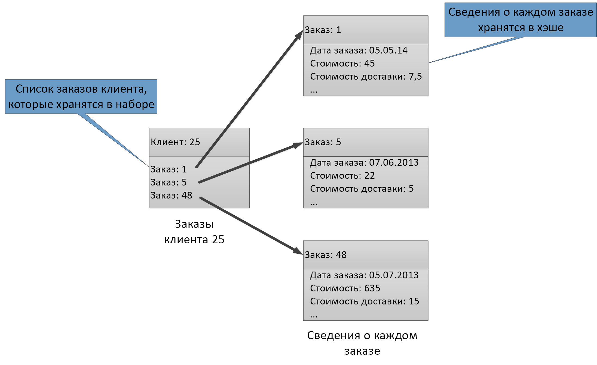

# Секционирование данныхData partitioning

Во многих крупномасштабных решениях данные разделяются на особые секции, которыми можно управлять и пользоваться отдельно.In many large-scale solutions, data is divided into separate partitions that can be managed and accessed separately. Следует тщательно выбирать стратегию секционирования, чтобы максимально увеличить преимущества от ее использования и свести к минимуму отрицательные эффекты.The partitioning strategy must be chosen carefully to maximize the benefits while minimizing adverse effects. Секционирование поможет улучшить масштабируемость, уменьшить количество конфликтов и оптимизировать производительность.Partitioning can help improve scalability, reduce contention, and optimize performance. Дополнительное преимущество секционирования состоит в том, что оно также может предоставить механизм для разделения данных по шаблону использования.Another benefit of partitioning is that it can provide a mechanism for dividing data by the pattern of use. Например, можно архивировать старые менее активные (холодные) данные, чтобы снизить стоимость хранилища данных.For example, you can archive older, less active (cold) data in cheaper data storage.

## Зачем секционировать данные?Why partition data?
Большинство облачных приложений и служб хранят и извлекают данные в рамках своих операций.Most cloud applications and services store and retrieve data as part of their operations. Структура хранилищ данных, которыми пользуется приложение, может значительно влиять на производительность, пропускную способность и масштабируемость системы.The design of the data stores that an application uses can have a significant bearing on the performance, throughput, and scalability of a system. Одним из способов, которые обычно применяются в крупномасштабных системах, является разделение данных на отдельные секции.One technique that is commonly applied in large-scale systems is to divide the data into separate partitions.

> Термин *секционирование* в этом руководстве обозначает процесс физического разделения данных на отдельные хранилища.In this article, the term *partitioning* means the process of physically dividing data into separate data stores. Не следует путать его с секционированием таблиц в SQL Server.It is not the same as SQL Server table partitioning.

Секционирование данных обеспечивает множество преимуществ.Partitioning data can offer a number of benefits. Например, его можно применять в следующих целях.For example, it can be applied in order to:

* **Повышение масштабируемости**.**Improve scalability**. Вертикальное масштабирование отдельной базы данных рано или поздно столкнется с физическими ограничениями оборудования.When you scale up a single database system, it will eventually reach a physical hardware limit. При разделении данных на несколько секций, каждая из которых размещается на отдельном сервере, можно практически неограниченно масштабировать систему.If you divide data across multiple partitions, each of which is hosted on a separate server, you can scale out the system almost indefinitely.
* **Повышение производительности**.**Improve performance**. В каждой секции осуществляется доступ к данным меньшего объема.Data access operations on each partition take place over a smaller volume of data. При условии, что данные секционированы подходящим образом, секционирование может повысить эффективность системы.Provided that the data is partitioned in a suitable way, partitioning can make your system more efficient. Операции, которые задействуют несколько секций, могут выполняться параллельно.Operations that affect more than one partition can run in parallel. Каждая секция может находиться рядом с приложением, которое ее использует, для минимизации задержки в сети.Each partition can be located near the application that uses it to minimize network latency.
* **Повышение доступности**.**Improve availability**. Распределение данных по нескольким серверам позволяет избежать наличия единственной точки отказа.Separating data across multiple servers avoids a single point of failure. В случае сбоя или запланированного обслуживания сервера недоступны только данные в этой секции.If a server fails, or is undergoing planned maintenance, only the data in that partition is unavailable. Операции в других секциях можно продолжать.Operations on other partitions can continue. Увеличение числа секций уменьшает относительное влияние сбоя на одном сервере за счет снижения доли данных, которые будут недоступны.Increasing the number of partitions reduces the relative impact of a single server failure by reducing the percentage of data that will be unavailable. Репликация каждой секции может дополнительно уменьшить вероятность влияния сбоя одной секции на операции.Replicating each partition can further reduce the chance of a single partition failure affecting operations. Такой подход также позволяет отделить критически важные данные, для которых необходима постоянная и высокая доступность, от данных низкой значимости (например файлов журнала).It also makes it possible to separate critical data that must be continually and highly available from low-value data that has lower availability requirements (log files, for example).
* **Усиление безопасности**.**Improve security**. В зависимости от характера данных и метода их секционирования может существовать возможность размещения конфиденциальных и неконфиденциальных данных в разных секциях и, следовательно, на разных серверах или в разных хранилищах.Depending on the nature of the data and how it is partitioned, it might be possible to separate sensitive and non-sensitive data into different partitions, and therefore into different servers or data stores. При этом для конфиденциальных данных можно специально оптимизировать безопасность.Security can then be specifically optimized for the sensitive data.
* **Обеспечение операционной гибкости**.**Provide operational flexibility**. Секционирование предлагает множество возможностей для операций тонкой настройки, максимально повышая эффективность администрирования и сводя затраты к минимуму.Partitioning offers many opportunities for fine tuning operations, maximizing administrative efficiency, and minimizing cost. Некоторые примеры определяют разные стратегии управления, мониторинга, резервного копирования и восстановления, а также других административных задач в зависимости от степени важности данных в каждой секции.For example, you can define different strategies for management, monitoring, backup and restore, and other administrative tasks based on the importance of the data in each partition.
* **Сопоставление хранилища данных с шаблоном использования.****Match the data store to the pattern of use**. Секционирование позволяет развернуть любую секцию в хранилище данных любого типа в зависимости от стоимости и встроенных функций, которые предоставляет хранилище данных.Partitioning allows each partition to be deployed on a different type of data store, based on cost and the built-in features that data store offers. Например, двоичные данные больших объемов могут храниться в хранилище больших двоичных объектов, а более структурированные данные можно хранить в базе данных документов.For example, large binary data can be stored in a blob data store, while more structured data can be held in a document database. Дополнительные сведения см. в разделе [Building a polyglot solution] (Создание решения Polyglot) руководства по шаблонам и в статье [Data access for highly-scalable solutions: Using SQL, NoSQL, and polyglot persistence] (Доступ к данным для масштабируемых решений: с помощью SQL, NoSQL и Polyglot Persistence) на веб-сайте Майкрософт.For more information, see [Building a polyglot solution] in the patterns & practices guide and [Data access for highly-scalable solutions: Using SQL, NoSQL, and polyglot persistence] on the Microsoft website.

В некоторых системах не реализованы секции, так как считается, что они связаны с затратами, а не дополнительными преимуществами.Some systems do not implement partitioning because it is considered a cost rather than an advantage. Вот наиболее распространенные причины такого мнения.Common reasons for this rationale include:

* Многие системы хранения данных не поддерживают соединения по секциям, поэтому поддержка целостности данных в секционированных системах может быть затруднена.Many data storage systems do not support joins across partitions, and it can be difficult to maintain referential integrity in a partitioned system. Часто возникает необходимость реализовать соединения и проверки целостности в коде приложения (на уровне секционирования), что может привести к увеличению числа вводов-выводов и сложности приложения.It is frequently necessary to implement joins and integrity checks in application code (in the partitioning layer), which can result in additional I/O and application complexity.
* Обслуживание секций не всегда является простой задачей.Maintaining partitions is not always a trivial task. В системе, где данные энергозависимы, может потребоваться периодически балансировать секции, чтобы снизить число конфликтов и горячих зон.In a system where the data is volatile, you might need to rebalance partitions periodically to reduce contention and hot spots.
* Некоторые стандартные средства не работают автоматически с секционированными данными.Some common tools do not work naturally with partitioned data.

## Проектирование секцийDesigning partitions
Данные могут быть секционированы по-разному: вертикально, горизонтально или функционально.Data can be partitioned in different ways: horizontally, vertically, or functionally. Выбор стратегии зависит от причины секционирования данных, а также требований приложений и служб, которые будут использовать эти данные.The strategy you choose depends on the reason for partitioning the data, and the requirements of the applications and services that will use the data.

> [!NOTE]
> Схемы секционирования, о которых идет речь в этом руководстве, описаны способом, который не зависит от используемой технологии хранения данных.The partitioning schemes described in this guidance are explained in a way that is independent of the underlying data storage technology. Они применимы для различных типов хранилищ данных, включая реляционные и базы данных NoSQL.They can be applied to many types of data stores, including relational and NoSQL databases.
>
>

### Стратегии секционированияPartitioning strategies
Ниже представлены три типичные стратегии для секционирования данных.The three typical strategies for partitioning data are:

* **Горизонтальное секционирование** (часто называемое *сегментированием*).**Horizontal partitioning** (often called *sharding*). В этой стратегии каждая секция представляет собой хранилище данных сама по себе, но все секции имеют одинаковые схемы.In this strategy, each partition is a data store in its own right, but all partitions have the same schema. Каждая секция называется *сегментом* и содержит конкретное подмножество данных, например все заказы для определенной группы клиентов в приложении электронной коммерции.Each partition is known as a *shard* and holds a specific subset of the data, such as all the orders for a specific set of customers in an e-commerce application.
* **Вертикальное секционирование**.**Vertical partitioning**. В этой стратегии каждая секция содержит подмножество полей для элементов в хранилище данных.In this strategy, each partition holds a subset of the fields for items in the data store. Поля разделяются по шаблону их использования.The fields are divided according to their pattern of use. Например, часто используемые поля размещаются в одной вертикальной секции, а более редко используемые поля — в другой.For example, frequently accessed fields might be placed in one vertical partition and less frequently accessed fields in another.
* **Функциональное секционирование**.**Functional partitioning**. В этой стратегии данные группируются в соответствии с их использованием в каждом связанном контексте в системе.In this strategy, data is aggregated according to how it is used by each bounded context in the system. Например, система электронной коммерции, которая реализует отдельные бизнес-функции для выставления счетов и управления описью продуктов, может хранить данные счетов в одной секции, а данные инвентаризации продуктов — в другой.For example, an e-commerce system that implements separate business functions for invoicing and managing product inventory might store invoice data in one partition and product inventory data in another.

Обратите внимание, что три стратегии, описанные здесь, можно сочетать.It’s important to note that the three strategies described here can be combined. Они не являются взаимоисключающими, и все три стратегии рекомендуется учитывать при разработке схемы секционирования.They are not mutually exclusive, and we recommend that you consider them all when you design a partitioning scheme. Например, можно разделить данные на сегменты и затем использовать вертикальное секционирование для дальнейшего разделения данных в каждом сегменте.For example, you might divide data into shards and then use vertical partitioning to further subdivide the data in each shard. Аналогичным образом данные в функциональной секции могут быть разделены на сегменты (которые могут быть также вертикально секционированы).Similarly, the data in a functional partition can be split into shards (which can also be vertically partitioned).

Однако разные требования каждой стратегии могут увеличить число конфликтов.However, the differing requirements of each strategy can raise a number of conflicting issues. Их все необходимо оценить и сбалансировать при разработке схемы секционирования, обеспечивающей целевую производительность обработки данных для вашей системы.You must evaluate and balance all of these when designing a partitioning scheme that meets the overall data processing performance targets for your system. Следующие разделы посвящены более подробному описанию каждой стратегии.The following sections explore each of the strategies in more detail.

### Горизонтальное секционирование (сегментирование)Horizontal partitioning (sharding)
На рисунке 1 представлен обзор горизонтального секционирования, или сегментирования.Figure 1 shows an overview of horizontal partitioning or sharding. В этом примере данные инвентаризации продуктов разделены на сегменты на основании ключа продукта.In this example, product inventory data is divided into shards based on the product key. Каждый сегмент содержит данные для непрерывного диапазона ключей сегментов (A-G и H-Z) в алфавитном порядке.Each shard holds the data for a contiguous range of shard keys (A-G and H-Z), organized alphabetically.

*Рис. 1. Горизонтальное секционирование данных (сегментирование) на основании ключа секции**Figure 1. Horizontally partitioning (sharding) data based on a partition key*

Сегментирование помогает распределить нагрузку между несколькими компьютерами, уменьшая вероятность конфликтов и повышая производительность.Sharding helps you spread the load over more computers, which reduces contention and improves performance. Можно масштабировать систему, добавляя дополнительные сегменты, работающие на дополнительных серверах.You can scale the system out by adding further shards that run on additional servers.

Наиболее важным фактором при реализации этой стратегии секционирования является выбор ключа сегментирования.The most important factor when implementing this partitioning strategy is the choice of sharding key. Может быть трудно изменить ключ после начала работы системы.It can be difficult to change the key after the system is in operation. Ключ должен гарантировать, что данные секционированы таким образом, чтобы рабочая нагрузка была распределена по сегментам максимально равномерно.The key must ensure that data is partitioned so that the workload is as even as possible across the shards.

Обратите внимание, что разные сегменты необязательно должны содержать сходные объемы данных.Note that different shards do not have to contain similar volumes of data. Гораздо важнее сбалансировать количество запросов.Rather, the more important consideration is to balance the number of requests. Некоторые сегменты, возможно, будут очень большими, но элементы в них могут редко использоваться.Some shards might be very large, but each item is the subject of a low number of access operations. Другие сегменты будут меньше, но данные в них могут использоваться чаще.Other shards might be smaller, but each item is accessed much more frequently. Также важно убедиться, что один сегмент не превышает предел масштабирования (с точки зрения емкости и ресурсов обработки) хранилища данных, используемого для размещения этого сегмента.It is also important to ensure that a single shard does not exceed the scale limits (in terms of capacity and processing resources) of the data store that's being used to host that shard.

При использовании схемы сегментирования следует избегать возникновения горячих точек (или горячих секций), которые могут повлиять на производительность и доступность.If you use a sharding scheme, avoid creating hotspots (or hot partitions) that can affect performance and availability. Например, если использовать хэш идентификатора клиента вместо первой буквы имени клиента, можно предотвратить несбалансированное распределение, которое возникнет из-за неоднородной частоты использования начальных букв.For example, if you use a hash of a customer identifier instead of the first letter of a customer’s name, you prevent the unbalanced distribution that results from common and less common initial letters. Это типичный способ, позволяющий более равномерно распределить данные по секциям.This is a typical technique that helps distribute data more evenly across partitions.

Выберите ключ сегментирования, который сводит к минимуму любые будущие требования разбить большие сегменты на более мелкие части, объединить небольшие сегменты в секции большего размера или изменить схему, которая описывает данные, хранящиеся в наборе секций.Choose a sharding key that minimizes any future requirements to split large shards into smaller pieces, coalesce small shards into larger partitions, or change the schema that describes the data stored in a set of partitions. Эти операции могут занять очень много времени и потребовать отключения одного или нескольких сегментов во время их выполнения.These operations can be very time consuming, and might require taking one or more shards offline while they are performed.

Если сегменты реплицируются, можно оставить некоторые реплики в рабочем режиме во время разделения, слияния или перенастройки других реплик.If shards are replicated, it might be possible to keep some of the replicas online while others are split, merged, or reconfigured. Но система может ограничить операции, выполняемые с данными в этих сегментах во время перенастройки.However, the system might need to limit the operations that can be performed on the data in these shards while the reconfiguration is taking place. Например, данные в репликах могут быть помечены как данные только для чтения, чтобы ограничить объем несоответствий, которые возникают во время реструктуризации сегментов.For example, the data in the replicas can be marked as read-only to limit the scope of inconsistences that might occur while shards are being restructured.

> Дополнительные сведения и рекомендации по этим вопросам, как и по рекомендуемым методам проектирования хранилищ данных, которые реализуют горизонтальное секционирование, см. в статье [Sharding pattern] (Шаблон сегментирования).For more detailed information and guidance about many of these considerations, and good practice techniques for designing data stores that implement horizontal partitioning, see [Sharding pattern].
>
>

### Вертикальное секционированиеVertical partitioning
Вертикальное секционирование наиболее часто используется для сокращения операций ввода-вывода и расходов на производительность, связанных с выборкой наиболее часто используемых элементов.The most common use for vertical partitioning is to reduce the I/O and performance costs associated with fetching the items that are accessed most frequently. На рисунке 2 показан пример вертикального секционирования.Figure 2 shows an example of vertical partitioning. В этом примере разные свойства для каждого элемента данных хранятся в разных секциях.In this example, different properties for each data item are held in different partitions. В одной секции хранятся данные, используемые чаще всего, например имя, описание и сведения о ценах на продукты.One partition holds data that is accessed more frequently, including the name, description, and price information for products. В другой содержатся данные о количестве на складе и дате последнего заказа.Another holds the volume in stock and the last ordered date.

*Рис. 2. Вертикальное секционирование данных по шаблону использования**Figure 2. Vertically partitioning data by its pattern of use*

В этом примере приложение регулярно запрашивает имя, описание и цену продукта при отображении подробных сведений о продукте для клиента.In this example, the application regularly queries the product name, description, and price when displaying the product details to customers. Такие данные, как количество продукта на складе и дата последнего заказа у производителя, хранятся в отдельной секции, так как эти два элемента часто используются совместно.The stock level and date when the product was last ordered from the manufacturer are held in a separate partition because these two items are commonly used together.

Эта схема секционирования имеет то дополнительное преимущество, что относительно медленно изменяющиеся данные (название, описание и цена продукта) отделены от более динамически меняющихся данных (количество продукта на складе и дата последнего заказа).This partitioning scheme has the added advantage that the relatively slow-moving data (product name, description, and price) is separated from the more dynamic data (stock level and last ordered date). Приложение может выиграть, когда изменяющиеся данные медленно кэшируются в памяти, если они часто используются.An application might find it beneficial to cache the slow-moving data in memory if it is frequently accessed.

Другой типичный сценарий для этой стратегии секционирования — максимальное повышение безопасности конфиденциальных данных.Another typical scenario for this partitioning strategy is to maximize the security of sensitive data. Этого можно добиться, например, храня номера кредитных карт и соответствующие номера проверки безопасности карты в отдельной секции.For example, you can do this by storing credit card numbers and the corresponding card security verification numbers in separate partitions.

Вертикальное секционирование может также снизить объем требуемого параллельного доступа к данным.Vertical partitioning can also reduce the amount of concurrent access that's needed to the data.

> Вертикальное секционирование выполняется на уровне сущности в хранилище данных, частично нормализуя сущность и преобразуя ее из *широкого* элемента в набор *узких* элементов.Vertical partitioning operates at the entity level within a data store, partially normalizing an entity to break it down from a *wide* item to a set of *narrow* items. Это идеально подходит для хранилищ данных со столбцами, таких как HBase и Cassandra.It is ideally suited for column-oriented data stores such as HBase and Cassandra. Если данные в коллекции столбцов меняются редко, также можно использовать хранилища со столбцами в SQL Server.If the data in a collection of columns is unlikely to change, you can also consider using column stores in SQL Server.
>
>

### Функциональное секционированиеFunctional partitioning
Для систем, где можно идентифицировать связанный контекст для каждой области бизнеса или службы в приложении, функциональное секционирование предоставляет способ повышения изоляции и скорости доступа к данным.For systems where it is possible to identify a bounded context for each distinct business area or service in the application, functional partitioning provides a technique for improving isolation and data access performance. Кроме этого, функциональное секционирование обычно используется для разделения данных для чтения и записи от данных только для чтения, используемых для составления отчетов.Another common use of functional partitioning is to separate read-write data from read-only data that's used for reporting purposes. На рисунке 3 представлен обзор функционального секционирования, где инвентаризации отделены от данных клиентов.Figure 3 shows an overview of functional partitioning where inventory data is separated from customer data.

*Рис. 3. Функциональное секционирование данных по связанному контексту или дочернему домену**Figure 3. Functionally partitioning data by bounded context or subdomain*

Эта стратегия секционирования может помочь уменьшить количество конфликтов доступа к данным в различных частях системы.This partitioning strategy can help reduce data access contention across different parts of a system.

## Проектирование секций для масштабируемостиDesigning partitions for scalability
Важно учитывать размер и рабочую нагрузку каждой секции и равномерно распределять данные для достижения максимальной масштабируемости.It's vital to consider size and workload for each partition and balance them so that data is distributed to achieve maximum scalability. Тем не менее необходимо все же секционировать данные так, чтобы не превысить ограничения масштабирования одной секции хранилища.However, you must also partition the data so that it does not exceed the scaling limits of a single partition store.

При создании секций для масштабируемости выполните приведенные далее действия.Follow these steps when designing partitions for scalability:

1. Проанализируйте приложение, чтобы понять шаблоны доступа к данным, такие как размер результирующего набора, возвращаемого каждым запросом, частота доступа, встречающиеся задержки и требования к вычислительной обработке на стороне сервера.Analyze the application to understand the data access patterns, such as the size of the result set returned by each query, the frequency of access, the inherent latency, and the server-side compute processing requirements. Во многих случаях несколько основных сущностей потребуют большую часть вычислительных ресурсов.In many cases, a few major entities will demand most of the processing resources.
2. На основе анализа определите текущие и будущие целевые показатели масштабируемости, такие как размер данных и рабочая нагрузка.Use this analysis to determine the current and future scalability targets, such as data size and workload. Затем распределите данные по секциям в соответствии с целевыми показателями масштабируемости.Then distribute the data across the partitions to meet the scalability target. В горизонтальной стратегии секционирования выбор соответствующего ключа сегмента важен для обеспечения равномерного распределения.In the horizontal partitioning strategy, choosing the appropriate shard key is important to make sure distribution is even. Дополнительные сведения см. в статье [Sharding pattern] (Шаблон сегментирования).For more information, see the [Sharding pattern].
3. Убедитесь в том, что каждой секции предоставлено достаточно ресурсов для достижения требований масштабируемости с точки зрения размера данных и пропускной способности.Make sure that the resources available to each partition are sufficient to handle the scalability requirements in terms of data size and throughput. Например, узел, где размещается секция, может накладывать жесткое ограничение на объем для хранения, объем обработки или пропускную способность сети, которые он предоставляет.For example, the node that's hosting a partition might impose a hard limit on the amount of storage space, processing power, or network bandwidth that it provides. Если требования к хранению и обработке данных, скорее всего, превысят эти пределы, возможно, вам придется пересмотреть стратегию секционирования или дополнительно разделить данные.If the data storage and processing requirements are likely to exceed these limits, it might be necessary to refine your partitioning strategy or split data out further. Например, можно использовать такой подход к масштабированию: отделить данные журналов от основных функций приложения.For example, one scalability approach might be to separate logging data from the core application features. Для этого следует использовать отдельные хранилища, чтобы общие требования хранилища данных не превышали предел масштабирования узла.You do this by using separate data stores to prevent the total data storage requirements from exceeding the scaling limit of the node. Если общее число хранилищ данных превышает ограничение узла, может потребоваться использование отдельных узлов хранилища.If the total number of data stores exceeds the node limit, it might be necessary to use separate storage nodes.
4. Понаблюдайте за используемой системой, чтобы убедиться, что данные распределяются ожидаемым образом и секции справляются со своей нагрузкой.Monitor the system under use to verify that the data is distributed as expected and that the partitions can handle the load that is imposed on them. Есть вероятность, что фактические результаты использования не будут совпадать с данными анализа.It's possible that the usage does not match the usage that's anticipated by the analysis. В этом случае можно повторно сбалансировать секции.In that case, it might be possible to rebalance the partitions. Если это не дало результата, может потребоваться изменить некоторые компоненты системы, чтобы получить необходимый баланс.Failing that, it might be necessary to redesign some parts of the system to gain the required balance.

Обратите внимание, что некоторые облачные среды распределяют ресурсы по границам инфраструктуры.Note that some cloud environments allocate resources in terms of infrastructure boundaries. Следует убедиться, что ограничения выбранной границы предоставляют достаточно места для любого ожидаемого роста объема данных с точки зрения хранилища данных, вычислительной мощности и пропускной способности.Ensure that the limits of your selected boundary provide enough room for any anticipated growth in the volume of data, in terms of data storage, processing power, and bandwidth.

Например, при использовании хранилища таблиц Azure занятый сегмент может потребовать больше ресурсов, чем доступно отдельным секциям для обработки запросов.For example, if you use Azure table storage, a busy shard might require more resources than are available to a single partition to handle requests. (Существует ограничение на объем запросов, которые могут обрабатываться одним разделом в определенный период времени.(There is a limit to the volume of requests that can be handled by a single partition in a particular period of time. Дополнительные сведения см. на странице [Целевые показатели масштабируемости и производительности службы хранилища Azure] на веб-сайте Майкрософт.)See the page [Azure storage scalability and performance targets] on the Microsoft website for more details.)

 В этом случае можно повторно секционировать сегмент, чтобы распределить нагрузку.If this is the case, the shard might need to be repartitioned to spread the load. Если общий размер или пропускная способность этих таблиц превышают емкость учетной записи хранения, возможно, потребуется создать дополнительные учетные записи хранения и распределить таблицы по этим учетным записям.If the total size or throughput of these tables exceeds the capacity of a storage account, it might be necessary to create additional storage accounts and spread the tables across these accounts. Если число учетных записей хранения превышает количество доступных для подписки, возможно, потребуется использовать несколько подписок.If the number of storage accounts exceeds the number of accounts that are available to a subscription, then it might be necessary to use multiple subscriptions.

## Проектирование секций для повышения производительности запросовDesigning partitions for query performance
Производительность запросов часто можно увеличить путем использования небольших наборов данных и параллельного выполнения запросов.Query performance can often be boosted by using smaller data sets and by running parallel queries. Каждая секция должна содержать небольшую часть всего набора данных.Each partition should contain a small proportion of the entire data set. Такое уменьшение объема может повысить производительность запросов.This reduction in volume can improve the performance of queries. Тем не менее секционирование не является альтернативой правильной разработке и настройке базы данных.However, partitioning is not an alternative for designing and configuring a database appropriately. Например, необходимо убедиться в том, что присутствуют все необходимые индексы, если вы используете реляционную базу данных.For example, make sure that you have the necessary indexes in place if you are using a relational database.

При создании секций для производительности запросов выполните приведенные далее действия.Follow these steps when designing partitions for query performance:

1. Изучите требования и производительность приложения.Examine the application requirements and performance:
   * Используйте бизнес-требования, чтобы определить важные запросы, которые всегда должны выполняться быстро.Use the business requirements to determine the critical queries that must always perform quickly.
   * Отслеживайте состояния системы, чтобы выявить любые медленно выполняемые запросы.Monitor the system to identify any queries that perform slowly.
   * Установите, какие запросы выполняются наиболее часто.Establish which queries are performed most frequently. Один экземпляр каждого запроса может иметь минимальный вес, но совокупное потребление ресурсов может быть значительным.A single instance of each query might have minimal cost, but the cumulative consumption of resources could be significant. Возможно, полезно будет выделить данные, полученные этими запросами, в отдельную секцию или даже в кэш.It might be beneficial to separate the data that's retrieved by these queries into a distinct partition, or even a cache.
2. Разделите данные, которые вызывают снижение производительности.Partition the data that is causing slow performance:
   * Ограничьте размер каждой секции, чтобы время отклика запроса оставалось в пределах целевого значения.Limit the size of each partition so that the query response time is within target.
   * Создайте ключ сегментирования таким образом, чтобы приложение могло легко находить секцию, если вы реализуете горизонтальное секционирование.Design the shard key so that the application can easily find the partition if you are implementing horizontal partitioning. Так запросу не потребуется проверять каждую секцию.This prevents the query from having to scan through every partition.
   * Учитывайте влияние расположения секции.Consider the location of a partition. Если это возможно, старайтесь хранить данные в секциях, географически близких к использующим их приложениям и пользователям.If possible, try to keep data in partitions that are geographically close to the applications and users that access it.
3. Если у сущности есть требования к пропускной способности и запросам, используйте функциональное секционирование на основе этой сущности.If an entity has throughput and query performance requirements, use functional partitioning based on that entity. Если по-прежнему не удается удовлетворить требования, примените также горизонтальное секционирование.If this still doesn't satisfy the requirements, apply horizontal partitioning as well. В большинстве случаев будет достаточно одной стратегии секционирования, но в некоторых случаях более эффективно будет объединить обе стратегии.In most cases a single partitioning strategy will suffice, but in some cases it is more efficient to combine both strategies.
4. Для повышения производительности рекомендуется использовать асинхронные запросы, которые выполняются параллельно по секциям.Consider using asynchronous queries that run in parallel across partitions to improve performance.

## Проектирование секций для увеличения доступностиDesigning partitions for availability
Секционирование данных может повысить доступность приложений за счет того, что весь набор данных не составляет единственную точку отказа и что отдельными подмножествами набора данных можно управлять независимо друг от друга.Partitioning data can improve the availability of applications by ensuring that the entire dataset does not constitute a single point of failure and that individual subsets of the dataset can be managed independently. Доступность можно также повысить за счет репликации секций, содержащих важные данные.Replicating partitions that contain critical data can also improve availability.

При разработке и реализации секций учитывайте следующие факторы, влияющие на доступность.When designing and implementing partitions, consider the following factors that affect availability:

* **Степень важности данных для бизнес-операций.****How critical the data is to business operations**. Некоторые данные могут представлять собой важные для бизнеса сведения, например сведения о счетах или о банковских переводах.Some data might include critical business information such as invoice details or bank transactions. Другие данные могут быть менее важными рабочими данными, такими как файлы журнала, трассировка производительности и т. д.Other data might include less critical operational data, such as log files, performance traces, and so on. После определения каждого типа данных подумайте о следующем.After identifying each type of data, consider:
  * Можно хранить критически важные данные в секциях высокой доступности с соответствующим планом архивации.Storing critical data in highly-available partitions with an appropriate backup plan.
  * Можно установить отдельные механизмы или процедуры управления и мониторинга для различных степеней важности каждого набора данных.Establishing separate management and monitoring mechanisms or procedures for the different criticalities of each dataset. Можно разместить данные с одинаковым уровнем важности в одной секции, чтобы их можно было архивировать с соответствующей частотой.Place data that has the same level of criticality in the same partition so that it can be backed up together at an appropriate frequency. Например, для секций, содержащих данные о банковских переводах, архивация может требоваться чаще, чем для секций, содержащих данные журналов или трассировки.For example, partitions that hold data for bank transactions might need to be backed up more frequently than partitions that hold logging or trace information.
* **Как можно управлять отдельными секциями**.**How individual partitions can be managed**. Проектирование секций с поддержкой независимых управления и обслуживания обеспечивает ряд преимуществ.Designing partitions to support independent management and maintenance provides several advantages. Например: For example:
  * Если в секции происходит сбой, ее можно восстановить независимо, не затрагивая экземпляры приложений, работающих с данными в других секциях.If a partition fails, it can be recovered independently without affecting instances of applications that access data in other partitions.
  * Секционирование данных по географическому региону позволит запускать запланированные задачи по обслуживанию в непиковые часы для каждого расположения.Partitioning data by geographical area allows scheduled maintenance tasks to occur at off-peak hours for each location. Убедитесь, что секции не слишком велики и их размер не помешает завершить запланированное обслуживание в течение этого периода.Ensure that partitions are not too big to prevent any planned maintenance from being completed during this period.
* **Подумайте, следует ли реплицировать критически важные данные по секциям**.**Whether to replicate critical data across partitions**. Эта стратегия может повысить доступность и производительность, хотя она также может вызвать проблемы согласованности.This strategy can improve availability and performance, although it can also introduce consistency issues. Для синхронизации изменения данных в секции с каждой репликой требуется время.It takes time for changes made to data in a partition to be synchronized with every replica. В течение этого времени различные секции будут содержать разные значения данных.During this period, different partitions will contain different data values.

## Сведения о влиянии секционирования на проектирование и разработкуUnderstanding how partitioning affects design and development
Использование секционирования усложняет проектирование и разработку системы.Using partitioning adds complexity to the design and development of your system. Секционирование следует рассматривать как основную часть разработки системы, даже если система изначально содержит только одну секцию.Consider partitioning as a fundamental part of system design even if the system initially only contains a single partition. Обращение к секционированию как к методу решения проблем с производительностью и масштабируемостью системы, возникших после ее запуска, приведет к повышению сложности, так как у вас уже есть действующая система, которую нужно поддерживать.If you address partitioning as an afterthought, when the system starts to suffer performance and scalability issues, the complexity increases because you already have a live system to maintain.

Обновление системы для включения секционирования в этой среде требует не только изменения логики доступа к данным.If you update the system to incorporate partitioning in this environment, it necessitates modifying the data access logic. Оно также может привести к миграции большого количества существующих данных, которые необходимо распределить по секциям. При этом пользователи хотят иметь возможность по-прежнему использовать систему.It can also involve migrating large quantities of existing data to distribute it across partitions, often while users expect to be able to continue using the system.

В некоторых случаях секционирование не считается важным, так как исходный набор данных небольшой и легко обрабатывается на одном сервере.In some cases, partitioning is not considered important because the initial dataset is small and can be easily handled by a single server. Это может быть справедливо, если в системе не планируется масштабирование свыше начального размера, но многим коммерческим системам требуется возможность расширения по мере увеличения числа пользователей.This might be true in a system that is not expected to scale beyond its initial size, but many commercial systems need to expand as the number of users increases. Это расширение обычно сопровождается увеличением объема данных.This expansion is typically accompanied by a growth in the volume of data.

Следует также понимать, что секционирование не всегда связано с хранилищами больших объемов данных.It's also important to understand that partitioning is not always a function of large data stores. Например, небольшое хранилище данных могут использовать сотни параллельных клиентов.For example, a small data store might be heavily accessed by hundreds of concurrent clients. Секционирование данных в этой ситуации может помочь уменьшить количество конфликтов и повысить пропускную способность.Partitioning the data in this situation can help to reduce contention and improve throughput.

При разработке схемы секционирования данных учитывайте следующие моменты.Consider the following points when you design a data partitioning scheme:

* **По возможности храните данные для наиболее распространенных операций базы данных вместе в каждой секции, чтобы свести к минимуму операции доступа к данным из разных секций**.**Where possible, keep data for the most common database operations together in each partition to minimize cross-partition data access operations**. Запросы к разным секциям могут занимать больше времени, чем отправка запросов в рамках одной секции, но оптимизация секций для одного набора запросов может неблагоприятно повлиять на другие наборы запросов.Querying across partitions can be more time-consuming than querying only within a single partition, but optimizing partitions for one set of queries might adversely affect other sets of queries. Чтобы свести к минимуму время запроса к разным секциям там, где этого не избежать, реализуйте параллельные запросы к секциям и статистическую обработку результатов в приложении.When you can't avoid querying across partitions, minimize query time by running parallel queries and aggregating the results within the application. Однако такой подход может оказаться невозможным в некоторых случаях, например, когда это необходимо, чтобы получить результат из одного запроса и использовать его в следующем запросе.This approach might not be possible in some cases, such as when it's necessary to obtain a result from one query and use it in the next query.
* **Если запросы используют относительно статические справочные данные, например таблицы почтовых индексов или списки продуктов, подумайте о репликации этих данных во всех секциях, чтобы снизить потребность в отдельных операциях уточняющих запросов в другие секции**.**If queries make use of relatively static reference data, such as postal code tables or product lists, consider replicating this data in all of the partitions to reduce the requirement for separate lookup operations in different partitions**. Этот подход также может уменьшить вероятность того, что справочные данные станут "горячим" набором данных, который подвергается значительному трафику из всех точек системы.This approach can also reduce the likelihood of the reference data becoming a "hot" dataset that is subject to heavy traffic from across the entire system. Однако существуют дополнительные затраты, связанные с синхронизацией любых изменений этих справочных данных.However,   there is an additional cost associated with synchronizing any changes that might occur to this reference data.
* **По возможности сведите к минимуму требования для обеспечения целостности данных для вертикальных и функциональных секций**.**Where possible, minimize requirements for referential integrity across vertical and functional partitions**. В этих схемах само приложение отвечает за обеспечение целостности данных в секциях, когда данные обновляются и потребляются.In these schemes, the application itself is responsible for maintaining referential integrity across partitions when data is updated and consumed. Запросы, которые должны объединить данные из нескольких секций, выполняются медленнее, чем запросы, которые объединяют данные только из одной секции, поскольку приложению обычно требуется выполнить последовательные запросы на основе ключа, а затем на основе внешнего ключа.Queries that must join data across multiple partitions run more slowly than queries that join data only within the same partition because the application typically needs to perform consecutive queries based on a key and then on a foreign key. Вместо этого рассмотрите возможность репликации или денормализации соответствующих данных.Instead, consider replicating or de-normalizing the relevant data. Чтобы свести к минимуму время запроса там, где необходимы соединения между секциями, реализуйте параллельные запросы из разных секций и объединение данных внутри приложения.To minimize the query time where cross-partition joins are necessary, run parallel queries over the partitions and join the data within the application.
* **Учитывайте влияние схемы секционирования на согласованность данных в секциях.****Consider the effect that the partitioning scheme might have on the data consistency across partitions.** Следует оценить, является ли строгое согласование обязательным.Evaluate whether strong consistency is actually a requirement. Обычно стандартный подход в облаке заключается в реализации окончательной согласованности.Instead, a common approach in the cloud is to implement eventual consistency. Данные в каждой секции обновляются отдельно, а логика приложения может нести ответственность за обеспечение успешного завершения обновлений.The data in each partition is updated separately, and the application logic ensures that the updates are all completed successfully. Она также обрабатывает несоответствия, которые могут возникнуть после запроса данных во время выполнения операции согласования.It also handles the inconsistencies that can arise from querying data while an eventually consistent operation is running. Дополнительные сведения о реализации окончательной согласованности см. в [руководстве по согласованности данных].For more information about implementing eventual consistency, see the [Data consistency primer].
* **Подумайте, как запросы будут находить правильную секцию**.**Consider how queries locate the correct partition**. Если запрос должен сканировать все секции, чтобы найти требуемые данные, это сильно повлияет на производительность даже при выполнении нескольких параллельных запросов.If a query must scan all partitions to locate the required data, there is a significant impact on performance, even when multiple parallel queries are running. Запросы, используемые с вертикальной и функциональной стратегиями секционирования, могут естественным образом указывать секции.Queries that are used with vertical and functional partitioning strategies can naturally specify the partitions. Однако при использовании горизонтального секционирования (сегментирования) поиск элемента может быть затруднен, так как каждый сегмент имеет ту же схему.However, horizontal partitioning (sharding) can make locating an item difficult because every shard has the same schema. Стандартное решение для сегментирования — поддерживать карту, которую можно использовать для поиска определенных элементов данных в сегменте.A typical solution for sharding is to maintain a map that can be used to look up the shard location for specific items of data. Эту карту можно реализовать в логике сегментирования приложения или поддерживать в хранилище данных, если оно поддерживает прозрачное сегментирование.This map can be implemented in the sharding logic of the application, or maintained by the data store if it supports transparent sharding.
* **При использовании стратегии горизонтального секционирования рекомендуется периодически балансировать нагрузку сегментов**.**When using a horizontal partitioning strategy, consider periodically rebalancing the shards**. Это позволит равномерно распределять данные по размеру и рабочей нагрузке и свести к минимуму горячие точки, повысить производительность выполнения запросов и обойти ограничения физического хранилища.This helps distribute the data evenly by size and by workload to minimize hotspots, maximize query performance, and work around physical storage limitations. Однако это сложная задача, которая часто требует использования пользовательских средств или процессов.However, this is a complex task that often requires the use of a custom tool or process.
* **Репликация каждой из секций обеспечивает дополнительную защиту от сбоев**.**If you replicate each partition, it provides additional protection against failure**. В случае сбоя одной реплики запросы могут направляться на рабочую копию.If a single replica fails, queries can be directed towards a working copy.
* **При достижении физических ограничений стратегии секционирования может потребоваться расширить масштабируемость до другого уровня**.**If you reach the physical limits of a partitioning strategy, you might need to extend the scalability to a different level**. Например, если секционирование находится на уровне базы данных, может потребоваться разместить или реплицировать секции в нескольких базах данных.For example, if partitioning is at the database level, you might need to locate or replicate partitions in multiple databases. Если секционирование уже находится на уровне базы данных и физические ограничения стали проблемой, это может означать необходимость размещения или репликации секций в нескольких учетных записях.If partitioning is already at the database level, and physical limitations are an issue, it might mean that you need to locate or replicate partitions in multiple hosting accounts.
* **Избегайте транзакций, осуществляющих доступ к данным в нескольких секциях**.**Avoid transactions that access data in multiple partitions**. Некоторые хранилища данных реализуют согласованность и целостность транзакций для операций, которые изменяют данные, но только в том случае, когда они находятся в одной секции.Some data stores implement transactional consistency and integrity for operations that modify data, but only when the data is located in a single partition. Если требуется поддержка транзакций с использованием нескольких секций, возможно, потребуется реализовать это как часть логики приложения, поскольку большая часть систем секционирования не обеспечивает встроенную поддержку.If you need transactional support across multiple partitions, you will probably need to implement this as part of your application logic because most partitioning systems do not provide native support.

Все хранилища данных требуют некоторого оперативного управления и наблюдения за активностью.All data stores require some operational management and monitoring activity. Задачи могут варьироваться от загрузки данных, резервного копирования и восстановления данных до реорганизации данных и обеспечения правильной и эффективной работы системы.The tasks can range from loading data, backing up and restoring data, reorganizing data, and ensuring that the system is performing correctly and efficiently.

Учитывайте следующие факторы, влияющие на оперативное управление.Consider the following factors that affect operational management:

* **Как при секционировании данных реализовать соответствующее управление и рабочие задачи**.**How to implement appropriate management and operational tasks when the data is partitioned**. В число этих задач могут входить архивация и восстановление, архивация данных, мониторинг системы и других задач администрирования.These tasks might include backup and restore, archiving data, monitoring the system, and other administrative tasks. Например, сохранение логического соответствия во время операций резервного копирования и восстановления может оказаться непростой задачей.For example, maintaining logical consistency during backup and restore operations can be a challenge.
* **Как можно загружать данные в несколько секций и как добавлять новые данные, поступающие из других источников**.**How to load the data into multiple partitions and add new data that's arriving from other sources**. Некоторые средства и служебные программы могут не поддерживать операции с сегментированными данными, например загрузку в нужную секцию.Some tools and utilities might not support sharded data operations such as loading data into the correct partition. Поэтому такие операции могут потребовать создания или приобретения новых средств и служебных программ.This means that you might have to create or obtain new tools and utilities.
* **Как будут архивироваться и удаляться данные на регулярной основе**.**How to archive and delete the data on a regular basis**. Для предотвращения чрезмерного увеличения размера секций необходимо регулярно архивировать и обновлять данные (возможно, раз в месяц).To prevent the excessive growth of partitions, you need to archive and delete data on a regular basis (perhaps monthly). Очевидно, потребуется преобразовать данные, чтобы обеспечить соответствие другой схеме архивирования.It might be necessary to transform the data to match a different archive schema.
* **Как обнаруживать проблемы целостности данных**.**How to locate data integrity issues**. Рассмотрите возможность выполнения периодического процесса для обнаружения любых проблем целостности данных, например, когда данные в одной секции ссылаются на данные в другой, но эти данные отсутствуют.Consider running a periodic process to locate any data integrity issues such as data in one partition that references missing information in another. Процесс может либо попытаться устранить эти проблемы автоматически, либо создать оповещение оператора для устранения неполадок вручную.The process can either attempt to fix these issues automatically or raise an alert to an operator to correct the problems manually. Например, в приложении электронной коммерции сведения о заказах могут храниться в одной секции, а элементы строк, которые составляют каждый заказ, — в другой.For example, in an e-commerce application, order information might be held in one partition but the line items that constitute each order might be held in another. В процессе размещения заказа необходимо добавить данные к обеим секциям.The process of placing an order needs to add data to other partitions. Если этот процесс завершается ошибкой, могут быть сохранены элементы строк, для которых отсутствует соответствующий заказ.If this process fails, there might be line items stored for which there is no corresponding order.

Разные технологии хранения данных обычно предоставляют свои собственные функции для поддержки секционирования.Different data storage technologies typically provide their own features to support partitioning. В следующих разделах рассматриваются возможности, реализуемые хранилищами данных и часто используемые приложениями Azure.The following sections summarize the options that are implemented by data stores commonly used by Azure applications. В них также содержатся рекомендации по разработке приложений с использованием преимуществ этих функций.They also describe considerations for designing applications that can best take advantage of these features.

## Стратегии секционирования для базы данных SQL AzurePartitioning strategies for Azure SQL Database
База данных SQL Azure является реляционной базой данных, которая предоставляется как служба, работающая в облаке.Azure SQL Database is a relational database-as-a-service that runs in the cloud. Она основана на Microsoft SQL Server.It is based on Microsoft SQL Server. Реляционная база данных делит данные на таблицы, и каждая таблица содержит сведения о сущностях в виде набора строк.A relational database divides information into tables, and each table holds information about entities as a series of rows. Каждая строка содержит столбцы, которые предоставляют данные для отдельных полей сущности.Each row contains columns that hold the data for the individual fields of an entity. Подробную документацию по созданию и использованию базы данных SQL см. на странице [Что такое база данных SQL? Введение в базы данных SQL] на веб-сайте Майкрософт.The page [What is Azure SQL Database?] on the Microsoft website provides detailed documentation about creating and using SQL databases.

## Горизонтальное секционирование с использованием эластичной базы данныхHorizontal partitioning with Elastic Database
Одна база данных SQL имеет ограничение на объем содержащихся в ней данных.A single SQL database has a limit to the volume of data that it can contain. Пропускная способность ограничена архитектурными факторами и числом поддерживаемых одновременных подключений.Throughput is constrained by architectural factors and the number of concurrent connections that it supports. База данных SQL Azure предоставляет эластичную базу данных для поддержки горизонтального масштабирования базы данных SQL.The Elastic Database feature of SQL Database supports horizontal scaling for a SQL database. С помощью эластичной базы данных вы можете секционировать данные в сегменты, которые распределены между несколькими базами данных SQL.Using Elastic Database, you can partition your data into shards that are spread across multiple SQL databases. Можно также добавлять или удалять сегменты по мере роста или уменьшения объема обрабатываемых данных.You can also add or remove shards as the volume of data that you need to handle grows and shrinks. Кроме того, использование эластичной базы данных помогает уменьшить количество конфликтов за счет распределения нагрузки между базами данных.Using Elastic Database can also help reduce contention by distributing the load across databases.

> [!NOTE]
> Эластичная база данных заменяет федерации базы данных SQL Azure.Elastic Database is a replacement for the Federations feature of Azure SQL Database. Установленную федерацию базы данных SQL можно перенести в эластичную базу данных с помощью программы миграции федераций.Existing SQL Database Federation installations can be migrated to Elastic Database by using the Federations migration utility. Кроме того, вы можете реализовать собственный механизм сегментирования, если ваш сценарий не использует естественным образом функции, предоставляемые эластичной базой данных.Alternatively, you can implement your own sharding mechanism if your scenario does not lend itself naturally to the features that are provided by Elastic Database.
>
>

Каждый сегмент реализуется как база данных SQL.Each shard is implemented as a SQL database. Сегмент может содержать более одного набора данных (называемого *шардлетом*).A shard can hold more than one dataset (referred to as a *shardlet*). Каждая база данных хранит метаданные, которые описывают содержащиеся в ней шардлеты.Each database maintains metadata that describes the shardlets that it contains. Шардлет может быть отдельным элементом данных или группой элементов, которые совместно используют один и тот же ключ шардлета.A shardlet can be a single data item, or it can be a group of items that share the same shardlet key. Например, если вы сегментируете данные в приложении с несколькими клиентами, ключом шардлета может быть идентификатор клиента, и все данные для данного клиента будут храниться в рамках одного шардлета.For example, if you are sharding data in a multitenant application, the shardlet key can be the tenant ID, and all data for a given tenant can be held as part of the same shardlet. Данные для других клиентов будут храниться в других шардлетах.Data for other tenants would be held in different shardlets.

Программист должен связать набор данных с ключом шардлета.It is the programmer's responsibility to associate a dataset with a shardlet key. Отдельная база данных SQL выступает в роли глобального диспетчера сопоставления сегментов.A separate SQL database acts as a global shard map manager. Эта база данных содержит список всех сегментов и шардлетов в системе.This database contains a list of all the shards and shardlets in the system. Клиентское приложение, которое обращается к данным, сначала подключается к базе данных глобального диспетчера сопоставления сегментов для получения копии карты сегментов (списка сегментов и шардлетов), которую оно кэширует локально.A client application that accesses data connects first to the global shard map manager database to obtain a copy of the shard map (listing shards and shardlets), which it then caches locally.

Затем приложение использует эти сведения для направления запросов данных к соответствующему сегменту.The application then uses this information to route data requests to the appropriate shard. Эта функциональность скрыта за рядом API-интерфейсов, содержащихся в клиентской библиотеке эластичной базы данных базы данных SQL Azure, доступной в виде пакета NuGet.This functionality is hidden behind a series of APIs that are contained in the Azure SQL Database Elastic Database Client Library, which is available as a NuGet package. Дополнительные сведения об эластичной базе данных см. на странице [Развертывание с помощью Базы данных SQL Azure] на веб-сайте Майкрософт.The page [Elastic Database features overview] on the Microsoft website provides a more comprehensive introduction to Elastic Database.

> [!NOTE]
> Можно реплицировать базу данных глобального диспетчера сопоставления сегментов для сокращения задержки и повышения доступности.You can replicate the global shard map manager database to reduce latency and improve availability. При реализации базы данных с помощью одной из ценовых категорий "Премиум" можно настроить активную георепликацию для непрерывного копирования данных в базы данных в разных регионах.If you implement the database by using one of the Premium pricing tiers, you can configure active geo-replication to continuously copy data to databases in different regions. Создайте копию базы данных в каждом регионе, где есть пользователи.Create a copy of the database in each region in which users are based. Затем настройте приложение на подключение к этой копии для получения карты сегментов.Then configure your application to connect to this copy to obtain the shard map.
>
> В качестве альтернативы можно использовать синхронизацию данных SQL Azure или конвейер фабрики данных Azure для репликации базы данных диспетчера сопоставления сегментов по регионам.An alternative approach is to use Azure SQL Data Sync or an Azure Data Factory pipeline to replicate the shard map manager database across regions. Эта форма репликации запускается периодически и лучше подходит, если карта сегментов изменяется редко.This form of replication runs periodically and is more suitable if the shard map changes infrequently. Кроме того, базу данных диспетчера сопоставления сегментов не обязательно создавать с помощью ценовой категории "Премиум".Additionally, the shard map manager database does not have to be created by using a Premium pricing tier.
>
>

Эластичная база данных предоставляет две схемы для сопоставления данных и шардлетов и их хранения в сегментах.Elastic Database provides two schemes for mapping data to shardlets and storing them in shards:

* **Карта сегментов в виде списка** описывает связь между одним ключом и шардлетом.A **list shard map** describes an association between a single key and a shardlet. Например, в мультитенантной системе данные для каждого клиента могут быть связаны с уникальным ключом и храниться в собственном шардлете.For example, in a multitenant system, the data for each tenant can be associated with a unique key and stored in its own shardlet. Для обеспечения конфиденциальности и изоляции (чтобы предотвратить истощение одним клиентом ресурсов хранилища данных, доступных другим пользователям) каждый шардлет может храниться в собственном сегменте.To guarantee privacy and isolation (that is, to prevent one tenant from exhausting the data storage resources available to others), each shardlet can be held within its own shard.

*Рис. 4. Использование карты сегментов в виде списка для хранения данных клиента в отдельных сегментах**Figure 4. Using a list shard map to store tenant data in separate shards*

* **Карта сегментов в виде диапазона** описывает связь между набором непрерывных значений ключа и шардлетом.A **range shard map** describes an association between a set of contiguous key values and a shardlet. В описанном ранее примере многопользовательской системы в качестве альтернативы реализации выделенных шардлетов можно группировать данные для набора клиентов (каждый из которых имеет собственный ключ) в пределах одного шардлета.In the multitenant example described previously, as an alternative to implementing dedicated shardlets, you can group the data for a set of tenants (each with their own key) within the same shardlet. Эта схема дешевле первой (клиенты совместно используют ресурсы хранилища данных), но есть риск снижения конфиденциальности и изоляции данных.This scheme is less expensive than the first (because tenants share data storage resources), but it also creates a risk of reduced data privacy and isolation.

*Рис. 5. Использование карты сегментов в виде диапазона для хранения данных диапазона клиентов в сегменте**Figure 5. Using a range shard map to store data for a range of tenants in a shard*

Обратите внимание, что один сегмент может содержать данные для нескольких шардлетов.Note that a single shard can contain the data for several shardlets. Например, можно использовать шардлеты в виде списка для хранения данных разных несмежных клиентов в одном сегменте.For example, you can use list shardlets to store data for different non-contiguous tenants in the same shard. Можно также смешивать шардлеты в виде диапазона и шардлеты в виде списка в одном сегменте несмотря на то, что они будут использоваться через разные карты в базе данных глобального диспетчера карт сегментов.You can also mix range shardlets and list shardlets in the same shard, although they will be addressed through different maps in the global shard map manager database. (База данных глобального диспетчера карт сегментов может содержать несколько карт сегментов.) Рис. 6 демонстрирует этот подход.(The global shard map manager database can contain multiple shard maps.) Figure 6 depicts this approach.

*Рис. 6. Реализация нескольких карт сегментов**Figure 6. Implementing multiple shard maps*

Реализованная вами схема секционирования может значительно повлиять на производительность системы.The partitioning scheme that you implement can have a significant bearing on the performance of your system. Она также влияет на скорость добавления или удаления сегментов и повторного секционирования данных по сегментам.It can also affect the rate at which shards have to be added or removed, or the rate at which data must be repartitioned across shards. При использовании эластичной базы данных для секционирования данных учитывайте приведенные далее моменты.Consider the following points when you use Elastic Database to partition data:

* Группируйте данные, используемые вместе, в одном сегменте и избегайте операций, которым требуется доступ к данным, хранящимся в нескольких сегментах.Group data that is used together in the same shard, and avoid operations that need to access data that's held in multiple shards. Имейте в виду, что при использовании эластичной базы данных сегмент сам по себе является базой данных SQL, а база данных SQL Azure не поддерживает межбазовые соединения. Эти операции должны выполняться на стороне клиента.Keep in mind that with Elastic Database, a shard is a SQL database in its own right, and Azure SQL Database does not support cross-database joins (which have to be performed on the client side). Также следует помнить, что в базе данных SQL Azure ограничения целостности данных, триггеры и хранимые процедуры в одной базе данных не могут ссылаться на объекты в другой.Remember also that in Azure SQL Database, referential integrity constraints, triggers, and stored procedures in one database cannot reference objects in another. Поэтому не разрабатывайте систему, в которой есть зависимости между сегментами.Therefore, don't design a system that has dependencies between shards. Однако база данных SQL может включать таблицы, содержащие копии справочных данных, часто используемых в запросах и других операциях.A SQL database can, however, contain tables that hold copies of reference data frequently used by queries and other operations. Эти таблицы не всегда принадлежат какому-либо конкретному шардлету.These tables do not have to belong to any specific shardlet. Репликация данных по сегментам поможет устранить необходимость объединения данных, охватывающих базы данных.Replicating this data across shards can help remove the need to join data that spans databases. В идеальном случае такие данные должны быть статическими или медленно изменяющимися, чтобы максимально упростить репликацию и снизить вероятность устаревания изменений.Ideally, such data should be static or slow-moving to minimize the replication effort and reduce the chances of it becoming stale.

  > [!NOTE]
  > Несмотря на то, что база данных SQL Azure не поддерживает межбазовые соединения, API эластичной базы данных позволяет выполнять запросы к нескольким сегментам.Although SQL Database does not support cross-database joins, you can perform cross-shard queries with the Elastic Database API. Эти запросы обеспечивают прозрачную итерацию данных, содержащихся во всех шардлетах, на которые ссылается карта сегментов.These queries can transparently iterate through the data held in all the shardlets that are referenced by a shard map. API эластичной базы данных разбивает запросы к нескольким сегментам на ряд отдельных запросов (по одному для каждой базы данных) и объединяет результаты.The Elastic Database API breaks cross-shard queries down into a series of individual queries (one for each database) and then merges the results. Дополнительные сведения см. на странице [Многосегментное формирование запросов] на веб-сайте Майкрософт.For more information, see the page [Multi-shard querying] on the Microsoft website.
  >
  >
* Данные, хранящиеся в шардлетах, принадлежащих к одной карте сегментов, должны иметь одинаковую схему.The data stored in shardlets that belong to the same shard map should have the same schema. Например, не стоит создавать карту сегментов в виде списка, которая указывает на некоторые шардлеты, содержащие данные клиента, и на другие шардлеты, содержащие сведения о продукте.For example, don't create a list shard map that points to some shardlets containing tenant data and other shardlets containing product information. Эластичная база данных не навязывает это правило, но управление данными и запросами становится очень сложным, если у всех шардлетов разные схемы.This rule is not enforced by Elastic Database, but data management and querying becomes very complex if each shardlet has a different schema. В примере выше хорошим решением будет создать две карты сегментов в виде списка: одну со ссылками на сведения о клиенте, а другую — на сведения о продукте.In the example just cited, a good solution is to create two list shard maps: one that references tenant data and another that points to product information. Помните, что данные, принадлежащие к разным шардлетам, можно хранить в одном сегменте.Remember that the data belonging to different shardlets can be stored in the same shard.

  > [!NOTE]
  > Функциональность межсегментных запросов в API эластичной базы данных зависит от каждого шардлета в схеме сегментирования, содержащей одну и ту же схему.The cross-shard query functionality of the Elastic Database API depends on each shardlet in the shard map containing the same schema.
  >
  >
* Транзакционные операции поддерживаются только для данных, хранящихся в пределах одного сегмента, но не между сегментами.Transactional operations are only supported for data that's held within the same shard, and not across shards. Транзакции могут охватывать шардлеты при условии, что они являются частью одного сегмента.Transactions can span shardlets as long as they are part of the same shard. Таким образом, если вашей бизнес-логике требуется выполнять транзакции, соответствующие данные либо должны храниться в одном сегменте, либо нужно реализовать окончательную согласованность.Therefore, if your business logic needs to perform transactions, either store the affected data in the same shard or implement eventual consistency. Дополнительные сведения см. в [руководстве по согласованности данных].For more information, see the [Data consistency primer].
* Размещайте сегменты рядом с пользователями, которые обращаются к данным в этих сегментах (другими словами, выполняйте географическое распределение сегментов).Place shards close to the users that access the data in those shards (in other words, geo-locate the shards). Эта стратегия помогает сократить задержку.This strategy helps reduce latency.
* Избегайте смешения высокоактивных (горячих) и относительно неактивных сегментов.Avoid having a mixture of highly active (hotspots) and relatively inactive shards. Попробуйте равномерно распределить нагрузку по сегментам.Try to spread the load evenly across shards. Это может потребовать хэширования ключей шардлетов.This might require hashing the shardlet keys.
* При географическом распределении сегментов убедитесь, что хэшированные ключи соответствуют шардлетам, хранящимся в сегментах, которые находятся рядом с использующими эти данные пользователями.If you are geo-locating shards, make sure that the hashed keys map to shardlets held in shards stored close to the users that access that data.
* В настоящее время в качестве ключей шардлетов поддерживается только ограниченный набор типов данных SQL: *int, bigint, varbinary* и *uniqueidentifier*.Currently, only a limited set of SQL data types are supported as shardlet keys; *int, bigint, varbinary,* and *uniqueidentifier*. Типы SQL *int* и *bigint* соответствуют типам данных *int* и *long* в C# и имеют такие же диапазоны.The SQL *int* and *bigint* types correspond to the *int* and *long* data types in C#, and have the same ranges. Тип SQL *varbinary* может обрабатываться с помощью массива *Byte* в C#, а тип SQL *uniqueidentier* соответствует классу *Guid* в .NET Framework.The SQL *varbinary* type can be handled by using a *Byte* array in C#, and the SQL *uniqueidentier* type corresponds to the *Guid* class in the .NET Framework.

Как предполагает имя, эластичная база данных позволяет добавлять и удалять сегменты в системе по мере увеличения или уменьшения объема данных.As the name implies, Elastic Database makes it possible for a system to add and remove shards as the volume of data shrinks and grows. API в клиентской библиотеке эластичной базы данных базы данных SQL Azure позволяют приложению создавать и удалять сегменты динамически (и прозрачно обновлять диспетчер карты сегментов).The APIs in the Azure SQL Database Elastic Database client library enable an application to create and delete shards dynamically (and transparently update the shard map manager). Однако удаление сегмента является необратимой операцией, в ходе которой также необходимо удалить все данные этого сегмента.However, removing a shard is a destructive operation that also requires deleting all the data in that shard.

Если приложению требуется разбить сегмент на два отдельных сегмента или объединить их, эластичная база данных предоставляет отдельную службу разделения и объединения.If an application needs to split a shard into two separate shards or combine shards, Elastic Database provides a separate split-merge service. Эта служба работает в облачной службе (разработчик должен ее создать) и обеспечивает безопасный перенос данных между сегментами.This service runs in a cloud-hosted service (which must be created by the developer) and migrates data safely between shards. Дополнительные сведения см. в статье [Перемещение данных между масштабируемыми облачными базами данных] на веб-сайте Майкрософт.For more information, see the topic [Scaling using the Elastic Database split-merge tool] on the Microsoft website.

## Стратегии секционирования для хранилища AzurePartitioning strategies for Azure Storage
Хранилище Azure предоставляет следующие четыре абстракции для управления данными.Azure storage provides four abstractions for managing data:

* Хранилище BLOB-объектов хранит объекты с неструктурированными данными.Blob Storage stores unstructured object data. BLOB-объект может представлять собой текстовые или двоичные данные любого типа, такие как документ, файл мультимедиа или установщик приложения.A blob can be any type of text or binary data, such as a document, media file, or application installer. Хранилище BLOB-объектов иногда также называют хранилищем объектов.Blob storage is also referred to as Object storage.
* Хранилище таблиц хранит структурированные наборы данных.Table Storage stores structured datasets. Табличное хранилище представляет собой хранилище данных NoSQL типа "ключ-атрибут", которое позволяет ускорить разработку и доступ к большим объемам данных.Table storage is a NoSQL key-attribute data store, which allows for rapid development and fast access to large quantities of data.
* Хранилище очередей обеспечивает надежный обмен сообщениями, поддерживая рабочие процессы обработки и обеспечивая взаимодействие между компонентами облачных служб.Queue Storage provides reliable messaging for workflow processing and for communication between components of cloud services.
* Хранилище файлов — это совместно используемое хранилище для старых приложений, доступ к которому осуществляется на основе стандартного протокола SMB.File Storage offers shared storage for legacy applications using the standard SMB protocol. Виртуальные машины и облачные службы Azure могут использовать файловые данные компонентов приложений через подключенные ресурсы, а локальные приложения получают доступ к этим данным совместно с помощью службы файлов API REST.Azure virtual machines and cloud services can share file data across application components via mounted shares, and on-premises applications can access file data in a share via the File service REST API.

Хранилище таблиц и хранилище BLOB-объектов фактически представляют собой хранилища на базе значения и ключа, оптимизированные для хранения структурированных и неструктурированных данных соответственно.Table storage and blob storage are essentially key-value stores that are optimized to hold structured and unstructured data respectively. Очереди хранилища предоставляют механизм для создания слабосвязанных масштабируемых приложений.Storage queues provide a mechanism for building loosely coupled, scalable applications. Хранилище таблиц, хранилище файлов, хранилище BLOB-объектов и очереди хранилища создаются в контексте учетной записи хранения Azure.Table storage, file storage, blob storage, and storage queues are created within the context of an Azure storage account. Учетные записи хранения Azure поддерживают три вида избыточности.Storage accounts support three forms of redundancy:

* **Локально избыточное хранилище**поддерживает три копии данных в одном центре обработки данных.**Locally redundant storage**, which maintains three copies of data within a single datacenter. Эта форма избыточности обеспечивает защиту от сбоев оборудования, но не от аварии, которая охватывает весь центр обработки данных.This form of redundancy protects against hardware failure but not against a disaster that encompasses the entire datacenter.
* **Хранилище, избыточное в пределах зоны**, поддерживает три копии данных, которые хранятся в различных центрах обработки данных в одном регионе (или двух географически близких регионах).**Zone-redundant storage**, which maintains three copies of data spread across different datacenters within the same region (or across two geographically close regions). Эта форма избыточности обеспечивает защиту от сбоев, возникающих в рамках одного центра обработки данных, но не может защитить от крупномасштабных сетевых отключений, которые влияют на весь регион.This form of redundancy can protect against disasters that occur within a single datacenter, but cannot protect against large-scale network disconnects that affect an entire region. Обратите внимание, что хранилище, избыточное в пределах зоны, доступно только для блочных BLOB-объектов.Note that zone-redundant storage is currently only available for block blobs.
* **Геоизбыточное хранилище**поддерживает шесть копий данных: три копии хранятся в одном регионе (в вашем локальном регионе), а еще три копии — в удаленном регионе.**Geo-redundant storage**, which maintains six copies of data: three copies in one region (your local region), and another three copies in a remote region. Эта форма избыточности обеспечивает самый высокий уровень защиты от аварии.This form of redundancy provides the highest level of disaster protection.

Корпорация Майкрософт опубликовала целевые показатели масштабируемости для хранилища Azure.Microsoft has published scalability targets for Azure Storage. Дополнительные сведения см. на странице [Целевые показатели масштабируемости и производительности службы хранилища Azure] на веб-сайте Майкрософт.For more information, see the page [Azure Storage scalability and performance targets] on the Microsoft website. В настоящее время общая емкость учетной записи хранения не может превышать 500 ТБ.Currently, the total storage account capacity cannot exceed 500 TB. (Сюда входит размер данных, хранящихся в хранилище таблиц, хранилище файлов и хранилище BLOB-объектов, а также ожидающих сообщений, хранящихся в очереди хранилища.)(This includes the size of data that's held in table storage, file storage and blob storage, as well as outstanding messages that are held in storage queue).

Максимальная скорость запросов к учетной записи хранилища (исходя из размера 1 КБ для сущностей, больших двоичных объектов и сообщений) составляет 20 000 запросов в секунду.The maximum request rate for a storage account (assuming a 1-KB entity, blob, or message size) is 20,000 requests per second. Для учетной записи хранения выделяется по 1000 операций ввода-вывода (размером по 8 КБ) на один файловый ресурс.A storage account has a maximum of 1000 IOPS (8 KB in size) per file share. Если для вашей системы вероятно превышение этих ограничений, попробуйте разбить нагрузку на несколько учетных записей хранения.If your system is likely to exceed these limits, consider partitioning the load across multiple storage accounts. Для одной подписки Azure можно создать до 200 учетных записей хранения.A single Azure subscription can create up to 200 storage accounts. Однако обратите внимание, что эти ограничения могут изменяться со временем.However, note that these limits might change over time.

## Секционирование хранилища таблиц Microsoft AzurePartitioning Azure table storage
Хранилище таблиц Azure является хранилищем ключей и значений, которое разработано на основе секционирования.Azure table storage is a key-value store that's designed around partitioning. Все сущности хранятся в секции, а секции управляются внутренне хранилищем таблиц Azure.All entities are stored in a partition, and partitions are managed internally by Azure table storage. Каждая сущность, хранящаяся в таблице, должна предоставить двухкомпонентный ключ, включающий ключ секции и ключ строки.Each entity that's stored in a table must provide a two-part key that includes:

* **Ключ секции**.**The partition key**. Это строковые значения, которые определяют, в какой секции хранилища таблицы Azure нужно разместить сущность.This is a string value that determines in which partition Azure table storage will place the entity. Все сущности с одинаковым ключом секции будут храниться в одной секции.All entities with the same partition key will be stored in the same partition.
* **Ключ строки**.**The row key**. Это другое строковое значение, определяющее сущность в секции.This is another string value that identifies the entity within the partition. Все сущности в секции сортируются лексически в порядке возрастания с помощью этого ключа.All entities within a partition are sorted lexically, in ascending order, by this key. Сочетание ключа секции и ключа строки должно быть уникальным для каждой сущности, а его длина не может превышать 1 КБ.The partition key/row key combination must be unique for each entity and cannot exceed 1 KB in length.

Остальная часть данных для сущности состоит из полей, определяемых приложением.The remainder of the data for an entity consists of application-defined fields. Конкретные схемы не применяются, и каждая строка может содержать свой набор полей, определяемых приложением.No particular schemas are enforced, and each row can contain a different set of application-defined fields. Единственное ограничение: максимальный размер сущности (включая ключи секций и строк) в настоящее время составляет 1 МБ.The only limitation is that the maximum size of an entity (including the partition and row keys) is currently 1 MB. Максимальный размер таблицы составляет 200 ТБ, хотя эти данные могут измениться в будущем.The maximum size of a table is 200 TB, although these figures might change in the future. (Новейшие сведения об этих ограничениях см. на странице [Целевые показатели масштабируемости и производительности службы хранилища Azure] на веб-сайте Майкрософт.)(Check the page [Azure Storage scalability and performance targets] on the Microsoft website for the most recent information about these limits.)

Если вам необходимо хранить сущности, размер которых превышает это ограничение, попробуйте разбить их на несколько таблиц.If you are attempting to store entities that exceed this capacity, then consider splitting them into multiple tables. Используйте вертикальное секционирование и разделите поля на группы, которые, скорее всего, используются вместе.Use vertical partitioning to divide the fields into the groups that are most likely to be accessed together.

Рис. 7 демонстрирует логическую структуру примера учетной записи хранения (Contoso Data) для вымышленного приложения электронной коммерции.Figure 7 shows the logical structure of an example storage account (Contoso Data) for a fictitious e-commerce application. Учетные записи хранения содержат три таблицы: сведения о клиенте, сведения о продукции и сведения о заказах.The storage account contains three tables: Customer Info, Product Info, and Order Info. Каждая таблица содержит несколько секций.Each table has multiple partitions.

В таблице сведений о клиенте данные секционируются по городам, в которых находятся клиенты, а ключ строки содержит идентификатор клиента.In the Customer Info table, the data is partitioned according to the city in which the customer is located, and the row key contains the customer ID. В таблице сведений о продукте продукты секционированы по категориям, а ключ строки содержит номер продукта.In the Product Info table, the products are partitioned by product category, and the row key contains the product number. В таблице сведений о заказах заказы секционируются по дате размещения, а ключ строки указывает время получения заказа.In the Order Info table, the orders are partitioned by the date on which they were placed, and the row key specifies the time the order was received. Обратите внимание, что все данные в каждой секции упорядочены с помощью ключа строки.Note that all data is ordered by the row key in each partition.

*Рис. 7. Таблицы и секции в примере учетной записи хранения**Figure 7. The tables and partitions in an example storage account*

> [!NOTE]
> Хранилище таблиц Azure также добавляет поле метки времени для каждой сущности.Azure table storage also adds a timestamp field to each entity. Поле метки времени обслуживается хранилищем таблиц.The timestamp field is maintained by table storage and is updated each time the entity is modified and written back to a partition. Оно обновляется при каждом изменении сущности и записывается обратно в секцию.The table storage service uses this field to implement optimistic concurrency. Служба хранилища таблиц использует поле для реализации оптимистичного параллелизма.(Each time an application writes an entity back to table storage, the table storage service compares the value of the timestamp in the entity that's being written with the value that's held in table storage. (Каждый раз, когда приложение записывает сущность обратно в хранилище таблиц, служба хранилища таблиц сравнивает значение метки времени записываемой сущности со значением, содержащимся в хранилище таблиц.If the values are different, it means that another application must have modified the entity since it was last retrieved, and the write operation fails. Если значения отличаются, возможно, другое приложение изменило сущность после получения, в результате чего происходит сбой операции записи.) Не изменяйте это поле в собственном коде, а также не задавайте значение для этого поля при создании новой сущности.Don't modify this field in your own code, and don't specify a value for this field when you create a new entity.
>
>

Хранилище таблиц Azure использует ключ секции для определения способа хранения данных.Azure table storage uses the partition key to determine how to store the data. При добавлении сущности в таблицу с ранее неиспользуемым ключом секции хранилище таблиц Azure создаст новую секцию для этой сущности.If an entity is added to a table with a previously unused partition key, Azure table storage creates a new partition for this entity. Другие сущности с одинаковым ключом секции будут храниться в одной секции.Other entities with the same partition key will be stored in the same partition.

Этот механизм эффективно реализует стратегию автоматического масштабирования.This mechanism effectively implements an automatic scale-out strategy. Каждая секция хранится на одном сервере в центре обработки данных Azure, чтобы обеспечить быстрое выполнение запросов, получающих данные из одной секции.Each partition is stored on a single server in an Azure datacenter to help ensure that queries that retrieve data from a single partition run quickly. Но разные секции могут располагаться на нескольких серверах.However, different partitions can be distributed across multiple servers. Кроме того, один сервер может поддерживать несколько секций, если размер этих секций ограничен.Additionally, a single server can host multiple partitions if these partitions are limited in size.

При проектировании сущностей для хранилища таблиц Azure учитывайте следующие моменты.Consider the following points when you design your entities for Azure table storage:

* Выбор значений ключа секции и ключа строки должен быть основан на способе получения доступа к данным.The selection of partition key and row key values should be driven by the way in which the data is accessed. Необходимо выбрать сочетание ключа секции и ключа строки, которое поддерживает большинство запросов.Choose a partition key/row key combination that supports the majority of your queries. Наиболее эффективные запросы будут получать данные, указав ключ секции и ключ строки.The most efficient queries retrieve data by specifying the partition key and the row key. Запросы, которые определяют ключ секции и диапазон ключей строк, могут быть выполнены путем сканирования одной секции.Queries that specify a partition key and a range of row keys can be completed by scanning a single partition. Это относительно быстро, поскольку данные хранятся в порядке значений ключей строк.This is relatively fast because the data is held in row key order. В случае запросов, которые не указывают, какую секцию следует сканировать, ключ секции может потребовать от хранилища таблиц Azure проверить каждую секцию данных.If queries don't specify which partition to scan, the partition key might require Azure table storage to scan every partition for your data.

  > [!TIP]
  > Если у сущности есть один естественный ключ, используйте его в качестве ключа секции и укажите пустую строку в качестве ключа строки.If an entity has one natural key, then use it as the partition key and specify an empty string as the row key. Если сущность имеет составной ключ, включающий два свойства, выберите наиболее медленно изменяющееся свойство в качестве ключа секции, а второе — в качестве ключа строки.If an entity has a composite key comprising two properties, select the slowest changing property as the partition key and the other as the row key. Если сущность имеет более двух свойств ключа, используйте объединение свойств, чтобы указать ключи секций и строк.If an entity has more than two key properties, use a concatenation of properties to provide the partition and row keys.
  >
  >
* Если вы регулярно выполняете запросы, которые ищут данные с использованием других полей, кроме ключей секций и строк, рассмотрите возможность реализации [шаблона таблицы индексов].If you regularly perform queries that look up data by using fields other than the partition and row keys, consider implementing the [index table pattern].
* Если вы создаете ключи секций с помощью монотонной увеличивающейся или уменьшающейся последовательности (например 0001, 0002, 0003 и т. д.) и каждая секция содержит только ограниченный объем данных, хранилище таблиц Azure может физически сгруппировать эти секции вместе на одном сервере.If you generate partition keys by using a monotonic increasing or decreasing sequence (such as "0001", "0002", "0003", and so on) and each partition only contains a limited amount of data, then Azure table storage can physically group these partitions together on the same server. Этот механизм предполагает, что приложение, скорее всего, будет выполнять запросы к смежным секциям (запросы к диапазону), и оптимизирован для этого случая.This mechanism assumes that the application is most likely to perform queries across a contiguous range of partitions (range queries) and is optimized for this case. Однако такой подход может привести к образованию горячих точек на одном сервере, так как все операции добавления новых сущностей, вероятно, будут сконцентрированы на одном или другом конце непрерывного диапазона.However, this approach can lead to hotspots focused on a single server because all insertions of new entities are likely to be concentrated at one end or the other of the contiguous ranges. Он также может снизить масштабируемость.It can also reduce scalability. Чтобы более равномерно распределить нагрузку между серверами, рассмотрите возможность хэширования ключа секции, чтобы сделать последовательность более случайной.To spread the load more evenly across servers, consider hashing the partition key to make the sequence more random.
* Хранилище таблиц Azure поддерживает транзакционные операции для сущностей, которые относятся к одной секции.Azure table storage supports transactional operations for entities that belong to the same partition. Это означает, что приложение может выполнять несколько операций вставки, обновления, удаления или объединения как одну неделимую единицу (транзакции не должны включать более 100 сущностей, а размер полезных данных запроса не должен превышать 4 МБ).This means that an application can perform multiple insert, update, delete, replace, or merge operations as an atomic unit (as long as the transaction doesn't include more than 100 entities and the payload of the request doesn't exceed 4 MB). Операции, охватывающие несколько секций, не являются транзакционными и могут потребовать реализации окончательной согласованности, как описано в [руководстве по согласованности данных].Operations that span multiple partitions are not transactional, and might require you to implement eventual consistency as described by the [Data consistency primer]. Дополнительные сведения о хранилище таблиц и транзакциях см. в статье [Performing entity group transactions] (Выполнение транзакций группы сущностей на веб-сайте Майкрософт).For more information about table storage and transactions, go to the page [Performing entity group transactions] on the Microsoft website.
* Уделите особое внимание гранулярности ключа секции. Это необходимо сделать по указанным далее причинам:Give careful attention to the granularity of the partition key because of the following reasons:
  * Использование одного и того же ключа секции для каждой сущности приведет к тому, что служба хранилища таблиц создаст одну большую секцию, хранящуюся на одном сервере. Using the same partition key for every entity causes the table storage service to create a single large partition that's held on one server. В результате масштабирование будет затруднено, а нагрузка сконцентрируется на одном сервере.This prevents it from scaling out and instead focuses the load on a single server. В результате этот подход применим только для систем, которые управляют небольшим количеством сущностей.As a result, this approach is only suitable for systems that manage a small number of entities. Тем не менее этот подход не гарантирует, что все сущности смогут участвовать в транзакциях группы сущностей.However, this approach does ensure that all entities can participate in entity group transactions.
  * Использование уникального ключа секции для каждой сущности приведет к тому, что служба хранилища таблиц создаст отдельную секцию для каждой сущности, в результате чего может появиться большое количество небольших секций (в зависимости от размера сущностей).Using a unique partition key for every entity causes the table storage service to create a separate partition for each entity, possibly resulting in a large number of small partitions (depending on the size of the entities). Этот подход лучше поддается масштабированию, чем подход с использованием одного ключа секции, но транзакции группы сущностей невозможны.This approach is more scalable than using a single partition key, but entity group transactions are not possible. Кроме того запросы, получающие более одной сущности, могут включать чтение с нескольких серверов.Also, queries that fetch more than one entity might involve reading from more than one server. Тем не менее, если приложение выполняет запросы к диапазону, использование монотонной последовательности для создания ключей секций может помочь оптимизировать такие запросы.However, if the application performs range queries, then using a monotonic sequence to generate the partition keys might help to optimize these queries.
  * Совместное использование ключа секции в подмножестве сущностей позволяет группировать связанные сущности в одну секцию.Sharing the partition key across a subset of entities makes it possible for you to group related entities in the same partition. Операции, включающие связанные сущности, можно выполнить с помощью транзакции группы сущностей, и запросы, получающие набор связанных сущностей, могут удовлетворяться путем доступа к одному серверу.Operations that involve related entities can be performed by using entity group transactions, and queries that fetch a set of related entities can be satisfied by accessing a single server.

Дополнительные сведения о секционировании данных в хранилище таблиц Azure см. в статье [Руководство по разработке табличных хранилищ Azure: разработка масштабируемых и высокопроизводительных таблиц] на веб-сайте Майкрософт.For additional information about partitioning data in Azure table storage, see the article [Azure storage table design guide] on the Microsoft website.

## Секционирование хранилища BLOB-объектов AzurePartitioning Azure blob storage
Хранилище BLOB-объектов Azure позволяет хранить большие двоичные объекты, размер которых сейчас может достигать 5 ТБ для блочных BLOB-объектов и 1 ТБ для страничных BLOB-объектов.Azure blob storage makes it possible to hold large binary objects--currently up to 5 TB in size for block blobs or 1 TB for page blobs. (Новейшие сведения см. на странице [Целевые показатели масштабируемости и производительности службы хранилища Azure] на веб-сайте Майкрософт.) Используйте блочные BLOB-объекты в таких сценариях, как потоковая передача, где требуется быстро отправлять или загружать большие объемы данных.(For the most recent information, go to the page [Azure Storage scalability and performance targets] on the Microsoft website.) Use block blobs in scenarios such as streaming where you need to upload or download large volumes of data quickly. Используйте страничные BLOB-объекты для приложений, требующих случайного, а не последовательного доступа к частям данных.Use page blobs for applications that require random rather than serial access to parts of the data.

Каждый BLOB-объект (блочный или страничный) удерживается в контейнере в учетной записи хранения Azure.Each blob (either block or page) is held in a container in an Azure storage account. Контейнеры можно использовать для группировки связанных BLOB-объектов с одинаковыми требованиями безопасности.You can use containers to group related blobs that have the same security requirements. Это группирование на логическом, а не на физическом уровне.This grouping is logical rather than physical. Внутри контейнера каждый BLOB-объект имеет уникальное имя.Inside a container, each blob has a unique name.

Ключ секции для большого двоичного объекта состоит из имен учетной записи, контейнера и большого двоичного объекта.The partition key for a blob is account name + container name + blob name. Таким образом, для каждого большого двоичного объекта может существовать отдельная секция, если это диктуется объемом нагрузки.This means each blob can have its own partition if load on the blob demands it. Большие двоичные объекты могут быть распределены по нескольким серверам для развертывания доступа к ним, но один большой двоичный объект может обслуживаться только одним сервером.Blobs can be distributed across many servers in order to scale out access to them, but a single blob can only be served by a single server. 

Действия записи одного блока (блочного BLOB-объекта) или страницы (страничного BLOB-объекта) являются неделимыми, но операции, охватывающие блоки, страницы или BLOB-объекты, таковыми не являются.The actions of writing a single block (block blob) or page (page blob) are atomic, but operations that span blocks, pages, or blobs are not. Если требуется обеспечить согласованность при выполнении операций записи всех блоков, страниц и BLOB-объектов, необходимо убрать блокировку записи с помощью аренды BLOB-объекта.If you need to ensure consistency when performing write operations across blocks, pages, and blobs, take out a write lock by using a blob lease.

Хранилище BLOB-объектов Azure рассчитано на скорость передачи данных до 60 МБ в секунду или 500 запросов в секунду для каждого BLOB-объекта.Azure blob storage targets transfer rates of up to 60 MB per second or 500 requests per second for each blob. Если предполагается превышение этих ограничений и данные BLOB-объекта относительно статичны, рассмотрите возможность репликации BLOB-объектов с помощью сети доставки содержимого Azure.If you anticipate surpassing these limits, and the blob data is relatively static, then consider replicating blobs by using the Azure Content Delivery Network. Дополнительные сведения см. в описании [сети доставки содержимого Azure] на веб-сайте Майкрософт.For more information, see the page [Azure Content Delivery Network] on the Microsoft website. Дополнительные инструкции и рекомендации см. в руководстве по [использованию сети доставки содержимого Azure].For additional guidance and considerations, see [Using Azure Content Delivery Network].

## Секционирование очередей хранилища AzurePartitioning Azure storage queues
Очереди хранилища Azure позволяют реализовать асинхронный обмен сообщениями между процессами.Azure storage queues enable you to implement asynchronous messaging between processes. Учетная запись хранения Azure может содержать любое количество очередей, и каждая очередь может содержать любое количество сообщений.An Azure storage account can contain any number of queues, and each queue can contain any number of messages. Единственным ограничением является место, доступное в учетной записи хранения.The only limitation is the space that's available in the storage account. Максимальный размер отдельного сообщения составляет 64 КБ.The maximum size of an individual message is 64 KB. Если требуются сообщения большего размера, попробуйте использовать очереди служебной шины Azure.If you require messages bigger than this, then consider using Azure Service Bus queues instead.

Каждая очередь хранилища имеет уникальное имя в пределах учетной записи хранения, где она содержится.Each storage queue has a unique name within the storage account that contains it. Очереди секций Azure основаны на имени.Azure partitions queues based on the name. Все сообщения одной очереди хранятся в одной секции, управляемой одним сервером.All messages for the same queue are stored in the same partition, which is controlled by a single server. Различными очередями могут управлять разные серверы, чтобы сбалансировать нагрузку.Different queues can be managed by different servers to help balance the load. Выделение очередей для серверов является прозрачным для приложений и пользователей.The allocation of queues to servers is transparent to applications and users.

 В приложении большого объема не используйте одну и ту же очередь хранилища для всех экземпляров приложения: этот подход может привести к тому, что на сервере образуется очередь, являющаяся горячей точкой.In a large-scale application, don't use the same storage queue for all instances of the application because this approach might cause the server that's hosting the queue to become a hotspot. Используйте различные очереди для различных функциональных областей приложения.Instead, use different queues for different functional areas of the application. Очереди хранилища Azure не поддерживают транзакции, поэтому направление сообщений в различные очереди должно мало влиять на согласованность обмена сообщениями.Azure storage queues do not support transactions, so directing messages to different queues should have little impact on messaging consistency.

Очередь хранилища Azure может обрабатывать до 2 000 сообщений в секунду.An Azure storage queue can handle up to 2,000 messages per second.  Если необходимо обрабатывать сообщения с большей скоростью, рассмотрите возможность создания нескольких очередей.If you need to process messages at a greater rate than this, consider creating multiple queues. Например, в глобальном приложении создайте отдельные очереди хранилища в отдельных учетных записях хранения для обработки экземпляров приложений, работающих в каждом регионе.For example, in a global application, create separate storage queues in separate storage accounts to handle application instances that are running in each region.

## Стратегии секционирования для служебной шины AzurePartitioning strategies for Azure Service Bus
Служебная шина Azure использует брокер сообщений для обработки сообщений, отправленных в очередь или раздел служебной шины.Azure Service Bus uses a message broker to handle messages that are sent to a Service Bus queue or topic. По умолчанию все сообщения, отправленные в очередь или раздел, обрабатываются одним процессом брокера сообщений.By default, all messages that are sent to a queue or topic are handled by the same message broker process. Эта архитектура может ограничить общую пропускную способность очереди сообщений.This architecture can place a limitation on the overall throughput of the message queue. Однако можно секционировать очереди или разделы при их создании.However, you can also partition a queue or topic when it is created. Это можно сделать, задав свойству *EnablePartitioning* описания очереди или раздела значение *true*.You do this by setting the *EnablePartitioning* property of the queue or topic description to *true*.

Секционированная очередь или раздел делится на несколько фрагментов, для каждого из которых выполняется резервное копирование в отдельном хранилище сообщений и брокере сообщений.A partitioned queue or topic is divided into multiple fragments, each of which is backed by a separate message store and message broker. Служебная шина отвечает за создание этих фрагментов и управление ими.Service Bus takes responsibility for creating and managing these fragments. Когда приложение отправляет сообщение в секционированную очередь или раздел, служебная шина назначает сообщение фрагменту для этой очереди или раздела.When an application posts a message to a partitioned queue or topic, Service Bus assigns the message to a fragment for that queue or topic. Когда приложение получает сообщение из очереди или подписки, служебная шина проверяет каждый фрагмент на наличие следующего доступного сообщения и передает его приложению для обработки.When an application receives a message from a queue or subscription, Service Bus checks each fragment for the next available message and then passes it to the application for processing.

Эта структура позволяет распределять нагрузку между брокерами сообщений и хранилищами сообщений, повышая масштабируемость и доступность.This structure helps distribute the load across message brokers and message stores, increasing scalability and improving availability. Если брокер или хранилище сообщений для одного фрагмента временно недоступны, служебная шина может получить сообщения от одного из оставшихся доступных фрагментов.If the message broker or message store for one fragment is temporarily unavailable, Service Bus can retrieve messages from one of the remaining available fragments.

Служебная шина присваивает сообщение фрагменту следующим образом.Service Bus assigns a message to a fragment as follows:

* Если сообщение относится к сеансу, все сообщения с одинаковым значением свойства *SessionId* отправляются в один и тот же фрагмент.If the message belongs to a session, all messages with the same value for the * SessionId*  property are sent to the same fragment.
* Если сообщение не относится к сеансу, но отправитель указал значение для свойства *PartitionKey*, все сообщения с тем же значением *PartitionKey* отправляются в тот же фрагмент.If the message does not belong to a session, but the sender has specified a value for the *PartitionKey* property, then all messages with the same *PartitionKey* value are sent to the same fragment.

  > [!NOTE]
  > Если значения заданы обоим свойствам (*SessionId* и *PartitionKey*), они должны быть одинаковыми, иначе сообщение будет отклонено.If the *SessionId* and *PartitionKey* properties are both specified, then they must be set to the same value or the message will be rejected.
  >
  >
* Если свойства *SessionId* и *PartitionKey* для сообщения не заданы, но включен поиск повторяющихся данных, будет использоваться свойство *MessageId*.If the *SessionId* and *PartitionKey* properties for a message are not specified, but duplicate detection is enabled, the *MessageId* property will be used. Все сообщения с тем же значением *MessageId* будут направляться в тот же фрагмент.All messages with the same *MessageId* will be directed to the same fragment.
* Если сообщения не содержат свойства *SessionId, PartitionKey* или *MessageId*, служебная шина назначает сообщения фрагментам по очереди.If messages do not include a *SessionId, PartitionKey,* or *MessageId* property, then Service Bus assigns messages to fragments sequentially. Если фрагмент недоступен, служебная шина перейдет к следующему.If a fragment is unavailable, Service Bus will move on to the next. Таким образом, временная ошибка в инфраструктуре обмена сообщениями не вызовет сбой операции отправки сообщения.This means that a temporary fault in the messaging infrastructure does not cause the message-send operation to fail.

При принятии решения о том, стоит ли и как именно секционировать очередь сообщений или раздел служебной шины, рекомендуется учитывать следующее.Consider the following points when deciding if or how to partition a Service Bus message queue or topic:

* Очереди и разделы служебной шины создаются в области пространства имен служебной шины.Service Bus queues and topics are created within the scope of a Service Bus namespace. В настоящее время служебная шина обеспечивает до 100 секционированных очередей или разделов на пространство имен.Service Bus currently allows up to 100 partitioned queues or topics per namespace.
* Каждое пространство имен служебной шины налагает квоты на доступные ресурсы, такие как количество подписок на раздел, количество параллельных запросов на отправку и получение в секунду, а также максимальное число одновременных подключений, которые можно установить.Each Service Bus namespace imposes quotas on the available resources, such as the number of subscriptions per topic, the number of concurrent send and receive requests per second, and the maximum number of concurrent connections that can be established. Эти квоты описаны на странице [Квоты на служебную шину]на веб-сайте Майкрософт.These quotas are documented on the Microsoft website on the page [Service Bus quotas]. Если предполагается, что эти значения будут превышены, создайте дополнительные пространства имен с собственными очередями и разделами и распределите работу по этим пространствам имен.If you expect to exceed these values, then create additional namespaces with their own queues and topics, and spread the work across these namespaces. Например, в глобальном приложении создайте отдельные пространства имен в каждом регионе и настройте экземпляры приложения на использование очередей и разделов в ближайшем пространстве имен.For example, in a global application, create separate namespaces in each region and configure application instances to use the queues and topics in the nearest namespace.
* Сообщения, отправленные в рамках транзакции, должны указать ключ секции.Messages that are sent as part of a transaction must specify a partition key. Это может быть свойство *SessionId*, *PartitionKey* или *MessageId*.This can be a *SessionId*, *PartitionKey*, or *MessageId* property. Все сообщения, отправленные в рамках одной транзакции, должны указать один и тот же ключ секции, так как их должен обрабатывать один брокер сообщений.All messages that are sent as part of the same transaction must specify the same partition key because they must be handled by the same message broker process. Невозможно отправить сообщения в различные очереди или разделы в рамках одной транзакции.You cannot send messages to different queues or topics within the same transaction.
* Невозможно настроить автоматическое удаление секционированной очереди или раздела, когда они становятся неактивными.Partitioned queues and topics can't be configured to be automatically deleted when they become idle.
* При построении межплатформенных или гибридных решений в настоящее время нельзя использовать секционированные очереди и расширенный протокол управления очередью сообщений (AMQP).Partitioned queues and topics can't currently be used with the Advanced Message Queuing Protocol (AMQP) if you are building cross-platform or hybrid solutions.

## Стратегии секционирования для Cosmos DBPartitioning strategies for Cosmos DB

Azure Cosmos DB — это база данных NoSQL для хранения документов JSON, использующая [API SQL Azure Cosmos DB][cosmosdb-sql-api].Azure Cosmos DB is a NoSQL database that can store JSON documents using the [Azure Cosmos DB SQL API][cosmosdb-sql-api]. Документ в базе данных Cosmos DB является представлением сериализованных данных JSON объекта или другого блока данных.A document in a Cosmos DB database is a JSON-serialized representation of an object or other piece of data. Фиксированные схемы не применяются, за исключением того, что каждый документ должен содержать уникальный идентификатор.No fixed schemas are enforced except that every document must contain a unique ID.

Документы организованы в коллекции.Documents are organized into collections. Связанные документы можно группировать в коллекции.You can group related documents together in a collection. Например, в системе, которая хранит сообщения блогов, можно хранить содержимое каждой записи блога в виде документа в коллекции.For example, in a system that maintains blog postings, you can store the contents of each blog post as a document in a collection. Можно также создавать коллекции для каждого типа субъекта.You can also create collections for each subject type. Кроме того, в мультитенантном приложении, таком как система, где разные авторы управляют собственными блогами и записями, можно секционировать блоги по авторам и создавать отдельную коллекцию для каждого автора.Alternatively, in a multitenant application, such as a system where different authors control and manage their own blog posts, you can partition blogs by author and create separate collections for each author. Выделенное для коллекций дисковое пространство гибкое и может уменьшаться или увеличиваться по мере необходимости.The storage space that's allocated to collections is elastic and can shrink or grow as needed.

Cosmos DB поддерживает автоматическое секционирование данных на основе ключа секции, определяемого приложением.Cosmos DB supports automatic partitioning of data based on an application-defined partition key. *Логический раздел* — это секция, которая хранит все данные для значения ключа одной секции.A *logical partition* is a partition that stores all the data for a single partition key value. Все документы с одинаковым значением ключа раздела помещаются в один логический раздел.All documents that share the same value for the partition key are placed within the same logical partition. Cosmos DB распространяет значения в соответствии с хэшем ключа секции.Cosmos DB distributes values according to hash of the partition key. Размер логического раздела не превышает 10 ГБ.A logical partition has a maximum size of 10 GB. Следовательно, выбор ключа секции — это важное решение, которое принимается на этапе проектирования.Therefore, the choice of the partition key is an important decision at design time. Выберите свойство с широким диапазоном значений и шаблоны доступа.Choose a property with a wide range of values and even access patterns. См. дополнительные сведения о [секциях и масштабировании в базе данных Azure Cosmos DB](/azure/cosmos-db/partition-data).For more information, see [Partition and scale in Azure Cosmos DB](/azure/cosmos-db/partition-data).

> [!NOTE]
> У каждой базы данных Cosmos DB свой *уровень производительности*, который определяет объем выделяемых для нее ресурсов.Each Cosmos DB database has a *performance level* that determines the amount of resources it gets. Каждый уровень производительности связан с ограничением частоты в виде *единицы запроса* (ЕЗ).A performance level is associated with a *request unit* (RU) rate limit. Ограничение частоты RU определяет объем ресурсов, которые зарезервированы для этой коллекции и доступны для эксклюзивного использования этой коллекцией.The RU rate limit specifies the volume of resources that's reserved and available for exclusive use by that collection. Стоимость коллекции зависит от выбранного для нее уровня производительности.The cost of a collection depends on the performance level that's selected for that collection. Чем выше уровень производительность (и ограничение частоты RU), тем выше стоимость.The higher the performance level (and RU rate limit) the higher the charge. Уровень производительности коллекции можно настроить с помощью портала Azure.You can adjust the performance level of a collection by using the Azure portal. См. дополнительные сведения о [единицах запросов в базе данных Azure Cosmos DB][cosmos-db-ru].For more information, see [Request Units in Azure Cosmos DB][cosmos-db-ru].
>
>

Если механизм секционирования, предоставляемый Cosmos DB, не подходит, можно сегментировать данные на уровне приложения.If the paritioning mechanism that Cosmos DB provides is not sufficient, you may need to shard the data at the application level. Коллекция документов предоставляет естественный механизм для секционирования данных в пределах отдельной базы данных.Document collections provide a natural mechanism for partitioning data within a single database. Самый простой способ реализации сегментирования — создание коллекции для каждого сегмента.The simplest way to implement sharding is to create a collection for each shard. Контейнеры — это логические ресурсы, которые могут охватывать один или несколько серверов.Containers are logical resources and can span one or more servers. Контейнеры фиксированного размера имеют максимальный размер в 10 ГБ и пропускную способность в 10 000 ЕЗ в секунду.Fixed-size containers have a maximum limit of 10 GB and 10,000 RU/s throughput. Для неограниченных контейнеров не предусмотрен максимальный размер хранилища, но для них необходимо указать ключ секции.Unlimited containers do not have a maximum sotrage size, but must specify a partition key. При сегментировании клиентское приложение должно направлять запросы в соответствующий сегмент, как правило, реализуя собственный механизм сопоставления на основе некоторых атрибутов данных, которые определяют ключ сегмента.With application sharding, the client application must direct requests to the appropriate shard, usually by implementing its own mapping mechanism based on some attributes of the data that define the shard key. 

Все базы данных создаются в контексте учетной записи базы данных Cosmos DB.All databases are created in the context of a Cosmos DB database account. Одна учетная запись может содержать несколько баз данных. Также она определяет, в каком регионе создаются эти базы данных.A single account can contain several databases, and it specifies in which regions the databases are created. Кроме того, для каждой учетной записи отдельно настраивается управление доступом.Each account also enforces its own access control. С помощью учетных записей Cosmos DB вы можете выделить сегменты (коллекции в базах данных), географически расположенные рядом с пользователями, и настроить ограничения так, чтобы к ним подключались только такие пользователи.You can use Cosmos DB accounts to geo-locate shards (collections within databases) close to the users who need to access them, and enforce restrictions so that only those users can connect to them.

Принимая решение о том, как секционировать данные с помощью API SQL Cosmos DB, учитывайте следующие аспекты:Consider the following points when deciding how to partition data with the Cosmos DB SQL API:

* **Ресурсы, доступные для базы данных API Cosmos DB, могут быть ограничены квотами учетной записи**.**The resources available to a Cosmos DB database are subject to the quota limitations of the account**. Каждая база данных может содержать несколько коллекций, каждая из которых связана с уровнем производительности, который управляет ограничением частоты ЕЗ (зарезервированной пропускной способностью) для этой коллекции.Each database can hold a number of collections, and each collection is associated with a performance level that governs the RU rate limit (reserved throughput) for that collection. Дополнительные сведения см. в статье [Подписка Azure, границы, квоты и ограничения службы][azure-limits].For more information, see [Azure subscription and service limits, quotas, and constraints][azure-limits].
* **Каждый документ должен иметь атрибут, который используется для идентификации этого документа в пределах содержащей его коллекции**.**Each document must have an attribute that can be used to uniquely identify that document within the collection in which it is held**. Этот атрибут отличается от ключа сегмента, который определяет, в какой коллекции содержится документ.This attribute is different from the shard key, which defines which collection holds the document. Коллекция может содержать большое количество документов.A collection can contain a large number of documents. Теоретически она ограничена только максимальной длиной идентификатора документа.In theory, it's limited only by the maximum length of the document ID. Идентификатор документа может включать до 255 символов.The document ID can be up to 255 characters.
* **Все операции с документом выполняются в контексте транзакции. Транзакции выполняются в той коллекции, где содержится документ.****All operations against a document are performed within the context of a transaction. Transactions are scoped to the collection in which the document is contained.** Если произошел сбой операции, происходит откат выполняемой работы.If an operation fails, the work that it has performed is rolled back. Пока выполняется операция с документом, любые сделанные изменения подвергаются изоляции уровня моментальных снимков.While a document is subject to an operation, any changes that are made are subject to snapshot-level isolation. Этот механизм гарантирует, что если, например, запрос на создание нового документа завершается ошибкой, другой пользователь, одновременно запрашивающий базу данных, не увидит частичный документ, который затем удаляется.This mechanism guarantees that if, for example, a request to create a new document fails, another user who's querying the database simultaneously will not see a partial document that is then removed.
* **Запросы к базам данных также ограничиваются уровнем коллекции**.**Database queries are also scoped to the collection level**. Один запрос может получать данные только из одной коллекции.A single query can retrieve data from only one collection. Если требуется получить данные из нескольких коллекций, необходимо запросить каждую коллекцию отдельно и объединить результаты в коде приложения.If you need to retrieve data from multiple collections, you must query each collection individually and merge the results in your application code.
* **Базы данных Cosmos DB поддерживают программируемые элементы, которые могут храниться в коллекции вместе с документами**.**Cosmos DB supports programmable items that can all be stored in a collection alongside documents**. Это хранимые процедуры, определяемые пользователем функции и триггеры (на языке JavaScript).These include stored procedures, user-defined functions, and triggers (written in JavaScript). Эти элементы могут получить доступ к любому документу в одной коллекции.These items can access any document within the same collection. Кроме того, эти элементы выполняются либо внутри области внешней транзакции (в случае триггера, срабатывающего в результате операций создания, удаления и замены документа), либо путем запуска новой транзакции (в случае хранимой процедуры, выполняемой в результате явного запроса клиента).Furthermore, these items run either inside the scope of the ambient transaction (in the case of a trigger that fires as the result of a create, delete, or replace operation performed against a document), or by starting a new transaction (in the case of a stored procedure that is run as the result of an explicit client request). Если код в программируемом элементе создает исключение, транзакция откатывается.If the code in a programmable item throws an exception, the transaction is rolled back. Чтобы сохранить целостность и согласованность между документами, можно использовать хранимые процедуры и триггеры, но эти документы всегда должны быть частью одной коллекции.You can use stored procedures and triggers to maintain integrity and consistency between documents, but these documents must all be part of the same collection.
* **В базах данных следует хранить такие коллекции, нагрузка на которые не превысит ограничения пропускной способности, установленных для соответствующего уровня производительности**.**The collections that you intend to hold in the databases should be unlikely to exceed the throughput limits defined by the performance levels of the collections**. См. дополнительные сведения о [единицах запросов в базе данных Azure Cosmos DB][cosmos-db-ru].For more information, see [Request Units in Azure Cosmos DB][cosmos-db-ru]. Если вы ожидаете, что нагрузка превысит эти ограничения, попробуйте распределить коллекции между базами данных в разных учетных записях, чтобы снизить нагрузку на каждую коллекцию.If you anticipate reaching these limits, consider splitting collections across databases in different accounts to reduce the load per collection.

## Стратегии секционирования для поиска AzurePartitioning strategies for Azure Search
Возможность поиска данных часто является основным методом навигации и просмотра, который предоставляют многие веб-приложения.The ability to search for data is often the primary method of navigation and exploration that's provided by many web applications. Она помогает пользователям быстро находить ресурсы (например продукты в приложении электронной коммерции) на основе сочетания условий поиска.It helps users find resources quickly (for example, products in an e-commerce application) based on combinations of search criteria. Служба поиска Azure предоставляет возможности полнотекстового поиска по веб-содержимому и включает такие функции, как автозаполнение, предлагаемые запросы на основании совпадений и многогранная навигация.The Azure Search service provides full-text search capabilities over web content, and includes features such as type-ahead, suggested queries based on near matches, and faceted navigation. Полное описание этих возможностей см. на странице [What is Azure Search?] (Общие сведения о поиске Azure) на веб-сайте Майкрософт.A full description of these capabilities is available on the page [What is Azure Search?] on the Microsoft website.

Служба поиска Azure хранит подлежащее поиску содержимое как документы JSON в базе данных.Azure Search stores searchable content as JSON documents in a database. Можно определить индексы, которые указывают поля для поиска в этих документах, и предоставить эти определения службе поиска Azure.You define indexes that specify the searchable fields in these documents and provide these definitions to Azure Search. Когда пользователь отправляет поисковый запрос, служба поиска Azure использует соответствующие индексы для поиска совпадающих элементов.When a user submits a search request, Azure Search uses the appropriate indexes to find matching items.

Чтобы снизить количество конфликтов, можно разделить хранилища, используемые службой поиска Azure, на 1, 2, 3, 4, 6 или 12 секций, и каждую секцию реплицировать до 6 раз.To reduce contention, the storage that's used by Azure Search can be divided into 1, 2, 3, 4, 6, or 12 partitions, and each partition can be replicated up to 6 times. Произведение числа секций и числа реплик называется *единицей поиска* (SU).The product of the number of partitions multiplied by the number of replicas is called the *search unit* (SU). Один экземпляр службы поиска Azure может содержать не более 36 единиц поиска (база данных с 12 секциями поддерживает не более 3 реплик).A single instance of Azure Search can contain a maximum of 36 SUs (a database with 12 partitions only supports a maximum of 3 replicas).

Плата взимается за каждую единицу поиска, выделенную для службы.You are billed for each SU that is allocated to your service. При увеличении объема содержимого для поиска или скорости запросов поиска можно добавить единицы поиска в существующий экземпляр службы поиска Azure для обработки дополнительной нагрузки.As the volume of searchable content increases or the rate of search requests grows, you can add SUs to an existing instance of Azure Search to handle the extra load. Сама служба поиска Azure отвечает за равномерное распределение документов по секциям.Azure Search itself distributes the documents evenly across the partitions. Сейчас стратегии секционирования вручную не поддерживаются.No manual partitioning strategies are currently supported.

Каждая секция может содержать не более 15 миллионов документов или занимать не более 300 ГБ дискового пространства (в зависимости от того, какое значение ниже).Each partition can contain a maximum of 15 million documents or occupy 300 GB of storage space (whichever is smaller). Можно создать до 50 индексов.You can create up to 50 indexes. Производительность службы зависит от сложности документов, доступных индексов и эффектов задержки в сети.The performance of the service varies and depends on the complexity of the documents, the available indexes, and the effects of network latency. В среднем одна реплика (1 единица поиска) должна уметь обрабатывать 15 запросов в секунду (QPS), хотя рекомендуется выполнить тестирование производительности со своими данными, чтобы получить более точные показатели пропускной способности.On average, a single replica (1 SU) should be able to handle 15 queries per second (QPS), although we recommend performing benchmarking with your own data to obtain a more precise measure of throughput. Дополнительные сведения см. на странице [Ограничения службы поиска Azure] на веб-сайте Майкрософт.For more information, see the page [Service limits in Azure Search] on the Microsoft website.

> [!NOTE]
> В документах для поиска можно хранить ограниченный набор типов данных: строки, логические значения, числовые данные, данные даты и времени и географические данные.You can store a limited set of data types in searchable documents, including strings, Booleans, numeric data, datetime data, and some geographical data. Дополнительные сведения см. на странице [Supported data types (Azure Search)] (Поддерживаемые типы данных (поиск Azure)) на веб-сайте Майкрософт.For more details, see the page [Supported data types (Azure Search)] on the Microsoft website.
>
>

Вы можете лишь частично контролировать то, как служба поиска Azure секционирует данные для каждого экземпляра службы.You have limited control over how Azure Search partitions data for each instance of the service. Однако в глобальной среде можно повысить производительность и снизить задержку и количество конфликтов за счет секционирования самой службы одним из следующих способов.However, in a global environment you might be able to improve performance and reduce latency and contention further by partitioning the service itself using either of the following strategies:

* Создайте экземпляр службы поиска Azure в каждом географическом регионе и убедитесь, что клиентские приложения направляются к ближайшему доступному экземпляру.Create an instance of Azure Search in each geographic region, and ensure that client applications are directed towards the nearest available instance. Эта стратегия требует своевременной репликации всех обновлений содержимого для поиска во всех экземплярах службы.This strategy requires that any updates to searchable content are replicated in a timely manner across all instances of the service.
* Создайте два уровня службы поиска Azure:Create two tiers of Azure Search:

  * локальную службу в каждом регионе, которая содержит наиболее часто применяемые пользователями этого региона данные.A local service in each region that contains the data that's most frequently accessed by users in that region. Пользователи могут направлять запросы в локальную службу для получения быстрых, но ограниченных результатов.Users can direct requests here for fast but limited results.
  * Глобальная служба, которая включает в себя все данные.A global service that encompasses all the data. Пользователи могут направлять запросы в глобальную службу для получения менее быстрых, но более полных результатов.Users can direct requests here for slower but more complete results.

Этот подход наиболее эффективен при значительных региональных различиях в данных, по которым выполняется поиск.This approach is most suitable when there is a significant regional variation in the data that's being searched.

## Стратегии секционирования кэша Redis для AzurePartitioning strategies for Azure Redis Cache
Кэш Redis для Azure предоставляет службу общего кэша в облаке, которая основана на хранилище данных Redis типа ключ-значение.Azure Redis Cache provides a shared caching service in the cloud that's based on the Redis key-value data store. Как понятно из названия, кэш Redis для Azure создан как решение для кэширования.As its name implies, Azure Redis Cache is intended as a caching solution. Поэтому его следует использовать только для хранения временных данных, а не как постоянное хранилище данных.Use it only for holding transient data and not as a permanent data store. Приложения, использующие кэш Redis для Azure, должны иметь возможность продолжать работу, даже если кэш недоступен.Applications that utilize Azure Redis Cache should be able to continue functioning if the cache is unavailable. Кэш Redis для Azure поддерживает первичную или вторичную репликацию для обеспечения высокой доступности, но сейчас максимальный размер кэша ограничен 53 ГБ.Azure Redis Cache supports primary/secondary replication to provide high availability, but currently limits the maximum cache size to 53 GB. Если требуется больше места, необходимо создать дополнительные кэши.If you need more space than this, you must create additional caches. Дополнительные сведения см. на странице [Кэш Redis для Azure] на веб-сайте Майкрософт.For more information, go to the page [Azure Redis Cache] on the Microsoft website.

Секционирование хранилища данных Redis включает в себя разбиение данных по экземплярам службы Redis.Partitioning a Redis data store involves splitting the data across instances of the Redis service. Каждый экземпляр представляет одну секцию.Each instance constitutes a single partition. Кэш Redis для Azure абстрагирует службы Redis за фасадом и не раскрывает их напрямую.Azure Redis Cache abstracts the Redis services behind a façade and does not expose them directly. Самый простой способ реализации секционирования — создание нескольких экземпляров кэша Redis для Azure и распределение данных между ними.The simplest way to implement partitioning is to create multiple Azure Redis Cache instances and spread the data across them.

Каждый элемент данных можно связать с идентификатором (ключом секции), который указывает, в каком кэше его следует хранить.You can associate each data item with an identifier (a partition key) that specifies which cache stores the data item. Логика клиентского приложения может использовать этот идентификатор для перенаправления запросов в соответствующую секцию.The client application logic can then use this identifier to route requests to the appropriate partition. Эта схема очень проста, но при изменении схемы секционирования (например, если создаются дополнительные экземпляры кэша Redis для Azure) может потребоваться изменение конфигурации клиентских приложений.This scheme is very simple, but if the partitioning scheme changes (for example, if additional Azure Redis Cache instances are created), client applications might need to be reconfigured.

Собственный Redis (не кэш Redis для Azure) поддерживает серверную часть секционирования на основе кластеризации Redis.Native Redis (not Azure Redis Cache) supports server-side partitioning based on Redis clustering. При таком подходе данные делятся поровну между серверами с помощью механизма хэширования.In this approach, you can divide the data evenly across servers by using a hashing mechanism. На каждом сервере Redis хранятся метаданные, описывающие диапазон содержащихся в секции хэш-ключей, а также сведения о хэш-ключах, которые находятся в секциях на других серверах.Each Redis server stores metadata that describes the range of hash keys that the partition holds, and also contains information about which hash keys are located in the partitions on other servers.

Клиентские приложения просто отправляют запросы на любой сервер-участник Redis (скорее всего, на ближайший).Client applications simply send requests to any of the participating Redis servers (probably the closest one). Сервер Redis проверяет запрос клиента.The Redis server examines the client request. Если его можно разрешить локально, сервер выполняет запрошенную операцию.If it can be resolved locally, it performs the requested operation. В противном случае он перенаправляет запрос на соответствующий сервер.Otherwise it forwards the request on to the appropriate server.

Эта модель реализуется с помощью кластеризации Redis и более подробно описана на странице [Учебник по кластерам Redis] на веб-сайте Redis.This model is implemented by using Redis clustering, and is described in more detail on the [Redis cluster tutorial] page on the Redis website. Кластеризация Redis прозрачна для клиентских приложений.Redis clustering is transparent to client applications. В кластер можно добавлять дополнительные серверы Redis (а также повторно секционировать данные) без необходимости перенастройки клиентов.Additional Redis servers can be added to the cluster (and the data can be re-partitioned) without requiring that you reconfigure the clients.

> [!IMPORTANT]
> Кэш Redis для Azure в настоящее время не поддерживает кластеризацию Redis.Azure Redis Cache does not currently support Redis clustering. Если вы хотите реализовать такой подход с Azure, необходимо сначала реализовать собственные серверы Redis, установив Redis на набор виртуальных машин Azure и настроив их вручную.If you want to implement this approach with Azure, then you must implement your own Redis servers by installing Redis on a set of Azure virtual machines and configuring them manually. На странице [Запуск Redis на виртуальной машине CentOS Linux в Azure] на веб-сайте Майкрософт содержится пример, показывающий, как создать и настроить узел Redis, запущенный в качестве виртуальной машины Azure.The page [Running Redis on a CentOS Linux VM in Azure] on the Microsoft website walks through an example that shows you how to build and configure a Redis node running as an Azure VM.
>
>

Дополнительные сведения о реализации секционирования с помощью Redis см. на странице [Partitioning: how to split data among multiple Redis instances] (Секционирование: распределение данных между несколькими экземплярами Redis) на веб-сайте Redis.The page [Partitioning: how to split data among multiple Redis instances] on the Redis website provides more information about implementing partitioning with Redis. В оставшейся части этого раздела предполагается, что вы реализуете секционирование на стороне клиента или через прокси-сервер.The remainder of this section assumes that you are implementing client-side or proxy-assisted partitioning.

При выборе способа секционирования данных с помощью кэша Redis для Azure учитывайте следующие моменты.Consider the following points when deciding how to partition data with Azure Redis Cache:

* Кэш Redis для Azure не предназначен для работы в качестве постоянного хранилища данных, поэтому, какую бы схему секционирования вы ни выбрали, код приложения должен быть готов извлекать данные из источника, не являющегося кэшем.Azure Redis Cache is not intended to act as a permanent data store, so whatever partitioning scheme you implement, your application code must be able to retrieve data from a location that's not the cache.
* Часто используемые данные необходимо размещать в одной секции.Data that is frequently accessed together should be kept in the same partition. Redis — это эффективное хранилище типа ключ-значение, которое предоставляет несколько значительно оптимизированных механизмов для структурирования данных.Redis is a powerful key-value store that provides several highly optimized mechanisms for structuring data. Механизмы могут быть следующими:These mechanisms can be one of the following:

  * простые строки (двоичные данные длиной до 512 МБ);Simple strings (binary data up to 512 MB in length)
  * агрегатные типы, такие как списки (которые могут выступать в качестве очередей и стеков);Aggregate types such as lists (which can act as queues and stacks)
  * наборы (упорядоченные и неупорядоченные);Sets (ordered and unordered)
  * хэши (которые могут группировать связанные поля, например элементы, представляющие поля в объекте).Hashes (which can group related fields together, such as the items that represent the fields in an object)
* Агрегатные типы позволяют связывать несколько взаимосвязанных значений с одним ключом.The aggregate types enable you to associate many related values with the same key. Ключ Redis определяет список, набор или хэш, а не элементы данных, которые он содержит.A Redis key identifies a list, set, or hash rather than the data items that it contains. Все эти типы доступны в кэше Redis для Azure и описаны на странице [Data types] (Типы данных) на веб-сайте Redis.These types are all available with Azure Redis Cache and are described by the [Data types] page on the Redis website. Например, в части системы электронной коммерции, отслеживающей размещенные клиентами заказы, подробные сведения о каждом клиенте могут храниться в хэше Redis, зашифрованном с помощью идентификатора клиента.For example, in part of an e-commerce system that tracks the orders that are placed by customers, the details of each customer can be stored in a Redis hash that is keyed by using the customer ID. Каждый хэш может содержать коллекцию идентификаторов заказов клиента.Each hash can hold a collection of order IDs for the customer. Отдельный набор Redis может содержать заказы, опять же структурированные как хэши, зашифрованные с помощью идентификатора заказа.A separate Redis set can hold the orders, again structured as hashes, and keyed by using the order ID. Эта структура показана на рис. 8.Figure 8 shows this structure. Обратите внимание, что Redis не реализует какую-либо форму целостности данных, поэтому разработчик сам должен обеспечить связь между клиентами и заказами.Note that Redis does not implement any form of referential integrity, so it is the developer's responsibility to maintain the relationships between customers and orders.

*Рис. 8. Предлагаемая структура в хранилище Redis для записи заказов клиентов и сведений о них**Figure 8. Suggested structure in Redis storage for recording customer orders and their details*

> [!NOTE]
> В Redis все ключи являются значениями двоичных данных (например строки Redis) и могут содержать до 512 МБ данных.In Redis, all keys are binary data values (like Redis strings) and can contain up to 512 MB of data. В теории ключ может содержать почти любую информацию.In theory, a key can contain almost any information. Однако рекомендуется использовать согласованный контекст именования ключей, согласно которому имя должно описывать тип данных и определять сущность, но не быть слишком длинным.However, we recommend adopting a consistent naming convention for keys that is descriptive of the type of data and that identifies the entity, but is not excessively long. Распространенный подход — использовать ключи в формате "entity_type: ID".A common approach is to use keys of the form "entity_type:ID". Например, можно использовать "customer: 99", чтобы указать ключ для клиента с идентификатором 99.For example, you can use "customer:99" to indicate the key for a customer with the ID 99.
>
>

* Можно реализовать вертикальное секционирование, сохраняя связанные сведения в различных агрегатах в одной базе данных.You can implement vertical partitioning by storing related information in different aggregations in the same database. Например, в приложении электронной коммерции можно хранить часто используемые сведения о продуктах в одном хэше Redis, а реже используемые сведения — в другом.For example, in an e-commerce application, you can store commonly accessed information about products in one Redis hash and less frequently used detailed information in another.
  Оба хэша могут использовать один и тот же идентификатор продукта как часть ключа.Both hashes can use the same product ID as part of the key. Например, используйте формат "product: *nn*" (где *nn* — идентификатор продукта) для предоставления сведений о продукте и "product_details: *nn*" для подробного описания.For example, you can use "product: *nn*" (where *nn* is the product ID) for the product information and "product_details: *nn*" for the detailed data. Эта стратегия позволяет сократить объем данных, к которым обращается большинство запросов.This strategy can help reduce the volume of data that most queries are likely to retrieve.
* Перераспределение хранилища данных Redis является сложной задачей, которая требует много времени.You can repartition a Redis data store, but keep in mind that it's a complex and time-consuming task. Кластеризация Redis может секционировать данные автоматически, но эта возможность не поддерживается в кэше Redis для Azure.Redis clustering can repartition data automatically, but this capability is not available with Azure Redis Cache. Таким образом, при разработке схемы секционирования попытайтесь оставить достаточно свободного места в каждой секции, чтобы учесть ожидаемый со временем рост данных.Therefore, when you design your partitioning scheme, try to leave sufficient free space in each partition to allow for expected data growth over time. Однако помните, что кэш Redis для Azure предназначен для временного кэширования данных, а также что у данных, хранящихся в кэше, может быть ограниченное время существования, указанное как значение срока жизни (TTL).However, remember that Azure Redis Cache is intended to cache data temporarily, and that data held in the cache can have a limited lifetime specified as a time-to-live (TTL) value. Для относительно временных данных значение TTL должно быть коротким, но для статических данных значение TTL может быть гораздо большим.For relatively volatile data, the TTL can be short, but for static data the TTL can be a lot longer. Не следует хранить большие объемы долгоживущих данных в кэше, если эти данные, скорее всего, переполнят кэш.Avoid storing large amounts of long-lived data in the cache if the volume of this data is likely to fill the cache. Можно указать политику вытеснения, согласно которой кэш Redis для Azure будет удалять данные, если места осталось мало.You can specify an eviction policy that causes Azure Redis Cache to remove data if space is at a premium.

  > [!NOTE]
  > При использовании кэша Redis для Azure вы указываете максимальный размер кэша (от 250 МБ до 53 ГБ), выбирая соответствующую ценовую категорию.When you use Azure Redis cache, you specify the maximum size of the cache (from 250 MB to 53 GB) by selecting the appropriate pricing tier. Однако после создания кэша Redis для Azure нельзя увеличить (или уменьшить) его размер.However, after an Azure Redis Cache has been created, you cannot increase (or decrease) its size.
  >
  >
* Пакеты и транзакции Redis не могут охватывать несколько подключений, поэтому все данные, затрагиваемые пакетом или транзакцией, должны храниться в одной базе данных (в одном сегменте).Redis batches and transactions cannot span multiple connections, so all data that is affected by a batch or transaction should be held in the same database (shard).

  > [!NOTE]
  > Последовательность операций в транзакции Redis не обязательно является неделимой.A sequence of operations in a Redis transaction is not necessarily atomic. Команды, которые составляют транзакцию, проверяются и добавляются в очередь перед выполнением.The commands that compose a transaction are verified and queued before they run. Если на этом этапе возникает ошибка, вся очередь удаляется.If an error occurs during this phase, the entire queue is discarded. Однако после успешной отправки транзакции команды в очереди будут выполняться последовательно.However, after the transaction has been successfully submitted, the queued commands run in sequence. Если какая-либо из команд завершается ошибкой, прерывается только эта команда.If any command fails, only that command stops running. Все предыдущие и последующие команды выполняются по очереди.All previous and subsequent commands in the queue are performed. Дополнительные сведения см. на странице [Transactions] (Транзакции) на веб-сайте Redis.For more information, go to the [Transactions] page on the Redis website.
  >
  >
* Redis поддерживает ограниченное число атомарных операций.Redis supports a limited number of atomic operations. Единственными операциями такого типа, которые поддерживают несколько ключей, являются MGET и MSET.The only operations of this type that support multiple keys and values are MGET and MSET operations. Операции MGET возвращают коллекцию значений для указанного списка ключей, а операции MSET сохраняют коллекцию значений для указанного списка ключей.MGET operations return a collection of values for a specified list of keys, and MSET operations store a collection of values for a specified list of keys. Если необходимо использовать эти операции, пары ключ-значение, на которые ссылаются команды MSET и MGET, должны храниться в той же базе данных.If you need to use these operations, the key-value pairs that are referenced by the MSET and MGET commands must be stored within the same database.

## Стратегии секционирования для Azure Service FabricPartitioning Strategies for Azure Service Fabric
Azure Service Fabric — это платформа микрослужб, которая предоставляет в облаке среду выполнения для распределенных приложений.Azure Service Fabric is a microservices platform that provides a runtime for distributed applications in the cloud. Service Fabric поддерживает гостевые исполняемые файлы .NET, службы с отслеживанием состояния и без, а также контейнеры.Service Fabric supports .Net guest executables, stateful and stateless services, and containers. Службы с отслеживанием состояния предоставляют [надежные коллекции][service-fabric-reliable-collections] для долгосрочного хранения данных в формате "ключ — значение" в кластере Service Fabric.Stateful services provide a [reliable collection][service-fabric-reliable-collections] to persistently store data in a key-value collection within the Service Fabric cluster. Дополнительные сведения об использовании ключей сегментирования в надежной коллекции см. в [инструкциях и рекомендациях по работе с надежными коллекциями в Azure Service Fabric].For more information about strategies for partioning keys in a reliable collection, see [guidelines and recommendations for reliable collections in Azure Service Fabric].

### Дополнительные сведенияMore information
* В статье [Общие сведения о Service Fabric] содержится обзор службы Azure Service Fabric.[Overview of Azure Service Fabric] is an introduction to Azure Service Fabric.
* В статье [Секционирование служб Reliable Services в Service Fabric] содержатся дополнительные сведения о надежных службах в Azure Service Fabric.[Partition Service Fabric reliable services] provides more information about reliable services in Azure Service Fabric.

## Стратегии секционирования для концентраторов событий AzurePartitioning strategies for Azure Event Hubs

[Концентраторы событий Azure][event-hubs] предназначены для потоковой передачи данных в больших объемах. В них реализована встроенная поддержка секционирования, которая обеспечивает горизонтальное масштабирование.[Azure Event Hubs][event-hubs] is designed for data streaming at massive scale, and partitioning is built into the service to enable horizontal scaling. Каждый потребитель считывает только определенный раздел потока сообщений.Each consumer only reads a specific partition of the message stream. 

Издателю событий известен только ключ секции, но не сама секция, в которой публикуются события.The event publisher is only aware of its partition key, not the partition to which the events are published. Благодаря разделению ключа и секции отправителю не нужно располагать избыточными сведениями о последующей обработке и хранении событий.This decoupling of key and partition insulates the sender from needing to know too much about the downstream processing. (Также есть возможность отправлять события напрямую в определенную секцию, но обычно так делать не следует.)(It's also possible send events directly to a given partition, but generally that's not recommended.)  

Выбирать число секций следует с учетом долгосрочной перспективы.Consider long-term scale when you select the partition count. Создав концентратор событий, вы уже не сможете изменить число секций.After an event hub is created, you can't change the number of partitions. 

Дополнительные сведения об использовании секций в концентраторах событий см. в статье [Что такое концентраторы событий?]For more information about using partitions in Event Hubs, see [What is Event Hubs?].

См. также дополнительные сведения о [доступности и согласованности в концентраторах событий].For considerations about trade-offs between availability and consistency, see [Availability and consistency in Event Hubs].

## Балансировка секцийRebalancing partitions
По мере того как система развивается и схемы использования становятся более понятны, может возникнуть необходимость изменить схему секционирования.As a system matures and you understand the usage patterns better, you might have to adjust the partitioning scheme. Например, отдельные секции могут начать привлекать непропорциональный объем трафика и становятся горячими точками, что приводит к слишком большому количеству конфликтов.For example, individual partitions might start attracting a disproportionate volume of traffic and become hot, leading to excessive contention. Кроме того, вы могли недооценить объем данных в некоторых секциях, в результате чего достигли пределов емкости хранилища в этих секциях.Additionally, you might have underestimated the volume of data in some partitions, causing you to approach the limits of the storage capacity in these partitions. Какой бы ни была причина, иногда необходимо повторно сбалансировать секции, чтобы более равномерно распределить нагрузку.Whatever the cause, it is sometimes necessary to rebalance partitions to spread the load more evenly.

В некоторых случаях системы хранения данных, которые не демонстрируют способ распределения данных на серверах, могут автоматически балансировать секции в пределах доступных ресурсов.In some cases, data storage systems that don't publicly expose how data is allocated to servers can automatically rebalance partitions within the limits of the resources available. В других ситуациях перераспределение является административной задачей, которая состоит из двух этапов.In other situations, rebalancing is an administrative task that consists of two stages:

1. Сначала необходимо определить новую стратегию секционирования, чтобы понять следующие моменты:Determining the new partitioning strategy to ascertain:
   * Какие секции необходимо разделить (или, возможно, объединить).Which partitions might need to be split (or possibly combined).
   * Как разместить данные в этих новых секциях, создав новые ключи секций.How to allocate data to these new partitions by designing new partition keys.
2. Затем необходимо перенести затронутые данные из старой схемы секционирования в новый набор секций.Migrating the affected data from the old partitioning scheme to the new set of partitions.

> [!NOTE]
> Сопоставление коллекций и серверов баз данных является прозрачным, но вы можете достигнуть пределов емкости хранилища и (или) пропускной способности учетной записи Cosmos DB.The mapping of database collections to servers is transparent, but you can still reach the storage capacity and throughput limits of a Cosmos DB account. В этом случае потребуется изменить схему секционирования и перенести данные.If this happens, you might need to redesign your partitioning scheme and migrate the data.
>
>

В зависимости от технологии хранения данных и структуры системы хранения данных у вас может быть возможность перенести данные между секциями, не останавливая их использование (оперативная миграция).Depending on the data storage technology and the design of your data storage system, you might be able to migrate data between partitions while they are in use (online migration). Если это невозможно, потребуется заблокировать доступ к соответствующим секциям на время перемещения данных (автономная миграция).If this isn't possible, you might need to make the affected partitions temporarily unavailable while the data is relocated (offline migration).

## Автономная миграцияOffline migration
Автономная миграция, возможно, является самым простым подходом, так как уменьшает вероятность возможных конфликтов.Offline migration is arguably the simplest approach because it reduces the chances of contention occurring. Не вносите никаких изменений в данные во время перемещения и реструктуризации.Don't make any changes to the data while it is being moved and restructured.

По сути, этот процесс включает в себя следующие шаги:Conceptually, this process includes the following steps:

1. пометить сегменты как отключенные;Mark the shard offline.
2. разделить или объединить сегменты и переместить данные в новые сегменты;Split-merge and move the data to the new shards.
3. проверить данные;Verify the data.
4. подключить новые сегменты;Bring the new shards online.
5. удалить старый сегмент.Remove the old shard.

Чтобы сохранить некоторую доступность, можно в шаге 1 сделать исходный сегмент доступным только для чтения, а не полностью недоступным.To retain some availability, you can mark the original shard as read-only in step 1 rather than making it unavailable. Это позволит приложениям считывать данные во время перемещения, но не изменять их.This allows applications to read the data while it is being moved but not to change it.

## Оперативная миграцияOnline migration
Оперативную миграцию реализовать сложнее, но удобнее для пользователей, так как данные остаются доступными во время всей процедуры.Online migration is more complex to perform but less disruptive to users because data remains available during the entire procedure. Процесс аналогичен процессу автономной миграции, за исключением того, что исходный сегмент не помечается как отключенный (шаг 1).The process is similar to that used by offline migration, except that the original shard is not marked offline (step 1). В зависимости от гранулярности процесса миграции (например по элементу или по сегменту), коду доступа к данным в клиентских приложениях может понадобиться считывать и записывать данные, находящиеся в двух расположениях (в исходном сегменте и в новом).Depending on the granularity of the migration process (for example, whether it's done item by item or shard by shard), the data access code in the client applications might have to handle reading and writing data that's held in two locations (the original shard and the new shard).

Пример решения, которое поддерживает оперативную миграцию, см. в статье [Перемещение данных между масштабируемыми облачными базами данных] на веб-сайте Майкрософт.For an example of a solution that supports online migration, see the article [Scaling using the Elastic Database split-merge tool] on the Microsoft website.

## Связанные шаблоны и рекомендацииRelated patterns and guidance
При выборе стратегии реализации согласованности данных для вашего сценария также могут быть полезны указанные далее шаблоны.When considering strategies for implementing data consistency, the following patterns might also be relevant to your scenario:

* [руководстве по согласованности данных] на веб-сайте Майкрософт описывает стратегии для поддержания согласованности в распределенной среде, например в облаке.The [Data consistency primer] page on the Microsoft website describes strategies for maintaining consistency in a distributed environment such as the cloud.
* На странице [Рекомендации по секционированию данных] на веб-сайте Майкрософт предоставлены общие сведения по проектированию секций для удовлетворения различных критериев в распределенном решении.The [Data partitioning guidance] page on the Microsoft website provides a general overview of how to design partitions to meet various criteria in a distributed solution.
* [Шаблон сегментирования] , описанный на веб-сайте Майкрософт, включает некоторые распространенные стратегии для сегментирования данных.The [sharding pattern] as described on the Microsoft website summarizes some common strategies for sharding data.
* [Шаблон таблицы индексов] , описанный на веб-сайте Майкрософт, иллюстрирует создание вторичных индексов данных.The [index table pattern] as described on the Microsoft website illustrates how to create secondary indexes over data. Такой подход позволяет приложению быстро получить данные с помощью запросов, которые не ссылаются на первичный ключ коллекции.An application can quickly retrieve data with this approach, by using queries that do not reference the primary key of a collection.
* [Шаблон материализованного представления] , представленный на веб-сайте Майкрософт, описывает, как создавать предварительно заполненные представления, которые отображают итоговые данные для поддержки операций быстрого запроса.The [materialized view pattern] as described on the Microsoft website describes how to generate pre-populated views that summarize data to support fast query operations. Этот подход можно использовать в секционированном хранилище данных, если секции, содержащие итоговые данные, распределены по нескольким сайтам.This approach can be useful in a partitioned data store if the partitions that contain the data being summarized are distributed across multiple sites.
* Статья [использованию сети доставки содержимого Azure] содержит дополнительные рекомендации по настройке и использованию сети доставки содержимого с помощью Azure.The [Using Azure Content Delivery Network] article on the Microsoft website provides additional guidance on configuring and using Content Delivery Network with Azure.

## Дополнительные сведенияMore information
* На странице [Что такое база данных SQL? Введение в базы данных SQL] на веб-сайте Майкрософт представлена подробная документация, в которой описываются способы создания и использования базы данных SQL.The page [What is Azure SQL Database?] on the Microsoft website provides detailed documentation that describes how to create and use SQL databases.
* Дополнительные сведения об эластичной базе данных см. на странице [Развертывание с помощью Базы данных SQL Azure] на веб-сайте Майкрософт.The page [Elastic Database features overview] on the Microsoft website provides a comprehensive introduction to Elastic Database.
* На странице [Перемещение данных между масштабируемыми облачными базами данных] веб-сайта Майкрософт содержатся сведения об использовании службы разбиения и объединения для управления сегментами эластичной базы данных.The page [Scaling using the Elastic Database split-merge tool] on the Microsoft website contains information about using the split-merge service to manage Elastic Database shards.
* На странице [Целевые показатели производительности и масштабируемости хранилища Azure](https://msdn.microsoft.com/library/azure/dn249410.aspx) на веб-сайте Майкрософт перечислены текущие ограничения размера и пропускной способности хранилища Azure.The page [Azure storage scalability and performance targets](https://msdn.microsoft.com/library/azure/dn249410.aspx) on the Microsoft website documents the current sizing and throughput limits of Azure Storage.
* На странице [Выполнение групповых транзакций сущности] на веб-сайте Майкрософт предоставлены подробные сведения о реализации транзакционных операций по сущностям, хранящимся в хранилище таблиц Azure.The page [Performing entity group transactions] on the Microsoft website provides detailed information about implementing transactional operations over entities that are stored in Azure table storage.
* Статья [Руководство по разработке таблиц хранилища Azure] на веб-сайте Майкрософт содержит подробные сведения о секционировании данных в хранилище таблиц Azure.The article [Azure Storage table design guide] on the Microsoft website contains detailed information about partitioning data in Azure table storage.
* В статье [использованию сети доставки содержимого Azure] объясняется, как реплицировать данные, хранящиеся в хранилище BLOB-объектов Azure, с помощью сети доставки содержимого Azure.The page [Using Azure Content Delivery Network] on the Microsoft website describes how to replicate data that's held in Azure blob storage by using the Azure Content Delivery Network.
* Страница [What is Azure Search?] на веб-сайте Майкрософт содержит полное описание возможностей, доступных в службе поиска Azure.The page [What is Azure Search?] on the Microsoft website provides a full description of the capabilities that are available in Azure Search.
* На странице [Ограничения службы поиска Azure] на веб-сайте Майкрософт представлены сведения о емкости каждого экземпляра службы поиска Azure.The page [Service limits in Azure Search] on the Microsoft website contains information about the capacity of each instance of Azure Search.
* На странице [Поддерживаемые типы данных (служба поиска Azure)] на веб-сайте Майкрософт перечислены типы данных, которые можно использовать в документах и индексах для поиска.The page [Supported data types (Azure Search)] on the Microsoft website summarizes the data types that you can use in searchable documents and indexes.
* На странице [Кэш Redis для Azure] на веб-сайте Майкрософт представлено введение в кэш Redis для Azure.The page [Azure Redis Cache] on the Microsoft website provides an introduction to Azure Redis Cache.
* На странице [Partitioning: how to split data among multiple Redis instances] на веб-сайте Redis содержатся сведения о реализации секционирования с использованием Redis.The [Partitioning: how to split data among multiple Redis instances] page on the Redis website provides information about how to implement partitioning with Redis.
* На странице [Запуск Redis на виртуальной машине CentOS Linux в Azure] на веб-сайте Майкрософт содержится пример, показывающий, как создать и настроить узел Redis, запущенный в качестве виртуальной машины Azure.The page [Running Redis on a CentOS Linux VM in Azure] on the Microsoft website walks through an example that shows you how to build and configure a Redis node running as an Azure VM.
* На странице [Типы данных] на веб-сайте Redis описаны типы данных, которые доступны в Redis и кэше Redis для Azure.The [Data types] page on the Redis website describes the data types that are available with Redis and Azure Redis Cache.

[доступности и согласованности в концентраторах событий]: /azure/event-hubs/event-hubs-availability-and-consistency
[azure-limits]: /azure/azure-subscription-service-limits
[сети доставки содержимого Azure]: /azure/cdn/cdn-overview
[Кэш Redis для Azure]: http://azure.microsoft.com/services/cache/
[Azure Storage Scalability and Performance Targets]: /azure/storage/storage-scalability-targets
[Azure Storage Table Design Guide]: /azure/storage/storage-table-design-guide
[Создание решения Polyglot]: https://msdn.microsoft.com/library/dn313279.aspx
[cosmos-db-ru]: /azure/cosmos-db/request-units
[Доступ к данным для масштабируемых решений: с помощью SQL, NoSQL и Polyglot Persistence]: https://msdn.microsoft.com/library/dn271399.aspx
[руководстве по согласованности данных]: http://aka.ms/Data-Consistency-Primer
[Data Partitioning Guidance]: https://msdn.microsoft.com/library/dn589795.aspx
[Data Types]: http://redis.io/topics/data-types
[cosmosdb-sql-api]: /azure/cosmos-db/sql-api-introduction
[Развертывание с помощью Базы данных SQL Azure]: /azure/sql-database/sql-database-elastic-scale-introduction
[event-hubs]: /azure/event-hubs
[Federations Migration Utility]: https://code.msdn.microsoft.com/vstudio/Federations-Migration-ce61e9c1
[инструкциях и рекомендациях по работе с надежными коллекциями в Azure Service Fabric]: /azure/service-fabric/service-fabric-reliable-services-reliable-collections-guidelines
[Index Table Pattern]: http://aka.ms/Index-Table-Pattern
[Materialized View Pattern]: http://aka.ms/Materialized-View-Pattern
[Многосегментное формирование запросов]: /azure/sql-database/sql-database-elastic-scale-multishard-querying
[Общие сведения о Service Fabric]: /azure/service-fabric/service-fabric-overview
[Секционирование служб Reliable Services в Service Fabric]: /azure/service-fabric/service-fabric-concepts-partitioning
[Partitioning: how to split data among multiple Redis instances]: http://redis.io/topics/partitioning
[Performing Entity Group Transactions]: https://msdn.microsoft.com/library/azure/dd894038.aspx
[Учебник по кластерам Redis]: http://redis.io/topics/cluster-tutorial
[Запуск Redis на виртуальной машине CentOS Linux в Azure]: http://blogs.msdn.com/b/tconte/archive/2012/06/08/running-redis-on-a-centos-linux-vm-in-windows-azure.aspx
[Перемещение данных между масштабируемыми облачными базами данных]: /azure/sql-database/sql-database-elastic-scale-overview-split-and-merge
[использованию сети доставки содержимого Azure]: /azure/cdn/cdn-create-new-endpoint
[Квоты на служебную шину]: /azure/service-bus-messaging/service-bus-quotas
[service-fabric-reliable-collections]: /azure/service-fabric/service-fabric-reliable-services-reliable-collections
[Ограничения службы поиска Azure]:  /azure/search/search-limits-quotas-capacity
[Sharding pattern]: http://aka.ms/Sharding-Pattern
[Поддерживаемые типы данных (служба поиска Azure)]:  https://msdn.microsoft.com/library/azure/dn798938.aspx
[Transactions]: http://redis.io/topics/transactions
[Что такое концентраторы событий?]: /azure/event-hubs/event-hubs-what-is-event-hubs
[What is Azure Search?]: /azure/search/search-what-is-azure-search
[Что такое база данных SQL? Введение в базы данных SQL]: /azure/sql-database/sql-database-technical-overview
