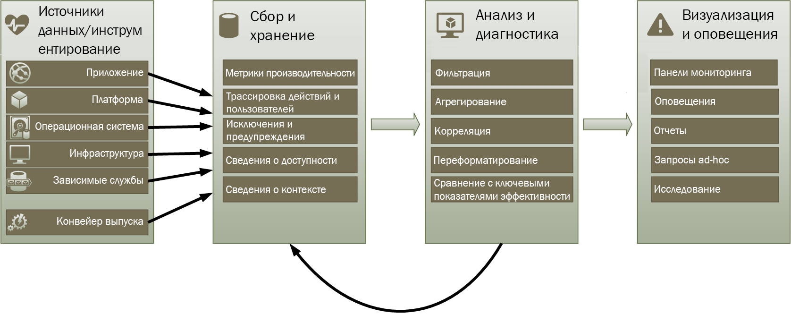
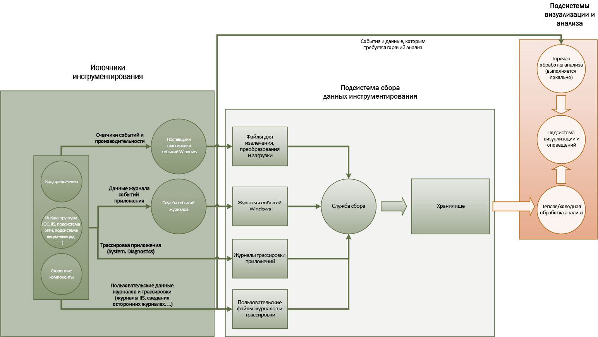
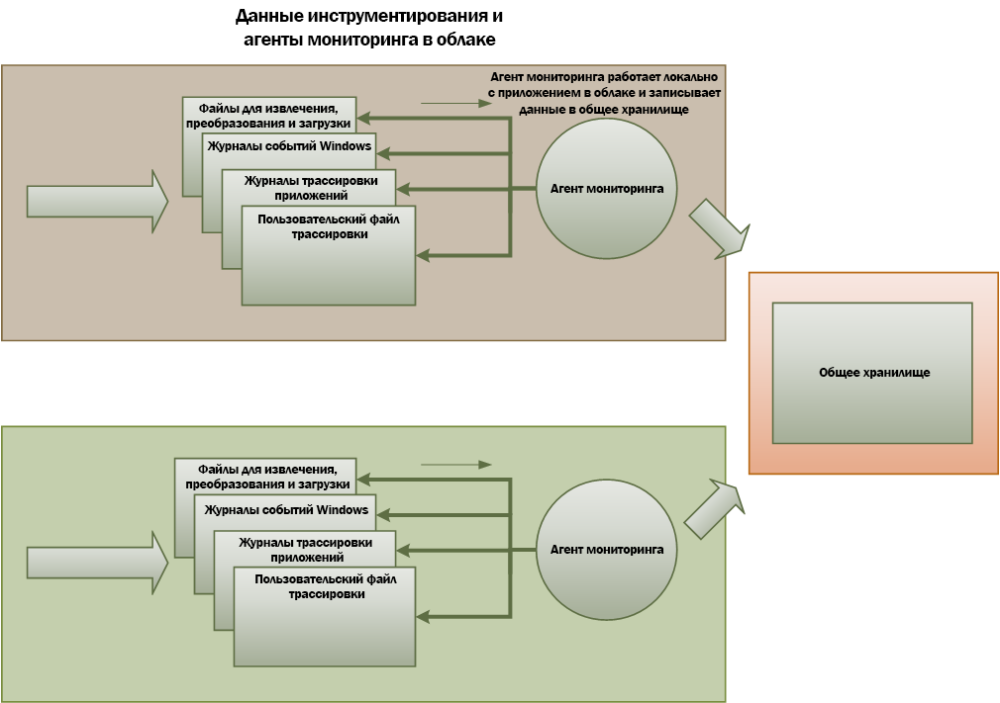

# <a name="monitoring-and-diagnostics"></a><span data-ttu-id="890d1-103">Мониторинг и диагностика.</span><span class="sxs-lookup"><span data-stu-id="890d1-103">Monitoring and diagnostics</span></span>

<span data-ttu-id="890d1-104">Распределенные приложения и службы, работающие в облаке, по своей природе представляют собой сложные программные компоненты, состоящие из множества частей.</span><span class="sxs-lookup"><span data-stu-id="890d1-104">Distributed applications and services running in the cloud are, by their nature, complex pieces of software that comprise many moving parts.</span></span> <span data-ttu-id="890d1-105">В рабочей среде важно иметь возможность отслеживать, как именно пользователи работают с вашей системой, следить за использованием ресурсов и отслеживать общую работоспособность и производительность системы.</span><span class="sxs-lookup"><span data-stu-id="890d1-105">In a production environment, it's important to be able to track the way in which users utilize your system, trace resource utilization, and generally monitor the health and performance of your system.</span></span> <span data-ttu-id="890d1-106">Эту диагностическую информацию можно использовать, чтобы упростить обнаружение и устранение проблем, а также выявление потенциальных проблем и предотвращение их возникновения.</span><span class="sxs-lookup"><span data-stu-id="890d1-106">You can use this information as a diagnostic aid to detect and correct issues, and also to help spot potential problems and prevent them from occurring.</span></span>

## <a name="monitoring-and-diagnostics-scenarios"></a><span data-ttu-id="890d1-107">Сценарии мониторинга и диагностики</span><span class="sxs-lookup"><span data-stu-id="890d1-107">Monitoring and diagnostics scenarios</span></span>

<span data-ttu-id="890d1-108">Мониторинг позволяет лучше понять, насколько хорошо работает система,</span><span class="sxs-lookup"><span data-stu-id="890d1-108">You can use monitoring to gain an insight into how well a system is functioning.</span></span> <span data-ttu-id="890d1-109">является одной из важнейших составляющих процесса обеспечения должного качества обслуживания.</span><span class="sxs-lookup"><span data-stu-id="890d1-109">Monitoring is a crucial part of maintaining quality-of-service targets.</span></span> <span data-ttu-id="890d1-110">К наиболее распространенным сценариям сбора данных мониторинга относятся следующие.</span><span class="sxs-lookup"><span data-stu-id="890d1-110">Common scenarios for collecting monitoring data include:</span></span>

- <span data-ttu-id="890d1-111">Поддержание работоспособности системы.</span><span class="sxs-lookup"><span data-stu-id="890d1-111">Ensuring that the system remains healthy.</span></span>
- <span data-ttu-id="890d1-112">Отслеживание доступности системы и элементов ее компонентов.</span><span class="sxs-lookup"><span data-stu-id="890d1-112">Tracking the availability of the system and its component elements.</span></span>
- <span data-ttu-id="890d1-113">Поддержание определенного уровня производительности, чтобы гарантировать отсутствие резкого снижения пропускной способности системы при возрастании объема работы.</span><span class="sxs-lookup"><span data-stu-id="890d1-113">Maintaining performance to ensure that the throughput of the system does not degrade unexpectedly as the volume of work increases.</span></span>
- <span data-ttu-id="890d1-114">Обеспечение соответствия системы всем соглашениям об уровне обслуживания, заключенным с клиентами.</span><span class="sxs-lookup"><span data-stu-id="890d1-114">Guaranteeing that the system meets any service-level agreements (SLAs) established with customers.</span></span>
- <span data-ttu-id="890d1-115">Защита конфиденциальности и безопасности системы, ее пользователей и их данных.</span><span class="sxs-lookup"><span data-stu-id="890d1-115">Protecting the privacy and security of the system, users, and their data.</span></span>
- <span data-ttu-id="890d1-116">Отслеживание операций, выполняемых в целях аудита или обеспечения соответствия нормативным требованиям.</span><span class="sxs-lookup"><span data-stu-id="890d1-116">Tracking the operations that are performed for auditing or regulatory purposes.</span></span>
- <span data-ttu-id="890d1-117">Мониторинг повседневного использования системы помогает выявлять тенденции, которые при отсутствии своевременных мер могут привести к проблемам.</span><span class="sxs-lookup"><span data-stu-id="890d1-117">Monitoring the day-to-day usage of the system and spotting trends that might lead to problems if they're not addressed.</span></span>
- <span data-ttu-id="890d1-118">Отслеживание возникающих проблем в рамках всего цикла — от исходного отчета до анализа возможных причин, корректировки, последующего обновления программного обеспечения и развертывания.</span><span class="sxs-lookup"><span data-stu-id="890d1-118">Tracking issues that occur, from initial report through to analysis of possible causes, rectification, consequent software updates, and deployment.</span></span>
- <span data-ttu-id="890d1-119">Трассировка операций и отладка выпусков программного обеспечения.</span><span class="sxs-lookup"><span data-stu-id="890d1-119">Tracing operations and debugging software releases.</span></span>

> [!NOTE]
> <span data-ttu-id="890d1-120">Этот список не является исчерпывающим.</span><span class="sxs-lookup"><span data-stu-id="890d1-120">This list is not intended to be comprehensive.</span></span> <span data-ttu-id="890d1-121">Этот документ посвящен именно этим сценариям, поскольку они отражают наиболее распространенные ситуации с мониторингом,</span><span class="sxs-lookup"><span data-stu-id="890d1-121">This document focuses on these scenarios as the most common situations for performing monitoring.</span></span> <span data-ttu-id="890d1-122">однако могут существовать и другие сценарии, которые меньше распространены либо характерны именно для вашей среды.</span><span class="sxs-lookup"><span data-stu-id="890d1-122">There might be others that are less common or are specific to your environment.</span></span>

<span data-ttu-id="890d1-123">В следующих разделах данные сценарии описаны более подробно.</span><span class="sxs-lookup"><span data-stu-id="890d1-123">The following sections describe these scenarios in more detail.</span></span> <span data-ttu-id="890d1-124">Информация по каждому сценарию приводится в следующем формате.</span><span class="sxs-lookup"><span data-stu-id="890d1-124">The information for each scenario is discussed in the following format:</span></span>

1. <span data-ttu-id="890d1-125">Краткий обзор сценария</span><span class="sxs-lookup"><span data-stu-id="890d1-125">A brief overview of the scenario</span></span>
2. <span data-ttu-id="890d1-126">Типовые требования для этого сценария</span><span class="sxs-lookup"><span data-stu-id="890d1-126">The typical requirements of this scenario</span></span>
3. <span data-ttu-id="890d1-127">Необработанные данные инструментирования, необходимые для поддержки этого сценария, и возможные источники таких данных.</span><span class="sxs-lookup"><span data-stu-id="890d1-127">The raw instrumentation data that's required to support the scenario, and possible sources of this information</span></span>
4. <span data-ttu-id="890d1-128">Способы анализа и объединения этих данных для получения полезной диагностической информации.</span><span class="sxs-lookup"><span data-stu-id="890d1-128">How this raw data can be analyzed and combined to generate meaningful diagnostic information</span></span>

## <a name="health-monitoring"></a><span data-ttu-id="890d1-129">Мониторинг работоспособности</span><span class="sxs-lookup"><span data-stu-id="890d1-129">Health monitoring</span></span>

<span data-ttu-id="890d1-130">Система является работоспособной, если она выполняется и может обрабатывать запросы.</span><span class="sxs-lookup"><span data-stu-id="890d1-130">A system is healthy if it is running and capable of processing requests.</span></span> <span data-ttu-id="890d1-131">Мониторинг работоспособности предназначен для создания моментального снимка текущего состояния работоспособности системы, чтобы можно было проверить правильность работы всех компонентов системы.</span><span class="sxs-lookup"><span data-stu-id="890d1-131">The purpose of health monitoring is to generate a snapshot of the current health of the system so that you can verify that all components of the system are functioning as expected.</span></span>

### <a name="requirements-for-health-monitoring"></a><span data-ttu-id="890d1-132">Требования для мониторинга работоспособности</span><span class="sxs-lookup"><span data-stu-id="890d1-132">Requirements for health monitoring</span></span>

<span data-ttu-id="890d1-133">В случае если любая часть системы считается неработоспособной, необходимо быстро (в течение нескольких секунд) оповестить об этом оператора.</span><span class="sxs-lookup"><span data-stu-id="890d1-133">An operator should be alerted quickly (within a matter of seconds) if any part of the system is deemed to be unhealthy.</span></span> <span data-ttu-id="890d1-134">Оператор должен иметь возможность определить, какие части системы работают нормально, а в каких частях возникают неполадки.</span><span class="sxs-lookup"><span data-stu-id="890d1-134">The operator should be able to ascertain which parts of the system are functioning normally, and which parts are experiencing problems.</span></span> <span data-ttu-id="890d1-135">Работоспособность системы можно определить с помощью сигнала светофора:</span><span class="sxs-lookup"><span data-stu-id="890d1-135">System health can be highlighted through a traffic-light system:</span></span>

- <span data-ttu-id="890d1-136">красный цвет для неработоспособного состояния (система остановилась);</span><span class="sxs-lookup"><span data-stu-id="890d1-136">Red for unhealthy (the system has stopped)</span></span>
- <span data-ttu-id="890d1-137">желтый цвет для частично работоспособного состояния (система работает с ограниченными возможностями);</span><span class="sxs-lookup"><span data-stu-id="890d1-137">Yellow for partially healthy (the system is running with reduced functionality)</span></span>
- <span data-ttu-id="890d1-138">зеленый цвет для полностью работоспособного состояния.</span><span class="sxs-lookup"><span data-stu-id="890d1-138">Green for completely healthy</span></span>

<span data-ttu-id="890d1-139">Комплексная система мониторинга работоспособности позволяет оператору выполнять детализацию по системе для просмотра состояния работоспособности подсистем и компонентов.</span><span class="sxs-lookup"><span data-stu-id="890d1-139">A comprehensive health-monitoring system enables an operator to drill down through the system to view the health status of subsystems and components.</span></span> <span data-ttu-id="890d1-140">Например, если вся система является частично работоспособной, оператор должен иметь возможность углубиться в подробности и выяснить, какие функции в настоящее время недоступны.</span><span class="sxs-lookup"><span data-stu-id="890d1-140">For example, if the overall system is depicted as partially healthy, the operator should be able to zoom in and determine which functionality is currently unavailable.</span></span>

### <a name="data-sources-instrumentation-and-data-collection-requirements"></a><span data-ttu-id="890d1-141">Требования к источникам данных, инструментированию и сбору данных</span><span class="sxs-lookup"><span data-stu-id="890d1-141">Data sources, instrumentation, and data-collection requirements</span></span>

<span data-ttu-id="890d1-142">Необработанные данные, необходимые для реализации мониторинга работоспособности, могут создаваться в рамках следующих процессов:</span><span class="sxs-lookup"><span data-stu-id="890d1-142">The raw data that's required to support health monitoring can be generated as a result of:</span></span>

- <span data-ttu-id="890d1-143">Трассировка выполнения запросов пользователей.</span><span class="sxs-lookup"><span data-stu-id="890d1-143">Tracing execution of user requests.</span></span> <span data-ttu-id="890d1-144">Эти сведения можно использовать для определения того, какие запросы выполнены успешно, какие завершились со сбоем и сколько времени занимает выполнение каждого запроса.</span><span class="sxs-lookup"><span data-stu-id="890d1-144">This information can be used to determine which requests have succeeded, which have failed, and how long each request takes.</span></span>
- <span data-ttu-id="890d1-145">Мониторинг искусственных пользователей.</span><span class="sxs-lookup"><span data-stu-id="890d1-145">Synthetic user monitoring.</span></span> <span data-ttu-id="890d1-146">Этот процесс имитирует действия пользователя и выполняет ряд стандартных действий.</span><span class="sxs-lookup"><span data-stu-id="890d1-146">This process simulates the steps performed by a user and follows a predefined series of steps.</span></span> <span data-ttu-id="890d1-147">Результаты каждого действия следует регистрировать.</span><span class="sxs-lookup"><span data-stu-id="890d1-147">The results of each step should be captured.</span></span>
- <span data-ttu-id="890d1-148">Ведение журнала исключений, ошибок и оповещений.</span><span class="sxs-lookup"><span data-stu-id="890d1-148">Logging exceptions, faults, and warnings.</span></span> <span data-ttu-id="890d1-149">Эти сведения могут регистрироваться в результате выполнения трассировочных операторов, внедренных в код приложения, а также при извлечении сведений из журналов событий любой из служб, на которые ссылается система.</span><span class="sxs-lookup"><span data-stu-id="890d1-149">This information can be captured as a result of trace statements embedded into the application code, as well as retrieving information from the event logs of any services that the system references.</span></span>
- <span data-ttu-id="890d1-150">Мониторинг работоспособности служб сторонних поставщиков, используемых в системе.</span><span class="sxs-lookup"><span data-stu-id="890d1-150">Monitoring the health of any third-party services that the system uses.</span></span> <span data-ttu-id="890d1-151">Для этого может потребоваться получение и анализ данных о работоспособности, предоставляемых этими службами,</span><span class="sxs-lookup"><span data-stu-id="890d1-151">This monitoring might require retrieving and parsing health data that these services supply.</span></span> <span data-ttu-id="890d1-152">а такая информация может предлагаться в нескольких форматах.</span><span class="sxs-lookup"><span data-stu-id="890d1-152">This information might take a variety of formats.</span></span>
- <span data-ttu-id="890d1-153">Мониторинг конечной точки.</span><span class="sxs-lookup"><span data-stu-id="890d1-153">Endpoint monitoring.</span></span> <span data-ttu-id="890d1-154">Этот механизм более подробно описан в разделе "Мониторинг доступности".</span><span class="sxs-lookup"><span data-stu-id="890d1-154">This mechanism is described in more detail in the "Availability monitoring" section.</span></span>
- <span data-ttu-id="890d1-155">Сбор сведений о производительности окружающей среды, таких как фоновое использование ЦП или операции ввода-вывода (включая сеть).</span><span class="sxs-lookup"><span data-stu-id="890d1-155">Collecting ambient performance information, such as background CPU utilization or I/O (including network) activity.</span></span>

### <a name="analyzing-health-data"></a><span data-ttu-id="890d1-156">Анализ данных о работоспособности</span><span class="sxs-lookup"><span data-stu-id="890d1-156">Analyzing health data</span></span>

<span data-ttu-id="890d1-157">Основная задача мониторинга работоспособности заключается в том, чтобы быстро определить, работает ли система.</span><span class="sxs-lookup"><span data-stu-id="890d1-157">The primary focus of health monitoring is to quickly indicate whether the system is running.</span></span> <span data-ttu-id="890d1-158">Горячий анализ непосредственных данных может вызвать оповещение в случае обнаружения неработоспособности критического компонента</span><span class="sxs-lookup"><span data-stu-id="890d1-158">Hot analysis of the immediate data can trigger an alert if a critical component is detected as unhealthy.</span></span> <span data-ttu-id="890d1-159">(например, если он не в состоянии ответить на ряд последовательных сигналов проверки связи). После этого оператор может предпринять соответствующее корректирующее действие.</span><span class="sxs-lookup"><span data-stu-id="890d1-159">(It fails to respond to a consecutive series of pings, for example.) The operator can then take the appropriate corrective action.</span></span>

<span data-ttu-id="890d1-160">Более сложные системы могут включать в себя прогнозирующий элемент, который выполняет холодный анализ недавних и текущих рабочих нагрузок.</span><span class="sxs-lookup"><span data-stu-id="890d1-160">A more advanced system might include a predictive element that performs a cold analysis over recent and current workloads.</span></span> <span data-ttu-id="890d1-161">Холодный анализ позволяет выявить тенденции и определить, останется ли система работоспособной или требуются дополнительные ресурсы.</span><span class="sxs-lookup"><span data-stu-id="890d1-161">A cold analysis can spot trends and determine whether the system is likely to remain healthy or whether the system will need additional resources.</span></span> <span data-ttu-id="890d1-162">Этот прогнозирующий элемент должен быть основан на критических метриках производительности, таких как:</span><span class="sxs-lookup"><span data-stu-id="890d1-162">This predictive element should be based on critical performance metrics, such as:</span></span>

- <span data-ttu-id="890d1-163">частота выполнения запросов, направляемых в каждую службу или подсистему;</span><span class="sxs-lookup"><span data-stu-id="890d1-163">The rate of requests directed at each service or subsystem.</span></span>
- <span data-ttu-id="890d1-164">время отклика для таких запросов;</span><span class="sxs-lookup"><span data-stu-id="890d1-164">The response times of these requests.</span></span>
- <span data-ttu-id="890d1-165">объем данных, передаваемых в каждую службу и из нее.</span><span class="sxs-lookup"><span data-stu-id="890d1-165">The volume of data flowing into and out of each service.</span></span>

<span data-ttu-id="890d1-166">Если значение любой метрики превышает указанный порог, система может выдать оповещение, чтобы позволить оператору или функции автоматического масштабирования (если она доступна) предпринять профилактические действия, необходимые для поддержания работоспособности системы.</span><span class="sxs-lookup"><span data-stu-id="890d1-166">If the value of any metric exceeds a defined threshold, the system can raise an alert to enable an operator or autoscaling (if available) to take the preventative actions necessary to maintain system health.</span></span> <span data-ttu-id="890d1-167">Для выполнения этих действий могут потребоваться дополнительные ресурсы, перезапуск одной или нескольких неработающих служб или применение регулирования к запросам с более низким приоритетом.</span><span class="sxs-lookup"><span data-stu-id="890d1-167">These actions might involve adding resources, restarting one or more services that are failing, or applying throttling to lower-priority requests.</span></span>

## <a name="availability-monitoring"></a><span data-ttu-id="890d1-168">Мониторинг доступности</span><span class="sxs-lookup"><span data-stu-id="890d1-168">Availability monitoring</span></span>

<span data-ttu-id="890d1-169">В полностью работоспособной системе должны быть доступны все составляющие ее компоненты и подсистемы.</span><span class="sxs-lookup"><span data-stu-id="890d1-169">A truly healthy system requires that the components and subsystems that compose the system are available.</span></span> <span data-ttu-id="890d1-170">Мониторинг доступности тесно связан с мониторингом работоспособности,</span><span class="sxs-lookup"><span data-stu-id="890d1-170">Availability monitoring is closely related to health monitoring.</span></span> <span data-ttu-id="890d1-171">однако, если мониторинг работоспособности обеспечивает немедленное представление текущего состояния работоспособности системы, то он отвечает за отслеживание доступности системы и ее компонентов в целях формирования статистических данных, касающихся бесперебойной работы системы.</span><span class="sxs-lookup"><span data-stu-id="890d1-171">But whereas health monitoring provides an immediate view of the current health of the system, availability monitoring is concerned with tracking the availability of the system and its components to generate statistics about the uptime of the system.</span></span>

<span data-ttu-id="890d1-172">Во многих системах некоторые компоненты (например, база данных) имеют встроенную избыточность, чтобы обеспечить быструю отработку отказа в случае серьезной ошибки или потери подключения.</span><span class="sxs-lookup"><span data-stu-id="890d1-172">In many systems, some components (such as a database) are configured with built-in redundancy to permit rapid failover in the event of a serious fault or loss of connectivity.</span></span> <span data-ttu-id="890d1-173">В идеальном варианте пользователи не должны знать о том, что возникла такая ошибка,</span><span class="sxs-lookup"><span data-stu-id="890d1-173">Ideally, users should not be aware that such a failure has occurred.</span></span> <span data-ttu-id="890d1-174">однако, с точки зрения мониторинга доступности, необходимо собрать как можно больше данных о таких сбоях, чтобы попытаться определить причину и предпринять корректирующие действия, направленные на предотвращение возникновения подобной проблемы в дальнейшем.</span><span class="sxs-lookup"><span data-stu-id="890d1-174">But from an availability monitoring perspective, it's necessary to gather as much information as possible about such failures to determine the cause and take corrective actions to prevent them from recurring.</span></span>

<span data-ttu-id="890d1-175">Данные, необходимые для отслеживания доступности, могут зависеть от ряда факторов более низкого уровня,</span><span class="sxs-lookup"><span data-stu-id="890d1-175">The data that's required to track availability might depend on a number of lower-level factors.</span></span> <span data-ttu-id="890d1-176">многие из которых могут относиться к приложению, системе и среде.</span><span class="sxs-lookup"><span data-stu-id="890d1-176">Many of these factors might be specific to the application, system, and environment.</span></span> <span data-ttu-id="890d1-177">Эффективная система мониторинга собирает данные о доступности, соответствующие этим низкоуровневым факторам, и затем выполняет их статистическую обработку, чтобы сформировать общее представление о системе.</span><span class="sxs-lookup"><span data-stu-id="890d1-177">An effective monitoring system captures the availability data that corresponds to these low-level factors and then aggregates them to give an overall picture of the system.</span></span> <span data-ttu-id="890d1-178">Например, в системе электронной коммерции бизнес-функции, позволяющие клиенту размещать заказы, могут зависеть от репозитория, в котором хранятся сведения о заказе, и платежной системы, которая обрабатывает денежные операции для оплаты таких заказов.</span><span class="sxs-lookup"><span data-stu-id="890d1-178">For example, in an e-commerce system, the business functionality that enables a customer to place orders might depend on the repository where order details are stored and the payment system that handles the monetary transactions for paying for these orders.</span></span> <span data-ttu-id="890d1-179">Таким образом, доступность той части системы, которая отвечает за размещение заказов, является функцией доступности репозитория и подсистемы оплаты.</span><span class="sxs-lookup"><span data-stu-id="890d1-179">The availability of the order-placement part of the system is therefore a function of the availability of the repository and the payment subsystem.</span></span>

### <a name="requirements-for-availability-monitoring"></a><span data-ttu-id="890d1-180">Требования для мониторинга доступности</span><span class="sxs-lookup"><span data-stu-id="890d1-180">Requirements for availability monitoring</span></span>

<span data-ttu-id="890d1-181">Оператор также должен иметь возможность просматривать исторические данные о доступности каждой системы и подсистемы и использовать эту информацию для выявления каких-либо тенденций, которые могут стать причиной периодических сбоев одной или нескольких подсистем</span><span class="sxs-lookup"><span data-stu-id="890d1-181">An operator should also be able to view the historical availability of each system and subsystem, and use this information to spot any trends that might cause one or more subsystems to periodically fail.</span></span> <span data-ttu-id="890d1-182">(например, когда сбой служб происходит в определенное время дня, соответствующее часам максимальной нагрузки).</span><span class="sxs-lookup"><span data-stu-id="890d1-182">(Do services start to fail at a particular time of day that corresponds to peak processing hours?)</span></span>

<span data-ttu-id="890d1-183">Решение мониторинга предоставляет текущие и исторические данные о доступности каждой подсистемы.</span><span class="sxs-lookup"><span data-stu-id="890d1-183">A monitoring solution should provide an immediate and historical view of the availability or unavailability of each subsystem.</span></span> <span data-ttu-id="890d1-184">Кроме того, оно должно обеспечивать возможность быстрого оповещения оператора в случае, когда происходит сбой одной или нескольких служб либо пользователям не удается подключиться к службам.</span><span class="sxs-lookup"><span data-stu-id="890d1-184">It should also be capable of quickly alerting an operator when one or more services fail or when users can't connect to services.</span></span> <span data-ttu-id="890d1-185">Это требует не только мониторинга каждой службы, но и проверки действий, выполняемых каждым пользователем, если такие действия заканчиваются неудачей при попытке взаимодействия со службой.</span><span class="sxs-lookup"><span data-stu-id="890d1-185">This is a matter of not only monitoring each service, but also examining the actions that each user performs if these actions fail when they attempt to communicate with a service.</span></span> <span data-ttu-id="890d1-186">В некоторой степени сбой подключения является нормальным и может быть вызван временными ошибками,</span><span class="sxs-lookup"><span data-stu-id="890d1-186">To some extent, a degree of connectivity failure is normal and might be due to transient errors.</span></span> <span data-ttu-id="890d1-187">однако может оказаться удобным разрешить системе выдавать оповещение, если за конкретный период времени для заданной подсистемы возникло определенное число ошибок подключения.</span><span class="sxs-lookup"><span data-stu-id="890d1-187">But it might be useful to allow the system to raise an alert for the number of connectivity failures to a specified subsystem that occur during a specific period.</span></span>

<!-- markdownlint-disable MD024 MD033 -->

### <a name="data-sources-instrumentation-and-data-collection-requirements"></a><span data-ttu-id="890d1-188">Требования к источникам данных, инструментированию и сбору данных</span><span class="sxs-lookup"><span data-stu-id="890d1-188">Data sources, instrumentation, and data-collection requirements</span></span>

<span data-ttu-id="890d1-189">Как и в случае с мониторингом работоспособности, необработанные данные, необходимые для обеспечения мониторинга доступности, могут создаваться в результате мониторинга искусственных пользователей, а также регистрации любых исключений, ошибок и оповещений, которые могут возникать в системе.</span><span class="sxs-lookup"><span data-stu-id="890d1-189">As with health monitoring, the raw data that's required to support availability monitoring can be generated as a result of synthetic user monitoring and logging any exceptions, faults, and warnings that might occur.</span></span> <span data-ttu-id="890d1-190">Кроме того, данные о доступности можно получить с помощью мониторинга конечной точки.</span><span class="sxs-lookup"><span data-stu-id="890d1-190">In addition, availability data can be obtained from performing endpoint monitoring.</span></span> <span data-ttu-id="890d1-191">Приложение может предоставлять одну или несколько конечных точек работоспособности, каждая из которых тестирует доступ к функциональной области в системе.</span><span class="sxs-lookup"><span data-stu-id="890d1-191">The application can expose one or more health endpoints, each testing access to a functional area within the system.</span></span> <span data-ttu-id="890d1-192">Система мониторинга может проверять связь с каждой конечной точки по определенному расписанию и собирать полученные результаты (успех или сбой).</span><span class="sxs-lookup"><span data-stu-id="890d1-192">The monitoring system can ping each endpoint by following a defined schedule and collect the results (success or fail).</span></span>

<span data-ttu-id="890d1-193">Все случаи истекшего времени ожидания, сбоев подключения к сети и повторных попыток соединения следует регистрировать.</span><span class="sxs-lookup"><span data-stu-id="890d1-193">All timeouts, network connectivity failures, and connection retry attempts must be recorded.</span></span> <span data-ttu-id="890d1-194">Все данные должны иметь метки времени.</span><span class="sxs-lookup"><span data-stu-id="890d1-194">All data should be time-stamped.</span></span>

### <a name="analyzing-availability-data"></a><span data-ttu-id="890d1-195">Анализ данных о доступности</span><span class="sxs-lookup"><span data-stu-id="890d1-195">Analyzing availability data</span></span>

<span data-ttu-id="890d1-196">Данные инструментирования необходимо статистически обработать и сопоставить, чтобы обеспечить выполнение следующих типов анализа.</span><span class="sxs-lookup"><span data-stu-id="890d1-196">The instrumentation data must be aggregated and correlated to support the following types of analysis:</span></span>

- <span data-ttu-id="890d1-197">Немедленная доступность системы и подсистем.</span><span class="sxs-lookup"><span data-stu-id="890d1-197">The immediate availability of the system and subsystems.</span></span>
- <span data-ttu-id="890d1-198">Число сбоев доступности системы и подсистем.</span><span class="sxs-lookup"><span data-stu-id="890d1-198">The availability failure rates of the system and subsystems.</span></span> <span data-ttu-id="890d1-199">В идеале оператор должен иметь возможность сопоставлять сбои с определенными действиями, определяя, что именно произошло при сбое системы.</span><span class="sxs-lookup"><span data-stu-id="890d1-199">Ideally, an operator should be able to correlate failures with specific activities: what was happening when the system failed?</span></span>
- <span data-ttu-id="890d1-200">Историческое представление частоты сбоев системы или любой подсистемы за любой заданный период, а также загрузка системы (например количество запросов пользователей) во время сбоя.</span><span class="sxs-lookup"><span data-stu-id="890d1-200">A historical view of failure rates of the system or any subsystems across any specified period, and the load on the system (number of user requests, for example) when a failure occurred.</span></span>
- <span data-ttu-id="890d1-201">Причины недоступности системы или любой подсистемы.</span><span class="sxs-lookup"><span data-stu-id="890d1-201">The reasons for unavailability of the system or any subsystems.</span></span> <span data-ttu-id="890d1-202">Причиной может служить потеря подключения, истечение времени ожидания при наличии подключения и возвращение ошибок в подключенном состоянии.</span><span class="sxs-lookup"><span data-stu-id="890d1-202">For example, the reasons might be service not running, connectivity lost, connected but timing out, and connected but returning errors.</span></span>

<span data-ttu-id="890d1-203">С помощью следующей формулы можно вычислить процент доступности службы за период времени:</span><span class="sxs-lookup"><span data-stu-id="890d1-203">You can calculate the percentage availability of a service over a period of time by using the following formula:</span></span>

```console
%Availability =  ((Total Time – Total Downtime) / Total Time ) * 100
```

<span data-ttu-id="890d1-204">Это полезно для выполнения соглашений об уровне обслуживания</span><span class="sxs-lookup"><span data-stu-id="890d1-204">This is useful for SLA purposes.</span></span> <span data-ttu-id="890d1-205">([мониторинг соглашений об уровне обслуживания](#sla-monitoring) более подробно описан далее в этом руководстве). Определение *времени простоя* зависит от службы.</span><span class="sxs-lookup"><span data-stu-id="890d1-205">([SLA monitoring](#sla-monitoring) is described in more detail later in this guidance.) The definition of *downtime* depends on the service.</span></span> <span data-ttu-id="890d1-206">Например, служба сборки Visual Studio Team Services определяет время простоя как период (общее количество накопленных минут), во время которого служба сборки недоступна.</span><span class="sxs-lookup"><span data-stu-id="890d1-206">For example, Visual Studio Team Services Build Service defines downtime as the period (total accumulated minutes) during which Build Service is unavailable.</span></span> <span data-ttu-id="890d1-207">Минута считается недоступной, если непрерывные HTTP-запросы к службе сборки на выполнение операций, отличных от операций, инициируемых клиентом, в течение всей минуты приводят к появлению кода ошибки или не возвращают ответ.</span><span class="sxs-lookup"><span data-stu-id="890d1-207">A minute is considered unavailable if all continuous HTTP requests to Build Service to perform customer-initiated operations throughout the minute either result in an error code or do not return a response.</span></span>

## <a name="performance-monitoring"></a><span data-ttu-id="890d1-208">Мониторинг производительности</span><span class="sxs-lookup"><span data-stu-id="890d1-208">Performance monitoring</span></span>

<span data-ttu-id="890d1-209">По мере возрастания нагрузки на систему из-за увеличения числа пользователей и размера наборов данных, используемых этими пользователями, становится более вероятным сбой одного или нескольких компонентов.</span><span class="sxs-lookup"><span data-stu-id="890d1-209">As the system is placed under more and more stress (by increasing the volume of users), the size of the datasets that these users access grows and the possibility of failure of one or more components becomes more likely.</span></span> <span data-ttu-id="890d1-210">Часто сбою компонента предшествует снижение производительности.</span><span class="sxs-lookup"><span data-stu-id="890d1-210">Frequently, component failure is preceded by a decrease in performance.</span></span> <span data-ttu-id="890d1-211">Если вам удается обнаружить такое снижение, можно предпринять упреждающие меры для исправления ситуации.</span><span class="sxs-lookup"><span data-stu-id="890d1-211">If you're able detect such a decrease, you can take proactive steps to remedy the situation.</span></span>

<span data-ttu-id="890d1-212">Производительность системы зависит от ряда факторов.</span><span class="sxs-lookup"><span data-stu-id="890d1-212">System performance depends on a number of factors.</span></span> <span data-ttu-id="890d1-213">Каждый фактор обычно измеряется с помощью ключевых показателей эффективности (KPI), например по количеству транзакций базы данных в секунду или объему сетевых запросов, успешно обработанных в заданный период.</span><span class="sxs-lookup"><span data-stu-id="890d1-213">Each factor is typically measured through key performance indicators (KPIs), such as the number of database transactions per second or the volume of network requests that are successfully serviced in a specified time frame.</span></span> <span data-ttu-id="890d1-214">Некоторые из этих ключевых показателей эффективности могут быть определены непосредственно из мер производительности, в то время как другие могут выводиться из сочетания разных метрик.</span><span class="sxs-lookup"><span data-stu-id="890d1-214">Some of these KPIs might be available as specific performance measures, whereas others might be derived from a combination of metrics.</span></span>

> [!NOTE]
> <span data-ttu-id="890d1-215">Для определения низкой или высокой производительности требуется осознавать тот уровень производительности, с которым способна работать система.</span><span class="sxs-lookup"><span data-stu-id="890d1-215">Determining poor or good performance requires that you understand the level of performance at which the system should be capable of running.</span></span> <span data-ttu-id="890d1-216">Для этого необходимо наблюдать за системой во время ее работы в условиях обычной загрузки и собирать данные по каждому ключевому показателю эффективности за некоторый период времени.</span><span class="sxs-lookup"><span data-stu-id="890d1-216">This requires observing the system while it's functioning under a typical load and capturing the data for each KPI over a period of time.</span></span> <span data-ttu-id="890d1-217">Это может включать в себя запуск системы с имитацией нагрузки в тестовой среде и сбор соответствующих данных перед развертыванием системы в рабочей среде.</span><span class="sxs-lookup"><span data-stu-id="890d1-217">This might involve running the system under a simulated load in a test environment and gathering the appropriate data before deploying the system to a production environment.</span></span>
>
> <span data-ttu-id="890d1-218">Следует также убедиться, что мониторинг в целях определения производительности не превратится в нагрузку для системы.</span><span class="sxs-lookup"><span data-stu-id="890d1-218">You should also ensure that monitoring for performance purposes does not become a burden on the system.</span></span> <span data-ttu-id="890d1-219">Можно динамически настраивать уровень детализации для данных, собираемых процессом мониторинга производительности.</span><span class="sxs-lookup"><span data-stu-id="890d1-219">You might be able to dynamically adjust the level of detail for the data that the performance monitoring process gathers.</span></span>

### <a name="requirements-for-performance-monitoring"></a><span data-ttu-id="890d1-220">Требования для мониторинга производительности</span><span class="sxs-lookup"><span data-stu-id="890d1-220">Requirements for performance monitoring</span></span>

<span data-ttu-id="890d1-221">Чтобы оценить производительность системы, оператору обычно требуется просмотреть следующие сведения:</span><span class="sxs-lookup"><span data-stu-id="890d1-221">To examine system performance, an operator typically needs to see information that includes:</span></span>

- <span data-ttu-id="890d1-222">Уровни откликов для запросов пользователей.</span><span class="sxs-lookup"><span data-stu-id="890d1-222">The response rates for user requests.</span></span>
- <span data-ttu-id="890d1-223">Число параллельных запросов пользователей.</span><span class="sxs-lookup"><span data-stu-id="890d1-223">The number of concurrent user requests.</span></span>
- <span data-ttu-id="890d1-224">Объем сетевого трафика.</span><span class="sxs-lookup"><span data-stu-id="890d1-224">The volume of network traffic.</span></span>
- <span data-ttu-id="890d1-225">Значения скорости выполнения бизнес-транзакций.</span><span class="sxs-lookup"><span data-stu-id="890d1-225">The rates at which business transactions are being completed.</span></span>
- <span data-ttu-id="890d1-226">Среднее время обработки запросов.</span><span class="sxs-lookup"><span data-stu-id="890d1-226">The average processing time for requests.</span></span>

<span data-ttu-id="890d1-227">Полезно также предоставить средства, позволяющие оператору выявлять корреляции, например:</span><span class="sxs-lookup"><span data-stu-id="890d1-227">It can also be helpful to provide tools that enable an operator to help spot correlations, such as:</span></span>

- <span data-ttu-id="890d1-228">сравнение количества одновременно работающих пользователей со значениями времени задержки запросов (сколько времени необходимо для начала обработки запроса после отправки его пользователем);</span><span class="sxs-lookup"><span data-stu-id="890d1-228">The number of concurrent users versus request latency times (how long it takes to start processing a request after the user has sent it).</span></span>
- <span data-ttu-id="890d1-229">сравнение количества одновременно работающих пользователей со средним временем отклика (сколько времени необходимо для завершения запроса после начала его обработки);</span><span class="sxs-lookup"><span data-stu-id="890d1-229">The number of concurrent users versus the average response time (how long it takes to complete a request after it has started processing).</span></span>
- <span data-ttu-id="890d1-230">сравнение объема запросов с числом ошибок обработки.</span><span class="sxs-lookup"><span data-stu-id="890d1-230">The volume of requests versus the number of processing errors.</span></span>

<span data-ttu-id="890d1-231">Кроме этих функциональных сведений высокого уровня, оператор также должен иметь возможность получить подробную информацию о производительности каждого компонента в системе.</span><span class="sxs-lookup"><span data-stu-id="890d1-231">Along with this high-level functional information, an operator should be able to obtain a detailed view of the performance for each component in the system.</span></span> <span data-ttu-id="890d1-232">Эти данные обычно предоставляются с помощью низкоуровневых счетчиков производительности, отслеживающих такие данные, как:</span><span class="sxs-lookup"><span data-stu-id="890d1-232">This data is typically provided through low-level performance counters that track information such as:</span></span>

- <span data-ttu-id="890d1-233">использование памяти;</span><span class="sxs-lookup"><span data-stu-id="890d1-233">Memory utilization.</span></span>
- <span data-ttu-id="890d1-234">число потоков;</span><span class="sxs-lookup"><span data-stu-id="890d1-234">Number of threads.</span></span>
- <span data-ttu-id="890d1-235">время обработки ЦП;</span><span class="sxs-lookup"><span data-stu-id="890d1-235">CPU processing time.</span></span>
- <span data-ttu-id="890d1-236">длина очереди запросов;</span><span class="sxs-lookup"><span data-stu-id="890d1-236">Request queue length.</span></span>
- <span data-ttu-id="890d1-237">число операций и ошибок ввода-вывода для диска или сети;</span><span class="sxs-lookup"><span data-stu-id="890d1-237">Disk or network I/O rates and errors.</span></span>
- <span data-ttu-id="890d1-238">число записанных или считанных байтов;</span><span class="sxs-lookup"><span data-stu-id="890d1-238">Number of bytes written or read.</span></span>
- <span data-ttu-id="890d1-239">индикаторы ПО промежуточного слоя, такие как длина очереди.</span><span class="sxs-lookup"><span data-stu-id="890d1-239">Middleware indicators, such as queue length.</span></span>

<span data-ttu-id="890d1-240">Все визуализации должны позволять оператору указать период времени;</span><span class="sxs-lookup"><span data-stu-id="890d1-240">All visualizations should allow an operator to specify a time period.</span></span> <span data-ttu-id="890d1-241">отображаемые данные могут быть моментальным снимком текущей ситуации и/или историческим представлением производительности.</span><span class="sxs-lookup"><span data-stu-id="890d1-241">The displayed data might be a snapshot of the current situation and/or a historical view of the performance.</span></span>

<span data-ttu-id="890d1-242">Оператор должен иметь возможность создавать оповещения по любой мере производительности для любого конкретного значения в рамках любого заданного интервала времени.</span><span class="sxs-lookup"><span data-stu-id="890d1-242">An operator should be able to raise an alert based on any performance measure for any specified value during any specified time interval.</span></span>

### <a name="data-sources-instrumentation-and-data-collection-requirements"></a><span data-ttu-id="890d1-243">Требования к источникам данных, инструментированию и сбору данных</span><span class="sxs-lookup"><span data-stu-id="890d1-243">Data sources, instrumentation, and data-collection requirements</span></span>

<span data-ttu-id="890d1-244">Высокоуровневые данные о производительности (пропускная способность, число одновременных пользователей, количество бизнес-транзакций, частота возникновения ошибок и т. п.) можно собрать, отслеживая ход выполнения запросов пользователей по мере их получения и прохождения через систему.</span><span class="sxs-lookup"><span data-stu-id="890d1-244">You can gather high-level performance data (throughput, number of concurrent users, number of business transactions, error rates, and so on) by monitoring the progress of users' requests as they arrive and pass through the system.</span></span> <span data-ttu-id="890d1-245">Это подразумевает включение трассировочного оператора в ключевых точках кода приложения вместе с данными синхронизации.</span><span class="sxs-lookup"><span data-stu-id="890d1-245">This involves incorporating tracing statements at key points in the application code, together with timing information.</span></span> <span data-ttu-id="890d1-246">Все ошибки, исключения и оповещения следует регистрировать вместе с достаточным объемом данных, позволяющим соотнести их с вызвавшими их запросами.</span><span class="sxs-lookup"><span data-stu-id="890d1-246">All faults, exceptions, and warnings should be captured with sufficient data for correlating them with the requests that caused them.</span></span> <span data-ttu-id="890d1-247">Другим полезным источником является журнал служб Internet Information Services (IIS).</span><span class="sxs-lookup"><span data-stu-id="890d1-247">The Internet Information Services (IIS) log is another useful source.</span></span>

<span data-ttu-id="890d1-248">Если это возможно, следует также собирать данные о производительности для всех внешних систем, используемых приложением.</span><span class="sxs-lookup"><span data-stu-id="890d1-248">If possible, you should also capture performance data for any external systems that the application uses.</span></span> <span data-ttu-id="890d1-249">Эти внешние системы могут предоставлять свои собственные счетчики производительности или другие функции для запроса данных о производительности.</span><span class="sxs-lookup"><span data-stu-id="890d1-249">These external systems might provide their own performance counters or other features for requesting performance data.</span></span> <span data-ttu-id="890d1-250">Если это невозможно, запишите сведения, такие как время начала и окончания каждого запроса, выполняемого для внешней системы, вместе с состоянием операции (успех, ошибка или оповещение).</span><span class="sxs-lookup"><span data-stu-id="890d1-250">If this is not possible, record information such as the start time and end time of each request made to an external system, together with the status (success, fail, or warning) of the operation.</span></span> <span data-ttu-id="890d1-251">Например, для регистрации времени запросов можно использовать принцип секундомера: включите таймер при запуске запроса, а затем остановите таймер при завершении запроса.</span><span class="sxs-lookup"><span data-stu-id="890d1-251">For example, you can use a stopwatch approach to time requests: start a timer when the request starts and then stop the timer when the request finishes.</span></span>

<span data-ttu-id="890d1-252">Низкоуровневые данные о производительности для отдельных компонентов в системе можно получить с помощью таких функций и служб, как счетчики производительности Windows и диагностика Azure.</span><span class="sxs-lookup"><span data-stu-id="890d1-252">Low-level performance data for individual components in a system might be available through features and services such as Windows performance counters and Azure Diagnostics.</span></span>

### <a name="analyzing-performance-data"></a><span data-ttu-id="890d1-253">Анализ данных о производительности</span><span class="sxs-lookup"><span data-stu-id="890d1-253">Analyzing performance data</span></span>

<span data-ttu-id="890d1-254">Значительная часть работы по анализу состоит из статистической обработки данных о производительности по типу запроса пользователя и/или по подсистеме или службе, в которую отправляется каждый запрос.</span><span class="sxs-lookup"><span data-stu-id="890d1-254">Much of the analysis work consists of aggregating performance data by user request type and/or the subsystem or service to which each request is sent.</span></span> <span data-ttu-id="890d1-255">В качестве примера запроса пользователя можно привести добавление элемента в корзину для покупок или выполнение процедуры оформления заказа в системе электронной коммерции.</span><span class="sxs-lookup"><span data-stu-id="890d1-255">An example of a user request is adding an item to a shopping cart or performing the checkout process in an e-commerce system.</span></span>

<span data-ttu-id="890d1-256">Другим распространенным требованием является суммирование данных о производительности по выбранным процентилям.</span><span class="sxs-lookup"><span data-stu-id="890d1-256">Another common requirement is summarizing performance data in selected percentiles.</span></span> <span data-ttu-id="890d1-257">Например, оператор может определить время отклика для 99 % запросов, 95 % запросов и 70 % запросов.</span><span class="sxs-lookup"><span data-stu-id="890d1-257">For example, an operator might determine the response times for 99 percent of requests, 95 percent of requests, and 70 percent of requests.</span></span> <span data-ttu-id="890d1-258">Для каждого процентиля могут быть заданы целевые показатели соглашения об уровне обслуживания или другой набор целевых показателей.</span><span class="sxs-lookup"><span data-stu-id="890d1-258">There might be SLA targets or other goals set for each percentile.</span></span> <span data-ttu-id="890d1-259">Текущие результаты должны предоставляться практически в режиме реального времени, чтобы способствовать немедленному обнаружению проблем,</span><span class="sxs-lookup"><span data-stu-id="890d1-259">The ongoing results should be reported in near real time to help detect immediate issues.</span></span> <span data-ttu-id="890d1-260">а также статистически обрабатываться за более длительные периоды.</span><span class="sxs-lookup"><span data-stu-id="890d1-260">The results should also be aggregated over the longer time for statistical purposes.</span></span>

<span data-ttu-id="890d1-261">В случае проблем с задержкой, влияющих на производительность, оператор должен быстро определить причину возникновения узкого места, проверяя задержку каждого из действий, выполняемого каждым запросом.</span><span class="sxs-lookup"><span data-stu-id="890d1-261">In the case of latency issues affecting performance, an operator should be able to quickly identify the cause of the bottleneck by examining the latency of each step that each request performs.</span></span> <span data-ttu-id="890d1-262">Таким образом, данные о производительности должны предоставлять средства для сопоставления мер производительности для каждого действия, позволяющие привязать их к определенному запросу.</span><span class="sxs-lookup"><span data-stu-id="890d1-262">The performance data must therefore provide a means of correlating performance measures for each step to tie them to a specific request.</span></span>

<span data-ttu-id="890d1-263">В зависимости от требований к визуализации может быть полезно создавать и хранить куб данных, содержащий представления необработанных данных.</span><span class="sxs-lookup"><span data-stu-id="890d1-263">Depending on the visualization requirements, it might be useful to generate and store a data cube that contains views of the raw data.</span></span> <span data-ttu-id="890d1-264">На основе этого куба можно выполнять сложные специализированные запросы и анализ сведений о производительности.</span><span class="sxs-lookup"><span data-stu-id="890d1-264">This data cube can allow complex ad hoc querying and analysis of the performance information.</span></span>

## <a name="security-monitoring"></a><span data-ttu-id="890d1-265">Мониторинг безопасности</span><span class="sxs-lookup"><span data-stu-id="890d1-265">Security monitoring</span></span>

<span data-ttu-id="890d1-266">Во всех коммерческих системах, содержащих конфиденциальные данные, должна быть реализована структура безопасности.</span><span class="sxs-lookup"><span data-stu-id="890d1-266">All commercial systems that include sensitive data must implement a security structure.</span></span> <span data-ttu-id="890d1-267">Сложность механизма обеспечения безопасности обычно зависит от уровня конфиденциальности данных.</span><span class="sxs-lookup"><span data-stu-id="890d1-267">The complexity of the security mechanism is usually a function of the sensitivity of the data.</span></span> <span data-ttu-id="890d1-268">В системе, где требуется проверка подлинности пользователей, необходимо регистрировать следующее:</span><span class="sxs-lookup"><span data-stu-id="890d1-268">In a system that requires users to be authenticated, you should record:</span></span>

- <span data-ttu-id="890d1-269">все попытки входа в систему независимо от того, были ли они успешными или нет;</span><span class="sxs-lookup"><span data-stu-id="890d1-269">All sign-in attempts, whether they fail or succeed.</span></span>
- <span data-ttu-id="890d1-270">все операции, выполняемые авторизованным пользователем, а также сведения обо всех ресурсах, к которым он обращался;</span><span class="sxs-lookup"><span data-stu-id="890d1-270">All operations performed by &mdash; and the details of all resources accessed by &mdash; an authenticated user.</span></span>
- <span data-ttu-id="890d1-271">время, когда пользователь завершил сеанс и вышел из системы.</span><span class="sxs-lookup"><span data-stu-id="890d1-271">When a user ends a session and signs out.</span></span>

<span data-ttu-id="890d1-272">Мониторинг может помочь в обнаружении атак на систему.</span><span class="sxs-lookup"><span data-stu-id="890d1-272">Monitoring might be able to help detect attacks on the system.</span></span> <span data-ttu-id="890d1-273">Например, большое количество неудачных попыток входа может указывать на атаку методом подбора.</span><span class="sxs-lookup"><span data-stu-id="890d1-273">For example, a large number of failed sign-in attempts might indicate a brute-force attack.</span></span> <span data-ttu-id="890d1-274">Непредвиденный всплеск запросов может быть результатом атаки типа "отказ в обслуживании" (DDoS).</span><span class="sxs-lookup"><span data-stu-id="890d1-274">An unexpected surge in requests might be the result of a distributed denial-of-service (DDoS) attack.</span></span> <span data-ttu-id="890d1-275">Вы должны быть готовы осуществлять мониторинг всех запросов ко всем ресурсам, независимо от источника этих запросов.</span><span class="sxs-lookup"><span data-stu-id="890d1-275">You must be prepared to monitor all requests to all resources regardless of the source of these requests.</span></span> <span data-ttu-id="890d1-276">Система с уязвимостью входа может случайно предоставлять ресурсы внешним пользователям, не требуя от них фактического входа в систему.</span><span class="sxs-lookup"><span data-stu-id="890d1-276">A system that has a sign-in vulnerability might accidentally expose resources to the outside world without requiring a user to actually sign in.</span></span>

### <a name="requirements-for-security-monitoring"></a><span data-ttu-id="890d1-277">Требования для мониторинга безопасности</span><span class="sxs-lookup"><span data-stu-id="890d1-277">Requirements for security monitoring</span></span>

<span data-ttu-id="890d1-278">Наиболее важные аспекты мониторинга безопасности заключаются в том, чтобы оператор мог быстро осуществлять следующие задачи.</span><span class="sxs-lookup"><span data-stu-id="890d1-278">The most critical aspects of security monitoring should enable an operator to quickly:</span></span>

- <span data-ttu-id="890d1-279">Обнаружение попыток вторжения со стороны сущности, не прошедшей проверку подлинности.</span><span class="sxs-lookup"><span data-stu-id="890d1-279">Detect attempted intrusions by an unauthenticated entity.</span></span>
- <span data-ttu-id="890d1-280">Выявление попыток сущностей выполнить операции с данными, к которым им не был предоставлен доступ.</span><span class="sxs-lookup"><span data-stu-id="890d1-280">Identify attempts by entities to perform operations on data for which they have not been granted access.</span></span>
- <span data-ttu-id="890d1-281">Определение того, подвергается ли система или ее часть атаке извне или изнутри</span><span class="sxs-lookup"><span data-stu-id="890d1-281">Determine whether the system, or some part of the system, is under attack from outside or inside.</span></span> <span data-ttu-id="890d1-282">(например, прошедший проверку подлинности пользователь-злоумышленник может попытаться перевести систему в нерабочее состояние).</span><span class="sxs-lookup"><span data-stu-id="890d1-282">(For example, a malicious authenticated user might be attempting to bring the system down.)</span></span>

<span data-ttu-id="890d1-283">Для удовлетворения этих требований оператор должен получать уведомление о следующих ситуациях.</span><span class="sxs-lookup"><span data-stu-id="890d1-283">To support these requirements, an operator should be notified:</span></span>

- <span data-ttu-id="890d1-284">Любые повторяющиеся попытки входа в систему, предпринятые с использованием одной и той же учетной записи за указанный период времени.</span><span class="sxs-lookup"><span data-stu-id="890d1-284">If one account makes repeated failed sign-in attempts within a specified period.</span></span>
- <span data-ttu-id="890d1-285">Повторяющиеся попытки доступа к запрещенному ресурсу, предпринятые с использованием одной и той же учетной записи за указанный период времени.</span><span class="sxs-lookup"><span data-stu-id="890d1-285">If one authenticated account repeatedly tries to access a prohibited resource during a specified period.</span></span>
- <span data-ttu-id="890d1-286">Возникновение большого количества не прошедших проверку подлинности или неавторизованных запросов за указанный период времени.</span><span class="sxs-lookup"><span data-stu-id="890d1-286">If a large number of unauthenticated or unauthorized requests occur during a specified period.</span></span>

<span data-ttu-id="890d1-287">Сведения, предоставляемые оператору, должны включать адрес узла источника для каждого запроса.</span><span class="sxs-lookup"><span data-stu-id="890d1-287">The information that's provided to an operator should include the host address of the source for each request.</span></span> <span data-ttu-id="890d1-288">Если нарушения безопасности регулярно исходят из определенного диапазона адресов, эти узлы можно заблокировать.</span><span class="sxs-lookup"><span data-stu-id="890d1-288">If security violations regularly arise from a particular range of addresses, these hosts might be blocked.</span></span>

<span data-ttu-id="890d1-289">Ключевую роль в обеспечении безопасности системы играет возможность быстро выявить действия, отличающиеся от обычных.</span><span class="sxs-lookup"><span data-stu-id="890d1-289">A key part in maintaining the security of a system is being able to quickly detect actions that deviate from the usual pattern.</span></span> <span data-ttu-id="890d1-290">Такие сведения, как количество неудачных и успешных запросов на вход в систему, могут отображаться в визуальной форме, помогая определить, существует ли всплеск активности в необычное время</span><span class="sxs-lookup"><span data-stu-id="890d1-290">Information such as the number of failed and/or successful sign-in requests can be displayed visually to help detect whether there is a spike in activity at an unusual time.</span></span> <span data-ttu-id="890d1-291">(например пользователи, которые входят в систему в 3 часа ночи и выполняют большое число операций, хотя их рабочий день начинается в 9 утра).</span><span class="sxs-lookup"><span data-stu-id="890d1-291">(An example of this activity is users signing in at 3:00 AM and performing a large number of operations when their working day starts at 9:00 AM).</span></span> <span data-ttu-id="890d1-292">Эти сведения также могут пригодиться при настройке автоматического масштабирования по времени.</span><span class="sxs-lookup"><span data-stu-id="890d1-292">This information can also be used to help configure time-based autoscaling.</span></span> <span data-ttu-id="890d1-293">Например, если оператор обнаруживает, что большое число пользователей регулярно входит в систему в определенное время дня, он может предусмотреть запуск дополнительных служб проверки подлинности для обработки этой нагрузки, а затем завершить такие дополнительные службы после спада пиковой нагрузки.</span><span class="sxs-lookup"><span data-stu-id="890d1-293">For example, if an operator observes that a large number of users regularly sign in at a particular time of day, the operator can arrange to start additional authentication services to handle the volume of work, and then shut down these additional services when the peak has passed.</span></span>

### <a name="data-sources-instrumentation-and-data-collection-requirements"></a><span data-ttu-id="890d1-294">Требования к источникам данных, инструментированию и сбору данных</span><span class="sxs-lookup"><span data-stu-id="890d1-294">Data sources, instrumentation, and data-collection requirements</span></span>

<span data-ttu-id="890d1-295">Фактор безопасности охватывает все аспекты большинства распределенных систем,</span><span class="sxs-lookup"><span data-stu-id="890d1-295">Security is an all-encompassing aspect of most distributed systems.</span></span> <span data-ttu-id="890d1-296">а соответствующие необходимые данные с большой вероятностью создаются в нескольких точках всей системы.</span><span class="sxs-lookup"><span data-stu-id="890d1-296">The pertinent data is likely to be generated at multiple points throughout a system.</span></span> <span data-ttu-id="890d1-297">Для сбора сведений о безопасности, полученных в результате событий, вызванных приложением, сетевым оборудованием, серверами, брандмауэрами, антивирусным программным обеспечением и другими элементами предотвращения вторжений, можно применить подход SIEM (Security Information and Event Management).</span><span class="sxs-lookup"><span data-stu-id="890d1-297">You should consider adopting a Security Information and Event Management (SIEM) approach to gather the security-related information that results from events raised by the application, network equipment, servers, firewalls, antivirus software, and other intrusion-prevention elements.</span></span>

<span data-ttu-id="890d1-298">Мониторинг безопасности может включать в себя данные из средств, которые не являются частью вашего приложения,</span><span class="sxs-lookup"><span data-stu-id="890d1-298">Security monitoring can incorporate data from tools that are not part of your application.</span></span> <span data-ttu-id="890d1-299">например программ, определяющих сканирование портов внешними организациями, или сетевых фильтров, обнаруживающих попытки получить несанкционированный доступ к приложению и данным.</span><span class="sxs-lookup"><span data-stu-id="890d1-299">These tools can include utilities that identify port-scanning activities by external agencies, or network filters that detect attempts to gain unauthenticated access to your application and data.</span></span>

<span data-ttu-id="890d1-300">Во всех случаях собранные данные должны позволять администратору определить природу любой атаки и принять соответствующие меры противодействия.</span><span class="sxs-lookup"><span data-stu-id="890d1-300">In all cases, the gathered data must enable an administrator to determine the nature of any attack and take the appropriate countermeasures.</span></span>

### <a name="analyzing-security-data"></a><span data-ttu-id="890d1-301">Анализ данных безопасности</span><span class="sxs-lookup"><span data-stu-id="890d1-301">Analyzing security data</span></span>

<span data-ttu-id="890d1-302">Особенность мониторинга безопасности заключается в разнообразии источников, из которых получаются данные.</span><span class="sxs-lookup"><span data-stu-id="890d1-302">A feature of security monitoring is the variety of sources from which the data arises.</span></span> <span data-ttu-id="890d1-303">Различные форматы и уровни детализации часто требуют сложного анализа, позволяющего объединить собранные данные в согласованный поток информации.</span><span class="sxs-lookup"><span data-stu-id="890d1-303">The different formats and level of detail often require complex analysis of the captured data to tie it together into a coherent thread of information.</span></span> <span data-ttu-id="890d1-304">За исключением самых простых случаев (например, обнаружение большого количества неудачных попыток входа или повторных попыток получения несанкционированного доступа к важным ресурсам), сложная автоматическая обработка данных безопасности может оказаться невозможной.</span><span class="sxs-lookup"><span data-stu-id="890d1-304">Apart from the simplest of cases (such as detecting a large number of failed sign-ins, or repeated attempts to gain unauthorized access to critical resources), it might not be possible to perform any complex automated processing of security data.</span></span> <span data-ttu-id="890d1-305">Вместо этого может быть более предпочтительно записывать данные в исходной форме, только с добавлением меток времени, в безопасное хранилище для ручного анализа.</span><span class="sxs-lookup"><span data-stu-id="890d1-305">Instead, it might be preferable to write this data, time-stamped but otherwise in its original form, to a secure repository to allow for expert manual analysis.</span></span>

## <a name="sla-monitoring"></a><span data-ttu-id="890d1-306">Мониторинг соглашений об уровне обслуживания</span><span class="sxs-lookup"><span data-stu-id="890d1-306">SLA monitoring</span></span>

<span data-ttu-id="890d1-307">Многие коммерческие системы, поддерживающие оплату клиентами, предоставляют гарантии относительно производительности системы в виде соглашений об уровне обслуживания.</span><span class="sxs-lookup"><span data-stu-id="890d1-307">Many commercial systems that support paying customers make guarantees about the performance of the system in the form of SLAs.</span></span> <span data-ttu-id="890d1-308">По существу соглашения об уровне обслуживания гарантируют, что система может обрабатывать определенный объем работы в течение согласованного времени без потери важных данных.</span><span class="sxs-lookup"><span data-stu-id="890d1-308">Essentially, SLAs state that the system can handle a defined volume of work within an agreed time frame and without losing critical information.</span></span> <span data-ttu-id="890d1-309">Мониторинг соглашений об уровне обслуживания отвечает за то, что система способна обеспечить соответствие количественным показателям, закрепленным в соглашении об уровне обслуживания.</span><span class="sxs-lookup"><span data-stu-id="890d1-309">SLA monitoring is concerned with ensuring that the system can meet measurable SLAs.</span></span>

> [!NOTE]
> <span data-ttu-id="890d1-310">Мониторинг соглашений об уровне обслуживания тесно связан с мониторингом работоспособности.</span><span class="sxs-lookup"><span data-stu-id="890d1-310">SLA monitoring is closely related to performance monitoring.</span></span> <span data-ttu-id="890d1-311">Если мониторинг производительности отвечает за обеспечение *оптимальной* работы системы, то мониторинг соглашения об уровне обслуживания регулируется договорным обязательством, которое определяет, что именно понимается под *оптимальной* работой.</span><span class="sxs-lookup"><span data-stu-id="890d1-311">But whereas performance monitoring is concerned with ensuring that the system functions *optimally*, SLA monitoring is governed by a contractual obligation that defines what *optimally* actually means.</span></span>

<span data-ttu-id="890d1-312">Соглашения об уровне обслуживания часто определяются на основе следующих показателей.</span><span class="sxs-lookup"><span data-stu-id="890d1-312">SLAs are often defined in terms of:</span></span>

- <span data-ttu-id="890d1-313">Общая доступность системы.</span><span class="sxs-lookup"><span data-stu-id="890d1-313">Overall system availability.</span></span> <span data-ttu-id="890d1-314">Например, организация может гарантировать, что система будет доступна 99,9 % всего времени;</span><span class="sxs-lookup"><span data-stu-id="890d1-314">For example, an organization might guarantee that the system will be available for 99.9 percent of the time.</span></span> <span data-ttu-id="890d1-315">это равнозначно не более чем 9 часам простоя за год или примерно 10 минутам в неделю.</span><span class="sxs-lookup"><span data-stu-id="890d1-315">This equates to no more than 9 hours of downtime per year, or approximately 10 minutes a week.</span></span>
- <span data-ttu-id="890d1-316">Оперативная пропускная способность.</span><span class="sxs-lookup"><span data-stu-id="890d1-316">Operational throughput.</span></span> <span data-ttu-id="890d1-317">Этот аспект часто выражается в виде одного или нескольких ключевых максимальных уровней, например гарантии того, что система будет способна поддерживать до 100 000 одновременных запросов пользователей или обрабатывать 10 000 одновременных бизнес-транзакций.</span><span class="sxs-lookup"><span data-stu-id="890d1-317">This aspect is often expressed as one or more high-water marks, such as guaranteeing that the system can support up to 100,000 concurrent user requests or handle 10,000 concurrent business transactions.</span></span>
- <span data-ttu-id="890d1-318">Оперативное время отклика.</span><span class="sxs-lookup"><span data-stu-id="890d1-318">Operational response time.</span></span> <span data-ttu-id="890d1-319">Система также может давать гарантии относительно скорости обработки запросов,</span><span class="sxs-lookup"><span data-stu-id="890d1-319">The system might also make guarantees for the rate at which requests are processed.</span></span> <span data-ttu-id="890d1-320">например, что 99 % всех бизнес-транзакций будет выполнено в течение 2 секунд и никакая отдельная транзакция не будет выполняться более 10 секунд.</span><span class="sxs-lookup"><span data-stu-id="890d1-320">An example is that 99 percent of all business transactions will finish within 2 seconds, and no single transaction will take longer than 10 seconds.</span></span>

> [!NOTE]
> <span data-ttu-id="890d1-321">Некоторые контракты для коммерческих систем также могут включать соглашения об уровне обслуживания, касающиеся поддержки клиентов,</span><span class="sxs-lookup"><span data-stu-id="890d1-321">Some contracts for commercial systems might also include SLAs for customer support.</span></span> <span data-ttu-id="890d1-322">например, ответ на все обращения в службу поддержки будет дан в течение 5 минут, а 99 % всех проблем будут полностью устранены в течение 1 рабочего дня.</span><span class="sxs-lookup"><span data-stu-id="890d1-322">An example is that all help-desk requests will elicit a response within 5 minutes, and that 99 percent of all problems will be fully addressed within 1 working day.</span></span> <span data-ttu-id="890d1-323">Ключом к соблюдению таких соглашений об уровне обслуживания является эффективное [отслеживание вопросов](#issue-tracking) (описывается далее в этом разделе).</span><span class="sxs-lookup"><span data-stu-id="890d1-323">Effective [issue tracking](#issue-tracking) (described later in this section) is key to meeting SLAs such as these.</span></span>

### <a name="requirements-for-sla-monitoring"></a><span data-ttu-id="890d1-324">Требования для мониторинга соглашений об уровне обслуживания</span><span class="sxs-lookup"><span data-stu-id="890d1-324">Requirements for SLA monitoring</span></span>

<span data-ttu-id="890d1-325">На самом высоком уровне оператор должен иметь возможность мгновенно определить, соответствует ли система заключенным соглашениям об уровне обслуживания.</span><span class="sxs-lookup"><span data-stu-id="890d1-325">At the highest level, an operator should be able to determine at a glance whether the system is meeting the agreed SLAs or not.</span></span> <span data-ttu-id="890d1-326">Если она им не соответствует, он должен иметь возможность выполнить детализацию и изучить базовые факторы, чтобы определить причину недостаточной производительности.</span><span class="sxs-lookup"><span data-stu-id="890d1-326">And if not, the operator should be able to drill down and examine the underlying factors to determine the reasons for substandard performance.</span></span>

<span data-ttu-id="890d1-327">К типичным индикаторам высокого уровня, которые можно представить визуально, относятся следующие.</span><span class="sxs-lookup"><span data-stu-id="890d1-327">Typical high-level indicators that can be depicted visually include:</span></span>

- <span data-ttu-id="890d1-328">Процент времени работы службы.</span><span class="sxs-lookup"><span data-stu-id="890d1-328">The percentage of service uptime.</span></span>
- <span data-ttu-id="890d1-329">Пропускная способность приложения (измеряется с точки зрения успешных транзакций и/или числа операций в секунду).</span><span class="sxs-lookup"><span data-stu-id="890d1-329">The application throughput (measured in terms of successful transactions and/or operations per second).</span></span>
- <span data-ttu-id="890d1-330">Число успешно выполненных и завершившихся ошибкой запросов приложения.</span><span class="sxs-lookup"><span data-stu-id="890d1-330">The number of successful/failing application requests.</span></span>
- <span data-ttu-id="890d1-331">Число сбоев, исключений и оповещений для приложений и систем.</span><span class="sxs-lookup"><span data-stu-id="890d1-331">The number of application and system faults, exceptions, and warnings.</span></span>

<span data-ttu-id="890d1-332">Все эти индикаторы должны фильтроваться по указанному периоду времени.</span><span class="sxs-lookup"><span data-stu-id="890d1-332">All of these indicators should be capable of being filtered by a specified period of time.</span></span>

<span data-ttu-id="890d1-333">Облачное приложение, скорее всего, будет состоять из нескольких подсистем и компонентов.</span><span class="sxs-lookup"><span data-stu-id="890d1-333">A cloud application will likely comprise a number of subsystems and components.</span></span> <span data-ttu-id="890d1-334">Оператор должен иметь возможность выбрать высокоуровневый индикатор и увидеть, как на него влияет работоспособность базовых элементов.</span><span class="sxs-lookup"><span data-stu-id="890d1-334">An operator should be able to select a high-level indicator and see how it's composed from the health of the underlying elements.</span></span> <span data-ttu-id="890d1-335">Например, если время работы всей системы становится меньше приемлемого значения, оператор должен иметь возможность углубиться в подробности и определить, какие элементы вызвали этот сбой.</span><span class="sxs-lookup"><span data-stu-id="890d1-335">For example, if the uptime of the overall system falls below an acceptable value, an operator should be able to zoom in and determine which elements are contributing to this failure.</span></span>

> [!NOTE]
> <span data-ttu-id="890d1-336">Время работы системы должно быть определено самым тщательным образом.</span><span class="sxs-lookup"><span data-stu-id="890d1-336">System uptime needs to be defined carefully.</span></span> <span data-ttu-id="890d1-337">В системе, где используется избыточность для обеспечения максимальной доступности, отдельные экземпляры элементов могут выйти из строя, однако при этом система может оставаться работоспособной.</span><span class="sxs-lookup"><span data-stu-id="890d1-337">In a system that uses redundancy to ensure maximum availability, individual instances of elements might fail, but the system can remain functional.</span></span> <span data-ttu-id="890d1-338">Время работы системы, представленное функцией мониторинга работоспособности, должно показывать совокупное время работы каждого элемента и не обязательно должно показывать, что система была фактически остановлена.</span><span class="sxs-lookup"><span data-stu-id="890d1-338">System uptime as presented by health monitoring should indicate the aggregate uptime of each element and not necessarily whether the system has actually halted.</span></span> <span data-ttu-id="890d1-339">Кроме того, ошибки можно изолировать,</span><span class="sxs-lookup"><span data-stu-id="890d1-339">Additionally, failures might be isolated.</span></span> <span data-ttu-id="890d1-340">поэтому, даже если недоступна определенная система, остальная часть системы может остаться доступной, несмотря на сокращение функциональных возможностей</span><span class="sxs-lookup"><span data-stu-id="890d1-340">So even if a specific system is unavailable, the remainder of the system might remain available, although with decreased functionality.</span></span> <span data-ttu-id="890d1-341">(сбой в системе электронной коммерции может помешать клиенту размещать заказы, однако при этом клиент по-прежнему сможет просматривать каталог продуктов).</span><span class="sxs-lookup"><span data-stu-id="890d1-341">(In an e-commerce system, a failure in the system might prevent a customer from placing orders, but the customer might still be able to browse the product catalog.)</span></span>

<span data-ttu-id="890d1-342">Для реализации оповещений система должна иметь возможность вызвать событие, если любой высокоуровневый индикатор превышает заданное пороговое значение.</span><span class="sxs-lookup"><span data-stu-id="890d1-342">For alerting purposes, the system should be able to raise an event if any of the high-level indicators exceed a specified threshold.</span></span> <span data-ttu-id="890d1-343">Низкоуровневые детали различных факторов, которые составляют высокоуровневый индикатор, должны быть доступны в виде контекстных данных для системы оповещений.</span><span class="sxs-lookup"><span data-stu-id="890d1-343">The lower-level details of the various factors that compose the high-level indicator should be available as contextual data to the alerting system.</span></span>

### <a name="data-sources-instrumentation-and-data-collection-requirements"></a><span data-ttu-id="890d1-344">Требования к источникам данных, инструментированию и сбору данных</span><span class="sxs-lookup"><span data-stu-id="890d1-344">Data sources, instrumentation, and data-collection requirements</span></span>

<span data-ttu-id="890d1-345">Необработанные данные, необходимые для обеспечения мониторинга соглашений об уровне обслуживания, аналогичны тем данным, которые требуются для мониторинга производительности, а также некоторым аспектам мониторинга работоспособности и доступности</span><span class="sxs-lookup"><span data-stu-id="890d1-345">The raw data that's required to support SLA monitoring is similar to the raw data that's required for performance monitoring, together with some aspects of health and availability monitoring.</span></span> <span data-ttu-id="890d1-346">(дополнительные сведения см. в соответствующих разделах). Эти данные можно зафиксировать следующими способами.</span><span class="sxs-lookup"><span data-stu-id="890d1-346">(See those sections for more details.) You can capture this data by:</span></span>

- <span data-ttu-id="890d1-347">Мониторинг конечных точек.</span><span class="sxs-lookup"><span data-stu-id="890d1-347">Performing endpoint monitoring.</span></span>
- <span data-ttu-id="890d1-348">Ведение журнала исключений, ошибок и оповещений.</span><span class="sxs-lookup"><span data-stu-id="890d1-348">Logging exceptions, faults, and warnings.</span></span>
- <span data-ttu-id="890d1-349">Трассировка выполнения запросов пользователей.</span><span class="sxs-lookup"><span data-stu-id="890d1-349">Tracing the execution of user requests.</span></span>
- <span data-ttu-id="890d1-350">Мониторинг доступности служб сторонних поставщиков, используемых в системе.</span><span class="sxs-lookup"><span data-stu-id="890d1-350">Monitoring the availability of any third-party services that the system uses.</span></span>
- <span data-ttu-id="890d1-351">Использование метрик и счетчиков производительности.</span><span class="sxs-lookup"><span data-stu-id="890d1-351">Using performance metrics and counters.</span></span>

<span data-ttu-id="890d1-352">Все данные должны быть синхронизированы и иметь метки времени.</span><span class="sxs-lookup"><span data-stu-id="890d1-352">All data must be timed and time-stamped.</span></span>

### <a name="analyzing-sla-data"></a><span data-ttu-id="890d1-353">Анализ данных соглашения об уровне обслуживания</span><span class="sxs-lookup"><span data-stu-id="890d1-353">Analyzing SLA data</span></span>

<span data-ttu-id="890d1-354">Необходимо выполнить статистическую обработку данных инструментирования, чтобы сформировать общую картину по производительности системы.</span><span class="sxs-lookup"><span data-stu-id="890d1-354">The instrumentation data must be aggregated to generate a picture of the overall performance of the system.</span></span> <span data-ttu-id="890d1-355">Кроме того, объединенные данные обеспечивают детализацию, позволяющую проверить производительность базовых подсистем.</span><span class="sxs-lookup"><span data-stu-id="890d1-355">Aggregated data must also support drill-down to enable examination of the performance of the underlying subsystems.</span></span> <span data-ttu-id="890d1-356">Например, вы должны иметь возможность:</span><span class="sxs-lookup"><span data-stu-id="890d1-356">For example, you should be able to:</span></span>

- <span data-ttu-id="890d1-357">вычислить общее количество запросов пользователей за указанный период времени и определить долю успешных и неудачных запросов;</span><span class="sxs-lookup"><span data-stu-id="890d1-357">Calculate the total number of user requests during a specified period and determine the success and failure rate of these requests.</span></span>
- <span data-ttu-id="890d1-358">объединить время отклика запросов пользователей для формирования общего представления о значениях времени отклика системы;</span><span class="sxs-lookup"><span data-stu-id="890d1-358">Combine the response times of user requests to generate an overall view of system response times.</span></span>
- <span data-ttu-id="890d1-359">анализировать ход выполнения запросов пользователя, разбивая общее время отклика заданного запроса на значения времени отклика отдельных рабочих элементов в этом запросе;</span><span class="sxs-lookup"><span data-stu-id="890d1-359">Analyze the progress of user requests to break down the overall response time of a request into the response times of the individual work items in that request.</span></span>
- <span data-ttu-id="890d1-360">определить общую доступность системы как процентное отношение времени работы за любой конкретный период;</span><span class="sxs-lookup"><span data-stu-id="890d1-360">Determine the overall availability of the system as a percentage of uptime for any specific period.</span></span>
- <span data-ttu-id="890d1-361">анализировать процентное отношение времени доступности отдельных компонентов и служб в системе.</span><span class="sxs-lookup"><span data-stu-id="890d1-361">Analyze the percentage time availability of the individual components and services in the system.</span></span> <span data-ttu-id="890d1-362">Для этого может потребоваться анализ журналов, создаваемых службами сторонних разработчиков.</span><span class="sxs-lookup"><span data-stu-id="890d1-362">This might involve parsing logs that third-party services have generated.</span></span>

<span data-ttu-id="890d1-363">Многие коммерческие системы должны выдавать сравнение реальной производительности с показателями, заданными в соглашении об уровне обслуживания для указанного периода, который обычно составляет один месяц.</span><span class="sxs-lookup"><span data-stu-id="890d1-363">Many commercial systems are required to report real performance figures against agreed SLAs for a specified period, typically a month.</span></span> <span data-ttu-id="890d1-364">Эти сведения можно использовать для расчета кредитов или других видов выплат для клиентов, если в данном периоде требования соглашения об уровне обслуживания не выполняются.</span><span class="sxs-lookup"><span data-stu-id="890d1-364">This information can be used to calculate credits or other forms of repayments for customers if the SLAs are not met during that period.</span></span> <span data-ttu-id="890d1-365">Можно вычислить доступность для службы с помощью методики, описанной в разделе [Анализ данных о доступности](#analyzing-availability-data).</span><span class="sxs-lookup"><span data-stu-id="890d1-365">You can calculate availability for a service by using the technique described in the section [Analyzing availability data](#analyzing-availability-data).</span></span>

<span data-ttu-id="890d1-366">Для внутренних целей организация также может отслеживать количество и характер инцидентов, вызвавших сбой службы.</span><span class="sxs-lookup"><span data-stu-id="890d1-366">For internal purposes, an organization might also track the number and nature of incidents that caused services to fail.</span></span> <span data-ttu-id="890d1-367">Изучение способов быстрого исправления или полного устранения таких проблем поможет сократить время простоя и обеспечить соответствие соглашениям об уровне обслуживания.</span><span class="sxs-lookup"><span data-stu-id="890d1-367">Learning how to resolve these issues quickly, or eliminate them completely, will help to reduce downtime and meet SLAs.</span></span>

## <a name="auditing"></a><span data-ttu-id="890d1-368">Аудит</span><span class="sxs-lookup"><span data-stu-id="890d1-368">Auditing</span></span>

<span data-ttu-id="890d1-369">В зависимости от характера приложения могут существовать законодательные или другие юридические ограничения, задающие требования к аудиту операций, выполняемых пользователями, и к регистрации всего доступа к данным.</span><span class="sxs-lookup"><span data-stu-id="890d1-369">Depending on the nature of the application, there might be statutory or other legal regulations that specify requirements for auditing users' operations and recording all data access.</span></span> <span data-ttu-id="890d1-370">Аудит может предоставить доказательства, связывающие клиентов с определенными запросами;</span><span class="sxs-lookup"><span data-stu-id="890d1-370">Auditing can provide evidence that links customers to specific requests.</span></span> <span data-ttu-id="890d1-371">неподдельность является важным фактором во многих системах электронной коммерции, помогающим поддерживать доверительные отношения между клиентом и организацией, ответственной за приложения или службы.</span><span class="sxs-lookup"><span data-stu-id="890d1-371">Non-repudiation is an important factor in many e-business systems to help maintain trust be between a customer and the organization that's responsible for the application or service.</span></span>

### <a name="requirements-for-auditing"></a><span data-ttu-id="890d1-372">Требования к аудиту</span><span class="sxs-lookup"><span data-stu-id="890d1-372">Requirements for auditing</span></span>

<span data-ttu-id="890d1-373">Аналитик должен иметь возможность трассировки последовательности бизнес-операций, выполняемых пользователями, чтобы можно было воссоздать действия этих пользователей.</span><span class="sxs-lookup"><span data-stu-id="890d1-373">An analyst must be able to trace the sequence of business operations that users are performing so that you can reconstruct users' actions.</span></span> <span data-ttu-id="890d1-374">Это может потребоваться просто в целях документирования либо для проведения судебной экспертизы.</span><span class="sxs-lookup"><span data-stu-id="890d1-374">This might be necessary simply as a matter of record, or as part of a forensic investigation.</span></span>

<span data-ttu-id="890d1-375">Сведения аудита являются строго конфиденциальными,</span><span class="sxs-lookup"><span data-stu-id="890d1-375">Audit information is highly sensitive.</span></span> <span data-ttu-id="890d1-376">так как с большой вероятностью включают в себя данные, идентифицирующие пользователей системы и выполняемые ими задачи.</span><span class="sxs-lookup"><span data-stu-id="890d1-376">It will likely include data that identifies the users of the system, together with the tasks that they're performing.</span></span> <span data-ttu-id="890d1-377">По этой причине сведения аудита, скорее всего, будут отображаться в виде отчетов, доступных только доверенным аналитикам, а не с помощью интерактивной системы, поддерживающей графические операции детализации.</span><span class="sxs-lookup"><span data-stu-id="890d1-377">For this reason, audit information will most likely take the form of reports that are available only to trusted analysts rather than as an interactive system that supports drill-down of graphical operations.</span></span> <span data-ttu-id="890d1-378">Аналитик должен иметь возможность создавать разнообразные отчеты,</span><span class="sxs-lookup"><span data-stu-id="890d1-378">An analyst should be able to generate a range of reports.</span></span> <span data-ttu-id="890d1-379">например список всех действий пользователей, выполняемых во время указанного периода, с подробным описанием хронологии деятельности каждого пользователя, а также список последовательности операций, выполняемых с одним или несколькими ресурсами.</span><span class="sxs-lookup"><span data-stu-id="890d1-379">For example, reports might list all users' activities occurring during a specified time frame, detail the chronology of activity for a single user, or list the sequence of operations performed against one or more resources.</span></span>

### <a name="data-sources-instrumentation-and-data-collection-requirements"></a><span data-ttu-id="890d1-380">Требования к источникам данных, инструментированию и сбору данных</span><span class="sxs-lookup"><span data-stu-id="890d1-380">Data sources, instrumentation, and data-collection requirements</span></span>

<span data-ttu-id="890d1-381">К основным источникам информации для аудита могут относиться следующие.</span><span class="sxs-lookup"><span data-stu-id="890d1-381">The primary sources of information for auditing can include:</span></span>

- <span data-ttu-id="890d1-382">Система безопасности, управляющая проверкой подлинности пользователей.</span><span class="sxs-lookup"><span data-stu-id="890d1-382">The security system that manages user authentication.</span></span>
- <span data-ttu-id="890d1-383">Журналы трассировки, в которых регистрируются действия пользователей.</span><span class="sxs-lookup"><span data-stu-id="890d1-383">Trace logs that record user activity.</span></span>
- <span data-ttu-id="890d1-384">Журналы безопасности, отслеживающие все идентифицируемые и неидентифицируемые сетевые запросы.</span><span class="sxs-lookup"><span data-stu-id="890d1-384">Security logs that track all identifiable and unidentifiable network requests.</span></span>

<span data-ttu-id="890d1-385">Формат данных аудита и способ их хранения могут определяться нормативными требованиями.</span><span class="sxs-lookup"><span data-stu-id="890d1-385">The format of the audit data and the way in which it's stored might be driven by regulatory requirements.</span></span> <span data-ttu-id="890d1-386">Например, может быть запрещено очищать данные любым способом</span><span class="sxs-lookup"><span data-stu-id="890d1-386">For example, it might not be possible to clean the data in any way.</span></span> <span data-ttu-id="890d1-387">(они должны быть записаны в исходном формате), а доступ к репозиторию, в котором хранятся данные, должен быть защищен для предотвращения незаконного изменения.</span><span class="sxs-lookup"><span data-stu-id="890d1-387">(It must be recorded in its original format.) Access to the repository where it's held must be protected to prevent tampering.</span></span>

### <a name="analyzing-audit-data"></a><span data-ttu-id="890d1-388">Анализ данных аудита</span><span class="sxs-lookup"><span data-stu-id="890d1-388">Analyzing audit data</span></span>

<span data-ttu-id="890d1-389">Аналитик должен иметь доступ к необработанным данным целиком в их исходном виде.</span><span class="sxs-lookup"><span data-stu-id="890d1-389">An analyst must be able to access the raw data in its entirety, in its original form.</span></span> <span data-ttu-id="890d1-390">Помимо необходимости в создании общих отчетов аудита, средства, используемые для анализа таких данных, вероятнее всего, будут специализированными и внешними по отношению к системе.</span><span class="sxs-lookup"><span data-stu-id="890d1-390">Aside from the requirement to generate common audit reports, the tools for analyzing this data are likely to be specialized and kept external to the system.</span></span>

## <a name="usage-monitoring"></a><span data-ttu-id="890d1-391">Мониторинг использования</span><span class="sxs-lookup"><span data-stu-id="890d1-391">Usage monitoring</span></span>

<span data-ttu-id="890d1-392">Мониторинг использования отслеживает, как именно используются функции и компоненты приложения.</span><span class="sxs-lookup"><span data-stu-id="890d1-392">Usage monitoring tracks how the features and components of an application are used.</span></span> <span data-ttu-id="890d1-393">Оператор может использовать собранные данные в следующих целях:</span><span class="sxs-lookup"><span data-stu-id="890d1-393">An operator can use the gathered data to:</span></span>

- <span data-ttu-id="890d1-394">Определение того, какие функции используются чаще всего, и выявление потенциальных проблемных мест в системе.</span><span class="sxs-lookup"><span data-stu-id="890d1-394">Determine which features are heavily used and determine any potential hotspots in the system.</span></span> <span data-ttu-id="890d1-395">Элементы с высоким трафиком могут выиграть от функционального секционирования и даже репликации для более равномерного распределения нагрузки.</span><span class="sxs-lookup"><span data-stu-id="890d1-395">High-traffic elements might benefit from functional partitioning or even replication to spread the load more evenly.</span></span> <span data-ttu-id="890d1-396">С помощью этих сведений оператор может также выяснить, какие функции используются редко и являются кандидатами на удаление или замену в будущих версиях системы.</span><span class="sxs-lookup"><span data-stu-id="890d1-396">An operator can also use this information to ascertain which features are infrequently used and are possible candidates for retirement or replacement in a future version of the system.</span></span>

- <span data-ttu-id="890d1-397">Получение сведений об операционных событиях в системе в условиях обычной работы.</span><span class="sxs-lookup"><span data-stu-id="890d1-397">Obtain information about the operational events of the system under normal use.</span></span> <span data-ttu-id="890d1-398">Например, на веб-сайте электронной коммерции можно регистрировать статистические сведения о количестве транзакций и наборе ответственных за них клиентов.</span><span class="sxs-lookup"><span data-stu-id="890d1-398">For example, in an e-commerce site, you can record the statistical information about the number of transactions and the volume of customers that are responsible for them.</span></span> <span data-ttu-id="890d1-399">Эту информацию можно использовать для планирования емкости на случай роста числа клиентов.</span><span class="sxs-lookup"><span data-stu-id="890d1-399">This information can be used for capacity planning as the number of customers grows.</span></span>

- <span data-ttu-id="890d1-400">Определение (возможно, косвенным образом) удовлетворенности пользователей производительностью или функциональностью системы.</span><span class="sxs-lookup"><span data-stu-id="890d1-400">Detect (possibly indirectly) user satisfaction with the performance or functionality of the system.</span></span> <span data-ttu-id="890d1-401">Например, если большое количество клиентов в системе электронной коммерции регулярно отказываются от заполненных корзин, это может указывать на проблему с оформлением заказов.</span><span class="sxs-lookup"><span data-stu-id="890d1-401">For example, if a large number of customers in an e-commerce system regularly abandon their shopping carts, this might be due to a problem with the checkout functionality.</span></span>

- <span data-ttu-id="890d1-402">Создание данных для выставления счетов.</span><span class="sxs-lookup"><span data-stu-id="890d1-402">Generate billing information.</span></span> <span data-ttu-id="890d1-403">Коммерческое приложение или мультитенантная служба могут взимать с клиентов плату за те ресурсы, которые они используют.</span><span class="sxs-lookup"><span data-stu-id="890d1-403">A commercial application or multitenant service might charge customers for the resources that they use.</span></span>

- <span data-ttu-id="890d1-404">Применение квот.</span><span class="sxs-lookup"><span data-stu-id="890d1-404">Enforce quotas.</span></span> <span data-ttu-id="890d1-405">Если пользователь в мультитенантной системе превышает свою платную квоту на время обработки или использование ресурса за указанный период, их доступ может быть ограничен, а к их обработке может применяться регулирование.</span><span class="sxs-lookup"><span data-stu-id="890d1-405">If a user in a multitenant system exceeds their paid quota of processing time or resource usage during a specified period, their access can be limited or processing can be throttled.</span></span>

### <a name="requirements-for-usage-monitoring"></a><span data-ttu-id="890d1-406">Требования для мониторинга использования</span><span class="sxs-lookup"><span data-stu-id="890d1-406">Requirements for usage monitoring</span></span>

<span data-ttu-id="890d1-407">Чтобы оценить использование системы, оператору обычно требуется просмотреть следующие сведения:</span><span class="sxs-lookup"><span data-stu-id="890d1-407">To examine system usage, an operator typically needs to see information that includes:</span></span>

- <span data-ttu-id="890d1-408">число запросов, обрабатываемых каждой подсистемой и направленных каждому ресурсу;</span><span class="sxs-lookup"><span data-stu-id="890d1-408">The number of requests that are processed by each subsystem and directed to each resource.</span></span>
- <span data-ttu-id="890d1-409">работа, выполняемая каждым пользователем;</span><span class="sxs-lookup"><span data-stu-id="890d1-409">The work that each user is performing.</span></span>
- <span data-ttu-id="890d1-410">объем хранилища данных, занимаемый каждым пользователем;</span><span class="sxs-lookup"><span data-stu-id="890d1-410">The volume of data storage that each user occupies.</span></span>
- <span data-ttu-id="890d1-411">ресурсы, к которым обращается каждый пользователь.</span><span class="sxs-lookup"><span data-stu-id="890d1-411">The resources that each user is accessing.</span></span>

<span data-ttu-id="890d1-412">Кроме того, оператор должен иметь возможность создавать графы,</span><span class="sxs-lookup"><span data-stu-id="890d1-412">An operator should also be able to generate graphs.</span></span> <span data-ttu-id="890d1-413">например с отображением пользователей, больше всего нуждающихся в ресурсах, или ресурсов или системных функций, доступ к которым осуществляется чаще всего.</span><span class="sxs-lookup"><span data-stu-id="890d1-413">For example, a graph might display the most resource-hungry users, or the most frequently accessed resources or system features.</span></span>

### <a name="data-sources-instrumentation-and-data-collection-requirements"></a><span data-ttu-id="890d1-414">Требования к источникам данных, инструментированию и сбору данных</span><span class="sxs-lookup"><span data-stu-id="890d1-414">Data sources, instrumentation, and data-collection requirements</span></span>

<span data-ttu-id="890d1-415">Отслеживание использования можно выполнять на относительно высоком уровне,</span><span class="sxs-lookup"><span data-stu-id="890d1-415">Usage tracking can be performed at a relatively high level.</span></span> <span data-ttu-id="890d1-416">регистрируя время начала и окончания каждого запроса, а также характер запроса (чтение, запись и так далее, в зависимости от ресурса).</span><span class="sxs-lookup"><span data-stu-id="890d1-416">It can note the start and end times of each request and the nature of the request (read, write, and so on, depending on the resource in question).</span></span> <span data-ttu-id="890d1-417">Эти сведения можно получить следующими способами.</span><span class="sxs-lookup"><span data-stu-id="890d1-417">You can obtain this information by:</span></span>

- <span data-ttu-id="890d1-418">Трассировка действий пользователей.</span><span class="sxs-lookup"><span data-stu-id="890d1-418">Tracing user activity.</span></span>
- <span data-ttu-id="890d1-419">Сбор данных со счетчиков производительности, измеряющих уровень использования для каждого ресурса.</span><span class="sxs-lookup"><span data-stu-id="890d1-419">Capturing performance counters that measure the utilization for each resource.</span></span>
- <span data-ttu-id="890d1-420">Мониторинг потребления ресурсов каждым пользователем.</span><span class="sxs-lookup"><span data-stu-id="890d1-420">Monitoring the resource consumption by each user.</span></span>

<span data-ttu-id="890d1-421">В рамках сбора данных необходимо также иметь возможность идентификации пользователей, которые отвечают за выполнение операций, и ресурсов, которые эти операции применяют.</span><span class="sxs-lookup"><span data-stu-id="890d1-421">For metering purposes, you also need to be able to identify which users are responsible for performing which operations, and the resources that these operations utilize.</span></span> <span data-ttu-id="890d1-422">Собранные сведения должны быть достаточно подробными, чтобы обеспечивать точное выставление счетов.</span><span class="sxs-lookup"><span data-stu-id="890d1-422">The gathered information should be detailed enough to enable accurate billing.</span></span>

## <a name="issue-tracking"></a><span data-ttu-id="890d1-423">Отслеживание вопросов</span><span class="sxs-lookup"><span data-stu-id="890d1-423">Issue tracking</span></span>

<span data-ttu-id="890d1-424">Клиенты и другие пользователи могут сообщить о проблемах в случае непредвиденных событий или поведения в системе.</span><span class="sxs-lookup"><span data-stu-id="890d1-424">Customers and other users might report issues if unexpected events or behavior occurs in the system.</span></span> <span data-ttu-id="890d1-425">Отслеживание вопросов подразумевает управление такими проблемами, сопоставление их с мерами по устранению базовых неполадок в системе и информирование пользователей о возможных решениях.</span><span class="sxs-lookup"><span data-stu-id="890d1-425">Issue tracking is concerned with managing these issues, associating them with efforts to resolve any underlying problems in the system, and informing customers of possible resolutions.</span></span>

### <a name="requirements-for-issue-tracking"></a><span data-ttu-id="890d1-426">Требования для отслеживания вопросов</span><span class="sxs-lookup"><span data-stu-id="890d1-426">Requirements for issue tracking</span></span>

<span data-ttu-id="890d1-427">Для отслеживания вопросов операторы часто используют отдельную систему, которая позволяет записывать и вносить в отчет сведения о неполадках, полученные от пользователей.</span><span class="sxs-lookup"><span data-stu-id="890d1-427">Operators often perform issue tracking by using a separate system that enables them to record and report the details of problems that users report.</span></span> <span data-ttu-id="890d1-428">Эта информация может включать в себя такие сведения, как задачи, которые пользователь пытался выполнить, симптомы проблемы, последовательность событий, а также любые выданные ошибки или оповещения.</span><span class="sxs-lookup"><span data-stu-id="890d1-428">These details can include the tasks that the user was trying to perform, symptoms of the problem, the sequence of events, and any error or warning messages that were issued.</span></span>

### <a name="data-sources-instrumentation-and-data-collection-requirements"></a><span data-ttu-id="890d1-429">Требования к источникам данных, инструментированию и сбору данных</span><span class="sxs-lookup"><span data-stu-id="890d1-429">Data sources, instrumentation, and data-collection requirements</span></span>

<span data-ttu-id="890d1-430">Исходным источником данных для отслеживания вопросов является пользователь, который первым сообщает о проблеме.</span><span class="sxs-lookup"><span data-stu-id="890d1-430">The initial data source for issue-tracking data is the user who reported the issue in the first place.</span></span> <span data-ttu-id="890d1-431">Пользователь может иметь возможность предоставить дополнительные данные:</span><span class="sxs-lookup"><span data-stu-id="890d1-431">The user might be able to provide additional data such as:</span></span>

- <span data-ttu-id="890d1-432">аварийный дамп (если приложение содержит компонент, который выполняется на настольной системе пользователя);</span><span class="sxs-lookup"><span data-stu-id="890d1-432">A crash dump (if the application includes a component that runs on the user's desktop).</span></span>
- <span data-ttu-id="890d1-433">моментальный снимок экрана;</span><span class="sxs-lookup"><span data-stu-id="890d1-433">A screen snapshot.</span></span>
- <span data-ttu-id="890d1-434">дата и время возникновения ошибки, а также другие сведения о среде, такие как расположение.</span><span class="sxs-lookup"><span data-stu-id="890d1-434">The date and time when the error occurred, together with any other environmental information such as the user's location.</span></span>

<span data-ttu-id="890d1-435">Эти сведения можно использовать для отладки, а также для формирования невыполненной работы для будущих версий программного обеспечения.</span><span class="sxs-lookup"><span data-stu-id="890d1-435">This information can be used to help the debugging effort and help construct a backlog for future releases of the software.</span></span>

### <a name="analyzing-issue-tracking-data"></a><span data-ttu-id="890d1-436">Анализ данных отслеживания вопросов</span><span class="sxs-lookup"><span data-stu-id="890d1-436">Analyzing issue-tracking data</span></span>

<span data-ttu-id="890d1-437">Разные пользователи могут сообщать об одинаковой проблеме,</span><span class="sxs-lookup"><span data-stu-id="890d1-437">Different users might report the same problem.</span></span> <span data-ttu-id="890d1-438">и система отслеживания вопросов должна сопоставлять схожие отчеты друг с другом.</span><span class="sxs-lookup"><span data-stu-id="890d1-438">The issue-tracking system should associate common reports.</span></span>

<span data-ttu-id="890d1-439">Ход выполнения процесса отладки следует регистрировать относительно каждого отчета о проблемах,</span><span class="sxs-lookup"><span data-stu-id="890d1-439">The progress of the debugging effort should be recorded against each issue report.</span></span> <span data-ttu-id="890d1-440">а после разрешения проблемы клиент может быть уведомлен о решении.</span><span class="sxs-lookup"><span data-stu-id="890d1-440">When the problem is resolved, the customer can be informed of the solution.</span></span>

<span data-ttu-id="890d1-441">Если пользователь сообщает о распознанной проблеме, для которой в системе отслеживания вопросов есть известное решение, оператор должен иметь возможность немедленно оповестить пользователя о таком решении.</span><span class="sxs-lookup"><span data-stu-id="890d1-441">If a user reports an issue that has a known solution in the issue-tracking system, the operator should be able to inform the user of the solution immediately.</span></span>

## <a name="tracing-operations-and-debugging-software-releases"></a><span data-ttu-id="890d1-442">Трассировка операций и отладка выпусков программного обеспечения</span><span class="sxs-lookup"><span data-stu-id="890d1-442">Tracing operations and debugging software releases</span></span>

<span data-ttu-id="890d1-443">Когда пользователь сообщает о проблеме, ему часто известно только непосредственное влияние этой проблемы на его операции,</span><span class="sxs-lookup"><span data-stu-id="890d1-443">When a user reports an issue, the user is often only aware of the immediate impact that it has on their operations.</span></span> <span data-ttu-id="890d1-444">поэтому пользователь может сообщить оператору, отвечающему за обслуживание системы, только о происшествиях для своего конкретного случая.</span><span class="sxs-lookup"><span data-stu-id="890d1-444">The user can only report the results of their own experience back to an operator who is responsible for maintaining the system.</span></span> <span data-ttu-id="890d1-445">Эти происшествия обычно являются симптомами, указывающими на одну или несколько базовых проблем.</span><span class="sxs-lookup"><span data-stu-id="890d1-445">These experiences are usually just a visible symptom of one or more fundamental problems.</span></span> <span data-ttu-id="890d1-446">Во многих случаях аналитику необходимо изучить хронологию базовых операций для установления причины проблемы</span><span class="sxs-lookup"><span data-stu-id="890d1-446">In many cases, an analyst will need to dig through the chronology of the underlying operations to establish the root cause of the problem.</span></span> <span data-ttu-id="890d1-447">(этот процесс называется *анализом первопричин*).</span><span class="sxs-lookup"><span data-stu-id="890d1-447">This process is called *root cause analysis*.</span></span>

> [!NOTE]
> <span data-ttu-id="890d1-448">Анализ основных причин может помочь выявить неэффективные решения, принятые на стадии разработки приложения.</span><span class="sxs-lookup"><span data-stu-id="890d1-448">Root cause analysis might uncover inefficiencies in the design of an application.</span></span> <span data-ttu-id="890d1-449">В таких ситуациях может быть возможно переработать затронутые элементы и развернуть их в рамках одной из следующих версий.</span><span class="sxs-lookup"><span data-stu-id="890d1-449">In these situations, it might be possible to rework the affected elements and deploy them as part of a subsequent release.</span></span> <span data-ttu-id="890d1-450">Этот процесс требует тщательного контроля, а также подробного мониторинга обновленных компонентов.</span><span class="sxs-lookup"><span data-stu-id="890d1-450">This process requires careful control, and the updated components should be monitored closely.</span></span>

### <a name="requirements-for-tracing-and-debugging"></a><span data-ttu-id="890d1-451">Требования для трассировки и отладки</span><span class="sxs-lookup"><span data-stu-id="890d1-451">Requirements for tracing and debugging</span></span>

<span data-ttu-id="890d1-452">Для трассировки непредвиденных событий и других проблем крайне важно, чтобы данные мониторинга предоставляли достаточно сведений для того, чтобы аналитик мог отследить происхождение этих проблем и воссоздать последовательность произошедших событий.</span><span class="sxs-lookup"><span data-stu-id="890d1-452">For tracing unexpected events and other problems, it's vital that the monitoring data provides enough information to enable an analyst to trace back to the origins of these issues and reconstruct the sequence of events that occurred.</span></span> <span data-ttu-id="890d1-453">Эта информация должна быть достаточной для выявления основной причины возникших проблем.</span><span class="sxs-lookup"><span data-stu-id="890d1-453">This information must be sufficient to enable an analyst to diagnose the root cause of any problems.</span></span> <span data-ttu-id="890d1-454">После этого разработчик сможет внести необходимые изменения и предотвратить повторное появление данной проблемы.</span><span class="sxs-lookup"><span data-stu-id="890d1-454">A developer can then make the necessary modifications to prevent them from recurring.</span></span>

### <a name="data-sources-instrumentation-and-data-collection-requirements"></a><span data-ttu-id="890d1-455">Требования к источникам данных, инструментированию и сбору данных</span><span class="sxs-lookup"><span data-stu-id="890d1-455">Data sources, instrumentation, and data-collection requirements</span></span>

<span data-ttu-id="890d1-456">Устранение неполадок может включать в себя трассировку всех методов (и их параметров), вызванных в рамках операции для построения дерева, показывающего логический поток через систему при выполнении клиентом определенного запроса.</span><span class="sxs-lookup"><span data-stu-id="890d1-456">Troubleshooting can involve tracing all the methods (and their parameters) invoked as part of an operation to build up a tree that depicts the logical flow through the system when a customer makes a specific request.</span></span> <span data-ttu-id="890d1-457">Исключения и оповещения, созданные системой в результате этого потока, должны перехватываться и регистрироваться в журнале.</span><span class="sxs-lookup"><span data-stu-id="890d1-457">Exceptions and warnings that the system generates as a result of this flow need to be captured and logged.</span></span>

<span data-ttu-id="890d1-458">Для поддержки отладки система может предоставлять обработчики, позволяющие оператору получать сведения о состоянии в критические моменты в системе</span><span class="sxs-lookup"><span data-stu-id="890d1-458">To support debugging, the system can provide hooks that enable an operator to capture state information at crucial points in the system.</span></span> <span data-ttu-id="890d1-459">или выводить подробные сведения в пошаговом режиме по мере выполнения выбранной операции.</span><span class="sxs-lookup"><span data-stu-id="890d1-459">Or, the system can deliver detailed step-by-step information as selected operations progress.</span></span> <span data-ttu-id="890d1-460">Запись данных с таким уровнем детализации может создать дополнительную нагрузку на систему, поэтому данный процесс должен быть временным.</span><span class="sxs-lookup"><span data-stu-id="890d1-460">Capturing data at this level of detail can impose an additional load on the system and should be a temporary process.</span></span> <span data-ttu-id="890d1-461">В основном он используется при возникновении крайне необычной последовательности событий, которую трудно воспроизвести, либо в том случае, когда требуется тщательный мониторинг нового выпуска одного или нескольких элементов в системе, чтобы убедиться, что они работают должным образом.</span><span class="sxs-lookup"><span data-stu-id="890d1-461">An operator uses this process mainly when a highly unusual series of events occurs and is difficult to replicate, or when a new release of one or more elements into a system requires careful monitoring to ensure that the elements function as expected.</span></span>

## <a name="the-monitoring-and-diagnostics-pipeline"></a><span data-ttu-id="890d1-462">Конвейер мониторинга и диагностики</span><span class="sxs-lookup"><span data-stu-id="890d1-462">The monitoring and diagnostics pipeline</span></span>

<span data-ttu-id="890d1-463">Мониторинг крупномасштабной распределенной системы представляет собой нетривиальную задачу,</span><span class="sxs-lookup"><span data-stu-id="890d1-463">Monitoring a large-scale distributed system poses a significant challenge.</span></span> <span data-ttu-id="890d1-464">поэтому не следует рассматривать каждый из сценариев, описанных в предыдущем разделе, по отдельности.</span><span class="sxs-lookup"><span data-stu-id="890d1-464">Each of the scenarios described in the previous section should not necessarily be considered in isolation.</span></span> <span data-ttu-id="890d1-465">Скорее всего, данные диагностики и мониторинга, необходимые в каждой ситуации, будут в значительной мере перекрываться, хотя для таких данных может потребоваться различная обработка.</span><span class="sxs-lookup"><span data-stu-id="890d1-465">There is likely to be a significant overlap in the monitoring and diagnostic data that's required for each situation, although this data might need to be processed and presented in different ways.</span></span> <span data-ttu-id="890d1-466">По этой причине следует использовать целостное представление для мониторинга и диагностики.</span><span class="sxs-lookup"><span data-stu-id="890d1-466">For these reasons, you should take a holistic view of monitoring and diagnostics.</span></span>

<span data-ttu-id="890d1-467">Весь процесс мониторинга и диагностики можно представить в виде конвейера, который состоит из этапов, показанных на рисунке 1.</span><span class="sxs-lookup"><span data-stu-id="890d1-467">You can envisage the entire monitoring and diagnostics process as a pipeline that comprises the stages shown in Figure 1.</span></span>



<span data-ttu-id="890d1-469">*Рис. 1. Этапы конвейера мониторинга и диагностики.*</span><span class="sxs-lookup"><span data-stu-id="890d1-469">*Figure 1. The stages in the monitoring and diagnostics pipeline.*</span></span>

<span data-ttu-id="890d1-470">На рисунке 1 показано, как данные мониторинга и диагностики могут поступать из различных источников.</span><span class="sxs-lookup"><span data-stu-id="890d1-470">Figure 1 highlights how the data for monitoring and diagnostics can come from a variety of data sources.</span></span> <span data-ttu-id="890d1-471">На этапе инструментирования и сбора определяются необходимые источники данных, данные для записи, способы записи и конечный формат этих данных, который упростит их дальнейший анализ.</span><span class="sxs-lookup"><span data-stu-id="890d1-471">The instrumentation and collection stages are concerned with identifying the sources from where the data needs to be captured, determining which data to capture, how to capture it, and how to format this data so that it can be easily examined.</span></span> <span data-ttu-id="890d1-472">На этапе анализа и диагностики принимаются необработанные данные, из которых формируются полезные сведения — на их основе оператор определяет состояние системы.</span><span class="sxs-lookup"><span data-stu-id="890d1-472">The analysis/diagnosis stage takes the raw data and uses it to generate meaningful information that an operator can use to determine the state of the system.</span></span> <span data-ttu-id="890d1-473">Исходя из полученных сведений, оператор принимает решения о возможных действиях и снова передает результаты на этап инструментирования и сбора.</span><span class="sxs-lookup"><span data-stu-id="890d1-473">The operator can use this information to make decisions about possible actions to take, and then feed the results back into the instrumentation and collection stages.</span></span> <span data-ttu-id="890d1-474">На этапе визуализации и оповещения выдается представление, отражающее состояние системы.</span><span class="sxs-lookup"><span data-stu-id="890d1-474">The visualization/alerting stage phase presents a consumable view of the system state.</span></span> <span data-ttu-id="890d1-475">За счет нескольких панелей мониторинга данные в этом представлении могут отображаться практически в режиме реального времени.</span><span class="sxs-lookup"><span data-stu-id="890d1-475">It can display information in near real time by using a series of dashboards.</span></span> <span data-ttu-id="890d1-476">Представление может включать отчеты, графики и диаграммы, демонстрирующие изменение данные и помогающие определять долгосрочные тенденции.</span><span class="sxs-lookup"><span data-stu-id="890d1-476">And it can generate reports, graphs, and charts to provide a historical view of the data that can help identify long-term trends.</span></span> <span data-ttu-id="890d1-477">Если сведения указывают на то, что ключевой показатель эффективности с большой вероятностью выйдет за допустимые границы, этот этап также позволяет инициировать отправку оповещения оператору.</span><span class="sxs-lookup"><span data-stu-id="890d1-477">If information indicates that a KPI is likely to exceed acceptable bounds, this stage can also trigger an alert to an operator.</span></span> <span data-ttu-id="890d1-478">В некоторых случаях оповещение также может использоваться для запуска автоматизированного процесса, который пытается выполнить корректирующие действия, такие как автоматическое масштабирование.</span><span class="sxs-lookup"><span data-stu-id="890d1-478">In some cases, an alert can also be used to trigger an automated process that attempts to take corrective actions, such as autoscaling.</span></span>

<span data-ttu-id="890d1-479">Обратите внимание, что эти действия составляют непрерывный процесс, где этапы выполняются параллельно.</span><span class="sxs-lookup"><span data-stu-id="890d1-479">Note that these steps constitute a continuous-flow process where the stages are happening in parallel.</span></span> <span data-ttu-id="890d1-480">В идеальном варианте все этапы должны быть динамически настраиваемыми.</span><span class="sxs-lookup"><span data-stu-id="890d1-480">Ideally, all the phases should be dynamically configurable.</span></span> <span data-ttu-id="890d1-481">В некоторые моменты, особенно в том случае, когда система развернута недавно или испытывает проблемы, может потребоваться чаще собирать расширенные данные.</span><span class="sxs-lookup"><span data-stu-id="890d1-481">At some points, especially when a system has been newly deployed or is experiencing problems, it might be necessary to gather extended data on a more frequent basis.</span></span> <span data-ttu-id="890d1-482">В других случаях должна быть возможность вернуться к записи важной информации базового уровня, чтобы убедиться, что система работает правильно.</span><span class="sxs-lookup"><span data-stu-id="890d1-482">At other times, it should be possible to revert to capturing a base level of essential information to verify that the system is functioning properly.</span></span>

<span data-ttu-id="890d1-483">Кроме того, процесс мониторинга следует рассматривать как динамическое и непрерывное решение, которое можно подвергнуть точной настройке и усовершенствовать с учетом обратной связи.</span><span class="sxs-lookup"><span data-stu-id="890d1-483">Additionally, the entire monitoring process should be considered a live, ongoing solution that's subject to fine-tuning and improvements as a result of feedback.</span></span> <span data-ttu-id="890d1-484">Например, начать можно с измерения множества факторов для определения работоспособности системы.</span><span class="sxs-lookup"><span data-stu-id="890d1-484">For example, you might start with measuring many factors to determine system health.</span></span> <span data-ttu-id="890d1-485">Анализируя данные с течением времени, вы сможете уточнить ситуацию, отбросив незначительные параметры и, минимизировав фоновые помехи, сосредоточиться на необходимых данных.</span><span class="sxs-lookup"><span data-stu-id="890d1-485">Analysis over time might lead to a refinement as you discard measures that aren't relevant, enabling you to more precisely focus on the data that you need while minimizing background noise.</span></span>

## <a name="sources-of-monitoring-and-diagnostic-data"></a><span data-ttu-id="890d1-486">Источники данных диагностики и мониторинга</span><span class="sxs-lookup"><span data-stu-id="890d1-486">Sources of monitoring and diagnostic data</span></span>

<span data-ttu-id="890d1-487">Сведения, используемые в процессе мониторинга, могут поступать из нескольких источников, как показано на рисунке 1.</span><span class="sxs-lookup"><span data-stu-id="890d1-487">The information that the monitoring process uses can come from several sources, as illustrated in Figure 1.</span></span> <span data-ttu-id="890d1-488">На уровне приложения данные поступают из журналов трассировки, включенных в код системы.</span><span class="sxs-lookup"><span data-stu-id="890d1-488">At the application level, information comes from trace logs incorporated into the code of the system.</span></span> <span data-ttu-id="890d1-489">Разработчики должны следовать стандартной процедуре для отслеживания потока управления в рамках своего кода.</span><span class="sxs-lookup"><span data-stu-id="890d1-489">Developers should follow a standard approach for tracking the flow of control through their code.</span></span> <span data-ttu-id="890d1-490">Например, при входе в метод можно выдавать сообщение трассировки, указывающее имя метода, текущее время, значение каждого параметра и другие необходимые сведения.</span><span class="sxs-lookup"><span data-stu-id="890d1-490">For example, an entry to a method can emit a trace message that specifies the name of the method, the current time, the value of each parameter, and any other pertinent information.</span></span> <span data-ttu-id="890d1-491">Также может иметь смысл регистрация времени входа и выхода.</span><span class="sxs-lookup"><span data-stu-id="890d1-491">Recording the entry and exit times can also prove useful.</span></span>

<span data-ttu-id="890d1-492">Следует регистрировать в журнале все исключения и оповещения, а также обеспечить сохранение полной трассировки любых вложенных исключений и оповещений.</span><span class="sxs-lookup"><span data-stu-id="890d1-492">You should log all exceptions and warnings, and ensure that you retain a full trace of any nested exceptions and warnings.</span></span> <span data-ttu-id="890d1-493">В идеальном случае необходимо также зафиксировать сведения, идентифицирующие запустившего код пользователя вместе с информацией о корреляции действий (для отслеживания запросов при их прохождении через систему),</span><span class="sxs-lookup"><span data-stu-id="890d1-493">Ideally, you should also capture information that identifies the user who is running the code, together with activity correlation information (to track requests as they pass through the system).</span></span> <span data-ttu-id="890d1-494">а также зарегистрировать попытки получения доступа ко всем ресурсам, таким как очереди сообщений, базы данных, файлы и другие зависимые службы.</span><span class="sxs-lookup"><span data-stu-id="890d1-494">And you should log attempts to access all resources such as message queues, databases, files, and other dependent services.</span></span> <span data-ttu-id="890d1-495">Эти сведения можно использовать для контроля использования и аудита.</span><span class="sxs-lookup"><span data-stu-id="890d1-495">This information can be used for metering and auditing purposes.</span></span>

<span data-ttu-id="890d1-496">Библиотеки и платформы используются во многих приложениях для выполнения общих задач, таких как доступ к хранилищу данных или связь по сети.</span><span class="sxs-lookup"><span data-stu-id="890d1-496">Many applications make use of libraries and frameworks to perform common tasks such as accessing a data store or communicating over a network.</span></span> <span data-ttu-id="890d1-497">Возможно, эти платформы можно настроить на выдачу собственных сообщений трассировки и необработанной диагностической информации, например количества транзакций и количества успешных и неудачных операций передачи данных.</span><span class="sxs-lookup"><span data-stu-id="890d1-497">These frameworks might be configurable to provide their own trace messages and raw diagnostic information, such as transaction rates and data transmission successes and failures.</span></span>

> [!NOTE]
> <span data-ttu-id="890d1-498">Многие современные платформы автоматически публикуют события производительности и трассировки,</span><span class="sxs-lookup"><span data-stu-id="890d1-498">Many modern frameworks automatically publish performance and trace events.</span></span> <span data-ttu-id="890d1-499">поэтому для фиксации этой информации достаточно просто предоставить средства для ее извлечения и сохранения в таком месте, где ее можно обработать и проанализировать.</span><span class="sxs-lookup"><span data-stu-id="890d1-499">Capturing this information is simply a matter of providing a means to retrieve and store it where it can be processed and analyzed.</span></span>

<span data-ttu-id="890d1-500">Операционная система, в которой выполняется приложение, может быть источником низкоуровневых системных сведений, таких как счетчики производительности, указывающие скорость ввода-вывода, использование памяти и ЦП.</span><span class="sxs-lookup"><span data-stu-id="890d1-500">The operating system where the application is running can be a source of low-level system-wide information, such as performance counters that indicate I/O rates, memory utilization, and CPU usage.</span></span> <span data-ttu-id="890d1-501">Кроме того, могут выводиться ошибки операционной системы (например, сбой при открытии файла).</span><span class="sxs-lookup"><span data-stu-id="890d1-501">Operating system errors (such as the failure to open a file correctly) might also be reported.</span></span>

<span data-ttu-id="890d1-502">Следует также учитывать базовую инфраструктуру и компоненты, на основе которых выполняется система.</span><span class="sxs-lookup"><span data-stu-id="890d1-502">You should also consider the underlying infrastructure and components on which your system runs.</span></span> <span data-ttu-id="890d1-503">Виртуальные машины, виртуальные сети и службы хранилищ — все они могут быть источниками важных счетчиков производительности уровня инфраструктуры и других диагностических данных.</span><span class="sxs-lookup"><span data-stu-id="890d1-503">Virtual machines, virtual networks, and storage services can all be sources of important infrastructure-level performance counters and other diagnostic data.</span></span>

<span data-ttu-id="890d1-504">Если приложение использует другие внешние службы, такие как веб-сервер или система управления базами данных, эти службы могут опубликовать свои собственные данные трассировки, журналы и счетчики производительности.</span><span class="sxs-lookup"><span data-stu-id="890d1-504">If your application uses other external services, such as a web server or database management system, these services might publish their own trace information, logs, and performance counters.</span></span> <span data-ttu-id="890d1-505">В качестве примера для операций отслеживания, выполняемых в базе данных SQL Server, можно назвать динамические административные представления SQL Server, а в качестве примера записи запросов, отправленных на веб-сервер, — журналы трассировки IIS.</span><span class="sxs-lookup"><span data-stu-id="890d1-505">Examples include SQL Server Dynamic Management Views for tracking operations performed against a SQL Server database, and IIS trace logs for recording requests made to a web server.</span></span>

<span data-ttu-id="890d1-506">По мере изменения компонентов системы и развертывания новых версий важно иметь возможность сопоставлять проблемы, события и метрики с каждой из версий.</span><span class="sxs-lookup"><span data-stu-id="890d1-506">As the components of a system are modified and new versions are deployed, it's important to be able to attribute issues, events, and metrics to each version.</span></span> <span data-ttu-id="890d1-507">Эти сведения должны привязываться к конвейеру выпуска, чтобы можно было быстро отслеживать и исправлять проблемы с определенной версией компонента.</span><span class="sxs-lookup"><span data-stu-id="890d1-507">This information should be tied back to the release pipeline so that problems with a specific version of a component can be tracked quickly and rectified.</span></span>

<span data-ttu-id="890d1-508">Проблемы безопасности могут возникнуть в системе в любой момент.</span><span class="sxs-lookup"><span data-stu-id="890d1-508">Security issues might occur at any point in the system.</span></span> <span data-ttu-id="890d1-509">Например, пользователь может пытаться войти в систему с использованием неверного имени пользователя или пароля.</span><span class="sxs-lookup"><span data-stu-id="890d1-509">For example, a user might attempt to sign in with an invalid user ID or password.</span></span> <span data-ttu-id="890d1-510">Прошедший проверку подлинности пользователь может получить несанкционированный доступ к ресурсу</span><span class="sxs-lookup"><span data-stu-id="890d1-510">An authenticated user might try to obtain unauthorized access to a resource.</span></span> <span data-ttu-id="890d1-511">или пользователь может предоставить недействительный или устаревший ключ для доступа к зашифрованным данным.</span><span class="sxs-lookup"><span data-stu-id="890d1-511">Or a user might provide an invalid or outdated key to access encrypted information.</span></span> <span data-ttu-id="890d1-512">Связанные с безопасностью сведения об успешных и неудачных запросах следует всегда заносить в журнал.</span><span class="sxs-lookup"><span data-stu-id="890d1-512">Security-related information for successful and failing requests should always be logged.</span></span>

<span data-ttu-id="890d1-513">Раздел [Инструментирование приложения](#instrumenting-an-application) содержит дополнительные инструкции относительно сведений, которые следует фиксировать.</span><span class="sxs-lookup"><span data-stu-id="890d1-513">The section [Instrumenting an application](#instrumenting-an-application) contains more guidance on the information that you should capture.</span></span> <span data-ttu-id="890d1-514">Для первоначального сбора этих сведений можно использовать различные стратегии:</span><span class="sxs-lookup"><span data-stu-id="890d1-514">But you can use a variety of strategies to gather this information:</span></span>

- <span data-ttu-id="890d1-515">**Мониторинг приложения/системы**.</span><span class="sxs-lookup"><span data-stu-id="890d1-515">**Application/system monitoring**.</span></span> <span data-ttu-id="890d1-516">Эта стратегия использует внутренние источники в приложении, платформе приложений, операционной системе и инфраструктуре.</span><span class="sxs-lookup"><span data-stu-id="890d1-516">This strategy uses internal sources within the application, application frameworks, operating system, and infrastructure.</span></span> <span data-ttu-id="890d1-517">Код приложения может создавать собственные данные мониторинга в важные моменты в течение жизненного цикла клиентского запроса.</span><span class="sxs-lookup"><span data-stu-id="890d1-517">The application code can generate its own monitoring data at notable points during the lifecycle of a client request.</span></span> <span data-ttu-id="890d1-518">Приложение может включать трассировочные операторы, которые можно выборочно включать или отключать согласно условиям.</span><span class="sxs-lookup"><span data-stu-id="890d1-518">The application can include tracing statements that might be selectively enabled or disabled as circumstances dictate.</span></span> <span data-ttu-id="890d1-519">Может также присутствовать и возможность вставки динамической информации с помощью инфраструктуры диагностики.</span><span class="sxs-lookup"><span data-stu-id="890d1-519">It might also be possible to inject diagnostics dynamically by using a diagnostics framework.</span></span> <span data-ttu-id="890d1-520">Обычно эти платформы предоставляют подключаемые модули, которые могут подключаться к различным точкам инструментирования в коде и фиксировать данные трассировки в этих точках.</span><span class="sxs-lookup"><span data-stu-id="890d1-520">These frameworks typically provide plug-ins that can attach to various instrumentation points in your code and capture trace data at these points.</span></span>
  
    <span data-ttu-id="890d1-521">Кроме того, код и/или базовая инфраструктура могут создавать события в критических точках.</span><span class="sxs-lookup"><span data-stu-id="890d1-521">Additionally, your code and/or the underlying infrastructure might raise events at critical points.</span></span> <span data-ttu-id="890d1-522">Агенты мониторинга, настроенные на прослушивание этих событий, могут записывать сведения о событии.</span><span class="sxs-lookup"><span data-stu-id="890d1-522">Monitoring agents that are configured to listen for these events can record the event information.</span></span>

- <span data-ttu-id="890d1-523">**Мониторинг реальных пользователей**.</span><span class="sxs-lookup"><span data-stu-id="890d1-523">**Real user monitoring**.</span></span> <span data-ttu-id="890d1-524">В данном подходе регистрируется взаимодействие между пользователем и приложением, а также отслеживается поток каждого запроса и отклика.</span><span class="sxs-lookup"><span data-stu-id="890d1-524">This approach records the interactions between a user and the application and observes the flow of each request and response.</span></span> <span data-ttu-id="890d1-525">Эта информация может иметь двойное назначение: она может применяться для измерения использования каждого пользователя и определения того, получают ли пользователи достаточное качество обслуживания (например, малое время отклика, низкую задержку и минимальное число ошибок).</span><span class="sxs-lookup"><span data-stu-id="890d1-525">This information can have a two-fold purpose: it can be used for metering usage by each user, and it can be used to determine whether users are receiving a suitable quality of service (for example, fast response times, low latency, and minimal errors).</span></span> <span data-ttu-id="890d1-526">Собранные данные можно использовать для определения проблемных областей, где наиболее часто происходят сбои,</span><span class="sxs-lookup"><span data-stu-id="890d1-526">You can use the captured data to identify areas of concern where failures occur most often.</span></span> <span data-ttu-id="890d1-527">и элементов, где система замедляется, возможно, из-за наличия проблемных мест в приложении или иной формы узкого места.</span><span class="sxs-lookup"><span data-stu-id="890d1-527">You can also use the data to identify elements where the system slows down, possibly due to hotspots in the application or some other form of bottleneck.</span></span> <span data-ttu-id="890d1-528">Если внимательно отнестись к реализации данного подхода, можно получить возможность воссоздания проходящих через приложение потоков пользователей в целях отладки и тестирования.</span><span class="sxs-lookup"><span data-stu-id="890d1-528">If you implement this approach carefully, it might be possible to reconstruct users' flows through the application for debugging and testing purposes.</span></span>
  
  > [!IMPORTANT]
  > <span data-ttu-id="890d1-529">Данные, зафиксированные посредством мониторинга реальных пользователей, необходимо считать строго конфиденциальными, так как они могут содержать конфиденциальные материалы.</span><span class="sxs-lookup"><span data-stu-id="890d1-529">You should consider the data that's captured by monitoring real users to be highly sensitive because it might include confidential material.</span></span> <span data-ttu-id="890d1-530">Если зафиксированные данные сохраняются, это должно быть осуществлено безопасным образом.</span><span class="sxs-lookup"><span data-stu-id="890d1-530">If you save captured data, store it securely.</span></span> <span data-ttu-id="890d1-531">Если данные предназначены для мониторинга производительности или отладки, сначала следует удалить из них все личные сведения.</span><span class="sxs-lookup"><span data-stu-id="890d1-531">If you want to use the data for performance monitoring or debugging purposes, strip out all personally identifiable information first.</span></span>

- <span data-ttu-id="890d1-532">**Мониторинг искусственных пользователей**.</span><span class="sxs-lookup"><span data-stu-id="890d1-532">**Synthetic user monitoring**.</span></span> <span data-ttu-id="890d1-533">В рамках этого подхода вы создаете собственный тестовый клиент, который имитирует пользователя и выполняет ряд типичных операций с возможностью их настройки.</span><span class="sxs-lookup"><span data-stu-id="890d1-533">In this approach, you write your own test client that simulates a user and performs a configurable but typical series of operations.</span></span> <span data-ttu-id="890d1-534">Вы можете отслеживать производительность тестового клиента для определения состояния системы.</span><span class="sxs-lookup"><span data-stu-id="890d1-534">You can track the performance of the test client to help determine the state of the system.</span></span> <span data-ttu-id="890d1-535">Вы также можете использовать несколько экземпляров тестового клиента в рамках операции нагрузочного тестирования, чтобы установить, как система реагирует на работу и какие выходные данные мониторинга создаются в таких условиях.</span><span class="sxs-lookup"><span data-stu-id="890d1-535">You can also use multiple instances of the test client as part of a load-testing operation to establish how the system responds under stress, and what sort of monitoring output is generated under these conditions.</span></span>
  
  > [!NOTE]
  > <span data-ttu-id="890d1-536">Мониторинг реальных и искусственных пользователей можно реализовать, включив код, который осуществляет трассировку и синхронизацию выполнения вызовов методов и других важных частей приложения.</span><span class="sxs-lookup"><span data-stu-id="890d1-536">You can implement real and synthetic user monitoring by including code that traces and times the execution of method calls and other critical parts of an application.</span></span>

- <span data-ttu-id="890d1-537">**Профилирование**.</span><span class="sxs-lookup"><span data-stu-id="890d1-537">**Profiling**.</span></span> <span data-ttu-id="890d1-538">Этот подход ориентирован главным образом на мониторинг и повышение производительности приложений.</span><span class="sxs-lookup"><span data-stu-id="890d1-538">This approach is primarily targeted at monitoring and improving application performance.</span></span> <span data-ttu-id="890d1-539">Вместо работы на функциональном уровне, характерной для мониторинга реальных и искусственных пользователей, он фиксирует сведения более низкого уровня во время работы приложения.</span><span class="sxs-lookup"><span data-stu-id="890d1-539">Rather than operating at the functional level of real and synthetic user monitoring, it captures lower-level information as the application runs.</span></span> <span data-ttu-id="890d1-540">Профилирование можно реализовать посредством периодической выборки состояния выполнения приложения (определяя то, в какой части кода приложение выполняется в определенный момент времени)</span><span class="sxs-lookup"><span data-stu-id="890d1-540">You can implement profiling by using periodic sampling of the execution state of an application (determining which piece of code that the application is running at a given point in time).</span></span> <span data-ttu-id="890d1-541">или с помощью инструментирования, которое вставляет зонды в важные участки кода (например в начало и конец вызова метода) и регистрирует, какие методы вызывались, в какое время и как сколько времени заняло выполнение каждого из них.</span><span class="sxs-lookup"><span data-stu-id="890d1-541">You can also use instrumentation that inserts probes into the code at important junctures (such as the start and end of a method call) and records which methods were invoked, at what time, and how long each call took.</span></span> <span data-ttu-id="890d1-542">Затем эти данные можно проанализировать, чтобы определить, какие части приложения могут вызывать снижение производительности.</span><span class="sxs-lookup"><span data-stu-id="890d1-542">You can then analyze this data to determine which parts of the application might cause performance problems.</span></span>

- <span data-ttu-id="890d1-543">**Мониторинг конечных точек**.</span><span class="sxs-lookup"><span data-stu-id="890d1-543">**Endpoint monitoring**.</span></span> <span data-ttu-id="890d1-544">Эта методика использует одну или несколько диагностических конечных точек, предоставляемых приложением специально для обеспечения мониторинга.</span><span class="sxs-lookup"><span data-stu-id="890d1-544">This technique uses one or more diagnostic endpoints that the application exposes specifically to enable monitoring.</span></span> <span data-ttu-id="890d1-545">Конечная точка обеспечивает связь с кодом приложения и может возвращать сведения о работоспособности системы.</span><span class="sxs-lookup"><span data-stu-id="890d1-545">An endpoint provides a pathway into the application code and can return information about the health of the system.</span></span> <span data-ttu-id="890d1-546">Различные конечные точки могут быть ориентированы на различные аспекты функциональности.</span><span class="sxs-lookup"><span data-stu-id="890d1-546">Different endpoints can focus on various aspects of the functionality.</span></span> <span data-ttu-id="890d1-547">Можно создать свой собственный диагностический клиент, который отправляет периодические запросы в эти конечные точки и интерпретирует ответы.</span><span class="sxs-lookup"><span data-stu-id="890d1-547">You can write your own diagnostics client that sends periodic requests to these endpoints and assimilate the responses.</span></span> <span data-ttu-id="890d1-548">Дополнительную информацию см. в статье [Шаблон мониторинга конечных точек работоспособности](../patterns/health-endpoint-monitoring.md).</span><span class="sxs-lookup"><span data-stu-id="890d1-548">For more information, see the [Health Endpoint Monitoring pattern](../patterns/health-endpoint-monitoring.md).</span></span>

<span data-ttu-id="890d1-549">Для максимального охвата следует использовать эти методы в сочетании друг с другом.</span><span class="sxs-lookup"><span data-stu-id="890d1-549">For maximum coverage, you should use a combination of these techniques.</span></span>

## <a name="instrumenting-an-application"></a><span data-ttu-id="890d1-550">Инструментирование приложения</span><span class="sxs-lookup"><span data-stu-id="890d1-550">Instrumenting an application</span></span>

<span data-ttu-id="890d1-551">Инструментирование является важной частью процесса мониторинга.</span><span class="sxs-lookup"><span data-stu-id="890d1-551">Instrumentation is a critical part of the monitoring process.</span></span> <span data-ttu-id="890d1-552">Принимать осмысленные решения относительно производительности и работоспособности системы можно только в случае регистрации данных, обосновывающих такие решения.</span><span class="sxs-lookup"><span data-stu-id="890d1-552">You can make meaningful decisions about the performance and health of a system only if you first capture the data that enables you to make these decisions.</span></span> <span data-ttu-id="890d1-553">Сведения, собранные с помощью инструментирования, должны быть достаточными для оценки производительности, диагностики проблем и принятия решений, не создавая необходимости входа на удаленный рабочий сервер для выполнения трассировки (и отладки) вручную.</span><span class="sxs-lookup"><span data-stu-id="890d1-553">The information that you gather by using instrumentation should be sufficient to enable you to assess performance, diagnose problems, and make decisions without requiring you to sign in to a remote production server to perform tracing (and debugging) manually.</span></span> <span data-ttu-id="890d1-554">Данные инструментирования обычно состоят из метрик и данных, записанных в журналы трассировки.</span><span class="sxs-lookup"><span data-stu-id="890d1-554">Instrumentation data typically comprises metrics and information that's written to trace logs.</span></span>

<span data-ttu-id="890d1-555">Содержимое журнала трассировки может быть результатом записи текстовых данных в приложение, создания двоичных данных в результате события трассировки (если приложение использует трассировку событий Windows — ETW).</span><span class="sxs-lookup"><span data-stu-id="890d1-555">The contents of a trace log can be the result of textual data that's written by the application or binary data that's created as the result of a trace event (if the application is using Event Tracing for Windows--ETW).</span></span> <span data-ttu-id="890d1-556">Кроме того, оно может формироваться из системных журналов, где регистрируются события, поступающие из различных частей инфраструктуры, например с веб-сервера.</span><span class="sxs-lookup"><span data-stu-id="890d1-556">They can also be generated from system logs that record events arising from parts of the infrastructure, such as a web server.</span></span> <span data-ttu-id="890d1-557">Текстовые сообщения в журнале должны быть удобочитаемы, но при этом написаны в таком формате, который позволяет легко выполнять синтаксический анализ с помощью автоматизированной системы.</span><span class="sxs-lookup"><span data-stu-id="890d1-557">Textual log messages are often designed to be human-readable, but they should also be written in a format that enables an automated system to parse them easily.</span></span>

<span data-ttu-id="890d1-558">Следует также классифицировать журналы —</span><span class="sxs-lookup"><span data-stu-id="890d1-558">You should also categorize logs.</span></span> <span data-ttu-id="890d1-559">нужно не записывать все данные трассировки в один журнал, а использовать отдельные журналы для записи выходных данных трассировки, относящихся к различным аспектам работы системы.</span><span class="sxs-lookup"><span data-stu-id="890d1-559">Don't write all trace data to a single log, but use separate logs to record the trace output from different operational aspects of the system.</span></span> <span data-ttu-id="890d1-560">Это позволяет быстро фильтровать сообщения журнала путем чтения соответствующего журнала вместо обработки одного длинного файла.</span><span class="sxs-lookup"><span data-stu-id="890d1-560">You can then quickly filter log messages by reading from the appropriate log rather than having to process a single lengthy file.</span></span> <span data-ttu-id="890d1-561">Никогда не записывайте в один журнал сведения, к которым предъявляются различные требования по безопасности (например, данные аудита и данные отладки).</span><span class="sxs-lookup"><span data-stu-id="890d1-561">Never write information that has different security requirements (such as audit information and debugging data) to the same log.</span></span>

> [!NOTE]
> <span data-ttu-id="890d1-562">Журнал можно реализовать в виде файла в файловой системе или хранить в другом формате, например в виде большого двоичного объекта в хранилище больших двоичных объектов.</span><span class="sxs-lookup"><span data-stu-id="890d1-562">A log might be implemented as a file on the file system, or it might be held in some other format, such as a blob in blob storage.</span></span> <span data-ttu-id="890d1-563">Сведения журнала также следует хранить в более структурированном виде, например в форме строк в таблице.</span><span class="sxs-lookup"><span data-stu-id="890d1-563">Log information might also be held in more structured storage, such as rows in a table.</span></span>

<span data-ttu-id="890d1-564">Метрики обычно являются просто мерами или счетчиками некоторого аспекта или ресурса в системе в определенное время, имеющими один или несколько сопоставленных тегов или измерений (иногда их называют *выборкой*).</span><span class="sxs-lookup"><span data-stu-id="890d1-564">Metrics will generally be a measure or count of some aspect or resource in the system at a specific time, with one or more associated tags or dimensions (sometimes called a *sample*).</span></span> <span data-ttu-id="890d1-565">Отдельный экземпляр метрики не представляет большой ценности сам по себе.</span><span class="sxs-lookup"><span data-stu-id="890d1-565">A single instance of a metric is usually not useful in isolation.</span></span> <span data-ttu-id="890d1-566">Метрики необходимо регистрировать в течение времени.</span><span class="sxs-lookup"><span data-stu-id="890d1-566">Instead, metrics have to be captured over time.</span></span> <span data-ttu-id="890d1-567">При этом важная задача заключается в том, чтобы определить, какие метрики следует регистрировать и как часто это необходимо делать.</span><span class="sxs-lookup"><span data-stu-id="890d1-567">The key issue to consider is which metrics you should record and how frequently.</span></span> <span data-ttu-id="890d1-568">Слишком частое создание данных для метрик может стать причиной значительной дополнительной нагрузки на систему, а слишком редкая регистрация метрик может привести к пропуску обстоятельств, повлекших за собой важные события.</span><span class="sxs-lookup"><span data-stu-id="890d1-568">Generating data for metrics too often can impose a significant additional load on the system, whereas capturing metrics infrequently might cause you to miss the circumstances that lead to a significant event.</span></span> <span data-ttu-id="890d1-569">Все эти аспекты зависят от конкретной метрики.</span><span class="sxs-lookup"><span data-stu-id="890d1-569">The considerations will vary from metric to metric.</span></span> <span data-ttu-id="890d1-570">Например, уровень использования ЦП на сервере может значительно отличаться по разным секундам, однако высокая загрузка становится проблемой, только если она длится несколько минут.</span><span class="sxs-lookup"><span data-stu-id="890d1-570">For example, CPU utilization on a server might vary significantly from second to second, but high utilization becomes an issue only if it's long-lived over a number of minutes.</span></span>

### <a name="information-for-correlating-data"></a><span data-ttu-id="890d1-571">Сведения о корреляции данных</span><span class="sxs-lookup"><span data-stu-id="890d1-571">Information for correlating data</span></span>

<span data-ttu-id="890d1-572">Можно легко наблюдать за счетчиками производительности системного уровня, фиксировать метрики для ресурсов и получать сведения о трассировке приложений из различных файлов журнала.</span><span class="sxs-lookup"><span data-stu-id="890d1-572">You can easily monitor individual system-level performance counters, capture metrics for resources, and obtain application trace information from various log files.</span></span> <span data-ttu-id="890d1-573">При этом некоторые виды мониторинга требуют, чтобы конвейер мониторинга включал этап анализа и диагностики, позволяющий выполнять корреляцию данных из различных источников.</span><span class="sxs-lookup"><span data-stu-id="890d1-573">But some forms of monitoring require the analysis and diagnostics stage in the monitoring pipeline to correlate the data that's retrieved from several sources.</span></span> <span data-ttu-id="890d1-574">В необработанных данных эти сведения могут принимать различные формы, поэтому процесс анализа должен быть снабжен достаточным количеством данных инструментирования, чтобы иметь возможность сопоставить эти разные формы.</span><span class="sxs-lookup"><span data-stu-id="890d1-574">This data might take several forms in the raw data, and the analysis process must be provided with sufficient instrumentation data to be able to map these different forms.</span></span> <span data-ttu-id="890d1-575">Например, на уровне платформы приложения задача может быть идентифицирована по идентификатору потока,</span><span class="sxs-lookup"><span data-stu-id="890d1-575">For example, at the application framework level, a task might be identified by a thread ID.</span></span> <span data-ttu-id="890d1-576">а в приложении те же действия могут быть связаны с идентификатором пользователя, выполняющего эту задачу.</span><span class="sxs-lookup"><span data-stu-id="890d1-576">Within an application, the same work might be associated with the user ID for the user who is performing that task.</span></span>

<span data-ttu-id="890d1-577">Кроме того, маловероятно, что существует полноценное сопоставление между потоками и запросами пользователей, поскольку асинхронные операции могут повторно использовать одни и те же потоки для выполнения операций от имени более чем одного пользователя.</span><span class="sxs-lookup"><span data-stu-id="890d1-577">Also, there's unlikely to be a 1:1 mapping between threads and user requests, because asynchronous operations might reuse the same threads to perform operations on behalf of more than one user.</span></span> <span data-ttu-id="890d1-578">Ситуацию усложняет и то, что во время прохождения через систему один запрос может обрабатываться несколькими потоками.</span><span class="sxs-lookup"><span data-stu-id="890d1-578">To complicate matters further, a single request might be handled by more than one thread as execution flows through the system.</span></span> <span data-ttu-id="890d1-579">Если возможно, сопоставьте каждый запрос с уникальным идентификатором действия, который распространяется через систему в рамках контекста запроса</span><span class="sxs-lookup"><span data-stu-id="890d1-579">If possible, associate each request with a unique activity ID that's propagated through the system as part of the request context.</span></span> <span data-ttu-id="890d1-580">(методика создания и включения идентификаторов действия в данные трассировки будет зависеть от технологии, применяемой для сбора данных трассировки).</span><span class="sxs-lookup"><span data-stu-id="890d1-580">(The technique for generating and including activity IDs in trace information depends on the technology that's used to capture the trace data.)</span></span>

<span data-ttu-id="890d1-581">Все данные мониторинга следует снабжать единообразной меткой времени.</span><span class="sxs-lookup"><span data-stu-id="890d1-581">All monitoring data should be time-stamped in the same way.</span></span> <span data-ttu-id="890d1-582">Для обеспечения согласованности регистрируйте даты и время в формате UTC.</span><span class="sxs-lookup"><span data-stu-id="890d1-582">For consistency, record all dates and times by using Coordinated Universal Time.</span></span> <span data-ttu-id="890d1-583">Это поможет упростить трассировку последовательностей событий.</span><span class="sxs-lookup"><span data-stu-id="890d1-583">This will help you more easily trace sequences of events.</span></span>

> [!NOTE]
> <span data-ttu-id="890d1-584">Компьютеры, работающие в разных часовых поясах и сетях, могут быть не синхронизированы между собой,</span><span class="sxs-lookup"><span data-stu-id="890d1-584">Computers operating in different time zones and networks might not be synchronized.</span></span> <span data-ttu-id="890d1-585">поэтому при корреляции данных инструментирования, охватывающих несколько компьютеров, не следует полагаться только на метки времени.</span><span class="sxs-lookup"><span data-stu-id="890d1-585">Don't depend on using time stamps alone for correlating instrumentation data that spans multiple machines.</span></span>

### <a name="information-to-include-in-the-instrumentation-data"></a><span data-ttu-id="890d1-586">Какие сведения должны входить в данные инструментирования</span><span class="sxs-lookup"><span data-stu-id="890d1-586">Information to include in the instrumentation data</span></span>

<span data-ttu-id="890d1-587">Принимая решение о том, какие именно данные инструментирования требуется собирать, необходимо учитывать следующие моменты:</span><span class="sxs-lookup"><span data-stu-id="890d1-587">Consider the following points when you're deciding which instrumentation data you need to collect:</span></span>

- <span data-ttu-id="890d1-588">Сведения, зафиксированные событиями трассировки, должны быть пригодны для чтения как компьютером, так и человеком.</span><span class="sxs-lookup"><span data-stu-id="890d1-588">Make sure that information captured by trace events is machine and human readable.</span></span> <span data-ttu-id="890d1-589">Для этих сведений следует применять четко определенные схемы, чтобы упростить автоматическую обработку сведений журналов в рамках всей системы и обеспечить согласованное чтение журналов персоналом, отвечающим за эксплуатацию и техническое обеспечение.</span><span class="sxs-lookup"><span data-stu-id="890d1-589">Adopt well-defined schemas for this information to facilitate automated processing of log data across systems, and to provide consistency to operations and engineering staff reading the logs.</span></span> <span data-ttu-id="890d1-590">Включите сведения о среде, например среду развертывания, компьютер, на котором выполняется процесс, сведения о процессе и стек вызовов.</span><span class="sxs-lookup"><span data-stu-id="890d1-590">Include environmental information, such as the deployment environment, the machine on which the process is running, the details of the process, and the call stack.</span></span>

- <span data-ttu-id="890d1-591">Профилирование следует включать только в случае необходимости, так как оно может создавать значительную нагрузку на систему.</span><span class="sxs-lookup"><span data-stu-id="890d1-591">Enable profiling only when necessary because it can impose a significant overhead on the system.</span></span> <span data-ttu-id="890d1-592">Профилирование с использованием инструментирования регистрирует событие (например вызов метода) каждый раз, когда оно возникает, в то время как выборка регистрирует только выбранные события.</span><span class="sxs-lookup"><span data-stu-id="890d1-592">Profiling by using instrumentation records an event (such as a method call) every time it occurs, whereas sampling records only selected events.</span></span> <span data-ttu-id="890d1-593">Такой выбор может осуществляться по времени (каждые *n* секунд) или по частоте (после каждых *n* запросов).</span><span class="sxs-lookup"><span data-stu-id="890d1-593">The selection can be time-based (once every *n* seconds), or frequency-based (once every *n* requests).</span></span> <span data-ttu-id="890d1-594">Если события происходят очень часто, профилирование с использованием инструментирования может вызвать излишнюю нагрузку, что само по себе негативно скажется на общей производительности.</span><span class="sxs-lookup"><span data-stu-id="890d1-594">If events occur very frequently, profiling by instrumentation might cause too much of a burden and itself affect overall performance.</span></span> <span data-ttu-id="890d1-595">В этом случае предпочтительнее может оказаться подход с выборкой.</span><span class="sxs-lookup"><span data-stu-id="890d1-595">In this case, the sampling approach might be preferable.</span></span> <span data-ttu-id="890d1-596">Однако в случае малой частоты возникновения событий выборка может пропустить их,</span><span class="sxs-lookup"><span data-stu-id="890d1-596">However, if the frequency of events is low, sampling might miss them.</span></span> <span data-ttu-id="890d1-597">поэтому в данном случае инструментирование может оказаться более уместным подходом.</span><span class="sxs-lookup"><span data-stu-id="890d1-597">In this case, instrumentation might be the better approach.</span></span>

- <span data-ttu-id="890d1-598">Предоставьте достаточный контекст, чтобы позволить разработчику или администратору определить источник каждого запроса.</span><span class="sxs-lookup"><span data-stu-id="890d1-598">Provide sufficient context to enable a developer or administrator to determine the source of each request.</span></span> <span data-ttu-id="890d1-599">Он может содержать определенный вид идентификатора действий, идентифицирующий экземпляр запроса,</span><span class="sxs-lookup"><span data-stu-id="890d1-599">This might include some form of activity ID that identifies a specific instance of a request.</span></span> <span data-ttu-id="890d1-600">а также сведения, которые можно использовать для корреляции этого действия с выполняемыми вычислительными операциями и применяемыми ресурсами.</span><span class="sxs-lookup"><span data-stu-id="890d1-600">It might also include information that can be used to correlate this activity with the computational work performed and the resources used.</span></span> <span data-ttu-id="890d1-601">Обратите внимание, что эта работа может выходить за границы процесса или компьютера.</span><span class="sxs-lookup"><span data-stu-id="890d1-601">Note that this work might cross process and machine boundaries.</span></span> <span data-ttu-id="890d1-602">Для отслеживания использования контекст должен также включать (явно или косвенно через другую связанную информацию) ссылку на клиента, который вызвал выполнение запроса.</span><span class="sxs-lookup"><span data-stu-id="890d1-602">For metering, the context should also include (either directly or indirectly via other correlated information) a reference to the customer who caused the request to be made.</span></span> <span data-ttu-id="890d1-603">Этот контекст предоставляет ценную информацию о состоянии приложения на момент регистрации данных мониторинга.</span><span class="sxs-lookup"><span data-stu-id="890d1-603">This context provides valuable information about the application state at the time that the monitoring data was captured.</span></span>

- <span data-ttu-id="890d1-604">Регистрируйте все запросы, а также расположения или области, из которых эти запросы выполняются.</span><span class="sxs-lookup"><span data-stu-id="890d1-604">Record all requests, and the locations or regions from which these requests are made.</span></span> <span data-ttu-id="890d1-605">Эта информация может помочь определить, существуют ли проблемные места, привязанные к определенному расположению,</span><span class="sxs-lookup"><span data-stu-id="890d1-605">This information can assist in determining whether there are any location-specific hotspots.</span></span> <span data-ttu-id="890d1-606">а также предоставить данные, которые могут быть полезны при определении потребности в секционировании приложения или используемых им данных.</span><span class="sxs-lookup"><span data-stu-id="890d1-606">This information can also be useful in determining whether to repartition an application or the data that it uses.</span></span>

- <span data-ttu-id="890d1-607">Тщательно регистрируйте и фиксируйте сведения об исключениях.</span><span class="sxs-lookup"><span data-stu-id="890d1-607">Record and capture the details of exceptions carefully.</span></span> <span data-ttu-id="890d1-608">Часто критически важная отладочная информация теряется из-за неправильно реализованной обработки исключений.</span><span class="sxs-lookup"><span data-stu-id="890d1-608">Often, critical debug information is lost as a result of poor exception handling.</span></span> <span data-ttu-id="890d1-609">Регистрируйте все сведения об исключениях, вызываемых приложением, в том числе все внутренние исключения и другие контекстные сведения,</span><span class="sxs-lookup"><span data-stu-id="890d1-609">Capture the full details of exceptions that the application throws, including any inner exceptions and other context information.</span></span> <span data-ttu-id="890d1-610">включая стек вызовов, если это возможно.</span><span class="sxs-lookup"><span data-stu-id="890d1-610">Include the call stack if possible.</span></span>

- <span data-ttu-id="890d1-611">Обеспечьте согласованность данных, фиксируемых различными элементами приложения, так как это может помочь при анализе событий и их сопоставлении с запросами пользователей.</span><span class="sxs-lookup"><span data-stu-id="890d1-611">Be consistent in the data that the different elements of your application capture, because this can assist in analyzing events and correlating them with user requests.</span></span> <span data-ttu-id="890d1-612">Рассмотрите возможность использования комплексного и настраиваемого пакета ведения журналов, чтобы осуществлять сбор данных, а не надеяться на то, что разработчики реализуют один и тот же подход в различных частях системы.</span><span class="sxs-lookup"><span data-stu-id="890d1-612">Consider using a comprehensive and configurable logging package to gather information, rather than depending on developers to adopt the same approach as they implement different parts of the system.</span></span> <span data-ttu-id="890d1-613">Собирайте данные из счетчиков производительности, например объем выполненных операций ввода-вывода, использование сети, число запросов, использование памяти и ЦП.</span><span class="sxs-lookup"><span data-stu-id="890d1-613">Gather data from key performance counters, such as the volume of I/O being performed, network utilization, number of requests, memory use, and CPU utilization.</span></span> <span data-ttu-id="890d1-614">Некоторые службы инфраструктуры могут предоставлять свои собственные счетчики производительности, например количество подключений к базе данных, скорость выполнения транзакций, а также число успешных и неудачных транзакций.</span><span class="sxs-lookup"><span data-stu-id="890d1-614">Some infrastructure services might provide their own specific performance counters, such as the number of connections to a database, the rate at which transactions are being performed, and the number of transactions that succeed or fail.</span></span> <span data-ttu-id="890d1-615">Приложения также могут определять свои собственные счетчики производительности.</span><span class="sxs-lookup"><span data-stu-id="890d1-615">Applications might also define their own specific performance counters.</span></span>

- <span data-ttu-id="890d1-616">Регистрируйте в журнале все вызовы к внешним службам, таким как системы баз данных, веб-службы или другие службы уровня системы, предоставляемые в составе инфраструктуры.</span><span class="sxs-lookup"><span data-stu-id="890d1-616">Log all calls made to external services, such as database systems, web services, or other system-level services that are part of the infrastructure.</span></span> <span data-ttu-id="890d1-617">Регистрируйте сведения о времени выполнения каждого вызова, а также о его успешном или неудачном результате.</span><span class="sxs-lookup"><span data-stu-id="890d1-617">Record information about the time taken to perform each call, and the success or failure of the call.</span></span> <span data-ttu-id="890d1-618">Если это возможно, фиксируйте сведения обо всех повторных попытках и сбоях для любых возникающих временных ошибок.</span><span class="sxs-lookup"><span data-stu-id="890d1-618">If possible, capture information about all retry attempts and failures for any transient errors that occur.</span></span>

### <a name="ensuring-compatibility-with-telemetry-systems"></a><span data-ttu-id="890d1-619">Обеспечение совместимости с системами телеметрии</span><span class="sxs-lookup"><span data-stu-id="890d1-619">Ensuring compatibility with telemetry systems</span></span>

<span data-ttu-id="890d1-620">Во многих случаях сведения, созданные с помощью инструментирования, выдаются в виде ряда событий и передаются в отдельную систему телеметрии для обработки и анализа.</span><span class="sxs-lookup"><span data-stu-id="890d1-620">In many cases, the information that instrumentation produces is generated as a series of events and passed to a separate telemetry system for processing and analysis.</span></span> <span data-ttu-id="890d1-621">Система телеметрии обычно не привязана к конкретному приложению или технологии, однако она ожидает, что сведения будут следовать определенному формату, который обычно определяется схемой.</span><span class="sxs-lookup"><span data-stu-id="890d1-621">A telemetry system is typically independent of any specific application or technology, but it expects information to follow a specific format that's usually defined by a schema.</span></span> <span data-ttu-id="890d1-622">Схема фактически указывает контракт, определяющий типы и поля данных, которые система телеметрии может принимать.</span><span class="sxs-lookup"><span data-stu-id="890d1-622">The schema effectively specifies a contract that defines the data fields and types that the telemetry system can ingest.</span></span> <span data-ttu-id="890d1-623">Схема должна быть обобщенной, чтобы обеспечить прием данных, поступающих с разных платформ и устройств.</span><span class="sxs-lookup"><span data-stu-id="890d1-623">The schema should be generalized to allow for data arriving from a range of platforms and devices.</span></span>

<span data-ttu-id="890d1-624">Общая схема должна включать в себя поля, которые являются общими для всех событий инструментирования, например имя события, время события, IP-адрес отправителя и сведения, необходимые для корреляции с другими событиями (например идентификатор пользователя, идентификатор устройства и идентификатор приложения).</span><span class="sxs-lookup"><span data-stu-id="890d1-624">A common schema should include fields that are common to all instrumentation events, such as the event name, the event time, the IP address of the sender, and the details that are required for correlating with other events (such as a user ID, a device ID, and an application ID).</span></span> <span data-ttu-id="890d1-625">Помните, что события могут возникать на любом числе устройств, поэтому схема не должна быть привязана к типу устройства.</span><span class="sxs-lookup"><span data-stu-id="890d1-625">Remember that any number of devices might raise events, so the schema should not depend on the device type.</span></span> <span data-ttu-id="890d1-626">Кроме того, события для одного приложения могут быть вызваны несколькими различными устройствами; приложение может поддерживать перенос данных или другие формы распределения между разными устройствами.</span><span class="sxs-lookup"><span data-stu-id="890d1-626">Additionally, various devices might raise events for the same application; the application might support roaming or some other form of cross-device distribution.</span></span>

<span data-ttu-id="890d1-627">Схема также может включать в себя поля домена, имеющие отношение к конкретному сценарию, который является общим для различных приложений.</span><span class="sxs-lookup"><span data-stu-id="890d1-627">The schema might also include domain fields that are relevant to a particular scenario that's common across different applications.</span></span> <span data-ttu-id="890d1-628">Это может быть информация об исключениях, событиях запуска и завершения приложения, а также успешный и/или неудачный вызов API веб-служб.</span><span class="sxs-lookup"><span data-stu-id="890d1-628">This might be information about exceptions, application start and end events, and success and/or failure of web service API calls.</span></span> <span data-ttu-id="890d1-629">Все приложения, использующие один и тот же набор полей домена, должны выдавать одинаковый набор событий, позволяя сформировать единый набор отчетов и средств аналитики.</span><span class="sxs-lookup"><span data-stu-id="890d1-629">All applications that use the same set of domain fields should emit the same set of events, enabling a set of common reports and analytics to be built.</span></span>

<span data-ttu-id="890d1-630">Наконец, схема может содержать настраиваемые поля для фиксирования сведений о событиях, относящихся к конкретному приложению.</span><span class="sxs-lookup"><span data-stu-id="890d1-630">Finally, a schema might contain custom fields for capturing the details of application-specific events.</span></span>

### <a name="best-practices-for-instrumenting-applications"></a><span data-ttu-id="890d1-631">Рекомендации для инструментирования приложений</span><span class="sxs-lookup"><span data-stu-id="890d1-631">Best practices for instrumenting applications</span></span>

<span data-ttu-id="890d1-632">В следующем списке представлены рекомендации по инструментированию распределенного приложения, работающего в облаке.</span><span class="sxs-lookup"><span data-stu-id="890d1-632">The following list summarizes best practices for instrumenting a distributed application running in the cloud.</span></span>

- <span data-ttu-id="890d1-633">Обеспечьте простоту чтения и анализа журналов.</span><span class="sxs-lookup"><span data-stu-id="890d1-633">Make logs easy to read and easy to parse.</span></span> <span data-ttu-id="890d1-634">По возможности используйте структурированное ведение журналов.</span><span class="sxs-lookup"><span data-stu-id="890d1-634">Use structured logging where possible.</span></span> <span data-ttu-id="890d1-635">Используйте краткие и содержательные сообщения журнала.</span><span class="sxs-lookup"><span data-stu-id="890d1-635">Be concise and descriptive in log messages.</span></span>

- <span data-ttu-id="890d1-636">Во всех журналах определите источник, а также предоставьте контекст и сведения о синхронизации при записи каждого элемента журнала.</span><span class="sxs-lookup"><span data-stu-id="890d1-636">In all logs, identify the source and provide context and timing information as each log record is written.</span></span>

- <span data-ttu-id="890d1-637">Используйте один часовой пояс и формат для всех меток времени.</span><span class="sxs-lookup"><span data-stu-id="890d1-637">Use the same time zone and format for all time stamps.</span></span> <span data-ttu-id="890d1-638">Это поможет сопоставить события для операций, охватывающих оборудование и службы в различных географических регионах.</span><span class="sxs-lookup"><span data-stu-id="890d1-638">This will help to correlate events for operations that span hardware and services running in different geographic regions.</span></span>

- <span data-ttu-id="890d1-639">Классифицируйте журналы и записывайте сообщения в соответствующий файл журнала.</span><span class="sxs-lookup"><span data-stu-id="890d1-639">Categorize logs and write messages to the appropriate log file.</span></span>

- <span data-ttu-id="890d1-640">Не раскрывайте конфиденциальные сведения о системе и личные сведения о пользователях.</span><span class="sxs-lookup"><span data-stu-id="890d1-640">Do not disclose sensitive information about the system or personal information about users.</span></span> <span data-ttu-id="890d1-641">Очистите эти сведения перед регистрацией, убедившись при этом, что релевантные сведения сохранены.</span><span class="sxs-lookup"><span data-stu-id="890d1-641">Scrub this information before it's logged, but ensure that the relevant details are retained.</span></span> <span data-ttu-id="890d1-642">Например, удалите идентификатор и пароль изо всех строк подключения базы данных, но запишите остальную информацию в журнал, чтобы аналитик мог определить, что система обращается к нужной базе данных.</span><span class="sxs-lookup"><span data-stu-id="890d1-642">For example, remove the ID and password from any database connection strings, but write the remaining information to the log so that an analyst can determine that the system is accessing the correct database.</span></span> <span data-ttu-id="890d1-643">Регистрируйте все критические исключения, но позвольте администратору включать и отключать ведение журналов для исключений и оповещений более низкого уровня.</span><span class="sxs-lookup"><span data-stu-id="890d1-643">Log all critical exceptions, but enable the administrator to turn logging on and off for lower levels of exceptions and warnings.</span></span> <span data-ttu-id="890d1-644">Кроме того, фиксируйте и регистрируйте все сведения о логике повторных попыток.</span><span class="sxs-lookup"><span data-stu-id="890d1-644">Also, capture and log all retry logic information.</span></span> <span data-ttu-id="890d1-645">Эти данные могут пригодиться при мониторинге временных состояний работоспособности системы.</span><span class="sxs-lookup"><span data-stu-id="890d1-645">This data can be useful in monitoring the transient health of the system.</span></span>

- <span data-ttu-id="890d1-646">Осуществляйте трассировку вызовов процесса, например запросов к внешним веб-службам или базе данных.</span><span class="sxs-lookup"><span data-stu-id="890d1-646">Trace out of process calls, such as requests to external web services or databases.</span></span>

- <span data-ttu-id="890d1-647">Не смешивайте сообщения журнала с различными требованиями к безопасности в одном файле журнала.</span><span class="sxs-lookup"><span data-stu-id="890d1-647">Don't mix log messages with different security requirements in the same log file.</span></span> <span data-ttu-id="890d1-648">Например, записывайте в один журнал данные отладки и данные аудита.</span><span class="sxs-lookup"><span data-stu-id="890d1-648">For example, don't write debug and audit information to the same log.</span></span>

- <span data-ttu-id="890d1-649">За исключением событий аудита, все вызовы ведения журнала должны быть самостоятельными операциями, которые не препятствуют выполнению бизнес-операций.</span><span class="sxs-lookup"><span data-stu-id="890d1-649">With the exception of auditing events, make sure that all logging calls are fire-and-forget operations that do not block the progress of business operations.</span></span> <span data-ttu-id="890d1-650">События аудита являются исключением, поскольку они играют критически важную роль для бизнеса и могут быть классифицированы в качестве основной части бизнес-операций.</span><span class="sxs-lookup"><span data-stu-id="890d1-650">Auditing events are exceptional because they are critical to the business and can be classified as a fundamental part of business operations.</span></span>

- <span data-ttu-id="890d1-651">Ведение журнала должно быть расширяемым и не иметь прямых зависимостей от конкретной цели.</span><span class="sxs-lookup"><span data-stu-id="890d1-651">Make sure that logging is extensible and does not have any direct dependencies on a concrete target.</span></span> <span data-ttu-id="890d1-652">Например, вместо записи данных с помощью *System.Diagnostics.Trace* определите абстрактный интерфейс (такой как *ILogger*), предоставляющий методы ведения журнала, которые можно реализовать с помощью любых соответствующих средств.</span><span class="sxs-lookup"><span data-stu-id="890d1-652">For example, rather than writing information by using *System.Diagnostics.Trace*, define an abstract interface (such as *ILogger*) that exposes logging methods and that can be implemented through any appropriate means.</span></span>

- <span data-ttu-id="890d1-653">Все процедуры ведения журнала должны быть отказоустойчивыми и не вызывать никаких каскадных ошибок.</span><span class="sxs-lookup"><span data-stu-id="890d1-653">Make sure that all logging is fail-safe and never triggers any cascading errors.</span></span> <span data-ttu-id="890d1-654">Ведение журнала не должно вызывать никаких исключений.</span><span class="sxs-lookup"><span data-stu-id="890d1-654">Logging must not throw any exceptions.</span></span>

- <span data-ttu-id="890d1-655">Рассматривайте инструментирование как непрерывный итеративный процесс и просматривайте журналы на регулярной основе, а не только в случае возникновения проблемы.</span><span class="sxs-lookup"><span data-stu-id="890d1-655">Treat instrumentation as an ongoing iterative process and review logs regularly, not just when there is a problem.</span></span>

## <a name="collecting-and-storing-data"></a><span data-ttu-id="890d1-656">Сбор и хранение данных</span><span class="sxs-lookup"><span data-stu-id="890d1-656">Collecting and storing data</span></span>

<span data-ttu-id="890d1-657">Этап сбора в рамках процесса мониторинга отвечает за получение информации, главным образом посредством инструментирования, форматирование этих данных, служащее для облегчения их использования на этапе анализа и диагностики, и сохранение преобразованных данных в надежном хранилище.</span><span class="sxs-lookup"><span data-stu-id="890d1-657">The collection stage of the monitoring process is concerned with retrieving the information that instrumentation generates, formatting this data to make it easier for the analysis/diagnosis stage to consume, and saving the transformed data in reliable storage.</span></span> <span data-ttu-id="890d1-658">Данные инструментирования, собираемые из различных частей распределенной системы, могут храниться в различных расположениях и форматах.</span><span class="sxs-lookup"><span data-stu-id="890d1-658">The instrumentation data that you gather from different parts of a distributed system can be held in a variety of locations and with varying formats.</span></span> <span data-ttu-id="890d1-659">Например, код приложения может создавать файлы журнала трассировки и данные журнала событий приложения, в то время как сведения счетчиков производительности, которые отслеживают ключевые аспекты инфраструктуры, используемой приложением, можно фиксировать с помощью других технологий.</span><span class="sxs-lookup"><span data-stu-id="890d1-659">For example, your application code might generate trace log files and generate application event log data, whereas performance counters that monitor key aspects of the infrastructure that your application uses can be captured through other technologies.</span></span> <span data-ttu-id="890d1-660">Все компоненты сторонних производителей и служб, используемых приложением, могут предоставлять данные инструментирования в различных форматах, применяя файлы трассировки, больших двоичных объектов хранилища или даже пользовательского хранилища данных.</span><span class="sxs-lookup"><span data-stu-id="890d1-660">Any third-party components and services that your application uses might provide instrumentation information in different formats, by using separate trace files, blob storage, or even a custom data store.</span></span>

<span data-ttu-id="890d1-661">Сбор данных часто выполняется путем реализации службы сбора, которая может выполняться автономно от приложения, создающего данные инструментирования.</span><span class="sxs-lookup"><span data-stu-id="890d1-661">Data collection is often performed through a collection service that can run autonomously from the application that generates the instrumentation data.</span></span> <span data-ttu-id="890d1-662">На рисунке 2 показан пример такой архитектуры с акцентом на подсистеме сбора данных инструментирования.</span><span class="sxs-lookup"><span data-stu-id="890d1-662">Figure 2 illustrates an example of this architecture, highlighting the instrumentation data-collection subsystem.</span></span>



<span data-ttu-id="890d1-664">*Рис. 2. Сбор данных инструментирования.*</span><span class="sxs-lookup"><span data-stu-id="890d1-664">*Figure 2. Collecting instrumentation data.*</span></span>

<span data-ttu-id="890d1-665">Обратите внимание, что данное представление заметно упрощено.</span><span class="sxs-lookup"><span data-stu-id="890d1-665">Note that this is a simplified view.</span></span> <span data-ttu-id="890d1-666">Служба сбора необязательно является отдельным процессом и может состоять из множества частей, работающих на разных компьютерах, как описано в следующих разделах.</span><span class="sxs-lookup"><span data-stu-id="890d1-666">The collection service is not necessarily a single process and might comprise many constituent parts running on different machines, as described in the following sections.</span></span> <span data-ttu-id="890d1-667">Кроме того, если анализ некоторых данных телеметрии необходимо выполнить быстро (горячий анализ, как описано в разделе [Поддержка горячего, теплого и холодного анализа](#supporting-hot-warm-and-cold-analysis) далее в этом документе), локальные компоненты, работающие за пределами службы сбора, могут выполнять задачи анализа немедленно.</span><span class="sxs-lookup"><span data-stu-id="890d1-667">Additionally, if the analysis of some telemetry data must be performed quickly (hot analysis, as described in the section [Supporting hot, warm, and cold analysis](#supporting-hot-warm-and-cold-analysis) later in this document), local components that operate outside the collection service might perform the analysis tasks immediately.</span></span> <span data-ttu-id="890d1-668">На рисунке 2 показана такая ситуация для выбранных событий.</span><span class="sxs-lookup"><span data-stu-id="890d1-668">Figure 2 depicts this situation for selected events.</span></span> <span data-ttu-id="890d1-669">После аналитической обработки результаты могут направляться непосредственно в подсистему визуализации и оповещений.</span><span class="sxs-lookup"><span data-stu-id="890d1-669">After analytical processing, the results can be sent directly to the visualization and alerting subsystem.</span></span> <span data-ttu-id="890d1-670">Данные, подвергаемые теплому или холодному анализу, в ожидании обработки находятся в хранилище.</span><span class="sxs-lookup"><span data-stu-id="890d1-670">Data that's subjected to warm or cold analysis is held in storage while it awaits processing.</span></span>

<span data-ttu-id="890d1-671">Для приложений и служб Azure система диагностики Azure предоставляет одно возможное решение для фиксации данных.</span><span class="sxs-lookup"><span data-stu-id="890d1-671">For Azure applications and services, Azure Diagnostics provides one possible solution for capturing data.</span></span> <span data-ttu-id="890d1-672">Система диагностики Azure собирает данные из указанных ниже источников для каждого вычислительного узла, выполняет статистическую обработку, а затем отправляет их в службу хранилища Azure.</span><span class="sxs-lookup"><span data-stu-id="890d1-672">Azure Diagnostics gathers data from the following sources for each compute node, aggregates it, and then uploads it to Azure Storage:</span></span>

- <span data-ttu-id="890d1-673">Журналы IIS</span><span class="sxs-lookup"><span data-stu-id="890d1-673">IIS logs</span></span>
- <span data-ttu-id="890d1-674">Журналы неудачно завершенных запросов IIS</span><span class="sxs-lookup"><span data-stu-id="890d1-674">IIS Failed Request logs</span></span>
- <span data-ttu-id="890d1-675">Журналы событий Windows</span><span class="sxs-lookup"><span data-stu-id="890d1-675">Windows event logs</span></span>
- <span data-ttu-id="890d1-676">Счетчики производительности</span><span class="sxs-lookup"><span data-stu-id="890d1-676">Performance counters</span></span>
- <span data-ttu-id="890d1-677">Аварийные дампы</span><span class="sxs-lookup"><span data-stu-id="890d1-677">Crash dumps</span></span>
- <span data-ttu-id="890d1-678">Журналы инфраструктуры системы диагностики Azure</span><span class="sxs-lookup"><span data-stu-id="890d1-678">Azure Diagnostics infrastructure logs</span></span>  
- <span data-ttu-id="890d1-679">Пользовательские журналы ошибок</span><span class="sxs-lookup"><span data-stu-id="890d1-679">Custom error logs</span></span>
- <span data-ttu-id="890d1-680">.NET EventSource</span><span class="sxs-lookup"><span data-stu-id="890d1-680">.NET EventSource</span></span>
- <span data-ttu-id="890d1-681">Трассировка событий Windows на основе манифестов</span><span class="sxs-lookup"><span data-stu-id="890d1-681">Manifest-based ETW</span></span>

<span data-ttu-id="890d1-682">Дополнительные сведения см. в статье, посвященной [основам телеметрии и устранения неполадок в Azure](https://social.technet.microsoft.com/wiki/contents/articles/18146.windows-azure-telemetry-basics-and-troubleshooting.aspx).</span><span class="sxs-lookup"><span data-stu-id="890d1-682">For more information, see the article [Azure: Telemetry Basics and Troubleshooting](https://social.technet.microsoft.com/wiki/contents/articles/18146.windows-azure-telemetry-basics-and-troubleshooting.aspx).</span></span>

### <a name="strategies-for-collecting-instrumentation-data"></a><span data-ttu-id="890d1-683">Стратегии для сбора данных инструментирования</span><span class="sxs-lookup"><span data-stu-id="890d1-683">Strategies for collecting instrumentation data</span></span>

<span data-ttu-id="890d1-684">Учитывая эластичный характер облака, а также во избежание необходимости ручного извлечения данных телеметрии из каждого узла в системе следует обеспечить передачу данных в центральное расположение и последующую их консолидацию.</span><span class="sxs-lookup"><span data-stu-id="890d1-684">Considering the elastic nature of the cloud, and to avoid the necessity of manually retrieving telemetry data from every node in the system, you should arrange for the data to be transferred to a central location and consolidated.</span></span> <span data-ttu-id="890d1-685">В системе, которая охватывает несколько центров обработки данных, может быть удобно сначала собрать, консолидировать и сохранить данные в отдельных регионах, а затем выполнить статистическую обработку этих данных в единой центральной системе.</span><span class="sxs-lookup"><span data-stu-id="890d1-685">In a system that spans multiple datacenters, it might be useful to first collect, consolidate, and store data on a region-by-region basis, and then aggregate the regional data into a single central system.</span></span>

<span data-ttu-id="890d1-686">Чтобы оптимальнее использовать пропускную способность, можно переносить менее срочные данные фрагментами, такими как пакеты.</span><span class="sxs-lookup"><span data-stu-id="890d1-686">To optimize the use of bandwidth, you can elect to transfer less urgent data in chunks, as batches.</span></span> <span data-ttu-id="890d1-687">Однако данные не следует задерживать на неопределенно долгое время, особенно в том случае, если они содержат информацию, учитывающую временной контекст.</span><span class="sxs-lookup"><span data-stu-id="890d1-687">However, the data must not be delayed indefinitely, especially if it contains time-sensitive information.</span></span>

#### <a name="pulling-and-pushing-instrumentation-data"></a><span data-ttu-id="890d1-688">*Извлечение и отправка данных инструментирования*</span><span class="sxs-lookup"><span data-stu-id="890d1-688">*Pulling and pushing instrumentation data*</span></span>

<span data-ttu-id="890d1-689">Подсистема сбора данных инструментирования может либо активно извлекать данные инструментирования из различных журналов и других источников для каждого экземпляра приложения (*модель извлечения*),</span><span class="sxs-lookup"><span data-stu-id="890d1-689">The instrumentation data-collection subsystem can actively retrieve instrumentation data from the various logs and other sources for each instance of the application (the *pull model*).</span></span> <span data-ttu-id="890d1-690">либо выступать в качестве пассивного получателя, ожидая отправки данных из компонентов, составляющих каждый экземпляр приложения (*модель отправки*).</span><span class="sxs-lookup"><span data-stu-id="890d1-690">Or, it can act as a passive receiver that waits for the data to be sent from the components that constitute each instance of the application (the *push model*).</span></span>

<span data-ttu-id="890d1-691">Один из способов реализации модели извлечения заключается в использовании агентов мониторинга, выполняемых локально для каждого экземпляра приложения.</span><span class="sxs-lookup"><span data-stu-id="890d1-691">One approach to implementing the pull model is to use monitoring agents that run locally with each instance of the application.</span></span> <span data-ttu-id="890d1-692">Агент мониторинга — это отдельный процесс, который периодически извлекает данные телеметрии,собранные на локальном узле, и записывает эту информацию в централизованное хранилище, которое является общим для всех экземпляров данного приложения.</span><span class="sxs-lookup"><span data-stu-id="890d1-692">A monitoring agent is a separate process that periodically retrieves (pulls) telemetry data collected at the local node and writes this information directly to centralized storage that all instances of the application share.</span></span> <span data-ttu-id="890d1-693">Это механизм реализуется системой диагностики Azure.</span><span class="sxs-lookup"><span data-stu-id="890d1-693">This is the mechanism that Azure Diagnostics implements.</span></span> <span data-ttu-id="890d1-694">Каждый экземпляр веб-роли или рабочей роли Azure можно настроить для фиксации диагностической информации и других сведений трассировки, которые хранятся локально.</span><span class="sxs-lookup"><span data-stu-id="890d1-694">Each instance of an Azure web or worker role can be configured to capture diagnostic and other trace information that's stored locally.</span></span> <span data-ttu-id="890d1-695">Агент мониторинга, выполняемый параллельно с каждым экземпляром, копирует указанные данные в службе хранилища Azure.</span><span class="sxs-lookup"><span data-stu-id="890d1-695">The monitoring agent that runs alongside each instance copies the specified data to Azure Storage.</span></span> <span data-ttu-id="890d1-696">Дополнительные сведения об этом процессе см. на странице [Включение диагностики для виртуальных машин и облачных служб Azure](/azure/cloud-services/cloud-services-dotnet-diagnostics).</span><span class="sxs-lookup"><span data-stu-id="890d1-696">The article [Enabling Diagnostics in Azure Cloud Services and Virtual Machines](/azure/cloud-services/cloud-services-dotnet-diagnostics) provides more details on this process.</span></span> <span data-ttu-id="890d1-697">Некоторые элементы, такие как журналы IIS, аварийные дампы и журналы настраиваемых ошибок, записываются в хранилище больших двоичных объектов,</span><span class="sxs-lookup"><span data-stu-id="890d1-697">Some elements, such as IIS logs, crash dumps, and custom error logs, are written to blob storage.</span></span> <span data-ttu-id="890d1-698">а данные из журнала событий Windows, событий трассировки событий Windows и счетчиков производительности — в табличное хранилище.</span><span class="sxs-lookup"><span data-stu-id="890d1-698">Data from the Windows event log, ETW events, and performance counters is recorded in table storage.</span></span> <span data-ttu-id="890d1-699">Данный механизм показан на рисунке 3.</span><span class="sxs-lookup"><span data-stu-id="890d1-699">Figure 3 illustrates this mechanism.</span></span>



<span data-ttu-id="890d1-701">*Рис. 3. Использование агента мониторинга для извлечения информации и записи ее в общее хранилище.*</span><span class="sxs-lookup"><span data-stu-id="890d1-701">*Figure 3. Using a monitoring agent to pull information and write to shared storage.*</span></span>

> [!NOTE]
> <span data-ttu-id="890d1-702">Использование агента мониторинга идеально подходит для сбора данных инструментирования, которые извлекаются из источника данных естественным образом,</span><span class="sxs-lookup"><span data-stu-id="890d1-702">Using a monitoring agent is ideally suited to capturing instrumentation data that's naturally pulled from a data source.</span></span> <span data-ttu-id="890d1-703">например сведений из административных представлений SQL Server или длины очереди в служебной шине Azure.</span><span class="sxs-lookup"><span data-stu-id="890d1-703">An example is information from SQL Server Dynamic Management Views or the length of an Azure Service Bus queue.</span></span>

<span data-ttu-id="890d1-704">Описанный способ позволяет сохранять данные телеметрии для небольшого приложения, выполняемого на ограниченном числе узлов в одном расположении.</span><span class="sxs-lookup"><span data-stu-id="890d1-704">It's feasible to use the approach just described to store telemetry data for a small-scale application running on a limited number of nodes in a single location.</span></span> <span data-ttu-id="890d1-705">При этом сложное, крупномасштабное и глобальное облачное приложение может легко создавать огромные объемы данных из сотен рабочих ролей и веб-ролей, сегментов баз данных и других служб.</span><span class="sxs-lookup"><span data-stu-id="890d1-705">However, a complex, highly scalable, global cloud application might generate huge volumes of data from hundreds of web and worker roles, database shards, and other services.</span></span> <span data-ttu-id="890d1-706">Этот стремительный поток данных может легко превысить пропускную способность ввода-вывода, доступную в едином центральном расположении.</span><span class="sxs-lookup"><span data-stu-id="890d1-706">This flood of data can easily overwhelm the I/O bandwidth available with a single, central location.</span></span> <span data-ttu-id="890d1-707">Поэтому ваше решение телеметрии должно быть масштабируемым, чтобы не превратиться в узкое место при расширении системы.</span><span class="sxs-lookup"><span data-stu-id="890d1-707">Therefore, your telemetry solution must be scalable to prevent it from acting as a bottleneck as the system expands.</span></span> <span data-ttu-id="890d1-708">Кроме того, в идеале в нем должна быть предусмотрена определенная степень избыточности, снижающая риск потери важных данных мониторинга (например, данных аудита или выставления счетов) в случае отказа части системы.</span><span class="sxs-lookup"><span data-stu-id="890d1-708">Ideally, your solution should incorporate a degree of redundancy to reduce the risks of losing important monitoring information (such as auditing or billing data) if part of the system fails.</span></span>

<span data-ttu-id="890d1-709">Решить это проблему можно путем внедрения очередей, как показано на рисунке 4.</span><span class="sxs-lookup"><span data-stu-id="890d1-709">To address these issues, you can implement queuing, as shown in Figure 4.</span></span> <span data-ttu-id="890d1-710">В этой архитектуре локальный агент мониторинга (если он может быть настроен соответствующим образом) или служба сбора пользовательских данных (если это невозможно) помещает данные в очередь,</span><span class="sxs-lookup"><span data-stu-id="890d1-710">In this architecture, the local monitoring agent (if it can be configured appropriately) or custom data-collection service (if not) posts data to a queue.</span></span> <span data-ttu-id="890d1-711">а отдельный асинхронный процесс (служба записи в хранилище на рисунке 4) принимает данные из этой очереди и записывает их в общее хранилище.</span><span class="sxs-lookup"><span data-stu-id="890d1-711">A separate process running asynchronously (the storage writing service in Figure 4) takes the data in this queue and writes it to shared storage.</span></span> <span data-ttu-id="890d1-712">Очередь сообщений подходит для данного сценария, так как предоставляет минимум одну семантику, гарантирующую, что после помещения в очередь данные не будут потеряны.</span><span class="sxs-lookup"><span data-stu-id="890d1-712">A message queue is suitable for this scenario because it provides "at least once" semantics that help ensure that queued data will not be lost after it's posted.</span></span> <span data-ttu-id="890d1-713">Службу записи в хранилище можно реализовать с помощью отдельной рабочей роли.</span><span class="sxs-lookup"><span data-stu-id="890d1-713">You can implement the storage writing service by using a separate worker role.</span></span>


<span data-ttu-id="890d1-715">*Рис. 4. Использование очереди для буферизации данных инструментирования.*</span><span class="sxs-lookup"><span data-stu-id="890d1-715">*Figure 4. Using a queue to buffer instrumentation data.*</span></span>

<span data-ttu-id="890d1-716">Локальная служба сбора данных может добавлять данные в очередь сразу же после их получения.</span><span class="sxs-lookup"><span data-stu-id="890d1-716">The local data-collection service can add data to a queue immediately after it's received.</span></span> <span data-ttu-id="890d1-717">Очередь выступает в качестве буфера, и служба записи в хранилище может извлекать и записывать данные в приемлемом для нее темпе.</span><span class="sxs-lookup"><span data-stu-id="890d1-717">The queue acts as a buffer, and the storage writing service can retrieve and write the data at its own pace.</span></span> <span data-ttu-id="890d1-718">По умолчанию очередь работает по принципу FIFO, однако если сообщения содержат данные, которые должны обрабатываться быстрее, продвижение по очереди можно ускорить, назначив сообщениям приоритеты.</span><span class="sxs-lookup"><span data-stu-id="890d1-718">By default, a queue operates on a first-in, first-out basis.</span></span> <span data-ttu-id="890d1-719">Дополнительную информацию см.</span><span class="sxs-lookup"><span data-stu-id="890d1-719">But you can prioritize messages to accelerate them through the queue if they contain data that must be handled more quickly.</span></span> <span data-ttu-id="890d1-720">в статье [Шаблон очереди с приоритетом](../patterns/priority-queue.md).</span><span class="sxs-lookup"><span data-stu-id="890d1-720">For more information, see the [Priority Queue pattern](../patterns/priority-queue.md).</span></span> <span data-ttu-id="890d1-721">Кроме того, в зависимости от необходимой формы аналитической обработки можно использовать различные каналы (например разделы служебной шины) для передачи данных в различные назначения.</span><span class="sxs-lookup"><span data-stu-id="890d1-721">Alternatively, you can use different channels (such as Service Bus topics) to direct data to different destinations depending on the form of analytical processing that's required.</span></span>

<span data-ttu-id="890d1-722">Для обеспечения масштабируемости можно запустить несколько экземпляров службы записи в хранилище.</span><span class="sxs-lookup"><span data-stu-id="890d1-722">For scalability, you can run multiple instances of the storage writing service.</span></span> <span data-ttu-id="890d1-723">При наличии большого количества событий можно использовать концентратор событий для подготовки данных к отправке в различные вычислительные ресурсы для обработки и хранения.</span><span class="sxs-lookup"><span data-stu-id="890d1-723">If there is a high volume of events, you can use an event hub to dispatch the data to different compute resources for processing and storage.</span></span>

#### <a name="consolidating-instrumentation-data"></a><span data-ttu-id="890d1-724">*Консолидация данных инструментирования*</span><span class="sxs-lookup"><span data-stu-id="890d1-724">*Consolidating instrumentation data*</span></span>

<span data-ttu-id="890d1-725">Данные инструментирования, полученные службой сбора данных из одного экземпляра приложения, предоставляют локальное представление о работоспособности и производительности этого экземпляра.</span><span class="sxs-lookup"><span data-stu-id="890d1-725">The instrumentation data that the data-collection service retrieves from a single instance of an application gives a localized view of the health and performance of that instance.</span></span> <span data-ttu-id="890d1-726">Для оценки общей работоспособности системы необходимо консолидировать некоторые аспекты данных из локальных представлений.</span><span class="sxs-lookup"><span data-stu-id="890d1-726">To assess the overall health of the system, it's necessary to consolidate some aspects of the data in the local views.</span></span> <span data-ttu-id="890d1-727">Это можно сделать после сохранения данных, однако в некоторых случаях это можно осуществить и во время сбора данных.</span><span class="sxs-lookup"><span data-stu-id="890d1-727">You can perform this after the data has been stored, but in some cases, you can also achieve it as the data is collected.</span></span> <span data-ttu-id="890d1-728">Вместо записи непосредственно в общее хранилище данные инструментирования можно передать через отдельную службу консолидации данных, которая объединяет данные и выступает в качестве фильтра и процесса очистки.</span><span class="sxs-lookup"><span data-stu-id="890d1-728">Rather than being written directly to shared storage, the instrumentation data can pass through a separate data consolidation service that combines data and acts as a filter and cleanup process.</span></span> <span data-ttu-id="890d1-729">Например, данные инструментирования, включающие в себя одни и те же данные корреляции, например идентификатор действия, можно совместить</span><span class="sxs-lookup"><span data-stu-id="890d1-729">For example, instrumentation data that includes the same correlation information such as an activity ID can be amalgamated.</span></span> <span data-ttu-id="890d1-730">(пользователь может начинать выполнение бизнес-операции на одном узле и затем перейти на другой узел в случае сбоя узла или в соответствии с настройкой балансировки нагрузки). Этот процесс также позволяет обнаружить и удалить все повторяющиеся данные (всегда существует вероятность наличия таких данных, если служба телеметрии использует очереди сообщений для отправки данных инструментирования из хранилища).</span><span class="sxs-lookup"><span data-stu-id="890d1-730">(It's possible that a user starts performing a business operation on one node and then gets transferred to another node in the event of node failure, or depending on how load balancing is configured.) This process can also detect and remove any duplicated data (always a possibility if the telemetry service uses message queues to push instrumentation data out to storage).</span></span> <span data-ttu-id="890d1-731">На рисунке 5 показан пример этой структуры.</span><span class="sxs-lookup"><span data-stu-id="890d1-731">Figure 5 illustrates an example of this structure.</span></span>


<span data-ttu-id="890d1-733">*Рис. 5. Использование отдельной службы для консолидации и очистки данных инструментирования.*</span><span class="sxs-lookup"><span data-stu-id="890d1-733">*Figure 5. Using a separate service to consolidate and clean up instrumentation data.*</span></span>

### <a name="storing-instrumentation-data"></a><span data-ttu-id="890d1-734">Хранение данных инструментирования</span><span class="sxs-lookup"><span data-stu-id="890d1-734">Storing instrumentation data</span></span>

<span data-ttu-id="890d1-735">В рамках предыдущего обсуждения было дано довольно упрощенное представление о способе хранения данных инструментирования.</span><span class="sxs-lookup"><span data-stu-id="890d1-735">The previous discussions have depicted a rather simplistic view of the way in which instrumentation data is stored.</span></span> <span data-ttu-id="890d1-736">На самом деле имеет смысл хранить различные типы данных с использованием технологий, которые лучше всего подходят для каждого из этих типов.</span><span class="sxs-lookup"><span data-stu-id="890d1-736">In reality, it can make sense to store the different types of information by using technologies that are most appropriate to the way in which each type is likely to be used.</span></span>

<span data-ttu-id="890d1-737">Например, табличное хранилище и хранилище больших двоичных объектов Azure имеют некоторое сходство механизмов доступа,</span><span class="sxs-lookup"><span data-stu-id="890d1-737">For example, Azure blob and table storage have some similarities in the way in which they're accessed.</span></span> <span data-ttu-id="890d1-738">однако для них действуют ограничения, касающиеся доступных операций, кроме того, эти хранилища значительно отличаются по степени детализации содержащихся в них данных.</span><span class="sxs-lookup"><span data-stu-id="890d1-738">But they have limitations in the operations that you can perform by using them, and the granularity of the data that they hold is quite different.</span></span> <span data-ttu-id="890d1-739">Если необходимо выполнять больше аналитических операций или требуются возможности полнотекстового поиска по данным, может быть удобнее использовать то хранилище, возможности которого оптимизированы под определенные типы запросов и доступа к данным.</span><span class="sxs-lookup"><span data-stu-id="890d1-739">If you need to perform more analytical operations or require full-text search capabilities on the data, it might be more appropriate to use data storage that provides capabilities that are optimized for specific types of queries and data access.</span></span> <span data-ttu-id="890d1-740">Например: </span><span class="sxs-lookup"><span data-stu-id="890d1-740">For example:</span></span>

- <span data-ttu-id="890d1-741">Данные счетчика производительности можно сохранять в базу данных SQL для проведения расширенного анализа.</span><span class="sxs-lookup"><span data-stu-id="890d1-741">Performance counter data can be stored in a SQL database to enable ad hoc analysis.</span></span>
- <span data-ttu-id="890d1-742">Журналы трассировки лучше хранить в Azure Cosmos DB.</span><span class="sxs-lookup"><span data-stu-id="890d1-742">Trace logs might be better stored in Azure Cosmos DB.</span></span>
- <span data-ttu-id="890d1-743">Сведения о безопасности можно записывать в HDFS.</span><span class="sxs-lookup"><span data-stu-id="890d1-743">Security information can be written to HDFS.</span></span>
- <span data-ttu-id="890d1-744">Сведения, для которых необходим полнотекстовый поиск, можно хранить с помощью гибкого поиска (который также может ускорить поиск благодаря расширенным возможностям индексирования).</span><span class="sxs-lookup"><span data-stu-id="890d1-744">Information that requires full-text search can be stored through Elasticsearch (which can also speed searches by using rich indexing).</span></span>

<span data-ttu-id="890d1-745">Вы можете внедрить дополнительную службу, которая периодически получает данные из общего хранилища, секционирует и фильтрует эти данные, а затем записывает их в соответствующий набор хранилищ данных, как показано на рисунке 6.</span><span class="sxs-lookup"><span data-stu-id="890d1-745">You can implement an additional service that periodically retrieves the data from shared storage, partitions and filters the data according to its purpose, and then writes it to an appropriate set of data stores as shown in Figure 6.</span></span> <span data-ttu-id="890d1-746">Альтернативный подход заключается в том, чтобы включить эту функциональность в процесс консолидации и очистки и записать данные непосредственно в эти хранилища сразу после получения, вместо помещения их в промежуточное общее хранилище.</span><span class="sxs-lookup"><span data-stu-id="890d1-746">An alternative approach is to include this functionality in the consolidation and cleanup process and write the data directly to these stores as it's retrieved rather than saving it in an intermediate shared storage area.</span></span> <span data-ttu-id="890d1-747">Каждый подход имеет свои преимущества и свои недостатки.</span><span class="sxs-lookup"><span data-stu-id="890d1-747">Each approach has its advantages and disadvantages.</span></span> <span data-ttu-id="890d1-748">Реализация отдельной службы секционирования уменьшает нагрузку на службу консолидации и очистки и позволяет при необходимости повторно создать хотя бы часть секционированных данных (в зависимости от объема данных, находящихся в общем хранилище).</span><span class="sxs-lookup"><span data-stu-id="890d1-748">Implementing a separate partitioning service lessens the load on the consolidation and cleanup service, and it enables at least some of the partitioned data to be regenerated if necessary (depending on how much data is retained in shared storage).</span></span> <span data-ttu-id="890d1-749">Однако это требует дополнительных ресурсов</span><span class="sxs-lookup"><span data-stu-id="890d1-749">However, it consumes additional resources.</span></span> <span data-ttu-id="890d1-750">и может создать задержку между данными инструментирования, получаемыми из каждого экземпляра приложения, и данными, преобразуемыми в практическую информацию.</span><span class="sxs-lookup"><span data-stu-id="890d1-750">Also, there might be a delay between the receipt of instrumentation data from each application instance and the conversion of this data into actionable information.</span></span>


<span data-ttu-id="890d1-752">*Рис. 6. Секционирование данных в соответствии с требованиями к анализу и хранилищу.*</span><span class="sxs-lookup"><span data-stu-id="890d1-752">*Figure 6. Partitioning data according to analytical and storage requirements.*</span></span>

<span data-ttu-id="890d1-753">Одни и те же данные инструментирования могут потребоваться для нескольких целей.</span><span class="sxs-lookup"><span data-stu-id="890d1-753">The same instrumentation data might be required for more than one purpose.</span></span> <span data-ttu-id="890d1-754">Например, счетчики производительности можно использовать для предоставления исторической информации о производительности системы за определенный период,</span><span class="sxs-lookup"><span data-stu-id="890d1-754">For example, performance counters can be used to provide a historical view of system performance over time.</span></span> <span data-ttu-id="890d1-755">а также можно объединять эти сведения с другими данными об использовании в целях получения данных для выставления счетов для клиента.</span><span class="sxs-lookup"><span data-stu-id="890d1-755">This information might be combined with other usage data to generate customer billing information.</span></span> <span data-ttu-id="890d1-756">В таких ситуациях одни и те же данные могут отправляться сразу в несколько назначений, например база данных документов, которая может выступать в качестве долгосрочного хранилища данных для выставления счетов и многомерного хранилища для обработки сложного анализа производительности.</span><span class="sxs-lookup"><span data-stu-id="890d1-756">In these situations, the same data might be sent to more than one destination, such as a document database that can act as a long-term store for holding billing information, and a multidimensional store for handling complex performance analytics.</span></span>

<span data-ttu-id="890d1-757">Следует также учитывать, как срочно нужно получить данные.</span><span class="sxs-lookup"><span data-stu-id="890d1-757">You should also consider how urgently the data is required.</span></span> <span data-ttu-id="890d1-758">Данные, которые предоставляют сведения для выдачи оповещений, необходимо получать быстро, поэтому они должны храниться в быстродействующем хранилище и индексироваться либо структурироваться для оптимизации запросов, выполняемых системой оповещений.</span><span class="sxs-lookup"><span data-stu-id="890d1-758">Data that provides information for alerting must be accessed quickly, so it should be held in fast data storage and indexed or structured to optimize the queries that the alerting system performs.</span></span> <span data-ttu-id="890d1-759">В некоторых случаях службе телеметрии, которая собирает данные на каждом узле, может потребоваться форматировать и сохранить данные локально, чтобы локальный экземпляр системы оповещений мог быстро выдавать уведомления о любых неполадках.</span><span class="sxs-lookup"><span data-stu-id="890d1-759">In some cases, it might be necessary for the telemetry service that gathers the data on each node to format and save data locally so that a local instance of the alerting system can quickly notify you of any issues.</span></span> <span data-ttu-id="890d1-760">Те же данные могут подготавливаться к отправке в службу записи в хранилище, показанную на предыдущих схемах, и храниться централизованно, если это необходимо для других целей.</span><span class="sxs-lookup"><span data-stu-id="890d1-760">The same data can be dispatched to the storage writing service shown in the previous diagrams and stored centrally if it's also required for other purposes.</span></span>

<span data-ttu-id="890d1-761">Сведения, используемые для более взвешенного анализа, ведения отчетов и выявления тенденций, относятся к менее срочным и могут храниться таким способом, который поддерживает интеллектуальный анализ данных и специализированные запросы.</span><span class="sxs-lookup"><span data-stu-id="890d1-761">Information that's used for more considered analysis, for reporting, and for spotting historical trends is less urgent and can be stored in a manner that supports data mining and ad hoc queries.</span></span> <span data-ttu-id="890d1-762">Дополнительные сведения см. в разделе [Поддержка горячего, теплого и холодного анализа](#supporting-hot-warm-and-cold-analysis) далее в этом документе.</span><span class="sxs-lookup"><span data-stu-id="890d1-762">For more information, see the section [Supporting hot, warm, and cold analysis](#supporting-hot-warm-and-cold-analysis) later in this document.</span></span>

#### <a name="log-rotation-and-data-retention"></a><span data-ttu-id="890d1-763">*Ротация журналов и удержание данных*</span><span class="sxs-lookup"><span data-stu-id="890d1-763">*Log rotation and data retention*</span></span>

<span data-ttu-id="890d1-764">Инструментирование может создавать значительные объемы данных.</span><span class="sxs-lookup"><span data-stu-id="890d1-764">Instrumentation can generate considerable volumes of data.</span></span> <span data-ttu-id="890d1-765">Эти данные могут храниться в нескольких местах, начиная с необработанных файлов журналов, файлов трассировки, а также других сведений, фиксируемых на каждом узле, и заканчивая консолидированным, очищенным и секционированным представлением этих данных, находящимся в общем хранилище.</span><span class="sxs-lookup"><span data-stu-id="890d1-765">This data can be held in several places, starting with the raw log files, trace files, and other information captured at each node to the consolidated, cleaned, and partitioned view of this data held in shared storage.</span></span> <span data-ttu-id="890d1-766">В некоторых случаях после обработки и передачи данных может производиться удаление исходных необработанных данных с каждого узла.</span><span class="sxs-lookup"><span data-stu-id="890d1-766">In some cases, after the data has been processed and transferred, the original raw source data can be removed from each node.</span></span> <span data-ttu-id="890d1-767">В других случаях может быть необходимо или удобно сохранить эти необработанные данные.</span><span class="sxs-lookup"><span data-stu-id="890d1-767">In other cases, it might be necessary or simply useful to save the raw information.</span></span> <span data-ttu-id="890d1-768">Например, данные, созданные в целях отладки, сначала лучше оставить в необработанном виде, однако после исправления ошибок эти данные довольно быстро удаляются.</span><span class="sxs-lookup"><span data-stu-id="890d1-768">For example, data that's generated for debugging purposes might be best left available in its raw form but can then be discarded quickly after any bugs have been rectified.</span></span>

<span data-ttu-id="890d1-769">Данные о производительности часто имеют более длительный жизненный цикл, чтобы их можно было использовать для выявления тенденций производительности и для планирования емкости.</span><span class="sxs-lookup"><span data-stu-id="890d1-769">Performance data often has a longer life so that it can be used for spotting performance trends and for capacity planning.</span></span> <span data-ttu-id="890d1-770">Консолидированное представление этих данных обычно хранится в системе в течение ограниченного времени для обеспечения быстрого доступа,</span><span class="sxs-lookup"><span data-stu-id="890d1-770">The consolidated view of this data is usually kept online for a finite period to enable fast access.</span></span> <span data-ttu-id="890d1-771">после чего оно может быть заархивировано или удалено.</span><span class="sxs-lookup"><span data-stu-id="890d1-771">After that, it can be archived or discarded.</span></span> <span data-ttu-id="890d1-772">Данные, собранные для отслеживания использования и выставления счетов клиентам, может потребоваться хранить неограниченное время.</span><span class="sxs-lookup"><span data-stu-id="890d1-772">Data gathered for metering and billing customers might need to be saved indefinitely.</span></span> <span data-ttu-id="890d1-773">Кроме того, нормативные документы могут требовать архивации и сохранения сведений, собранных в целях аудита и обеспечения безопасности.</span><span class="sxs-lookup"><span data-stu-id="890d1-773">Additionally, regulatory requirements might dictate that information collected for auditing and security purposes also needs to be archived and saved.</span></span> <span data-ttu-id="890d1-774">Эти данные также являются конфиденциальными, что может потребовать их шифрования или иной защиты от незаконного изменения.</span><span class="sxs-lookup"><span data-stu-id="890d1-774">This data is also sensitive and might need to be encrypted or otherwise protected to prevent tampering.</span></span> <span data-ttu-id="890d1-775">Никогда не следует записывать такую информацию, как пароли пользователей или другие сведения, которые можно использовать для мошенничества с идентификацией.</span><span class="sxs-lookup"><span data-stu-id="890d1-775">You should never record users' passwords or other information that might be used to commit identity fraud.</span></span> <span data-ttu-id="890d1-776">Все эти сведения следует удалять из данных перед их сохранением.</span><span class="sxs-lookup"><span data-stu-id="890d1-776">Such details should be scrubbed from the data before it's stored.</span></span>

#### <a name="down-sampling"></a><span data-ttu-id="890d1-777">*Понижающая выборка*</span><span class="sxs-lookup"><span data-stu-id="890d1-777">*Down-sampling*</span></span>

<span data-ttu-id="890d1-778">Для отслеживания долгосрочных тенденций полезно сохранять исторические данные.</span><span class="sxs-lookup"><span data-stu-id="890d1-778">It's useful to store historical data so you can spot long-term trends.</span></span> <span data-ttu-id="890d1-779">Вместо сохранения старых данных целиком можно попытаться выполнить понижающую выборку данных, чтобы уменьшить их разрешение и снизить расходы на хранение.</span><span class="sxs-lookup"><span data-stu-id="890d1-779">Rather than saving old data in its entirety, it might be possible to down-sample the data to reduce its resolution and save storage costs.</span></span> <span data-ttu-id="890d1-780">Например, вместо сохранения поминутных показателей эффективности можно консолидировать данные старше одного месяца в виде почасового представления.</span><span class="sxs-lookup"><span data-stu-id="890d1-780">As an example, rather than saving minute-by-minute performance indicators, you can consolidate data that's more than a month old to form an hour-by-hour view.</span></span>

### <a name="best-practices-for-collecting-and-storing-logging-information"></a><span data-ttu-id="890d1-781">Рекомендации для сбора и хранения сведений журналов</span><span class="sxs-lookup"><span data-stu-id="890d1-781">Best practices for collecting and storing logging information</span></span>

<span data-ttu-id="890d1-782">В следующем списке представлены рекомендации по сбору и хранению сведений журналов:</span><span class="sxs-lookup"><span data-stu-id="890d1-782">The following list summarizes best practices for capturing and storing logging information:</span></span>

- <span data-ttu-id="890d1-783">Агент мониторинга или служба сбора данных должны запускаться в виде внепроцессной службы и быть простыми для развертывания.</span><span class="sxs-lookup"><span data-stu-id="890d1-783">The monitoring agent or data-collection service should run as an out-of-process service and should be simple to deploy.</span></span>

- <span data-ttu-id="890d1-784">Все выходные данные агента мониторинга или службы сбора данных должны иметь формат, не зависящий от компьютера, операционной системы или сетевого протокола.</span><span class="sxs-lookup"><span data-stu-id="890d1-784">All output from the monitoring agent or data-collection service should be an agnostic format that's independent of the machine, operating system, or network protocol.</span></span> <span data-ttu-id="890d1-785">Например, выводите информацию в формате с самоописанием, таком как JSON, MessagePack или Protobuf, а не в формате ETL-ETW.</span><span class="sxs-lookup"><span data-stu-id="890d1-785">For example, emit information in a self-describing format such as JSON, MessagePack, or Protobuf rather than ETL/ETW.</span></span> <span data-ttu-id="890d1-786">Применение стандартного формата позволяет системе создавать конвейеры обработки; компоненты, которые осуществляют чтение, преобразование и вывод данных в согласованном формате, можно легко интегрировать.</span><span class="sxs-lookup"><span data-stu-id="890d1-786">Using a standard format enables the system to construct processing pipelines; components that read, transform, and send data in the agreed format can be easily integrated.</span></span>

- <span data-ttu-id="890d1-787">Процесс мониторинга и сбора данных должен быть отказоустойчивым и никогда не вызывать каскадных ошибок.</span><span class="sxs-lookup"><span data-stu-id="890d1-787">The monitoring and data-collection process must be fail-safe and must not trigger any cascading error conditions.</span></span>

- <span data-ttu-id="890d1-788">В случае временного сбоя при отправке данных в приемник агент мониторинга или служба сбора данных должны быть готовы переупорядочить данные телеметрии, чтобы сначала отправлялись самые новые сведения</span><span class="sxs-lookup"><span data-stu-id="890d1-788">In the event of a transient failure in sending information to a data sink, the monitoring agent or data-collection service should be prepared to reorder telemetry data so that the newest information is sent first.</span></span> <span data-ttu-id="890d1-789">(агент мониторинга или служба сбора данных могут самостоятельно определить, следует ли удалить более старые данные или сохранить их локально и дослать позже).</span><span class="sxs-lookup"><span data-stu-id="890d1-789">(The monitoring agent/data-collection service might elect to drop the older data, or save it locally and transmit it later to catch up, at its own discretion.)</span></span>

## <a name="analyzing-data-and-diagnosing-issues"></a><span data-ttu-id="890d1-790">Анализ данных и диагностика неполадок</span><span class="sxs-lookup"><span data-stu-id="890d1-790">Analyzing data and diagnosing issues</span></span>

<span data-ttu-id="890d1-791">Важной частью процесса мониторинга и диагностики является анализ собранных данных для получения представления об общей работоспособности системы.</span><span class="sxs-lookup"><span data-stu-id="890d1-791">An important part of the monitoring and diagnostics process is analyzing the gathered data to obtain a picture of the overall well-being of the system.</span></span> <span data-ttu-id="890d1-792">Вы должны определять собственные ключевые показатели эффективности и метрики производительности, и важно понимать, как именно можно структурировать собранные данные в соответствии с потребностями анализа.</span><span class="sxs-lookup"><span data-stu-id="890d1-792">You should have defined your own KPIs and performance metrics, and it's important to understand how you can structure the data that has been gathered to meet your analysis requirements.</span></span> <span data-ttu-id="890d1-793">Кроме того, важно понимать, как соотносятся данные, зафиксированные в различных метриках и файлах журнала, поскольку эта информация может играть ключевое значение при отслеживании последовательности событий и помочь диагностировать возникающие проблемы.</span><span class="sxs-lookup"><span data-stu-id="890d1-793">It's also important to understand how the data that's captured in different metrics and log files is correlated, because this information can be key to tracking a sequence of events and help diagnose problems that arise.</span></span>

<span data-ttu-id="890d1-794">Как описано в разделе [Консолидация данных инструментирования](#consolidating-instrumentation-data), данные для каждой части системы обычно фиксируются локально, однако в общем случае их необходимо объединить с данными, созданными в других частях системы.</span><span class="sxs-lookup"><span data-stu-id="890d1-794">As described in the section [Consolidating instrumentation data](#consolidating-instrumentation-data), the data for each part of the system is typically captured locally, but it generally needs to be combined with data generated at other sites that participate in the system.</span></span> <span data-ttu-id="890d1-795">Такая информация требует тщательной корреляции, чтобы обеспечить точное совмещение данных.</span><span class="sxs-lookup"><span data-stu-id="890d1-795">This information requires careful correlation to ensure that data is combined accurately.</span></span> <span data-ttu-id="890d1-796">Например, данные об использовании для операции могут охватывать узел, где размещен веб-сайт, к которому подключается пользователь, узел, где выполняется отдельная служба, к которой осуществляется доступ в рамках данной операции, а также хранилище данных, располагающееся на еще одном узле.</span><span class="sxs-lookup"><span data-stu-id="890d1-796">For example, the usage data for an operation might span a node that hosts a website to which a user connects, a node that runs a separate service accessed as part of this operation, and data storage held on another node.</span></span> <span data-ttu-id="890d1-797">Эти данные должны быть связаны вместе, чтобы давать общее представление об использовании ресурсов и обработке для этой операции.</span><span class="sxs-lookup"><span data-stu-id="890d1-797">This information needs to be tied together to provide an overall view of the resource and processing usage for the operation.</span></span> <span data-ttu-id="890d1-798">Некоторую предварительную обработку и фильтрацию данных можно осуществлять на том узле, где эти данные фиксируются, однако статистическая обработка и форматирование лучше выполнять на центральном узле.</span><span class="sxs-lookup"><span data-stu-id="890d1-798">Some pre-processing and filtering of data might occur on the node on which the data is captured, whereas aggregation and formatting are more likely to occur on a central node.</span></span>

### <a name="supporting-hot-warm-and-cold-analysis"></a><span data-ttu-id="890d1-799">Поддержка горячего, теплого и холодного анализа</span><span class="sxs-lookup"><span data-stu-id="890d1-799">Supporting hot, warm, and cold analysis</span></span>

<span data-ttu-id="890d1-800">Анализ и переформатирование данных для визуализации, отчетов и оповещений могут быть сложным процессом, который использует свой собственный набор ресурсов.</span><span class="sxs-lookup"><span data-stu-id="890d1-800">Analyzing and reformatting data for visualization, reporting, and alerting purposes can be a complex process that consumes its own set of resources.</span></span> <span data-ttu-id="890d1-801">Некоторые виды мониторинга строго ограничены во времени и требуют реализации немедленного анализа данных.</span><span class="sxs-lookup"><span data-stu-id="890d1-801">Some forms of monitoring are time-critical and require immediate analysis of data to be effective.</span></span> <span data-ttu-id="890d1-802">Это называется *горячим анализом*.</span><span class="sxs-lookup"><span data-stu-id="890d1-802">This is known as *hot analysis*.</span></span> <span data-ttu-id="890d1-803">В качестве примера можно привести анализы, необходимые для выдачи оповещений и некоторых аспектов мониторинга безопасности (например обнаружения атак на систему).</span><span class="sxs-lookup"><span data-stu-id="890d1-803">Examples include the analyses that are required for alerting and some aspects of security monitoring (such as detecting an attack on the system).</span></span> <span data-ttu-id="890d1-804">Данные, необходимые для этих целей, должны быть оперативно доступны и структурированы для обеспечения эффективной обработки.</span><span class="sxs-lookup"><span data-stu-id="890d1-804">Data that's required for these purposes must be quickly available and structured for efficient processing.</span></span> <span data-ttu-id="890d1-805">В некоторых случаях может потребоваться переместить аналитическую обработку на отдельные узлы, где хранятся соответствующие данные.</span><span class="sxs-lookup"><span data-stu-id="890d1-805">In some cases, it might be necessary to move the analysis processing to the individual nodes where the data is held.</span></span>

<span data-ttu-id="890d1-806">Другие виды анализа менее ограничены во времени и могут потребовать выполнения некоторых вычислений и статистической обработки после получения необработанных данных.</span><span class="sxs-lookup"><span data-stu-id="890d1-806">Other forms of analysis are less time-critical and might require some computation and aggregation after the raw data has been received.</span></span> <span data-ttu-id="890d1-807">Это называется *теплым анализом*.</span><span class="sxs-lookup"><span data-stu-id="890d1-807">This is called *warm analysis*.</span></span> <span data-ttu-id="890d1-808">К этой категории часто относится анализ производительности.</span><span class="sxs-lookup"><span data-stu-id="890d1-808">Performance analysis often falls into this category.</span></span> <span data-ttu-id="890d1-809">В данном случае отдельное и изолированное событие производительности, скорее всего, не будет статистически значимым</span><span class="sxs-lookup"><span data-stu-id="890d1-809">In this case, an isolated, single performance event is unlikely to be statistically significant.</span></span> <span data-ttu-id="890d1-810">(это может быть вызвано внезапным пиком или сбоем), в то время как данные ряда дают более достоверное представление о производительности системы.</span><span class="sxs-lookup"><span data-stu-id="890d1-810">(It might be caused by a sudden spike or glitch.) The data from a series of events should provide a more reliable picture of system performance.</span></span>

<span data-ttu-id="890d1-811">Теплый анализ может также использоваться для диагностики проблем с работоспособностью.</span><span class="sxs-lookup"><span data-stu-id="890d1-811">Warm analysis can also be used to help diagnose health issues.</span></span> <span data-ttu-id="890d1-812">Событие работоспособности обычно обрабатывается с применением горячего анализа и может немедленно вызвать оповещение.</span><span class="sxs-lookup"><span data-stu-id="890d1-812">A health event is typically processed through hot analysis and can raise an alert immediately.</span></span> <span data-ttu-id="890d1-813">Оператор должен иметь возможность детализировать причины для события работоспособности, изучив данные из теплого пути.</span><span class="sxs-lookup"><span data-stu-id="890d1-813">An operator should be able to drill into the reasons for the health event by examining the data from the warm path.</span></span> <span data-ttu-id="890d1-814">Эти данные должны содержать информацию о событиях, которые ведут к проблеме, вызванной событием работоспособности.</span><span class="sxs-lookup"><span data-stu-id="890d1-814">This data should contain information about the events leading up to the issue that caused the health event.</span></span>

<span data-ttu-id="890d1-815">Некоторые типы мониторинга создают данные в течение более длительного периода,</span><span class="sxs-lookup"><span data-stu-id="890d1-815">Some types of monitoring generate more long-term data.</span></span> <span data-ttu-id="890d1-816">поэтому анализ может выполняться позднее, возможно, в соответствии с ранее определенным графиком.</span><span class="sxs-lookup"><span data-stu-id="890d1-816">This analysis can be performed at a later date, possibly according to a predefined schedule.</span></span> <span data-ttu-id="890d1-817">В некоторых случаях анализ может потребовать сложной фильтрации больших объемов данных, собранных за некоторый период времени.</span><span class="sxs-lookup"><span data-stu-id="890d1-817">In some cases, the analysis might need to perform complex filtering of large volumes of data captured over a period of time.</span></span> <span data-ttu-id="890d1-818">Это называется *холодным анализом*.</span><span class="sxs-lookup"><span data-stu-id="890d1-818">This is called *cold analysis*.</span></span> <span data-ttu-id="890d1-819">Основное требование заключается в том, что после фиксации данные должны храниться в безопасном месте.</span><span class="sxs-lookup"><span data-stu-id="890d1-819">The key requirement is that the data is stored safely after it has been captured.</span></span> <span data-ttu-id="890d1-820">Например, мониторинг использования и аудит требуют наличия точного представления о состоянии системы в обычные моменты времени, однако эта информация о состоянии недоступна для обработки сразу после сбора.</span><span class="sxs-lookup"><span data-stu-id="890d1-820">For example, usage monitoring and auditing require an accurate picture of the state of the system at regular points in time, but this state information does not have to be available for processing immediately after it has been gathered.</span></span>

<span data-ttu-id="890d1-821">Холодный анализ можно применять в целях предоставления данных для прогнозного анализа работоспособности.</span><span class="sxs-lookup"><span data-stu-id="890d1-821">An operator can also use cold analysis to provide the data for predictive health analysis.</span></span> <span data-ttu-id="890d1-822">Исторические сведения, собранные за указанный период, можно использовать совместно с текущими данными о работоспособности (полученные путем горячего анализа) для определения тенденций, которые вскоре могут привести к проблемам с работоспособностью.</span><span class="sxs-lookup"><span data-stu-id="890d1-822">The operator can gather historical information over a specified period and use it in conjunction with the current health data (retrieved from the hot path) to spot trends that might soon cause health issues.</span></span> <span data-ttu-id="890d1-823">В этих случаях может потребоваться выдавать оповещение, чтобы разрешить выполнение корректирующего действия.</span><span class="sxs-lookup"><span data-stu-id="890d1-823">In these cases, it might be necessary to raise an alert so that corrective action can be taken.</span></span>

### <a name="correlating-data"></a><span data-ttu-id="890d1-824">Корреляция данных</span><span class="sxs-lookup"><span data-stu-id="890d1-824">Correlating data</span></span>

<span data-ttu-id="890d1-825">Данные, зафиксированные функцией инструментирования, могут представлять собой моментальный снимок состояния системы, однако задача анализа состоит в том, чтобы сделать их пригодными для принятия практических решений.</span><span class="sxs-lookup"><span data-stu-id="890d1-825">The data that instrumentation captures can provide a snapshot of the system state, but the purpose of analysis is to make this data actionable.</span></span> <span data-ttu-id="890d1-826">Например: </span><span class="sxs-lookup"><span data-stu-id="890d1-826">For example:</span></span>

- <span data-ttu-id="890d1-827">что именно вызвало активное выполнение операций ввода-вывода на уровне системы в определенное время?</span><span class="sxs-lookup"><span data-stu-id="890d1-827">What has caused an intense I/O loading at the system level at a specific time?</span></span>
- <span data-ttu-id="890d1-828">Является ли это результатом большого количества операций с базой данных?</span><span class="sxs-lookup"><span data-stu-id="890d1-828">Is it the result of a large number of database operations?</span></span>
- <span data-ttu-id="890d1-829">Затронуло ли это время отклика базы данных число транзакций в секунду и время отклика приложений в том же участке кода?</span><span class="sxs-lookup"><span data-stu-id="890d1-829">Is this reflected in the database response times, the number of transactions per second, and application response times at the same juncture?</span></span>

<span data-ttu-id="890d1-830">Если это так, то одно из корректирующих действий, позволяющее снизить нагрузку, может заключаться в сегментировании данных по нескольким серверам.</span><span class="sxs-lookup"><span data-stu-id="890d1-830">If so, one remedial action that might reduce the load might be to shard the data over more servers.</span></span> <span data-ttu-id="890d1-831">Кроме того, из-за ошибки на любом уровне системы могут возникать исключения,</span><span class="sxs-lookup"><span data-stu-id="890d1-831">In addition, exceptions can arise as a result of a fault in any level of the system.</span></span> <span data-ttu-id="890d1-832">а исключение на одном уровне часто вызывает ошибку на уровне выше.</span><span class="sxs-lookup"><span data-stu-id="890d1-832">An exception in one level often triggers another fault in the level above.</span></span>

<span data-ttu-id="890d1-833">По этим причинам необходимо иметь возможность сопоставлять различные типы данных мониторинга на каждом уровне для получения общего представления о состоянии системы и приложений, которые в ней выполняются.</span><span class="sxs-lookup"><span data-stu-id="890d1-833">For these reasons, you need to be able to correlate the different types of monitoring data at each level to produce an overall view of the state of the system and the applications that are running on it.</span></span> <span data-ttu-id="890d1-834">Затем можно использовать эту информацию для принятия решений о том, правильно ли функционирует система, и для определения способов улучшения качества этой системы.</span><span class="sxs-lookup"><span data-stu-id="890d1-834">You can then use this information to make decisions about whether the system is functioning acceptably or not, and determine what can be done to improve the quality of the system.</span></span>

<span data-ttu-id="890d1-835">Как описано в разделе [Сведения о корреляции данных](#information-for-correlating-data), необходимо убедиться, что необработанные данные инструментирования включают в себя достаточно контекста и действий об идентификаторах действий, чтобы обеспечить необходимую статистическую обработку коррелирующих событий.</span><span class="sxs-lookup"><span data-stu-id="890d1-835">As described in the section [Information for correlating data](#information-for-correlating-data), you must ensure that the raw instrumentation data includes sufficient context and activity ID information to support the required aggregations for correlating events.</span></span> <span data-ttu-id="890d1-836">Кроме того, эти данные могут храниться в различных форматах и может потребоваться проанализировать эти сведения для преобразования их в стандартный формат для анализа.</span><span class="sxs-lookup"><span data-stu-id="890d1-836">Additionally, this data might be held in different formats, and it might be necessary to parse this information to convert it into a standardized format for analysis.</span></span>

### <a name="troubleshooting-and-diagnosing-issues"></a><span data-ttu-id="890d1-837">Устранение неполадок и диагностика проблем</span><span class="sxs-lookup"><span data-stu-id="890d1-837">Troubleshooting and diagnosing issues</span></span>

<span data-ttu-id="890d1-838">Диагностика должна позволять определить причину ошибки или непредвиденного поведения, включая выполнение анализа основных причин.</span><span class="sxs-lookup"><span data-stu-id="890d1-838">Diagnosis requires the ability to determine the cause of faults or unexpected behavior, including performing root cause analysis.</span></span> <span data-ttu-id="890d1-839">Необходимые сведения обычно включают в себя следующее:</span><span class="sxs-lookup"><span data-stu-id="890d1-839">The information that's required typically includes:</span></span>

- <span data-ttu-id="890d1-840">Подробные сведения из журналов событий и трассировок для всей системы или заданной подсистемы в рамках указанного интервала.</span><span class="sxs-lookup"><span data-stu-id="890d1-840">Detailed information from event logs and traces, either for the entire system or for a specified subsystem during a specified time window.</span></span>
- <span data-ttu-id="890d1-841">Полные трассировки стека, которые вызваны исключениями и сбоями любого указанного уровня, возникающими в системе или заданной подсистеме в рамках указанного периода.</span><span class="sxs-lookup"><span data-stu-id="890d1-841">Complete stack traces resulting from exceptions and faults of any specified level that occur within the system or a specified subsystem during a specified period.</span></span>
- <span data-ttu-id="890d1-842">Аварийные дампы для всех процессов, завершившихся сбоем в любом месте системы или в заданной подсистеме в рамках указанного интервала.</span><span class="sxs-lookup"><span data-stu-id="890d1-842">Crash dumps for any failed processes either anywhere in the system or for a specified subsystem during a specified time window.</span></span>
- <span data-ttu-id="890d1-843">Журналы изменений, которые регистрируют операции, выполняемые всеми пользователями либо выбранными пользователями в рамках указанного периода.</span><span class="sxs-lookup"><span data-stu-id="890d1-843">Activity logs recording the operations that are performed either by all users or for selected users during a specified period.</span></span>

<span data-ttu-id="890d1-844">Чтобы выполнить анализ данных для устранения неполадок, часто требуются углубленные технические знания об архитектуре системы и различных компонентах, составляющих такое решение.</span><span class="sxs-lookup"><span data-stu-id="890d1-844">Analyzing data for troubleshooting purposes often requires a deep technical understanding of the system architecture and the various components that compose the solution.</span></span> <span data-ttu-id="890d1-845">В результате этот процесс часто требует значительного вовлечения пользователя для интерпретации данных, выявления причины возникающих проблем и подбора подходящей стратегии их устранения.</span><span class="sxs-lookup"><span data-stu-id="890d1-845">As a result, a large degree of manual intervention is often required to interpret the data, establish the cause of problems, and recommend an appropriate strategy to correct them.</span></span> <span data-ttu-id="890d1-846">Возможно, будет уместно просто сохранить копию этих сведений в исходном формате и предоставить ее специалисту для холодного анализа.</span><span class="sxs-lookup"><span data-stu-id="890d1-846">It might be appropriate simply to store a copy of this information in its original format and make it available for cold analysis by an expert.</span></span>

## <a name="visualizing-data-and-raising-alerts"></a><span data-ttu-id="890d1-847">Визуализация данных и выдача оповещений</span><span class="sxs-lookup"><span data-stu-id="890d1-847">Visualizing data and raising alerts</span></span>

<span data-ttu-id="890d1-848">Важным аспектом любой системы мониторинга является возможность представления данных таким образом, чтобы оператор мог быстро выявить любые тенденции или проблемы,</span><span class="sxs-lookup"><span data-stu-id="890d1-848">An important aspect of any monitoring system is the ability to present the data in such a way that an operator can quickly spot any trends or problems.</span></span> <span data-ttu-id="890d1-849">а также возможность быстрого оповещения оператора о значительном событии, которое может потребовать его внимания.</span><span class="sxs-lookup"><span data-stu-id="890d1-849">Also important is the ability to quickly inform an operator if a significant event has occurred that might require attention.</span></span>

<span data-ttu-id="890d1-850">Представление данных может принимать различные формы, включая визуализацию с помощью панелей мониторинга, выдачу оповещений и ведение отчетов.</span><span class="sxs-lookup"><span data-stu-id="890d1-850">Data presentation can take several forms, including visualization by using dashboards, alerting, and reporting.</span></span>

### <a name="visualization-by-using-dashboards"></a><span data-ttu-id="890d1-851">Визуализация с помощью панелей мониторинга</span><span class="sxs-lookup"><span data-stu-id="890d1-851">Visualization by using dashboards</span></span>

<span data-ttu-id="890d1-852">Наиболее распространенным способом визуализации данных является использование панелей мониторинга, которые могут отображать информацию в виде ряда диаграмм, графиков и других графических средств.</span><span class="sxs-lookup"><span data-stu-id="890d1-852">The most common way to visualize data is to use dashboards that can display information as a series of charts, graphs, or some other illustration.</span></span> <span data-ttu-id="890d1-853">Эти элементы можно параметризовать, а аналитик должен быть в состоянии выбрать важные параметры (например период времени) для любой конкретной ситуации.</span><span class="sxs-lookup"><span data-stu-id="890d1-853">These items can be parameterized, and an analyst should be able to select the important parameters (such as the time period) for any specific situation.</span></span>

<span data-ttu-id="890d1-854">Панели мониторинга можно упорядочить иерархически.</span><span class="sxs-lookup"><span data-stu-id="890d1-854">Dashboards can be organized hierarchically.</span></span> <span data-ttu-id="890d1-855">Панели мониторинга верхнего уровня дают общее представление по каждому аспекту системы, однако оператор может выполнить детализацию, углубившись в подробности.</span><span class="sxs-lookup"><span data-stu-id="890d1-855">Top-level dashboards can give an overall view of each aspect of the system but enable an operator to drill down to the details.</span></span> <span data-ttu-id="890d1-856">Например, панель мониторинга, которая дает общее представление дискового ввода-вывода для системы, должна позволять аналитику просматривать скорости ввода-вывода для каждого отдельного диска, чтобы выяснить, является ли одно или несколько устройств источниками непропорционального объема трафика.</span><span class="sxs-lookup"><span data-stu-id="890d1-856">For example, a dashboard that depicts the overall disk I/O for the system should allow an analyst to view the I/O rates for each individual disk to ascertain whether one or more specific devices account for a disproportionate volume of traffic.</span></span> <span data-ttu-id="890d1-857">В идеале панель мониторинга также должна отображать связанные сведения, такие как источник каждого запроса (пользователь или действие), создающего эти операции ввода-вывода.</span><span class="sxs-lookup"><span data-stu-id="890d1-857">Ideally, the dashboard should also display related information, such as the source of each request (the user or activity) that's generating this I/O.</span></span> <span data-ttu-id="890d1-858">Затем эту информацию можно использовать, чтобы определить, требуется ли (и как именно) равномернее распределить нагрузку между устройствами и будет ли система работать лучше при добавлении дополнительных устройств.</span><span class="sxs-lookup"><span data-stu-id="890d1-858">This information can then be used to determine whether (and how) to spread the load more evenly across devices, and whether the system would perform better if more devices were added.</span></span>

<span data-ttu-id="890d1-859">Панель мониторинга также может допускать использование цветового кодирования или других визуальных средств для выделения значений, которые являются аномальными или выходят за пределы ожидаемого диапазона.</span><span class="sxs-lookup"><span data-stu-id="890d1-859">A dashboard might also use color-coding or some other visual cues to indicate values that appear anomalous or that are outside an expected range.</span></span> <span data-ttu-id="890d1-860">В предыдущем примере:</span><span class="sxs-lookup"><span data-stu-id="890d1-860">Using the previous example:</span></span>

- <span data-ttu-id="890d1-861">Диск, у которого скорость ввода-вывода уже длительное время находится на максимальном уровне, можно выделить красным цветом.</span><span class="sxs-lookup"><span data-stu-id="890d1-861">A disk with an I/O rate that's approaching its maximum capacity over an extended period (a hot disk) can be highlighted in red.</span></span>
- <span data-ttu-id="890d1-862">Диск, у которого скорость ввода-вывода периодически недолго находится на максимальном уровне, можно выделить желтым цветом.</span><span class="sxs-lookup"><span data-stu-id="890d1-862">A disk with an I/O rate that periodically runs at its maximum limit over short periods (a warm disk) can be highlighted in yellow.</span></span>
- <span data-ttu-id="890d1-863">Диск, работающий в обычном режиме, можно выделить зеленым цветом.</span><span class="sxs-lookup"><span data-stu-id="890d1-863">A disk that's exhibiting normal usage can be displayed in green.</span></span>

<span data-ttu-id="890d1-864">Обратите внимание, что для эффективной работы системы панелей мониторинга ей требуются необработанные данные.</span><span class="sxs-lookup"><span data-stu-id="890d1-864">Note that for a dashboard system to work effectively, it must have the raw data to work with.</span></span> <span data-ttu-id="890d1-865">Если вы создаете собственную систему панелей мониторинга или используете панель мониторинга, разработанную другой организацией, следует понимать, какие данные инструментирования необходимо собирать, какая степень детализации необходима и как именно форматировать эти данные для дальнейшего использования панелью мониторинга.</span><span class="sxs-lookup"><span data-stu-id="890d1-865">If you are building your own dashboard system, or using a dashboard developed by another organization, you must understand which instrumentation data you need to collect, at what levels of granularity, and how it should be formatted for the dashboard to consume.</span></span>

<span data-ttu-id="890d1-866">Хорошая панель мониторинга не только отображает сведения, но и позволяет аналитику задавать специализированные вопросы в отношении этих сведений.</span><span class="sxs-lookup"><span data-stu-id="890d1-866">A good dashboard does not only display information, it also enables an analyst to pose ad hoc questions about that information.</span></span> <span data-ttu-id="890d1-867">Некоторые системы предоставляют средства управления, с помощью которых оператор может выполнять эти задачи и просматривать данные.</span><span class="sxs-lookup"><span data-stu-id="890d1-867">Some systems provide management tools that an operator can use to perform these tasks and explore the underlying data.</span></span> <span data-ttu-id="890d1-868">Кроме того, в зависимости от того, какой репозиторий используется для хранения этих сведений, может быть доступна возможность непосредственного запроса этих данных или их импорта в такие средства, как Microsoft Excel, для дальнейшего анализа и составления отчетов.</span><span class="sxs-lookup"><span data-stu-id="890d1-868">Alternatively, depending on the repository that's used to hold this information, it might be possible to query this data directly, or import it into tools such as Microsoft Excel for further analysis and reporting.</span></span>

> [!NOTE]
> <span data-ttu-id="890d1-869">Доступ к панелям мониторинга следует предоставить только авторизованному персоналу, поскольку содержащаяся в них информация может представлять собой коммерческую тайну.</span><span class="sxs-lookup"><span data-stu-id="890d1-869">You should restrict access to dashboards to authorized personnel, because this information might be commercially sensitive.</span></span> <span data-ttu-id="890d1-870">Также следует защитить базовые данные, представленные в панели мониторинга, чтобы запретить пользователям изменять их.</span><span class="sxs-lookup"><span data-stu-id="890d1-870">You should also protect the underlying data for dashboards to prevent users from changing it.</span></span>

### <a name="raising-alerts"></a><span data-ttu-id="890d1-871">Выдача оповещений</span><span class="sxs-lookup"><span data-stu-id="890d1-871">Raising alerts</span></span>

<span data-ttu-id="890d1-872">Оповещения — это процесс анализа данных мониторинга и инструментирования с выдачей уведомления в случае обнаружения значительного события.</span><span class="sxs-lookup"><span data-stu-id="890d1-872">Alerting is the process of analyzing the monitoring and instrumentation data and generating a notification if a significant event is detected.</span></span>

<span data-ttu-id="890d1-873">Функция оповещений позволяет гарантировать работоспособность и безопасность системы, а также ее реагирование на запросы.</span><span class="sxs-lookup"><span data-stu-id="890d1-873">Alerting helps ensure that the system remains healthy, responsive, and secure.</span></span> <span data-ttu-id="890d1-874">Она является важной частью любой системы, которая дает пользователям гарантии относительно производительности, доступности и конфиденциальности, а также требует немедленного принятия мер на базе определенных данных.</span><span class="sxs-lookup"><span data-stu-id="890d1-874">It's an important part of any system that makes performance, availability, and privacy guarantees to the users where the data might need to be acted on immediately.</span></span> <span data-ttu-id="890d1-875">Может потребоваться уведомить оператора о событии, вызвавшем оповещение.</span><span class="sxs-lookup"><span data-stu-id="890d1-875">An operator might need to be notified of the event that triggered the alert.</span></span> <span data-ttu-id="890d1-876">Оповещения также можно использовать для вызова системных функций, таких как автоматическое масштабирование.</span><span class="sxs-lookup"><span data-stu-id="890d1-876">Alerting can also be used to invoke system functions such as autoscaling.</span></span>

<span data-ttu-id="890d1-877">Оповещения обычно зависят от следующих данных инструментирования.</span><span class="sxs-lookup"><span data-stu-id="890d1-877">Alerting usually depends on the following instrumentation data:</span></span>

- <span data-ttu-id="890d1-878">**События безопасности.**</span><span class="sxs-lookup"><span data-stu-id="890d1-878">**Security events**.</span></span> <span data-ttu-id="890d1-879">Если журналы событий указывают на повторяющиеся сбои проверки подлинности и авторизации, система может подвергаться атаке, о чем следует уведомить оператора.</span><span class="sxs-lookup"><span data-stu-id="890d1-879">If the event logs indicate that repeated authentication and/or authorization failures are occurring, the system might be under attack and an operator should be informed.</span></span>
- <span data-ttu-id="890d1-880">**Метрики производительности.**</span><span class="sxs-lookup"><span data-stu-id="890d1-880">**Performance metrics**.</span></span> <span data-ttu-id="890d1-881">Система должна быстро реагировать на превышение какой-либо метрикой заданного порогового значения.</span><span class="sxs-lookup"><span data-stu-id="890d1-881">The system must quickly respond if a particular performance metric exceeds a specified threshold.</span></span>
- <span data-ttu-id="890d1-882">**Сведения о доступности.**</span><span class="sxs-lookup"><span data-stu-id="890d1-882">**Availability information**.</span></span> <span data-ttu-id="890d1-883">В случае обнаружения сбоя может потребоваться быстро перезагрузить одну или несколько подсистем либо выполнить отработку отказа на резервный ресурс.</span><span class="sxs-lookup"><span data-stu-id="890d1-883">If a fault is detected, it might be necessary to quickly restart one or more subsystems, or fail over to a backup resource.</span></span> <span data-ttu-id="890d1-884">Повторяющиеся ошибки в подсистеме могут указывать на наличие более серьезных проблем.</span><span class="sxs-lookup"><span data-stu-id="890d1-884">Repeated faults in a subsystem might indicate more serious concerns.</span></span>

<span data-ttu-id="890d1-885">Операторы могут получать оповещения по многим каналам, таким как электронная почта, сообщения на пейджер или SMS-сообщения.</span><span class="sxs-lookup"><span data-stu-id="890d1-885">Operators might receive alert information by using many delivery channels such as email, a pager device, or an SMS text message.</span></span> <span data-ttu-id="890d1-886">Оповещение также может включать сведения о том, как именно возникла данная критическая ситуация.</span><span class="sxs-lookup"><span data-stu-id="890d1-886">An alert might also include an indication of how critical a situation is.</span></span> <span data-ttu-id="890d1-887">Во многих системах оповещений поддерживаются группы подписчиков, поэтому всем операторам, которые являются членами одной группы, может быть отправлен одинаковый набор оповещений.</span><span class="sxs-lookup"><span data-stu-id="890d1-887">Many alerting systems support subscriber groups, and all operators who are members of the same group can receive the same set of alerts.</span></span>

<span data-ttu-id="890d1-888">Система оповещений должна быть настраиваемой, а соответствующие значения из базовых данных инструментирования могут предоставляться в качестве параметров.</span><span class="sxs-lookup"><span data-stu-id="890d1-888">An alerting system should be customizable, and the appropriate values from the underlying instrumentation data can be provided as parameters.</span></span> <span data-ttu-id="890d1-889">Такой подход позволяет оператору фильтровать данные и сосредоточиться на тех пороговых значениях или сочетаниях значений, которые представляют для него интерес.</span><span class="sxs-lookup"><span data-stu-id="890d1-889">This approach enables an operator to filter data and focus on those thresholds or combinations of values that are of interest.</span></span> <span data-ttu-id="890d1-890">Обратите внимание, что в некоторых случаях системе оповещений могут предоставляться необработанные данные инструментирования,</span><span class="sxs-lookup"><span data-stu-id="890d1-890">Note that in some cases, the raw instrumentation data can be provided to the alerting system.</span></span> <span data-ttu-id="890d1-891">хотя в других случаях будет более уместно предоставлять статистически обработанные данные</span><span class="sxs-lookup"><span data-stu-id="890d1-891">In other situations, it might be more appropriate to supply aggregated data.</span></span> <span data-ttu-id="890d1-892">(например, оповещение может выдаваться, если уровень использования ЦП для узла превышает значение 90 % в течение последних 10 минут).</span><span class="sxs-lookup"><span data-stu-id="890d1-892">(For example, an alert can be triggered if the CPU utilization for a node has exceeded 90 percent over the last 10 minutes).</span></span> <span data-ttu-id="890d1-893">Сведения, представленные системе оповещений, также должны включать все соответствующие сводные и контекстные сведения,</span><span class="sxs-lookup"><span data-stu-id="890d1-893">The details provided to the alerting system should also include any appropriate summary and context information.</span></span> <span data-ttu-id="890d1-894">поскольку они помогают снизить вероятность выдачи оповещений по ложноположительным событиям.</span><span class="sxs-lookup"><span data-stu-id="890d1-894">This data can help reduce the possibility that false-positive events will trip an alert.</span></span>

### <a name="reporting"></a><span data-ttu-id="890d1-895">Отчеты</span><span class="sxs-lookup"><span data-stu-id="890d1-895">Reporting</span></span>

<span data-ttu-id="890d1-896">Ведение отчетов используется для создания общего представления системы</span><span class="sxs-lookup"><span data-stu-id="890d1-896">Reporting is used to generate an overall view of the system.</span></span> <span data-ttu-id="890d1-897">и может включать в себя исторические данные, а также актуальные сведения.</span><span class="sxs-lookup"><span data-stu-id="890d1-897">It might incorporate historical data in addition to current information.</span></span> <span data-ttu-id="890d1-898">Требования к ведению отчетов делятся на две большие категории: операционные отчеты и отчеты о безопасности.</span><span class="sxs-lookup"><span data-stu-id="890d1-898">Reporting requirements themselves fall into two broad categories: operational reporting and security reporting.</span></span>

<span data-ttu-id="890d1-899">Операционные отчеты обычно включают в себя следующие аспекты.</span><span class="sxs-lookup"><span data-stu-id="890d1-899">Operational reporting typically includes the following aspects:</span></span>

- <span data-ttu-id="890d1-900">Статистическая обработка, позволяющая понять использование ресурсов в рамках всей системы или указанных подсистем в течение заданного интервала.</span><span class="sxs-lookup"><span data-stu-id="890d1-900">Aggregating statistics that you can use to understand resource utilization of the overall system or specified subsystems during a specified time window.</span></span>
- <span data-ttu-id="890d1-901">Определение тенденций использования ресурсов для всей системы или указанных подсистем в течение заданного периода.</span><span class="sxs-lookup"><span data-stu-id="890d1-901">Identifying trends in resource usage for the overall system or specified subsystems during a specified period.</span></span>
- <span data-ttu-id="890d1-902">Мониторинг исключений, возникших во всей системе или в указанных подсистемах в течение заданного периода.</span><span class="sxs-lookup"><span data-stu-id="890d1-902">Monitoring the exceptions that have occurred throughout the system or in specified subsystems during a specified period.</span></span>
- <span data-ttu-id="890d1-903">Определение эффективности приложения с точки зрения развернутых ресурсов и возможности сокращения объема этих ресурсов (и связанных с ними расходов) без негативного влияния на производительность.</span><span class="sxs-lookup"><span data-stu-id="890d1-903">Determining the efficiency of the application in terms of the deployed resources, and understanding whether the volume of resources (and their associated cost) can be reduced without affecting performance unnecessarily.</span></span>

<span data-ttu-id="890d1-904">Отчеты о безопасности посвящены отслеживанию использования системы клиентом</span><span class="sxs-lookup"><span data-stu-id="890d1-904">Security reporting is concerned with tracking customers' use of the system.</span></span> <span data-ttu-id="890d1-905">и могут содержать следующие данные:</span><span class="sxs-lookup"><span data-stu-id="890d1-905">It can include:</span></span>

- <span data-ttu-id="890d1-906">**Аудит операций пользователя.**</span><span class="sxs-lookup"><span data-stu-id="890d1-906">**Auditing user operations**.</span></span> <span data-ttu-id="890d1-907">для этого требуется регистрировать отдельные запросы каждого пользователя с указанием даты и времени.</span><span class="sxs-lookup"><span data-stu-id="890d1-907">This requires recording the individual requests that each user performs, together with dates and times.</span></span> <span data-ttu-id="890d1-908">Данные должны быть структурированы, чтобы администратор мог быстро воссоздать последовательность операций, выполненных конкретным пользователем в течение указанного времени.</span><span class="sxs-lookup"><span data-stu-id="890d1-908">The data should be structured to enable an administrator to quickly reconstruct the sequence of operations that a user performs over a specified period.</span></span>
- <span data-ttu-id="890d1-909">**Отслеживание использования ресурсов пользователем.**</span><span class="sxs-lookup"><span data-stu-id="890d1-909">**Tracking resource use by user**.</span></span> <span data-ttu-id="890d1-910">для этого требуется регистрировать, каким образом и как долго каждый запрос пользователя осуществляет доступ к различным ресурсам, из которых состоит система.</span><span class="sxs-lookup"><span data-stu-id="890d1-910">This requires recording how each request for a user accesses the various resources that compose the system, and for how long.</span></span> <span data-ttu-id="890d1-911">Администратор должен иметь возможность использовать эти данные для создания отчета по применению для конкретного пользователя за указанный период времени, например для выставления счетов.</span><span class="sxs-lookup"><span data-stu-id="890d1-911">An administrator must be able to use this data to generate a utilization report by user over a specified period, possibly for billing purposes.</span></span>

<span data-ttu-id="890d1-912">Во многих случаях отчеты могут создаваться процессами пакетной обработки согласно заданному расписанию</span><span class="sxs-lookup"><span data-stu-id="890d1-912">In many cases, batch processes can generate reports according to a defined schedule.</span></span> <span data-ttu-id="890d1-913">(задержка обычно не является проблемой), но они также должны быть доступны и для создания в индивидуальном порядке, когда возникает такая необходимость.</span><span class="sxs-lookup"><span data-stu-id="890d1-913">(Latency is not normally an issue.) But they should also be available for generation on an ad hoc basis if needed.</span></span> <span data-ttu-id="890d1-914">Например, если вы храните данные в реляционной базе данных, например базе данных SQL Azure, можно использовать такое средство, как SQL Server Reporting Services, для извлечения и форматирования данных и представления их в виде набора отчетов.</span><span class="sxs-lookup"><span data-stu-id="890d1-914">As an example, if you are storing data in a relational database such as Azure SQL Database, you can use a tool such as SQL Server Reporting Services to extract and format data and present it as a set of reports.</span></span>

## <a name="related-patterns-and-guidance"></a><span data-ttu-id="890d1-915">Связанные шаблоны и рекомендации</span><span class="sxs-lookup"><span data-stu-id="890d1-915">Related patterns and guidance</span></span>

- <span data-ttu-id="890d1-916">[Руководстве по автомасштабированию](../best-practices/auto-scaling.md) описано, как уменьшить издержки на управление, позволив оператору реже отслеживать производительность системы и принимать решения о добавлении или удалении ресурсов.</span><span class="sxs-lookup"><span data-stu-id="890d1-916">[Autoscaling guidance](../best-practices/auto-scaling.md) describes how to decrease management overhead by reducing the need for an operator to continually monitor the performance of a system and make decisions about adding or removing resources.</span></span>
- <span data-ttu-id="890d1-917">В статье [Шаблон мониторинга конечной точки работоспособности](../patterns/health-endpoint-monitoring.md) описана реализация функциональных проверок в приложении, к которым внешние средства могут регулярно получать доступ через предоставленные конечные точки.</span><span class="sxs-lookup"><span data-stu-id="890d1-917">[Health Endpoint Monitoring pattern](../patterns/health-endpoint-monitoring.md) describes how to implement functional checks within an application that external tools can access through exposed endpoints at regular intervals.</span></span>
- <span data-ttu-id="890d1-918">В статье [Шаблон очереди с приоритетом](../patterns/priority-queue.md) показано, как назначать приоритет сообщениям в очереди, чтобы более срочные запросы принимались и обрабатывались раньше менее срочных.</span><span class="sxs-lookup"><span data-stu-id="890d1-918">[Priority Queue pattern](../patterns/priority-queue.md) shows how to prioritize queued messages so that urgent requests are received and can be processed before less urgent messages.</span></span>

## <a name="more-information"></a><span data-ttu-id="890d1-919">Дополнительные сведения</span><span class="sxs-lookup"><span data-stu-id="890d1-919">More information</span></span>

- [<span data-ttu-id="890d1-920">Наблюдение, диагностика и устранение неисправностей хранилища Microsoft Azure</span><span class="sxs-lookup"><span data-stu-id="890d1-920">Monitor, diagnose, and troubleshoot Microsoft Azure Storage</span></span>](/azure/storage/storage-monitoring-diagnosing-troubleshooting)
- [<span data-ttu-id="890d1-921">Общие сведения о телеметрии и устранении неполадок в Azure</span><span class="sxs-lookup"><span data-stu-id="890d1-921">Azure: Telemetry Basics and Troubleshooting</span></span>](https://social.technet.microsoft.com/wiki/contents/articles/18146.windows-azure-telemetry-basics-and-troubleshooting.aspx)
- [<span data-ttu-id="890d1-922">Включение диагностики в облачных службах и виртуальных машинах Azure</span><span class="sxs-lookup"><span data-stu-id="890d1-922">Enabling Diagnostics in Azure Cloud Services and Virtual Machines</span></span>](/azure/cloud-services/cloud-services-dotnet-diagnostics)
- <span data-ttu-id="890d1-923">[Кэш Redis для Azure](https://azure.microsoft.com/services/cache/), [Azure Cosmos DB](https://azure.microsoft.com/services/cosmos-db/) и [HDInsight](https://azure.microsoft.com/services/hdinsight/)</span><span class="sxs-lookup"><span data-stu-id="890d1-923">[Azure Redis Cache](https://azure.microsoft.com/services/cache/), [Azure Cosmos DB](https://azure.microsoft.com/services/cosmos-db/), and [HDInsight](https://azure.microsoft.com/services/hdinsight/)</span></span>
- [<span data-ttu-id="890d1-924">Как использовать очереди служебной шины</span><span class="sxs-lookup"><span data-stu-id="890d1-924">How to use Service Bus queues</span></span>](/azure/service-bus-messaging/service-bus-dotnet-get-started-with-queues)
- [<span data-ttu-id="890d1-925">Бизнес-аналитика SQL Server на виртуальных машинах Azure</span><span class="sxs-lookup"><span data-stu-id="890d1-925">SQL Server business intelligence in Azure Virtual Machines</span></span>](/azure/virtual-machines/windows/sqlclassic/virtual-machines-windows-classic-ps-sql-bi)
- <span data-ttu-id="890d1-926">[Получение уведомлений об оповещениях](/azure/monitoring-and-diagnostics/insights-receive-alert-notifications) и [Мониторинг работоспособности службы](/azure/monitoring-and-diagnostics/insights-service-health)</span><span class="sxs-lookup"><span data-stu-id="890d1-926">[Receive alert notifications](/azure/monitoring-and-diagnostics/insights-receive-alert-notifications) and [Track service health](/azure/monitoring-and-diagnostics/insights-service-health)</span></span>
- [<span data-ttu-id="890d1-927">Application Insights</span><span class="sxs-lookup"><span data-stu-id="890d1-927">Application Insights</span></span>](/azure/application-insights/app-insights-overview)
