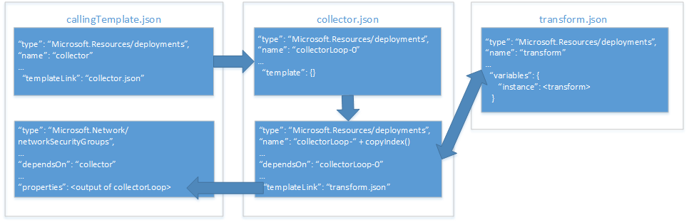

# <a name="implement-a-property-transformer-and-collector-in-an-azure-resource-manager-template"></a>Создание преобразователя и сборщика свойств в шаблоне Azure Resource Manager

Из статьи [Использование объекта в качестве параметра в шаблоне Azure Resource Manager][objects-as-parameters] вы узнаете, как сохранять в объекте значения свойств ресурсов и применять их к ресурсу во время развертывания. Этот метод очень удобен для управления параметрами, но для работы с ним необходимо сопоставлять свойства объекта со свойствами ресурсов при каждом их использовании в шаблоне.

Чтобы не делать это, вы можете реализовать шаблон с преобразователем и сборщиком свойств, который выполняет итерацию массива объекта и преобразует его в схему JSON, ожидаемую ресурсом.

> [!IMPORTANT]
> Такой подход требует глубокого понимания функций и шаблонов Resource Manager.

Далее мы объясним, как создать сборщик и преобразователь свойств на конкретном примере шаблона, который развертывает [группу безопасности сети (NSG)][nsg]. На схеме ниже показана связь между используемыми шаблонами и ресурсами в этих шаблонах.



У нас есть **вызывающий шаблон** с двумя ресурсами:
* ссылка на шаблон, которая вызывает **шаблон сборщика**;
* ресурс группы безопасности сети, который мы собираемся развертывать.

**Шаблон сборщика** также содержит два ресурса:
* ресурс **привязки**;
* ссылка на шаблон, которая вызывает шаблон преобразования в цикле копирования.

Этот **шаблон преобразования** включает один ресурс: пустой шаблон с одной переменной, которая преобразует объект `source` в схему JSON, ожидаемую ресурсом NSG в **основном шаблоне**.

## <a name="parameter-object"></a>Объект параметров

В этом примере мы применим тот же объект параметров `securityRules`, который мы создали в руководстве по [использованию объектов в качестве параметров][objects-as-parameters]. **Шаблон преобразования** преобразует каждый объект из массива `securityRules` в схему JSON, которую ожидает ресурс NSG в **вызывающем шаблоне**.

```json
{
    "$schema": "https://schema.management.azure.com/schemas/2015-01-01/deploymentParameters.json#",
    "contentVersion": "1.0.0.0",
    "parameters":{ 
      "networkSecurityGroupsSettings": {
      "value": {
          "securityRules": [
            {
              "name": "RDPAllow",
              "description": "allow RDP connections",
              "direction": "Inbound",
              "priority": 100,
              "sourceAddressPrefix": "*",
              "destinationAddressPrefix": "10.0.0.0/24",
              "sourcePortRange": "*",
              "destinationPortRange": "3389",
              "access": "Allow",
              "protocol": "Tcp"
            },
            {
              "name": "HTTPAllow",
              "description": "allow HTTP connections",
              "direction": "Inbound",
              "priority": 200,
              "sourceAddressPrefix": "*",
              "destinationAddressPrefix": "10.0.1.0/24",
              "sourcePortRange": "*",
              "destinationPortRange": "80",
              "access": "Allow",
              "protocol": "Tcp"
            }
          ]
        }
      }
    }
  }
```

Изучение шаблонов мы начнем с **шаблона преобразования**.

## <a name="transform-template"></a>Шаблон преобразования

**Шаблон преобразования** содержит два параметра, которые передаются от **шаблона сборщика**: 
* объект `source`, который принимает значение одного из объектов со значениям свойств, полученных из массива свойств. В нашем примере в него поочередно будут передаваться объекты из массива `"securityRules"`;
* массив `state`, в который передаются сцепленные результаты всех предыдущих преобразований. Это и есть сборщик преобразованных данных в формате JSON.

Мы используем следующий набор параметров:

```json
{
  "$schema": "http://schema.management.azure.com/schemas/2015-01-01/deploymentTemplate.json#",
  "contentVersion": "1.0.0.0",
  "parameters": {
    "source": { "type": "object" },
    "state": {
      "type": "array",
      "defaultValue": [ ]
    }
  },
```

Также этот шаблон определяет переменную с именем `instance`. Он выполняет фактическое преобразование объекта `source` в требуемую схему JSON:

```json
  "variables": {
    "instance": [
      {
        "name": "[parameters('source').name]",
        "properties":{
            "description": "[parameters('source').description]",
            "protocol": "[parameters('source').protocol]",
            "sourcePortRange": "[parameters('source').sourcePortRange]",
            "destinationPortRange": "[parameters('source').destinationPortRange]",
            "sourceAddressPrefix": "[parameters('source').sourceAddressPrefix]",
            "destinationAddressPrefix": "[parameters('source').destinationAddressPrefix]",
            "access": "[parameters('source').access]",
            "priority": "[parameters('source').priority]",
            "direction": "[parameters('source').direction]"            
        }
      }
    ]

  },
```

И в завершение шаблон сцепляет в переменной `output` все собранные преобразования параметра `state` и выполняет текущее преобразование в переменной `instance`:

```json
  "outputs": {
    "collection": {
      "type": "array",
      "value": "[concat(parameters('state'), variables('instance'))]"
    }
```

Теперь мы перейдем к **шаблону сборщика** и посмотрим, как он передает значения параметров.

## <a name="collector-template"></a>Шаблон сборщика

**Шаблон сборщика** содержит три параметра:
* `source` — это полный массив объекта параметров. Он передается из **вызывающего шаблона**. Он имеет такое же имя, как и параметр `source` в **шаблоне преобразования**, но есть и одно важное различие: хотя это полный массив, в один момент времени в **шаблон преобразования** передается только один элемент этого массива.
* `transformTemplateUri` содержит URI **шаблона преобразования**. Здесь мы определяем его как параметр, чтобы шаблон можно было использовать в других развертываниях.
* `state` изначально является пустым массивом, который передается в **шаблон преобразования**. Когда цикл копирования завершится, в этом массиве будет храниться коллекция преобразованных объектов параметров.

Мы используем следующий набор параметров:

```json
  "parameters": {
    "source": { "type": "array" },
    "transformTemplateUri": { "type": "string" },
    "state": {
      "type": "array",
      "defaultValue": [ ]
    }
``` 

Затем определяется переменная с именем `count`. В качестве значения ей присваивается длина массива объектов параметров `source`:

```json
  "variables": {
    "count": "[length(parameters('source'))]"
  },
```

Как и следует ожидать, мы используем его для определения числа итераций в цикле копирования.

Теперь давайте посмотрим на ресурсы. Мы определим два ресурса:
* `loop-0` имеет нулевое начальное значение и используется для цикла копирования;
* `loop-` объединяется с результатом функции `copyIndex(1)` для получения уникального имени ресурса для каждой итерации, начиная с `1`.

Описание ресурсов выглядит следующим образом:

```json
  "resources": [
    {
      "type": "Microsoft.Resources/deployments",
      "apiVersion": "2015-01-01",
      "name": "loop-0",
      "properties": {
        "mode": "Incremental",
        "parameters": { },
        "template": {
          "$schema": "http://schema.management.azure.com/schemas/2015-01-01/deploymentTemplate.json#",
          "contentVersion": "1.0.0.0",
          "parameters": { },
          "variables": { },
          "resources": [ ],
          "outputs": {
            "collection": {
              "type": "array",
              "value": "[parameters('state')]"
            }
          }
        }
      }
    },
    {
      "type": "Microsoft.Resources/deployments",
      "apiVersion": "2015-01-01",
      "name": "[concat('loop-', copyindex(1))]",
      "copy": {
        "name": "iterator",
        "count": "[variables('count')]",
        "mode": "serial"
      },
      "dependsOn": [
        "loop-0"
      ],
      "properties": {
        "mode": "Incremental",
        "templateLink": { "uri": "[parameters('transformTemplateUri')]" },
        "parameters": {
          "source": { "value": "[parameters('source')[copyindex()]]" },
          "state": { "value": "[reference(concat('loop-', copyindex())).outputs.collection.value]" }
        }
      }
    }
  ],
```

Давайте более подробно рассмотрим параметры, которые передаются в **шаблон преобразования** из вложенного шаблона. Как вы помните, параметр `source` здесь передает текущий объект в массив объектов параметров `source`. Параметр `state` позволяет собирать результаты, поочередно принимая выходные данные предыдущей итерации цикла копирования. Обратите внимание, что функция `reference()` вызывает функцию `copyIndex()` без параметров, чтобы указать имя (`name`) ранее связанного объекта шаблона и передать его в текущую итерацию.

И наконец, объект `output` в нашем шаблоне возвращает `output` выходные данные последней итерации в **шаблоне преобразования**:

```json
  "outputs": {
    "result": {
      "type": "array",
      "value": "[reference(concat('loop-', variables('count'))).outputs.collection.value]"
    }
  }
```
Может показаться нелогичным, что мы возвращаем `output` из последней итерации **шаблона преобразования** в **вызывающий шаблон**, ведь мы уже сохранили это значение в параметре `source`. Но не забывайте, что в последней итерации **шаблона преобразования** у нас собран полный массив преобразованных объектов свойств, и именно его нам нужно вернуть.

В конце этой статьи мы рассмотрим способ вызова **шаблона сборщика** из **вызывающего шаблона**.

## <a name="calling-template"></a>Вызывающий шаблон

**Вызывающий шаблон** определяет один параметр с именем `networkSecurityGroupsSettings`:

```json
...
"parameters": {
    "networkSecurityGroupsSettings": {
        "type": "object"
    }
```

Затем этот шаблон определяет одну переменную с именем `collectorTemplateUri`:

```json
"variables": {
    "collectorTemplateUri": "[uri(deployment().properties.templateLink.uri, 'collector.template.json')]"
  }
```

Как и следовало ожидать, в ней хранится URI **шаблона сборщика**, который будет использоваться в ресурсе связанного шаблона:

```json
{
    "apiVersion": "2015-01-01",
    "name": "collector",
    "type": "Microsoft.Resources/deployments",
    "properties": {
        "mode": "Incremental",
        "templateLink": {
            "uri": "[variables('linkedTemplateUri')]",
            "contentVersion": "1.0.0.0"
        },
        "parameters": {
            "source" : {"value": "[parameters('networkSecurityGroupsSettings').securityRules]"},
            "transformTemplateUri": { "value": "[uri(deployment().properties.templateLink.uri, 'transform.json')]"}
        }
    }
}
```

Затем мы передаем два параметра в **шаблон сборщика**:
* `source` — это массив объектов свойств. В нашем примере это параметр `networkSecurityGroupsSettings`.
* Переменную `transformTemplateUri` мы только что определили, присвоив ей значение URI **шаблона сборщика**.

И наконец, ресурс `Microsoft.Network/networkSecurityGroups` напрямую связывает выходные данные (`output`) связанного шаблона `collector` с его свойством `securityRules`:

```json
    {
      "apiVersion": "2015-06-15",
      "type": "Microsoft.Network/networkSecurityGroups",
      "name": "networkSecurityGroup1",
      "location": "[resourceGroup().location]",
      "properties": {
        "securityRules": "[reference('firstResource').outputs.result.value]"
      }
    }
  ],
  "outputs": {
      "instance":{
          "type": "array",
          "value": "[reference('firstResource').outputs.result.value]"
      }

  }
```

## <a name="next-steps"></a>Дальнейшие действия

* Эта же методика реализована в [проекте стандартных блоков шаблона](https://github.com/mspnp/template-building-blocks) и [эталонных архитектурах Azure](/azure/architecture/reference-architectures/). Вы можете создать на их основе собственную архитектуру или развернуть готовые примеры архитектуры.

<!-- links -->
[objects-as-parameters]: ./objects-as-parameters.md
[resource-manager-linked-template]: /azure/azure-resource-manager/resource-group-linked-templates
[resource-manager-variables]: /azure/azure-resource-manager/resource-group-template-functions-deployment
[nsg]: /azure/virtual-network/virtual-networks-nsg
