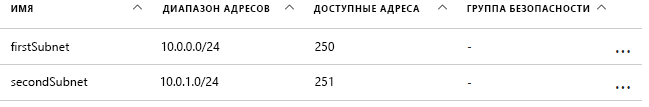
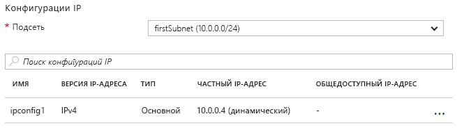

# <a name="update-a-resource-in-an-azure-resource-manager-template"></a><span data-ttu-id="baade-103">Обновление ресурсов в шаблоне Azure Resource Manager</span><span class="sxs-lookup"><span data-stu-id="baade-103">Update a resource in an Azure Resource Manager template</span></span>

<span data-ttu-id="baade-104">Существует несколько сценариев, в которых во время развертывания необходимо обновить ресурс.</span><span class="sxs-lookup"><span data-stu-id="baade-104">There are some scenarios in which you need to update a resource during a deployment.</span></span> <span data-ttu-id="baade-105">Например, у вас нет возможности указать все свойства ресурса, пока не созданы другие (зависимые) ресурсы.</span><span class="sxs-lookup"><span data-stu-id="baade-105">You might encounter this scenario when you cannot specify all the properties for a resource until other, dependent resources are created.</span></span> <span data-ttu-id="baade-106">Например, при создании внутреннего пула для подсистемы балансировки нагрузки на виртуальных машинах можно обновить сетевые интерфейсы (NIC), чтобы включить их во внутренний пул.</span><span class="sxs-lookup"><span data-stu-id="baade-106">For example, if you create a backend pool for a load balancer, you might update the network interfaces (NICs) on your virtual machines (VMs) to include them in the backend pool.</span></span> <span data-ttu-id="baade-107">Resource Manager поддерживает обновление ресурсов во время развертывания. Но для этого нужно правильно разработать шаблон, чтобы избежать ошибок и гарантировать, что развертывание будет обработано как обновление.</span><span class="sxs-lookup"><span data-stu-id="baade-107">And while Resource Manager supports updating resources during deployment, you must design your template correctly to avoid errors and to ensure the deployment is handled as an update.</span></span>

<span data-ttu-id="baade-108">Сначала необходимо добавить ссылку на ресурс в шаблоне, чтобы создать его, а затем еще раз добавить ссылку на этот ресурс, используя то же самое имя, чтобы его обновить.</span><span class="sxs-lookup"><span data-stu-id="baade-108">First, you must reference the resource once in the template to create it and then reference the resource by the same name to update it later.</span></span> <span data-ttu-id="baade-109">Необходимо учитывать, что если в шаблоне два ресурса имеют одинаковые имена, то Resource Manager порождает исключение.</span><span class="sxs-lookup"><span data-stu-id="baade-109">However, if two resources have the same name in a template, Resource Manager throws an exception.</span></span> <span data-ttu-id="baade-110">Во избежание этой ошибки укажите обновленный ресурс во втором шаблоне, который связан с первым или включен как вложенный шаблон с помощью типа ресурса `Microsoft.Resources/deployments`.</span><span class="sxs-lookup"><span data-stu-id="baade-110">To avoid this error, specify the updated resource in a second template that's either linked or included as a subtemplate using the `Microsoft.Resources/deployments` resource type.</span></span>

<span data-ttu-id="baade-111">Затем во вложенном шаблоне необходимо указать имя существующего свойства для изменения или новое имя для добавления свойства.</span><span class="sxs-lookup"><span data-stu-id="baade-111">Second, you must either specify the name of the existing property to change or a new name for a property to add in the nested template.</span></span> <span data-ttu-id="baade-112">Также нужно указать исходные свойства и их исходные значения.</span><span class="sxs-lookup"><span data-stu-id="baade-112">You must also specify the original properties and their original values.</span></span> <span data-ttu-id="baade-113">Если вы не укажете исходные свойства и значения, в Resource Manager определяется, что будет создан новый ресурс, и удаляется исходный ресурс.</span><span class="sxs-lookup"><span data-stu-id="baade-113">If you fail to provide the original properties and values, Resource Manager assumes you want to create a new resource and deletes the original resource.</span></span>

## <a name="example-template"></a><span data-ttu-id="baade-114">Пример шаблона</span><span class="sxs-lookup"><span data-stu-id="baade-114">Example template</span></span>

<span data-ttu-id="baade-115">Рассмотрим этот вариант на конкретном примере шаблона.</span><span class="sxs-lookup"><span data-stu-id="baade-115">Let's look at an example template that demonstrates this.</span></span> <span data-ttu-id="baade-116">При помощи этого шаблона развертывается виртуальная сеть с именем `firstVNet`, которая содержит одну подсеть с именем `firstSubnet`.</span><span class="sxs-lookup"><span data-stu-id="baade-116">Our template deploys a virtual network  named `firstVNet` that has one subnet named `firstSubnet`.</span></span> <span data-ttu-id="baade-117">Затем развертывается виртуальный сетевой интерфейс (NIC) с именем `nic1`, который связывается с подсетью.</span><span class="sxs-lookup"><span data-stu-id="baade-117">It then deploys a virtual network interface (NIC) named `nic1` and associates it with our subnet.</span></span> <span data-ttu-id="baade-118">В ресурс развертывания с именем `updateVNet` помещается вложенный шаблон, при помощи которого в ресурс `firstVNet` добавляется вторая подсеть с именем `secondSubnet`.</span><span class="sxs-lookup"><span data-stu-id="baade-118">Then, a deployment resource named `updateVNet` includes a nested template that updates our `firstVNet` resource by adding a second subnet named `secondSubnet`.</span></span> 

```json
{
  "$schema": "https://schema.management.azure.com/schemas/2015-01-01/deploymentTemplate.json#",
  "contentVersion": "1.0.0.0",
  "parameters": {},
  "resources": [
      {
      "apiVersion": "2016-03-30",
      "name": "firstVNet",
      "location":"[resourceGroup().location]",
      "type": "Microsoft.Network/virtualNetworks",
      "properties": {
          "addressSpace":{"addressPrefixes": [
              "10.0.0.0/22"
          ]},
          "subnets":[              
              {
                  "name":"firstSubnet",
                  "properties":{
                    "addressPrefix":"10.0.0.0/24"
                  }
              }
            ]
      }
    },
    {
        "apiVersion": "2015-06-15",
        "type":"Microsoft.Network/networkInterfaces",
        "name":"nic1",
        "location":"[resourceGroup().location]",
        "dependsOn": [
            "firstVNet"
        ],
        "properties": {
            "ipConfigurations":[
                {
                    "name":"ipconfig1",
                    "properties": {
                        "privateIPAllocationMethod":"Dynamic",
                        "subnet": {
                            "id": "[concat(resourceId('Microsoft.Network/virtualNetworks','firstVNet'),'/subnets/firstSubnet')]"
                        }
                    }
                }
            ]
        }
    },
    {
      "apiVersion": "2015-01-01",
      "type": "Microsoft.Resources/deployments",
      "name": "updateVNet",
      "dependsOn": [
          "nic1"
      ],
      "properties": {
        "mode": "Incremental",
        "parameters": {},
        "template": {
          "$schema": "http://schema.management.azure.com/schemas/2015-01-01/deploymentTemplate.json#",
          "contentVersion": "1.0.0.0",
          "parameters": {},
          "variables": {},
          "resources": [
              {
                  "apiVersion": "2016-03-30",
                  "name": "firstVNet",
                  "location":"[resourceGroup().location]",
                  "type": "Microsoft.Network/virtualNetworks",
                  "properties": {
                      "addressSpace": "[reference('firstVNet').addressSpace]",
                      "subnets":[
                          {
                              "name":"[reference('firstVNet').subnets[0].name]",
                              "properties":{
                                  "addressPrefix":"[reference('firstVNet').subnets[0].properties.addressPrefix]"
                                  }
                          },
                          {
                              "name":"secondSubnet",
                              "properties":{
                                  "addressPrefix":"10.0.1.0/24"
                                  }
                          }
                     ]
                  }
              }
          ],
          "outputs": {}
          }
        }
    }
  ],
  "outputs": {}
}
```

<span data-ttu-id="baade-119">Сначала давайте рассмотрим объект ресурса для `firstVNet`.</span><span class="sxs-lookup"><span data-stu-id="baade-119">Let's take a look at the resource object for our `firstVNet` resource first.</span></span> <span data-ttu-id="baade-120">Обратите внимание, что во вложенном шаблоне повторно перечислены параметры `firstVNet`. Это связано с тем, что Resource Manager не допускает наличия одинаковых имен развертывания в одном шаблоне, а вложенный шаблон считается уже другим шаблоном.</span><span class="sxs-lookup"><span data-stu-id="baade-120">Notice that we respecify the settings for our `firstVNet` in a nested template&mdash;this is because Resource Manager doesn't allow the same deployment name within the same template and nested templates are considered to be a different template.</span></span> <span data-ttu-id="baade-121">Повторно перечисляя значения, указанные для ресурса `firstSubnet`, мы указываем Resource Manager, что нужно обновить существующий ресурс, а не удалять его и развертывать новый.</span><span class="sxs-lookup"><span data-stu-id="baade-121">By respecifying our values for our `firstSubnet` resource, we are telling Resource Manager to update the existing resource instead of deleting it and redeploying it.</span></span> <span data-ttu-id="baade-122">И, наконец, в этом развертывании устанавливаются новые параметры для `secondSubnet`.</span><span class="sxs-lookup"><span data-stu-id="baade-122">Finally, our new settings for `secondSubnet` are picked up during this update.</span></span>

## <a name="try-the-template"></a><span data-ttu-id="baade-123">Пробное использование шаблона</span><span class="sxs-lookup"><span data-stu-id="baade-123">Try the template</span></span>

<span data-ttu-id="baade-124">Если вы хотите поэкспериментировать с этим шаблоном, выполните следующее.</span><span class="sxs-lookup"><span data-stu-id="baade-124">If you would like to experiment with this template, follow these steps:</span></span>

1.  <span data-ttu-id="baade-125">Перейдите на портал Azure, щелкните значок **+**, выполните поиск по типу ресурса **Развертывание шаблона** и выберите этот ресурс.</span><span class="sxs-lookup"><span data-stu-id="baade-125">Go to the Azure portal, select the **+** icon, and search for the **template deployment** resource type, and select it.</span></span>
2.  <span data-ttu-id="baade-126">На странице **Развертывание шаблона** нажмите кнопку **Создать**.</span><span class="sxs-lookup"><span data-stu-id="baade-126">Navigate to the **template deployment** page, select the **create** button.</span></span> <span data-ttu-id="baade-127">Откроется колонка **Настраиваемое развертывание**.</span><span class="sxs-lookup"><span data-stu-id="baade-127">This button opens the **custom deployment** blade.</span></span>
3.  <span data-ttu-id="baade-128">Щелкните значок **Изменить**.</span><span class="sxs-lookup"><span data-stu-id="baade-128">Select the **edit** icon.</span></span>
4.  <span data-ttu-id="baade-129">Удалите пустой шаблон.</span><span class="sxs-lookup"><span data-stu-id="baade-129">Delete the empty template.</span></span>
5.  <span data-ttu-id="baade-130">Скопируйте этот пример шаблона и вставьте его в область справа.</span><span class="sxs-lookup"><span data-stu-id="baade-130">Copy and paste the sample template into the right pane.</span></span>
6.  <span data-ttu-id="baade-131">Нажмите кнопку **Сохранить**.</span><span class="sxs-lookup"><span data-stu-id="baade-131">Select the **save** button.</span></span>
7.  <span data-ttu-id="baade-132">Вы вернетесь в область **Настраиваемое развертывание**, но на этот раз в ней будет несколько раскрывающихся списков.</span><span class="sxs-lookup"><span data-stu-id="baade-132">You return to the **custom deployment** pane, but this time there are some drop-down list boxes.</span></span> <span data-ttu-id="baade-133">Выберите свою подписку, создайте новую или используйте существующую группу ресурсов и выберите расположение.</span><span class="sxs-lookup"><span data-stu-id="baade-133">Select your subscription, either create new or use existing resource group, and select a location.</span></span> <span data-ttu-id="baade-134">Ознакомьтесь с условиями и нажмите кнопку **Принимаю**.</span><span class="sxs-lookup"><span data-stu-id="baade-134">Review the terms and conditions, then select the **I agree** button.</span></span>
8.  <span data-ttu-id="baade-135">Нажмите кнопку **Приобрести**.</span><span class="sxs-lookup"><span data-stu-id="baade-135">Select the **purchase** button.</span></span>

<span data-ttu-id="baade-136">По завершении развертывания откройте группу ресурсов, которую вы указали на портале.</span><span class="sxs-lookup"><span data-stu-id="baade-136">Once deployment has finished, open the resource group you specified in the portal.</span></span> <span data-ttu-id="baade-137">Отобразится виртуальная сеть с именем `firstVNet` и сетевой адаптер с именем `nic1`.</span><span class="sxs-lookup"><span data-stu-id="baade-137">You see a virtual network named `firstVNet` and a NIC named `nic1`.</span></span> <span data-ttu-id="baade-138">Щелкните `firstVNet`, а затем — `subnets`.</span><span class="sxs-lookup"><span data-stu-id="baade-138">Click `firstVNet`, then click `subnets`.</span></span> <span data-ttu-id="baade-139">Отобразится подсеть `firstSubnet`, созданная изначально, а также подсеть `secondSubnet`, добавленная в ресурсе `updateVNet`.</span><span class="sxs-lookup"><span data-stu-id="baade-139">You see the `firstSubnet` that was originally created, and you see the `secondSubnet` that was added in the `updateVNet` resource.</span></span> 



<span data-ttu-id="baade-141">Затем вернитесь в группу ресурсов и щелкните `nic1`, а затем — `IP configurations`.</span><span class="sxs-lookup"><span data-stu-id="baade-141">Then, go back to the resource group and click `nic1` then click `IP configurations`.</span></span> <span data-ttu-id="baade-142">В разделе `IP configurations` для `subnet` задано значение `firstSubnet (10.0.0.0/24)`.</span><span class="sxs-lookup"><span data-stu-id="baade-142">In the `IP configurations` section, the `subnet` is set to `firstSubnet (10.0.0.0/24)`.</span></span> 



<span data-ttu-id="baade-144">Исходная виртуальная сеть `firstVNet` была обновлена, а не создана повторно.</span><span class="sxs-lookup"><span data-stu-id="baade-144">The original `firstVNet` has been updated instead of recreated.</span></span> <span data-ttu-id="baade-145">Если бы `firstVNet` была создана повторно, то виртуальный сетевой интерфейс `nic1` не был бы связан с `firstVNet`.</span><span class="sxs-lookup"><span data-stu-id="baade-145">If `firstVNet` had been recreated, `nic1` would not be associated with `firstVNet`.</span></span>

## <a name="next-steps"></a><span data-ttu-id="baade-146">Дальнейшие действия</span><span class="sxs-lookup"><span data-stu-id="baade-146">Next steps</span></span>

* <span data-ttu-id="baade-147">Эта же методика реализована в [проекте стандартных блоков шаблона](https://github.com/mspnp/template-building-blocks) и [эталонных архитектурах Azure](/azure/architecture/reference-architectures/).</span><span class="sxs-lookup"><span data-stu-id="baade-147">This technique is implemented in the [template building blocks project](https://github.com/mspnp/template-building-blocks) and the [Azure reference architectures](/azure/architecture/reference-architectures/).</span></span> <span data-ttu-id="baade-148">Вы можете создать на их основе собственную архитектуру или развернуть готовые примеры архитектуры.</span><span class="sxs-lookup"><span data-stu-id="baade-148">You can use these to create your own architecture or deploy one of our reference architectures.</span></span>
