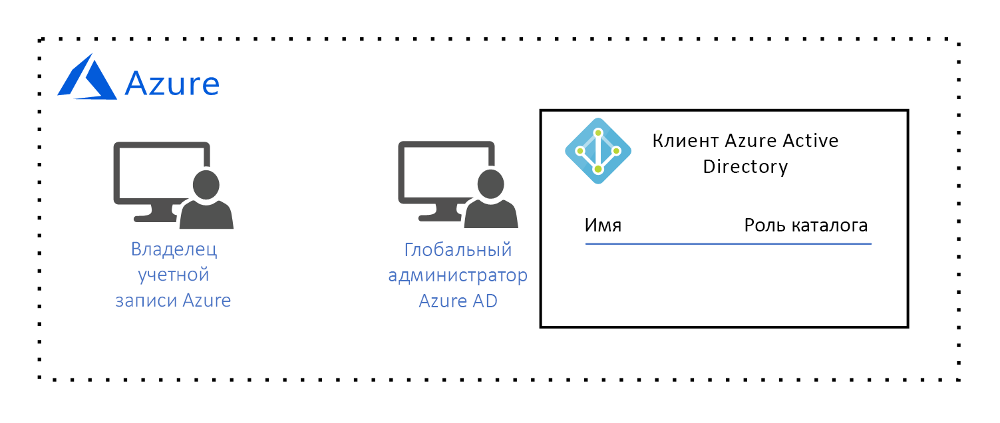
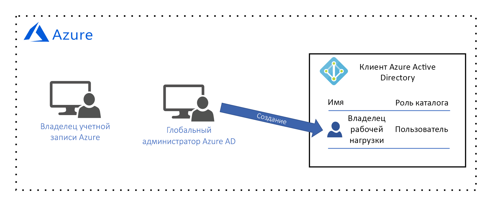
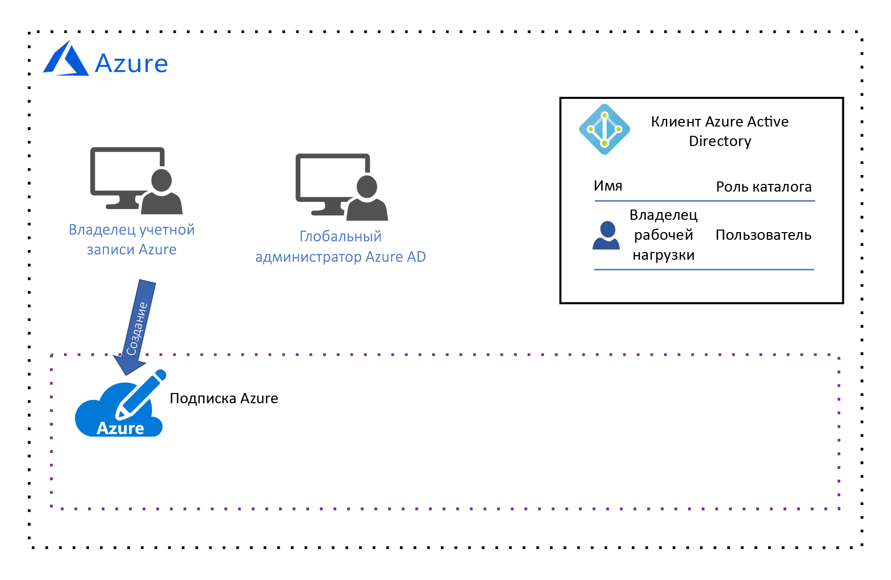
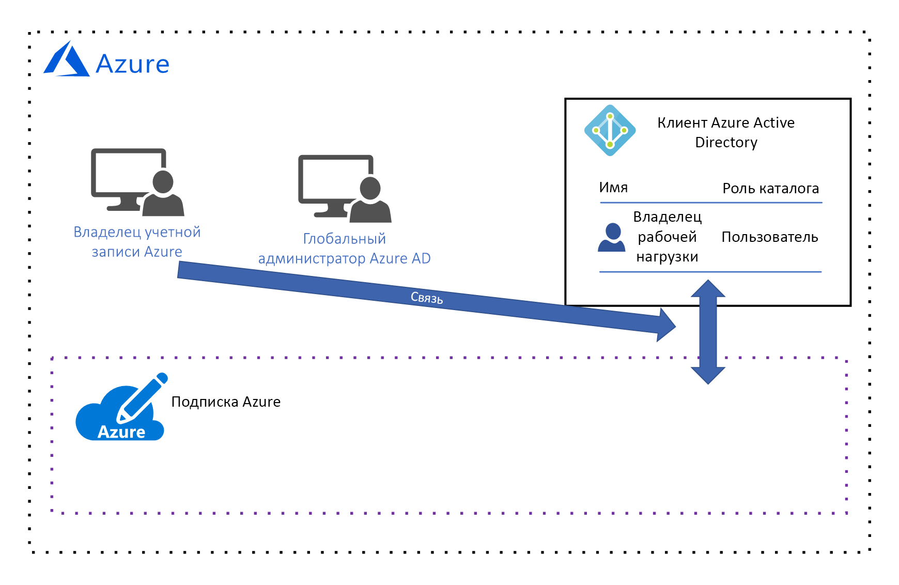
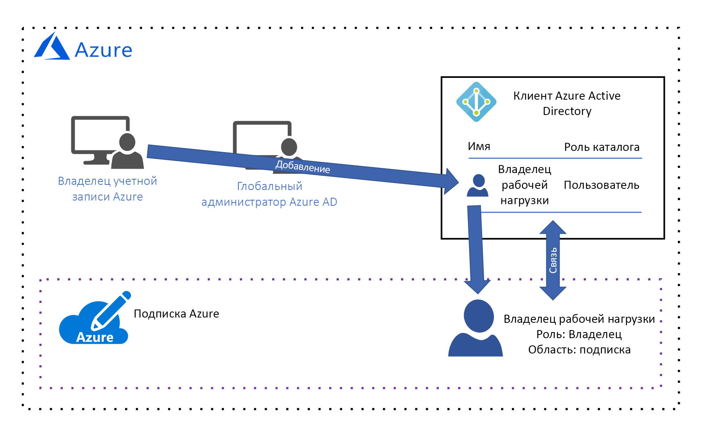
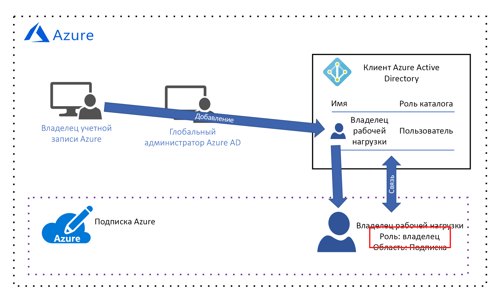
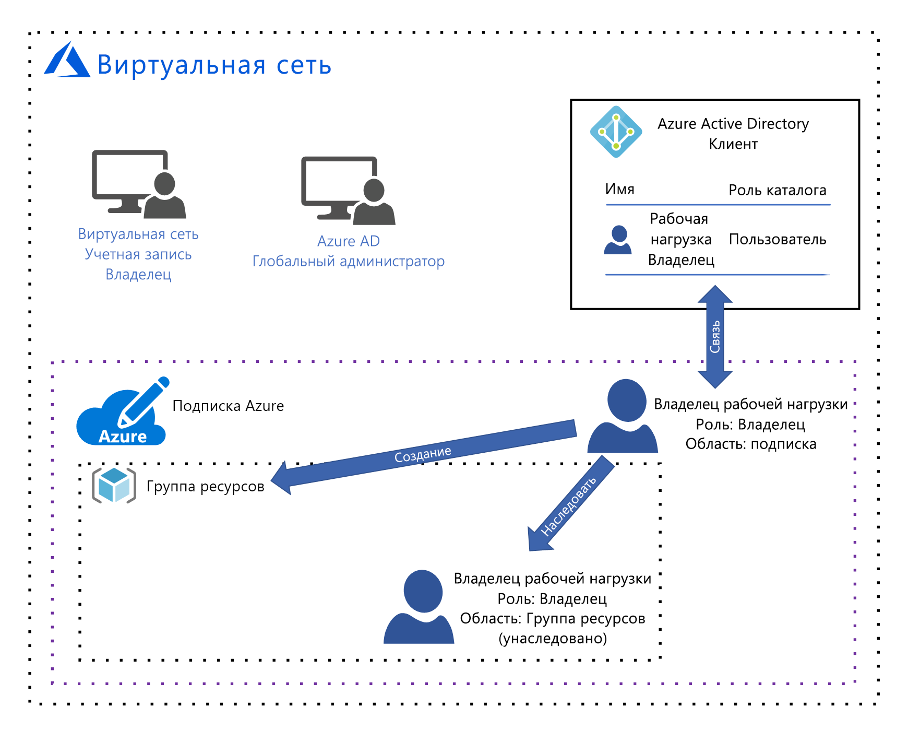
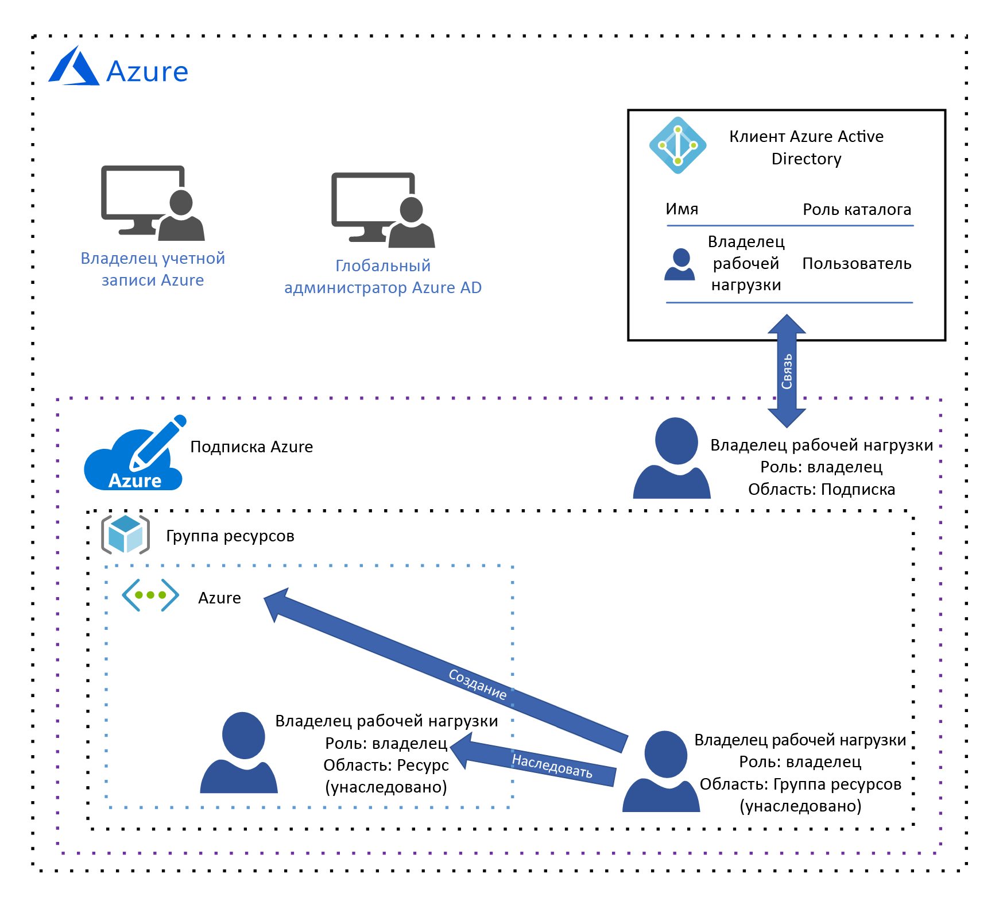

# Руководство по проектированию системы управления AzureAzure governance design guide

Это руководство по проектированию предназначено для сотрудников *центрального ИТ-отдела* организаций.The audience for this design guide is the *central IT* persona in your organization. *Центральный ИТ-отдел* отвечает за проектирование и реализацию архитектуры системы управления облачными ресурсами организации.*Central IT* is responsible for designing and implementing your organization's cloud governance architecture. Из статьи [Знакомство с системой управления облачными ресурсами](governance-explainer.md) вы узнали, что система управления ссылается на текущий процесс управления, мониторинга и аудита используемых ресурсов Azure для достижения целей и требований организации.As you learned in the [what is cloud resource governance?](governance-explainer.md) explainer, governance refers to the ongoing process of managing, monitoring, and auditing the use of Azure resources to meet the goals and requirements of your organization.

В этом руководстве рассматривается процесс проектирования архитектуры системы управления организации с учетом гипотетических целей и требований.The goal of this guidance is to help you learn the process of designing your organization's governance architecture by looking at a set of hypothetical governance goals and requirements. Кроте того, здесь рассматривается процесс настройки средств системы управления Azure в соответствии с этими требованиями.Then, we'll discuss how to configure Azure's governance tools to meet them. 

Цель базового этапа внедрения заключалась в развертывании простой рабочей нагрузки в Azure.In the foundational adoption stage, our goal is to deploy a simple workload to Azure. В результате формируются следующие требования:This results in the following requirements:
* Реализация механизма управления удостоверениями одного **владельца рабочей нагрузки**, который отвечает за развертывание и обслуживание простой рабочей нагрузки.Identity management for a single **workload owner** who is responsible for deploying and maintaining the simple workload. Владельцу рабочей нагрузки требуется разрешение на создание, чтение, обновление и удаление ресурсов, а также разрешение на делегирование этих прав другим пользователям в системе управления удостоверениями.The workload owner requires permission to create, read, update, and delete resources as well as permission to delegate these rights to other users in the identity management system.
* Реализация механизма управления всеми ресурсами простой рабочей нагрузки как одной единицей.Manage all resources for the simple workload as a single management unit.

## Лицензирование AzureLicensing Azure

Прежде чем перейти к проектированию модели системы управления, важно понять, как лицензируется Azure.Before we begin designing our governance model, it's important to understand how Azure is licensed. Это обусловлено тем, что административные учетные записи, связанные с лицензией Azure, имеют высший уровень доступа ко всем ресурсам Azure.This is because the administrative accounts associated with your Azure license have the highest level of access to all of your Azure resources. Эти учетные записи формируют основу модели системы управления.These administrative accounts form the basis of your governance model.  

> [!NOTE]
> Если организация имеет [Соглашение Microsoft Enterprise](https://www.microsoft.com/licensing/licensing-programs/enterprise.aspx), которое не включает Azure, эту службу можно добавить, приняв на себя предварительные денежные обязательства.If your organization has an existing [Microsoft Enterprise Agreement](https://www.microsoft.com/licensing/licensing-programs/enterprise.aspx) that does not include Azure, Azure can be added by making an upfront monetary commitment. Дополнительные сведения см. на странице [Лицензирование Azure для корпоративных пользователей](https://azure.microsoft.com/pricing/enterprise-agreement/).See [licensing Azure for the enterprise](https://azure.microsoft.com/pricing/enterprise-agreement/) for more information. 

При добавлении Azure в Соглашение Enterprise организация получает запрос на создание **учетной записи Azure**.When Azure added to your organization's Enterprise Agreement, your organization was prompted to create an **Azure account**. Вместе с учетной записью Azure создается **ее владелец**, а также клиент Azure Active Directory (Azure AD) с учетной записью **глобального администратора**.During the account creation process, an **Azure account owner** was created, as well as an Azure Active Directory (Azure AD) tenant with a **global administrator** account. Клиент Azure AD — это логическая структура, представляющая собой защищенный выделенный экземпляр Azure AD.An Azure AD tenant is a logical construct that represents a secure, dedicated instance of Azure AD.

*Рис. 1. Учетная запись Azure с менеджером учетной записи и глобальным администратором Microsoft Azure Active Directory.*
*Figure 1. An Azure account with an Account Manager and Azure AD Global Administrator.*

## Управление удостоверениямиIdentity management

Azure доверяет аутентификацию пользователей и предоставление им доступа к ресурсам только [Azure AD](/azure/active-directory). Поэтому Azure AD — это система управления удостоверениями.Azure only trusts [Azure AD](/azure/active-directory) to authenticate users and authorize user access to resources, so Azure AD is our identity management system. Глобальный администратор Azure AD имеет наивысший уровень разрешений и может выполнять все действия, связанные с удостоверениями, в том числе создание пользователей и назначение разрешений.The Azure AD global administrator has the highest level of permissions and can perform all actions related to identity, including creating users and assigning permissions. 

Одно из требований заключается в реализации механизма управления удостоверениями одного **владельца рабочей нагрузки**, который отвечает за развертывание и обслуживание простой рабочей нагрузки.Our requirement is identity management for a single **workload owner** who is responsible for deploying and maintaining the simple workload. Владельцу рабочей нагрузки требуется разрешение на создание, чтение, обновление и удаление ресурсов, а также разрешение на делегирование этих прав другим пользователям в системе управления удостоверениями.The workload owner requires permission to create, read, update, and delete resources as well as permission to delegate these rights to other users in the identity management system.

Глобальный администратор Azure AD создает **учетную запись** **владельца рабочей нагрузки**:Our Azure AD global administrator will create the **workload owner** account for the **workload owner**:

*Рис. 2. Глобальный администратор Azure AD создает учетную запись пользователя-владельца рабочей нагрузки.*
*Figure 2. The Azure AD global administrator creates the workload owner user account.*

Разрешения на доступ к ресурсу нельзя присвоить, если этот пользователь не добавлен в **подписку**. Мы сделаем это в следующих двух разделах.We aren't able to assign resource access permission until this user is added to a **subscription**, so we'll do that in the next two sections. 

## Область управления ресурсамиResource management scope

По мере роста количества развернутых в организации ресурсов растет также и сложность управления ими.As the number of resources deployed by your organization grows, the complexity of governing those resources grows as well. Azure реализует логическую иерархию контейнеров. Это позволяет управлять ресурсами организации в группах с различными уровнями детализации, также известными как **области**.Azure implements a logical container hierarchy to enable your organization to manage your resources in groups at various levels of granularity, also known as **scope**. 

Верхний уровень области управления ресурсами — это **подписка**.The top level of resource management scope is the **subscription** level. Подписку создает **владелец учетной записи** Azure, который берет на себя финансовое обязательство и несет ответственность за оплату всех включенных в эту подписку ресурсов:A subscription is created by the Azure **account owner**, who establishes the financial commitment and is responsible for paying for all Azure resources associated with the subscription:

*Рис. 3. Владелец учетной записи Azure создает подписку.*
*Figure 3. The Azure account owner creates a subscription.*

При создании подписки **владелец учетной записи** Azure связывает с ней клиент Azure AD. С помощью этого клиента выполняется аутентификация и авторизация пользователей:When the subscription is created, the Azure **account owner** associates an Azure AD tenant with the subscription, and this Azure AD tenant is used for authenticating and authorizing users:

*Рис. 4. Владелец учетной записи Azure связывает клиент Azure AD с подпиской.*
*Figure 4. The Azure account owner associates the Azure AD tenant with the subscription.*

Как вы могли заметить, сейчас с подпиской не связано ни одного пользователя. Это означает, что ни один пользователь не имеет разрешений на управление ресурсами.You may have noticed that there is currently no user associated with the subscription, which means that no one has permission to manage resources. На самом деле **владелец учетной записи** также является владельцем подписки и имеет разрешения на выполнение любых действий с ресурсами в подписке.In reality, the **account owner** is the owner of the subscription and has permission to take any action on a resource in the subscription. Однако на практике **владелец учетной записи**, скорее всего, связан с финансами и не несет ответственности за создание, чтение, обновление и удаление ресурсов. Эти задачи должен выполнять **владелец рабочей нагрузки**.However, in practical terms the **account owner** is more than likely a finance person in your organization and is not responsible for creating, reading, updating, and deleting resources - those tasks will be performed by the **workload owner**. Таким образом в подписку нужно добавить **владельца рабочей нагрузки** и назначить ему соответствующие разрешения.Therefore, we need to add the **workload owner** to the subscription and assign permissions.

Так как сейчас только **владелец учетной записи** имеет разрешение на добавление **владельца рабочей нагрузки** в подписку, этот пользователь должен **сделать следующее**:Since the **account owner** is currently the only user with permission to add the **workload owner** to the subscription, they add the **workload owner** to the subscription:

*Рис. 5. Владелец учетной записи Azure добавляет **владельца рабочей нагрузки** в подписку.*
*Figure 5. The Azure account owner adds the workload owner to the subscription.*

**Владелец учетной записи** Azure предоставляет разрешения **владельцу рабочей нагрузки**, назначив ему роль [управления доступом на основе ролей (RBAC)](/azure/role-based-access-control/).The Azure **account owner** grants permissions to the **workload owner** by assigning a [role-based access control (RBAC)](/azure/role-based-access-control/) role. Роль RBAC предоставляет набор разрешений, которые **владелец рабочей нагрузки** имеет в отдельном типе ресурса или в их наборе.The RBAC role specifies a set of permissions that the **workload owner** has for an individual resource type or a set of resource types.

Обратите внимание, что в этом примере **владелец учетной записи** присвоил [встроенную роль **владельца**](/azure/role-based-access-control/built-in-roles#owner):Notice that in this example, the **account owner** has assigned the [built-in **owner** role](/azure/role-based-access-control/built-in-roles#owner): 

*Рис 6. Владелец рабочей нагрузки присвоил встроенную роль владельца.*
*Figure 6. The workload owner was assigned the built-in owner role.*

Встроенная роль **владельца** предоставляет все разрешения **владельцу рабочей нагрузки** в области подписки.The built-in **owner** role grants all permissions to the **workload owner** at the subscription scope. 

> [!IMPORTANT]
> **Владелец учетной записи** Azure отвечает за финансовые обязательства, связанные с подпиской, но **владелец рабочей нагрузки** имеет те же разрешения.The Azure **acount owner** is responsible for the financial committment associated with the subscription, but the **workload owner** has the same permissions. **Владелец учетной записи** должен доверять **владельцу рабочей нагрузки** в вопросах развертывания ресурсов, которые находятся в пределах бюджета подписки.The **account owner** must trust the **workload owner** to deploy resources that are within the subscription budget.

Следующий уровень области управления — это **группа ресурсов**.The next level of management scope is the **resource group** level. Группа ресурсов — это логический контейнер ресурсов.A resource group is a logical container for resources. Операции, выполняемые на уровне группы, применяются ко всем ресурсам в ней.Operations applied at the resource group level apply to all resources in a group. Кроме того, важно отметить, что каждый пользователь наследует разрешения со следующего более высокого уровня, если эти разрешения явно не изменены в этой области.Also, it's important to note that permissions for each user are inherited from the next level up unless they are explicitly changed at that scope. 

Чтобы показать этот процесс, рассмотрим что происходит, когда **владелец рабочей нагрузки** создает группу ресурсов:To illustrate this, let's look at what happens when the **workload owner** creates a resource group:

*Рис. 7. Владелец рабочей нагрузки создает группу ресурсов и наследует встроенную роль владельца в пределах области группы ресурсов.*
*Figure 7. The workload owner creates a resource group and inherits the built-in owner role at the resource group scope.*

И опять же, встроенная роль **владельца** предоставляет все разрешения **владельцу рабочей нагрузки** в области группы ресурсов.Again, the built-in **owner** role grants all permissions to the **workload owner** at the resource group scope. Как уже говорилось ранее, эта роль наследуется с уровня подписки.As we discussed earlier, this role is inherited from the subscription level. Другая роль, назначенная этому пользователю в этой области, применяется только к этой области.If a different role is assigned to this user at this scope, it applies to this scope only.

Самый низкий уровень области управления — это **ресурс**.The lowest level of management scope is at the **resource** level. Операции, выполняемые на уровне ресурса, применяются только к самому ресурсу.Operations applied at the resource level apply only to the resource itself. И опять же, разрешения на уровне ресурсов наследуются из области группы ресурсов.And once again, permissions at the resource level are inherited from resource group scope. Например, давайте рассмотрим, что произойдет, если **владелец рабочей нагрузки** развернет [виртуальную сеть](/azure/virtual-network/virtual-networks-overview) в группе ресурсов:For example, let's look at what happens if the **workload owner** deploys a [virtual network](/azure/virtual-network/virtual-networks-overview) into the resource group:

*Рис. 8. Владелец рабочей нагрузки создает ресурс и наследует встроенную роль владельца в пределах области ресурсов.*
*Figure 8. The workload owner creates a resource and inherits the built-in owner role at the resource scope.*

**Владелец рабочей нагрузки** наследует роль владельца в области ресурса, а это означает, что владелец рабочей нагрузки имеет все разрешения в виртуальной сети.The **workload owner** inherits the owner role at the resource scope, which means the workload owner has all permissions for the virtual network. 

## СводкаSummary

Из этой статьи вы узнали следующее:In this article, you learned:

* Azure доверяет управление удостоверениями только Azure AD.Azure only trusts Azure AD for identity management.
* Подписка имеет самый высокий уровень управления ресурсами, и каждая подписка связана с клиентом Azure AD.A subscription has the highest scope of resource management, and each subscription is associated with an Azure AD tenant. Только пользователи в связанном клиенте Azure AD имеют доступ к ресурсам в подписке.Only users in the associated Azure AD tenant can access resources in the subscription.
* Есть три уровня области управления ресурсами: уровень подписки, группы ресурсов и ресурсов.There are three levels of resource management scope: subscription, resource group, and resource. Разрешения назначаются в каждой области с использованием ролей RBAC.Permissions are assigned at each scope using RBAC roles. Области нижнего уровня наследуют роли RBAC из областей более высокого уровня.RBAC roles are inherited from higher scope to lower scope.

## Дополнительная информацияNext steps

Вернитесь к статье [Внедрение Azure. Базовый уровень](overview.md) и узнайте, как реализовать эту модель системы управления.Return to the [foundational adoption stage overview](overview.md) to learn how to implement this goverance model. Затем выберите тип рабочей нагрузки и узнайте, как развернуть его.Then, select a type of workload and learn how to deploy it.