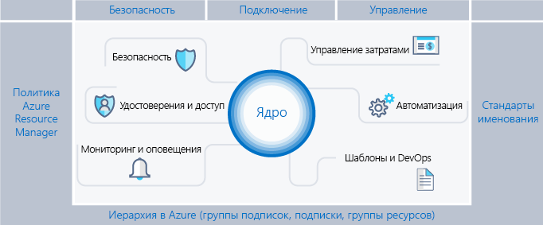
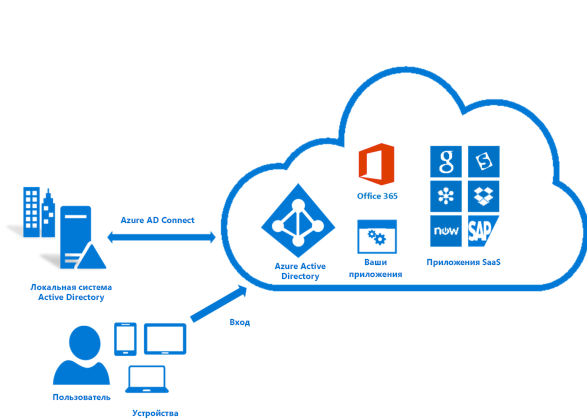
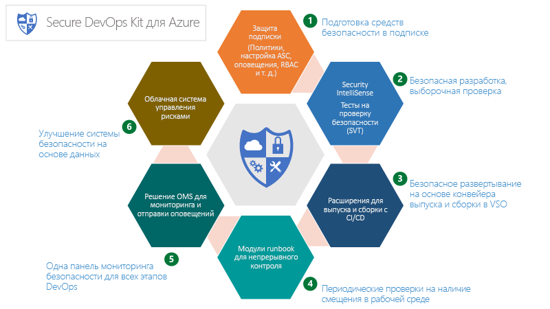
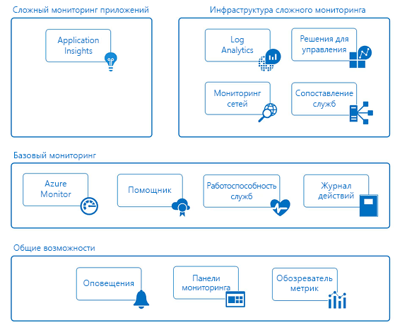

# Корпоративный шаблон Azure. Рекомендуемая система управления подпиской

Предприятия все чаще внедряют общедоступное облако ввиду его гибкости и динамичности. Они используют преимущества облака для создания дохода и оптимизации использования ресурсов для бизнеса. Microsoft Azure предоставляет множество служб и возможностей, из которых как из строительных блоков предприятия конструируют решения для широкого спектра рабочих нагрузок и приложений.

Принятие решения об использовании Microsoft Azure является только первым шагом к получению преимуществ облака. Второй шаг — это понимание того, как предприятие может эффективно использовать Azure и определять базовые возможности, которые должны быть созданы для решения таких вопросов, как:

* "Я обеспокоен сохранением контроля над данными; как я могу убедиться, что данные и системы соответствуют нормативным требованиям?"
* "Как узнать, что обеспечивает тот или иной ресурс, чтобы учесть его и правильно добавить в счет?"
* "Я хочу убедиться, что все развертывания или другие действия в общедоступном облаке ставят безопасность на первое место. Как я могу этому посодействовать?"

Перспектива пустой подписки без какой-либо защиты пугает. Этот пробел может помешать перемещению в Azure.

Эта статья служит отправной точкой для технических специалистов и посвящена балансу требований управления и гибкости. В ней вводится понятие корпоративного каркаса, который помогает организациям безопасно внедрять среды Azure и управлять ими. Она предоставляет платформу для разработки эффективных и действенных элементов управления.

## Требования управления

При перемещении в Azure необходимо заблаговременно рассмотреть вопрос управления, чтобы обеспечить успешное использование облака на предприятии. К сожалению, нехватка времени и волокита, связанная с созданием комплексной системы управления, приводят к тому, что некоторые рабочие группы сразу идут к поставщикам, не привлекая ИТ-отдел предприятия. Такой подход может оставить предприятие уязвимым, если управление ресурсами осуществляется неправильно. Характеристики общедоступного облака — гибкость, динамичность и стоимость на основе использования — важны для бизнес-групп, которым нужно быстро удовлетворять потребности клиентов (внутренних и внешних). Но ИТ-отделу предприятия нужно убедиться в эффективной защите данных и систем.

При строительстве здания, чтобы создать базовую структуру, используется каркас. Каркас обеспечивает общую структуру и предоставляет точки крепления, на которые можно устанавливать другие постоянные системы. Корпоративный каркас ничем не отличается: это набор гибких элементов управления и возможностей Azure, обеспечивающих структуру среды, и привязок для служб на основе общедоступного облака. Он предоставляет строителям (ИТ-отделам и бизнес-группам) основу для создания и присоединения новых служб, учитывающих скорость доставки.

В основе каркаса лежат рекомендации, полученные при сотрудничестве с клиентскими организациями различных размеров. Мы работали с разными клиентами, от небольших организаций, разрабатывающих решения в облаке, до предприятий из списка крупных многонациональных предприятий и независимых поставщиков программного обеспечения, которые переходят на использование рабочих нагрузок облака и разрабатывают решения в нем. Корпоративный каркас обладает гибкостью, предназначенной для поддержки как традиционных рабочих нагрузок ИТ, так и гибких рабочих нагрузок. Например, его преимуществами могут воспользоваться разработчики, создающие приложения SaaS на основе возможностей платформы Azure.

Корпоративный каркас предназначен стать основой каждой новой подписки в Azure. Он позволяет администраторам гарантировать, что рабочие нагрузки соответствуют минимальным требованиям управления организации, не мешая бизнес-группам и разработчикам быстро достигать собственных целей. Наш опыт показывает, что это значительно ускоряет, а не препятствует расширению общедоступного облака.

> [!NOTE]
> Корпорация Microsoft выпустила предварительную версию новой функции под названием [Azure Blueprints](/azure/governance/blueprints/overview), которая позволит вам упаковывать и развертывать стандартные образы, шаблоны, политики и сценарии в подписках и группах управления, а также управлять ими. Эта возможность является мостом между назначением каркаса как эталонной модели и развертыванием этой модели для вашей организации.
>
На рисунке ниже приведены компоненты каркаса. В основе лежит надежный план для иерархии управления и подписок. Опорами служат политики Resource Manager и строгие стандарты именования. Остальная часть каркаса состоит из основных возможностей и функций Azure, обеспечивающих подключение безопасной и управляемой среды.

## Определение иерархии

Основой каркаса является иерархия и взаимосвязь соглашения о регистрации в Azure Enterprise для подписок и групп ресурсов. Соглашение о регистрации Enterprise определяет форму и использование служб Azure в вашей компании с точки зрения контракта. В рамках Соглашения о регистрации Enterprise вы можете дополнительно разделить среду на подразделения, учетные записи и, наконец, подписки и группы ресурсов, чтобы они соответствовали структуре вашей организации.

Подписка Azure представляет собой базовую единицу, в которой содержатся все ресурсы. Она также определяет несколько ограничений в Azure, в том числе количество ядер, виртуальных сетей и других ресурсов. Группы ресурсов Azure используются для дальнейшего уточнения модели подписки и создания более естественной группировки ресурсов.

Все предприятия разные, и иерархия на предыдущем рисунке допускает значительную гибкость в организации ресурсов Azure в рамках компании. Моделирование иерархии для отражения потребностей компании при выставлении счетов, управлении ресурсами и доступе к ресурсам является первым &mdash; и самым важным &mdash; решением, которое вы принимаете при запуске в общедоступном облаке.

### Подразделения и учетные записи

Ниже представлены три распространенных шаблона для Соглашений о регистрации Azure Enterprise.

* **Функциональной** шаблон.

    
* Шаблон **подразделения**.

    
* **Географической** шаблон.

    

Несмотря на то что каждый из этих шаблонов имеет свое место, шаблон **бизнес-единицы** все чаще используется благодаря гибкости при создании модели затрат организации, а также отражению диапазона контроля. Группа Microsoft Core Engineering and Operations создала подмножество очень эффективных шаблонов **бизнес-единиц**, смоделированных на **федеральном** и **местном** уровнях, а также на уровне **штата**. (Дополнительные сведения см. в статье [Organizing subscriptions and resource groups within the Enterprise](https://azure.microsoft.com/blog/organizing-subscriptions-and-resource-groups-within-the-enterprise/) (Организация подписок и групп ресурсов в рамках предприятия).)

### Группы управления

Корпорация Майкрософт недавно реализовала новый способ моделирования иерархии — [группы управления Azure](/azure/azure-resource-manager/management-groups-overview). Группы управления гораздо более гибкие, чем отделы и учетные записи, и могут быть вложены до шести уровней. Группы управления позволяют создавать иерархию, которая отличается от выставления счетов иерархии, исключительно для эффективного управления ресурсами. Группы управления могут отражать иерархию выставления счетов и зачастую предприятия начинают именно с этого. Впрочем, основная сила групп управления проявляется при их использовании для моделирования организации, в которой связанные подписки, независимо от их положения в иерархии выставления счетов, группируются вместе и требуют назначения общих ролей, а также политик и инициатив. Вот несколько примеров.

* **Производственные/Непроизводственные**. Некоторые предприятия создают группы управления для определения их производственных и непроизводственных подписок. Группы управления дают возможность клиентам легко управлять ролями и политиками, например непроизводственная подписка может дать разработчикам доступ "участника", но в производстве они имеют только доступ "читателя".
* **Внутренние службы/Внешние службы**. Подобно производственным и непроизводственным группам управления, предприятия часто имеют разные требования, политики и роли для внутренних служб по сравнению с внешними службами (предназначенными для клиентов).

Тщательно продуманные группы управления, наряду с политикой и инициативами Azure, являются основой эффективной системы управления.

### Подписки

При выборе подразделений и учетных записей (или групп управления) вы ориентированы, в первую очередь, на разделение среды Azure в соответствии с требованиями вашей организации. Тем не менее подписки — это то место, где происходит настоящая работа, и ваши решения влияют на безопасность, масштабируемость и выставление счетов.  Многие организации рассматривают следующие шаблоны в качестве руководств.

* **Приложения/Службы**. Подписки представляют приложение или службу (портфель приложений).
* **Жизненный цикл**. Подписки представляют жизненный цикл службы, например производственный этап или этап разработки.
* **Подразделение**. Подписки представляют отделы в организации.

Первые два шаблона являются наиболее часто используемыми, и мы настоятельно рекомендуем их использовать. Подход "Жизненный цикл" подходит для большинства организаций. В этом случае мы рекомендуем использовать две базовые подписки: "производственную" и "непроизводственную", а затем группы ресурсов для дальнейшего разделения среды.

### Группы ресурсов

Azure Resource Manager позволяет помещать ресурсы в предметные группы для управления, выставления счетов или обеспечения естественного сходства. Группы ресурсов — это контейнеры ресурсов, которые имеют общий жизненный цикл или какой-либо атрибут, например "все серверы SQL Server" или "Приложение A".

Группы ресурсов не могут быть вложенными, и ресурсы могут принадлежать только одной группе ресурсов. Определенные действия могут применяться для всех ресурсов в группе ресурсов. Например, при удалении группы ресурсов можно удалять все ее ресурсы. Как и в случае с подписками, при создании групп ресурсов существуют распространенные шаблоны, и для "Традиционных ИТ" и "Гибких ИТ" рабочих нагрузок они различаются.

* В первом случае рабочие нагрузки чаще всего группируются по элементам в рамках одного жизненного цикла, например приложения. Группирование по приложениям позволяет управлять отдельными приложениями.
* Во втором случае рабочие нагрузки, как правило, сосредотачиваются на облачных приложениях для внешних клиентов. Группы ресурсов часто отражают уровни развертывания (например, уровень Интернета, уровень приложений) и управления.

> [!NOTE]
> Понимание рабочей нагрузки помогает разработать стратегию групп ресурсов. Эти шаблоны можно комбинировать и сопоставлять. Например, группа ресурсов общих служб в той же подписке, что и "Гибкие" группы ресурсов.

## Стандарты именования

Первая опора каркаса — это согласованный стандарт именования. Хорошо спроектированные стандарты именования позволяют определять ресурсы на портале, в счете и в сценариях. Скорее всего, у вас уже есть существующие стандарты именования для локальной инфраструктуры. При добавлении Azure в свою среду следует распространить эти стандарты именования на ресурсы Azure.

> [!TIP]
> Для соглашений об именовании:
> * Ознакомьтесь с [руководством по шаблонам и рекомендациями](https://docs.microsoft.com/en-us/azure/architecture/best-practices/naming-conventions) и применяйте полученные знания, где это уместно. Это руководство поможет выбрать информативный стандарт именования, также в нем приведено множество примеров.
> * Использование политик Resource Manager для обеспечения соблюдения стандартов именования
>
>Помните, что впоследствии изменить имена будет сложно, поэтому уделите несколько минут сейчас, чтобы избежать трудностей в будущем.

Сосредоточьте свои стандарты именования на тех ресурсах, которые чаще всего ищут и используют.  Например, для ясности все группы ресурсов должны следовать четкому стандарту.

### Теги ресурсов

Теги ресурсов тесно связаны со стандартами именования. Поскольку ресурсы добавляются к подпискам, чрезвычайно важно логически классифицировать их для таких целей, как выставление счетов, управление и эксплуатация. Дополнительные сведения см. в статье [Использование тегов для организации ресурсов в Azure](https://docs.microsoft.com/en-us/azure/azure-resource-manager/resource-group-using-tags).

> [!IMPORTANT]
> Теги могут содержать личную информацию и могут подпадать под действие положений GDPR. Тщательно планируйте управление тегами. Если вы ищете общие сведения о GDPR, см. [раздел о GDPR на портале Service Trust Portal](https://servicetrust.microsoft.com/ViewPage/GDPRGetStarted).

Существует много вариантов использования тегов, помимо выставления счетов и управления. Они часто используются как часть службы автоматизации (см. раздел ниже). Если не предусмотреть заранее, это может привести к конфликтам. Рекомендуется определить все распространенные теги на уровне предприятия (например, ApplicationOwner, CostCenter) и применить их при развертывании ресурсов с помощью службы автоматизации.

## Политика и инициативы Azure

Вторая опора каркаса предполагает использование [политики и инициатив Azure](/azure/azure-policy/azure-policy-introduction) для управления рисками путем применения правил (с эффектами) к ресурсам и службам в подписках. Инициативы Azure — это коллекции политик, предназначенных для достижения единой цели. Затем политика и инициативы Azure присваиваются области ресурсов, чтобы начать применять определенные политики.

Политика и инициативы Azure становятся еще эффективнее, если их использовать одновременно с группами управления, упомянутыми ранее. Группы управления позволяют назначать инициативу или политику для всего набора подписок.

### Распространенные примеры использования политик Resource Manager

Политики и инициативы Azure — это мощный инструмент из набора средств Azure. Политики позволяют компаниям обеспечивать контроль над рабочими нагрузками "Традиционных ИТ", которые обеспечивают необходимую для бизнес-приложений стабильность, а также допускают "гибкие" рабочие нагрузки, такие как разработка клиентских приложений без дополнительных рисков для предприятия. Ниже перечислены наиболее распространенные шаблоны использования политик, которые мы предусматриваем.

* **Обеспечения географического соответствия и независимости данных**. Azure постоянно расширяет список регионов по всему миру. Предприятиям необходимы гарантии, что ресурсы определенной области остаются в том же регионе, чтобы выполнять нормативные требования.
* **Избегать публичной демонстрации серверов**. Политика Azure может запретить развертывание определенных типов ресурсов. Общепринятым является создание политики, запрещающей создание общедоступного IP-адреса в определенной области, чтобы избежать нежелательного открытия сервера к воздействиям в Интернете.
* **Управление затратами и метаданными**. Теги ресурсов часто используются для добавления важных данных о выставлении счетов в ресурсы и группы ресурсов, такие как CostCenter, Owner и другие. Эти теги являются очень полезными для точного выставления счетов и управления ресурсами. Политики могут применять приложение тегов ресурсов для всех развернутых ресурсов, что упрощает управление ими.

### Распространенные варианты использования инициатив

Внедрение инициатив позволило предприятиям объединить логические политики вместе и отслеживать их как единое целое. Инициативы также поддерживают необходимость предприятий в "гибких" и "традиционных" рабочих нагрузках. Существуют очень необычные способы использования инициатив, но, как правило, используются следующие.

* **Включение наблюдения в центре безопасности Azure**. Это инициатива политики Azure по умолчанию и является отличным примером инициативы, как таковой. Она включает политики, которые идентифицируют незашифрованные базы данных SQL, уязвимости виртуальных машин и другие общие потребности, связанные с безопасностью.
* **Нормативно-правовая инициатива**. Предприятия часто группируют политики, общепринятые для нормативных требований (например, HIPAA), что позволяет эффективно отслеживать управление и соответствие этим элементам контроля.
* **Типы ресурсов и номера SKU**. Создание инициативы,которая ограничивает типы ресурсов, а также номера SKU, которые могут быть развернуты, может помочь контролировать затраты и убедиться, что организация развертывает только те ресурсы, для поддержки которых у вашей команды есть навыки и процедуры.

> [!TIP]
> Мы рекомендуем всегда использовать определения инициатив вместо определений политик. После назначения инициативы для области, такой как подписка или группа управления, вы можете легко добавить другую политику к инициативе, без изменения назначений. Это значительно облегчает распознавание применения и отслеживания соответствий.

### Назначение политик и инициатив

После создания политик и их группирования в логические инициативы необходимо назначить политику для области, будь то группа управления, подписка или даже группа ресурсов. Назначения также позволяют исключить подобласть из назначения политики. Например, если отказаться от создания публичных IP-адресов в рамках подписки, можно создать назначение с исключением для группы ресурсов, подключенной к защищенной DMZ.

Вы найдете несколько примеров политики, которые показывают, как политики и инициативы могут применяться к различным ресурсам в Azure в этом репозитории [GitHub](https://github.com/Azure/azure-policy).

## Управление удостоверениями и доступом

Один из первых и наиболее важных вопросов, которые вы задаете себе, начиная работу с публичным облаком, — "кто будет иметь доступ к ресурсам?" "Как контролировать этот доступ?" Разрешение или запрет доступа к порталу Azure и управление доступом к ресурсам на портале важны для долгосрочного успеха и безопасности файлов в облаке.

Чтобы выполнить задачу обеспечения доступа к вашим ресурсам, сначала настройте поставщика удостоверений, а затем настройте роли и доступ. Служба Azure Active Directory (Azure AD), подключенная к вашей локальной Active Directory, лежит в основе идентификации Azure. Тем не менее Azure AD *не является* Active Directory, и важно понять, что кто такой клиент Azure AD и его отношение к вашей регистрации в Azure.  Просмотрите имеющуюся [информацию](../getting-started/azure-resource-access.md), чтобы получить прочную основу в Azure AD и AD. Чтобы подключить и синхронизировать Active Directory с Azure AD, установите и настройте [средство AD Connect](/azure/active-directory/connect/active-directory-aadconnect) локально.

При первоначальном выпуске Azure элементы управления доступом к подписке были простыми: администратор или соадминистратор. В классической модели доступ к подписке подразумевал доступ ко всем ресурсам на портале. Отсутствие детализированного контроля приводило к созданию избыточного количества подписок, необходимых, чтобы обеспечить адекватный контроль доступа для Соглашения о регистрации Azure. Больше такое увеличение числа подписок не требуется. Управление доступом на основе ролей (RBAC) позволяет назначать пользователям стандартные роли, которые предоставляют общий доступ, например "владелец", "участник" или "читатель", или даже создать свои собственные роли

При внедрении доступа на основе ролей настоятельно рекомендуются следующие действия:

* Управляйте администратором и соадминистратором подписки, поскольку эти роли имеют многочисленные привилегии. Если пользователю нужно управлять классическими развертываниями Azure, просто добавьте учетную запись владельца подписки в качестве соадминистратора.

* Используйте группы управления для назначения [ролей](/azure/azure-resource-manager/management-groups-overview#management-group-access) нескольких подписок и уменьшайте бремя управления ими на уровне подписки.
* Добавьте пользователей Azure в группу (например, в группу "Владельцы приложения А") в Active Directory. Используйте синхронизированную группу, чтобы предоставить необходимые права для управления группой ресурсов, содержащей это приложение.
* Придерживайтесь принципа предоставления **минимальных привилегий**, необходимых для выполнения предстоящей работы.

> [!IMPORTANT]
>Рассмотрите возможность использования [Azure Active Directory Privileged Identity Management](/azure/active-directory/privileged-identity-management/pim-configure), [Многофакторной идентификации](/azure/active-directory/authentication/howto-mfa-getstarted) Azure и возможностей [условного доступа](/azure/active-directory/active-directory-conditional-access-azure-portal) для обеспечения лучшего уровня безопасности и видимости административных действий в подписках Azure. Эти возможности исходят от действительной лицензии Azure AD Premium (в зависимости от функции) для дальнейшей защиты и управления идентификатором. Azure AD PIM включает административный JIT-доступ с рабочим процессом утверждения, а также полным аудитом активаций и действий администратора. Azure MFA — еще одна критическая возможность, которая позволяет выполнять двухфакторную проверку подлинности для входа на портал Azure. В сочетании с условным управлением доступом можно эффективно управлять риском взлома.

Планирование и подготовка к управлению удостоверением личности и доступом, а также рекомендации Azure Identity Management ([ссылка](/azure/security/azure-security-identity-management-best-practices)) — одна из лучших стратегий снижения риска для использования и должна быть обязательной для каждого развертывания.

## Безопасность

Традиционно одним из самых серьезных препятствий для внедрения облака были вопросы безопасности. Подразделениям безопасности и управления рисками в сфере ИТ необходимо обеспечить защиту и безопасность ресурсов в Azure по умолчанию. Azure предоставляет ряд возможностей, которые вы можете использовать для защиты ресурсов и обнаружения или предотвращения угроз в отношении этих ресурсов.

### Центр безопасности Azure

[Центр безопасности Azure](/azure/security-center/security-center-intro) обеспечивает единое представление о состоянии безопасности ресурсов в среде в дополнение к расширенной защите от угроз. Центр безопасности Azure — это открытая платформа, позволяющая партнерам корпорации Майкрософт создавать программное обеспечение, которое встраивается в центр безопасности Azure, расширяя его возможности. Базовые возможности центра безопасности Azure (бесплатный уровень) предоставляет оценку и рекомендации, которые повысят вашу безопасность. Его платные уровни позволяют использовать дополнительные и значимые возможности, такие как JIT-доступ администратора и адаптивные элементы управления приложениями (список разрешений).

> [!TIP]
>Центр безопасности Azure — очень мощный инструмент, который постоянно совершенствуется и добавляет новые возможности, которые вы можете использовать для обнаружения угроз и защиты вашего предприятия. Настоятельно рекомендуется всегда включать центр безопасности Azure.

### Блокировки ресурсов Azure

По мере того как организация добавляет основные службы в подписку, становится все более важным избежать прерывания деловой деятельности. Одним из часто встречаемых видов сбоев являются непреднамеренные последствия работы сценариев и средств против подписки Azure, с ошибочным удалением ресурсов. [Блокировки ресурсов](/azure/azure-resource-manager/resource-group-lock-resources) позволяют ограничить операции с ценными ресурсами, изменение или удаление которых оказало бы значительное влияние. Блокировки применяются к подписке, группе ресурсов или даже к отдельным ресурсам. Распространенным вариантом использования является применение блокировки к базовым ресурсам, таким как виртуальные сети, шлюзы, сетевые группы безопасности и ключевые учетные записи хранилища.

### Безопасный набор средств DevOps

Безопасный набор средств DevOps для Azure (AzSK) представляет собой набор скриптов, инструментов, расширений, автоматизации и т. п., первоначально созданных собственной ИТ-командой корпорации Майкрософт и выпущенных в OpenSource через Github ([ссылка](https://github.com/azsk/DevOpsKit-docs)). AzSK поддерживает сквозную подписку Azure и потребности в ресурсной безопасности для команд в полном объеме, используя расширенную автоматизацию и плавную интеграцию безопасности в рабочие процессы dev ops, помогая выполнить безопасные действия с этими 6 областями фокусировки:

* защита подписки;
* включение безопасной разработки;
* интеграция средств безопасности в CICD
* непрерывный контроль;
* мониторинг и оповещения;
* облачная система управления рисками;

AzSK — это набор средств, скриптов и сведений, которые являются важной частью полного плана управления Azure, и его включение в каркас имеет решающее значение для поддержки целей управления рисками в организации

### Управление обновлениями Azure

Одной из ключевых задач для поддержки безопасности среды является обеспечение исправления серверов с помощью последних обновлений. Хотя существует множество средств для выполнения этой задачи, Azure предоставляет решение по [управлению обновлениями Azure](/azure/automation/automation-update-management) для идентификации и развертывания критически важных исправлений операционной системы.  Оно использует службы автоматизации Azure, которые рассматриваются в разделе [Автоматизация](#automate) данного руководства.

## Мониторинг и оповещения

Сбор и анализ телеметрии, обеспечивающей прямой обзор деятельности, показателей производительности, работоспособности и доступности служб, которые используются во всех подписках Azure, имеет решающее значение для активного управления приложениями и инфраструктурой и является фундаментальной потребностью в каждой подписке Azure. Каждая служба Azure выдает данные телеметрии, в виде журналов действий, метрик и журналов диагностики.

* **Журналы действий** описывают все операции, выполняемые с ресурсами в подписке
* **Метрики** — это числовая информация, которая выпускается из ресурса, описывающая производительность и работоспособность ресурса
* **Журналы диагностики** выдаются службой Azure. Они содержат подробные и своевременные данные о работе этой службы.

Эта информация может рассматриваться и действовать на нескольких уровнях и постоянно совершенствуется. Azure предоставляет **общие**, **основные** и **глубокие** возможности мониторинга ресурсов Azure в службах, описанных на диаграмме ниже.

### Возможности общего доступа

* **Оповещения**. Вы можете собирать все журналы, события и метрики из ресурсов Azure. Но без возможности получать уведомления о критических условиях и действиях, эти данные полезны только в историческом контексте и в ходе расследований. Оповещения Azure активно уведомляют об условиях, которые вы определяете во всех приложениях и инфраструктуре. Вы создаете правила оповещения в журналах, событиях и метриках, которые используют группы действий для уведомления наборов получателей. Группы действий также предоставляют возможность автоматизировать восстановление с помощью внешних действий, например веб-перехватчики для запуска runbooks службы автоматизации и функций Azure.

* **Панели мониторинга**. Панели мониторинга позволяют агрегировать представления мониторинга и объединять данные между ресурсами и подписками, чтобы отобразить сведения о телеметрии ресурсов Azure на уровне предприятия. Вы можете создавать и настраивать свои собственные представления и делиться ими с другими. Например, можно создать панель мониторинга, состоящую из различных фрагментов для администраторов баз данных, для предоставления информации обо всех службах баз данных Azure, включая Azure SQL DB, Azure DB для PostgreSQL и Azure DB для MySQL.

* **Обозреватель метрик**. Метрики — это числовые значения, генерируемые ресурсами Azure (например % ресурсов ЦП, дисковые операции ввода-вывода), которые предоставляют аналитические сведения о работе и производительности ресурсов. С помощью обозревателя метрик можно определить и отправить показатели, которые вас интересуют в Log Analytics для агрегирования и анализа.

### Базовый мониторинг

* **Azure Monitor**. Служба платформы Azure Monitor — это единый источник для мониторинга ресурсов Azure. Интерфейс портала Azure для Azure Monitor обеспечивает централизованную точку перехода для всех функций мониторинга в Azure, включая возможности глубокого мониторинга приложений Insights, Log Analytics, Network Monitoring, Management Solutions и Service Maps. С помощью Azure Monitor можно визуализировать, запрашивать, маршрутизировать, архивировать и действовать на метриках и журналах, поступающих из ресурсов Azure на всей облачной территории. В дополнение к порталу можно получать данные с помощью командлетов PowerShell Monitor, Cross Platform CLI или REST API Azure Monitor.

* **Помощник по Azure**. Помощник по Azure постоянно контролирует телеметрию в подписках и средах и предоставляет рекомендации по наилучшим методам оптимизации ресурсов Azure для экономии средств и повышения производительности, безопасности и доступности ресурсов, составляющих ваши приложения.

* **Работоспособность служб**. Работоспособность служб Azure идентифицирует любые проблемы служб Azure, которые могут повлиять на ваши приложения, а также помогает спланировать окна запланированного обслуживания.

* **Журнал действий**. Журнал действий описывает все операции с ресурсами в подписках. Он предоставляет журнал аудита для определения "что", "кому" и "когда" для всех операций создания, обновления и удаления ресурсов. События в журнале действий платформы хранятся и доступны для запросов в течение 90 дней. Можно принять журналы действий в Log Analytics для более длительных периодов хранения и более глубокого анализа запросов и анализа по нескольким ресурсам.

### Сложный мониторинг приложений

* **Application Insights**. Application Insights позволяет собирать определенную телеметрию приложения и контролировать производительность, доступность и использование приложений в облаке или локально. Инструментирование приложений с помощью SDK с поддержкой нескольких языков, в том числе .NET, JavaScript, JAVA, Node.js, Ruby и Python. События Application Insights попадают в одно хранилище данных Log Analytics, которое поддерживает мониторинг инфраструктуры и безопасности, чтобы вы могли коррелировать и агрегировать события во времени с помощью богатого языка запросов.

### Инфраструктура сложного мониторинга

* **Log Analytics**. Служба Log Analytics играет ключевую роль в мониторинге Azure. Она собирает данные телеметрии и сведения из разнообразных источников, предоставляя язык запросов и механизм аналитики, который позволяет исследовать работу приложений и ресурсов. Вы можете напрямую взаимодействовать с данными Log Analytics с помощью высокоэффективного поиска по журналам и представлений. Кроме того, вы можете воспользоваться средствами анализа в других службах Azure, которые хранят свои данные в Log Analytics, например Application Insights или центр безопасности Azure.

* **Мониторинг сети**. Службы сетевого мониторинга Azure позволяют узнать о потоке сетевого трафика, производительности, безопасности, подключениях и узких местах. Тщательно спланированный проект сети должен включать настройку служб мониторинга сети Azure, такую как Наблюдатель за сетями и ExpressRoute Monitor.

* **Решения по управлению**. Решения по управлению — это упакованные наборы логики, аналитические сведения и предопределенные запросы Log Analytics для приложения или службы. Они полагаются на Log Analytics как основу для хранения и анализа данных событий. Пример решений по управлению содержат контрольные контейнеры и аналитику базы данных Azure SQL.

* **Сопоставление служб**. Сопоставление служб обеспечивает графическое представление ваших компонентов инфраструктуры, их процессов и взаимозависимостей на других компьютерах и во внешних процессах. Оно объединяет события, данные о производительности и решения по управлению в Log Analytics.

> [!TIP]
> Перед созданием отдельных предупреждений создайте и поддерживайте набор общих групп действий, которые можно использовать во всех оповещениях Azure. Это позволит вам централизованно поддерживать жизненный цикл списков получателей, методы доставки уведомлений (электронные письма, номера телефонов для SMS-уведомлений) и веб-перехватчиков для внешних действий (Runbook автоматизации Azure, функций Azure/приложений логики, управления ИТ-услугами).

## управления затратами;

Одним из основных изменений, с которым вам придется столкнуться при переходе от локального облака к общедоступному, является переход от капитальных затрат (покупка оборудования) к операционным расходам (плата за обслуживание по мере его использования). Переход от капитальных затрат к операционным расходам также требует более тщательного управления вашими расходами. Преимущество облака заключается в том, что вы можете фундаментально и точно повлиять на стоимость используемой службы, просто отключив ее (или изменив размер), когда она больше не нужна. Намеренное управление затратами в облаке является общепринятой практикой, и все опытные клиенты выполняют это ежедневно.

Корпорация Майкрософт предоставляет несколько средств для визуализации, отслеживания и управления вашими расходами. Мы также предоставляем полный набор интерфейсов API, которые позволяют настраивать и интегрировать управление затратами в свои собственные инструменты и панели мониторинга. Эти средства объединяются в слабо связанные возможности портала Azure и внешние возможности.

### Возможности портала Azure

Это средства предоставления мгновенной информации о стоимости, а также способности принятия мер

* **Стоимость ресурсов подписки**. Представление [Анализ стоимости Azure](/azure/cost-management/overview), расположенное на портале, позволяет быстро просмотреть ваши затраты и информацию о ежедневных расходах ресурсов или группы ресурсов.
* **Управление затратами Azure**. Этот продукт является результатом приобретения Cloudyn корпорацией Майкрософт. Он позволяет управлять и анализировать затраты на Azure, а также на других поставщиков общедоступных облаков. Есть как бесплатные, так и платные уровни, с большим количеством возможностей, как показано в [Обзоре](/azure/cost-management/overview).
* **Бюджеты и группы действий Azure**. Анализ бюджета и принятие соответствующих мер до недавнего времени было доступно по большей части вручную. С введением бюджетов Azure и его API-интерфейсов теперь можно создавать действия (как показано в [этом](https://channel9.msdn.com/Shows/Azure-Friday/Managing-costs-with-the-Azure-Budgets-API-and-Action-Groups) примере) на случай, если затраты достигнут порога. Например, выключение группы ресурсов "тест", когда она достигает 100% своего бюджета, или [другой пример].
* **Помощник по Azure**. Иметь представление о затратах — это только половина дела; что делать с этой информацией — совершенно другое. [Помощник по Azure](/azure/advisor/advisor-overview) предоставляет рекомендации по действиям, которые необходимо предпринять для экономии средств, повышения надежности или даже повышения безопасности.

### Внешние средства управления затратами

* **PowerBI Azure Consumption Insights**. Хотите создать свои собственные визуализации для организации? В таком случае пакет содержимого Azure Consumption Insights для PowerBI предназначен именно для вас. Используя этот пакет содержимого и PowerBI, можно создавать собственные визуализации для представления своей организации, делать более глубокий анализ затрат и добавлять другие источники данных для дальнейшего обогащения.

* **API-интерфейсы потребления**. [API-интерфейсы потребления](/rest/api/consumption/) дают вам программный доступ к расходам и данным об использовании в дополнение к информации о бюджетах, зарезервированных экземплярах и расходах в marketplace. Эти API-интерфейсы доступны только для регистрации Enterprise и некоторых подписок Web Direct, кроме того они дают возможность интегрировать ваши данные о расходах в свои собственные средства и хранилища данных. Вы также можете получить доступ к этим API-интерфейсам с помощью команд интерфейса командной строки Azure, которые перечислены [здесь](/cli/azure/consumption?view=azure-cli-latest).

Если проанализировать "опытных" клиентов, которые использовали облако в течение длительного времени, мы видим ряд методик, которые настоятельно рекомендуются к использованию

* **Активное отслеживание затрат**. Организации, которые являются опытными пользователями Azure, постоянно отслеживают затраты и при необходимости предпринимают действия. Некоторые организации даже назначают людей, в чьи обязанности входит выполнять анализ и предлагать изменения в использовании, и эти люди более чем окупаются при первом же найденном неиспользуемом кластере HDInsight, который был запущен вот уже несколько месяцев.
* **Использование зарезервированных экземпляров**. Еще одним ключом клиента для управления расходами в облаке является использование правильного средства для работы. Если у вас есть виртуальная машина IaaS, которая работает 24x7, то использование зарезервированного экземпляра значительно сэкономит средства. Поиск правильного баланса между автоматизацией выключения виртуальных машин и использованием зарезервированного экземпляра требует опыта и анализа.
* **Эффективное использование автоматизации**. Многие рабочие нагрузки не нужно запускать каждый день. Даже отключение виртуальной машины в течение 4-х часов каждый день может сэкономить 15% от стоимости. Служба автоматизации быстро окупит себя.
* **Использование тегов ресурсов для визуализации**. Как упоминалось в другой части этого документа, использование тегов ресурсов позволит лучше анализировать затраты.

Управление затратами — это дисциплина, которая является основой эффективного и действенного управления общедоступным облаком. Предприятия, добивающиеся успеха, смогут контролировать свои затраты и сопоставлять их с фактическим спросом, а не с избыточным предложением и надеждой на спрос.

## Автоматизация

Одна из многих возможностей, которая отличает опытность организаций, использующих поставщики облака, — это уровень автоматизации, который они включили.  Автоматизация — это бесконечный процесс, и поскольку ваша организация перемещается в облако, как и любая другая часть требует вложений ресурсов и времени для создания.  Автоматизация выполняет множество задач, включая последовательное развертывание ресурсов (там, где она напрямую связана с другой концепцией каркаса, шаблонов и DevOps) для устранения проблем.  Служба автоматизации — это "соединительная ткань" каркаса Azure, которая связывает все области между собой.

Существует ряд средств, которые доступны по мере создания этой возможности: от основных средств, таких как Azure Automation, EventGrid и AzureCLI, до большого количества средств от сторонних производителей, таких как Terraform, Jenkins, Chef и Puppet (среди прочих). Основные возможности для автоматизации операционной команды — это Azure Automation, Event Grid и Azure Cloud Shell.

* **Служба автоматизации Azure**. Это облачный компонент, который позволяет создавать модули Runbook (в PowerShell или Python), автоматизировать процессы, настраивать ресурсы и даже применять исправления.  [Служба автоматизации Azure](/azure/automation/automation-intro) имеет расширенный набор кроссплатформенных возможностей, которые являются неотъемлемой частью развертывания, но слишком обширны, чтобы можно было здесь подробно их перечислить и описать.
* **Сетка событий**. Эта [служба](/azure/event-grid) — полностью управляемая система маршрутизации событий, позволяющая реагировать на события в среде Azure. Подобно тому как автоматизация является соединительной тканью опытных облачных организаций, Сетка событий — соединительная ткань хорошей автоматизации. Используя Сетку событий, вы можете создать простое бессерверное действие для отправки сообщений электронной почты администратору всякий раз, когда создается новый ресурс и регистрируется в базе данных. Эта же Сетка событий может уведомлять, когда ресурс удаляется, и удалять элемент из базы данных.
* **Azure Cloud Shell**. Это интерактивная на основе браузера [оболочка](/azure/cloud-shell/overview) для управления ресурсами Azure. Она обеспечивает полную среду для PowerShell или Bash, которая запускается по мере необходимости (и поддерживается для вас), чтобы получить согласованную среду для запуска сценариев. Azure Cloud Shell предоставляет доступ к уже установленным дополнительным ключевым средствам, для автоматизации среды, включая [Azure CLI](/cli/azure/get-started-with-azure-cli?view=azure-cli-latest), [Terraform](/azure/virtual-machines/linux/terraform-install-configure) и растущий список дополнительных [средств](https://azure.microsoft.com/updates/cloud-shell-new-cli-tools-and-font-size-selection/) для управления контейнерами, базами данных (sqlcmd) и других.

Автоматизация — это круглосуточная работа, и она быстро станет одной из важнейших операционных задач в облачной команде. Организации, которые используют подход "Автоматизация на первом месте" имеют больший успех в использовании Azure.

* Управление затратами. Активный поиск возможностей и создания автоматизации для перераспределения ресурсов, масштабирования и отключения неиспользуемых ресурсов.
* Оперативная гибкость. Благодаря использованию автоматизации (наряду с Шаблонами и инструментами DevOps) вы получаете уровень повторяемости, который увеличивает доступность, повышает безопасность и позволяет вашей команде сосредоточиться на решении бизнес-задач.

## Шаблоны и инструменты DevOps

Как указано в разделе "Автоматизация", ваша цель как организации должна заключаться в предоставлении ресурсов с помощью шаблонов и сценариев, контролируемых источником для минимизации интерактивной конфигурации среды. Такой подход "инфраструктуры как кода" наряду с дисциплинированным процессом DevOps для непрерывного развертывания может обеспечить согласованность и уменьшить смещение в среде. Почти каждый ресурс Azure можно развернуть с помощью [шаблонов JSON Azure Resource Manager (ARM)](/azure/azure-resource-manager/resource-group-template-deploy) в сочетании с PowerShell или кроссплатформенными CLI и средствами Azure, такими как Terraform от Hashicorp (который имеет поддержку первого класса и интегрирован в Azure Cloud Shell).

Статья, такая как [эта](https://blogs.msdn.microsoft.com/mvpawardprogram/2018/05/01/azure-resource-manager/), дает прекрасную дискуссию о передовом опыте и уроках, извлеченных при применении подхода DevOps к шаблонам ARM с цепочкой средств [Azure DevOps](/azure/devops/user-guide/?view=vsts). Потратьте время и усилия на разработку основного набора шаблонов, характерных для требований вашей организации, а также для разработки конвейеров непрерывной доставки с цепочками средств DevOps (Azure DevOps, Jenkins, Bamboo, Teamcity, Concourse), особенно для среды контроля качества. В GitHub есть большая библиотека [шаблонов быстрого запуска Azure](https://github.com/Azure/azure-quickstart-templates), которые можно использовать в качестве отправной точки для шаблонов, и вы можете быстро создавать облачные конвейеры доставки с Azure DevOps.

В качестве рекомендаций для подписок на производство или группы ресурсов ваша цель должна заключаться в использовании защиты RBAC для запрещения доступа текущим пользователям по умолчанию и использования автоматических конвейеров непрерывной доставки на основе принципов обслуживания для предоставления всех ресурсов и доставки всего кода приложения. Ни один администратор или разработчик не должен прикасаться к порталу Azure для текущей настройки ресурсов. Этот уровень DevOps предпринимает согласованные усилия, использует все концепции каркаса Azure и обеспечивает последовательную и более безопасную среду, которая будет соответствовать вашим организациям для увеличения масштаба.

> [!TIP]
> При разработке и подготовке сложных шаблонов ARM используйте [связанные шаблоны](/azure/azure-resource-manager/resource-group-linked-templates) для организации и реорганизации сложных отношений ресурсов из монолитных файлов JSON. Это позволит вам управлять ресурсами по отдельности и сделать шаблоны более читабельными, пригодными для тестирования и повторного использования.

Служба Azure — поставщик облачных вычислений с гипермасштабированием, и когда вы перемещаете свою организацию из локальных серверов в облако, используя те же концепции, что и облачные провайдеры и приложения SaaS, она предоставит вашей организации возможность в полной мере реагировать на потребности бизнеса более эффективным способом.

## Основная сеть

Заключительным компонентом эталонной модели каркаса Azure является основная возможность получения организацией доступа к Azure, в безопасном режиме. Доступ к ресурсам может быть внутренним (внутри корпоративной сети) или внешним (через Интернет). Пользователи в вашей организации могут случайно помещать ресурсы в расположения, не предназначенные для них, тем самым потенциально открывая их для вредоносного доступа. Как и в случае локальных устройств, предприятия должны добавить соответствующие элементы управления, чтобы гарантировать, что пользователи Azure принимают правильные решения. Для управления подписками мы определяем основные ресурсы, обеспечивающие базовые элементы управления доступом. К основным ресурсам относятся следующие.

* **Виртуальные сети** представляют собой объекты контейнеров для подсетей. Хотя это не является обязательным, их часто используют при подключении приложений к внутренним корпоративным ресурсам.
* **Пользовательские маршруты** дают возможность управлять таблицей маршрутов в подсети, позволяющей отправлять трафик через сетевой виртуальный модуль или удаленный шлюз в пиринговой виртуальной сети.
* **Пиринг виртуальных сетей** позволяет легко подключать две или более виртуальные сети Azure, создавая более сложные звездообразные разработки или сети общих служб.
* **Конечные точки службы**. Раньше службы PaaS использовали разные методы для обеспечения доступа к этим ресурсам из виртуальных сетей. Конечные точки службы позволяют вам защищать доступ к включенным службам PaaS ТОЛЬКО от подключенных конечных точек, повышая общую безопасность.
* **Группы безопасности** — это обширный набор правил, которые предоставляют возможность разрешать или запрещать входящий и исходящий трафик в ресурсы Azure и обратно. [Группы безопасности](/azure/virtual-network/security-overview) состоят из правил безопасности, которые могут быть дополнены **тегами службы** (которые определяют общие службы Azure, такие как AzureKeyVault, Sql и другие) и **группами приложений** (которые определяют структуру приложения, такие как WebServers, AppServers и другие)

> [!TIP]
> Используйте теги служб и группы приложений в группах безопасности сети, чтобы не только повысить читабельность ваших правил, что имеет решающее значение для распознавания влияния, но также и обеспечить эффективную микросегментацию в рамках более крупной подсети, уменьшая расползание и увеличивая гибкость.

### Виртуальный центр обработки данных

Azure предоставляет как внутренние возможности, так и возможности от сторонних производителей из нашей расширенной партнерской сети, которые позволяют иметь эффективную стратегию обеспечения безопасности. Что еще более важно, корпорация Майкрософт предоставляет рекомендации и руководящие указания в форме [виртуального центра обработки данных Azure](/azure/architecture/vdc/networking-virtual-datacenter). Когда вы переходите от одной рабочей нагрузки к нескольким, которые используют гибридные возможности, руководство VDC предоставит вам "рецепт" для обеспечения гибкой сети, которая будет расширяться по мере увеличения рабочих нагрузок в Azure.  

## Дополнительная информация

Управление крайне важно для успешной работы Azure. В этой статье рассматривается техническая реализация корпоративного каркаса, но только затрагивается более широкий процесс и связи между компонентами. Политики управления действуют сверху вниз и определяются целями бизнеса. Естественно, в создании модели управления для Azure участвуют представители ИТ-отдела, но, что более важно, в нем должны активно участвовать представители руководителей бизнес-групп, а также специалисты по безопасности и управлению рисками. В конечном счете задача корпоративного каркаса — уменьшить бизнес-риски и помочь в выполнении миссии и достижении целей организации

Теперь, когда вы узнали об управлении подписками, пришло время ознакомиться с этими рекомендациями на практике. Ознакомьтесь с разделом [Примеры реализации корпоративного каркаса Azure](azure-scaffold-examples.md).
