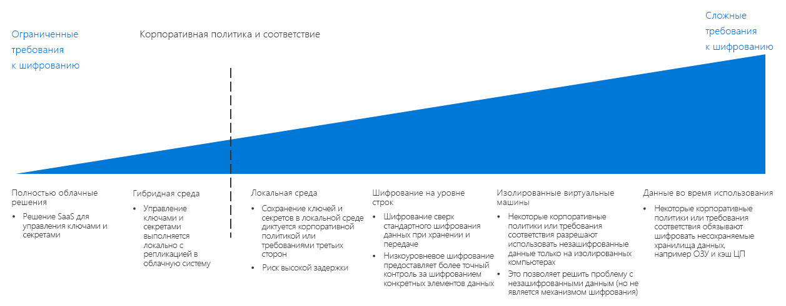

# Руководство по принятию решений о шифрованииEncryption decision guide

Шифрование данных защищает их от несанкционированного доступа.Encrypting data protects it against unauthorized access. Правильно реализованная политика шифрования обеспечивает дополнительные уровни безопасности для облачных рабочих нагрузок, а также защиту от злоумышленников и других неавторизованных пользователей как внутри, так вне организации и ее сетей.Properly implemented encryption policy provides additional layers of security for your cloud-based workloads and guards against attackers and other unauthorized users from both inside and outside your organization and networks.

В общем случае шифрование ресурсов всегда желательно, но оно сопряжено с некоторыми затратами, а также увеличением задержки и интенсивности потребления ресурсов.While encrypting resources is generally desirable, encryption does have costs that can increase latency and overall resource usage. Для ресурсоемких рабочих нагрузок важно найти правильный баланс между поддержкой шифрования и производительностью.For demanding workloads, striking the correct balance between encryption and performance is essential.

Перейти к разделу: [Управление ключами](#key-management) | [Шифрование данных](#data-encryption) | [Подробнее](#learn-more)Jump to: [Key management](#key-management) | [Data encryption](#data-encryption) | [Learn more](#learn-more)

Важным фактором при выборе стратегии шифрования для облака является корпоративная политика и требования соответствия.The inflection point when determining a cloud encryption strategy focuses on corporate policy and compliance mandates.

Есть несколько способов разной сложности и стоимости, позволяющих реализовать шифрование в облачной среде.There are multiple ways to implement encryption in a cloud environment, with varying cost and complexity. Корпоративная политика и сторонние требования соответствия служат основными причинами для создания стратегии шифрования.Corporate policy and third-party compliance are the biggest drivers when planning an encryption strategy. Большинство облачных решений предоставляют стандартные механизмы шифрования данных при хранении и передаче.Most cloud-based solutions provide standard mechanisms for encrypting data, whether at rest or in transit. Но если конкретные политики и нормативные требования диктуют более строгие средства контроля, например стандартизированное управление для секретов и ключей, шифрование при использовании или шифрование с учетом характеристик данных, скорее всего, потребуется реализовать более сложное решение.However, for policies and compliance requirements that demand tighter controls, such as standardized secrets and key management, encryption in-use, or data specific encryption, you will likely need to implement a complex solution.

## Управление ключамиKey management

Современные системы управления ключами должны поддерживать хранение ключей в аппаратных модулях безопасности (HSM) для дополнительной защиты.Modern key management systems should offer support for storing keys using hardware security modules (HSMs) for increased protection. Это означает, что система управления ключами предоставляет организации важную возможность создавать и хранить криптографические ключи, важные пароли, строки подключения и другие конфиденциальные данные.Thus, a key management system is critical to your organization's ability to create and store cryptographic keys, important passwords, connection strings, and other IT confidential information.

При планировании миграции в облако следует рассмотреть варианты, перечисленные в следующей таблице. Здесь описаны возможности для хранения ключей шифрования, сертификатов и секретов и для управления ими, что очень важно для создания безопасных и управляемых облачных развертываний.When planning a cloud migration, the following table describes how you can store and manage encryption keys, certificates, and secrets, which are critical for creating secure and manageable cloud deployments:

| ВопросQuestion | Полностью облачные решенияCloud Native | Гибридная средаHybrid | Локальная системаOn-premises |
|---------------------------------------------------------------------------------------------------------------------------------------|--------------|--------|-------------|
| В вашей организации нет централизованного управления ключами и секретами?Does your organization lack centralized key and secret management?                                                                    | YesYes          | Нет No     | Нет No          |
| Потребуется ли вам ограничение на создание ключей и секретов только с корпоративного оборудования при использовании ключей в облаке?Will you need to limit the creation of keys and secrets to devices to your on-premises hardware, while using these keys in the cloud? | Нет No           | YesYes    | Нет No          |
| Есть ли у вашей организации правила или политики, запрещающее хранение ключей и секретов вне организации?Does your organization have rules or policies in place that would prevent keys and secrets from being stored offsite?                | Нет No           | Нет No     | YesYes         |

### Собственные решения в облакеCloud native

При использовании полностью облачного управления ключами все ключи и секретные данные создаются, управляются и хранятся в облачном хранилище.With cloud native key management, all keys and secrets are generated, managed, and stored in a cloud-based vault. Такой подход упрощает многие ИТ-задачи, связанные с управлением ключами.This approach simplifies many IT tasks related to key management.

Допущения для полностью облачного управления ключами. При использования полностью облачной системы управления ключами предполагается следующее:Cloud native key management assumptions: Using a cloud native key management system assumes the following:

- Вы доверяете облачному решению по управлению ключами создавать, хранить секреты и ключи организации, а также управлять ими.You trust the cloud key management solution with creating, managing, and hosting your organization's secrets and keys.
- Вы разрешаете доступ к облачной системе управления ключами всем локальным приложениям и службам, которые зависят от служб шифрования или секретов.You enable all on-premises applications and services that rely on accessing encryption services or secrets to access the cloud key management system.

### Гибридный подход (создание собственных ключей)Hybrid (bring your own key)

Если используется создание собственных ключей, вы создаете ключи в выделенном аппаратном модуле безопасности в локальной среде, а затем передаете их в защищенную облачную систему управления ключами для использования с облачными ресурсами.With a bring-your-own-key approach, you generate keys on dedicated HSM hardware within your on-premises environment, then transfer the keys to a secure cloud key management system for use with cloud resources.

Допущения для гибридного управления ключами. Для использования гибридной системы управления ключами предполагается следующее:Hybrid key management assumptions: Using a hybrid key management system assumes the following:

- Вы доверяете системам безопасности и контроля доступа на облачной платформе размещать и использовать ваши ключи и секреты.You trust the underlying security and access control infrastructure of the cloud platform for hosting and using your keys and secrets.
- Политика соответствия требованиям или корпоративная политика требуют создавать все секреты и ключи организации, а также управлять ими, только в локальной среде.You are required by regulatory or organizational policy to keep the creation and management of your organization's secrets and keys on-premises.

### Локальная среда (хранение собственных ключей)On-premises (hold your own key)

Иногда нормативные или технические требования либо политики не позволяют хранить ключи в системе управления ключами, предоставленной службой общедоступного облака.In certain scenarios, there may be regulatory, policy, or technical reasons why you can't store keys on a key management system provided by a public cloud service. В таких случаях для организации ключей необходимо использовать локальное оборудование и подготовить механизм, предоставляющий облачным ресурсам доступ к этим ключам для шифрования.In these cases, you must maintain keys using on-premises hardware, and provision a mechanism to allow cloud-based resource to access these keys for encryption purposes. Обратите внимание, что хранение собственных ключей поддерживается не всеми облачными службами.Note that a hold your own key approach may not be compatible with all cloud services.

Допущения для локального управления ключами. Для использования локальной системы управления ключами предполагается следующее:On-premises key management assumptions: Using an on-premises key management system assumes the following:

- Политика соответствия требованиям или корпоративная политика требуют создавать и хранить все секреты и ключи организации, а также управлять ими только в локальной среде.You are required by regulatory or organizational policy to keep the creation, management, and hosting of your organization's secrets and keys on-premises.
- Доступ к локальной системе управления ключами разрешается всем локальным приложениям и службам, которые зависят от служб шифрования или секретов.Any cloud-based applications or services that rely on accessing encryption services or secrets can access the on-premises key management system.

## Шифрование данныхData encryption

Есть несколько состояний данных с разными потребностями в шифровании, которые нужно учитывать при планировании политики шифрования.There are several different states of data with different encryption needs to consider when planning your encryption policy:

| Состояние данныхData state | ДанныеData |
|-----|-----|
| Передаваемые данныеData in transit | Внутренний трафик, подключения к Интернету, соединения между центрами обработки данных или виртуальными сетямиInternal network traffic, internet connections, connections between datacenters or virtual networks |
| Неактивные данныеData at rest    | Базы данных, файлы, виртуальные диски, хранилище PaaSDatabases, files, virtual drives, PaaS storage |
| Используемые данныеData in use     | Данные, загруженные в ОЗУ или кэш ЦПData loaded in RAM or in CPU caches |

### Передаваемые данныеData in transit

Передаваемыми называются данные, которые перемещаются между ресурсами во внутренней (между центрами обработки данных) сети, внешних сетях или через Интернет.Data in transit is data moving between resources on the internal, between datacenters or external networks, or over the internet.

Для шифрования передаваемых данных для трафика обычно принудительно применяются протоколы SSL/TLS.Encrypting data in transit is usually done by requiring SSL/TLS protocols for traffic. Транзитный трафик между размещенными в облаке ресурсами и внешней сетью или общедоступным Интернетом всегда должен шифроваться.Traffic transiting between your cloud-hosted resources to external network or the public internet should always be encrypted. Ресурсы PaaS обычно по умолчанию требуют для трафика шифрование SSL/TLS.PaaS resources generally also enforce SSL/TLS encryption to traffic by default. Применять ли шифрование для трафика между ресурсами IaaS, размещенными внутри виртуальных сетей, нужно решить вашей группе внедрения облака и ответственному за рабочую нагрузку. В общем случае мы рекомендуем применять шифрование.Whether you enforce encryption for traffic between IaaS resources hosted inside your virtual networks is a decision for your Cloud Adoption Team and workload owner and is generally recommended.

**Допущения для шифрования передаваемых данных.****Encrypting data in transit assumptions**. При реализации правильной политики шифрования для передаваемых данных предполагается следующее:Implementing proper encryption policy for data in transit assumes the following:

- Все общедоступные конечные точки в облачной среде будут взаимодействовать с общедоступным Интернетом с использованием протоколов SSL/TLS.All publicly accessible endpoints in your cloud environment will communicate with the public internet using SSL/TLS protocols.
- При подключении облачных сетей к локальной или другой внешней сети через общедоступный Интернет следует использовать зашифрованные протоколы VPN.When connecting cloud networks with on-premises or other external network over the public internet, use encrypted VPN protocols.
- При подключении облачных сетей к локальным или другим внешним сетям через выделенное подключение глобальной сети, такое как ExpressRoute, потребуется локальный VPN-маршрутизатор или другое устройство шифрования, соединенное с совместимым виртуальным VPN или устройством шифрования, которое развернуто в облачной сети.When connecting cloud networks with on-premises or other external network using a dedicated WAN connection such as ExpressRoute, you will use a VPN or other encryption appliance on-premises paired with a corresponding virtual VPN or encryption appliance deployed to your cloud network.
- Если у вас есть конфиденциальные данные, которые не должны попадать в журналы трафика или другие диагностические отчеты, предоставляемые ИТ-специалистам, следует шифровать весь трафик между ресурсами в виртуальной сети.If you have sensitive data that shouldn't be included in traffic logs or other diagnostics reports visible to IT staff, you will encrypt all traffic between resources in your virtual network.

### Неактивные данныеData at rest

Неактивными называют любые данные, которые сейчас не перемещаются и не обрабатываются, включая файлы, базы данных, диски виртуальной машины, учетные записи хранения PaaS или аналогичные ресурсы.Data at rest represents any data not being actively moved or processed, including files, databases, virtual machine drives, PaaS storage accounts, or similar assets. Шифрование хранимых данных защищает виртуальные устройства и файлы от несанкционированного доступа при проникновениях из внешней сети, вредоносных действиях внутренних пользователей или случайном выпуске.Encrypting stored data protects virtual devices or files against unauthorized access either from external network penetration, rogue internal users, or accidental releases.

Ресурсы хранилища и базы данных PaaS обычно применяют шифрование по умолчанию.PaaS storage and database resources generally enforce encryption by default. Виртуальные ресурсы IaaS можно защитить с помощью шифрования виртуальных дисков и криптографических ключей, хранящихся в системе управления ключами.IaaS virtual resources can be secured through virtual disk encryption using cryptographic keys stored in your key management system.

Шифрование неактивных данных также можно выполнять более современными методами шифрования баз данных, например на уровне столбцов и строк, что дает более строгий контроль над определением защищаемых данных.Encryption for data at rest also encompasses more advanced database encryption techniques, such as column-level and row level encryption, which provides much more control over exactly what data is being secured.

При выборе ресурсов для защиты следует учитывать общие требования политики и соответствия, уровень конфиденциальности хранимых данных и требования к производительности рабочих нагрузок.Your overall policy and compliance requirements, the sensitivity of the data being stored, and the performance requirements of your workloads should determine which assets require encryption.

**Допущения для шифрования неактивных данных.****Encrypting Data at Rest Assumptions**. При шифровании неактивных данных предполагается следующее:Encrypting data at rest assumes the following:

- Вы храните данные, которые не предназначены для предоставления широкой публике.You are storing data that is not meant for public consumption.
- Рабочие нагрузки имеют запас на дополнительную задержку, вызванную шифрованием дисков.Your workloads can accept the added latency cost of disk encryption.

### Используемые данныеData in use

Шифрование используемых данных включает в себя защиту данных во временных хранилищах, например в ОЗУ и кэшах ЦП.Encryption for data in use involves securing data in nonpersistent storage, such as RAM or CPU caches. Используются такие технологии, как шифрование всей памяти и технологии внутренней зоны, например Intel Secure Guard Extensions (SGX).Use of technologies such as full memory encryption, enclave technologies, such as Intel's Secure Guard Extensions (SGX). Сюда входят и криптографические методы, например гомоморфное шифрование, которое позволяет создать безопасные и доверенные среды выполнения.This also includes cryptographic techniques, such as homomorphic encryption that can be used to create secure, trusted execution environments.

**Допущения для шифрования используемых данных.****Encrypting data in use assumptions**. При шифровании используемых данных предполагается следующее:Encrypting data in use assumes the following:

- Вы постоянно сохраняете независимость прав собственности на данные от базовой облачной платформы, даже на уровне ОЗУ и ЦП.You are required to maintain data ownership separate from the underlying cloud platform at all times, even at the RAM and CPU level.

## ПодробнееLearn more

Дополнительные сведения о шифровании и управлении ключами на платформе Azure см. в следующих статьях.See the following for more information about encryption and key management in the Azure platform.

- [Общие сведения о шифровании в Azure](/azure/security/security-azure-encryption-overview).[Azure encryption overview](/azure/security/security-azure-encryption-overview). Подробное описание того, как Azure использует шифрование для защиты неактивных данных и передаваемых данных.A detailed description of how Azure uses encryption to secure both data at rest and data in transit.
- [Azure Key Vault.](/azure/key-vault/key-vault-overview)[Azure Key Vault](/azure/key-vault/key-vault-overview). Azure Key Vault является основной системой управления ключами Azure, которая позволяет хранить в Azure криптографические ключи, секреты и сертификаты, а также управлять ими.Key Vault is the primary key management system for storing and managing cryptographic keys, secrets, and certificates within Azure.
- [Конфиденциальные вычисления в Azure](/solutions/confidential-compute).[Confidential computing in Azure](/solutions/confidential-compute). Инициатива конфиденциальных вычислений Azure предоставляет средства и технологии для создания сред доверенного выполнения и других механизмов шифрования, позволяющих защищать используемые данные.Azure's confidential computing initiative provides tools and technology to create trusted execution environments or other encryption mechanisms to secure data in use.

## Дополнительная информацияNext steps

Узнайте, как сети SDN поддерживают функции виртуализированных сетей для развертываний в облаке.Learn how Software Defined Networks provide virtualized networking capabilities for cloud deployments.

> [!div class="nextstepaction"]
> [CAF: Software Defined Network decision guide](../software-defined-network/overview.md) (CAF. Руководство по принятию решений для программно-определяемой сети)[Which Software Defined Network pattern is best for my deployment?](../software-defined-network/overview.md)
