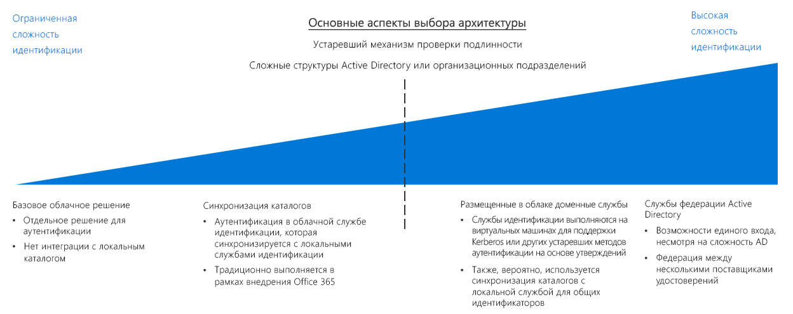

# Руководство по принятию решений о системе идентификацииIdentity decision guide

В любой среде, будь то локальной, гибридной или облачной, ИТ-персоналу необходимо контролировать, какие администраторы, пользователи и группы имеют доступ к ресурсам.In any environment, whether on-premises, hybrid, or cloud-only, IT needs to control which administrators, users, and groups have access to resources. Службы управления идентификацией и доступом (IAM) позволяют контролировать управление доступом в облаке.Identity and access management (IAM) services enable you to manage access control in the cloud.

Перейти к разделу: [Определение требований к интеграции идентификации](#determine-identity-integration-requirements) | [Облачные решения](#cloud-baseline) | [Синхронизация каталогов](#directory-synchronization) | [Облачные доменные службы](#cloud-hosted-domain-services) | [Службы федерации Active Directory](#active-directory-federation-services) | [Развитие интеграции идентификации](#evolving-identity-integration) | [Дополнительные сведения](#learn-more)Jump to: [Determine Identity Integration Requirements](#determine-identity-integration-requirements) | [Cloud native](#cloud-baseline) | [Directory Synchronization](#directory-synchronization) | [Cloud hosted domain services](#cloud-hosted-domain-services) | [Active Directory Federation Services](#active-directory-federation-services) | [Evolving identity integration](#evolving-identity-integration) | [Learn more](#learn-more)

Существует несколько способов управления удостоверениями в облачной среде, которые различаются по стоимости и сложности.There are several ways to manage identity in a cloud environment, which vary in cost and complexity. Ключевым фактором при структурировании облачных служб идентификации является требуемый уровень интеграции с существующей локальной инфраструктурой идентификации.A key factor in structuring your cloud-based identity services is the level of integration required with your existing on-premises identity infrastructure.

Облачные решения для идентификации типа SaaS ("программное обеспечение как услуга") обеспечивают базовый уровень управления доступом и идентификацией для облачных ресурсов.Cloud-based software as a service (SaaS) identity solutions provide a base level of access control and identity management for cloud resources. Однако если инфраструктура Active Directory (AD) организации имеет сложную структуру леса или настроенные подразделения, облачные рабочие нагрузки могут требовать репликации каталогов в облако для согласованности набора удостоверений, групп и ролей между локальной и облачной средами.However, if your organization's Active Directory (AD) infrastructure has a complex forest structure or customized organizational units (OUs), your cloud-based workloads may require directory replication to the cloud for a consistent set of identities, groups, and roles between your on-premises and cloud environments. Если для глобального решения требуется репликация каталогов, сложность может значительно возрасти.If directory replication is required for a global solution, complexity can increase significantly. Кроме того, для поддержки приложений, зависящих от устаревших механизмов аутентификации, может потребоваться развертывание доменных служб в облаке.Additionally, support for applications dependent on legacy authentication mechanisms may require the deployment of domain services in the cloud.

## Определение требований к интеграции идентификацииDetermine identity integration requirements

| ВопросQuestion | Базовая облачная система идентификацииCloud baseline | Синхронизация каталоговDirectory synchronization | Облачные доменные службыCloud-hosted Domain Services | Службы федерации ADAD Federation Services |
|------|------|------|------|------|
| У вас нет локальной службы каталогов в данный момент?Do you currently lack an on-premises directory service? | YesYes | Нет No | Нет No | Нет No |
| Требуется ли выполнять аутентификацию рабочих нагрузок в локальных службах идентификации?Do your workloads need to authenticate against on-premises identity services? | Нет No | YesYes | Нет No | Нет No |
| Зависят ли рабочие нагрузки от устаревших механизмов аутентификации, таких как Kerberos или NTLM?Do your workloads depend on legacy authentication mechanisms, such as Kerberos or NTLM? | Нет No | Нет No | YesYes | Нет No |
| Можно ли интегрировать облачные и локальные службы идентификации?Is integration between cloud and on-premises identity services impossible? | Нет No | Нет No | YesYes | Нет No |
| Требуется ли единый вход в нескольких поставщиках удостоверений?Do you require single sign-on across multiple identity providers? | Нет No | Нет No | Нет No | YesYes |

При планировании миграции в Azure необходимо определить, как лучше интегрировать существующие службы управления идентификацией и облачные службы идентификации.As part of planning your migration to Azure, you will need to determine how best to integrate your existing identity management and cloud identity services. Ниже приведены распространенные сценарии интеграции.The following are common integration scenarios.

### Базовая облачная система идентификацииCloud baseline

Общедоступные облачные платформы обеспечивают собственную систему управления идентификацией и доступом (IAM) для предоставления пользователям и группам доступа к функциям управления.Public cloud platforms provide a native IAM system for granting users and groups access to management features. Если в организации отсутствует существенное локальное решение идентификации и планируется перемещение рабочих нагрузок для обеспечения совместимости с облачными механизмами аутентификации, инфраструктуру идентификации следует создать с помощью облачной службы идентификации.If your organization lacks a significant on-premises identity solution, and you plan on migrating workloads to be compatible with cloud-based authentication mechanisms, you should build your identity infrastructure using a cloud-native identity service.

**Предположения относительно базовой облачной системы идентификации**.**Cloud baseline assumptions**. Использование полностью облачной инфраструктуры идентификации предполагает следующее:Using a purely cloud-native identity infrastructure assumes the following:

- Облачные ресурсы не будут зависеть от локальных служб каталогов или серверов Active Directory, а рабочие нагрузки можно изменить, чтобы удалить эти зависимости.Your cloud-based resources will not have dependencies on on-premises directory services or Active Directory servers, or workloads can be modified to remove those dependencies your.
- Переносимые рабочие нагрузки приложений или служб поддерживают механизмы аутентификации, совместимые с поставщиками облачных удостоверений, или их можно легко изменить, чтобы они поддерживали эти службы.The application or service workloads being migrated either support authentication mechanisms compatible with cloud identity providers or can be modified easily to support them. Облачные поставщики удостоверений полагаются на механизмы аутентификации, поддерживающие интернет-режим, такие как SAML, OAuth и OpenID Connect.Cloud native identity providers rely on internet-ready authentication mechanisms such as SAML, OAuth, and OpenID Connect. Существующие рабочие нагрузки, которые зависят от устаревших методов проверки подлинности, использующих такие протоколы, как Kerberos или NTLM, возможно, придется переработать перед перемещением в облако.Existing workloads that depend on legacy authentication methods using protocols such as Kerberos or NTLM may need to be refactored before migrating to the cloud.

> [!TIP]
> Большинство облачных служб идентификации не являются полной заменой традиционных локальных каталогов.Most cloud-native identity services are not full replacements for traditional on-premises directories. Такие функции каталога, как управление компьютером или групповая политика, могут быть недоступны без использования дополнительных средств или служб.Directory features such as computer management or group policy may not be available without using additional tools or services.

Полное перемещение служб идентификации в облачный поставщик избавляет от необходимости поддерживать собственную инфраструктуру идентификации, что значительно упрощает управление ИТ-ресурсами.Completely migrating your identity services to a cloud-based provider eliminates the need to maintain your own identity infrastructure, significantly simplifying your IT management.

### Синхронизация каталоговDirectory synchronization

Для организаций с существующей инфраструктурой идентификации синхронизация каталогов часто является лучшим решением, чтобы сохранить существующий механизм управления пользователями и доступом и при этом обеспечить необходимые возможности IAM для управления облачными ресурсами.For organizations with an existing identity infrastructure, directory synchronization is often the best solution for preserving existing user and access management while providing the required IAM capabilities for managing cloud resources. Этот процесс непрерывно реплицирует сведения о каталоге между облачной и локальной средами, что позволяет выполнять единый вход для пользователей и обеспечивает согласованность системы идентификации, ролей и разрешений во всей организации.This process continuously replicates directory information between the cloud and on-premises environments, allowing single sign-on (SSO) for users and a consistent identity, role, and permission system across your entire organization.

Примечание. Организации, которые выбрали Office 365, возможно, уже реализовали [синхронизацию каталогов](/office365/enterprise/set-up-directory-synchronization) между своей локальной инфраструктурой Active Directory и Azure Active Directory.Note: Organizations that have adopted Office 365 may have already implemented [directory synchronization](/office365/enterprise/set-up-directory-synchronization) between their on-premises Active Directory infrastructure and Azure Active Directory.

**Предположения относительно синхронизации каталогов**.**Directory synchronization assumptions**. Использование решения синхронизированной идентификации предполагает следующее:Using a synchronized identity solution assumes the following:

- Необходимо поддерживать общий набор учетных записей пользователей и групп в облачной и локальной ИТ-инфраструктурах.You need to maintain a common set of user accounts and groups across your cloud and on-premises IT infrastructure.
- Локальные службы идентификации поддерживают репликацию с облачным поставщиком удостоверений.Your on-premises identity services support replication with your cloud identity provider.
- Для пользователей, обращающихся к облачным и локальным поставщикам удостоверений, требуются механизмы единого входа.You require SSO mechanisms for users accessing cloud and on-premises identity providers.

> [!TIP]
> Любым облачным рабочим нагрузкам, которые зависят от устаревших механизмов аутентификации, неподдерживаемых облачными службами идентификации, такими как Azure AD, по-прежнему требуется подключение к локальным доменным службам или виртуальным серверам в облачной среде, предоставляющей эти службы.Any cloud-based workloads that depend on legacy authentication mechanisms that are not supported by cloud-based identity services like Azure AD will still require either connectivity to on-premises domain services or virtual servers in the cloud environment providing these services. При использовании локальных служб идентификации также возникают зависимости от подключения между облачными и локальными сетями.Using on-premises identity services also introduces dependencies on connectivity between the cloud and on-premises networks.

### Облачные доменные службыCloud-hosted domain services

Если у вас есть рабочие нагрузки, которые зависят от аутентификации на основе утверждений с использованием устаревших протоколов, таких как Kerberos или NTLM, и эти рабочие нагрузки нельзя оптимизировать для принятия современных протоколов аутентификации (например, SAML, OAuth или OpenID Connect), вам может потребоваться перенести некоторые из ваших доменных служб в облако в рамках облачного развертывания.If you have workloads that depend on claims-based authentication using legacy protocols such as Kerberos or NTLM, and those workloads cannot be refactored to accept modern authentication protocols such as SAML or OAuth and OpenID Connect, you may need to migrate some of your domain services to the cloud as part of your cloud deployment.

Этот тип развертывания включает в себя развертывание виртуальных машин с Active Directory в облачных виртуальных сетях, чтобы предоставлять доменные службы для ресурсов в облаке.This type of deployment involves deploying virtual machines running Active Directory in your cloud-based virtual networks to provide domain services for resources in the cloud. Любые существующие приложения и службы, перемещающиеся в облачную сеть, должны иметь возможность использовать эти облачные серверы каталогов с незначительными изменениями.Any existing applications and services migrating to your cloud network should be able to use of these cloud-hosted directory servers with minor modifications.

Вполне вероятно, что существующие каталоги и доменные службы будут по-прежнему использоваться в локальной среде.It's likely that your existing directories and domain services will continue to be used in your on-premises environment. В этом случае рекомендуется также синхронизировать каталоги для предоставления общего набора пользователей и ролей в облачной и локальной средах.In this scenario, it's recommended that you also use directory synchronization to provide a common set of users and roles in both the cloud and on-premises environments.

**Предположения относительно облачных доменных служб**.**Cloud hosted domain services assumptions**. Миграция каталогов предполагает следующее:Performing a directory migration assumes the following:

- Рабочие нагрузки зависят от аутентификации на основе утверждений с использованием таких протоколов, как Kerberos или NTLM.Your workloads depend on claims-based authentication using protocols like Kerberos or NTLM.
- Виртуальные машины рабочих нагрузок должны быть присоединены к домену для управления или применения групповой политики Active Directory.Your workload virtual machines need to be domain-joined for management or application of Active Directory group policy purposes.

> [!TIP]
> Хотя перемещение каталогов в сочетании с облачными доменными службами обеспечивает большую гибкость при переносе существующих рабочих нагрузок, размещение виртуальных машин в облачной виртуальной сети для предоставления этих служб повышает сложность задач управления ИТ-инфраструктурой.While a directory migration coupled with cloud-hosted domain services provides great flexibility when migrating existing workloads, hosting virtual machines within your cloud virtual network to provide these services does increase the complexity of your IT management tasks. По мере увеличения опыта перемещения в облако изучите долгосрочные требования к обслуживанию при размещении этих серверов.As your cloud migration experience matures, examine the long-term maintenance requirements of hosting these servers. Подумайте, может ли рефакторинг существующих рабочих нагрузок для совместимости с поставщиками облачных удостоверений, такими как Azure Active Directory, уменьшить потребность в таких серверах, размещенных в облаке.Consider whether refactoring existing workloads for compatibility with cloud identity providers such as Azure Active Directory can reduce the need for these cloud-hosted servers.

### службы федерации Active Directory;Active Directory Federation Services

Федерация удостоверений устанавливает отношения доверия между несколькими системами управления удостоверениями, чтобы обеспечить общие возможности аутентификации и авторизации.Identity federation establishes trust relationships across multiple identity management systems to allow common authentication and authorization capabilities. Затем можно поддерживать возможности единого входа в нескольких доменах в организации или системах удостоверений, управляемых клиентами или бизнес-партнерами.You can then support single sign-on capabilities across multiple domains within your organization or identity systems managed by your customers or business partners.

Azure AD поддерживает федерацию локальных доменов Active Directory с помощью [служб федерации Active Directory](/azure/active-directory/hybrid/how-to-connect-fed-whatis) (AD FS).Azure AD supports federation of on-premises Active Directory domains using [Active Directory Federation Services](/azure/active-directory/hybrid/how-to-connect-fed-whatis) (AD FS). Сведения о том, как это можно реализовать в Azure, см. в статье [Расширение служб федерации Active Directory (AD FS) в Azure](../../../reference-architectures/identity/adfs.md).See the reference architecture [Extend AD FS to Azure](../../../reference-architectures/identity/adfs.md) to see how this can be implemented in Azure.

## Развитие интеграции удостоверенийEvolving identity integration

Интеграция удостоверений — это итеративный процесс.Identity integration is an iterative process. Можно начать с облачного решения с небольшим набором пользователей и соответствующими ролями в качестве начального развертывания.You may want to start with a cloud native solution with a small set of users and corresponding roles for an initial deployment. По мере совершенствования миграции рекомендуется принять федеративную модель или выполнить полную миграцию каталогов локальных служб идентификации в облако.As your migration matures, consider adopting a federated model or performing a full directory migration of your on-premises identity services to the cloud. Пересмотрите стратегии идентификации на каждом этапе итерации процесса миграции.Revisit your identity strategy in every iteration of your migration process.

## ПодробнееLearn more

Ниже приведены дополнительные сведения о службах идентификации на платформе Azure.See the following for more information about identity services on the Azure platform.

- [Azure AD](https://azure.microsoft.com/services/active-directory).[Azure AD](https://azure.microsoft.com/services/active-directory). Azure AD — это облачная служба идентификации.Azure AD provides cloud-based identity services. Она позволяет контролировать доступ к ресурсам Azure и управлять удостоверениями, регистрацией устройств, подготовкой пользователей, контролем доступа к приложениям и защитой данных.It allows you to manage access to your Azure resources and control identity management, device registration, user provisioning, application access control, and data protection.
- [Azure AD Connect](/azure/active-directory/hybrid/whatis-hybrid-identity).[Azure AD Connect](/azure/active-directory/hybrid/whatis-hybrid-identity). Средство Azure AD Connect позволяет подключать экземпляры Azure AD к существующим решениям по управлению удостоверениями, обеспечивая синхронизацию существующего каталога в облаке.The Azure AD Connect tool allows you to connect Azure AD instances with your existing identity management solutions, allowing synchronization of your existing directory in the cloud.
- [Управление доступом на основе ролей](/azure/role-based-access-control/overview) (RBAC).[Role-based access control](/azure/role-based-access-control/overview) (RBAC). Azure AD предоставляет RBAC для эффективного и безопасного управления доступом к ресурсам в плоскости управления.Azure AD provides RBAC to efficiently and securely manage access to resources in the management plane. Задания и обязанности организованы в роли, которые назначены пользователям.Jobs and responsibilities are organized into roles, and users are assigned to these roles. RBAC позволяет управлять доступом к ресурсу, а также действиями, которые пользователь может выполнять с этим ресурсом.RBAC allows you to control who has access to a resource along with which actions a user can perform on that resource.
- [Azure AD Privileged Identity Management](/azure/active-directory/privileged-identity-management/pim-configure) (PIM).[Azure AD Privileged Identity Management](/azure/active-directory/privileged-identity-management/pim-configure) (PIM). PIM уменьшает продолжительность действия привилегий доступа к ресурсам и повышает видимость их использования с помощью отчетов и оповещений.PIM lowers the exposure time of resource access privileges and increases your visibility into their use through reports and alerts. Это достигается путем предоставления пользователям привилегий только в определенное время (JIT) либо путем назначения привилегий на короткий период, по истечении которого они автоматически отзываются.It limits users to taking on their privileges "just in time" (JIT), or by assigning privileges for a shorter duration, after which privileges are revoked automatically.
- [Интеграция локальных доменов Active Directory с Azure Active Directory](../../../reference-architectures/identity/azure-ad.md).[Integrate on-premises Active Directory domains with Azure Active Directory](../../../reference-architectures/identity/azure-ad.md). Эта эталонная архитектура предоставляет пример синхронизации каталогов между локальными доменами Active Directory и Azure AD.This reference architecture provides an example of directory synchronization between on-premises Active Directory domains and Azure AD.
- [Расширение доменных служб Active Directory (AD DS) в Azure](../../../reference-architectures/identity/adds-extend-domain.md).[Extend Active Directory Domain Services (AD DS) to Azure.](../../../reference-architectures/identity/adds-extend-domain.md) В этой эталонной архитектуре приведен пример развертывания серверов AD DS, чтобы расширить доменные службы до облачных ресурсов.This reference architecture provides an example of deploying AD DS servers to extend domain services to cloud-based resources.
- [Расширение служб федерации Active Directory (AD FS) в Azure](../../../reference-architectures/identity/adfs.md).[Extend Active Directory Federation Services (AD FS) to Azure](../../../reference-architectures/identity/adfs.md). Эта эталонная архитектура настраивает службы федерации Active Directory (AD FS) для выполнения федеративной аутентификации и авторизации в каталоге Azure AD.This reference architecture configures Active Directory Federation Services (AD FS) to perform federated authentication and authorization with your Azure AD directory.

## Дополнительная информацияNext steps

Узнайте, как реализовать принудительное применение политик в облаке.Learn how to implement policy enforcement in the cloud.

> [!div class="nextstepaction"]
> [Принудительное применение политикPolicy enforcement](../policy-enforcement/overview.md)
