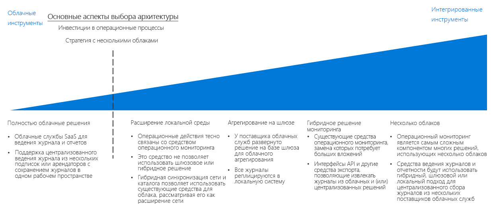

# Руководство по принятию решений о ведении журналов и создании отчетовLogging and reporting decision guide

Все организации нуждаются в механизмах уведомления ИТ-специалистов о проблемах производительности, работоспособности и безопасности, прежде чем они станут серьезными.All organizations need mechanisms for notifying IT teams of performance, uptime, and security issues before they become serious problems. Успешная стратегия мониторинга позволяет понять, как работают отдельные компоненты, составляющие рабочие нагрузки и сетевую инфраструктуру.A successful monitoring strategy allows you to understand how the individual components that make up your workloads and networking infrastructure are performing. В контексте миграции в общедоступное облако интеграция ведения журналов и создания отчетов с любой из существующих систем мониторинга, а также видимость важных событий и метрик для соответствующего ИТ-персонала крайне важны для обеспечения бесперебойной работы, безопасности и соответствия политикам в вашей организации.Within the context of a public cloud migration, integrating logging and reporting with any of your existing monitoring systems, while surfacing important events and metrics to the appropriate IT staff, is critical in ensuring your organization is meeting uptime, security, and policy compliance goals.

Перейти к разделу: [Планирование инфраструктуры мониторинга](#planning-your-monitoring-infrastructure) | [Полностью облачные решения](#cloud-native) | [Интеграция с локальными системами](#on-premises-extension) | [Агрегация шлюза](#gateway-aggregation) | [Гибридный мониторинг (локальный)](#hybrid-monitoring-on-premises) | [Гибридный мониторинг (на основе облака)](#hybrid-monitoring-cloud-based) | [Многооблачные решения](#multi-cloud) | [Дополнительные сведения](#learn-more)Jump to: [Planning your monitoring infrastructure](#planning-your-monitoring-infrastructure) | [Cloud native](#cloud-native) | [On-premises extension](#on-premises-extension) | [Gateway aggregation](#gateway-aggregation) | [Hybrid monitoring (on-premises)](#hybrid-monitoring-on-premises) | [Hybrid monitoring (cloud-based)](#hybrid-monitoring-cloud-based) | [Multi-cloud](#multi-cloud) | [Learn more](#learn-more)

Определение стратегии выбора облака главным образом зависит от существующих инвестиций вашей организации в операционные процессы и в некоторой степени от определенных требований к поддержке многооблачной стратегии.The inflection point when determining a cloud identity strategy is based primarily on existing investments your organization has made in operational processes, and to some degree any requirements you have to support a multi-cloud strategy.

Существует несколько способов ведения журналов и создания отчетов о действиях в облаке.There are multiple ways to log and report on activities in the cloud. Полностью облачное и централизованное ведение журналов — это два распространенных варианта программного обеспечения как услуги (SaaS), которые определяются структурой подписки и количеством подписок.Cloud native and centralized logging are two common software as a service (SaaS) options that are driven by the subscription design and the number of subscriptions.

## Планирование инфраструктуры мониторингаPlanning your monitoring infrastructure

При планировании развертывания необходимо учитывать, где хранятся данные журналов и как интегрировать облачные службы отчетов и мониторинга с существующими процессами и инструментами.When planning your deployment, you need to consider where logging data is stored and how you will integrate cloud-based reporting and monitoring services with your existing processes and tools.

| ВопросQuestion | Собственные решения в облакеCloud native | Интеграция с локальными системамиOn-premises extension | Гибридный мониторингHybrid monitoring | Агрегация шлюзаGateway aggregation |
|-----|-----|-----|-----|-----|
| Имеется ли у вас существующая локальная инфраструктура мониторинга?Do you have an existing on-premises monitoring infrastructure? | Нет No | YesYes | ДаYes |  Нет No |
| Есть ли у вас требования, препятствующие хранению данных журналов во внешних хранилищах?Do you have requirements preventing storage of log data on external storage locations? | Нет No | YesYes | Нет No | Нет No |
| Вам необходимо интегрировать облачный мониторинг с локальными системами?Do you need to integrate cloud monitoring with on-premises systems? | Нет No | Нет No | YesYes | Нет No |
Необходимо ли обрабатывать или фильтровать данные телеметрии перед их отправкой в системы мониторинга?Do you need to process or filter telemetry data before submitting it to your monitoring systems? | Нет No | Нет No | Нет No | YesYes |

### Собственные решения в облакеCloud native

Если в вашей организации в настоящее время отсутствуют установленные системы ведения журналов и отчетности или если запланированное облачное развертывание не требуется интегрировать с существующими локальными или другими внешними системами мониторинга, самым простым выбором будет облачное решение SaaS.If your organization currently lacks established logging and reporting systems, or if your planned cloud deployment does not need to be integrated with existing on-premises or other external monitoring systems, a cloud native SaaS solution is the simplest choice.

В этом случае данные журналов записываются и хранятся в той же облачной среде, что и рабочая нагрузка, в то время как средства ведения журналов и создания отчетов, которые обрабатывают и предоставляют информацию ИТ-персоналу, предлагаются как часть облачной платформы.In this scenario, log data is recorded and stored in the same cloud environment as your workload, while the logging and reporting tools that process and surface information to IT staff are offered as part of the cloud platform.

Полностью облачные решения ведения журналов могут быть реализованы нерегламентированно для каждой подписки или рабочей нагрузки в небольших или экспериментальных развертываниях и организованы централизованно, чтобы выполнять мониторинг данных журналов по всей облачной инфраструктуре.Cloud native logging solutions can be implemented ad hoc per subscription or workload for smaller or experimental deployments and are organized in a centralized manner to monitor log data across your entire cloud estate.

**Предположения относительно полностью облачных решений**.**Cloud native assumptions**. Использование полностью облачной системы ведения журналов и отчетности предполагает следующее:Using a cloud native logging and reporting system assumes the following:

- Вам не нужно интегрировать данные журналов из ваших облачных рабочих нагрузок в существующие локальные системы.You do not need to integrate the log data from you cloud workloads into existing on-premises systems.
- Вы не будете использовать свои облачные системы отчетности для мониторинга локальных систем.You will not be using your cloud-based reporting systems to monitor on-premises systems.

### Интеграция с локальными системамиOn-premises extension

Если вам требуется интегрировать облачную телеметрию с локальными системами, не поддерживающими гибридное ведение журналов и создание отчетов, или необходимо поддерживать миграцию приложений и служб с минимальным объемом повторной разработки, вам понадобится развернуть на виртуальных машинах агенты мониторинга, которые будут отправлять данные журналов непосредственно в локальные системы, а не сохранять их в облачной среде.In scenarios where you need to integrate cloud telemetry with on-premises systems that do not support hybrid logging and reporting, or support the migration of applications and services with a minimum amount of redevelopment, you will need to deploy monitoring agents to VMs that will send log data directly to your on-premises systems, rather than storing it in the cloud environment.

Для такого сценария облачные ресурсы должны иметь возможность напрямую взаимодействовать с локальными системами с помощью комбинации [гибридной сети](../software-defined-network/hybrid.md) и [облачных доменных служб](../identity/overview.md#cloud-hosted-domain-services).In order to support this approach, your cloud resources will need to be able to communicate directly with your on-premises systems through a combination of [hybrid networking](../software-defined-network/hybrid.md) and [cloud hosted domain services](../identity/overview.md#cloud-hosted-domain-services). При этом облачная виртуальная сеть функционирует как сетевое расширение локальной среды.With this in place, the cloud virtual network functions as a network extension of the on-premises environment. Таким образом, облачные рабочие нагрузки могут напрямую взаимодействовать с локальной системой ведения журналов и создания отчетов.Therefore, cloud hosted workloads can communicate directly with your on-premises logging and reporting system.

Этот подход основан на существующих инвестициях в средства мониторинга с ограниченными изменениями каких-либо облачных приложений или служб.This approach capitalizes on your existing investment in monitoring tooling with limited modification to any cloud-deployed applications or services. Часто это самый быстрый подход к поддержке мониторинга во время миграции по методу lift-and-shift.This is often the fastest approach to support monitoring during a lift-and-shift migration. Однако он не предусматривает сбор данных журналов, создаваемых облачными ресурсами PaaS и SaaS, а любые связанные с виртуальной машиной данные журналов, созданные самой облачной платформой, такие как состояние виртуальной машины, исключаются.However, it won’t capture log data produced by cloud-based PaaS and SaaS resources, and it will omit any VM-related logs generated by the cloud platform itself such as VM status. В результате этот шаблон должен быть временным решением до тех пор, пока не будет реализовано более комплексное решение гибридного мониторинга.As a result, this pattern should be a temporary solution until a more comprehensive hybrid monitoring solution is implemented.

Предположения относительно полностью локальных решений:On-premises only assumptions:

- Данные журналов необходимо хранить только в локальной среде (либо в соответствии с техническими требованиями, либо в соответствии с нормативными требованиями или требованиями политики).You need to maintain log data only in your on-premises environment only, either in support of technical requirements or due to regulatory or policy requirements.
- Локальные системы не поддерживают гибридные решения для ведения журналов, создания отчетов или агрегации шлюза.Your on-premises systems do not support hybrid logging and reporting or gateway aggregation solutions.
- Облачные приложения могут отправлять данные телеметрии непосредственно в локальные системы ведения журналов либо можно развернуть на виртуальных машинах с рабочими нагрузками агенты мониторинга, отправляющие данные в локальную среду.Your cloud-based applications can submit telemetry directly to your on-premises logging systems or monitoring agents that submit to on-premises can be deployed to workload VMs.
- Рабочие нагрузки не зависят от служб PaaS или SaaS, требующих ведения журналов и создания отчетов на основе облака.Your workloads are not dependent on PaaS or SaaS services that require cloud-based logging and reporting.

### Агрегация шлюзаGateway aggregation

Для сценариев, в которых объем облачных данных телеметрии очень велик или существующим локальным системам мониторинга требуется изменение данных журналов перед обработкой, может понадобиться служба [агрегации шлюза данных журналов](../../../patterns/gateway-aggregation.md).For scenarios where the amount of cloud-based telemetry data is very large or existing on-premises monitoring systems need log data modified before it can be processed, a log data [gateway aggregation](../../../patterns/gateway-aggregation.md) service may be required.

Служба шлюза развертывается в системе поставщика облачных служб.A gateway service is deployed to your cloud provider. Затем соответствующие приложения и службы настраиваются, чтобы отправлять данные телеметрии в шлюз вместо системы ведения журналов по умолчанию.Then, relevant applications and services are configured to submit telemetry data to the gateway instead of a default logging system. После этого шлюз может обрабатывать данные (агрегировать, объединять или иным образом форматировать их), а затем отправлять в службу мониторинга для приема и анализа.The gateway can then process the data: aggregating, combining, or otherwise formatting it before then submitting it to your monitoring service for ingestion and analysis.

Кроме того, шлюз может использоваться для агрегирования и предварительной обработки данных телеметрии, привязанных к облачным или гибридным системам.Also, a gateway can be used to aggregate and preprocess telemetry data bound for cloud-native or hybrid systems.

Предположения относительно агрегации шлюза:Gateway aggregation assumptions:

- Ожидается очень высокая интенсивность передачи данных телеметрии из облачных приложений или служб.You expect very high levels of telemetry data from your cloud-based applications or services.
- Перед отправкой данных телеметрии в системы мониторинга необходимо отформатировать или иным образом оптимизировать их.You need to format or otherwise optimize telemetry data before submitting it to your monitoring systems.
- Ваши системы мониторинга используют API или другие механизмы для приема данных журналов после их обработки шлюзом.Your monitoring systems have APIs or other mechanisms available to ingest log data after processing by the gateway.

### Гибридный мониторинг (локальный)Hybrid monitoring (on-premises)

Гибридное решение для мониторинга объединяет данные журналов из локальных и облачных ресурсов, обеспечивая интегрированное представление рабочего состояния ИТ-среды.A hybrid monitoring solution combines log data from both your on-premises and cloud resources to provide an integrated view into your IT estate's operational status.

При наличии инвестиций в локальные системы мониторинга, которые трудно или дорого заменить, может потребоваться интегрировать данные телеметрии из облачных рабочих нагрузок в существующие локальные решения для мониторинга.If you have an existing investment in on-premises monitoring systems that would be difficult or costly to replace, you may need to integrate the telemetry from your cloud workloads into preexisting on-premises monitoring solutions. В гибридной локальной системе мониторинга локальные данные телеметрии продолжают использовать существующую локальную систему мониторинга.In a hybrid on-premises monitoring system, on-premises telemetry data continues to use the existing on-premises monitoring system. Облачные данные телеметрии либо отправляются непосредственно в облачную систему мониторинга, либо хранятся в облаке вместе с рабочими нагрузками, а затем регулярно компилируются и поступают в локальную систему.Cloud-based telemetry data is either sent to the cloud monitoring system directly, or the data is stored on the cloud alongside your workloads and then compiled and ingested into the on-premises system at regular intervals.

**Предположения относительно локального гибридного мониторинга**.**On-premises hybrid monitoring assumptions**. Использование локальной системы ведения журналов и отчетов для гибридного мониторинга предполагает следующее:Using an on-premises logging and reporting system for hybrid monitoring assumes the following:

- Для мониторинга облачных рабочих нагрузок необходимо использовать существующие локальные системы отчетов.You need to use existing on-premises reporting systems to monitor cloud workloads.
- Необходимо сохранить право владения на локальные данные журналов.You need to maintain ownership of log data on-premises.
- Локальные системы управления используют API или другие механизмы для приема данных журналов из облачных систем.Your on-premises management systems have APIs or other mechanisms available to ingest log data from cloud-based systems.

> [!TIP]
> Как часть итеративного характера миграции в облако вероятен переход от отдельного облачного и локального мониторинга к частичному гибридному подходу.As part of the iterative nature of cloud migration, transitioning from distinct cloud-native and on-premises monitoring to a partial hybrid approach is likely. Убедитесь, что изменения в архитектуре мониторинга соответствуют общим процессам ИТ и операционным процессам.Make sure to keep changes to your monitoring architecture in line with your overall IT and operational processes.

### Гибридный мониторинг (облачный)Hybrid monitoring (cloud-based)

Если у вас нет острой необходимости поддерживать локальную систему мониторинга или вы хотите заменить локальные системы мониторинга решением SaaS, вы также можете интегрировать локальные данные журналов с централизованной облачной системой мониторинга.If you do not have a compelling need to maintain an on-premises monitoring system, or you want to replace on-premises monitoring systems with a SaaS solution, you can also choose to integrate on-premises log data with a centralized cloud-based monitoring system.

Как и при централизованной локальной системе мониторинга, в этом случае облачные рабочие нагрузки будут использовать механизм ведения журналов в облаке по умолчанию, а локальные приложения и службы будут либо отправлять каталог телеметрии в облачную систему ведения журналов, либо агрегировать эти данные для загрузки в облачную систему на регулярной основе.Mirroring the on-premises centered approach, in this scenario cloud workloads would use their default cloud logging mechanism, and on-premises applications and services would either send telemetry directory to the cloud-based logging system, or aggregate that data for ingestion into the cloud system at regular intervals. Облачная система мониторинга будет служить в качестве основной системы мониторинга и отчетности для всей ИТ-инфраструктуры.The cloud-based monitoring system would then serve as your primary monitoring and reporting system for your entire IT estate.

Предположения относительно облачного гибридного мониторинга: Использование облачной системы ведения журналов и отчетов для гибридного мониторинга предполагает следующее:Cloud-based hybrid monitoring assumptions: Using cloud-based logging and reporting systems for hybrid monitoring assumes the following:

- Вы не зависите от существующих локальных систем мониторинга.You are not dependent upon existing on-premises monitoring systems.
- Рабочие нагрузки не имеют нормативных требований или требований политики для локального хранения данных журналов.Your workloads do not have regulatory or policy requirements to store log data on-premises.
- Облачные системы мониторинга используют API или другие механизмы для приема данных журналов из локальных приложений и служб.Your cloud-based monitoring systems have APIs or other mechanisms available to ingest log data from on-premises applications and services.

### Многооблачные решенияMulti-cloud

Интеграция возможностей ведения журналов и создания отчетов на платформе с несколькими облаками может быть достаточно сложной.Integrating logging and reporting capabilities across a multiple-cloud platform can be complicated. Службы, предлагаемые различными платформами, часто не сопоставимы напрямую, и возможности ведения журналов и телеметрии, предоставляемые этими службами, также различаются.Services offered between platforms are often not directly comparable, and logging and telemetry capabilities provided by these services differ as well.
Чтобы поддерживать ведение журналов в нескольких облаках, часто требуется использовать службы шлюза для преобразования данных журналов в общий формат перед их отправкой в гибридное решение ведения журналов.Multi-cloud logging support often requires the use of gateway services to process log data into a common format before submitting data to a hybrid logging solution.

## ПодробнееLearn more

[Azure Monitor](/azure/azure-monitor/overview) — это стандартная служба создания отчетов и мониторинга в Azure.[Azure Monitor](/azure/azure-monitor/overview) is the default reporting and monitoring service for Azure. Служба предоставляет:It provides:

- Унифицированную платформу для сбора телеметрии приложений, телеметрии узлов (например, виртуальных машин), метрик контейнеров, метрик платформы Azure и журналов событий.A unified platform for collecting app telemetry, host telemetry (such as VMs), container metrics, Azure platform metrics, and event logs.
- Визуализацию, запросы, оповещения и аналитические инструменты.Visualization, queries, alerts, and analytical tools. Это позволяет получать аналитические сведения о виртуальных машинах, гостевых операционных системах, виртуальных сетях и событиях приложений рабочей нагрузки.It can provide insights into virtual machines, guest operating systems, virtual networks, and workload application events.
- [REST API](/azure/monitoring-and-diagnostics/monitoring-rest-api-walkthrough) для интеграции со внешними службами и автоматизации служб мониторинга и оповещения.[REST APIs](/azure/monitoring-and-diagnostics/monitoring-rest-api-walkthrough) for integration with external services and automation of monitoring and alerting services
- [Интеграцию](/azure/monitoring-and-diagnostics/monitoring-partners) со многими популярными сторонними поставщиками.[Integration](/azure/monitoring-and-diagnostics/monitoring-partners) with many popular third-party vendors.
