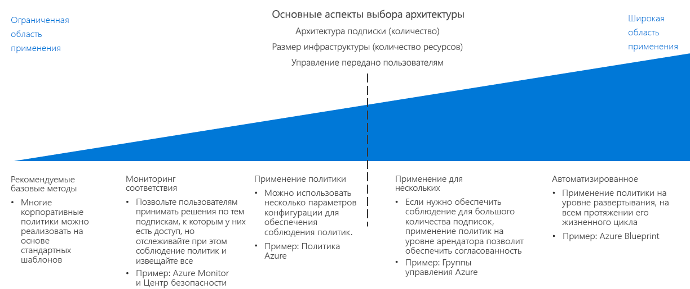

# Руководство по принудительному применению политик

Определение организационной политики не эффективно, если нет способа применить ее в организации. Ключевым аспектом планирования любой миграции в облако является определение оптимального сочетания инструментов, предоставляемых облачной платформой, с имеющимися ИТ-процессами для максимального соответствия политике во всем облачном пространстве.

Перейти к разделу: [Рекомендуемая практика по базовым показателям](#baseline-recommended-practices) | [Мониторинг соблюдения политики](#policy-compliance-monitoring) | [Применение политик](#policy-enforcement) | [Политика для совместной работы между организациями](#cross-organization-policy) | [Автоматическое применение](#automated-enforcement)

По мере роста облачных ресурсов возникает необходимость поддерживать и применять политику в отношении большего числа ресурсов, подписок и клиентов. Чем больше ресурсов, тем сложнее должны быть ваши механизмы принудительного применения для обеспечения последовательного соблюдения и быстрого выявления нарушений. Предоставляемые платформой механизмы применения политик на уровне ресурсов или подписок обычно достаточны для небольших облачных развертываний, в то время как для более крупных развертываний могут потребоваться более сложные механизмы, включающие стандарты развертывания, группировку и организацию ресурсов, а также интеграцию применения политик с системами ведения журналов и отчетности.

Важным фактором при выборе сложности стратегии принудительного применения политики в первую очередь является количество подписок или клиентов, требуемых при [разработке подписки](../subscriptions/overview.md). Объем контроля, предоставленного различным ролям пользователей в облачном хранилище, также может повлиять на эти решения.

## Рекомендации по базовым показателям

Для одиночной подписки и простых облачных развертываний много корпоративных политик можно принудительно применить, используя особенности, присущие большинству облачных платформ. Даже при таком относительно низком уровне сложности развертывания последовательное использование шаблонов, обсуждаемых в руководствах по [принятию решений CAF](../overview.md), может помочь установить базовый уровень соответствия политике.

Например: 

- [Шаблоны развертывания](../resource-consistency/overview.md) могут предоставлять ресурсы со стандартизированной структурой и конфигурацией.
- [Стандарты присвоения тегов и имен](../resource-tagging/overview.md) могут помочь организовать операции и поддерживать требования к бухгалтерскому учету и бизнесу.
- Управление трафиком и сетевые ограничения могут быть реализованы через [программно-определяемую сеть](../software-defined-network/overview.md).
- [Управление доступом на основе ролей](../identity/overview.md) позволяет защитить и изолировать облачные ресурсы.

Начните планирование применения облачной политики, изучив, как применение стандартных шаблонов, описанных в этих руководствах, может помочь удовлетворить требования организации.

## Отслеживание соответствия нормативным требованиям

Еще одним ключевым фактором, даже для относительно небольших облачных развертываний, является возможность проверки соответствия облачных приложений и служб организационной политике, а также оперативного уведомления ответственных сторон о несоответствии ресурса требованиям. Эффективное [ведение журнала и отчетность](../log-and-report/overview.md) о состоянии соответствия облачных рабочих нагрузок является важной частью стратегии применения корпоративной политики.

По мере роста облачных ресурсов дополнительные средства, такие как [Центр безопасности Azure](/azure/security-center/), могут обеспечивать интегрированную безопасность и обнаружение угроз, а также применять централизованное управление политиками и оповещения для локальных и облачных ресурсов.

## Принудительное применение политики

Чтобы обеспечить согласование политики, можно также применить параметры конфигурации и правила создания ресурсов на уровне подписки.

[Политика Azure](/azure/governance/policy/overview) — это служба Azure для создания, назначения политик и управления ими. Эти политики гарантируют соблюдение различных правил и действий с ресурсами, что обеспечивает соответствие этих ресурсов корпоративным стандартам и соглашениям об уровне обслуживания. Служба "Политика Azure" оценивает ресурсы на предмет несоответствия назначенным политикам. Например, может потребоваться ограничить размер SKU виртуальных машин в среде. После реализации этой политики новые и имеющиеся ресурсы будут оцениваться на предмет соответствия. При правильном типе политики имеющиеся ресурсы могут быть приведены в соответствие.

## Политики между организациями

Та как облачные ресурсы растут, чтобы охватить много подписок, для которых требуется принудительное выполнение, вы должны сосредоточиться на стратегии принудительного выполнения в пределах клиента в целях обеспечения согласованности политики.

В проекте вашей [подписки](../subscriptions/overview.md) должна учитываться политика, связанная с организационной структурой. Помимо поддержки сложной организации в рамках проекта подписки [группы управления Azure](../subscriptions/overview.md#management-groups) можно использовать для назначения правил политики Azure нескольким подпискам.

## Автоматизированное принудительное выполнение

Хотя стандартизированные шаблоны развертывания эффективны в меньших масштабах, [Azure Blueprints](/azure/governance/blueprints/overview) позволяет выполнять крупномасштабную стандартизированную подготовку и оркестрацию развертывания решений Azure. Рабочие нагрузки в нескольких подписках можно развертывать с согласованными параметрами политики для любых созданных ресурсов.

Для ИТ-сред, интегрирующих облачные и локальные ресурсы, может потребоваться использование систем ведения журналов и создания отчетов, чтобы обеспечить гибридные возможности мониторинга. Ваши сторонние или пользовательские системы оперативного мониторинга могут предложить дополнительные возможности применения политик. Для сложных облачных систем рассмотрите варианты того, как лучше интегрировать эти системы с облачными ресурсами.

## Дополнительная информация

Узнайте, как согласованность ресурсов используется для организации и стандартизации облачных развертываний в целях разработки и управления подписками.

> [!div class="nextstepaction"]
> [Согласованность ресурсов](../resource-consistency/overview.md)
