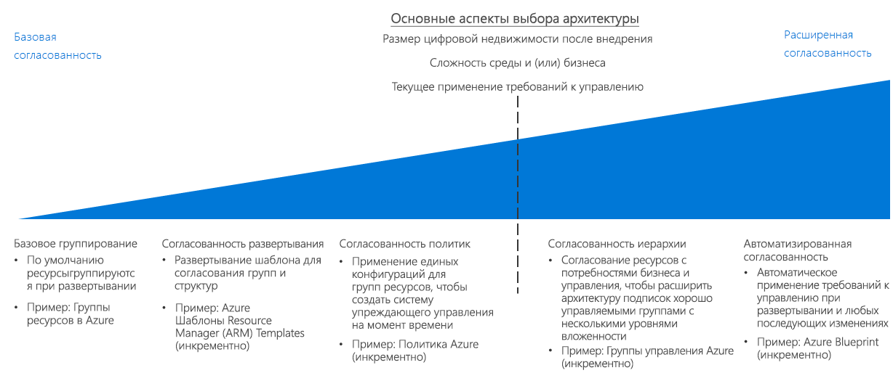

# CAF. Руководство по принятию решений касательно согласованности ресурсовCAF: Resource consistency decision guide

[Проект подписки](../subscriptions/overview.md) Azure определяет, как организовать облачные ресурсы по отношению к общей структуре организации.Azure [subscription design](../subscriptions/overview.md) defines how you organize your cloud assets in relation to your organization's overall structure. Кроме того, интеграция существующих стандартов управления ИТ-ресурсами и политик организации зависит от развертывания и организации облачных ресурсов в подписке.In addition, integrating your existing IT management standards and your organizational policies depends on how you deploy and organize cloud resources within a subscription.

Средства, доступные для реализации проектов развертывания и группирования ресурсов, а также управления ими, зависят от облачной платформы.The tools available to implement your resource deployment, grouping, and management designs vary by cloud platform. Как правило, каждое решение включает следующие возможности:In general, each solution includes the following features:

- Механизм логического группирования ниже уровня подписки или учетной записи.A logical grouping mechanism below the subscription or account level.
- Возможность развертывания ресурсов программным образом с помощью API.The ability to deploy resources programmatically with APIs.
- Шаблоны для создания стандартизированных развертываний.Templates for creating standardized deployments.
- Возможность развертывания правил политики на уровнях подписки, учетной записи и группирования ресурсов.The ability to deploy policy rules at the subscription, account, and resource grouping levels.

Перейти к разделу: [Простое группирование](#basic-grouping) | [Согласованность развертывания](#deployment-consistency) | [Согласованность политики](#policy-consistency) | [Иерархическая согласованность](#hierarchical-consistency) | [Автоматическая согласованность](#automated-consistency)Jump to: [Basic grouping](#basic-grouping) | [Deployment consistency](#deployment-consistency) | [Policy consistency](#policy-consistency) | [Hierarchical consistency](#hierarchical-consistency) | [Automated consistency](#automated-consistency)

Решения развертывания и группирования ресурсов в основном обусловлены следующими факторами: размером цифровых активов после миграции, сложностью среды или организации, которая не соответствует в полной мере в рамках существующего подхода к проекту подписки, или необходимостью применять управление после развертывания ресурсов.Resource deployment and grouping decisions are primarily driven by these factors: post-migration digital estate size, business or environmental complexity that doesn't fit neatly within your existing subscription design approaches, or the need to enforce governance over time after resources have been deployed. Более современная структура группирования ресурсов требует повышенного усилия, чтобы гарантировать точное группирование. В результате увеличивается время, затрачиваемое на отслеживание изменений и управление ими.More advanced resource grouping designs require an increased effort to ensure accurate grouping, and this results in an increase in the time spent on change management and tracking.

## Простое группированиеBasic grouping

В Azure [группы ресурсов](/azure/azure-resource-manager/resource-group-overview#resource-groups) представляют собой базовый механизм организации ресурсов, позволяющий логически группировать ресурсы в подписке.In Azure, [resource groups](/azure/azure-resource-manager/resource-group-overview#resource-groups) are a core resource organization mechanism to logically group resources within a subscription.

Это контейнеры для ресурсов с общим жизненным циклом или общими ограничениями управления, такими как требования управления доступом на основе ролей (RBAC) или требования политики.Resource groups act as containers for resources with a common lifecycle or shared management constraints such as policy or role-based access control (RBAC) requirements. Группы ресурсов не могут быть вложенными, и ресурсы могут принадлежать только одной группе ресурсов.Resource groups can't be nested, and resources can only belong to one resource group. Определенные действия могут применяться для всех ресурсов в группе ресурсов.Some actions can act on all resources in a resource group. Например, при удалении группы ресурсов удаляются все входящие в нее ресурсы.For example, deleting a resource group removes all resources within that group. Существуют распространенные шаблоны создания групп ресурсов, которые разделены на две общие категории:There are common patterns when creating resource groups, commonly divided into two categories:

- Традиционные рабочие нагрузки ИТ. Чаще всего группируются по элементам в рамках одного жизненного цикла, например приложения.Traditional IT workloads: Most often grouped by items within the same lifecycle, such as an application. Группирование по приложениям позволяет управлять отдельными приложениями.Grouping by application allows for individual application management.
- Гибкие рабочие нагрузки ИТ. Сосредотачиваются на облачных приложениях для внешних клиентов.Agile IT workloads: Focus on external customer-facing cloud applications. Эти группы ресурсов часто отражают функциональные уровни развертывания (например, уровень Интернета или уровень приложений) и управления.These resource groups often reflect the functional layers of deployment (such as web tier or app tier) and management.

## Согласованность развертыванияDeployment consistency

Основываясь на базовом механизме группирования ресурсов, большинство облачных платформ предоставляют систему использования шаблонов для развертывания ресурсов в облачной среде.Building on top of the base resource grouping mechanism, most cloud platforms provide a system for using templates to deploy your resources to the cloud environment. Вы можете использовать шаблоны для создания согласованной структуры и соглашений об именовании при развертывании рабочих нагрузок, применяя эти аспекты развертывания и контроля ресурсов.You can use templates to create consistent organization and naming conventions when deploying workloads, enforcing those aspects of your resource deployment and management design.

[Шаблоны Azure Resource Manager](/azure/azure-resource-manager/resource-group-overview#template-deployment) позволяют многократно развертывать ресурсы в согласованном состоянии с использованием предопределенной структуры группы ресурсов и конфигурации.[Azure Resource Manager templates](/azure/azure-resource-manager/resource-group-overview#template-deployment) allow you to repeatedly deploy your resources in a consistent state using a predetermined configuration and resource group structure. Эти шаблоны помогают задать набор стандартов в качестве основы для ваших развертываний.Resource Manager templates help you define a set of standards as a basis for your deployments.

Например, у вас может быть стандартный шаблон для развертывания рабочей нагрузки веб-сервера, который содержит две виртуальные машины в качестве веб-серверов и подсистему балансировки нагрузки для управления трафиком между серверами.For example, you can have a standard template for deploying a web server workload that contains two virtual machines as web servers combined with a load balancer to manage traffic between the servers. Затем вы можете повторно использовать этот шаблон для создания структурно идентичных развертываний всякий раз, когда требуется новая рабочая нагрузка веб-сервера. Вам нужно изменить только имя развертывания и IP-адрес.You can then reuse this template to create structurally identical deployments whenever a new web server workload is needed, only changing the deployment name and IP addresses involved.

Обратите внимание, что можно также развертывать эти шаблоны программным способом и интегрировать их в свои системы CI/CD.Note that you can also programmatically deploy these templates and integrate them with your CI/CD systems.

## Согласованность политикPolicy consistency

Чтобы обеспечить применение политик управления во время создания ресурсов, как часть проекта группирования ресурсов при развертывании ресурсов необходимо использовать типичную конфигурацию.To ensure that governance policies are applied when resources are created, part of resource grouping design involves using a common configuration when deploying resources.

Объединяя группы ресурсов и стандартизированные шаблоны Resource Manager, можно применять стандарты для параметров, необходимых в развертывании, и правил [Политики Azure](/azure/governance/policy/overview), применяемых к каждой группе ресурсов или ресурсу.By combining resource groups and standardized Resource Manager templates, you can enforce standards for what settings are required in a deployment and what [Azure Policy](/azure/governance/policy/overview) rules are applied to each resource group or resource.

Например, может существовать требование подключения всех виртуальных машин, развернутых в рамках вашей подписки, к общей подсети, управляемой центральным ИТ-отделом.For example, you may have a requirement that all virtual machines deployed within your subscription connect to a common subnet managed by your central IT team. Вы можете создать стандартный шаблон для развертывания виртуальных машин рабочей нагрузки, который будет создавать отдельную группу ресурсов для рабочей нагрузки и развертывать в ней виртуальные машины.You can create a standard template for deploying workload VMs which would create a separate resource group for the workload and deploy the required VMs there. У этой группы ресурсов будет правило политики, которое разрешает присоединение к общей подсети только тех сетевых интерфейсов, которые находятся внутри группы ресурсов.This resource group would have a policy rule to only allow network interfaces within the resource group to be joined to the shared subnet.

Более подробное рассмотрение принудительного применения решений политики в рамках облачного развертывания см. в [этой статье](../policy-enforcement/overview.md).For a more in-depth discussion of enforcing your policy decisions within a cloud deployment, see [Policy enforcement](../policy-enforcement/overview.md).

## Иерархическая согласованностьHierarchical consistency

По мере роста облачной инфраструктуры может потребоваться поддержка более сложных нормативных требований, которую можно реализовать с помощью иерархии "предприятие — подразделение — учетная запись — подписка" Соглашения Azure Enterprise.As the size of your cloud estate grows, you may need to support more complicated governance requirements than can be supported using the Azure Enterprise Agreement's Enterprise/Department/Account/Subscription hierarchy. Группы ресурсов позволяют поддерживать дополнительные уровни иерархии в вашей организации, применяя правила Политики Azure и элементы управления доступом на уровне группы ресурсов.Resource groups allows you to support additional levels of hierarchy within your organization, applying Azure Policy rules and access controls at a resource group level.

[Группы управления Azure](../subscriptions/overview.md#management-groups) могут поддерживать более сложные организационные структуры путем наложения альтернативной иерархии поверх структуры Соглашения Enterprise.[Azure management groups](../subscriptions/overview.md#management-groups) can support more complicated organizational structures by overlaying an alternative hierarchy on top of your enterprise agreement's structure. Благодаря этому подписки и содержащиеся в них ресурсы могут поддерживать механизмы управления доступом и принудительного применения политики, созданные для соответствия требованиям организации.This allows subscriptions, and the resources they contain, to support access control and policy enforcement mechanisms organized to match your business organizational requirements.

## Автоматическая согласованностьAutomated consistency

Для больших облачных развертываний глобальное управление становится более важным и более сложным.For large cloud deployments, global governance becomes both more important and more complex. Очень важно автоматически принудительно применять нормативные требования при развертывании ресурсов, а также выполнять обновленные требования для существующих развертываний.It is crucial to automatically apply and enforce governance requirements when deploying resources, as well as meet updated requirements for existing deployments.

Служба [Azure Blueprints](/azure/governance/blueprints/overview) позволяет организациям поддерживать глобальное управление большими облачными инфраструктурами в Azure.[Azure Blueprints](/azure/governance/blueprints/overview) enable organizations to support global governance of large cloud estates in Azure. Схемы выходят за рамки возможностей, предоставляемых стандартными шаблонами Azure Resource Manager. Они позволяют создавать полные оркестрации развертываний, поддерживающие правила развертывания ресурсов и применение правил политики.Blueprints move beyond the capabilities provided by standard Azure Resource Manager templates to create complete deployment orchestrations capable of deploying resources and applying policy rules. Схемы поддерживают управление версиями, возможность применения обновлений для всех подписок, где использовалась схема, и возможность блокировки развернутых подписок во избежание несанкционированного создания и изменения ресурсов.Blueprints supports versioning, the ability to make apply updates to all subscriptions where the blueprint was used, and the ability to lock down deployed subscriptions to avoid the unauthorized creation and modification of resources.

Эти пакеты развертывания позволяют ИТ-специалистам и командам разработчиков быстро развертывать новые рабочие нагрузки и сетевые ресурсы, которые соответствуют меняющимся требованиям политики организации.These deployment packages allow IT and development teams to rapidly deploy new workloads and networking assets that comply with changing organizational policy requirements. Схемы также можно интегрировать в конвейеры CI/CD для применения пересмотренных стандартов управления к развертываниям по мере их обновления.Blueprints can also be integrated into CI/CD pipelines to apply revised governance standards to deployments as they are updated.

## Дополнительная информацияNext steps

Ознакомьтесь со сведениями об именовании ресурсов и добавлении к ним тегов для дальнейшей организации облачных ресурсов и управления ими.Learn how resource naming and tagging are used to further organize and manage your cloud resources.

> [!div class="nextstepaction"]
> [Именование ресурсов и добавление к ним теговResource naming and tagging](../resource-tagging/overview.md)
