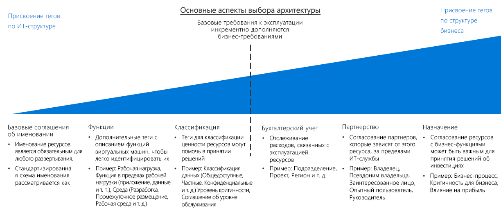

# Руководство по решениям для упорядочения ресурсов и присвоения тегов

Упорядочение облачных ресурсов является одной из важнейших задач ИТ-служб для любых развертываний, кроме самых простых. Упорядочение ресурсов позволяет достичь трех основных целей.

- **Управление ресурсами**. ИТ-команде важно быстро находить ресурсы, связанные с определенными рабочими нагрузками, средами, группами владельцев и т. п. Упорядочение ресурсов крайне важно для назначения ролей и разрешений на доступ для управления ресурсами.
- **Эксплуатация**. Правильная организационная схема не только упрощает управление для ИТ-отделов, но и позволяет применить автоматизацию для создания ресурсов, операционного мониторинга и разработки процессов DevOps.
- **Учет**. Чтобы предоставить подразделениям организации сведения о потреблении облачных ресурсов, ИТ-команда должна хорошо понимать, какие ресурсы используются конкретными рабочими нагрузками и командами. Для поддержки таких подходов, как возвратные платежи и виртуальные счета, необходимо упорядочивать облачные ресурсы, что позволит получать данные о владении и использовании.

## Рекомендации по принятию решений о тегах

Перейти к разделу: [Базовые соглашения об именовании](#baseline-naming-conventions) | [Шаблоны присвоения тегов ресурсам](#resource-tagging-patterns) | [Политика именования и присвоения тегов](#naming-and-tagging-policy) | [Подробнее](#learn-more)

Вы можете выбрать простой или сложный подход к присвоению тегов в зависимости от конкретных задач: от помощи ИТ-отделам, которые управляют облачными рабочими нагрузками, до интеграции информации обо всех аспектах бизнеса.

Теги для помощи ИТ-командам позволят упростить мониторинг ресурсов и принятие решений по управлению на основе функциональности и классификации.

Если схема присвоения тегов будет включать не только ИТ-политики, может потребоваться больше времени на создание и поддержание стандартов тегов, соответствующих интересам бизнеса. Но зато в результате этого процесса система тегов сможет повысить возможности учета затрат и ценности ИТ-ресурсов. Такая связь ценности и операционной стоимости ресурса станет одним из первых шагов на пути изменения места возникновения затрат на ИТ-системы организации.

## Базовое соглашение об именовании

Стандартизированное соглашение об именовании служит основой для упорядочения ресурсов, размещенных в облаке. Правильно структурированная система именования позволяет быстро находить ресурсы для целей управления и учета. Если в других отделах вашей организации уже используется соглашение об именовании ИТ-систем, оцените возможность соблюдения аналогичного соглашения для облачных ресурсов или необходимость создать отдельные стандарты для облака.

Обратите внимание, что для разных ресурсов Azure существуют разные [требования к именованию](../../../best-practices/naming-conventions.md#naming-rules-and-restrictions). Соглашения об именовании должны соответствовать всем таким требованиям.

## Шаблоны присвоения тегов ресурсам

Для более сложных систем, в которых уже недостаточно консистентных соглашений об именовании, облачные платформы поддерживают возможность присваивать ресурсам теги.

*Тегами* называются элементы метаданных, присвоенные ресурсам. Теги состоят из пар "ключ — значение" в строковом формате. Значения этих пар вы можете выбирать произвольно, но согласованность применения глобальных тегов можно считать частью комплексной политики именования и присвоения тегов, которая играет важную роль в общей политике управления.

Вот несколько примеров распространенных шаблонов присвоения тегов.

<!-- markdownlint-disable MD033 -->

| Тип тега | Примеры | ОПИСАНИЕ |
|-----|-----|-----|
| Функциональные            | app = catalogsearch1  tier = web  webserver = apache env = prod  env = staging  env = dev                 | Распределение ресурсов по категориям в зависимости от их назначения в рабочей нагрузке, среды развертывания или других функций и эксплуатационных характеристик.                                 |
| классификация;        | confidentiality=private sla = 24hours                                 | Классификация ресурсов по методам использования и применимым к ресурсам политикам.                               |
| Учет            | department = finance  project = catalogsearch  region = northamerica | Позволяет сопоставить ресурс с определенным группами внутри организации для выставления счетов. |
| Партнерство           | owner = jsmith  contactalias = catsearchowners stakeholders = user1;user2;user3                        | Сведения о том, кто связан с этим ресурсом (за пределами ИТ-отдела) или иным образом зависит от него.                      |
| Назначение               | businessprocess=support businessimpact=moderate revenueimpact=high   | Сопоставление ресурсов с бизнес-функциями для поддержки решения об инвестициях.  |

<!-- markdownlint-enable MD033 -->

## Политика именования и присвоения тегов

Политика именования и присвоения тегов будет постепенно развиваться. Но крайне важно с самого начала миграции в облако правильно определить ключевые приоритеты организации. В рамках процесса планирования тщательно обдумайте следующие вопросы:

- Как лучше всего интегрировать политику именования и присвоения тегов с существующими политиками именования и упорядочения в вашей организации?
- Будет ли использоваться система учета с возвратными платежами или виртуальными счетами? Как представлены в этой организационной структуре разные подразделения, бизнес-группы и команды?
- Какая информация должна присутствовать в тегах для всех ресурсов? Какая информация будет оставлена на реализацию (или отказ от реализации) отдельным командам?
- Нужно ли отражать в тегах такие детали, как требования о соответствии нормативным требованиям для ресурса? А нужны ли эксплуатационные данные, например требования к времени работы, расписание исправлений или требования к безопасности?

## Подробнее

Дополнительные сведения о присвоении имен и тегов в Azure см. в следующих статьях:

- [Соглашения об именовании для ресурсов Azure.](../../../best-practices/naming-conventions.md) В этом руководстве на сайте Azure Cloud Fundamentals вы найдете рекомендуемые соглашения об именовании для ресурсов Azure.
- [Использование тегов для упорядочения ресурсов в Azure](/azure/azure-resource-manager/resource-group-using-tags?toc=/azure/billing/TOC.json). Вы можете применить в Azure теги на уровнях группы ресурсов или отдельного ресурса, что дает гибкость в подробном учете бухгалтерских отчетов на основе присвоенных тегов.

## Дополнительная информация

Узнайте, как шифрование используется для защиты данных в облачных средах.

> [!div class="nextstepaction"]
> [Шифрование](../encryption/overview.md)
