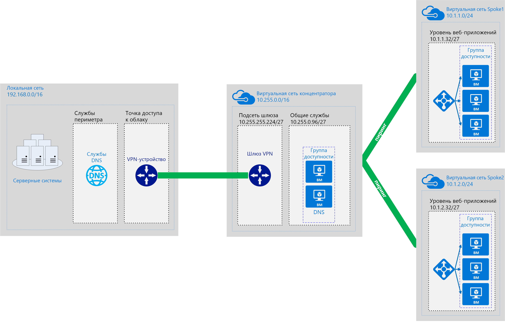

# Программно-определяемые сети. звездообразная модель

Звездообразная модель сети организует сетевую облачную инфраструктуру Azure в несколько взаимосвязанных виртуальных сетей. Эта модель позволяет эффективнее управлять общими требованиями к связи или безопасности и работать с потенциальными ограничениями подписки.

В звездообразной модели *концентратор* является виртуальной сетью, которая действует в качестве центрального расположения по управлению внешними службами подключения и размещения, используемыми несколькими рабочими нагрузками. *Периферийные зоны* — это виртуальные сети, в которых размещены рабочие нагрузки, и которые подключаются к центральному концентратору через [пиринг виртуальной сети](/virtual-network/virtual-network-peering-overview).

Весь трафик, проходящий через периферийные сети рабочих нагрузок, маршрутизируется в сеть концентратора, если его можно маршрутизировать, просматривать или иным образом управлять им с помощью централизованно управляемых ИТ-правил или процессов.

Эта модель помогает решить следующие проблемы:

- Сокращение затрат и повышения эффективности управления. Централизация служб, которые могут совместно использоваться несколькими рабочими нагрузками, такими как сетевые виртуальные модули (NVA) и DNS-серверы в одном расположении, что позволяет ИТ-отделу минимизировать избыток ресурсов и усилия по управлению в нескольких рабочих нагрузках.
- Преодоление ограничения подписок. Большим рабочим нагрузкам может потребоваться больше ресурсов, чем разрешено в рамках одной подписки Azure (см. статью об [ограничениях подписки](/azure/azure-subscription-service-limits)). Пиринг рабочей нагрузки виртуальных сетей из различных подписок в центральный концентратор может преодолеть эти ограничения.
- Разделение областей ответственности. Возможность развертывания отдельных рабочих нагрузок между центральными ИТ-командами и командами по выполнению рабочих нагрузок.

На следующей схеме показан пример звездообразной архитектуры с централизованно управляемым гибридным подключением.

Звездообразная архитектура часто используется вместе с гибридной архитектурой сети, обеспечивая централизованное управляемое соединение с локальной средой, общей для нескольких рабочих нагрузок. В этом случае весь трафик, передающийся между рабочими нагрузками и локальным расположением, проходит через концентратор, где он защищен и управляем.

## Предварительные требования для звездообразной архитектуры

Реализация звездообразной архитектуры виртуальной сети предполагает следующее:

- Облачные развертывания включают рабочие нагрузки, размещенные в различных рабочих средах (среда разработки, тестирования и рабочая среда), которые полагаются на набор распространенных служб, таких как DNS или службы каталогов.
- Рабочие нагрузки не обязательно должны взаимодействовать друг с другом, но могут иметь общие требования к внешним коммуникациям и общим службам.
- Рабочие нагрузки требуют больше ресурсов, чем доступно в одной подписке Azure.
- Необходимо предоставить командам по выполнению рабочих нагрузок права делегированного управления собственными ресурсами, сохраняя при этом централизованное управление безопасностью внешних подключений.

## Глобальная звездообразная архитектура

Звездообразные архитектуры обычно реализуются с помощью виртуальных сетей, развернутых в том же регионе Azure, чтобы свести к минимуму задержку между сетями. Однако большим организациям с глобальным охватом может потребоваться развернуть рабочие нагрузки в нескольких регионах в целях доступности, аварийного восстановления или нормативных требований. За счет использования [глобального пиринга виртуальной сети](/azure/virtual-network/virtual-network-peering-overview) Azure звездообразная модель может расширить централизованное управление и общие службы по регионам, чтобы поддерживать рабочие нагрузки, распределенные по всему миру.

## Подробнее

Примеры реализации звездообразных сетей в Azure см. на сайте эталонных архитектур Azure:

- [Реализация звездообразной топологии сети в Azure](../../../reference-architectures/hybrid-networking/hub-spoke.md)
- [Реализация звездообразной топологии сети с помощью общих служб в Azure](../../../reference-architectures/hybrid-networking/shared-services.md)
