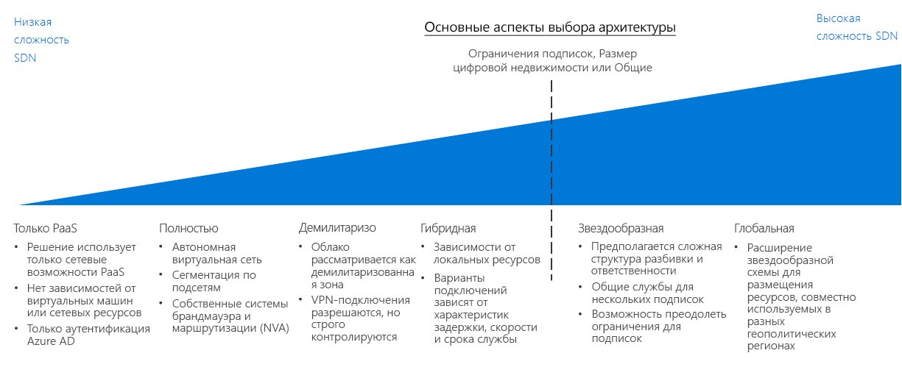

# CAF. Руководство по принятию решений относительно программно-конфигурируемой сети

Программно-конфигурируемая сеть (SDN) — это сетевая архитектура, поддерживающая функции виртуализированных сетей, которую можно централизованно администрировать, настраивать и изменять с помощью ПО. SDN обеспечивает уровень абстракции поверх физической сетевой инфраструктуры, предоставляя виртуализированный эквивалент физических маршрутизаторов, брандмауэров и другого сетевого оборудования, которое обычно находится в локальной сети.

С помощью SDN ИТ-специалисты могут настроить и развернуть сетевые структуры и возможности, поддерживающие требования рабочих нагрузок с использованием виртуальных ресурсов. Благодаря гибкости управления программным развертыванием SDN позволяет быстро изменять сетевые ресурсы и поддерживает и гибкую, и традиционную модели развертывания. Виртуальные сети, созданные на базе технологии SDN, крайне необходимы для создания безопасных сетей на общедоступной облачной платформе.

## Схема по принятию решений относительно сети

Перейти к разделу: [Только PaaS](paas-only.md)  | [Полностью облачные решения](cloud-native.md) | | [Сеть периметра в облаке](cloud-dmz.md) [Гибридная среда](hybrid.md) | [Звездообразная модель](hub-spoke.md) | [Дополнительные сведения](#learn-more)

SDN предоставляет несколько вариантов различной стоимости и сложности. На представленной выше схеме кратко изложены эти варианты, чтобы вы могли быстро сопоставить их с конкретными технологическими и бизнес-стратегиями.

Важными факторами при выборе в этом руководстве являются несколько ключевых решений, которые приняла ваша команда по облачной стратегии, прежде чем принять решение о сетевой архитектуре. Наиболее важные ключевые решения связаны с [определением цифровых активов](../../digital-estate/overview.md) и [проектом подписки](../subscriptions/overview.md) (на которые также могут влиять решения, касающиеся учета облачных затрат и глобальных маркетинговых стратегий).

Эти факторы едва ли влияют на небольшие развертывания в одном регионе (менее 1000 виртуальных машин). И наоборот, выбранный вариант SDN и эти факторы могут существенно влиять на скорость и сложность внедрения при наличии более чем 1000 виртуальных машин, нескольких подразделений или геополитических рынков.

## Выбор подходящих архитектур виртуальных сетей

Этот раздел дополняет схему по принятию решений, чтобы помочь вам выбрать подходящие архитектуры виртуальных сетей.

Реализовать технологии SDN для создания виртуальных сетей в облаке можно множеством способов. То, как вы структурируете виртуальные сети, используемые при миграции, и как эти сети взаимодействуют с вашей существующей ИТ-инфраструктурой, будет зависеть от сочетания требований к рабочим нагрузкам и системе управления.

При выборе архитектуры или сочетания архитектур виртуальных сетей во время планирования миграции в облако ответьте на следующие вопросы, чтобы определить правильное решение для вашей организации.

| Вопрос | Только PaaS | Полностью облачные решения | Сеть периметра в облаке | Гибридная среда | Звездообразная |
|-----|-----|-----|-----|-----|-----|
| Будет ли ваша рабочая нагрузка использовать только службы PaaS и не требовать других сетевых возможностей, которые эти службы не предоставляют? | Yes | Нет  | Нет  | Нет  | Нет  |
| Требует ли рабочая нагрузка интеграции с локальными приложениями? | Нет  | Нет  | Yes | Да | Yes |
| Определили ли вы подходящие политики безопасности и установили ли безопасное подключение между локальными и облачными сетями? | Нет  | Нет  | Нет  | Yes | Yes |
| Требуются ли для вашей рабочей нагрузки службы проверки подлинности, не поддерживаемые облачными службами идентификации, или вам нужен прямой доступ к локальным контроллерам доменов? | Нет  | Нет  | Нет  | Yes | Yes |
| Нужно ли вам развертывать большое количество виртуальных машин и рабочих нагрузок и управлять ими? | Нет  | Нет  | Нет  | Нет  | Yes |
| Нужно ли вам обеспечивать централизованное управление и локальное подключение, делегируя контроль над ресурсами отдельным группам рабочих нагрузок? | Нет  | Нет  | Нет  | Нет  | Yes |

## Архитектуры виртуальных сетей

Ниже подробно описаны основные архитектуры программно-конфигурируемых сетей.

- [**Только PaaS**](paas-only.md). Платформа как услуга (PaaS) поддерживает ограниченный набор встроенных сетевых функций и может не требовать явно определенной программно-конфигурируемой сети для поддержки требований к рабочей нагрузке.
- [**Полностью облачная сеть**](cloud-native.md). Полностью облачная виртуальная сеть — это стандартная архитектура программно-конфигурируемой сети при развертывании ресурсов на облачной платформе.
- [**Сеть периметра в облаке**](cloud-dmz.md). Обеспечивает ограниченную связь между локальной и облачной сетью, которая защищена с помощью реализации сети периметра в облачной среде.
- [**Гибридная сеть**](hybrid.md). Гибридная облачная сетевая архитектура позволяет виртуальным сетям получать доступ к вашим локальным ресурсам и наоборот.
- [**Звездообразная архитектура**](hub-spoke.md). Позволяет централизованно управлять внешними подключениями и общими службами, изолировать отдельные рабочие нагрузки и преодолевать потенциальные ограничения на подписку.

## Подробнее

Ознакомьтесь со следующими статьями, чтобы получить дополнительные сведения о программно-конфигурируемых сетях на платформе Azure.

- [Что такое виртуальная сеть Azure?](/azure/virtual-network/virtual-networks-overview) В Azure основная возможность SDN предоставляется виртуальной сетью Azure, которая действует как облачный аналог физических локальных сетей. Виртуальные сети также выступают в качестве стандартной границы, изолирующей ресурсы на платформе.
- [Рекомендации по обеспечению безопасности в сети Azure](/azure/security/azure-security-network-security-best-practices). Рекомендации от группы безопасности Azure по настройке виртуальных сетей для минимизации уязвимостей безопасности.

## Дополнительная информация

Узнайте, операционные команды используют журналы, мониторинг и отчетность для управления работоспособностью облачных рабочих нагрузок и их соответствием политике.

> [!div class="nextstepaction"]
> [Руководство по принятию решений о ведении журнала и созданию отчетов](../log-and-report/overview.md)
