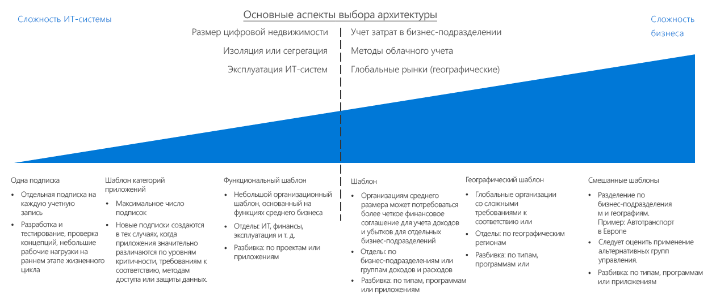
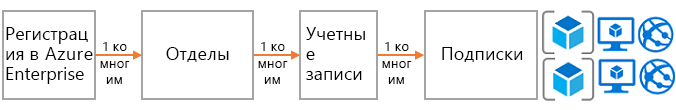
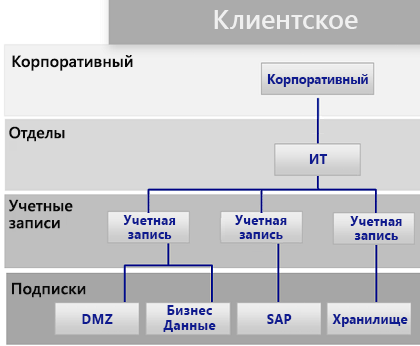
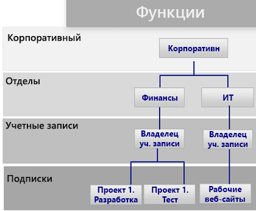
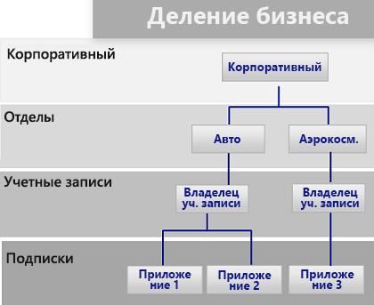
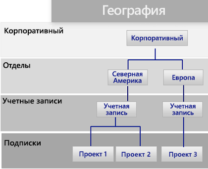

# Руководство по выбору модели подписки

В основе всех облачных платформ лежит базовая модель владения, которая предоставляет организациям разнообразные возможности для выставления счетов и управления. Используемая в Azure структура отличается от тех, которые предлагают другие поставщики облачных служб. Она предусматривает несколько вариантов применения организационной иерархии и прав владения сгруппированными подписками. В любом случае, как правило, один человек отвечает за выставление счетов, а другой назначается владельцем верхнего уровня для управления ресурсами.

Перейти к разделу: [Модели подписок и Соглашения Enterprise Azure](#subscriptions-design-and-azure-enterprise-agreements) | [Шаблоны моделей подписок](#subscription-design-patterns) | [Группы управления](#management-groups) | [Организация на уровне подписок](#organization-at-the-subscription-level)

Использование определенной модели подписок — одна из самых распространенных стратегий, которую компании применяют для упорядочения или структурирования ресурсов при внедрении облачных решений.

**Иерархия подписок**. *Подписка* — это логическая коллекция служб Azure (виртуальных машин, баз данных SQL, служб приложений и контейнеров). Каждый ресурс в Azure развертывается в одной подписке. Каждая подписка принадлежит одной *учетной записи* (пользователя или службы, что предпочтительнее), которая предоставляет доступ для выставления счетов и административных действий в рамках этой подписки. Клиентам, которые обязуются использовать определенный объем ресурсов Azure в рамках Соглашения Enterprise (EA), предоставляется еще один уровень управления, который называется *подразделением*. На портале EA Portal с помощью подписок, учетных записей и подразделений можно создать удобную иерархию для выставления счетов и управления.

Разные модели подписок отличаются по уровню сложности. При выборе модели подписки следует учитывать существующие линии разграничения, которые одновременно определяют бизнес-ограничения и ограничения, связанные с ИТ-технологиями. Прежде, чем принимать технические решения, ИТ-архитекторы и руководители должны проконсультироваться с заинтересованными представителями бизнеса и командой по вопросам облачной стратегии. Это поможет определить требуемый подход к учету облачных ресурсов, используемые в бизнес-подразделениях методы учета затрат, а также глобальные потребности рынка для организации.

**Линия разграничения**. Пунктирная линия на приведенном выше рисунке (над ссылками) разграничивает простые и более сложные шаблоны моделей подписок. Значительное влияние на модели подписок оказывают дополнительные точки принятия технических решений, предполагающие выбор размера цифровой инфраструктуры с учетом ограничений на подписки Azure, политик изоляции и разделения, а также операционных подразделений.

**Дополнительные рекомендации**. Выбирая модель подписки, важно помнить о том, что это не единственный способ группирования ресурсов или развертываний. Так как подписки были созданы еще на заре развития Azure, они наследуют ряд ограничений от прежних решений Azure, таких как диспетчер служб Azure.

Такие факторы, как структура развертывания, возможность автоматизации и наличие новых подходов к группированию ресурсов, также могут определять выбор модели подписки. Прежде чем принимать окончательное решение, определите то, как на ваш выбор влияет требование к [согласованности ресурсов](../resource-consistency/overview.md). Например, крупная транснациональная компания может сначала выбрать сложный шаблон управления подписками. Но через некоторое время может оказаться, что гораздо удобнее будет использовать более простой шаблон бизнес-подразделения, который позволяет создавать иерархию групп управления.

## Модели подписок и Соглашения Enterprise Azure

Все подписки Azure связаны с одной учетной записью, которая подключается к элементам управления верхнего уровня для выставления счетов и управления доступом для каждой подписки. Одна учетная запись может владеть несколькими подписками, обеспечивая базовый уровень упорядочения подписок.

Для небольших развертываний Azure одна подписка или их небольшой набор могут содержать все нужные облачные ресурсы. Но в крупных развертываниях Azure, скорее всего, потребуются несколько подписок, чтобы обеспечить соответствие организационной структуре и решить вопросы, связанные с [квотами и ограничениями подписок](/azure/azure-subscription-service-limits).

Каждое Соглашение Enterprise Azure предоставляет дополнительную возможность упорядочить подписки и учетные записи, используя иерархии, которые отражают организационные приоритеты. Соглашение о регистрации Enterprise для вашей организации определяет структуру и способ использования служб Azure в вашей компании в контексте контракта. Каждое Соглашение Enterprise позволяет дополнительно разделить окружение на подразделения, учетные записи и подписки в соответствии со структурой вашей организации.

## Конструктивные шаблоны подписок

Все организации отличаются друг от друга. Поэтому иерархия "подразделение — учетная запись — подписка", реализованная в Соглашении Enterprise Azure, позволяет очень гибко упорядочивать ресурсы Azure. Создание иерархии, отражающей потребности компании в выставлении счетов, управлении ресурсами и доступе к ресурсам, является первым и самым важным решением, которое следует принять, когда вы только начинаете работать с общедоступным облаком.

Следующие шаблоны подписок расположены в порядке возрастания сложности, требуемой для поддержки потенциальных организационных приоритетов.

### Одна подписка

Одна подписка на учетную запись может оказаться достаточным решением для организаций, которым нужно небольшое количество облачных ресурсов. Часто этот шаблон реализуется в самом начале внедрения облачных решений. Он позволяет создавать небольшие развертывания для экспериментов или подтверждения концепций при изучении возможностей облачной платформы.

Но в шаблоне одной подписки действуют технические ограничения на количество поддерживаемых ресурсов. По мере увеличения облака есть смысл упорядочить ресурсы так, чтобы упростить применение политик и контроль доступа таким способом, который может не поддерживаться при использовании одной подписки.

### Шаблон категории приложений

С ростом облака в организации повышается потребность в использовании нескольких подписок. В этом сценарии подписки обычно создаются для приложений с фундаментальными отличиями в таких аспектах, как уровень важности для бизнеса, требования к обеспечению соответствия, элементы управления доступом и потребности в защите данных. Подписки и учетные записи, которые поддерживают эти категории приложений, группируются в одно подразделение, которым владеют сотрудники центрального ИТ-отдела.

Каждая организация выберет свой вариант классификации приложений, но чаще всего подписки будут разделяться по определенным приложениям, службам или типам приложений. Рабочие нагрузки, для которых может требоваться использование отдельных подписок в рамках этого шаблона, включают следующее:

- экспериментальные приложения или приложения с низким уровнем риска;
- приложения с защищенными данными;
- критически важные рабочие нагрузки;
- приложения, для которых действуют нормативные требования (например, HIPAA или FedRAMP);
- рабочие нагрузки пакетной службы;
- рабочие нагрузки для обработки больших данных, например Hadoop;
- контейнерные рабочие нагрузки с оркестраторами развертывания, например Kubernetes;
- рабочие нагрузки аналитики.

Этот шаблон позволяет назначить несколько владельцев учетных записей, ответственных за определенные рабочие нагрузки. Этот шаблон не позволяет создавать более сложные структуры на уровне подразделения в иерархии Соглашения Enterprise, поэтому реализация Соглашения Enterprise Azure не требуется.

### Функциональной шаблон

Этот шаблон позволяет упорядочить подписки и учетные записи по функциональной принадлежности. Например, вы можете разделить такие направления, как финансы, продажи или ИТ-поддержка, на основе иерархии "предприятие — подразделение — учетная запись — подписка", которая предоставляется клиентам в рамках Соглашения Enterprise Azure.

### Шаблон бизнес-подразделений

Этот шаблон группирует подписки и учетные записи по категориям прибыли и убытка, бизнес-подразделений, отделов, центров прибыли или аналогичных бизнес-структур на основе иерархии Соглашения Enterprise Azure.

### Географической шаблон

Этот шаблон подходит для организаций, действующих на глобальном уровне. Он группирует подписки и учетные записи по географическим регионам на основе иерархии Соглашения Enterprise Azure.

### Смешанные шаблоны

Иерархия "предприятие — подразделение — учетная запись — подписка". Вы всегда можете объединить несколько шаблонов, например географические шаблоны и шаблоны бизнес-подразделений, чтобы структура точнее соответствовала сложным схемам выставления счетов и организационным структурам вашей компании. Кроме того, организационная структура и структура управления, определяемая моделью подписки, могут дополнительно расшириться в зависимости от выбора [модели согласованности ресурсов](../resource-consistency/overview.md).

Группы управления, описанные в следующем разделе, позволяют использовать более сложные организационные структуры.

 

## Группы управления

Кроме структуры подразделений и организационной структуре, которые предоставляются в рамках Соглашения Enterprise, вы можете использовать [группы управления Azure](/azure/governance/management-groups/index) для повышения гибкости организационной политики, контроля доступа и соответствия требованиям в разных подписках. Группы управления поддерживают до шести уровней вложений, позволяя создавать иерархию, не связанную с иерархией выставления счетов. Это решение удобно использовать исключительно для эффективного управления ресурсами.

Группы управления могут дублировать иерархию выставления счетов, и многие предприятия начинают именно с этого. Впрочем, основное преимущество групп управления проявляется при их использовании в сценариях, когда связанные подписки, независимо от их положения в иерархии выставления счетов, группируются вместе с последующим назначением общих ролей, а также политик и инициатив.

Примеры приведены ниже.

- Рабочие и нерабочие подписки. Некоторые предприятия создают группы управления для определения их рабочих и нерабочих подписок. Группы управления позволяют клиентам легко управлять ролями и политиками. Например, при использовании нерабочей подписки у разработчиков будет доступ на уровне роли "Участник", но в рабочей среде им будет предоставлен только доступ на уровне "Читатель".
- Внутренние службы и внешние службы. Как и в случае с рабочими и нерабочими подписками, требования, политики и роли предприятий для внутренних и внешних (предназначенных для клиентов) служб отличаются.

## Организация на уровне подписки

Определяя подразделения и учетные записи (или группы управления), вам в первую очередь нужно решить, как будет разделено окружение Azure в соответствии с требованиями вашей организации. При этом именно на уровне подписок будет выполняться основная работа, поэтому ваши решения повлияют на такие аспекты, как безопасность, масштабируемость и выставление счетов.

Используйте в качестве основы следующие шаблоны:

- **Приложение или служба**. Подписки представляют приложение или службу (портфель приложений).

- **Жизненный цикл**. Подписки представляют жизненный цикл службы, например рабочий этап или этап разработки.

- **Подразделение**. Подписки представляют подразделения организации.

Первые два шаблона являются самыми распространенными, и мы настоятельно рекомендуем их использовать. Шаблон "Жизненный цикл" подходит для большинства организаций. Для этого варианта мы рекомендуем назначить две базовые подписки: для рабочей и нерабочей сред. А для дальнейшего разделения следует использовать группы ресурсов.

Общие сведения об использовании подписок и групп ресурсов в Azure для группировки и ресурсов и управления ими см. в руководстве по [управлению доступом к ресурсам в Azure](../../getting-started/azure-resource-access.md).

## Дополнительная информация

Узнайте, как службы идентификации используются для контроля доступа и управления в облаке.

> [!div class="nextstepaction"]
> [Идентификация](../identity/overview.md)
