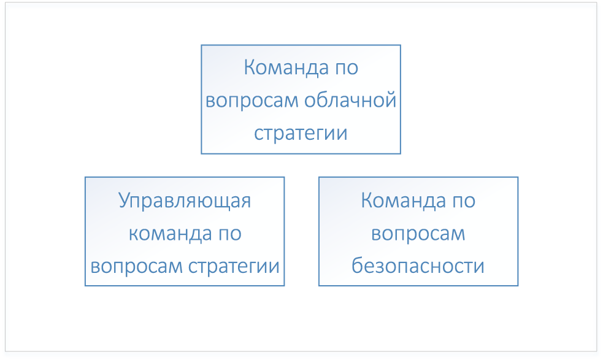
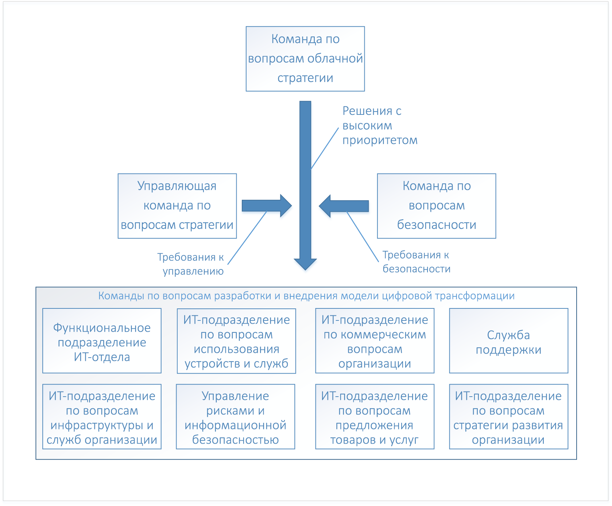

# Внедрение облачных решений в организации: начало работыEnterprise Cloud Adoption: Getting started 

**Цифровая трансформация** и переход на облачные вычисления подразумевают замену локальной инфраструктуры облачной платформой.The **digital transformation** to cloud computing represents a shift from operating on-premises to operating in the cloud. Такой переход связан с изменениями в бизнес-модели организации, например с сокращением капитальных расходов на закупку ПО и оборудования для центров обработки данных и наращиванием операционных затрат на облачные ресурсы.This shift includes new ways of doing business - for example, the digital transformation shifts from capital expenditures for software and datacenter hardware to operating expenditures for usage of cloud resources. 

## Процесс цифровой трансформацииDigital transformation: process

Для успешного внедрения облачных технологий организации необходимо подготовить свою организационную структуру, персонал и бизнес-процессы к цифровой трансформации.To be successful in adopting the cloud, an enterprise must prepare its organization, people, and processes to be ready for this digital transformation. Организационные структуры различных компаний неодинаковы, поэтому не существует универсального подхода к подготовке организации к цифровой трансформации.Every enterprise's organizational structure is different, so there is no one-size-fits-all approach to organizational readiness. В этом документе описываются меры общего характера для подготовки организации.This document outlines the high-level steps your enterprise can take to get ready. Немало времени потребуется на подготовку подробного плана реализации каждого из описанных здесь этапов.Your organization will have to spend time developing a detailed plan to accomplish each of the listed steps.

Общий процесс цифровой трансформации включает следующие шаги:The high-level process for the digital transformation is:

1. Формируется команда по вопросам облачной стратегии.Create a cloud strategy team. Эта команда будет руководить процессом цифровой трансформации.This team is responsible for leading the digital transformation. На этом этапе также важно сформировать команду руководителей и команду по вопросам безопасности цифровой трансформации.It's also important at this stage to form a governance team and a security team for the digital transformation.
2. Члены команды по вопросам облачной стратегии изучают новые возможности облачных решений и различия между ними.Members of the cloud strategy team learn what's new and different about cloud technologies.  
3. В рамках подготовки организации команда по вопросам облачной стратегии создает экономическую модель цифровой трансформации, готовит перечень существующих недочетов в бизнес-стратегии и концептуальные решения для их устранения.The cloud strategy team prepares the enterprise by building the business case for digital transformation - enumerates all the current gaps in business strategy and determines the high-level solutions to eliminate them.
4. Предлагаемые концептуальные решения согласуются с бизнес-группами.Align high-level solutions with business groups. В бизнес-группах назначаются лица, ответственные за разработку и внедрение каждого из решений.Identify stakeholders in each business group to own the design and implementation for each solution.
5. Существующие должности, навыки и процессы преобразуются с учетом особенностей работы в облаке.Translate existing roles, skills and process to include cloud roles, skills, and process.  
<!--6. Develop processes for operating in the cloud to make solutions more robust in terms of availability, resiliency, and security. 
7. Optimize solutions for performance, scalability, and cost efficiency.-->

## Шаг 1. Формирование команды по вопросам облачной стратегииStep 1: create a cloud strategy team

На первом этапе цифровой трансформации организации необходимо привлечь руководителей различных бизнес-подразделений к процессу создания команды по вопросам облачной стратегии.The first step in your enterprise's digital transformation is engaging business leaders from across the organization to create a cloud strategy team (CST). В состав этой команды должны войти руководители финансового отдела, ИТ-отдела и подразделений по разработке приложений.This team consists of business leaders from finance, IT infrastructure, and application groups. Эта команда будет полезна на этапе анализа облачных решений и экспериментальном этапе.These teams can help with the cloud analysis and experimentation phase.

Возглавить команду по вопросам облачной стратегии может, к примеру, технический директор организации, а войти в ее состав — представители подразделений по вопросам архитектуры, финансов в ИТ, старший технический персонал из различных подразделений по разработке приложений (отдела управления персоналом, финансов и т. д.), а также руководители команд по вопросам инфраструктуры, безопасности и сетей.For instance, a Cloud Strategy Team could be driven by the CTO and consist of members of the enterprise architecture team, IT finance, senior technologists from various IT applications groups (HR, finance, and so on), and leaders from the infrastructure, security, and networking teams.  

Также важно сформировать две другие команды высшего уровня, отвечающие за вопросы управления и безопасности.It's also important to form two other high-level teams: a governance team, and a security team. Они будут обеспечивать проектирование, реализацию и постоянный мониторинг соблюдения политик в сфере управления и безопасности.These teams are responsible for designing, implementing, and the ongoing audit of the enterprise's governance and security policies. Управляющую команду необходимо сформировать из специалистов с опытом в сфере защиты ресурсов, управления затратами, реализации групповых политик и смежных областей.The governance team requires members that have worked with asset protection, cost management, group policy and related topics. В состав команды по вопросам безопасности должны войти эксперты, хорошо ориентирующиеся в современных отраслевых стандартах безопасности, а также требованиях к безопасности, предъявляемых самой организацией.The security team requires members that are well versed in current industry security standards as well as the enterprise's security requirements.

Управляющая команда отвечает за разработку и внедрение модели управления организацией в облаке, а также за развертывание и обслуживание совместно используемых ресурсов инфраструктуры, задействованных в процессе цифровой трансформации.The governance team is responsible for designing and implementing the enterprise's governance model in the cloud, as well as deploying and maintaining the shared infrastructure assets that are part of the digital transformation. К этим ресурсам относится оборудование, программное обеспечение и облачные средства, необходимые для подключения локальной инфраструктуры организации к виртуальной сети в облаке.These assets include hardware, software, and cloud resources necessary to connect the on-premises network to virtual networking in the cloud.

Команда по вопросам безопасности отвечает за разработку и реализацию корпоративной политики безопасности в облаке и координирует свои действия с управляющей командой.The security team is responsible for designing and implementing the enterprise's security policy in the cloud, working closely with the governance team. Команда по вопросам безопасности обеспечивает расширение периметра безопасности локальной сети, в который должна войти виртуальная сеть организации в облаке.The security team owns the extension of the security boundary of the on-premises network to include virtual networking in the cloud. К числу возможных шагов в этом направлении относится установка и обслуживание брандмауэров для фильтрации входящего и исходящего трафика в облачной виртуальной сети, а также предотвращение несанкционированного развертывания ресурсов с помощью соответствующих политик и средств.This may take the form of owning and maintaining the inbound and outbound firewalls on the cloud virtual network as well as ensuring that tools and policy prevent the deployment of unauthorized resources.

## Шаг 2. Изучение новых возможностей облакаStep 2: learn what's new in the cloud
 
В рамках следующего шага на пути цифровой трансформации организации команда по вопросам облачной стратегии должна выяснить, как изменятся бизнес-процессы организации в результате применения облачных технологий.The next step in your enterprise's digital transformation is for the members of the cloud strategy team to learn about how cloud technology will change the way the enterprise does business. Это подразумевает подготовку к изменениям в организационной, кадровой и технологической сферах и планирование таких изменений.This is preparation and planning for the changes to your business, people, and technology. Члены команды по вопросам облачной стратегии должны хорошо понимать новые возможности и преимущества использования облака по сравнению с локальными ИТ-решениями.It's important for the members of the cloud strategy team to understand what's new and different in the cloud as compared to on-premises.

Чтобы получить общее представление об этих преимуществах, для начала можно ознакомиться с [принципами работы Azure](what-is-azure.md).The starting point for understanding the cloud is learning [how Azure works](what-is-azure.md) at a high level. Затем изучите основы [управления ресурсами Azure](what-is-governance.md), прежде чем осваивать [управление доступом к ресурсам](azure-resource-access.md).Next, learn about the basics of [governance in Azure](what-is-governance.md) in preparation for [understanding resource access management](azure-resource-access.md).

Для углубленного обучения члены управляющей команды могут ознакомиться с материалами раздела, посвященного системе управления.For advanced learning, the governance team should review the concepts and design guides in the governance section of the table of contents. Разделы об инфраструктуре и рабочих нагрузках посвящены типовым архитектурным решениям и рабочим нагрузкам в облаке.The infrastructure and workloads sections are useful for learning about typical architectures and workloads in the cloud.

## Шаг 3. Определение недочетов в бизнес-стратегииStep 3: identify gaps in business strategy

На этом этапе команда по вопросам облачной стратегии готовит список задач, решить которые поможет цифровая трансформация.The next step is for the cloud strategy team to enumerate the business problems that require a digital transformation solution. Например, оборудование локального центра обработки данных исчерпало свой эксплуатационный ресурс и требует замены.For example, an enterprise may have an existing on-premises data center with end-of-life hardware that requires replacement. Или компания не поспевает за конкурентами при выводе на рынок своих новых продуктов и услуг.In another example, an enterprise may be experiencing difficulty with time-to-market for new features and services and may be falling behind to competition. Такие недочеты определяют *цели* цифровой трансформации.These gaps represent the *goals* of your enterprise's digital transformation.

Недочеты в бизнес-стратегии можно разделить на такие категории:Gaps in business strategy can be classified into the following categories:

|КатегорияCategory|ОПИСАНИЕDescription|
|-----|-----|
|управления затратами;Cost management|Несовершенная схема оплаты за технологические решения.Represents a gap in the way the Enterprise pays for technology.|
|Система управленияGovernance|Несовершенство используемых организацией процессов для защиты своих ресурсов от ненадлежащего использования, что может приводить к перерасходу бюджета, проблемам с безопасностью или соответствием нормативным требованиям.Represents a gap in the processes used by the Enterprise to protect its assets from improper usage that might result in cost overruns, security issues, or compliance issues. | 
|Соответствие нормативным требованиямCompliance|Недочеты при соблюдении организацией собственных внутренних правил и политик, а также законодательных требований, норм и стандартов.Represents a gap in the way the enterprise adheres to its own internal processes and policies as well as external laws, regulations, and standards. |
|БезопасностьSecurity|Несовершенный способ защиты организацией своих технологических и информационных активов от внешних угроз.Represents a gap in the way the enterprise protects its technology and data assets from external threats. |
|Управление даннымиData governance|Несовершенный способ управления данными в организации, в особенности данными клиентов.Represents a gap in the way an enterprise manages its data, especially customer data. Так, "Общий регламент по защите данных" Европейского Союза предъявляет строгие требования к защите данных клиентов, что может потребовать закупки нового оборудования и программного обеспечения.For example, new General Data Protection Regulation (GDPR) in the European Union has strict requirements for the protection of customer data that may require new hardware and software.|    

Классифицировав все недочеты корпоративной стратегии по этим категориям, можно приступать к поиску концептуального решения по устранению каждого из этих недочетов.Once your enterprise has classified all business strategy gaps into these categories, the next step is to determine a high-level solution for each problem.

В таблице ниже приведены примеры таких решений.The following table illustrates several examples:

|Недочет в корпоративной стратегииBusiness strategy gap|Категория &nbsp; &nbsp; &nbsp; &nbsp; &nbsp;Category &nbsp; &nbsp; &nbsp; &nbsp; &nbsp;|Решение &nbsp;&nbsp;&nbsp;&nbsp;&nbsp;&nbsp;&nbsp;&nbsp;&nbsp;&nbsp;&nbsp;&nbsp;&nbsp;&nbsp;Solution &nbsp;&nbsp;&nbsp;&nbsp;&nbsp;&nbsp;&nbsp;&nbsp;&nbsp;&nbsp;&nbsp;&nbsp;&nbsp;&nbsp;|
|-----|-----|-----|
| У локально размещенных служб возникают проблемы с доступностью, устойчивостью и масштабируемостью во время пиков спроса, на которые приходится порядка 10% от общего времени их работы.Services currently hosted on-premises experience issues with availability, resiliency, and scalability during time of peak demand, which is approximately ten percent of usage. Исчерпан эксплуатационный ресурс серверов центра обработки данных.Servers in on-premises datacenter are end-of-life. ИТ-отдел организации рекомендует приобрести новое оборудование для локального центра обработки данных, способное справляться с пиковыми нагрузками.Enterprise IT recommends purchasing new on-premises hardware for datacenter with specifications to handle peak demand.| управления затратами;Cost management | Перенос затронутых локальных рабочих нагрузок в масштабируемое облако с оплатой за фактическое использование.Migrate affected existing on-premises workloads to scalable resources in the cloud, paying for usage only. |
| Согласно законодательным и нормативным требованиям к управлению внешними данными организация должна внедрить ряд средств контроля, предусматривающих шифрование неактивных данных, что потребует закупки нового оборудования и программного обеспечения.External data management laws and regulations require the enterprise to adhere to set of standard controls that require encryption of data at rest, requiring new hardware and software. | Управление даннымиData governance | Перенос данных в облако и использование функции шифрования неактивных данных Службы хранилища Azure.Move data to Azure storage service encryption for data at rest. |
| Общедоступные службы, размещенные в локальном центре обработки данных, подвергаются DDoS-атакам.Services hosted in on-premises datacenter been experiencing distributed denial of service (DDoS) attacks on public-facing services. Сдерживать эти атаки проблематично, так как для этого требуется закупка нового оборудования и программного обеспечения, а также привлечение новых специалистов по безопасности.The attacks are difficult to mitigate and require new hardware, software, and security personnel to deal with effectively. | БезопасностьSecurity | Перенос служб в Azure и использование функции защиты от DDoS-атак.Migrate services to Azure, and take advantage of Azure DDoS protection.|

Составив список недочетов в бизнес-стратегии и решений для их устранения, необходимо определить приоритеты по пунктам этого списка.When all of the gaps in business strategy have been enumerated and high-level solutions have been determined, prioritize the list. Сделать это можно путем сопоставления недочетов корпоративной стратегии с краткосрочными и долгосрочными целями организации в каждой категории.The list can be prioritized by aligning the business strategy gaps with the enterprise's short and long-term goals in each category. Так, если организация стремится сократить расходы на ИТ в течение следующих двух финансовых кварталов, то приоритет недочетов в категории "*Управление затратами*" может определяться ожидаемой экономией затрат, обеспечиваемой каждым решением.For example, if the enterprise has a short-term goal to reduce IT spend in the next two fiscal quarters, the business gaps in the *cost management* category may be prioritized by the projected cost saving associated with each.

В итоге получится упорядоченный список концептуальных решений по бизнес-категориям.The output of this process is a stack-ranked list of high-level solutions aligned with business categories. 

## Шаг 4. Согласование концептуальных решений с бизнес-группамиStep 4: align high-level solutions with business groups to design solutions 

Когда будут определены цели цифровой трансформации, обозначены их приоритеты и предложены концептуальные решения, команда по вопросам облачной стратегии должна согласовать каждое из предложенных решений с командами по разработке и внедрению для каждой бизнес-группы.Now that the goals of the digital transformation have been enumerated, prioritized, and high-level solutions proposed, the next step is for the cloud strategy team to align each of the high-level solutions with design and implementation teams in each of the business groups. 

Команды знакомятся с перечнем и анализируют предложенные решения для их последующего проектирования.The teams take the prioritized lists and work through each high-level solution to design each solution. Процесс проектирования предусматривает подготовку спецификации новой инфраструктуры и новых рабочих нагрузок.The design process will involve the specification of new infrastructure and new workloads. Также могут потребоваться изменения в должностях сотрудников и рабочих процессах.There may also be changes to the roles of the people and the processes they follow. На этом этапе необходимо, чтобы каждый проект проверялся представителями управляющей команды и команды по вопросам безопасности.It's also extremely important at this stage for each of the design teams to include both the governance and security teams for review of each design. Проекты должны соответствовать требованиям политики и процедур, утвержденных управляющей командой и командой по вопросам безопасности, а представители этих команд должны участвовать в окончательном утверждении каждого проекта.Each design must fall within with the policies and procedures defined by the governance and security teams, and these teams must be included in the final sign off of each design.

Задача проектирования решений усложняется тем, что все проекты должны рассматриваться комплексно, с учетом других проектов решений от других команд.The design of each solution is a non-trivial task and as designs are created, must be considered in context with other solution designs from other teams. Например, если несколько проектов предусматривают перенос локально размещенных приложений и служб в облако, возможно, было бы рационально объединить их и разработать для них общую стратегию миграции.For example, if several of the designs result in a migration of existing on-premises applications and services to the cloud, it may be more efficient to group these together and design an overall migration strategy. Или некоторые локальные приложения и службы, которые невозможно перенести в облако, можно заменить новыми решениями или службами сторонних поставщиков.In another example, it may not be possible to migrate some existing on-premises applications and services and the solution may be to replace them with either new development or third-party services. Такие приложения и службы целесообразно сгруппировать и исследовать на предмет дублирования их функций, чтобы рассмотреть возможность использования одной сторонней службы вместо нескольких решений.In this case, it may be more efficient to group these together and determine the overlap between them to determine if a third-party service can be used for more than one solution.

По окончании проектирования решений команда приступает к внедрению каждого из них.Once the design of the solution is complete, the team moves on to the implementation phase for each design. Внедрение может осуществляться по стандартной схеме управления проектом.The implementation phase for each solution design can be run using standard project management processes.

## Шаг 5. Преобразование существующих должностей, навыков и процессов с учетом особенностей работы в облакеStep 5: translate existing roles, skills, and process for the cloud

На всех этапах развития ИТ-отрасли наиболее значительные преобразования, как правило, сопровождаются изменениями в функциональных обязанностях сотрудников.At each evolutionary phase during the history of the IT industry, the most notable industry changes are often marked by changes in staff roles. Так, при переходе с мейнфреймов на модель "клиент — сервер" должность оператора компьютера практически исчезла, а ей на смену пришла должность системного администратора.During the transition from mainframes to the client/server model, the role of the computer operator largely disappeared, replaced by the system administrator. С наступлением эры виртуализации потребность в специалистах по работе с физическими серверами сменилась спросом на экспертов по виртуализации.When the age of virtualization arrived, the requirement for individuals working with physical servers diminished, replaced with a need for virtualization specialists. С переходом организаций на облачные вычисления, похоже, неизбежны очередные перемены в функциональных обязанностях.Similarly, as institutions shift to cloud computing, roles will likely change again. Например, на смену специалистам центров обработки данных могут прийти облачные финансовые аналитики.For example, datacenter specialists might be replaced with cloud financial analysts. Даже в тех случаях, когда названия должностей сохранились, обязанности таких сотрудников существенно изменились.Even in cases where IT job titles have not changed, the daily work roles have evolved significantly. 

Сотрудники ИТ-отдела могут испытывать беспокойство по поводу своей работы, понимая, что для обслуживания облачных решений понадобятся новые навыки.IT staff members may feel anxious about their roles and positions as they realize that a different set of skills is needed for the support of cloud solutions. Но прогрессивным сотрудникам, интересующимся облачными технологиями, не стоит беспокоиться.But agile employees who explore and learn new cloud technologies don’t need to have that fear. Такие сотрудники могут возглавить процесс перехода на облачные службы и помочь сотрудникам организации понять и принять связанные с этим изменения.They can lead the adoption of cloud services and help the organization understand and embrace the associated changes. 

### Регистрация опасенийCapturing concerns

В ходе цифровой трансформации все команды должны регистрировать любые опасения сотрудников в этой связи.During the digital transformation, each team should capture any staff concerns as they arise. При регистрации опасений необходимо выяснить следующее:When capturing concerns, identify the following: 
* Характер опасений.The type of concern. Например, сотрудники могут противиться изменениям в их должностных обязанностях, связанных с цифровой трансформацией.For example, workers may be resistant to the changes in job duties that accompany the digital transformation.
* Последствия опасений, для устранения которых не были приняты меры.The impact of the concern if it is not addressed. Например, неприятие цифровой трансформации может привести к саботажу реализации необходимых изменений среди сотрудников.For example, resistance to the digital transformation may be result in workers being slow to execute the changes necessary. 
* Направление деятельности, способствующее устранению опасений.The area equipped to address the concern. К примеру, если сотрудники ИТ-отдела не желают приобретать новые навыки, более подходящим для решения этой задачи может оказаться отдел, обслуживаемый отделом ИТ.For example, if workers in the IT department are reluctant to acquire new skills, the IT stakeholder's area is best equipped to address this concern. Направление деятельности, в котором возникают опасения, иногда очевидно. В таких может потребоваться вмешательство вышестоящего руководства.Identifying the area may be clear for some concerns, and in these cases you may need to escalate to executive leadership. 

### Определение пробеловIdentify gaps

Еще один аспект преодоления препятствий на пути цифровой трансформации организации — выявление **пробелов**.Another aspect of working through the issues with your enterprise's digital transformation is identifying **gaps**. Пробел — это должность, навык или процесс, отсутствующие в организации, но необходимые для ее цифровой трансформации.A gap is a role, skill, or process required for your digital transformation that does not currently exist in your enterprise. 

Начните с составления списка новых функциональных обязанностей, востребованных в связи с цифровой трансформацией, уделяя внимание как новым, так и старым, уже ненужным должностным обязанностям.Begin by enumerating the new responsibilities that accompany the digital transformation, with an emphasis on new responsibilities and current responsibilities to be retired. Определите направления деятельности, соответствующие различным должностным обязанностям.Identify the area that is aligned with each responsibility. Определите также, в какой мере новые функциональные обязанности соответствуют направлениям деятельности.For new responsibilities, determine how closely aligned it is with the area. Некоторые обязанности могут охватывать несколько направлений, что дает возможность лучше их согласовать. Как и в случае опасений, эту информацию следует зафиксировать.Some responsibilities may span several areas, and this represents an opportunity for better alignment that should be captured as a concern. Если обнаружено направление деятельности, за которое никто не отвечает, это обстоятельство регистрируется как пробел.In the case where no area is identified as being responsible, capture this as a gap.

Далее следует определить навыки, необходимые для выполнения должностных обязанностей.Next, identify the skills necessary to support the responsibility. Выясните, есть ли в вашей организации сотрудники с требуемыми навыками.Determine if your enterprise has existing resources with these skills. Если их нет, определите необходимые программы обучения или требования для поиска новых сотрудников.If there are no existing resources, determine what training programs or talent acquisition is necessary. Установите срок, в течение которого необходимо заполнить вакансии, чтобы цифровая трансформация проходила по плану.Determine the time frame by which the responsibility must be supported to keep your digital transformation on track.

Наконец, создайте должности с соответствующими функциональными обязанностями.Finally, identify the roles that will execute these skills. Некоторые функциональные обязанности можно поручить существующим сотрудникам, тогда как для других придется учреждать новые должности.Some of your existing workforce will assume parts of the role, and in other cases an entirely new role may be necessary. 

### Взаимосвязь между командамиPartner across teams

Навыки, необходимые для восполнения пробелов в ходе цифровой трансформации, обычно не ограничиваются рамками какой-либо одной должности или даже целого отдела.The skills necessary to fill the gaps in your organization's digital transformation will typically not be confined to a single role, or even a single department. Между навыками существуют взаимосвязи и зависимости, которые могут охватывать несколько должностей, причем это могут быть должности из разных отделов.Skills will have relationships and dependencies that can span a single role or multiple roles, and those roles may exist in several departments. Например, владельцу рабочей нагрузки может потребоваться сотрудник из ИТ-отдела для подготовки основных ресурсов, например подписок и групп ресурсов.For example, a workload owner may require someone in an IT role to provision core resources such as subscriptions and resource groups.

Такие зависимости — это новые процессы, которые нужно внедрить в вашей организации, чтобы обеспечить взаимодействие между должностями.These dependencies represent new processes that your organization implements to manage the workflow between roles. В этом примере наладить бизнес-процесс, т. е. взаимодействие между сотрудниками разных отделов, можно различными способами.In the above example, there are several different types of process that can support the relationship between the workload owner and the IT role. Например, можно разработать специальный инструмент для управления рабочим процессом или попросту создать шаблон сообщения электронной почты.For example, a workflow tool can be created to manage the process, or, a simple email template can be used.

Отслеживайте такие зависимости и регистрируйте сведения о том, какие процессы с ними связаны и существуют ли такие процессы вообще.Track these dependencies and make note of the processes that will support them, and whether or not the process currently exists. Если процесс предусматривает использование специального инструмента, установите срок для его развертывания и согласуйте этот срок с общим планом цифровой трансформации.For process that require tooling, ensure that the timeline for deploying any tools aligns with the overall digital transformation schedule.

## Дополнительная информацияNext steps

Цифровая трансформация — это итеративный процесс, и с каждой его итерацией растет эффективность осуществляющих трансформацию команд.The digital transformation is an iterative process, and with each iteration the teams involved will become more efficient. 

> [!div class="nextstepaction"]
> [Принцип работы AzureUnderstand how Azure works](what-is-azure.md)