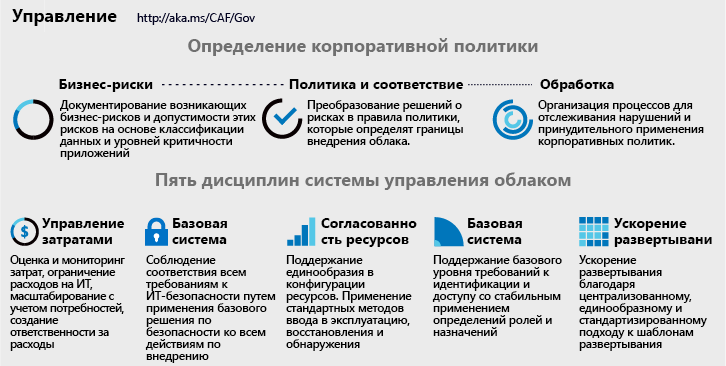

# Реализация стратегии управления облаком

<!-- markdownlint-disable MD033 -->

<ul class="panelContent cardsI">
<li style="display: flex; flex-direction: column;">
    

        

            

                

Любое изменение бизнес-процессов или технологических платформ создает риск для бизнеса. Перед командами управления облаком, членов которых иногда называют хранителями облачных сред, стоит задача снижения этих рисков с минимальным вмешательством в усилия по внедрению или внедрению инноваций.  Тем не менее управление облаком требует не только технической реализации. Незначительные изменения в корпоративной концепции или корпоративной политике могут существенно повлиять на внедрение. Перед внедрением важно не ограничиваться ИТ-ресурсами, а определять корпоративную политику.  
                

            

        

    

</li>
<li style="display: flex; flex-direction: column;">
    <a href="../_images/operational-transformation-govern-highres.png" style="display: flex; flex-direction: column; flex: 1 0 auto;">
        

            

                

                    

 
<i>Рис. 1. Схема корпоративной политики и пяти дисциплин управления облаком</i>
                    

                

            

        

    </a>
</li>
</ul>

<!-- markdownlint-enable MD033 -->

## Определение корпоративной политики

Определение корпоративной политики направлено на выявление и снижение бизнес-рисков, независимо от облачной платформы. Работоспособная стратегия управления облаком начинается с обоснованной корпоративной политики. Следующий трехэтапный процесс направляет последовательную разработку таких политик.

<!-- markdownlint-disable MD033 -->

<ul  class="panelContent cardsF">
<li style="display: flex; flex-direction: column;">
    <a href="./policy-compliance/understanding-business-risk.md" style="display: flex; flex-direction: column; flex: 1 0 auto;">
        

            

                

                    

                        

                            
                        

                    

                    

                        <h3>Бизнес-риск</h3>
                        
Изучите текущие планы внедрения облачных вычислений и классификации данных, чтобы определить риски для бизнеса. Работайте с бизнесом, чтобы сбалансировать риски и снизить затраты.

                    

                

            

        

    </a>
</li>
<li style="display: flex; flex-direction: column;">
    <a href="./policy-compliance/define-policy.md" style="display: flex; flex-direction: column; flex: 1 0 auto;">
        

            

                

                    

                        

                            
                        

                    

                    

                        <h3>Политика и соответствие требованиям</h3>
                        
Оцените допустимость риска, чтобы информировать о минимально агрессивных политиках, которые управляют внедрением облака и снижают риски. В некоторых отраслях соблюдение требований сторонних производителей влияет на создание исходной политики.

                    

                

            

        

    </a>
</li>
<li style="display: flex; flex-direction: column;">
    <a href="./policy-compliance/processes.md" style="display: flex; flex-direction: column; flex: 1 0 auto;">
        

            

                

                    

                        

                            
                        

                    

                    

                        <h3>Процессы</h3>
                        
Темп внедрения и инновационная деятельность естественным образом приведет к нарушениям политики. Выполнение соответствующих процессов поможет в мониторинге и обеспечении соблюдения политики.

                    

                

            

        

    </a>
</li>
</ul>

<!-- markdownlint-enable MD033 -->

## Дополнительная информация

Надежная стратегия управления облаком начинается с понимания бизнес-рисков.

> [!div class="nextstepaction"]
> [How does business risk change in the cloud?](./policy-compliance/understanding-business-risk.md) (Изменения бизнес-риска в облаке)
