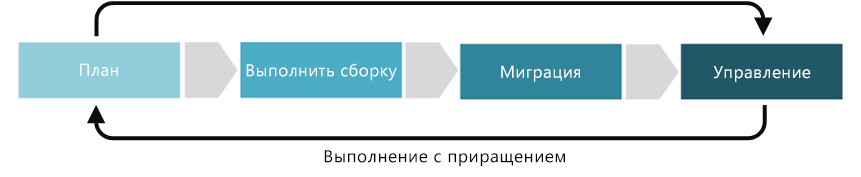

# Улучшения дисциплины "Базовая система идентификации"

Дисциплина "Базовая система идентификации" посвящена способам создания политик, гарантирующих согласованность и непрерывность идентификаторов пользователей независимо от поставщика облачных служб, который размещает приложение или рабочую нагрузку. В рамках пяти дисциплин управления облаком базовая система идентификации включает в себя решения в отношении [стратегии гибридной идентификации](../../decision-guides/identity/overview.md), оценки и расширения репозиториев идентификаторов, реализации единого входа, аудита и мониторинга несанкционированного использования или действий злоумышленников. В некоторых случаях она также может включать решения по модернизации, консолидации или интеграции нескольких поставщиков удостоверений.

В этой статье описаны задачи, которые компания может выполнить для развития и совершенствования дисциплины "Базовая система идентификации". Эти задачи можно разбить на этапы планирования, создания, внедрения и реализации облачного решения. Итеративное выполнение этих этапов позволяет разработать [инкрементальный подход к системе управления облаком](../journeys/overview.md#an-incremental-approach-to-cloud-governance).

*Рис. 1. Этапы внедрения инкрементального подхода к системе управления облаком.*

В одном документе невозможно учесть все требования всех компаний. Поэтому в этой статье описываются минимально требуемые и возможные действия для каждого этапа в процессе совершенствования системы управления. Начальной целью этих действий является создание [MVP политики](../journeys/overview.md#an-incremental-approach-to-cloud-governance) и разработка платформы для инкрементального развития этой политики. Команде управления облачными решениями необходимо решить, какие потребуются инвестиции в эти действия, чтобы улучшить возможности управления базовой идентификацией.

> [!CAUTION]
> Описанные в этой статье минимальные или возможные действия не согласованы с какими-либо корпоративными политиками или нормативными требованиями третьих сторон. Это руководство призвано облегчить обсуждения по согласованию обоих требований с моделью управления облаком.

## Планирование и готовность

На этом этапе зрелости системы управления ликвидируется разрыв между бизнес-показателями и стратегиями практических действий. В ходе этого процесса руководство определяет конкретные метрики, сопоставляет их с цифровыми ресурсами и начинает планирование общего процесса миграции.

**Минимальные рекомендуемые действия.**

* Оцените параметры [цепочки инструментов для идентификации](toolchain.md) и реализуйте гибридную стратегию, подходящую для вашей организации.
* Подготовьте черновой вариант рекомендаций по архитектуре и передайте его основным заинтересованным лицам.
* Проведите обучение и привлеките к участию людей и команды, на работу которых повлияет создание рекомендаций по архитектуре.

**Возможные действия.**

* Определите роли и назначения, которые будут регулировать управление идентификацией и доступом в облаке.
* Определите локальные группы и сопоставьте их с соответствующими облачными ролями.
* Составьте список поставщиков удостоверений (в том числе удостоверений, основанных на базах данных, используемых пользовательскими приложениями).
* Рассмотрите возможности консолидации или интеграции поставщиков удостоверений, в которых существует дублирование, чтобы упростить решение идентификации в целом.
* Оцените совместимость существующих поставщиков удостоверений с гибридным решением.
* Для поставщиков удостоверений, не совместимых с гибридными решениями, оцените варианты консолидации и замены.

## Сборка и предварительное развертывание

Для успешной миграции среды нужно выполнить ряд технических и нетехнических требований. Этот процесс нацелен на решения, подготовленность и базовую инфраструктуру, которые должны быть готовы до миграции.

**Минимальные рекомендуемые действия.**

* Проведите пилотное тестирование перед реализацией [цепочки инструментов для идентификации](toolchain.md) и убедитесь, что эти инструменты максимально упрощают взаимодействие с пользователем.
* Примените результаты проведения пилотных тестов перед развертыванием. Повторно выполняйте тесты, пока результаты не станут допустимыми.
* Подготовьте обновленный вариант рекомендаций по архитектуре (он должен включать планы по развертыванию и внедрению у пользователей) и передайте его ключевым заинтересованным лицам.
* Рассмотрите возможность создания программы ранних последователей и развертывания ее для ограниченного количества пользователей.
* Продолжайте обучать людей и команды, на работу которых повлияют рекомендации по архитектуре.

**Возможные действия.**

* Оцените логическую и физическую архитектуру и определите [стратегии гибридной идентификации](../../decision-guides/identity/overview.md).
* Сопоставьте политики управления доступом к идентификаторам, такие как назначения идентификатора для входа, и выберите соответствующий метод аутентификации для Azure AD.
  * Если настроена федерация, ограничьте доступ клиентов к административным учетным записям.
* Интегрируйте локальные и облачные каталоги.
* Рассмотрите возможность использования следующих моделей доступа:
  * модель [доступа с минимальными привилегиями](/windows-server/identity/ad-ds/plan/security-best-practices/implementing-least-privilege-administrative-models);
  * модель доступа по [идентификаторам с базовыми привилегиями](/azure/active-directory/privileged-identity-management/pim-configure).
* Подготовьте все данные до интеграции и просмотрите [рекомендации по идентификации](/azure/security/azure-security-identity-management-best-practices).
  * Включите единую идентификацию, единый вход (SSO) или простой единый вход.
  * Настройте многофакторную проверку подлинности для администраторов.
  * Консолидируйте или интегрируйте поставщики удостоверений, если это необходимо.
  * Реализуйте средства, необходимые для централизованного управления удостоверениями.
  * Включите JIT-доступ и оповещения об изменении ролей.
  * Проведите анализ рисков основных действий администратора, которые будут назначены встроенным ролям.
  * Рассмотрите возможность развертывания более строгой аутентификации для всех пользователей.
  * Включите модель JIT-доступа по идентификаторам с базовыми привилегиями (PIM) для дополнительных административных ролей.
  * Отделите учетные записи пользователей от учетных записей глобальных администраторов (чтобы администраторы случайно не открывали электронные письма и не запускали программы, связанные с учетной записью глобального администратора).

## Адаптация и миграция

Миграция представляет собой последовательный процесс перемещения, тестирования и внедрения приложений или рабочих нагрузок в существующих цифровых активах.

**Минимальные рекомендуемые действия.**

* Перенесите [цепочку инструментов для идентификации](toolchain.md) из среды разработки в рабочую среду.
* Подготовьте обновленный вариант рекомендаций по архитектуре и передайте его ключевым заинтересованным лицам.
* Разработайте обучающие материалы и документы, информационные сообщения, поощрения и другие программы, которые помогут пользователям освоиться.

**Возможные действия.**

* Проверьте правильность выполнения рекомендаций, определенных на этапах сборки и подготовки к развертыванию.
* Проверьте или уточните вашу [стратегию гибридной идентификации](../../decision-guides/identity/overview.md).
* Перед выпуском убедитесь, что каждое приложение или рабочая нагрузка соответствуют стратегии идентификации.
* Убедитесь, что единый вход (SSO) и простой единый вход работают правильно для ваших приложений.
* Уменьшите количество альтернативных хранилищ удостоверений или полностью устраните их, когда это возможно.
* Рассмотрите потребность в любых хранилищах удостоверений: в приложений и в базах данных. Удостоверения, не предоставляемые надлежащим поставщиком удостоверений (основных или сторонних), могут представлять риск для приложения и пользователей.
* Включите [условный доступ к локальным федеративным приложениям](/azure/active-directory/active-directory-device-registration-on-premises-setup).
* Распространите удостоверения в глобальных регионах в нескольких центрах с синхронизацией между регионами.
* Настройте федерацию централизованного управления доступом на основе ролей (RBAC).

## Эксплуатация и действия после реализации

Когда преобразование завершится, системы управления и эксплуатации должны сохраняться для поддержки естественного жизненного цикла приложений или рабочих нагрузок. Этот этап зрелости системы управления посвящен действиям, которые обычно следуют за внедрением решения, а цикл трансформации становится более стабильным.

**Минимальные рекомендуемые действия.**

* Настройте [цепочку инструментов для базовой идентификации](toolchain.md) в соответствии с меняющимися требованиями к идентификации в вашей организации.
* Автоматизируйте уведомления и отчеты, чтобы получать оповещения о потенциальных вредоносных угрозах.
* Реализуйте мониторинг и создание отчетов об использовании системы и прогрессе внедрения пользователями.
* Создайте отчеты по метрикам после развертывания и распространите их заинтересованным лицам.
* Скорректируйте рекомендации по архитектуре, чтобы управлять дальнейшими процессами внедрения.
* Обменивайтесь данными и периодически проводите обучение для задействованных команд, чтобы обеспечить соблюдение рекомендаций по архитектуре.

**Возможные действия.**

* Проводите периодические проверки политик удостоверений и проверки соответствия рекомендациям.
* Регулярно выполняйте поиск злоумышленников и нарушений безопасности данных, особенно мошенничества с идентификацией, таких как потенциальное получение доступа к учетной записи администратора.
* Настройте средство мониторинга и составления отчетов.
* Рассмотрите возможность более тесной интеграции с системами безопасности и предотвращения мошенничества.
* Регулярно проверяйте права доступа для пользователей или ролей с повышенными правами.
  * Идентифицируйте каждого пользователя, который имеет право активировать права администратора.
* Проверьте процессы подключения, отключения и обновления учетных данных.
* Изучите возрастающие уровни автоматизации и связи между модулями управления доступом к удостоверениям (IAM).
* Рассмотрите возможность реализации подхода "операции безопасности разработки" (DevSecOps).
* Выполните анализ влияния для оценки результатов затрат, безопасности и внедрения пользователями.
* Периодически создавайте отчет о влиянии, который отображает изменения в метриках, создаваемых системой, и оценивайте влияние [стратегии гибридной идентификации](../../decision-guides/identity/overview.md) на бизнес.
* Реализуйте интегрированный мониторинг, рекомендуемый [Центром безопасности Azure](/azure/security-center/security-center-intro).

## Дополнительная информация

Теперь, когда вы понимаете концепцию стратегии управления удостоверениями в облаке, изучите [цепочку инструментов для базовой идентификации](toolchain.md), чтобы выбрать наиболее подходящие средства и функции Azure, которые вам потребуются при развитии дисциплины управления базовой системы идентификации на платформе Azure.

> [!div class="nextstepaction"]
> [Цепочка инструментов для базовой идентификации в Azure](toolchain.md)