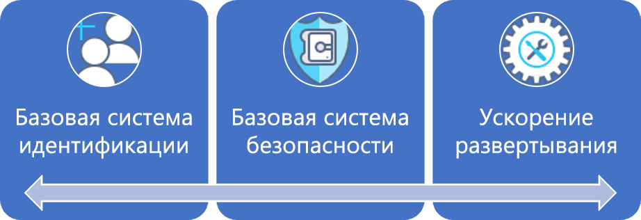
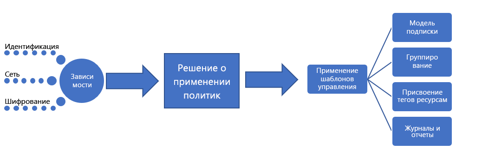

# Крупные предприятия. Описание лучших методикLarge enterprise: Best practice explained

Путь развития системы управления начинается с набора начальных [корпоративных политик](./initial-corporate-policy.md).The governance journey starts with a set of initial [corporate policies](./initial-corporate-policy.md). Эти политики используются для создания минимально жизнеспособного продукта (MVP) для системы управления, который соответствует [лучшим методикам](./overview.md).These policies are used to establish a minimum viable product (MVP) for governance that reflects [best practices](./overview.md).

В этой статье мы обсудим общие стратегии, необходимые для создания MVP управления.In this article, we discuss the high-level strategies that are required to create a governance MVP. Основой MVP управления является дисциплина [Ускорение развертывания](../../deployment-acceleration/overview.md).The core of the governance MVP is the [Deployment Acceleration](../../deployment-acceleration/overview.md) discipline. Инструменты и шаблоны, применяемые на данном этапе, позволят осуществлять постепенные изменения, необходимые для расширения системы управления в будущем.The tools and patterns applied at this stage will enable the incremental evolutions needed to expand governance in the future.

## MVP управления (основа для внедрения облака)Governance MVP (Cloud Adoption Foundation)

Быстрое внедрение системы управления и корпоративной политики возможно благодаря нескольким простым принципам и инструментам управления в облаке.Rapid adoption of governance and corporate policy is achievable, thanks to a few simple principles and cloud-based governance tooling. Здесь рассматриваются три первые дисциплины управления, которые необходимо реализовать в любом процессе управления.These are the first of the three governance disciplines to approach in any governance process. Каждая из них будет подробно рассмотрена в этой статье.Each will be expanded upon in this article.

Чтобы определить отправную точку, в этой статье будут обсуждаться общие стратегии, которые стоят за базовой системой идентификации, базовой системой безопасности и ускорением развертывания, которые необходимы для создания MVP управления, который будет служить основой для всего процесса внедрения.To establish the starting point, this article will discuss the high-level strategies behind Identity Baseline, Security Baseline, and Deployment Acceleration that are required to create a governance MVP, which will serve as the foundation for all adoption.

## Процесс реализацииImplementation process

Реализация MVP управления зависит от идентификации, безопасности и сети.The implementation of the governance MVP has dependencies on Identity, Security, and Networking. Когда зависимости будут устранены, команде управления облачными решениями нужно будет принять решения по нескольким аспектам управления.Once the dependencies are resolved, the Cloud Governance team will decide a few aspects of governance. Решения команды управления облачными решениями и групп поддержки будут реализованы с помощью единого пакета средств принудительного применения.The decisions from the Cloud Governance team and from supporting teams will be implemented through a single package of enforcement assets.

Эту реализацию также можно описать с помощью простого контрольного списка:This implementation can also be described using a simple checklist:

1. Примите решения относительно основных зависимостей: идентификация, сеть и шифрование.Solicit decisions regarding core dependencies: Identity, Network, and Encryption.
2. Определите шаблон, который будет использоваться при применении корпоративной политики.Determine the pattern to be used during corporate policy enforcement.
3. Определение шаблонов соответствующие руководства для согласованности ресурсов, маркировкой ресурсов тегами и дисциплины ведения журнала и создания отчетов.Determine the appropriate governance patterns for the Resource Consistency, Resource Tagging, and Logging and Reporting disciplines.
4. Реализуйте средства управления, согласованные с выбранным шаблоном применения политик, чтобы применить зависимые решения и решения по управлению.Implement the governance tools aligned to the chosen policy enforcement pattern to apply the dependent decisions and governance decisions.

[!INCLUDE [implementation-process](../../../../../includes/cloud-adoption/governance/implementation-process.md)]

## Применение шаблонов, определяемых системой управленияApplication of governance-defined patterns

Команда управления облачными решениями будет отвечать за следующие решения и реализации.The Cloud Governance team will be responsible for the following decisions and implementations. Многие из них потребуют участия других команд, но команда управления облачными решениями, скорее всего, будет отвечать как за принятие решений, так и за реализацию.Many will require inputs from other teams, but the Cloud Governance team is likely to own both the decision and implementation. В следующих разделах изложены решения, принятые для данного варианта использования, и подробные сведения о каждом решении.The following sections outline the decisions made for this use case and details of each decision.

### Модель подпискиSubscription Model

Для подписок Azure выбран **смешанный** шаблон.The **Mixed** pattern has been chosen for Azure subscriptions.

- По мере возникновения новых запросов на ресурсы Azure в каждом географическом регионе, где компания ведет деятельность, нужно определить "подразделение" для каждой основной бизнес-единицы.As new requests for Azure resources arise, a "Department" should be established for each major business unit in each operating geography. Внутри каждого из подразделений должны создаваться "подписки" для каждого архетипа приложения.Within each of the Departments, "Subscriptions" should be created for each application archetype.
- Архетип приложения — это способ группирования приложений с аналогичными потребностями.An application archetype is a means of grouping applications with similar needs. Ниже приведены распространенные примеры. Приложения с защищенными данными, управляемые приложения (например, HIPAA или FedRAMP), приложения с низким уровнем риска, приложения с локальными зависимостями, SAP либо другие мейнфреймы в Azure или приложения, которые расширяют локальные системы SAP или мейнфреймы.Common examples include: Applications with protected data, governed applications (such as HIPAA or FedRAMP), low-risk applications, applications with on-premises dependencies, SAP or other mainframes in Azure, or applications that extend on-premises SAP or mainframes. У каждой организации есть уникальные потребности, зависящие от классификаций данных и типов приложений, которые лежат в основе того или иного бизнеса.Each organization has unique needs based on data classifications and the types of applications that support the business. Сопоставление зависимостей цифрового актива может помочь в определении архетипов приложений в организации.Dependency mapping of the digital estate can help define the application archetypes in an organization.
- Общее соглашение об именовании должно быть согласовано в рамках проекта подписки на основе двух предыдущих пунктов.A common naming convention should be agreed upon as part of the subscription design, based on the above two bullets.

### Согласованность ресурсовResource Consistency

В качестве шаблона согласованности ресурсов выбрана **иерархическая согласованность**.**Hierarchical Consistency** has been chosen as a Resource Consistency pattern.

- Группы ресурсов должны быть созданы для каждого приложения.Resource groups should be created for each application. Группы управления должны быть созданы для каждого архетипа приложения.Management groups should be created for each application archetype. Политика Azure должна применяться ко всем подпискам в связанной группе управления.Azure Policy should be applied to all subscriptions in the associated management group.
- В процессе развертывания шаблоны согласованности ресурсов для всех ресурсов должны храниться в системе управления версиями.As part of the deployment process, Resource Consistency templates for all assets should be stored in source control.
- Каждая группа ресурсов должна соответствовать определенной рабочей нагрузке или приложению.Each resource group should align to a specific workload or application.
- Определенная иерархия группы управления Azure должна представлять ответственность за выставление счетов и владельца приложения с помощью вложенных групп.The Azure management group hierarchy defined should represent billing responsibility and application ownership using nested groups.
- Расширенная реализация Политики Azure может превысить ожидаемые затраты времени команды и на данном этапе не представляет большой ценности.Extensive implementation of Azure Policy could exceed the team’s time commitments and may not provide much value at this point. Однако для каждой группы ресурсов необходимо создать и назначить простую политику по умолчанию, чтобы применить первые несколько положений политики системы управления облаком.However, a simple default policy should be created and applied to each resource group to enforce the first few cloud governance policy statements. Эта политика будет определять реализацию определенных требований к управлению.This serves to define the implementation of specific governance requirements. Затем эти реализации могут быть применены ко всем развернутым ресурсам.Those implementations can then be applied across all deployed assets.

### Добавление тегов к ресурсамResource Tagging

Для добавления тегов к ресурсам выбран шаблон **учета**.The **Accounting** pattern has been chosen for resource tagging.

- Развернутые ресурсы должны быть помечены следующими значениями: название единицы отдела и выставления счетов, географический регион, тип классификации данных, уровень важности, Соглашение об уровне обслуживания, тип среды, архетип приложения, имя приложения и владелец приложения.Deployed assets should be tagged with values for the following: Department/Billing Unit, Geography, Data Classification, Criticality, SLA, Environment, Application Archetype, Application, and Application Owner.
- Эти значения вместе с группой управления и подпиской Azure, связанными с развернутым ресурсом, будут определять решения относительно управления, операций и безопасности.These values along with the Azure management group and subscription associated with a deployed asset will drive governance, operations, and security decisions.

### Ведение журналов и создание отчетовLogging and reporting

На этом этапе для ведения журналов и создания отчетов предлагается шаблон **гибридной среды**, но он не является обязательным для команды разработчиков.At this point, a **Hybrid** pattern for log and reporting is suggested but not required of any development team.

- Требования к системе управления в отношении определенных точек данных, которые должны собираться для ведения журналов или отчетности, в настоящее время не установлены.No governance requirements are currently set regarding the specific data points to be collected for logging or reporting purposes. Это относится только к этому вымышленному варианту использования и должно считаться антишаблоном.This is specific to this fictional narrative and should be considered an antipattern. Стандарты ведения журнала требуется определить и применить как можно скорее.Logging standards should be determined and enforced as soon as possible.
- Перед предоставлением доступа к любым защищенным данным или критически важным рабочим нагрузкам требуется дополнительный анализ.Additional analysis is required before the release of any protected data or mission-critical workloads.
- До поддержки защищенных данных или критически важных рабочих нагрузок существующему решению для локального операционного мониторинга должен быть предоставлен доступ к рабочей нагрузке, используемой для ведения журнала.Prior to supporting protected data or mission-critical workloads, the existing on-premises operational monitoring solution must be granted access to the workspace used for logging. Приложения должны отвечать требованиям безопасности и ведения журналов, связанным с использованием этого клиента, если приложение будет поддерживаться с определенным Соглашением об уровне обслуживания.Applications are required to meet security and logging requirements associated with the use of that tenant, if the application is to be supported with a defined SLA.

## Развитие процессов системы управленияEvolution of governance processes

Некоторые положения политики не могут и не должны управляться автоматизированными средствами.Some of the policy statements cannot or should not be controlled by automated tooling. Другие политики потребуют периодических усилий от команд ИТ-безопасности и местных команд по базовой идентификации.Other policies will require periodic effort from IT Security and on-premises Identity Baseline teams. Команде управления облачными решениями необходимо контролировать следующие процессы для реализации последних восьми положений политики:The Cloud Governance team will need to oversee the following processes to implement the last eight policy statements:

**Изменения корпоративной политики**. Команда управления облачными решениями будет вносить изменения в проект MVP управления для внедрения новых политик.**Corporate Policy Changes**: The Cloud Governance team will make changes to the governance MVP design to adopt the new policies. Ценность минимально жизнеспособного продукта управления состоит в том, что он обеспечит автоматическое применение новых политик.The value of the governance MVP is that it will allow for the automatic enforcement of the new policies.

**Ускорение внедрения**. Команда управления облачными решениями изучает сценарии развертывания в нескольких командах.**Adoption Acceleration**: The Cloud Governance team has been reviewing deployment scripts across multiple teams. Они поддерживают набор сценариев, которые служат шаблонами развертывания.They've maintained a set of scripts that serve as deployment templates. Эти шаблоны могут использоваться командами внедрения облачной среды и DevOps для более быстрого определения развертываний.Those templates can be used by the cloud adoption teams and DevOps teams to more quickly define deployments. Каждый сценарий содержит требования для применения политик системы управления. Дополнительные усилия от специалистов по внедрению облака не требуются.Each script contains the requirements for enforcing governance policies, and additional effort from cloud adoption engineers is not needed. Будучи проверяющей стороной этих сценариев, команда управления облачными решениями может быстрее реализовать изменения политики.As the curators of these scripts, they can implement policy changes more quickly. Кроме того, они рассматриваются как ускорители внедрения.Additionally, they are viewed as accelerators of adoption. Это гарантирует согласованные развертывания без применения строгого соблюдения.This ensures consistent deployments without strictly enforcing adherence.

**Обучение специалистов**. Команда управления облачными решениями проводит двухмесячные тренинги и создала два видео для специалистов.**Engineer Training**: The Cloud Governance team offers bi-monthly training sessions and has created two videos for engineers. Оба ресурса помогают специалистам быстро изучить культуру управления и методы выполнения развертываний.Both resources help engineers get up to speed quickly on the governance culture and how deployments are performed. Команда добавляет учебные ресурсы, которые демонстрируют разницу между рабочим и нерабочим развертыванием, чтобы специалисты понимали, как новые политики повлияют на внедрение.The team is adding training assets to demonstrate the difference between production and non-production deployments, which helps engineers understand how the new policies affect adoption. Это гарантирует согласованные развертывания без применения строгого соблюдения.This ensures consistent deployments without strictly enforcing adherence.

**Планирование развертывания**. Прежде чем развертывание любой ресурс содержащий защищенные данные, команда облачная система управления будет ответственность за проверку сценариев развертывания для проверки управления выравнивания.**Deployment Planning**: Before deploying any asset containing protected data, the Cloud Governance team will be responsible for reviewing deployment scripts to validate governance alignment. Существующие команды с ранее утвержденными развертываниями будут проверяться с помощью программных средств.Existing teams with previously approved deployments will be audited using programmatic tooling.

**Ежемесячный аудит и отчетность**. Каждый месяц команда управления облачными решениями проводит аудит всех облачных развертываний, чтобы проверить постоянное соответствие политике.**Monthly Audit and Reporting**: Each month, the Cloud Governance team runs an audit of all cloud deployments to validate continued alignment to policy. При обнаружении отклонений они документируются и передаются командам внедрения облака.When deviations are discovered, they are documented and shared with the cloud adoption teams. Если принудительное применение не грозит прерыванием работы бизнес-процессов или утечкой данных, политики применяются автоматически.When enforcement doesn't risk a business interruption or data leak, the policies are automatically enforced. По завершении аудита команда управления облачными решениями составляет отчет для команды по вопросам облачной стратегии и каждой команды по внедрению облака, чтобы сообщить общее состояние соблюдения политики.At the end of the audit, the Cloud Governance team compiles a report for the Cloud Strategy team and each cloud adoption team to communicate overall adherence to policy. Отчет сохраняется также в целях аудита и правовых условий.The report is also stored for auditing and legal purposes.

**Ежеквартальная проверка политики**. Каждый квартал команда управления облачными решениями и команда по вопросам облачной стратегии будут проверять результаты аудита и предлагать изменения корпоративной политики.**Quarterly Policy Review**: Each quarter, the Cloud Governance team and Cloud Strategy team to review audit results and suggest changes to corporate policy. Многие из этих предложений являются результатом постоянного поиска улучшений и наблюдения моделей потребления.Many of those suggestions are the result of continuous improvements and the observation of usage patterns. Утвержденные изменения политики интегрируются в средства системы управления в ходе последующих циклов аудита.Approved policy changes are integrated into governance tooling during subsequent audit cycles.

## Альтернативные шаблоныAlternative patterns

Если какой-либо из шаблонов, выбранных в этом руководстве по развитию системы управления, не соответствует требованиям читателя, можно выбрать альтернативы для каждого шаблона:If any of the patterns chosen in this governance journey don't align with the reader's requirements, alternatives to each pattern are available:

- [шаблоны шифрования](../../../decision-guides/encryption/overview.md);[Encryption patterns](../../../decision-guides/encryption/overview.md)
- [шаблоны идентификации](../../../decision-guides/identity/overview.md);[Identity patterns](../../../decision-guides/identity/overview.md)
- [шаблоны ведения журналов и создания отчетов](../../../decision-guides/log-and-report/overview.md);[Logging and Reporting patterns](../../../decision-guides/log-and-report/overview.md)
- [шаблоны принудительного применения политик](../../../decision-guides/policy-enforcement/overview.md);[Policy Enforcement patterns](../../../decision-guides/policy-enforcement/overview.md)
- [шаблоны согласованности ресурсов](../../../decision-guides/resource-consistency/overview.md);[Resource Consistency patterns](../../../decision-guides/resource-consistency/overview.md)
- [шаблоны присвоения тегов ресурсам](../../../decision-guides/resource-tagging/overview.md);[Resource Tagging patterns](../../../decision-guides/resource-tagging/overview.md)
- [шаблоны программно-конфигурируемой сети](../../../decision-guides/software-defined-network/overview.md);[Software Defined Network patterns](../../../decision-guides/software-defined-network/overview.md)
- [шаблоны проектирования для подписок](../../../decision-guides/subscriptions/overview.md).[Subscription Design patterns](../../../decision-guides/subscriptions/overview.md)

## Дальнейшие действияNext steps

После того как это руководство будет реализовано, каждая команда внедрения облачной среды может продолжить работу, имея прочную базу системы управления.Once this guidance is implemented, each cloud adoption team can proceed with a solid governance foundation. Команда управления облачными решениями будет работать параллельно, чтобы постоянно обновлять корпоративные политики и дисциплины управления.The Cloud Governance team will work in parallel to continually update the corporate policies and governance disciplines.

Обе команды будут использовать индикаторы допуска для определения последующего развития, необходимого, чтобы и дальше поддерживать внедрение облачной среды.Both teams will use the tolerance indicators to identify the next evolution needed to continue supporting cloud adoption. Следующий шаг для компании на этом пути — это развитие базового плана системы управления для поддержки приложений с требованиями использования устаревших или сторонних механизмов многофакторной аутентификации (MFA).The next step for the company in this journey is to evolve their governance baseline to support applications with legacy or third-party multifactor authentication (MFA) requirements.

> [!div class="nextstepaction"]
> [Изменение базовой системы идентификацииIdentity Baseline evolution](./identity-baseline-evolution.md)
