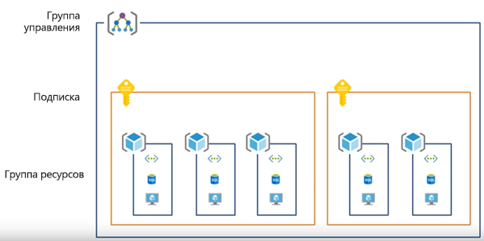
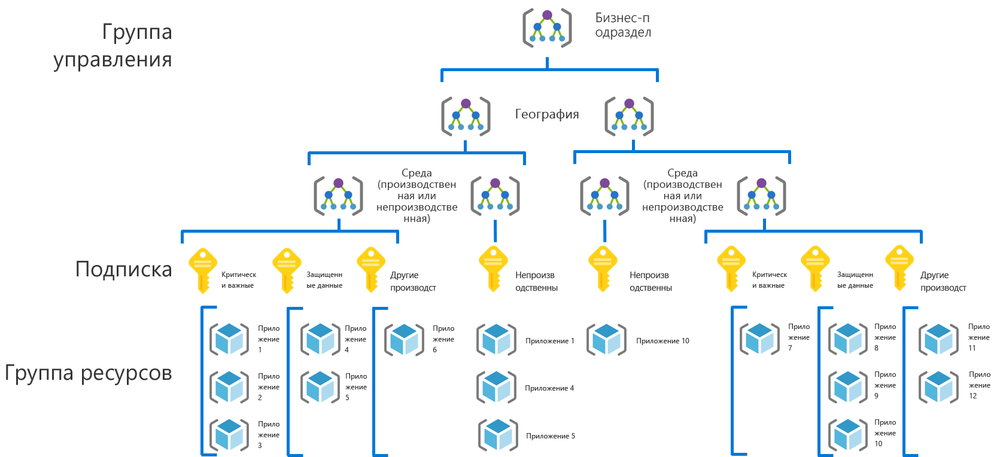
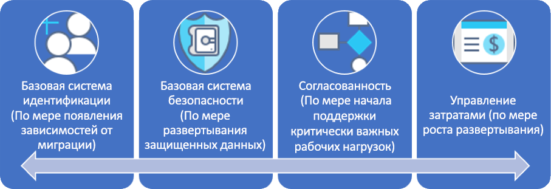

# CAF. Стратегия развития системы управления для крупных предприятийCAF: Large enterprise governance journey

## Обзор рекомендацийBest practice overview

Путь развития показан на примере вымышленной компании на различных этапах развития системы управления.This governance journey follows the experiences of a fictional company through various stages of governance maturity. Он основан на реальных путях взаимодействия с клиентом.It is based on real customer journeys. Предлагаемые рекомендации основаны на ограничениях и потребностях вымышленной компании.The suggested best practices are based on the constraints and needs of the fictional company.

Чтобы предоставить вам быструю отправную точку, в этом обзоре определен минимально жизнеспособный продукт (MVP) системы управления, основанный на рекомендациях.As a quick starting point, this overview defines a minimum viable product (MVP) for governance based on best practices. Здесь также содержатся ссылки на данные о развитии системы управления, которые позволяют получить рекомендации по мере возникновения новых бизнес-рисков или технических рисков.It also provides links to some governance evolutions that add further best practices as new business or technical risks emerge.

> [!WARNING]
> Этот MVP — это базовая начальная точка, для которой учитываются определенные допущения.This MVP is a baseline starting point, based on a set of assumptions. Даже этот минимальный набор рекомендаций основывается на корпоративных политиках, созданных с учетом уникальных бизнес-рисков и допустимых рисков.Even this minimal set of best practices is based on corporate policies driven by unique business risks and risk tolerances. Чтобы понять, относятся ли эти предположения к вам, ознакомьтесь с [подробным описанием](./narrative.md), относящимся к этой статье.To see if these assumptions apply to you, read the [longer narrative](./narrative.md) that follows this article.

### Рекомендация по системе управленияGovernance best practice

Эта рекомендации служат в качестве основы, которую организация может использовать, чтобы быстро и согласованно добавлять защитные структуры системы управления в несколько подписок Azure.This best practice serves as a foundation that an organization can use to quickly and consistently add governance guardrails across multiple Azure subscriptions.

### Организация ресурсовResource organization

В примере ниже показана иерархия MVP системы управления для организации ресурсов.The following diagram shows the governance MVP hierarchy for organizing resources.

Каждое приложение необходимо развернуть в соответствующей области иерархии группы управления, подписки и группы ресурсов.Every application should be deployed in the proper area of the management group, subscription, and resource group hierarchy. Во время планирования развертывания команда системы управления облачными решениями создаст в иерархии необходимые узлы для работы команд по внедрению облака.During deployment planning, the Cloud Governance team will create the necessary nodes in the hierarchy to empower the cloud adoption teams.

1. Группа управления для каждого бизнес-подразделения с детальной иерархией, которая отражает географический регион, а затем тип среды (рабочая среда или нерабочая среда).A management group for each business unit with a detailed hierarchy that reflects geography then environment type (Production, Non-Production).
2. Подписка для каждого уникального сочетания подразделения, географического региона, среды и классификации приложения.A subscription for each unique combination of business unit, geography, environment, and "Application Categorization."
3. Отдельная группа ресурсов для каждого приложения.A separate resource group for each application.
4. На каждом уровне иерархии группирования должна применяться согласованная номенклатура.Consistent nomenclature should be applied at each level of this grouping hierarchy.

Эти шаблоны предоставляют пространство для роста без лишних усложнений иерархии.These patterns provide room for growth without complicating the hierarchy unnecessarily.

[!INCLUDE [governance-of-resources](../../../../../includes/cloud-adoption/governance/governance-of-resources.md)]

## Развитие процесса управленияGovernance evolutions

После развертывания MVP в среду можно быстро интегрировать дополнительные уровни управления.Once this MVP has been deployed, additional layers of governance can be quickly incorporated into the environment. Ниже приведены некоторые способы развития MVP в соответствии с потребностями конкретной организации.Here are some ways to evolve the MVP to meet specific business needs:

- [Базовая система безопасности — защищенные данныеSecurity Baseline for protected data](./security-baseline-evolution.md)
- [Настройки ресурсов для критически важных приложенийResource configurations for mission-critical applications](./resource-consistency-evolution.md)
- [Элементы управления для Управления затратамиControls for Cost Management](./cost-management-evolution.md)
- [Элементы управления для развития использования нескольких облаковControls for multi-cloud evolution](./multi-cloud-evolution.md)

<!-- markdownlint-disable MD026 -->

## Возможности, которые предоставляет эта рекомендацияWhat does this best practice do?

В MVP устанавливаются рекомендации и средства дисциплины [ускорения развертывания](../../deployment-acceleration/overview.md), чтобы быстро применять корпоративную политику.In the MVP, practices and tools from the [Deployment Acceleration](../../deployment-acceleration/overview.md) discipline are established to quickly apply corporate policy. В частности MVP использует Azure Blueprints, Политику Azure и группы управления Azure для применения нескольких основных корпоративных политик, как определено в описании этой вымышленной компании.In particular, the MVP uses Azure Blueprints, Azure Policy, and Azure management groups to apply a few basic corporate policies, as defined in the narrative for this fictional company. Эти корпоративные политики применяются с использованием шаблонов Azure Resource Manager и политик Azure для установления очень малых базовых показателей идентификации и безопасности.Those corporate policies are applied using Azure Resource Manager templates and Azure policies to establish a very small baseline for identity and security.

## Расширение рекомендацийEvolving the best practice

Со временем этот MVP системы управления будет использоваться для расширения рекомендаций по управлению.Over time, this governance MVP will be used to evolve the governance practices. По мере внедрения растут риски для бизнеса.As adoption advances, business risk grows. Для снижения этих рисков модель системы управления CAF будет развиваться.Various disciplines within the CAF governance model will evolve to mitigate those risks. В более поздних статьях этой серии рассматривается развитие корпоративной политики, влияющей на вымышленную компанию.Later articles in this series discuss the evolution of corporate policy affecting the fictional company. Это развитие возникает в трех различных дисциплинах:These evolutions happen across three disciplines:

- "Базовая система идентификации" по мере развития зависимостей миграции в описании концепции.Identity Baseline, as migration dependencies evolve in the narrative
- "Управление затратами" по мере масштабирования внедрения.Cost Management, as adoption scales.
- "Базовая система безопасности" по мере развертывания защищенных данных.Security Baseline, as protected data is deployed.
- "Согласованность ресурсов" по мере поддержки критически важных рабочих нагрузок отделом ИТ-операций.Resource Consistency, as IT Operations begins supporting mission-critical workloads.

## Дополнительная информацияNext steps

Теперь, когда вы знакомы с MVP системы управления и знаете о развитии системы управления, ознакомьтесь с дополнительной статьей для контекста.Now that you’re familiar with the governance MVP and have an idea of the governance evolutions to follow, read the supporting narrative for additional context.

> [!div class="nextstepaction"]
> [Читать вспомогательное описаниеRead the supporting narrative](./narrative.md)
