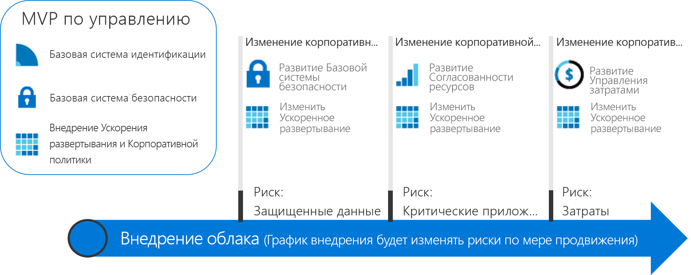

# Стратегии действенного управления

Стратегии развития систем управления, описанные в этом разделе, подразумевают инкрементальный подход к модели управления CAF. Вы можете создать гибкую платформу управления, которая будет развиваться в соответствии с изменением потребностей в рамках любого сценария управления облачными решениями.

## Проверка и применение рекомендаций по управлению облачными решениями

Чтобы начать процесс внедрения, выберите одну из следующих стратегий. Каждая стратегия включает ряд рекомендаций, основанных на сценарии для вымышленного клиента. Читателям, которые еще не знакомы с инкрементальным подходом к модели управления CAF, мы рекомендуем изучить предложенные ниже обобщенные инструкции по теории управления, прежде чем переходить к применению рекомендаций.

<!-- markdownlint-disable MD033 -->

<ul class="panelContent cardsZ">
<li style="display: flex; flex-direction: column;">
    <a href="./small-to-medium-enterprise/overview.md" style="display: flex; flex-direction: column; flex: 1 0 auto;">
        

            

                

                    

                        <h3>Малые и средние предприятия</h3>
                        
Стратегия развития системы управления для предприятий, которые используют менее пяти центров обработки данных и управляют затратами с помощью модели централизованной ИТ-системы или виртуальных платежей.

                    

                

            

        

    </a>
</li>
<li style="display: flex; flex-direction: column;">
    <a href="./large-enterprise/overview.md" style="display: flex; flex-direction: column; flex: 1 0 auto;">
        

            

                

                    

                        <h3>Крупные предприятия</h3>
                        
Стратегия развития системы управления для предприятий, которые используют более пяти центров обработки данных и управляют затратами для нескольких подразделений.

                    

                

            

        

    </a>
</li>
</ul>

<!-- markdownlint-enable MD033 -->

## Поэтапный подход к организации облачной системы управления

Внедрение облачных решений — это не цель, а процесс, который имеет четкие этапы и который сопряжен с реальными преимуществами для бизнеса. Но в самом начале компании обычно плохо представляют себе, каким будет окончательное состояние внедренных облачных решений. Система управления облачными решениями предоставляет поддержку, которая поможет компаниям безопасно завершить этот процесс.

В наших примерах рассматриваются сценарии для вымышленной компании, основанные на опыте реальных клиентов, а также представлено подробное описание всех аспектов системы управления развертыванием облачных решений.

### Определение финального состояния

Путь без цели — это просто блуждание. Очень важно хотя бы примерно представлять себе целевое состояние, прежде чем делать первый шаг. Следующая инфографика дает общее представление того, каким должно быть финальное состояние. Это не отправная точка, но вы получите хотя бы общее представление о возможной цели.

Модель управления CAF описывает важнейшие этапы стратегии. Каждый из этих этапов сопряжен с разными типами рисков, которые компаниям необходимо устранять по мере внедрения новых облачных решений. В рамках этой стратегии развития системы управления предусмотрены действия, которые должна выполнить команда управления облачными решениями. Каждый из принципов модели управления CAF будет описан более подробно. В целом можно выделить следующие элементы.

**Корпоративные политики**. Корпоративные политики являются основой системы управления облачными решениями. Стратегия развития системы управления фокусируется на следующих аспектах корпоративной политики:

- Бизнес-риски — выявление и анализ корпоративных рисков.
- Политика и соответствие требованиям — преобразование рисков в правила политик, удовлетворяют требованиям к обеспечению соответствия.
- Процессы — обеспечение соответствия настроенным политикам.

**Пять аспектов управления облачными решениями**. Эти аспекты реализуются в соответствии с корпоративными политиками. Каждый из аспектов защищает компанию от возможных проблем:

- Управление затратами.
- Основные способы защиты.
- Согласованность ресурсов.
- Основные способы идентификации.
- Ускорение развертывания.

По сути корпоративные политики — это система раннего выявления возможных проблем. Эти аспекты помогут компании устранить риски и создать средства защиты.

### Достижение финального состояния

Так как по мере внедрения облачных решений требования к системе управления также будут изменяться, требуется альтернативный подход к управлению. Чтобы *выполнить первый шаг*, компании уже не могут ждать, пока небольшая команда создаст все необходимые средства защиты и стратегии. Ожидается, что бизнес-результаты будут получены намного быстрее и проще. Следовательно, ИТ-система управления должна также своевременно развиваться в соответствии с изменением бизнес-потребностей. Только так она будет актуальной в процессе внедрения облачных решений, не допуская появления "теневых ИТ".

**Инкрементальный подход к управлению** удовлетворяет этим требованиям. Он подразумевает создание небольшого набора корпоративных политик, процессов и инструментов, используемых при внедрении и управлении. По сути — это основа, которая называется **минимально жизнеспособным продуктом (MVP)**. Концепция MVP позволяет команде управления быстро включать систему управления в реализации, создаваемые на протяжении жизненного цикла внедрения. MVP можно определить на любом этапе внедрения облачных решений. Но мы рекомендуем сделать это как можно раньше.

Возможность быстро реагировать на изменяющиеся риски предоставляет команде управления облачными решениями новые пути взаимодействия. Команда управления облачными решениями может выполнять роль разведчика для команды по вопросам облачной стратегии. Она делает для команд по внедрению облачных решений предварительную работу, включая определение направления и быстрое создание средств защиты для устранения рисков, связанных с планами внедрения. Эти уровни JIT-управления называются **этапами развития системы управления**. В рамках такого подхода стратегия управления на один шаг опережает действия команд по внедрению облачных решений.

Следующая схема упрощенно описывает MVP системы управления и три этапа развития такой системы. На каждом этапе добавляются новые корпоративные политики для устранения новых рисков. Затем в рамках ускорения развертывания эти изменения применяются ко всем развертываниям.

> [!NOTE]
> Система управления не заменяет собой решения для таких ключевых направлений, как безопасность, сетевая инфраструктура, идентификация, финансы, DevOps и эксплуатация. Но описываемый процесс подразумевает взаимодействие с соответствующими специалистами, а также определенные взаимозависимости. Эти специалисты должны быть включены в группу управления облачными решениями для ускорения принятия решений и выполнения действий.

## Выбор стратегии развития системы управления

Описанная стратегия развития подразумевает реализацию MVP системы управления. Начиная с этого этапа, команда управления облачными решениями может на шаг опережать команды по внедрению облачных решений в рамках сотрудничества для ускорения внедрения. Модель управления CAF регламентирует применение системы управления, начиная от реализации базовой системы.

Для начала выберите один из предложенных ниже вариантов. Эти варианты отражают сценарии вымышленных клиентов. Они разделены на основе размера предприятий, чтобы упростить выбор и облегчить навигацию. Естественно, процесс принятия реальных решений может быть более сложным. В следующей таблице представлены различия между двумя стратегиями.

> [!NOTE]
> Маловероятно, что какой-то из этих вариантов будет полностью соответствовать вашему сценарию. Ваша задача — выбрать один из них в качестве отправной точки с тем, чтобы на основе поступающих сведений привести решения в соответствие с определенными критериями.

### Характеристики бизнеса

|                                            | Малые и средние предприятия                                                                              | Крупные предприятия                                                                                               |
|--------------------------------------------|---------------------------------------------------------------------------------------------------------|----------------------------------------------------------------------------------------------------------------|
| Географическое расположение (страна или геополитический регион) | Клиенты или сотрудники находятся преимущественно в одном регионе.                                                      | Клиенты или сотрудники находятся в разных регионах.                                                              |
| Затронутые подразделения                    | Одно бизнес-подразделение.                                                                                    | Несколько бизнес-подразделений.                                                                                        |
| Бюджет на ИТ                                  | Единый ИТ-бюджет.                                                                                        | Отдельный бюджет для нескольких бизнес-подразделений.                                                                         |
| Инвестиции в ИТ                             | Инвестиции с учетом капитальных затрат планируются один раз в год и обычно покрывают только основные операции обслуживания. | Инвестиции с учетом капитальных затрат планируются один раз в год и часто покрывают обслуживание и цикл обновления длительностью от 3 до 5 лет. |

### Текущее состояние перед внедрением системы управления облачными решениями

|                                             | Малые и средние предприятия                                                                               | Крупные предприятия                                                                                                          |
|---------------------------------------------|----------------------------------------------------------------------------------------------------------|---------------------------------------------------------------------------------------------------------------------------|
| Центр обработки данных или сторонние поставщики услуг размещения | Меньше пяти центров обработки данных.                                                                                  | Больше пяти центров обработки данных.                                                                                                   |
| Сетевая инфраструктура                                  | Отсутствие глобальной сети или 1–2 поставщика глобальных сетей.                                                                             | Сложная или глобальная сеть.                                                                                             |
| Идентификация                                    | Один лес и один домен. Не требуется аутентификация на основе утверждений или устройства многофакторной проверки подлинности сторонних поставщиков. | Сложная система с несколькими лесами и несколькими доменами. Приложениям требуется аутентификация на основе утверждений или устройства многофакторной проверки подлинности сторонних поставщиков. |

### Требуемое будущее состояние после изменения системы управления облачными решениями

|                                              | Малые и средние предприятия                                                                        | Крупные предприятия                                                                                        |
|----------------------------------------------|---------------------------------------------------------------------------------------------------|---------------------------------------------------------------------------------------------------------|
| Управление затратами — учет облачных затрат           | Модель виртуальных счетов. Счета выставляются централизованно через ИТ-подразделение.                                                | Модель возвратных платежей. Счета могут выставляться через механизм ИТ-закупок.                                  |
| Базовая система безопасности — защищенные данные           | Финансовые данные и интеллектуальная собственность компании. Некоторые клиентские данные. Отсутствуют внешние требования к обеспечению соответствия.     | Много разных наборов финансовых и персональных данных клиентов. Могут быть внешние требования к обеспечению соответствия. |
| Согласованность ресурсов — критически важные приложения | Простои неприятны, но не влекут финансового ущерба. Существующая система ИТ-операций недостаточно развита. | Простои имеют четкие и отслеживаемые финансовые последствия. Система ИТ-операций хорошо развита и стабильна.         |

Эти две стратегии представляют крайние варианты для клиентов, которые собираются инвестировать в систему управления облачными решениями. Большинство компаний использую элементы, взятые из обоих вариантов. Ознакомившись со стратегией развития, примените модель управления CAF. Так вы начнете работу с системой управления и сможете скорректировать выбранный базовый вариант с учетом ваших потребностей.

## Дополнительная информация

Выберите одну из стратегий развития:

> [!div class="nextstepaction"]
> [Small-to-medium enterprise governance journey](./small-to-medium-enterprise/overview.md) (Стратегия развития системы управления для малых и средних предприятий)
>
> [Стратегия развития системы управления для крупных предприятий](./large-enterprise/overview.md)
