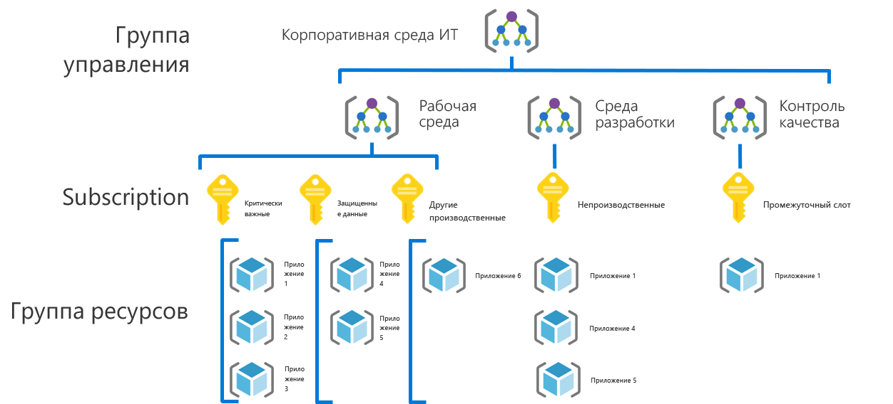
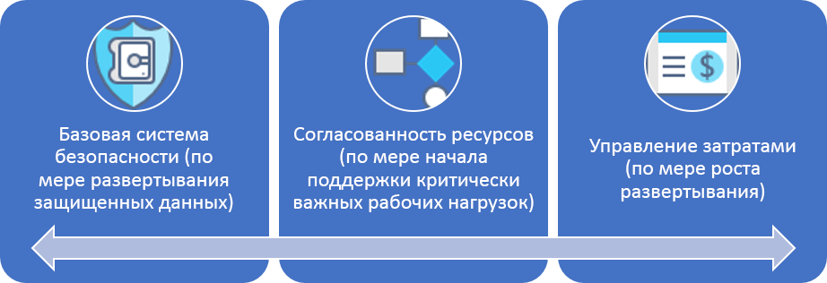

# Путь развития системы управления для предприятий малого и среднего бизнеса

## Обзор рекомендаций

Путь развития показан на примере вымышленной компании на различных этапах развития системы управления. Он основан на реальных путях взаимодействия с клиентом. Предлагаемые рекомендации основаны на ограничениях и потребностях вымышленной компании.

В начале этого обзора представлено определение продукта с минимальной функциональностью (MVP) для системы управления, основанной на рекомендациях. Он также содержит ссылки на данные о развитии системы управления, которые позволяют получить рекомендации по мере возникновения новых бизнес-рисков или технических рисков.

> [!WARNING]
> Этот MVP — это базовая начальная точка, для которой учитываются определенные допущения. Даже этот минимальный набор рекомендаций основывается на корпоративных политиках, созданных с учетом уникальных бизнес-рисков и допустимых рисков. Чтобы понять, относятся ли эти предположения к вам, ознакомьтесь с [подробным описанием](./narrative.md) далее в этой статье.

## Рекомендации по управлению

Эта рекомендация служит в качестве основы, которую организация может использовать, чтобы быстро и согласованно добавлять защитные структуры системы управления в несколько подписок Azure.

### Организация ресурсов

В примере ниже показана иерархия MVP управления для организации ресурсов.

Каждое приложение необходимо развернуть в соответствующей области иерархии группы управления, подписки и группы ресурсов. Во время планирования развертывания команда системы управления облачными ресурсами создаст в иерархии необходимые узлы для работы команд по внедрению облака.  

1. Группа управления для каждого типа среды (например, рабочая среда, среда разработки и тестирования).
2. Подписка для каждой классификации предложения.
3. Отдельная группа ресурсов для каждого приложения.
4. Согласованная номенклатура должна применяться на каждом уровне иерархии группирования.

Ниже приведен пример использования этого шаблона:

Эти шаблоны предоставляют место для роста иерархии без лишних усложнений.

[!INCLUDE [governance-of-resources](../../../../../includes/cloud-adoption/governance/governance-of-resources.md)]

## Развитие системы управления

После развертывания MVP в среде можно быстро включить дополнительные уровни управления. Ниже приведены некоторые способы развития MVP в соответствии с потребностями конкретной организации.

- [Базовая система безопасности — защищенные данные](./security-baseline-evolution.md)
- [Настройки ресурсов для критически важных приложений](./resource-consistency-evolution.md)
- [Элементы управления для Управления затратами](./cost-management-evolution.md)
- [Элементы управления для эволюции использования нескольких облаков](./multi-cloud-evolution.md)

<!-- markdownlint-disable MD026 -->

## Что делает эта рекомендация?

В MVP устанавливаются рекомендации и средства дисциплины [ускорения развертывания](../../deployment-acceleration/overview.md), чтобы быстро применять корпоративную политику. В частности MVP использует Azure Blueprints, Политику Azure и группы управления Azure для применения нескольких основных корпоративных политик, как определено в описании этой вымышленной компании. Эти корпоративные политики применяются с использованием шаблонов Resource Manager и политик Azure для определения очень малых базовых показателей идентификации и безопасности.

## Расширение рекомендаций

Со временем этот MVP системы управления будет использоваться для расширения рекомендаций по управлению. По мере внедрения растут риски для бизнеса. Для снижения этих рисков модель системы управления CAF будет развиваться. В более поздних статьях этой серии рассматривается развитие корпоративной политики, влияющей на вымышленную компанию. Это развитие возникает в трех различных дисциплинах:

- Управление затратами по мере масштабирования внедрения;
- базовая конфигурация системы безопасности по мере развертывания защищенных данных;
- согласованность ресурсов по мере поддержки критических рабочих нагрузок ИТ-операциями.

## Дополнительная информация

Теперь, когда вы знакомы с MVP системы управления и знаете о развитии системы управления, ознакомьтесь с дополнительной статьей для контекста.

> [!div class="nextstepaction"]
> [Читать вспомогательное описание](./narrative.md)
