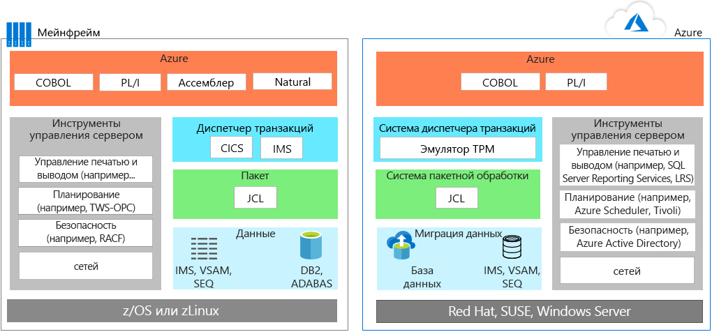
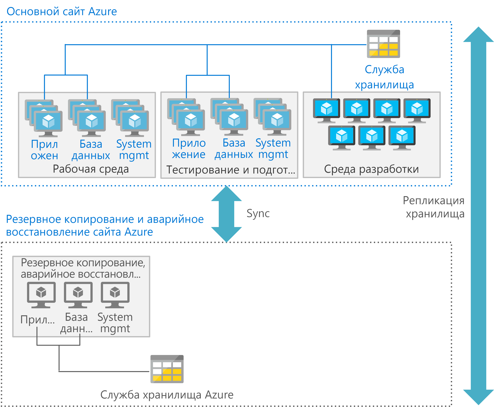

# Перенос приложений с мейнфреймовMainframe application migration

Многие команды прагматично подходят к переносу приложений из сред мейнфреймов в Azure: код при возможности используется повторно, а затем, если приложения необходимо переписать или заменить, они развертываются поэтапно.When migrating applications from mainframe environments to Azure, most teams follow a pragmatic approach: reuse wherever and whenever possible, and then start a phased deployment where applications are rewritten or replaced.

Для переноса приложений обычно применяется одна или несколько из следующих стратегий:Application migration typically involves one or more of the following strategies:

- Повторное размещение. Переместите существующий код, программы и приложения с мейнфрейма. Затем повторно скомпилируйте код, чтобы запустить его в эмуляторе мейнфреймов, который размещен в экземпляре облака.Rehost: You can move existing code, programs, and applications from the mainframe, and then recompile the code to run in a mainframe emulator hosted in a cloud instance. Как правило, при этом подходе сначала приложения перемещаются в облачный эмулятор, а затем базы данных переносятся в облачную базу данных.This approach typically starts with moving applications to a cloud-based emulator, and then migrating the database to a cloud-based database. По мере преобразования данных и файлов потребуется немного изменить код и выполнить рефакторинг.Some engineering and refactoring are required along with data and file conversions.

    Кроме того, вы можете повторно разместить приложение у своего поставщика услуг размещения.Alternatively, you can rehost using a traditional hosting provider. Одним из основных преимуществ облака является аутсорсинг управления инфраструктурой.One of the principal benefits of the cloud is outsourcing infrastructure management. Вы можете найти центр обработки данных и разместить в нем рабочие нагрузки для своих мейнфреймов.You can find a datacenter provider that will host your mainframe workloads for you. Эта модель позволяет выиграть время, снизить зависимость от поставщика и сэкономить средства за определенный период.This model may buy time, reduce vendor lock in, and produce interim cost savings.

- Прекращение поддержки приложений. Перед миграцией удалите все приложения, которые больше не будут использоваться.Retire: All applications that are no longer needed should be retired before migration.

- Повторная сборка. Некоторые организации принимают решение полностью переписать программы с использованием современных методик.Rebuild: Some organizations choose to completely rewrite programs using modern techniques. Учитывая дополнительные затраты и сложность этого подхода, он применяется реже, чем lift-and-shift.Given the added cost and complexity of this approach, it’s not as common as a lift-and-shift approach. Если вы также выбрали этот подход, рекомендуем заменить модули и код с помощью механизмов преобразования кода после миграции.Often after this type of migration, it makes sense to begin replacing modules and code using code transformation engines.

- Замените Этот подход заключается в замене функциональных возможностей мейнфреймов на аналогичные функции в облаке.Replace: This approach replaces mainframe functionality with equivalent features in the cloud. Программное обеспечение как услуга (SaaS) — это один из вариантов, который используется в корпоративных решениях для отдела кадров, финансов, производства или планирования ресурсов предприятия.Software as a service (SaaS) is one option, which is using a solution created specifically for an enterprise concern, such as finance, human resources, manufacturing, or enterprise resource planning. Кроме того, многие приложения, разработанные с учетом специфики отрасли, позволяют вам решать проблемы, которые ранее решались с помощью мейнфреймов.In addition, many industry-specific apps are now available to solve problems that custom mainframe solutions used to previously solve.

Начните с планирования рабочих нагрузок, которые необходимо перенести в первую очередь. Затем перенесите приложения, устаревшие базы кода и базы данных, связанные с этими нагрузками, с учетом установленных требований.You should consider starting by planning those workloads that you want to initially migrate, and then determine those requirements for moving associated applications, legacy codebases, and databases.

## Эмуляция мейнфрейма в AzureMainframe emulation in Azure

Облачные службы Azure позволяют эмулировать традиционные среды мейнфреймов, чтобы повторно использовать существующий код мейнфреймов и приложений.Azure cloud services can emulate traditional mainframe environments, enabling you to reuse existing mainframe code and applications. К общим компонентам сервера, которые можно эмулировать, относятся системы онлайн-обработки транзакций (OLTP), пакетной обработки и приема данных.Common server components that you can emulate include online transaction processing (OLTP), batch, and data ingestion systems.

### Системы OLTPOLTP systems

Во многих мейнфреймах используются системы OLTP, обрабатывающие тысячи или миллионы обновлений для огромного числа пользователей.Many mainframes have OLTP systems that process thousands or millions of updates for huge numbers of users. В этих приложениях часто применяется программное обеспечение для обработки транзакций и экранных форм, например системы управления информацией клиента (CICS), системы управления информацией (IMS) и интерфейсный процессор терминала (TIP).These applications often use transaction processing and screen-form handling software, such as customer information control system (CICS), information management systes (IMS), and terminal interface processor (TIP).

При переносе приложений OLTP в Azure вы можете запускать эмуляторы для обработки транзакций мейнфреймов (TP) в виде IaaS (инфраструктура как услуга) на виртуальных машинах в Azure.When moving OLTP applications to Azure, emulators for mainframe transaction processing (TP) monitors are available to run as infrastructure as a service (IaaS) using virtual machines (VMs) on Azure. Функциональные возможности для работы с формами и экраном также реализуются с помощью веб-серверов.The screen handling and form functionality can also be implemented by web servers. Для доступа к данным и транзакциям вы можете применять этот подход совместно с API-интерфейсами баз данных, такими как Объекты данных ActiveX (ADO), ODBC и Java Database Connectivity (JDBC).This approach can be combined with database APIs, such as ActiveX data object (ADO), open database connectivity (ODBC), and Java database connectivity (JDBC) for data access and transactions.

### Пакетные обновления, ограниченные по времениTime-constrained batch updates

Во многих системах на базе мейнфреймов миллионы учетных записей обновляются ежемесячно или ежегодно, например в банках, страховых компаниях и государственных организациях.Many mainframe systems perform monthly or annual updates of millions of account records, such as those used in banking, insurance, and government. Мейнфреймы обрабатывают такие рабочие нагрузки с помощью систем обработки данных с высокой пропускной способностью.Mainframes handle these types of workloads by offering high-throughput data handling systems. Чтобы повысить производительность, зависящую от скорости обработки (количества операций ввода-вывода в секунду) магистрали мейнфреймов, пакетные задания мейнфреймов обычно выполняются последовательно.Mainframes batch jobs are typically serial in nature and depend on the input/output operations per second (IOPS) provided by the mainframe backbone for performance.

Для повышения производительности в облачных средах для пакетных операций используются параллельные вычисления и высокоскоростные сети.Cloud-based batch environments use parallel compute and high-speed networks for performance. Если вам нужно оптимизировать производительность пакетных операций, Azure предоставляет различные варианты вычислений, хранения данных и сетей.If you need to optimize batch performance, Azure provides various compute, storage, and networking options.

### Системы приема данныхData ingestion systems

Мейнфреймы принимают для обработки большие пакеты данных из области розничной торговли, финансовых услуг, производства и других решений для обработки.Mainframes ingest large batches of data from retail, financial services, manufacturing, and other solutions for processing. Чтобы скопировать данные в расположение для хранения и из него, вы можете использовать простые средства командной строки Azure, такие как [AzCopy](/azure/storage/common/storage-use-azcopy).With Azure, you can use simple command-line utilities such as [AzCopy](/azure/storage/common/storage-use-azcopy) for copying data to and from storage location. Кроме того, служба [Фабрика данных Azure](/azure/data-factory/introduction) позволяет принимать данные из разрозненных хранилищ, чтобы создавать и планировать рабочие процессы на основе этих данных.You can also use the [Azure Data Factory](/azure/data-factory/introduction) service, enabling you to ingest data from disparate data stores to create and schedule data-driven workflows.

Кроме среды эмуляции, Azure предоставляет службы PaaS (платформа как услуга) и аналитики, которые позволяют улучшить существующие среды мейнфреймов.In addition to emulation environments, Azure provides platform as a service (PaaS) and analytics services that can enhance existing mainframe environments.

## Перенос рабочих нагрузок OLTP в AzureMigrate OLTP workloads to Azure

Подход lift-and-shift позволяет быстро перенести существующие приложения в Azure без изменения их кода.The lift-and-shift approach is the no code option for quickly migrating existing applications to Azure. Каждое приложение переносится без изменений, чтобы вы могли воспользоваться преимуществами облачной среды без рисков и затрат, связанных с изменением кода.Each application is migrated as is, which provides the benefits of the cloud without the risks or costs of making code changes. С этой целью для мониторов обработки транзакций (TP) мейнфрейма в Azure применяется эмулятор.Using an emulator for mainframe transaction processing (TP) monitors on Azure supports this approach.

Мониторы обработки транзакций предоставляются различными поставщиками и работают на виртуальных машинах (инфраструктура как услуга (IaaS) в Azure).TP monitors are available from various vendors and run on virtual machines, an infrastructure as a service (IaaS) option on Azure. На следующей схеме показан перенос веб-приложения на основе IBM DB2, системы управления реляционной базой данных (СУБД) на мейнфрейм IBM z/OS (до и после).The following before and after diagrams show a migration of an online application backed by IBM DB2, a relational database management system (DBMS), on an IBM z/OS mainframe. В DB2 для z/OS файлы метода доступа к виртуальному хранилищу (VSAM) и индексно-последовательный метод доступа (ISAM) применяются для хранения неструктурированных файлов.DB2 for z/OS uses virtual storage access method (VSAM) files to store the data and Indexed Sequential Access Method (ISAM) for flat files. В этой архитектуре CICS также используется для мониторинга транзакций.This architecture also uses CICS for transaction monitoring.

Для запуска диспетчера транзакций и пакетных заданий, использующих JCL, в Azure используется среда эмуляции.On Azure, emulation environments are used to run the TP manager and the batch jobs that use JCL. На уровне данных DB2 заменяется [Базой данных SQL Azure](/azure/sql-database/sql-database-technical-overview). Кроме того, можно использовать Microsoft SQL Server, DB2 LUW или Oracle Database.In the data tier, DB2 is replaced by [Azure SQL Database](/azure/sql-database/sql-database-technical-overview), although Microsoft SQL Server, DB2 LUW, or Oracle Database can also be used. Эмулятор поддерживает IMS, VSAM и SEQ.An emulator supports IMS, VSAM, and SEQ. Средства управления системой мейнфрейма заменяются службами Azure и программным обеспечением сторонних поставщиков, которое запускается на виртуальных машинах.The mainframe’s system management tools are replaced by Azure services, and software from other vendors, that run in VMs.

Как правило, функции обработки экрана и форм для ввода данных реализуются с помощью веб-серверов, которые можно комбинировать с API баз данных, такими как ADO, ODBC и JDBC, для транзакций и доступа к данным.The screen handling and form entry functionality is commonly implemented using web servers, which can be combined with database APIs, such as ADO, ODBC, and JDBC for data access and transactions. Полный перечень IaaS-компонентов Azure зависит от операционной системы, которую вы предпочитаете использовать.The exact line-up of Azure IaaS components to use depends on the operating system you prefer. Например: For example:

- Виртуальные машины под управлением Windows. Internet Information Server (IIS) вместе с ASP.NET для обработки экрана и бизнес-логики.Windows–based VMs: Internet Information Server (IIS) along with ASP.NET for the screen handling and business logic. Для доступа к данным и транзакций используйте стандарт ADO.NET.Use ADO.NET for data access and transactions.

- Виртуальные машины под управлением Linux. Серверы Java-приложений, такие как Apache Tomcat, для обработки экрана и бизнес-функций на платформе Java.Linux–based VMs: The Java-based application servers that are available, such as Apache Tomcat for screen handling and Java-based business functionality. Для доступа к данным и транзакций используйте стандарт JDBC.Use JDBC for data access and transactions.

## Перенос пакетных рабочих нагрузок в AzureMigrate batch workloads to Azure

Пакетные операции в Azure отличаются от выполняемых в обычной среде для пакетных задач на мейнфреймах.Batch operations in Azure differ from the typical batch environment on mainframes. Чтобы повысить производительность, зависящую от количества операций ввода-вывода в секунду в магистрали мейнфреймов, пакетные задания мейнфреймов обычно выполняются последовательно.Mainframe batch jobs are typically serial in nature and depend on the IOPS provided by the mainframe backbone for performance. Для повышения производительности пакетных операций в облачных средах используются параллельные вычисления и высокоскоростные сети.Cloud-based batch environments use parallel computing and high-speed networks for performance.

Чтобы оптимизировать производительность пакетных операций с помощью Azure, учитывайте возможности [вычислительных ресурсов](/azure/virtual-machines/windows/overview), [хранилища](/azure/storage/blobs/storage-blobs-introduction), [сети](https://azure.microsoft.com/blog/maximize-your-vm-s-performance-with-accelerated-networking-now-generally-available-for-both-windows-and-linux/) и [мониторинга](/azure/azure-monitor/overview), как описано ниже.To optimize batch performance using Azure, consider the [compute](/azure/virtual-machines/windows/overview), [storage](/azure/storage/blobs/storage-blobs-introduction), [networking](https://azure.microsoft.com/blog/maximize-your-vm-s-performance-with-accelerated-networking-now-generally-available-for-both-windows-and-linux/), and [monitoring](/azure/azure-monitor/overview) options as follows.

### Службы вычисленийCompute

Используйте следующую команду:Use:

- Виртуальные машины с высокой тактовой частотой процессора.VMs with the highest clock speed. Часто приложения для мейнфреймов с высокой тактовой частотой ЦП бывают однопоточными.Mainframe applications are often single-threaded and mainframe CPUs have a very high clock speed.

- Виртуальные машины с большим объемом памяти для кэширования данных и рабочих областей приложений.VMs with large memory capacity to allow caching of data and application work areas.

- Виртуальные машины с виртуальными ЦП более высокой плотности, позволяющие использовать преимущества многопоточной обработки, если приложение поддерживает многопоточность.VMs with higher density vCPUs to take advantage of multi-threaded processing if the application supports multiple threads.

- Параллельную обработку. Azure легко масштабируется для параллельной обработки, обеспечивая большую вычислительную мощность для выполнения пакетных операций.Parallel processing, as Azure easily scales out for parallel processing, delivering more compute power for a batch run.

### ХранилищеStorage

Используйте следующую команду:Use:

- [SSD (цен. категория "Премиум") Azure](/azure/virtual-machines/windows/premium-storage) или [SSD (цен. категория "Ультра") Azure](/azure/virtual-machines/windows/disks-ultra-ssd), чтобы обеспечить максимальное количество операций ввода-вывода в секунду.[Azure Premium SSD](/azure/virtual-machines/windows/premium-storage) or [Azure Ultra SSD](/azure/virtual-machines/windows/disks-ultra-ssd) for maximum available IOPS.

- Чередование нескольких дисков, чтобы увеличить отношение количества операций ввода-вывода в секунду к объему хранилища.Striping with multiple disks for more IOPS per storage size.

- Секционирование хранилища для распределения операций ввода-вывода между несколькими устройствами хранения в Azure.Partitioning for storage to spread IO over multiple Azure storage devices.

### СетьNetworking

- Используйте [ускоренную сеть Azure](/azure/virtual-network/create-vm-accelerated-networking-powershell), чтобы минимизировать задержку.Use [Azure Accelerated Networking](/azure/virtual-network/create-vm-accelerated-networking-powershell) to minimize latency.

### МониторингMonitoring

- Администраторы могут отслеживать избыточную производительность выполнения пакетов и устранять узкие места с помощью таких средств мониторинга, как [Azure Monitor](/azure/azure-monitor/overview), [Azure Application Insights](/azure/application-insights/app-insights-overview) и даже журналы Azure.Use monitoring tools, [Azure Monitor](/azure/azure-monitor/overview), [Azure Application Insights](/azure/application-insights/app-insights-overview), and even the Azure logs enable administrators to monitor any over performance of batch runs and help eliminate bottlenecks.

## Перенос сред разработкиMigrate development environments

Для разработки облачной распределенной архитектуры применяется другой набор средств разработки, обеспечивающий преимущества современных методик и языков.The cloud’s distributed architectures rely on a different set of development tools that provide the advantage of modern practices and programming languages. Чтобы облегчить переход, используйте среду разработки с другими средствами, предназначенными для эмуляции сред IBM z/OS.To ease this transition, you can use a development environment with other tools that are designed to emulate IBM z/OS environments. Ниже приведен список вариантов, предлагаемых корпорацией Майкрософт и другими поставщиками:The following list shows options from Microsoft and other vendors:

| КомпонентComponent        | Варианты AzureAzure Options                                                                                                                                  |
|------------------|---------------------------------------------------------------------------------------------------------------------------------------------------|
| z/OSz/OS             | Windows, Linux или UNIXWindows, Linux, or UNIX                                                                                                                      |
| CICSCICS             | Службы Azure, предлагаемые Micro Focus, Oracle, GT Software (Fujitsu), TmaxSoft, Raincode и NTT Data. Также можно переписать решение с использованием Kubernetes.Azure services offered by Micro Focus, Oracle, GT Software (Fujitsu), TmaxSoft, Raincode, and NTT Data, or rewrite using Kubernetes |
| IMSIMS              | Службы Azure, предлагаемые Micro Focus и OracleAzure services offered by Micro Focus and Oracle                                                                                  |
| AssemblerAssembler        | Службы Azure, предлагаемые Raincode и TmaxSoft; COBOL, C или Java; сопоставление с функциями операционной системыAzure services from Raincode and TmaxSoft; or COBOL, C, or Java, or map to operating system functions               |
| JCLJCL              | JCL, PowerShell или другие средства для работы со скриптамиJCL, PowerShell, or other scripting tools                                                                                                   |
| COBOLCOBOL            | COBOL, C или JavaCOBOL, C, or Java                                                                                                                            |
| NaturalNatural          | Natural, COBOL, C или JavaNatural, COBOL, C, or Java                                                                                                                  |
| FORTRAN и PL/IFORTRAN and PL/I | FORTRAN, PL/I, COBOL, C или JavaFORTRAN, PL/I, COBOL, C, or Java                                                                                                           |
| REXX и PL/IREXX and PL/I    | REXX, PowerShell или другие средства для работы со скриптамиREXX, PowerShell, or other scripting tools                                                                                                  |

## Перенос баз данных и данныхMigrate databases and data

Как правило при переносе приложений требуется повторное размещение приложения на уровне данных.Application migration usually involves rehosting the data tier. Вы можете перенести базы данных SQL Server, базы данных с открытым кодом и другие реляционные базы данных в полностью управляемые решения Azure, например [Управляемый экземпляр Базы данных SQL Azure](/azure/sql-database/sql-database-managed-instance), [Базу данных Azure для PostgreSQL](/azure/postgresql/overview) и [Базу данных Azure для MySQL](/azure/mysql/overview), с помощью [Azure Database Migration Service](/azure/dms/dms-overview).You can migrate SQL Server, open-source, and other relational databases to fully-managed solutions on Azure, such as [Azure SQL Database Managed Instance](/azure/sql-database/sql-database-managed-instance), [Azure Database Service for PostgreSQL](/azure/postgresql/overview), and [Azure Database for MySQL](/azure/mysql/overview) with [Azure Database Migration Service](/azure/dms/dms-overview).

К примеру, вы можете перенести приложение, если на уровне данных мейнфрейма используются:For example, you can migrate if the mainframe data tier uses:

- База данных IBM DB2 или IMS. Воспользуйтесь базой данных Azure SQL, SQL Server, DB2 LUW или Oracle Database в Azure.IBM DB2 or an IMS database, use Azure SQL database, SQL Server, DB2 LUW, or Oracle Database on Azure.

- VSAM и другие неструктурированные файлы. Воспользуйтесь неструктурированными файлами с индексно-последовательным методом доступа (ISAM) для Azure SQL, SQL Server, DB2 LUW или Oracle.VSAM and other flat files, use Indexed Sequential Access Method (ISAM) flat files for Azure SQL, SQL Server, DB2 LUW, or Oracle.

- Группы даты создания (GDG). Перенесите в Azure файлы, для которых используется соглашение об именовании и расширение имени файла, обеспечивающие аналогичные функциональные возможности для GDG.Generation Date Groups (GDGs), migrate to files on Azure that use a naming convention and filename extensions that provide similar functionality to GDGs.

На уровне данных IBM есть несколько основных компонентов, которые также необходимо перенести.The IBM data tier includes several key components that you must also migrate. Например, при переносе базы данных переносится и коллекция c данными в пулах, каждый из которых содержит "dbextents" — наборы данных VSAM z/OS.For example, when you migrate a database, you also migrate a collection of data contained in pools, each containing dbextents, which are z/OS VSAM data sets. При миграции нужно указать каталог, определяющий расположения данных в пулах носителей.Your migration must include the directory that identifies data locations in the storage pools. Кроме того, в плане миграции необходимо учесть журнал базы данных с записями операций, выполняемых в базе данных.Also, your migration plan must consider the database log, which contains a record of operations performed on the database. База данных может иметь один, два (двойных или альтернативных) или четыре (двойных и альтернативных) журнала.A database can have one, two (dual or alternate), or four (dual and alternate) logs.

При переносе базы данных необходимо также перенести следующие компоненты:Database migration also includes these components:

- Диспетчер базы данных. Предоставляет доступ к данным в базе данных.Database manager: Provides access to data in the database. Диспетчер базы данных запускается в отдельном разделе в среде z/OS.The database manager runs in its own partition in a z/OS environment.

- Обработчик запросов приложения. Принимает запросы от приложений перед их передачей на сервер приложений.Application requester: Accepts requests from applications before passing them to an application server.

- Адаптер подключенного ресурса. Включает компоненты обработчика запросов приложения для использования в транзакциях CICS.Online resource adapter: Includes application requester components for use in CICS transactions.

- Адаптер ресурса пакетной службы. Реализует компоненты обработчика запросов приложения для пакетных приложений z/OS.Batch resource adapter: Implements application requester components for z/OS batch applications.

- Интерактивный SQL (ISQL). Запускается как приложение и интерфейс CICS, позволяя пользователям вводить инструкции или команды оператора SQL.Interactive SQL (ISQL): Runs as a CICS application and interface enabling users to enter SQL statements or operator commands.

- Приложение CICS. Выполняется под управлением CICS с использованием доступных ресурсов и источников данных в CICS.CICS application: Runs under the control of CICS, using available resources and data sources in CICS.

- Приложение пакетной службы. Запускает логику процесса без интерактивного взаимодействия с пользователями, например, для создания массовых обновлений данных или отчетов из базы данных.Batch application: Runs process logic without interactive communication with users to, for example, produce bulk data updates or generate reports from a database.

## Оптимизация масштаба и пропускной способности для AzureOptimize scale and throughput for Azure

В общем случае, при расширении облака масштаб мейнфреймов увеличивается. Чтобы оптимизировать масштаб и пропускную способность приложений с использованием мейнфреймов, запускаемых в Azure, важно понимать, как мейнфреймы позволяют разделять и изолировать приложения.Generally speaking, mainframes scale up, while the cloud scales out. To optimize scale and throughput of mainframe-style applications running on Azure, it is important that you understand at how mainframes can separate and isolate applications. Чтобы изолировать ресурсы определенного приложения и управлять ими в одном экземпляре, в мейнфрейме z/OS используется функция логических разделов (LPARS).A z/OS mainframe uses a feature called Logical Partitions (LPARS) to isolate and manage the resources for a specific application on a single instance.

Например, в мейнфрейме один логический раздел (LPAR) используется для региона CICS со связанными программами COBOL, а второй — для DB2.For example, a mainframe might use one logical partition (LPAR) for a CICS region with associated COBOL programs, and a separate LPAR for DB2. Дополнительные логические разделы часто используются для сред разработки, тестирования и промежуточных сред.Additional LPARs are often used for the development, testing, and staging environments.

В Azure для этой цели принято использовать отдельные виртуальные машины.On Azure, it’s more common to use separate VMs to serve this purpose. В архитектурах Azure на уровне приложений обычно развертываются виртуальные машины: один набор виртуальных машин применяется на уровне данных, и другой набор используется для разработки и подобных целей.Azure architectures typically deploy VMs for the application tier, a separate set of VMs for the data tier, another set for development, and so on. Каждый уровень обработки можно оптимизировать с использованием наиболее подходящего типа виртуальных машин и компонентов для этой среды.Each tier of processing can be optimized using the most suitable type of VMs and  features for that environment.

Кроме того, на каждом уровне можно применять соответствующие службы аварийного восстановления.In addition, each tier can also provide appropriate disaster recovery services. Например, для виртуальных машин, используемых в рабочей среде, и виртуальных машин с базами данных, возможно, потребуется "горячее" или "теплое" восстановление. А виртуальные машины для разработки и тестирования поддерживают "холодное" восстановление.For example, production and database VMs might require a hot or warm recovery, while the development and testing VMs support a cold recovery.

На следующем рисунке показан возможный процесс развертывания в Azure с помощью основного и дополнительного веб-сайта.The following figure shows a possible Azure deployment using a primary and a secondary site. На основном сайте виртуальные машины для производственной, подготовительной и тестовой версии приложения развертываются с высоким уровнем доступности.In the primary site, the production, preproduction, and testing VMs are deployed with high availability. Дополнительный сайт используется для резервного копирования и аварийного восстановления.The secondary site is for backup and disaster recovery.

## Поэтапный перенос приложения с мейнфрейма в AzurePerform a staged mainframe to Azure

Возможно, перенести решения с мейнфрейма в Azure потребуется *поэтапно*. При этом одни приложения переносятся в первую очередь, а другие временно или навсегда остаются на мейнфрейме.Moving solutions from a mainframe to Azure may involve a *staged* migration, whereby some applications are moved first, and others remain on the mainframe temporarily or permanently. Как правило, для реализации этого подхода необходимы системы, которые позволяют приложениям и базам данных взаимодействовать между мейнфреймом и Azure.This approach typically requires systems that allow applications and databases to interoperate between the mainframe and Azure.

Распространенный сценарий — перенос приложения в Azure с сохранением данных, используемых приложением, на мейнфрейме.A common scenario is to move an application to Azure while keeping the data used by the application on the mainframe. Чтобы предоставить приложениям в Azure доступ к данным с мэйнфрейма, используется специальное программное обеспечение.Specific software is used to enable the applications on Azure to access data from the mainframe. К счастью, широкий выбор решений обеспечивает интеграцию между Azure и существующими средами мейнфреймов, поддержку гибридных сценариев и поэтапную миграцию.Fortunately, a wide range of solutions provide integration between Azure and existing mainframe environments, support for hybrid scenarios, and migration over time. Партнеры корпорации Майкрософт, независимые поставщики программного обеспечения и системные интеграторы, смогут помочь вам реализовать такое взаимодействие.Microsoft partners, independent software vendors, and system integrators can help you on your journey.

Один из вариантов — [Microsoft Host Integration Server](/host-integration-server) (HIS). Это решение, которое предоставляет архитектуру распределенной реляционной базы данных (DRDA), необходимую для приложений в Azure, чтобы обеспечить доступ к данным в базе DB2, которая остается на мейнфрейме.One option is [Microsoft Host Integration Server](/host-integration-server) (HIS), a solution that provides the distributed relational database architecture (DRDA) required for applications in Azure to access data in DB2 that remains on the mainframe. Для других вариантов интеграции мэйнфреймов в Azure используются решения IBM, Attunity, Codit и других поставщиков, а также решения с открытым исходным кодом.Other options for mainframe-to-Azure integration include solutions from IBM, Attunity, Codit, other vendors, and open source options.

## Решения партнеровPartner solutions

Если вы планируете миграцию с мэйнфреймов, вам поможет партнерская экосистема.If you are considering a mainframe migration, the partner ecosystem is available to assist you.

Azure предоставляет проверенную, высокодоступную и масштабируемую инфраструктуру для систем, которые сейчас работают на мейнфреймах.Azure provides a proven, highly available, and scalable infrastructure for systems that currently run on mainframes. Некоторые рабочие нагрузки можно перенести без особых трудностей.Some workloads can be migrated with relative ease. Другие рабочие нагрузки, зависящие от программного обеспечения устаревших систем, такие как CICS и IMS, можно со временем перенести в Azure с помощью решений партнеров.Other workloads that depend on legacy system software, such as CICS and IMS, can be rehosted using partner solutions and migrated to Azure over time. Какой бы из вариантов вы не выбрали, корпорация Майкрософт и ее партнеры готовы помочь вам оптимизировать решение для Azure, сохранив функциональные возможности программного обеспечения системы мейнфрейма.Regardless of the choice you make, Microsoft and our partners are available to assist you in optimizing for Azure while maintaining mainframe system software functionality.

См. дополнительные сведение о критериях выбора решений от партнеров в статье [Platform Modernization Alliance](https://www.platformmodernization.org/pages/mainframe.aspx) (Альянс модернизации платформы).For detailed guidance about choosing a partner solution, refer to the [Platform Modernization Alliance](https://www.platformmodernization.org/pages/mainframe.aspx).

## ПодробнееLearn more

Для получения дополнительных сведений см. следующие ресурсы:For more information, see the following resources:

- [Приступая к работе с AzureGet started with Azure](/azure)

- [Альянс по модернизации платформы: перенос решений для мейнфреймовPlatform Modernization Alliance: Mainframe migration](https://www.platformmodernization.org/pages/mainframe.aspx)

- [Развертывание IBM DB2 pureScale в AzureDeploy IBM DB2 pureScale on Azure](https://azure.microsoft.com/resources/deploy-ibm-db2-purescale-on-azure)

- [Документация по Host Integration Server (HIS)Host Integration Server (HIS) documentation](/host-integration-server)
