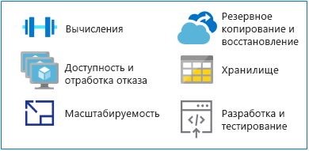

# Переход с мейнфреймов в AzureMake the switch from mainframes to Azure

В качестве альтернативной платформы для выполнения приложений, традиционно работающих на мейнфреймах, Azure предлагает гипермасштабируемые ресурсы для вычислений и хранения в среде с высоким уровнем доступности.As an alternative platform for running traditional mainframe applications, Azure offers hyperscale compute and storage in a high availability environment. Вы получите все возможности и гибкость современной облачной платформы без затрат, связанных с использованием среды мейнфрейма.You get the value and agility of a modern, cloud-based platform without the costs associated with a mainframe environment.

Эта статья содержит технические рекомендации по переходу с мейнфреймов в Azure.This section provides technical guidance for making the switch from a mainframe platform to Azure.

## MIPS и виртуальные ЦПMIPS vs. vCPUs

Не существует универсальной формулы, позволяющей определить необходимое количество виртуальных ЦП для запуска рабочих нагрузок мейнфреймов.There is no universal mapping formula that exists for determining the amount of virtual central processing units (vCPUs) needed to run mainframe workloads. Но в качестве базовой метрики один миллион команд в секунду (MIPS) часто сопоставляется с виртуальными ЦП в Azure.However, the metric of a million instructions per second (MIPS) is often mapped to vCPUs on Azure. MIPS измеряет общую вычислительную мощность мейнфрейма путем сравнения с постоянным значением числа циклов в секунду для определенного компьютера.MIPS measures the overall compute power of a mainframe by providing a constant value of the number of cycles per second for a given machine.

Небольшой организации будет достаточно не более 500 MIPS, а крупные организации обычно используют более 5000 MIPS.A small organization might require less than 500 MIPS, while a large organization typically uses more than 5,000 MIPS. При цене в 1000 долл. США за единицу MIPS крупная организации расходует ежегодно около 5 миллионов долл. США на развертывание инфраструктуры мощностью 5000 MIPS.At $1,000 per single MIPS, a large organization spends approximately $5 million annually to deploy a 5,000-MIPS infrastructure. Оценка ежегодных затрат на типичное развертывание Azure такого масштаба составляет примерно одну десятую от стоимости инфраструктуры MIPS.The annual cost estimate for a typical Azure deployment of this scale is approximately one-tenth the cost of a MIPS infrastructure. Дополнительные сведения см. в таблице 4 из технического документа [Demystifying Mainframe-to-Azure Migration](https://azure.microsoft.com/resources/demystifying-mainframe-to-azure-migration) (Секреты перехода с мейнфрейма в Azure).For details, see Table 4 in the [Demystifying Mainframe-to-Azure Migration](https://azure.microsoft.com/resources/demystifying-mainframe-to-azure-migration) white paper.

Точное сопоставление MIPS с виртуальными ЦП в Azure зависит от типа виртуальных процессоров и характера выполняемой рабочей нагрузки.An accurate calculation of MIPS to vCPUs with Azure depends on the type of vCPU and the exact workload you are running. Тесты производительности дают неплохую основу для оценки количества и типа необходимых виртуальных ЦП.However, benchmark studies provide a good basis for estimating the number and type of vCPUs you will need. Недавний [тест HPE zREF](https://h20195.www2.hpe.com/v2/getpdf.aspx/4aa4-2452enw.pdf) дал следующие результаты:A recent [HPE zREF benchmark](https://h20195.www2.hpe.com/v2/getpdf.aspx/4aa4-2452enw.pdf) provides the following estimates:

- 288 MIPS на одно ядро Intel, выполняемое на серверах HP Proliant для онлайн-заданий (CICS).288 MIPS per Intel-based core running on HP Proliant servers for online (CICS) jobs.

- 170 MIPS на одно ядро Intel для пакетных заданий COBOL.170 MIPS per Intel core for COBOL batch jobs.

В этом руководстве используется оценка в 200 MIPS на один виртуальный ЦП для обработки в сети и 100 MIPS на один виртуальный ЦП для пакетной обработки.This guide estimates 200 MIPS per vCPU for online processing and 100 MIPS per vCPU for batch processing.

> [!NOTE]
> Эти оценки могут измениться, как только новая серия виртуальных машин станет доступна в Azure.These estimates are subject to change as new virtual machine (VM) series become available in Azure.

## Высокий уровень доступности и отработка отказаHigh availability and failover

Системы мейнфреймов часто предлагают доступность на уровне пяти девяток (99,999 %) при использовании взаимозависимости мейнфреймов и Parallel Sysplex.Mainframe systems often offer five 9s availability (99.999 percent) when mainframe coupling and Parallel Sysplex are used. Но системным операторам все равно придется запланировать время простоя для обслуживания и начальной загрузки программ (IPL).Yet system operators still need to schedule downtime for maintenance and initial program loads (IPLs). Фактический уровень доступности будет на уровне двух или трех девяток, что вполне сравнимо с мощными серверами на основе Intel.The actual availability approaches two or three 9s, on par with high end, Intel-based servers.

Для сравнения: Azure предлагает соглашения об уровне обслуживания на основе обязательства (SLA), где по умолчанию гарантируются несколько девяток для уровня доступности с оптимизацией для локальной или географической репликации служб.By comparison, Azure offers commitment-based service level agreements (SLAs), where multiple 9s availability is the default, optimized with local or geo-based replication of services.

Azure дополнительно повышает уровень доступности за счет репликации данных из нескольких устройств хранения локально или в другой географический регион.Azure provides additional availability by replicating data from multiple storage devices, either locally or in other geographic regions. В случае сбоя на платформе Azure вычислительные ресурсы смогут обратиться к реплицированным данных на локальном или региональном уровне.In the event of an Azure-based failure, compute resources can access the replicated data on either the local or regional level.

Если используются ресурсы Azure PaaS (платформа как услуга), например [База данных SQL Azure](/azure/sql-database/sql-database-technical-overview) или [база данных Azure Cosmos](/azure/cosmos-db/introduction), Azure автоматически выполняет отработку отказа.When you use Azure platform as a service (PaaS) resources, such as [Azure SQL Database](/azure/sql-database/sql-database-technical-overview) and [Azure Cosmos Database](/azure/cosmos-db/introduction), Azure can automatically handle failovers. При использовании инфраструктуры IaaS Azure отработка отказа зависит от определенных системных функций, например SQL Server AlwaysOn, экземпляров отказоустойчивого кластера и групп доступности.When you use Azure infrastructure as a service (IaaS), failover relies on specific system functionality, such as SQL Server AlwaysOn features, failover clustering instances, and availability groups.

## МасштабируемостьScalability

Мейнфреймы обычно масштабируются вертикально, а облачные среды — горизонтально. Для мейнфреймов горизонтальное масштабирование реализуется с помощью раздела обеспечения взаимодействия (CF), но высокая стоимость оборудования и хранилища делает горизонтальное масштабирование мейнфреймов невыгодным.Mainframes typically scale up, while cloud environments scale out. Mainframes can scale out with the use of a coupling facility (CF), but the high costs of hardware and storage makes mainframes very expensive to scale out.

Кроме того, CF предлагает тесно связанные вычислительные ресурсы, а функции горизонтального масштабирования Azure используют слабую связь.In addition, a CF offers tightly coupled compute, whereas the scale-out features of Azure are loosely coupled. Облако можно масштабировать для точного соответствия пользовательским спецификациям, предоставляя нужный объем вычислительной мощности, хранилища и служб с оплатой по мере использования.The cloud can scale up or down to match exact user specifications, with compute power, storage, and services scaling on demand under a usage-based billing model.

## Архивация и восстановлениеBackup and recovery

Клиенты мейнфреймов обычно поддерживают сайты аварийного восстановления или привлекают независимых поставщиков мейнфреймов для аварийных ситуаций.Mainframe customers typically maintain disaster recovery sites or make use or an independent mainframe provider for disaster contingencies. Синхронизация с сайтом аварийного восстановления обычно осуществляется через копирование данных в автономном режиме.Synchronization with a disaster recovery site is usually done through offline copies of data. Оба варианта приводят к большим затратам.Both options incur high costs.

Автоматическую геоизбыточность можно обеспечить за счет применения взаимозависимости мейнфреймов, хотя и за высокую стоимость, и этот вариант обычно применяется только для критически важных систем.Automated geo-redundancy is also available through the mainframe coupling facility, albeit at great expense, and is usually reserved for mission-critical systems. Напротив, Azure предлагает простые и выгодные возможности [резервного копирования](/azure/backup/backup-introduction-to-azure-backup), [восстановления](/azure/site-recovery/site-recovery-overview) и [избыточности](/azure/storage/common/storage-redundancy) на локальном или региональном уровнях, а также географическую избыточность.In contrast, Azure has easy-to-implement and cost-effective options for [backup](/azure/backup/backup-introduction-to-azure-backup), [recovery](/azure/site-recovery/site-recovery-overview), and [redundancy](/azure/storage/common/storage-redundancy) at local or regional levels, or via geo-redundancy.

## ХранилищеStorage

Для хорошего понимания работы мейнфреймов важно различать несколько близких по значению терминов.Part of understanding how mainframes work involves decoding various overlapping terms. Например, центральное хранилище, реальная память, реальное хранилище и основное хранилище обычно обозначают хранилище, подключенное напрямую к процессору мейнфрейма.For example, central storage, real memory, real storage, and main storage all generally refer to storage attached directly to the mainframe processor.

Оборудование мейнфреймов включает процессоры и многие другие устройства, например запоминающие устройства с прямым доступом (DASD), накопители на магнитной ленте и несколько видов пользовательских консолей.Mainframe hardware includes processors and many other devices, such as direct access storage devices (DASDs), magnetic tape drives, and several types of user consoles. Магнитные ленты и DASD используются для системных функций и пользовательских программ.Tapes and DASDs are used for system functions and by user programs.

Для мейнфреймов используются следующие типы физического хранилища:Types of physical storage for mainframes include:

- Центральное хранилище. Расположено прямо в процессоре мейнфрейма. Также это хранилище называют процессорным или реальным хранилищем.Central storage: Located directly on the mainframe processor, this is also known as processor or real storage.

- Вспомогательное хранилище. Хранилища такого типа располагаются отдельно от мейнфрейма, и к ним относятся хранилища на DASD. Также их называют хранилищами страниц.Auxiliary storage: Located separately from the mainframe, this type includes storage on DASDs and is also known as paging storage.

В облаке предлагается несколько гибких и масштабируемых вариантов, при этом оплачивать вы будете только те, которые используются.The cloud offers a range of flexible, scalable options, and you will pay only for those options that you need. В [службе хранилища Azure](/azure/storage/common/storage-introduction) предоставляется хранилище с высокой масштабируемостью для объектов данных, служба файловой системы для облака, надежное хранилище сообщений, а также хранилище NoSQL.[Azure Storage](/azure/storage/common/storage-introduction) offers a massively scalable object store for data objects, a file system service for the cloud, a reliable messaging store, and a NoSQL store. Для виртуальных машин управляемые и неуправляемые диски предоставляют постоянное и безопасное дисковое хранилище.For VMs, managed and unmanaged disks provide persistent, secure disk storage.

## Разработка и тестирование мейнфреймовMainframe development and testing

Важной причиной для переноса приложений с мейнфреймов будет изменение процесса разработки приложений.A major driver in mainframe migration projects is the changing face of application development. Организациям нужно, чтобы среда разработки стала более гибкой и быстрее реагировала на потребности бизнеса.Organizations want their development environment to be more agile and responsive to business needs.

Мейнфреймы обычно имеют отдельные логические разделы (LPAR) для разработки и тестирования, например логический раздел для контроля качества и промежуточный логический раздел.Mainframes typically have separate logical partitions (LPARs) for development and testing, such as QA and staging LPARs. Решения разработки для мейнфреймов содержат компиляторы (COBOL, PL/I, Assembler) и редакторы.Mainframe development solutions include compilers (COBOL, PL/I, Assembler) and editors. Самым распространенным решением является ISPF (Interactive System Productivity Facility — средство для производительности интерактивной системы) для операционной системы z/OS, которая работает на мейнфреймах IBM.The most common is the Interactive System Productivity Facility (ISPF) for the z/OS operating system that runs on IBM mainframes. Также широко применяются RPF (ROSCOE Programming Facility — программное средство ROSCOE) и средства Computer Associates, такие как CA Librarian и CA-Panvalet.Others include ROSCOE Programming Facility (RPF) and Computer Associates tools, such as CA Librarian and CA-Panvalet.

Компиляторы и среды эмуляции доступны для 32-разрядных платформ, поэтому разработка и тестирование обычно становятся первыми рабочими нагрузками, переносимыми с мейнфреймов в Azure.Emulation environments and compilers are available on x86 platforms, so development and testing can typically be among the first workloads to migrate from a mainframe to Azure. Доступность и широкое распространение [средств DevOps в Azure](https://azure.microsoft.com/solutions/devops/) ускоряют процесс миграции сред разработки и тестирования.The availability and widespread use of [DevOps tools in Azure](https://azure.microsoft.com/solutions/devops/) is accelerating the migration of development and testing environments.

Когда решения будут разработаны и протестированы в Azure, для развертывания на мейнфрейме потребуется скопировать код на мейнфрейм и скомпилировать его.When solutions are developed and tested on Azure and are ready for deployment to the mainframe, you will need to copy the code to the mainframe and compile it there.

## Дополнительная информацияNext steps

> [!div class="nextstepaction"]
> [Перенос приложений с мейнфреймовMainframe application migration](application-strategies.md)
