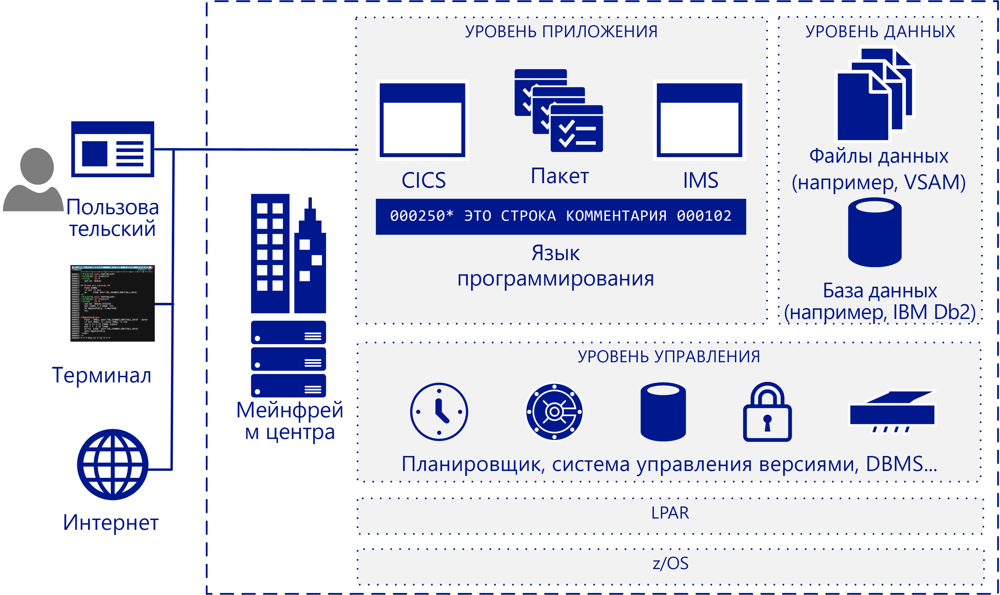

# Обзор миграции мейнфреймовMainframe migration overview

Многим компаниям и организациям будет выгодно перенести в облако некоторые или даже все рабочие нагрузки, приложения и базы данных, работающие на мейнфреймах.Many companies and organizations benefit from moving some or all their mainframe workloads, applications, and databases to the cloud. Azure предоставляет в облачном масштабе функции, аналогичные возможностям мейнфреймов, но без многих присущих им недостатков.Azure provides mainframe-like features at cloud scale without many of the drawbacks associated with mainframes.

Термин "мейнфрейм" применяется к любой крупной компьютерной системе, но сейчас большинство мейнфреймов развернуты на серверах IBM System Z или в IBM-совместимых системах под управлением MVS, DOS, VSE, OS/390 или z/OS.The term mainframe generally refers to a large computer system, but the vast majority currently of mainframes deployed are IBM System Z servers or IBM plug-compatible systems running MVS, DOS, VSE, OS/390, or z/OS. Системы мейнфреймов по-прежнему используются во многих отраслях для работы важных информационных систем и находят свое применение в узкоспециализированных сценариях, предназначенных, например, для масштабных ИТ-сред с большим объемом данных и высокой скоростью транзакций.Mainframe systems continue to be used in many industries to run vital information systems, and they have a place in highly-specific scenarios, such as large, high-volume, transaction intensive IT environments.

Переход в облако позволяет компаниям модернизировать свою инфраструктуру.Migrating to the cloud enables companies to modernize their infrastructure. Вы можете запускать приложения для мейнфреймов в облачных службах, и предоставляемые ими функциональные возможности станут доступны в виде рабочих нагрузок в любой момент, когда они потребуются организации.With cloud services you can make mainframe applications, and the value that they provide, available as a workload whenever your organization needs it. Многие рабочие нагрузки можно перенести в Azure с минимальными изменениями кода — например, исправив только имена баз данных.Many workloads can be transferred to Azure with only minor code changes, such as updating the names of databases. Более сложные рабочие нагрузки можно переносить поэтапно.You can migrate more complex workloads using a phased approach.

Почти все компании из списка Fortune 500 уже используют Azure для критически важных рабочих нагрузок.Most Fortune 500 companies are already running Azure for their critical workloads. Значительные финансовые преимущества Azure стали достаточной мотивацией для многих проектов миграции.Azure's significant bottom-line incentives motivate many migration projects. Обычно компании первым делом переносят в Azure рабочие нагрузки разработки и тестирования, а за ними следуют DevOps, электронная почта и аварийное восстановление как услуга.Companies typically move development and test workloads to Azure first, followed by DevOps, email, and disaster recovery as a service.

## Целевая аудиторияIntended audience

Если вы рассматриваете возможность перенести или создать облачные службы для своей ИТ-среды, это руководство для вас.If you’re considering a migration or the addition of cloud services as an option for your IT environment, this guide is for you.

Это руководство поможет начать диалог о миграции в организациях сферы ИТ.This guidance helps IT organizations start the migration conversation. Возможно, вы уже больше знаете об Azure и облачных инфраструктурах, чем о мейнфреймах, поэтому мы начнем руководство с обзорных сведений о работе мейнфреймов и далее перейдем к описанию стратегий, позволяющих выбрать объект и метод для миграции.You may be more familiar with Azure and cloud-based infrastructures than you are with mainframes, so this guide starts with an overview of how mainframes work, and continues with various strategies for determining what and how to migrate.

## Архитектура мейнфреймовMainframe architecture

В конце 50-х годов прошлого века была разработана концепция мейнфрейма как масштабируемого сервера для выполнения крупномасштабных сетевых транзакций и пакетной обработки.In the late 1950s, mainframes were designed as scale-up servers to run high-volume online transactions and batch processing. Поэтому для мейнфреймов создается программное обеспечение, предназначенное для форм сетевых транзакций в сети (иногда называемых зеленым экраном) и системы ввода-вывода с высокой производительностью для обработки пакетных заданий.Because of this, mainframes have software for online transaction forms (sometimes called green screens) and high-performance I/O systems for processing batch runs.

Мейнфреймы зарекомендовали себя как системы с высоким уровнем надежности и доступности, способные при этом выполнять огромные задания онлайн-транзакций и пакетной обработки.Mainframes have a reputation for high reliability and availability, and are known for their ability to run huge online transactions and batch jobs. Транзакция выполняется по заданию, полученному в результате обработки одного отдельного запроса, который чаще всего вводится пользователем в окне терминала.A transaction results from a piece of processing initiated by a single request, typically from a user at a terminal. Также транзакции могут поступать из многих других источников, например с веб-страниц, от удаленных рабочих станций и приложений в других информационных системах.Transactions can also come from multiple other sources, including web pages, remote workstations, and applications from other information systems. Кроме того, транзакции можно запускать автоматически в определенное заранее время, как показано на следующей схеме.A transaction can also be triggered automatically at a predefined time as the following figure shows.

Типичная архитектура мейнфрейма IBM включает следующие компоненты.A typical IBM mainframe architecture includes these common components:

- **Системы внешнего интерфейса**. Пользователи могут инициировать транзакции через терминалы, веб-страницы и удаленные рабочие станции.**Front-end systems:** Users can initiate transactions from terminals, web pages, or remote workstations. Приложения мейнфреймов часто имеют собственные пользовательские интерфейсы, которые можно сохранить после миграции в Azure.Mainframe applications often have custom user interfaces that can be preserved after migration to Azure. Для доступа к мейнфреймам по-прежнему используются эмуляторы терминала, именуемые терминалами зеленого экрана.Terminal emulators are still used to access mainframe applications, and are also called green-screen terminals.

- **Уровень приложений**. Как правило, в состав мейнфреймов входит система CICS (customer information control system — система управления клиентской информацией). Это самый популярный пакет управления транзакциями для мейнфреймов IBM с z/OS, который часто используется в IBM IMS (Information Management System) — диспетчере транзакций на основе сообщений.**Application tier:** Mainframes typically include a customer information control system (CICS), a leading transaction management suite for the IBM z/OS mainframe that is often used with IBM Information Management System (IMS), a message-based transaction manager. Системы пакетной обработки принимают масштабные обновления данных, например с большим объемом данных об учетных записях.Batch systems handle high-throughput data updates for large volumes of account records.

- **Код**. На мейнфреймах используются такие языки, как кобол, фортран, PL/I и Natural.**Code:** Programming languages used by mainframes include COBOL, Fortran, PL/I, and Natural. Для работы с z/OS применяется язык управления заданиями (JCL).Job control language (JCL) is used to work with z/OS.

- **Уровень базы данных**. Для z/OS широко распространена система управления реляционной базы данных (СУБД) IBM DD2.**Database tier:** A common relational database management system (DBMS) for z/OS is IBM DD2. Она управляет структурами данных с названием *dbspace*, которые содержат одну или несколько таблиц и назначаются пулам носителей или физическим наборам данных с названием *dbextent*.It manages data structures called *dbspaces* that contain one or more tables and are assigned to storage pools of physical data sets called *dbextents*. Двумя важнейшими компонентами базы данных являются каталог, который определяет расположение данных в пулах носителей, и журнал с записями операций, выполненных в базе данных.Two important database components are the directory that identifies data locations in the storage pools, and the log that contains a record of operations performed on the database. Поддерживаются также несколько форматов неструктурированных файлов данных.Various flat-file data formats are supported. В DB2 для z/OS для хранения данных обычно используются базы данных VSAM (virtual storage access method — метод доступа к виртуальному хранилищу).DB2 for z/OS typically uses virtual storage access method (VSAM) datasets to store the data.

- **Уровень управления**. На мейнфреймах IBM установлено программное обеспечение для планирования, например TWS-OPC, а также средства управления печатью и выводом, например CA-SAR и SPOOL, и система управления версиями для кода.**Management tier:** IBM mainframes include scheduling software such as TWS-OPC, tools for print and output management such as CA-SAR and SPOOL, and a source control system for code. Безопасный контроль доступа для z/OS обеспечивается службой RACF (resource access control facility — средство управления доступом к ресурсам).Secure access control for z/OS is handled by resource access control facility (RACF). Диспетчер баз данных предоставляет доступ к данным, размещенным в базе данных. Он выполняется в отдельном разделе в среде z/OS.A database manager provides access to data in the database and runs in its own partition in a z/OS environment.

- **LPAR**. Логические разделы (LPAR) используются для разделения вычислительных ресурсов.**LPAR:** Logical partitions, or LPARs, are used to divide compute resources. Физический мейнфрейм разделяется на несколько разделов LPAR.A physical mainframe is partitioned into multiple LPARs.

- **z/OS**. 64-разрядная операционная система, которая чаще всего используется на мейнфреймах IBM.**z/OS:** A 64-bit operating system that is most commonly used for IBM mainframes.

В системах IBM используется монитор транзакций, например CICS, для отслеживания всех аспектов бизнес-транзакций и управления ими.IBM systems use a transaction monitor such as CICS to track and manage all aspects of a business transaction. CICS контролирует общий доступ к ресурсам, целостность данных и приоритизацию выполнения.CICS manages the sharing of resources, the integrity of data, and prioritization of execution. CICS выполняет авторизацию пользователей, выделяет ресурсы и передает диспетчеру базы данных (например, IBM DB2), запросы от приложения к базам данных.CICS authorizes users, allocates resources, and passes database requests by the application to a database manager, such as IBM DB2.

Для более точной настройки CICS часто совмещается с IMS/TM (прежнее название — IMS/Data Communications, или IMS/DC).For more precise tuning, CICS is commonly used with IMS/TM (formerly IMS/Data Communications or IMS/DC). Решение IMS, предназначенное для снижения избыточности данных, позволяет поддерживать только одну копию данных.IMS was designed to reduce data redundancy by maintaining a single copy of the data. Оно дополняет CICS и берет на себя мониторинг транзакций, поддержание состояния на протяжении всего процесса и запись бизнес-функций в хранилище данных.It complements CICS as a transaction monitor by maintaining state throughout the process and recording business functions in a data store.

## Эксплуатация мейнфреймовMainframe operations

Ниже описаны типичные сценарии использования мейнфреймов.The following are typical mainframe operations:

- **В сети**. Выполняются такие рабочие нагрузки, как обработка транзакций, управление базами данных и подключения.**Online:** Workloads include transaction processing, database management, and connections. Для них часто применяются соединители IBM DB2, CICS и z/OS.They are often implemented using IBM DB2, CICS, and z/OS connectors.

- **Пакетная обработка**. Задания выполняются без участия пользователя, обычно по регулярному расписанию, например каждое утро по рабочим дням.**Batch:** Jobs run without user interaction, typically on a regular schedule such as every weekday morning. Пакетные задания могут выполняться в системах на базе Windows или Linux с помощью эмулятора JCL, такого как Micro Focus Enterprise Server или BMC Control-M.Batch jobs can be run on systems based on Windows or Linux by using a JCL emulator such as Micro Focus Enterprise Server or BMC Control-M software.

- **Язык управления заданиями (JCL)**. Вы можете указать ресурсы, необходимые для обработки пакетных заданий.**Job control language (JCL):** Specify resources needed to process batch jobs. JCL передает эту информацию в z/OS через набор операторов управления заданиями.JCL conveys this information to z/OS through a set of job control statements. В базовый синтаксис JCL входят шесть типов инструкций: JOB, ASSGN, DLBL, EXTENT, LIBDEF и EXEC.Basic JCL contains six types of statements: JOB, ASSGN, DLBL, EXTENT, LIBDEF, and EXEC. Каждое задание может содержать несколько инструкций (шагов) EXEC, каждый из которых может включать несколько инструкций LIBDEF, ASSGN, DLBL и EXTENT.A job can contain several EXEC statements (steps), and each step could have several LIBDEF, ASSGN, DLBL, and EXTENT statements.

- **Начальная загрузка программы (IPL)**.  Это загрузка копии операционной системы с диска в физическую память процессора и запуск этой копии.**Initial program load (IPL):**  Refers to loading a copy of the operating system from disk into a processor’s real storage and running it. IPL используется для восстановления после простоя.IPLs are used to recover from downtime. IPL выполняет ту же роль, что и загрузка операционной системы на виртуальных машинах Windows или Linux.An IPL is like booting the operating system on Windows or Linux VMs.

## Дополнительная информацияNext steps

> [!div class="nextstepaction"]
> [Мифы и фактыMyths and facts](myths-and-facts.md)
