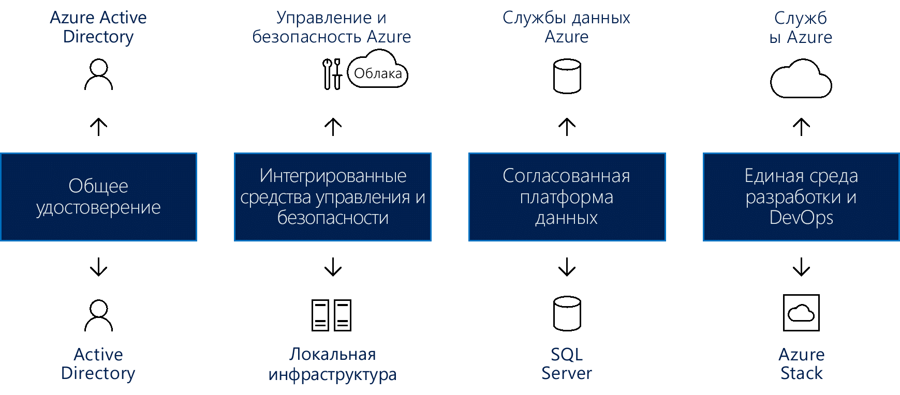

# Создание согласованности гибридного облака

В этой статье описаны высокоуровневые подходы к организации согласованности гибридной облачной среды.

Гибридные модели развертывания на период миграции позволяют снизить риск и сделать переход на новую инфраструктуру более плавным. Облачные платформы обеспечивают высочайший уровень гибкости для любых бизнес-процессов. Многие организации не спешат переходить в облако, предпочитая сохранять полный контроль над самыми важными данными. К сожалению, локальные серверы не позволяют внедрять инновации с той же скоростью, которая возможна в облаке. Гибридное облачное решение предоставляет лучшие возможности обоих подходов: высокая скорость инноваций в облаке и удобство локального управления;

## применение согласованности гибридного облака.

С помощью гибридного облачного решения организации могут масштабировать вычислительные ресурсы. Также оно устраняет необходимость в значительных капиталовложениях при краткосрочных всплесках потребностей. Когда при изменениях в бизнесе нужно будет освободить локальные ресурсы для более важных данных или приложений, проще, быстрее и дешевле отменить подготовку облачных ресурсов. Вы оплачиваете только те ресурсы, которые используются организацией за определенный период, без необходимости приобретать и обслуживать дополнительные ресурсы. Так вы избавитесь от оборудования, которое простаивает в течение длительного периода времени. Гибридное облако будет оптимальным решением, которое обладает преимуществами обоих подходов, такими как гибкость, масштабируемость и рентабельность облака, но одновременно и минимальный риск раскрытия данных.

*Рис. 1. Создание согласованности гибридной облачной среды для идентификации, управления, обеспечения безопасности, обработки данных, разработки и DevOps*

Настоящее гибридное облачное решение должно предоставлять четыре перечисленных ниже компонента, каждый из которых дает существенные преимущества.

- Единая идентификация для локальных и облачных приложений. Это повышает производительность пользователей, предоставляя им единый вход (SSO) во все приложения. Также она гарантирует согласованность взаимодействия при переходе приложений и пользователей через границы сетей или облака.
- Интеграция средств управления и обеспечения безопасности в масштабах всего гибридного облака. Это предоставит вам согласованный подход к мониторингу, управлению и защите среды, повышая ее видимость и контролируемость.
- Единообразная платформа данных для центра обработки данных и облака. Это обеспечивает возможность переноса данных, а также простоту доступа к локальным и облачным службам данных для подробного анализа по всем источникам данных.
- Унификация систем разработки и DevOps в облаке и локальных центрах обработки данных. Это позволит перемещать приложения между двумя средами по мере необходимости, что повысит производительность разработки, выполняемой в одной и той же среде для обоих расположений.
  
В применении к Azure можно назвать следующие примеры таких компонентов:

- Azure Active Directory (Azure AD), которая совместно с локальным экземпляром Azure AD поддерживает единые удостоверения для всех пользователей. Единый вход в локальной среде и через облако упрощает пользователям безопасный доступ к нужным приложениям и ресурсам. Администраторы смогут применять средства безопасности и контроля, предоставляя пользователям доступ к нужным ресурсам и сохраняя гибкость для изменения этих разрешений без ущерба для пользователей.
- Azure предоставляет интегрированные службы управления и обеспечения безопасности для облачной и локальной инфраструктур, куда входит интегрированный набор средств для мониторинга, настройки и защиты гибридных облаков. Этот комплексный подход к управлению разработан специально для реальных задач, с которыми сталкиваются организации с гибридными облачными решениями.
- Гибридное облако Azure предоставляет общие средства для безопасного, простого и эффективного доступа ко всем данным. Службы данных Azure в сочетании с Microsoft SQL Server образуют согласованную платформу данных. Согласованная модель гибридного облака позволяет пользователям работать с операционными и аналитическими данными, предоставляя одинаковые службы для хранения, анализа и визуализации данных в локальной среде и в облаке.
- Облачные службы Microsoft Azure в сочетании с Microsoft Azure Stack в локальной среде образуют единую систему для разработки и DevOps. Согласованность между облаком и локальной средой означает, что команда DevOps сможет создавать приложения, которые выполняются в любой из этих сред, и свободно выбирать нужное расположение для их развертывания. Вы можете повторно использовать шаблоны в гибридном решении, дополнительно упрощая процессы DevOps.

## Azure Stack в гибридной облачной среде

Microsoft Azure Stack — это гибридное облачное решение, позволяющее организациям запускать согласованные службы Azure в центрах обработки данных, обеспечивая возможности упрощенной разработки, управления и обеспечения безопасности с помощью общедоступных облачных служб Azure. Расширение Azure Stack позволяет запускать службы Azure из локальных сред и перемещать их в облако Azure, если и когда это требуется.

Azure Stack позволяет развертывать и эксплуатировать решения IaaS и PaaS с помощью тех же средств и интерфейса, что и для общедоступного облака Azure. Принцип управления Azure Stack через пользовательский интерфейс на веб-портале или с помощью PowerShell для ИТ-администраторов и пользователей будет тем же, что и при использовании аналогичных инструментов в Azure.

Azure и Azure Stack позволят применять новые гибридные сценарии использования для клиентских и внутренних бизнес-приложений, включая следующее:

- **Пограничные и отключенные решения.** Клиенты могут выполнить требования по задержке и подключению, локально обрабатывая данные в Azure Stack, а затем выполняя их статистическую обработку в Azure для последующей аналитики. Для этого в обоих службах используется общая логика приложения. Многим клиентам нужно использовать такой пограничный сценарий для разных контекстов, например для заводских цехов, круизных лайнеров и стволов шахт.
- **Облачные приложения, соответствующие разным требованиям.** Клиенты могут разрабатывать и развертывать приложения в Azure, сохраняя гибкую возможность локального развертывания в Azure Stack для соблюдения всех требований политик и нормативных регламентов без необходимости изменять код. Типичным примером можно назвать приложения глобального аудита, финансовой отчетности, валютной торговли, интернет-игр и отчетов о расходах. Клиентам иногда нужно развертывать разные экземпляры одного приложения в Azure или Azure Stack для выполнения коммерческих или технических требований. Azure полностью соответствует большинству требований, но при необходимости Azure Stack станет отличным дополнением к развертыванию.
- **Локальная облачная модель приложения.** Клиенты могут использовать веб-службы Azure, контейнеры, бессерверные архитектуры и микрослужбы для обновления и расширения существующих приложений, а также для создания новых. Вы можете применять согласованные процессы DevOps в облаке Azure и в локальной среде Azure Stack. Сейчас постоянно растет интерес к модернизации приложений, в том числе критически важных.

Azure Stack предлагается в двух вариантах развертывания:

- **Интегрированные системы Azure Stack.** Интегрированные системы Azure Stack предоставляются благодаря партнерским отношениям Майкрософт и партнеров по оборудованию, которые позволяют создать решение с инновациями облачного уровня и одновременно с простым управлением. Так как Azure Stack предлагается в форме интегрированной программно-аппаратной системы, вы получите необходимый уровень гибкости и контроля, не препятствующий внедрению инноваций из облачной среды. Интегрированные системы Azure Stack с размером от 4 до 12 узлов поддерживает как партнер по оборудованию, так и корпорация Майкрософт. Использование интегрированных систем Azure Stack позволяет реализовать новые сценарии для производственных рабочих нагрузок.
- **Пакет средств разработки Azure Stack.** Пакет средств разработки Azure Stack — это развертывание Azure Stack с одним узлом, удобное для оценки и изучения Azure Stack. Также вы можете использовать этот пакет как среду разработки, в которой можно создавать решения с помощью API-интерфейсов и инструментов, совместимых с Azure. Пакет средств разработки Azure Stack не предназначен для использования в качестве производственной среды.

## Экосистема единого облака Azure Stack

Вы можете ускорить разработку проектов для Azure Stack, используя полнофункциональную экосистему Azure.

- Azure гарантирует, что большинство сертифицированных для Azure приложений и служб будет работать в Azure Stack. В Azure Stack расширяют свои решения несколько независимых поставщиков программного обеспечения, в том числе Bitnami, Docker, Kemp Technologies, Pivotal Cloud Foundry, Red Hat Enterprise Linux и SUSE Linux.
- Вы можете выбрать доставку и эксплуатацию Azure Stack в формате полностью управляемой службы. Некоторые партнеры, в том числе Tieto, Yourhosting, Revera, Pulsant и NTT, скоро предоставят новые управляемые службы для Azure и Azure Stack. Эти партнеры ранее предлагали управляемые службы для Azure по программе поставщиков облачных решений (поставщиков облачных служб), а теперь расширяют свои предложения с поддержкой гибридной среды.
- В качестве примера завершенного, полностью управляемого решения гибридного облачного хранилища можно упомянуть Avanade. Это комплексное предложение включает в себя службы для перехода в облако, программное обеспечение, инфраструктуру, установку и настройку, а также текущие управляемые службы, чтобы клиентам было так же удобно работать с Azure Stack, как сейчас они работают с Azure.
- Системные интеграторы могут ускорить реализацию инициатив по модернизации приложений, создавая для клиентов комплексные решения в Azure. Специалисты в этих компаниях обладают широким набором навыков по работе в Azure, знаний отрасли и предметных областей, а также богатым опытом в применении процессов (например, DevOps). Каждое облако Azure Stack становится для системных интеграторов возможностью разработать решение, организовать развертывание систем, настроить все возможности и выполнить операционные действия. К категории системных интеграторов можно отнести Avanade, DXC, службы Dell EMC, консалтинговую группу InFront, HPE Pointnext и Pricewaterhouse Coopers (PwC).
