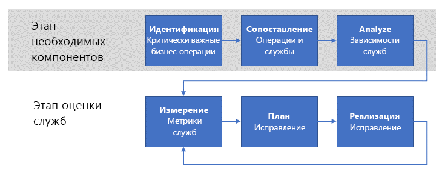

# Обеспечение проверки операционной пригодности

Когда организация перенесет часть рабочих нагрузок в Azure, следующим шагом будет создание процесса **проверки операционной пригодности**, который позволит перечислить, применить и итеративно проверять **нефункциональные** требования для этих рабочих нагрузок. _Нефункциональными_ называются требования, которые относятся к ожидаемому операционному поведению службы. Существует пять основных категорий нефункциональных требований, которые считаются [основами качества программного обеспечения](../../guide/pillars.md): масштабируемость, доступность, устойчивость (включая непрерывность бизнес-процессов и аварийное восстановление), управление и безопасность. Цель проверки операционной пригодности — обеспечить соответствие критически важных рабочих нагрузок требованиям бизнеса по всем основным аспектам качества.

Это означает, что в организации следует организовать процесс проверки операционной пригодности, который позволит в полной мере понять проблемы, возникающие при выполнении рабочей нагрузки в рабочей среде, найти методы их устранения и применить их. В этой статье описывается общий процесс проверки операционной пригодности, который позволит предприятию достигнуть этой цели.

## Операционная пригодность в корпорации Microsoft

Платформа Azure с самого начала создавалась в рамках проекта непрерывной разработки и интеграции, в котором участвовали многие команды разработчиков корпорации Майкрософт. Было бы очень трудно обеспечить качество и согласованность для проекта сопоставимого с Azure размера и сложности без надежного процесса определения и внедрения основных нефункциональных требований на регулярной основе.

Эти процессы корпорации Майкрософт использовались в качестве основы для процессов, которые описаны в этом документе.

## Понимание проблемы

Как вы узнали из статьи о [начале работы](../../cloud-adoption/getting-started/overview.md), первым шагом на пути к цифровому преобразованию предприятия является определение бизнес-задач, которые можно решить с помощью перехода в Azure. Следующим шагом будет поиск высокоуровневого решения для этих проблем, например перенос рабочей нагрузки в облако или адаптация существующей локальной службы с добавлением облачных возможностей. После этого начинается разработка и внедрение решения.

В ходе этого процесса основное внимание обычно уделяется _функциям_ службы. Создается определенный набор _функциональных_ требований, которые предъявляются к этой службе. Например, служба доставки товаров должна иметь возможность определить начальное и конечное расположение товара, отслеживать его во время доставки, уведомлять клиента и т. п.

Напротив, _нефункциональные_ требования включают такие свойства, как [доступность](../../checklist/availability.md), [устойчивость](../../resiliency/index.md) и [масштабируемость](../../checklist/scalability.md) службы. Эти свойства отличаются от функциональных требований, потому что не влияют напрямую на итоговую функциональность любого из компонентов службы. Но эти нефункциональные требования влияют на _производительность_ и _непрерывность работы_ службы.

Некоторые нефункциональные требования можно определить в положениях соглашений об уровне обслуживания. Например, для непрерывности обслуживания можно определить требование к доступности в процентах от времени работы, например **доступность в течение 99,99 % времени**. Другие нефункциональные требования определить сложнее, и они могут изменяться по мере развития производственных потребностей. Например, взаимодействующая с клиентами служба может потребовать непредвиденного уровня пропускной способности из-за резкого увеличения популярности.

![ПРИМЕЧАНИЕ] Определение требований к устойчивости, включая концепции RPO, RTO, соглашения об уровне обслуживания и некоторые другие, более подробно рассматривается в статье [Проектирование устойчивых приложений для Azure](../../resiliency/index.md#define-your-availability-requirements).

## Процесс проверки операционной пригодности

Ключом к поддержанию производительности и непрерывности служб предприятия является внедрение процесса _проверки операционной пригодности_.

На высоком уровне этот процесс включает два этапа. На этапе предварительных требований выявляются и сопоставляются со вспомогательными службами все возможные требования. Этот процесс выполняется довольно редко — примерно один раз в год или при внедрении новых операций. Выходные данные этапа предварительных требований используются на этапе потока. Этап потока происходит чаще —мы рекомендуем выполнять его ежемесячно.

### Этап предварительных требований

На этом этапе выполняются действия, предназначенные для сбора необходимых требований для проведения регулярной проверки наиболее важных служб.

- **Определение критически важных операций**. Определите критически важные бизнес-операции предприятия. Бизнес-операции не связаны с функциональностью вспомогательных служб. Иными словами, бизнес-операции описывают фактические действия, которые выполняются в организации и требуют определенного набора вспомогательных ИТ-служб. Термин **критически важные** (или **критически важные для бизнеса**) означает серьезное отрицательное влияние на бизнес в случае нарушения соответствующих операций. Например, в интернет-магазине бизнес-операции могут описываться как "возможность добавить товар в корзину" или "обработка оплаты по кредитной карте". Если любая из этих операций завершится сбоем, клиент не сможет завершить транзакцию и предприятие не сможет выполнить продажу.

- **Сопоставление операций со службами**. Сопоставьте сформированные бизнес-операции со службами, которые для них используются. В приведенном выше примере для операции помещения товара в корзину могут быть задействованы несколько служб: управления запасами, управления корзиной и т. п. В примере оплаты по кредитной карте локальная служба платежей будет взаимодействовать со службой обработки платежей стороннего поставщика.

- **Анализ зависимостей служб.** Для большинства бизнес-операций требуется оркестрация работы нескольких вспомогательных служб. Здесь важно понимать зависимости между службами и потоком критически важных транзакций через эти службы. Следует также учитывать зависимости между локальными службами и службами Azure. В примере с корзиной покупателя служба управления запасами может размещаться локально и принимать данные от сотрудников склада, но данные могут храниться в службе Azure, например в [хранилище Azure](/azure/storage/common/storage-introduction) или базе данных [Azure Cosmos DB](/azure/cosmos-db/introduction).

Выходные данные этих действий представляют собой набор **оценочных метрик** по операциям службы. Метрики сортируются по таким нефункциональным критериям, как надежность, масштабируемость и аварийное восстановление. Оценочные метрики описывают критерии, которым должны соответствовать операции службы. Эти метрики могут быть выражены на любом уровне детализации, который подходит для операций службы.

Оценочные метрики следует описывать простыми терминами, чтобы облегчить конструктивное обсуждение между владельцами предприятия и инженерами. Например, для показателя масштабируемости можно описать оценочную метрику со следующими уровнями: _зеленый_ обозначает соблюдение критериев, _желтый_ — нарушение критериев при активном выполнении плановых исправлений, а _красный_ — несоблюдение установленных критериев при отсутствии четкого плана или действий.

Важно подчеркнуть, что такие метрики должны строго соответствовать реальным потребностям бизнеса.

### Этап проверки служб

Этап проверки служб является основой для процесса проверки операционной пригодности.

- **Измерьте метрики службы**. Оценочные метрики должны использоваться для мониторинга служб, который позволит контролировать их соответствие требованиям бизнеса. Это означает, что мониторинг служб крайне важен. Если вы не можете организовать мониторинг нефункциональных требований для набора служб, соответствующие оценочные метрики следует отнести к "красному" уровню. В этой ситуации первым шагом по устранению проблем является организация правильного мониторинга служб. Например, если владельцы бизнеса ожидают доступность на уровне 99,99 % для службы, в которой отсутствует система телеметрии для оценки доступности, следует считать, что эти требования не соблюдаются.

- **Запланируйте исправление.** Для каждой операции службы, у которой значения метрик выходят за допустимые пределы, следует определить стоимость исправлений, позволяющих вернуть службу к допустимым показателям. Если затраты на исправление работы службы превышают ожидаемый доход от нее, включите в расчет нематериальные критерии, например взаимодействие с клиентом. Если клиентам будет сложно размещать заказы с использованием службы, они могут уйти от вас к конкурентам.

- **Реализуйте исправления**. Когда владельцы предприятий и инженеры согласуют план действий, его необходимо реализовать. Состояние реализации следует анализировать каждый раз при проверке оценочных метрик.

Этот процесс должен быть итеративным и в идеале выполняться специально назначенной командой сотрудников. Эта команда будет регулярно встречаться для анализа существующих проектов по исправлению, проверки основных требований для новых рабочих нагрузок и отслеживания корпоративной системы показателей. У команды должны быть достаточные полномочия для применения санкций к командам выполнения планов исправления, которые отстают от графика или нарушают установленные метрики.

## Структура команды проверки операционной пригодности

Команда проверки операционной пригодности состоит из представителей следующих ролей.

1. **Ответственный со стороны бизнеса**. Эта роль должна предоставлять сведения о бизнесе, позволяющие выявлять и приоритизировать все "критически важные" бизнес-операции. Также этот сотрудник сравнивает стоимость устранения рисков с влиянием на коммерческую деятельность, принимая окончательное решение по применению мер устранения.

2. **Советник со стороны бизнеса**. Эта роль отвечает за разбивку бизнес-операций на отдельные части и их сопоставление с локальными и облачными службами и инфраструктурами. Этот сотрудник должен обладать глубоким пониманием используемых технологий по каждой бизнес-операции.

3. **Ответственный со стороны проектирования**. Эта роль отвечает за внедрение служб, связанных с каждой бизнес-операцией. Эти сотрудники могут участвовать в разработке, внедрении и развертывании любого решения по устранению проблем с нефункциональными требованиями, обнаруженными командой проверки операционной пригодности.

4. **Ответственный со стороны служб**. Эта роль отвечает за работу бизнес-приложений и служб. Эти сотрудники собирают журналы и данные об использовании для соответствующих приложений и служб. Собранные данные используются для выявления проблем и проверки развернутых исправлений.

## Совещание по проверке операционной пригодности

Мы рекомендуем проводить регулярные совещания команды проверки операционной пригодности. Например, они могут встречаться ежемесячно, а каждый квартал информировать высшее руководство о текущем состоянии и значениях метрик.

Детали процесса и совещаний следует адаптировать к конкретным потребностям. В качестве стартовой точки мы рекомендуем определить следующие задачи.

1. Ответственный и консультант со стороны бизнеса перечисляют и описывают нефункциональные требования по каждой бизнес-операции с учетом мнений ответственных со стороны проектирования и служб. Для ранее описанных бизнес-операций проверяются и просматриваются приоритеты. Для новых бизнес-операций присваивается приоритет по уже существующему списку.

2. Ответственные со стороны проектирования и служб описывают **текущее состояние** бизнес-операций по используемым локальным и облачным службам. В ходе этого сопоставления создается список компонентов каждой службы, организованный как дерево зависимостей. После создания списка и дерева зависимостей выявляются **критические пути** на этом дереве.

3. Ответственные со стороны проектирования и служб проверяют текущее состояние ведения журналов и мониторинга для перечисленных на предыдущем шаге служб. Надежное ведение журналов и мониторинг крайне важны для выявления компонентов службы, способных вызвать несоблюдение нефункциональных требований. Если ведение журналов и мониторинг не организованы на должном уровне, следует создать и реализовать план по их организации.

4. Для новых бизнес-операций создаются оценочные метрики. Оценочный лист содержит список компонентов по каждой службе, составленный на шаге 2, с указанием всех нефункциональных требований и метрик, позволяющих оценить соответствие каждого компонента определенным требованиям.

5. Для тех составных компонентов, которые не соответствуют нефункциональным требованиям, создается высокоуровневое решение и назначается ответственный со стороны проектирования. На этом этапе ответственный и консультант со стороны бизнеса должны определить бюджет на работы по исправлению с учетом ожидаемого дохода по соответствующей бизнес-операции.

6. И, наконец, проводится проверка выполняемых работ по исправлению. Каждая из оценочных метрик для выполняемой работы сравнивается с ожидаемыми значениями этих метрик. По тем составным компонентам, которые соответствуют установленным метрикам, ответственный со стороны службы предоставляет подтверждающие журналы и данные мониторинга. По тем составным компонентам, которые не соответствуют установленным метрикам, каждый ответственный со стороны проектирования описывает проблемы, которые препятствуют достижению этих значений метрик, и возможные меры для исправления ситуации.

## Рекомендуемые ресурсы

- [Основные аспекты качества программного обеспечения](../../guide/pillars.md).
    В этом разделе руководства по архитектуре приложений Azure рассматриваются пять основных аспектов, определяющих качество программного обеспечения: масштабируемость, доступность, устойчивость, управление и безопасность.
- [10 принципов проектирования приложений Azure](../../guide/design-principles/index.md).
    В этом разделе руководства по архитектуре приложений Azure рассматривается ряд принципов проектирования, которые позволяют повысить масштабируемость, устойчивость и управляемость приложения.
- [Проектирование устойчивых приложений для Azure](../../resiliency/index.md).
    Это руководство начинается с определения термина "устойчивость" и связанных с ним понятий. Далее описывается процесс достижения отказоустойчивости, используя структурированный подход в течение жизненного цикла приложения, от проектирования и реализации до развертывания и эксплуатации.
- [Конструктивные шаблоны облачных решений](../../patterns/index.md).
    Эти конструктивные шаблоны полезны для команд разработки, которые создают приложения с учетом основных аспектов качества программного обеспечения.
