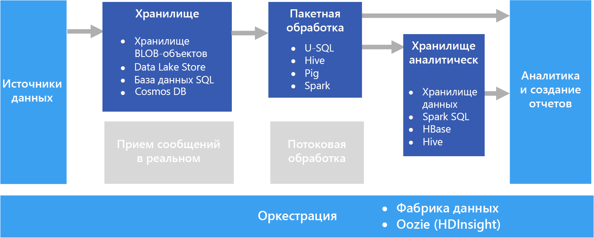

# Пакетная обработкаBatch processing

Типичный сценарий работы с большими данными — это пакетная обработка неактивных данных.A common big data scenario is batch processing of data at rest. В этом случае исходные данные загружаются в хранилище данных либо самим исходным приложением, либо рабочим процессом оркестрации.In this scenario, the source data is loaded into data storage, either by the source application itself or by an orchestration workflow. Затем данные параллельно обрабатываются на месте с помощью задания, которое также может быть инициировано рабочим процессом оркестрации.The data is then processed in-place by a parallelized job, which can also be initiated by the orchestration workflow. В рамках обработки может выполняться несколько итеративных шагов до того, как преобразованные результаты будут загружены в хранилище аналитических данных для последующего запроса компонентами аналитики и отчетов.The processing may include multiple iterative steps before the transformed results are loaded into an analytical data store, which can be queried by analytics and reporting components.

Например, журналы с веб-сервера могут быть скопированы в папку, а затем обработаны за ночь для формирования ежедневных отчетов о веб-действии.For example, the logs from a web server might be copied to a folder and then processed overnight to generate daily reports of web activity.

## Когда следует использовать это решениеWhen to use this solution

Пакетная обработка используется в различных сценариях — от простых преобразований данных до полного конвейера ETL (извлечение, преобразование и загрузка).Batch processing is used in a variety of scenarios, from simple data transformations to a more complete ETL (extract-transform-load) pipeline. В контексте больших данных пакетная обработка может выполняться для очень больших наборов данных, которые вычисляются длительное время.In a big data context, batch processing may operate over very large data sets, where the computation takes significant time. (Пример приведен в статье [Big data architectures](../big-data/index.md#lambda-architecture) (Архитектуры для обработки больших данных).) Пакетная обработка обычно приводит к дальнейшему интерактивному исследованию. В ее результате предоставляются готовые данные для моделей машинного обучения или данные записываются в хранилище, которое оптимизировано для аналитики и визуализации.(For example, see [Lambda architecture](../big-data/index.md#lambda-architecture).) Batch processing typically leads to further interactive exploration, provides the modeling-ready data for machine learning, or writes the data to a data store that is optimized for analytics and visualization.

Одним из примеров пакетной обработки является преобразование большого набора плоских, полуструктурированных CSV- или JSON-файлов в схематизированный и структурированный формат, который можно запрашивать.One example of batch processing is transforming a large set of flat, semi-structured CSV or JSON files into a schematized and structured format that is ready for further querying. Обычно данные преобразуются из необработанных форматов, используемых для приема (например, CSV), в двоичные форматы, которые более эффективны для запросов, так как хранят данные в формате столбцов и часто предоставляют индексы и встроенную статистику данных.Typically the data is converted from the raw formats used for ingestion (such as CSV) into binary formats that are more performant for querying because they store data in a columnar format, and often provide indexes and inline statistics about the data.

## СложностиChallenges

- **Формат данных и кодирование**.**Data format and encoding**. Некоторые из самых сложных проблем возникают, когда файлы используют непредвиденный формат или кодирование.Some of the most difficult issues to debug happen when files use an unexpected format or encoding. Например, исходные файлы могут использовать сочетание кодировки UTF-16 и UTF-8, содержать непредвиденные разделители (пробел вместо знака табуляции) или символы.For example, source files might use a mix of UTF-16 and UTF-8 encoding, or contain unexpected delimiters (space versus tab), or include unexpected characters. Другим распространенным примером являются текстовые поля, содержащие вкладки, пробелы или запятые, которые интерпретируются как разделители.Another common example is text fields that contain tabs, spaces, or commas that are interpreted as delimiters. Логика загрузки и анализа данных должна быть достаточно гибкой, чтобы обнаруживать и обрабатывать такие проблемы.Data loading and parsing logic must be flexible enough to detect and handle these issues.

- **Оркестрация временных срезов.****Orchestrating time slices.** Часто исходные данные помещаются в иерархию папок, которая отображает окна обработки, упорядоченные по годам, месяцам, дням, часам и т. д.Often source data is placed in a folder hierarchy that reflects processing windows, organized by year, month, day, hour, and so on. В некоторых случаях данные могут быть получены позднее.In some cases, data may arrive late. Например, предположим, что веб-сервер выходит из строя, а журналы за 7 марта не попадают в папку для обработки до 9 марта.For example, suppose that a web server fails, and the logs for March 7th don't end up in the folder for processing until March 9th. Они просто пропускаются, так как получены слишком поздно?Are they just ignored because they're too late? Может ли подчиненная логика обработки обрабатывать записи, полученные в неправильном порядке?Can the downstream processing logic handle out-of-order records?

## АрхитектураArchitecture

Архитектура пакетной обработки имеет следующие логические компоненты, показанные на схеме выше.A batch processing architecture has the following logical components, shown in the diagram above.

- **Хранилище данных.****Data storage.** Обычно это распределенное хранилище файлов, которое может служить репозиторием для значительных объемов больших файлов в различных форматах.Typically a distributed file store that can serve as a repository for high volumes of large files in various formats. Зачастую этот тип хранилища часто называют Data Lake.Generically, this kind of store is often referred to as a data lake. 

- **Пакетная обработка.****Batch processing.** Так как наборы данных очень велики, часто в решении обрабатываются длительные пакетные задания. Для них выполняется фильтрация, статистическая обработка и другие процессы подготовки данных к анализу.The high-volume nature of big data often means that solutions must process data files using long-running batch jobs to filter, aggregate, and otherwise prepare the data for analysis. Обычно в эти задания входит чтение исходных файлов, их обработка и запись выходных данных в новые файлы.Usually these jobs involve reading source files, processing them, and writing the output to new files. 

- **Хранилище аналитических данных.****Analytical data store.** Многие решения по обработке больших данных спроектированы так, чтобы подготавливать данные к анализу и предоставлять их в структурированном формате для запросов через средства аналитики.Many big data solutions are designed to prepare data for analysis and then serve the processed data in a structured format that can be queried using analytical tools. 

- **Анализ и создание отчетов**.**Analysis and reporting.** Большинство решений по обработке больших данных предназначены для анализа и составления отчетов, что позволяет получить важную информацию.The goal of most big data solutions is to provide insights into the data through analysis and reporting. 

- **Оркестрация.****Orchestration.** При пакетной обработке обычно требуется выполнить оркестрацию для переноса или копирования данных в хранилище, самой обработки, хранения аналитических данных и создания отчетов.With batch processing, typically some orchestration is required to migrate or copy the data into your data storage, batch processing, analytical data store, and reporting layers.

## Выбор технологийTechnology choices

Мы рекомендуем применять следующие технологии для пакетной обработки данных в Azure.The following technologies are recommended choices for batch processing solutions in Azure.

### Хранилище данныхData storage

- **Контейнеры больших двоичных объектов хранилища Azure.****Azure Storage Blob Containers**. Многие существующие бизнес-процессы Azure уже используют хранилище BLOB-объектов Azure, что делает его удобным решением для хранения больших данных.Many existing Azure business processes already make use of Azure blob storage, making this a good choice for a big data store.
- **Azure Data Lake Store****Azure Data Lake Store**. Azure Data Lake Store предлагает практически неограниченное хранилище для файлов любого размера и широкие возможности обеспечения безопасности, что удобно для хранения чрезвычайно крупных решений обработки больших данных, для которых требуется централизованное хранилище содержимого в гетерогенных форматах.Azure Data Lake Store offers virtually unlimited storage for any size of file, and extensive security options, making it a good choice for extremely large-scale big data solutions that require a centralized store for data in heterogeneous formats.

Дополнительные сведения см. в статье [Выбор технологии хранения больших данных в Azure](../technology-choices/data-storage.md).For more information, see [Data storage](../technology-choices/data-storage.md).

### Пакетная обработкаBatch processing

- **U-SQL**.**U-SQL**. Это язык обработки запросов, используемый в Azure Data Lake Analytics.U-SQL is the query processing language used by Azure Data Lake Analytics. Он сочетает декларативный характер SQL с процедурной расширяемостью C# и обеспечивает эффективную обработку данных в значительном масштабе за счет параллелизма.It combines the declarative nature of SQL with the procedural extensibility of C#, and takes advantage of parallelism to enable efficient processing of data at massive scale.
- **Hive**.**Hive**. Это SQL-подобный язык, который поддерживается в большинстве дистрибутивов Hadoop, включая HDInsight.Hive is a SQL-like language that is supported in most Hadoop distributions, including HDInsight. Он может использоваться для обработки данных из любого хранилища, совместимого с HDFS, включая хранилище BLOB-объектов Azure и Azure Data Lake Store.It can be used to process data from any HDFS-compatible store, including Azure blob storage and Azure Data Lake Store.
- **Pig**.**Pig**. Это декларативный язык обработки больших данных, используемый во многих дистрибутивах Hadoop, включая HDInsight.Pig is a declarative big data processing language used in many Hadoop distributions, including HDInsight. Он особенно удобен для обработки данных, которые не структурированы или структурированы частично.It is particularly useful for processing data that is unstructured or semi-structured.
- **Spark**.**Spark**. Платформа Spark поддерживает программы пакетной обработки, написанные на разных языках, включая Java, Scala и Python.The Spark engine supports batch processing programs written in a range of languages, including Java, Scala, and Python. Spark использует распределенную архитектуру для параллельной обработки данных в нескольких рабочих узлах.Spark uses a distributed architecture to process data in parallel across multiple worker nodes.

Дополнительные сведения см. в статье [Выбор технологии пакетной обработки в Azure](../technology-choices/batch-processing.md).For more information, see [Batch processing](../technology-choices/batch-processing.md).

### Хранилище аналитических данныхAnalytical data store

- **Хранилище данных SQL**.**SQL Data Warehouse**. Хранилище данных SQL Azure является управляемой службой на основе технологий базы данных SQL Server, которая оптимизирована для поддержки крупномасштабных рабочих нагрузок хранения данных.Azure SQL Data Warehouse is a managed service based on SQL Server database technologies and optimized to support large-scale data warehousing workloads.
- **Spark SQL**.**Spark SQL**. Spark SQL представляет собой API на базе Spark, позволяющий создавать блоки данных и таблицы, к которым можно обращаться через запросы с синтаксисом SQL.Spark SQL is an API built on Spark that supports the creation of dataframes and tables that can be queried using SQL syntax.
- **HBase**.**HBase**. Это хранилище NoSQL с малой задержкой, которое позволяет выполнять высокопроизводительные, гибкие запросы к структурированным и частично структурированным данным.HBase is a low-latency NoSQL store that offers a high-performance, flexible option for querying structured and semi-structured data.
- **Hive**.**Hive**. Помимо полезных возможностей для пакетной обработки, Hive предлагает архитектуру базы данных, концептуально похожую на структуру типичной системы управления реляционной базой данных.In addition to being useful for batch processing, Hive offers a database architecture that is conceptually similar to that of a typical relational database management system. Благодаря усовершенствованиям производительности запросов Hive за счет таких инноваций, как обработчик Tez и инициатива Stinger, таблицы Hive можно эффективно использовать в качестве источников для аналитических запросов в некоторых сценариях.Improvements in Hive query performance through innovations like the Tez engine and Stinger initiative mean that Hive tables can be used effectively as sources for analytical queries in some scenarios.

Дополнительные сведения см. в статье [Выбор хранилища аналитических данных в Azure](../technology-choices/analytical-data-stores.md).For more information, see [Analytical data stores](../technology-choices/analytical-data-stores.md).

### Аналитика и отчетностьAnalytics and reporting

- **Службы Azure Analysis Services**.**Azure Analysis Services**. Многие решения для больших данных эмулируют традиционные корпоративные архитектуры бизнес-аналитики за счет использования централизованной модели данных оперативной аналитической обработки (OLAP), часто называемую кубом, на которой могут быть основаны отчеты, панели мониторинга и интерактивный анализ событий.Many big data solutions emulate traditional enterprise business intelligence architectures by including a centralized online analytical processing (OLAP) data model (often referred to as a cube) on which reports, dashboards, and interactive “slice and dice” analysis can be based. Службы Azure Analysis Services поддерживают создание табличных моделей для этих целей.Azure Analysis Services supports the creation of tabular models to meet this need.
- **Power BI**.**Power BI**. Power BI позволяет аналитикам данных создавать интерактивные визуализации на основе моделей данных в модели OLAP или непосредственно из хранилища аналитических данных.Power BI enables data analysts to create interactive data visualizations based on data models in an OLAP model or directly from an analytical data store.
- **Microsoft Excel**.**Microsoft Excel**. Это одно из наиболее широко используемых программных приложений в мире, которое предлагает множество возможностей для анализа и визуализации данных.Microsoft Excel is one of the most widely used software applications in the world, and offers a wealth of data analysis and visualization capabilities. Аналитики данных могут использовать Excel для создания моделей данных документов из хранилищ аналитических данных или для извлечения данных из моделей данных OLAP в интерактивные сводные таблицы и диаграммы.Data analysts can use Excel to build document data models from analytical data stores, or to retrieve data from OLAP data models into interactive PivotTables and charts.

Дополнительные сведения см. в статье [Выбор технологии аналитики данных в Azure](../technology-choices/analysis-visualizations-reporting.md).For more information, see [Analytics and reporting](../technology-choices/analysis-visualizations-reporting.md).

### ОркестрацияOrchestration

- **Фабрика данных Azure**.**Azure Data Factory**. Конвейеры фабрики данных Azure можно использовать для определения последовательности действий, запланированных для повторяющихся временных окон.Azure Data Factory pipelines can be used to define a sequence of activities, scheduled for recurring temporal windows. Эти действия могут инициировать операции копирования данных, а также задания Hive, Pig, MapReduce или Spark в кластерах HDInsight по требованию, задания U-SQL в Azure Date Lake Analytics и хранимые процедуры в хранилище данных SQL Azure или базе данных SQL Azure.These activities can initiate data copy operations as well as Hive, Pig, MapReduce, or Spark jobs in on-demand HDInsight clusters; U-SQL jobs in Azure Date Lake Analytics; and stored procedures in Azure SQL Data Warehouse or Azure SQL Database.
- **Oozie** и **Sqoop**.**Oozie** and **Sqoop**. Oozie — это механизм автоматизации заданий для экосистемы Apache Hadoop. Он может использоваться для инициирования операций копирования данных, а также заданий Hive, Pig и MapReduce для обработки данных и заданий Sqoop для копирования данных между HDFS и базами данных SQL.Oozie is a job automation engine for the Apache Hadoop ecosystem and can be used to initiate data copy operations as well as Hive, Pig, and MapReduce jobs to process data and Sqoop jobs to copy data between HDFS and SQL databases.

Дополнительные сведения см. в статье [Choosing a data pipeline orchestration technology in Azure](../technology-choices/pipeline-orchestration-data-movement.md) (Выбор технологии оркестрации конвейера данных в Azure).For more information, see [Pipeline orchestration](../technology-choices/pipeline-orchestration-data-movement.md)
