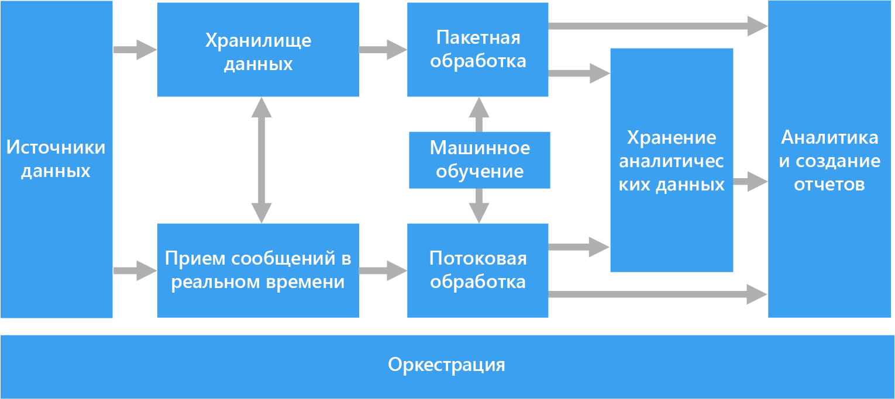
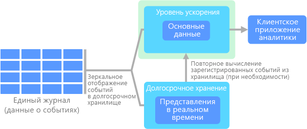

# Варианты архитектуры для обработки больших данных

Архитектура для обработки больших данных позволяет принимать, обрабатывать и анализировать данные, которые являются слишком объемными или слишком сложными для традиционных систем баз данных. Время, когда организации начинают использовать большие данные, зависит от возможностей пользователей и их средств. Для некоторых это могут быть сотни гигабайт данных, а для других — сотни терабайт. По мере совершенствования средств для работы с большими наборами данных, изменяется и значение больших данных. Зачастую этот термин связан со значением, которое можно извлечь из наборов данных с помощью расширенной аналитики, а не исключительно с размером данных. Хотя в этих случаях они обычно достаточно большие.

С годами ландшафт данных изменился. Кроме того, появились новые возможности для работы с данными. Стоимость хранилища значительно снизилась, в то время как стоимость средств для сбора данных продолжает расти. Некоторые данные поступают в ускоренном темпе, их постоянно нужно собирать и просматривать. Другие данные поступают более медленно, но в очень больших блоках. Они часто содержат данные журналов за десятилетия. Вы может сталкиваться c проблемой расширенной аналитики или проблемой, для решения которой требуется использовать машинное обучение. Это задачи, которые архитектура для обработки больших данных предназначена решить.

Решения для обработки больших данных обычно предназначены для одного или нескольких из следующих типов рабочей нагрузки:

- пакетная обработка источников неактивных больших данных;
- обработка больших данных в динамике в режиме реального времени;
- интерактивное изучение больших данных;
- прогнозная аналитика и машинное обучение.

Используйте архитектуру для обработки больших данных для следующих сценариев:

- хранение и обработка данных в объемах, слишком больших для традиционной базы данных.
- преобразование неструктурированных данных для анализа и создания отчетов;
- запись, обработка и анализ непривязанных потоков данных в режиме реального времени или с низкой задержкой;

## Компоненты архитектуры для обработки больших данных

На схеме ниже показаны логические компоненты, которые входят в архитектуру для обработки больших данных. Отдельные решения могут не содержать все компоненты в этой схеме.

Большинство архитектур для обработки больших данных включают некоторые или все перечисленные ниже компоненты.

- **Источники данных.** Все решения для обработки больших данных начинаются с одного или нескольких источников данных. Примеры приведены ниже.

  - Хранилища данных приложений, например реляционные базы данных.
  - Статические файлы, которые создаются приложениями, например файлы журнала веб-сервера.
  - Источники данных с передачей в режиме реального времени, например устройства Интернета вещей.

- **Хранилище данных.** Данные для пакетной обработки обычно хранятся в распределенном хранилище файлов, где могут содержаться значительные объемы больших файлов в различных форматах. Этот тип хранилища часто называют *озером данных*. Такое хранилище можно реализовать с помощью Azure Data Lake Store или контейнеров больших двоичных объектов в службе хранилища Azure.

- **Пакетная обработка.** Так как наборы данных очень велики, часто в решении обрабатываются длительные пакетные задания. Для них выполняется фильтрация, статистическая обработка и другие процессы подготовки данных к анализу. Обычно в эти задания входит чтение исходных файлов, их обработка и запись выходных данных в новые файлы. Варианты: выполнение заданий U-SQL в Azure Data Lake Analytics, использование пользовательских заданий Hive, Pig или Map/Reduce в кластере HDInsight Hadoop и применение программ Java, Scala или Python в кластере HDInsight Spark.

- **Прием сообщений в реальном времени.** Если решение содержит источники в режиме реального времени, в архитектуре должен быть предусмотрен способ сбора и сохранения сообщений в режиме реального времени для потоковой обработки. Это может быть простое хранилище данных с папкой, в которую входящие сообщения помещаются для обработки. Но для приема сообщений многим решениям требуется хранилище, которое можно использовать в качестве буфера. Такое хранилище должно поддерживать обработку с горизонтальным масштабированием, надежную доставку и другую семантику очереди сообщений. Эта часть архитектуры потоковой передачи часто называется потоковой буферизацией. Варианты: Центры событий Azure, Центр Интернета вещей и Kafka.

- **Потоковая обработка.** Сохранив сообщения, поступающие в режиме реального времени, система выполняет для них фильтрацию, статистическую обработку и другие процессы подготовки данных к анализу. Затем обработанные потоковые данные записываются в выходной приемник. Azure Stream Analytics предоставляет управляемую службу потоковой обработки на основе постоянного выполнения запросов SQL для непривязанных потоков. Кроме того, для потоковой передачи можно использовать технологии Apache с открытым кодом, например Storm и Spark Streaming в кластере HDInsight.

- **Хранилище аналитических данных.** Во многих решениях для обработки больших данных данные подготавливаются к анализу. Затем обработанные данные структурируются в соответствии с форматом запросов для средств аналитики. Хранилище аналитических данных, используемое для обработки таких запросов, может быть реляционной базой данных типа Kimball, как можно увидеть в большинстве традиционных решений бизнес-аналитики (BI). Кроме того, данные можно представить с помощью технологии NoSQL с низкой задержкой, такой как HBase или интерактивная база данных Hive, которая предоставляет абстракцию метаданных для файлов данных в распределенном хранилище. Хранилище данных SQL Azure предоставляет управляемую службу для хранения больших объемов данных в облаке. HDInsight поддерживает Interactive Hive, HBase и Spark SQL, которые также можно использовать, чтобы предоставлять данные для анализа.

- **Анализ и создание отчетов.** Большинство решений по обработке больших данных предназначены для анализа и составления отчетов, что позволяет получить важную информацию. Чтобы расширить возможности анализа данных, можно включить в архитектуру слой моделирования, например модель таблицы или многомерного куба OLAP в Azure Analysis Services. Также можно включить поддержку самостоятельной бизнес-аналитики с использованием технологий моделирования и визуализации в Microsoft Power BI или Microsoft Excel. Анализ и создание отчетов также может выполняться путем интерактивного изучения данных специалистами по их анализу и обработке. Для таких сценариев многие службы Azure поддерживают функции аналитического блокнота, например Jupyter, который позволяет пользователям применять свои навыки работы с Python или R. Для крупномасштабного изучения данных можно использовать Microsoft R Server (отдельно или со Spark).

- **Оркестрация.** Большинство решений для обработки больших данных состоят из повторяющихся рабочих процессов, во время которых преобразуются исходные данные, данные перемещаются между несколькими источниками и приемниками, обработанные данные загружаются в хранилища аналитических данных либо же результаты передаются непосредственно в отчет или на панель мониторинга. Чтобы автоматизировать эти рабочие процессы, вы можете использовать технологию оркестрации, такую как фабрика данных Azure или Apache Oozie и Sqoop.

## Лямбда-архитектура

При работе с очень большими наборами данных выполнение типа запросов, необходимых клиентам, может занять много времени. Эти запросы нельзя выполнить в режиме реального времени. Они часто требуют алгоритмов, например [MapReduce](https://en.wikipedia.org/wiki/MapReduce), которые работают параллельно по всему набору данных. Результаты затем сохраняются отдельно от необработанных данных и используются для выполнения запросов.

Недостатком этого подхода является то, что появляется задержка. Если обработка занимает несколько часов, запрос может возвращать результаты, которые были актуальными несколько часов назад. В идеале вам следует получить некоторые результаты в режиме реального времени (возможно, с некоторой потерей точности) и объединить их с результатами пакетной аналитики.

**Лямбда-архитектура**, впервые предложенная Натаном Марцом (Nathan Marz), устраняет эту проблему путем создания двух путей для потока данных. Все данные, поступающие в систему, проходят через эти два пути:

- На **пакетном уровне** (холодный путь) все входящие данные хранятся в необработанном виде и выполняется их пакетная обработка. Результаты этой обработки сохраняются в **пакетном представлении**.

- На **уровне ускорения** (критический путь) данные анализируются в режиме реального времени. Этот уровень обеспечивает минимальную задержку, хотя и за счет точности.

Пакетный уровень предоставляет результаты для **уровня обслуживания**, который индексирует пакетное представление для эффективного выполнения запросов. Уровень ускорения обновляет уровень обслуживания, отправляя добавочные обновления (с учетом последних данных).

Данные, которые поступают в критический путь, ограничены требованиями к задержке, наложенными уровнем ускорения, чтобы их можно было обработать как можно быстрее. Часто в этом случае следует обеспечить компромисс: некоторая потеря точности в пользу получения готовых данных как можно быстрее. Например, рассмотрите сценарий Интернета вещей, где большое количество датчиков температуры отправляют данные телеметрии. Уровень ускорения можно использовать для обработки скользящего временного окна входных данных.

На данные, которые поступают в холодный путь, с другой стороны, не распространяются те же требования к низкой задержке. Это обеспечивает высокую точность вычисления больших наборов данных, однако занимает много времени.

В результате критический и холодный пути объединяются в клиентском приложении аналитики. Если клиент должен отображать результаты своевременно, но потенциально с менее точными данными в режиме реального времени, он будет получать результаты из критического пути. В противном случае он будет выбирать результаты из холодного пути, чтобы отображать более точные данные, однако не так своевременно. Другими словами, критический путь содержит данные за относительно небольшой промежуток времени, после которого результаты можно обновить более точными данными из критического пути.

Необработанные данные, которые хранятся на пакетном уровне, являются неизменяемыми. Входящие данные всегда добавляются к имеющимся. Предыдущие данные никогда не перезаписываются. Любые изменения значения определенных данных хранятся в виде новой записи о событии с меткой времени. Это позволяет в любой момент времени выполнить повторное вычисление в журнале собранных данных. Возможность повторного вычисления пакетных представлений из исходных необработанных данных очень важна, так как это позволяет создавать представления по мере развития системы.

## Каппа-архитектура

Недостатком лямбда-архитектуры является ее сложность. Логика обработки применяется в двух различных местах, в холодном и критическом путях, с использованием различных структур. Это приводит к дублированию логики вычислений и усложняет управление архитектурой для обоих путей.

**Каппа-архитектура** была предложена Джеем Крепсом (Jay Kreps) в качестве альтернативы лямбда-архитектуре. Она имеет такие же основные цели, что и лямбда-архитектура, но с одним важным отличием: используется система обработки потоковых данных и все данные проходят по одному пути.

Имеется некоторое сходство с пакетным уровнем лямбда-архитектуры. Оно заключается в том, что данные являются неизменяемыми. Кроме того, собираются все данные, а не только их подмножество. Данные принимаются как поток событий в распределенном и отказоустойчивом едином журнале. Эти события упорядочиваются, и текущее состояние события изменяется только при добавлении нового события. Аналогично уровню ускорения лямбда-архитектуры вся обработка событий выполняется во входном потоке и сохраняется как представление в режиме реального времени.

Если необходимо повторно вычислить весь набор данных (аналогично тому, что происходит на пакетном уровне в лямбда-архитектуре), просто воспроизведите поток. Чтобы завершить вычисление вовремя, обычно используется параллелизм.

## Интернет вещей.

С практической точки зрения Интернет вещей представляет все устройства, подключенные к Интернету. Сюда входят ПК, мобильный телефон, умные часы, умный термостат, умный холодильник, подключенный автомобиль, импланты для кардиомониторинга и все остальные устройства, которые подключены к Интернету и отправляют или получают данные. Количество подключенных устройств растет каждый день, как и объем собираемых с них данных. Часто эти данные собираются в среды с большим количеством ограничений, а иногда и с высокой задержкой. В других случаях данные отправляются из сред с малой задержкой тысячами или миллионами устройств, требуя возможности быстро принимать данные и обрабатывать их соответствующим образом. Таким образом, чтобы работать с этими ограничениями и уникальными требованиями, требуется продуманное планирование.

Управляемые событиями архитектуры очень удобны при работе с решениями Интернета вещей. На следующей схеме представлены возможные варианты логической архитектуры для Интернета вещей. Особое внимание в этой схеме уделяется компонентам архитектуры для потоковой передачи событий.

**Облачный шлюз** принимает события от устройств на границе облака, используя надежную службу сообщений с низкой задержкой.

Устройства могут отправлять события в облачный шлюз напрямую или через **полевой шлюз**. Полевой шлюз — это специальное устройство или программа, обычно размещаемые рядом с устройствами, которые получают события и пересылают их в облачный шлюз. Полевой шлюз может выполнять некоторую предварительную обработку событий, собираемых с устройств, например фильтрацию, статистическую обработку или преобразование протоколов.

Полученные события проходят через один или несколько **обработчиков потока**, которые передают данные в другие системы (например, хранилище данных) или выполняют аналитическую или другую обработку.

Ниже приводятся примеры типичных процессов обработки. (Очевидно, что этот список не является исчерпывающим.)

- Сохранение данных о событиях в "холодное" хранилище для архивации или пакетной аналитики.

- Аналитика критического пути, то есть анализ потока событий почти в режиме реального времени для обнаружения аномалий, выявления закономерностей в скользящих диапазонах времени или создания оповещений при выполнении определенных условий в потоке.

- Обработка специальных типов сообщений, не относящихся к телеметрии, например уведомлений и тревожных сигналов.

- Машинное обучение.

Серые блоки обозначают компоненты системы Интернета вещей, не связанные напрямую с потоковой передачей событий. Они включены в схему для полноты представления.

- **Реестр устройств** — это база данных о подготовленных устройствах, которая содержит идентификаторы устройств и некоторые метаданные, например расположение.

- **API подготовки** — это общий внешний интерфейс для подготовки и регистрации новых устройств.

- В некоторых решениях Интернета вещей допускается отправка **управляющих сообщений** на устройства.

Соответствующие службы Azure:

- [Центр Интернета вещей Azure](https://azure.microsoft.com/services/iot-hub/)
- [Центры событий Azure](https://azure.microsoft.com/services/event-hubs/)
- [Azure Stream Analytics](https://azure.microsoft.com/services/stream-analytics/)  

Дополнительные сведения об Интернете вещей в Azure см. в статье об [эталонной архитектуре Интернета вещей Microsoft Azure](https://azure.microsoft.com/updates/microsoft-azure-iot-reference-architecture-available/).
