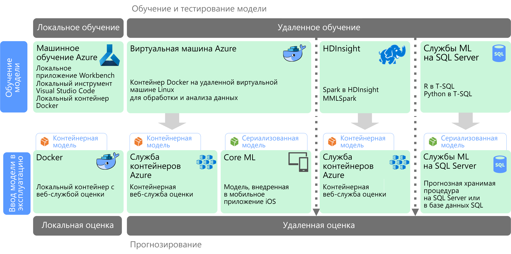

# Машинное обучение с поддержкой масштабированияMachine learning at scale

Машинное обучение (ML) — это метод обучения прогнозных моделей на основе математических алгоритмов.Machine learning (ML) is a technique used to train predictive models based on mathematical algorithms. При машинном обучении анализируются связи между полями данных для прогнозирования неизвестных значений.Machine learning analyzes the relationships between data fields to predict unknown values.

Создание и развертывание модели машинного обучения выполняется итеративно:Creating and deploying a machine learning model is an iterative process:

- Специалисты по обработке и анализу данных просматривают исходные данные и находят связи между *компонентами* и прогнозируемыми *метками*.Data scientists explore the source data to determine relationships between *features* and predicted *labels*.
- Затем они обучают и проверяют модели на основе подходящих алгоритмов, стараясь определить оптимальную модель прогнозирования.The data scientists train and validate models based on appropriate algorithms to find the optimal model for prediction.
- Найденная оптимальная модель развертывается в рабочей среде в форме веб-службы или другой инкапсулированной функции.The optimal model is deployed into production, as a web service or some other encapsulated function.
- По мере сбора новых данных модель периодически проходит повторное обучение, что повышает ее эффективность.As new data is collected, the model is periodically retrained to improve its effectiveness.

Для поддержки масштабируемости в машинном обучении нужно решить две задачи.Machine learning at scale addresses two different scalability concerns. Во-первых, обучение модели по большим наборам данных требует высокой производительности и масштабируемости вычислительного кластера.The first is training a model against large data sets that require the scale-out capabilities of a cluster to train. Во-вторых, ввод модели в эксплуатацию должен допускать масштабирование в соответствии с требованиями приложений, в которых используется модель.The second centers is operationalizating the learned model in a way that can scale to meet the demands of the applications that consume it. Обычно для этого прогнозная функция развертывается в виде веб-службы, которую можно легко масштабировать.Typically this is accomplished by deploying the predictive capabilities as a web service that can then be scaled out.

Машинное обучение с поддержкой масштабирования обеспечивает мощные прогностические возможности, так как с увеличением объема данных модели совершенствуются.Machine learning at scale has the benefit that it can produce powerful, predictive capabilities because better models typically result from more data. После обучения модели ее можно развернуть в виде высокопроизводительной и масштабируемой веб-службы без учета состояния.Once a model is trained, it can be deployed as a stateless, highly-performant, scale-out web service.

## Подготовка и обучение моделиModel preparation and training

На этапах подготовки и обучения модели специалисты по обработке и анализу данных интерактивно исследуют данные с помощью языков Python, R и др., чтобы достичь следующих целей:During the model preparation and training phase, data scientists explore the data interactively using languages like Python and R to:

- извлечь образцы из хранилищ данных большого объема;Extract samples from high volume data stores.
- найти и устранить выбросы значений, дубликаты и пустые значения, то есть очистить данные;Find and treat outliers, duplicates, and missing values to clean the data.
- определить зависимости и связи данных с помощью статистического анализа и визуализаций;Determine correlations and relationships in the data through statistical analysis and visualization.
- создать вычисляемые компоненты, повышающие прогнозируемость статистических связей;Generate new calculated features that improve the predictiveness of statistical relationships.
- обучить модели машинного обучения на основе прогнозных алгоритмов;Train ML models based on predictive algorithms.
- проверить обученные модели с использованием данных, не включенных в набор данных для обучения.Validate trained models using data that was withheld during training.

Чтобы упростить этап интерактивного анализа и моделирования, платформа данных должна предоставлять и поддерживать разнообразные средства для изучения данных.To support this interactive analysis and modeling phase, the data platform must enable data scientists to explore data using a variety of tools. Кроме того, обучение комплексной модели машинного обучения требует крайне ресурсоемких вычислений для обработки больших объемов данных. Поэтому необходимо предоставить достаточный объем ресурсов для масштабирования процесса обучения.Additionally, the training of a complex machine learning model can require a lot of intensive processing of high volumes of data, so sufficient resources for scaling out the model training is essential.

## Развертывание и использование моделиModel deployment and consumption

Когда модель будет готова к развертыванию, ее можно инкапсулировать в веб-службу и развернуть в облаке, на пограничном устройстве или в корпоративной среде выполнения машинного обучения.When a model is ready to be deployed, it can be encapsulated as a web service and deployed in the cloud, to an edge device, or within an enterprise ML execution environment. Этот процесс развертывания называется вводом в эксплуатацию.This deployment process is referred to as operationalization.

## СложностиChallenges

Машинное обучение с поддержкой масштабирования сопровождается несколькими сложностями:Machine learning at scale produces a few challenges:

- Для обучения модели часто требуется большой объем данных, особенно если это модель глубокого обучения.You typically need a lot of data to train a model, especially for deep learning models.
- Эти большие наборы данных должны быть готовы до того, как вы сможете приступить к обучению.You need to prepare these big data sets before you can even begin training your model.
- Этап обучения модели требует доступа к хранилищам больших данных.The model training phase must access the big data stores. Обычно обучение модели выполняют на основе кластера больших данных (например, Spark), который используется для подготовки данных.It's common to perform the model training using the same big data cluster, such as Spark, that is used for data preparation.
- В некоторых ситуациях, например для глубокого обучения, необходимо использовать кластер, который поддерживает не только горизонтальное масштабирование процессоров, но и узлы с GPU.For scenarios such as deep learning, not only will you need a cluster that can provide you scale out on CPUs, but your cluster will need to consist of GPU-enabled nodes.

## Машинное обучение с поддержкой масштабирования в AzureMachine learning at scale in Azure

Прежде чем выбирать службу машинного обучения для обучения модели и ее ввода в эксплуатацию, вам следует проанализировать потребность в таком обучении. Возможно, одна из готовых моделей полностью соответствует всем вашим требованиям.Before deciding which ML services to use in training and operationalization, consider whether you need to train a model at all, or if a prebuilt model can meet your requirements. Часто для применения готовой модели достаточно настроить вызов веб-службы или загрузить модель с помощью библиотеки машинного обучения.In many cases, using a prebuilt model is just a matter of calling a web service or using an ML library to load an existing model. Вот некоторые из доступных вариантов:Some options include:

- используйте веб-службы, предоставляемые Microsoft Cognitive Services;Use the web services provided by Microsoft Cognitive Services.
- используйте предварительно обученные модели нейронных сетей, предоставляемые в Cognitive Toolkit;Use the pretrained neural network models provided by Cognitive Toolkit.
- внедрите сериализованные модели, предоставляемые Core ML для приложений iOS.Embed the serialized models provided by Core ML for an iOS apps.

Если готовые модели не соответствуют особенностям ваших данных или сценария применения, примените одну из служб Azure: Машинное обучение Azure, HDInsight с библиотеками Spark MLlib и MMLSpark, Azure Databricks, Cognitive Toolkit и Машинное обучение SQL.If a prebuilt model does not fit your data or your scenario, options in Azure include Azure Machine Learning, HDInsight with Spark MLlib and MMLSpark, Azure Databricks, Cognitive Toolkit, and SQL Machine Learning Services. Если вы решили использовать пользовательскую модель, разработайте конвейер для обучения модели и ее ввода в эксплуатацию.If you decide to use a custom model, you must design a pipeline that includes model training and operationalization.

Список доступных в Azure технологий машинного обучения можно получить в следующих статьях:For a list of technology choices for ML in Azure, see the following topics:

- [Выбор технологии Microsoft Cognitive ServicesChoosing a cognitive services technology](../technology-choices/cognitive-services.md)
- [Выбор технологии машинного обучения в AzureChoosing a machine learning technology](../technology-choices/data-science-and-machine-learning.md)
- [Выбор технологии обработки естественных языков в AzureChoosing a natural language processing technology](../technology-choices/natural-language-processing.md)

## Дополнительная информацияNext steps

Следующая эталонная архитектура демонстрирует сценарии машинного обучения в Azure:The following reference architectures show machine learning scenarios in Azure:

- [Пакетная оценка для моделей глубокого обучения в AzureBatch scoring on Azure for deep learning models](../../reference-architectures/ai/batch-scoring-deep-learning.md)
- [Оценка в реальном времени моделей Python scikit-learn и глубокого обучения в AzureReal-time scoring of Python Scikit-Learn and Deep Learning Models on Azure](../../reference-architectures/ai/realtime-scoring-python.md)