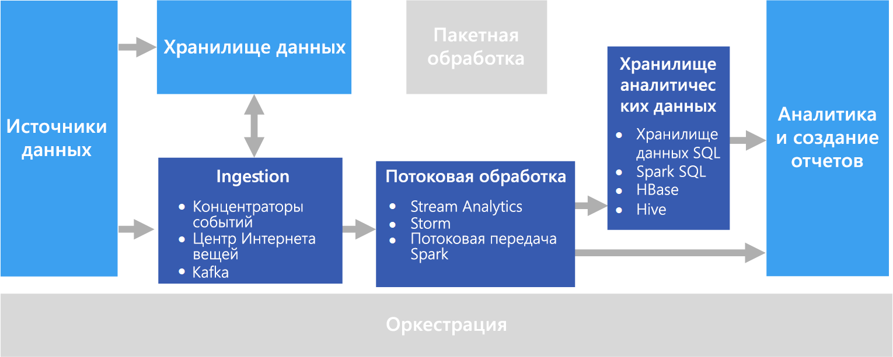

# Обработка в режиме реального времени

Обработка в режиме реального времени выполняется для потоков данных, получаемых в реальном времени и обрабатываемых с минимальной задержкой для создания отчетов или автоматизированного реагирования в режиме реального времени (или приближенном к реальному времени). Например, решение для мониторинга дорожного движения в режиме реального времени позволяет отслеживать зоны интенсивного движения по данным от датчиков. На основе этих данных можно динамически обновлять карту с информацией о пробках или автоматического регулировать движение с помощью специальных полос или других систем управления дорожным движением.

Обработкой в режиме реального времени считается обработка непривязанного потока входных данных с минимальным временем задержки &mdash; несколько миллисекунд или секунд. Эти входящие данные обычно поступают в неструктурированном или полуструктурированном формате, например JSON. Требования к обработке здесь такие же, как и в случае [пакетной обработки](./batch-processing.md), кроме дополнительного ограничения по времени для поддержки использования в режиме реального времени.

Обработанные данные обычно сохраняются в хранилище аналитических данных, которое оптимизировано для анализа и визуализации. Также обработанные данные можно напрямую принимать на слоях аналитической обработки и отчетности для анализа, бизнес-аналитики и визуализации на панелях мониторинга в режиме реального времени.

## Сложности

Одной из главных проблем в любой системе обработки в режиме реального времени является поддержание возможности приема и сохранения сообщений в режиме реального времени, особенно при больших объемах данных. Обработка должна выполняться так, чтобы не блокировать конвейер приема данных. Нужно использовать хранилище данных, поддерживающее операции записи в больших объемах. Еще одна проблема — создание возможностей для быстрого реагирования, например для создания оповещений в режиме реального времени или представления данных на панели мониторинга в режиме реального времени (или приближенном к реальному времени).

## Архитектура

Архитектура обработки в режиме реального времени состоит из следующих логических компонентов.

- **Прием сообщений в реальном времени**. Архитектура должна включать средства сбора и сохранения сообщений в режиме реального времени, доступные для объекта-получателя, обрабатывающего поток. В простых случаях роль такой службы может выполнять обычное хранилище данных, в одной из папок которого размещаются новые сообщения. Но чаще для этого компонента нужны специализированные брокеры обмена сообщениями, например Центры событий Azure, которые выполняют роль буфера для входящих сообщений. Брокер обмена сообщениями должен поддерживать масштабируемую обработку и надежную доставку.

- **Потоковая обработка.** Сохранив сообщения, поступающие в режиме реального времени, система выполняет для них фильтрацию, статистическую обработку и другие процессы подготовки данных к анализу.

- **Хранилище аналитических данных.** Многие решения по обработке больших данных спроектированы так, чтобы подготавливать данные к анализу и предоставлять их в структурированном формате для запросов через средства аналитики.

- **Анализ и создание отчетов**. Большинство решений по обработке больших данных предназначены для анализа и составления отчетов, что позволяет получить важную информацию.

## Выбор технологий

Мы рекомендуем применять следующие технологии для обработки данных в режиме реального времени в Azure.

### Прием сообщений в реальном времени

- **Центры событий Azure**. Центры событий Azure — это решение для управления очередями сообщений, позволяющее ежесекундно обрабатывать миллионы сообщений о событиях. Собранные данные о событиях могут обрабатываться несколькими объектами-получателями в параллельном режиме.
- **Центр Интернета вещей Azure**. Центр Интернета вещей Azure поддерживает двунаправленный обмен данными между устройствами, подключенными к Интернету, а также масштабируемую очередь сообщений от нескольких миллионов одновременно подключенных устройств.
- **Apache Kafka**. Приложение с открытым кодом Kafka поддерживает очереди сообщений, потоковую обработку с возможностью масштабирования до нескольких миллионов сообщений в секунду от множества отправителей сообщений, и перенаправление их множеству объектов-получателей. Kafka доступно в Azure как тип кластера HDInsight.

Дополнительные сведения см. в статье о [приеме сообщений в реальном времени](../technology-choices/real-time-ingestion.md).

### Хранилище данных

- **Контейнеры хранилища BLOB-объектов Azure** или **Azure Data Lake Store**. Входящие данные в режиме реального времени обычно поступают в брокер обмена сообщениями (см. выше), но в некоторых случаях следует отслеживать создание новых файлов в папке и обрабатывать их по мере появления или обновления. Кроме того, многие системы обработки в режиме реального времени объединяют потоки данных с некоторыми статичными эталонными данными, которые удобно держать в хранилище файлов. И наконец, хранилище файлов можно применить как выходное назначение для собранных данных в реальном времени, где они будут архивироваться или подвергаться дополнительной пакетной обработке в [лямбда-архитектуре](../big-data/index.md#lambda-architecture).

Дополнительные сведения см. в статье о [хранилище данных](../technology-choices/data-storage.md).

### Потоковая обработка

- **Azure Stream Analytics**. Azure Stream Analytics может выполнять постоянные запросы к непривязанному потоку данных. Эти запросы получают потоки данных из хранилища или от брокеров обмена сообщениями, фильтруют данные и статистически обрабатывают их по временным окнам, а затем записывают результаты в приемники, например в хранилище данных, базы данных или сразу в отчеты Power BI. Stream Analytics использует язык запросов на основе SQL, который поддерживает темпоральные и геопространственные конструкции и которые могут быть расширены с помощью JavaScript.
- **Storm**. Платформа с открытым кодом Apache Storm выполняет потоковую обработку данных на основе топологии воронок и сит, позволяя использовать, обрабатывать и выводить результаты от источников потоковой передачи в режиме реального времени. Вы можете подготовить Storm в кластере Azure HDInsight, а топологию для него реализовать на Java или C#.
- **Потоковая передача Spark**. Распределенная платформа Apache Spark с открытым кодом предназначена для простой обработки данных. Spark предоставляет API потоковой передачи Spark, в котором можно написать код на любом поддерживаемом Spark языке, включая Java, Python и Scala. Начиная с версии Spark 2.0 появился API структурированной потоковой передачи Spark, в котором реализована более простая и более согласованная модель программирования. Spark 2.0 доступен в кластере Azure HDInsight.

Дополнительные сведения см. в статье по [потоковой обработке](../technology-choices/stream-processing.md).

### Хранилище аналитических данных

- **Хранилище данных SQL**, **HBase**, **Spark** или **Hive**. Обработанные данные в режиме реального времени можно хранить в реляционной базе данных, например в хранилище данных SQL Azure, в HBase или другом хранилище NoSQL, а также в виде файлов в распределенном хранилище, на основе которых можно определить и использовать таблицы Spark или Hive.

Дополнительные сведения см. в статье о [хранилище аналитических данных](../technology-choices/analytical-data-stores.md).

### Аналитика и отчетность

- **Azure Analysis Services**, **Power BI** и **Microsoft Excel**. Обработанные данные в режиме реального времени, которые содержатся в хранилище аналитических данных, можно использовать для создания хронологических отчетов и аналитики таким же образом, как данные пакетной обработки. Кроме того, можно использовать Power BI для публикации отчетов и визуализации в режиме реального времени (или приближенном к реальному времени) на основе данных из источников аналитических данных с низкой задержкой, а иногда даже напрямую из выходных данных потоковой обработки.

Дополнительные сведения см. в статье [об аналитике и отчетности](../technology-choices/analysis-visualizations-reporting.md).

В решении, полностью нацеленном на обработку в режиме реального времени, основную часть процессов оркестрации выполняют компоненты приема сообщений и обработки потоков. Но в лямбда-архитектуре, которая сочетает пакетную обработку и обработку в режиме реального времени, может потребоваться отдельная платформа оркестрации, например фабрика данных Azure или Apache Oozie и Sqoop, чтобы управлять рабочими процессами пакетной обработки для собранных данных в режиме реального времени.

## Дополнительная информация

На следующей схеме эталонной архитектуры представлен сквозной конвейер потоков данных:

- [Обработка потоков данных с помощью Azure Stream Analytics](../../reference-architectures/data/stream-processing-stream-analytics.md)