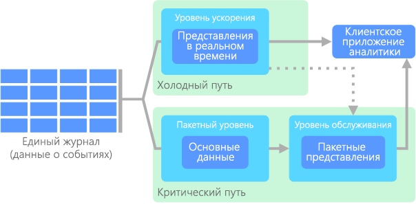

# Варианты архитектуры для обработки больших данныхBig data architectures

Архитектура для обработки больших данных позволяет принимать, обрабатывать и анализировать данные, которые являются слишком объемными или слишком сложными для традиционных систем баз данных.A big data architecture is designed to handle the ingestion, processing, and analysis of data that is too large or complex for traditional database systems. Время, когда организации начинают использовать большие данные, зависит от возможностей пользователей и их средств.The threshold at which organizations enter into the big data realm differs, depending on the capabilities of the users and their tools. Для некоторых это могут быть сотни гигабайт данных, а для других — сотни терабайт.For some, it can mean hundreds of gigabytes of data, while for others it means hundreds of terabytes. По мере совершенствования средств для работы с большими наборами данных, изменяется и значение больших данных.As tools for working with big data sets advance, so does the meaning of big data. Зачастую этот термин связан со значением, которое можно извлечь из наборов данных с помощью расширенной аналитики, а не исключительно с размером данных. Хотя в этих случаях они обычно достаточно большие.More and more, this term relates to the value you can extract from your data sets through advanced analytics, rather than strictly the size of the data, although in these cases they tend to be quite large.

С годами ландшафт данных изменился.Over the years, the data landscape has changed. Кроме того, появились новые возможности для работы с данными.What you can do, or are expected to do, with data has changed. Стоимость хранилища значительно снизилась, в то время как стоимость средств для сбора данных продолжает расти.The cost of storage has fallen dramatically, while the means by which data is collected keeps growing. Некоторые данные поступают в ускоренном темпе, их постоянно нужно собирать и просматривать.Some data arrives at a rapid pace, constantly demanding to be collected and observed. Другие данные поступают более медленно, но в очень больших блоках. Они часто содержат данные журналов за десятилетия.Other data arrives more slowly, but in very large chunks, often in the form of decades of historical data. Вы может сталкиваться c проблемой расширенной аналитики или проблемой, для решения которой требуется использовать машинное обучение.You might be facing an advanced analytics problem, or one that requires machine learning. Это задачи, которые архитектура для обработки больших данных предназначена решить.These are challenges that big data architectures seek to solve.

Решения для обработки больших данных обычно предназначены для одного или нескольких из следующих типов рабочей нагрузки:Big data solutions typically involve one or more of the following types of workload:

* пакетная обработка источников неактивных больших данных;Batch processing of big data sources at rest.
* обработка больших данных в динамике в режиме реального времени;Real-time processing of big data in motion.
* интерактивное изучение больших данных;Interactive exploration of big data.
* прогнозная аналитика и машинное обучение.Predictive analytics and machine learning.

Используйте архитектуру для обработки больших данных для следующих сценариев:Consider big data architectures when you need to:

* хранение и обработка данных в объемах, слишком больших для традиционной базы данных.Store and process data in volumes too large for a traditional database.
* преобразование неструктурированных данных для анализа и создания отчетов;Transform unstructured data for analysis and reporting.
* запись, обработка и анализ непривязанных потоков данных в режиме реального времени или с низкой задержкой;Capture, process, and analyze unbounded streams of data in real time, or with low latency.

## Компоненты архитектуры для обработки больших данныхComponents of a big data architecture

На схеме ниже показаны логические компоненты, которые входят в архитектуру для обработки больших данных.The following diagram shows the logical components that fit into a big data architecture. Отдельные решения могут не содержать все компоненты в этой схеме.Individual solutions may not contain every item in this diagram.

 

Большинство архитектур для обработки больших данных включают некоторые или все перечисленные ниже компоненты.Most big data architectures include some or all of the following components:

* **Источники данных.****Data sources**. Все решения для обработки больших данных начинаются с одного или нескольких источников данных.All big data solutions start with one or more data sources. Примеры приведены ниже.Examples include:

    * Хранилища данных приложений, например реляционные базы данных.Application data stores, such as relational databases.
    * Статические файлы, которые создаются приложениями, например файлы журнала веб-сервера.Static files produced by applications, such as web server log files.
    * Источники данных с передачей в режиме реального времени, например устройства Интернета вещей.Real-time data sources, such as IoT devices.

* **Хранилище данных.****Data storage**. Данные для пакетной обработки обычно хранятся в распределенном хранилище файлов, где могут содержаться значительные объемы больших файлов в различных форматах.Data for batch processing operations is typically stored in a distributed file store that can hold high volumes of large files in various formats. Этот тип хранилища часто называют *озером данных*.This kind of store is often called a *data lake*. Такое хранилище можно реализовать с помощью Azure Data Lake Store или контейнеров больших двоичных объектов в службе хранилища Azure.Options for implementing this storage include Azure Data Lake Store or blob containers in Azure Storage.

* **Пакетная обработка.****Batch processing**. Так как наборы данных очень велики, часто в решении обрабатываются длительные пакетные задания. Для них выполняется фильтрация, статистическая обработка и другие процессы подготовки данных к анализу.Because the data sets are so large, often a big data solution must process data files using long-running batch jobs to filter, aggregate, and otherwise prepare the data for analysis. Обычно в эти задания входит чтение исходных файлов, их обработка и запись выходных данных в новые файлы.Usually these jobs involve reading source files, processing them, and writing the output to new files. Варианты: выполнение заданий U-SQL в Azure Data Lake Analytics, использование пользовательских заданий Hive, Pig или Map/Reduce в кластере HDInsight Hadoop и применение программ Java, Scala или Python в кластере HDInsight Spark.Options include running U-SQL jobs in Azure Data Lake Analytics, using Hive, Pig, or custom Map/Reduce jobs in an HDInsight Hadoop cluster, or using Java, Scala, or Python programs in an HDInsight Spark cluster.

* **Прием сообщений в реальном времени.****Real-time message ingestion**. Если решение содержит источники в режиме реального времени, в архитектуре должен быть предусмотрен способ сбора и сохранения сообщений в режиме реального времени для потоковой обработки.If the solution includes real-time sources, the architecture must include a way to capture and store real-time messages for stream processing. Это может быть простое хранилище данных с папкой, в которую входящие сообщения помещаются для обработки.This might be a simple data store, where incoming messages are dropped into a folder for processing. Но для приема сообщений многим решениям требуется хранилище, которое можно использовать в качестве буфера. Такое хранилище должно поддерживать обработку с горизонтальным масштабированием, надежную доставку и другую семантику очереди сообщений.However, many solutions need a message ingestion store to act as a buffer for messages, and to support scale-out processing, reliable delivery, and other message queuing semantics. Эта часть архитектуры потоковой передачи часто называется потоковой буферизацией.This portion of a streaming architecture is often referred to as stream buffering. Варианты: концентраторы событий Azure, Центр Интернета вещей и Kafka.Options include Azure Event Hubs, Azure IoT Hub, and Kafka.

* **Потоковая обработка.****Stream processing**. Сохранив сообщения, поступающие в режиме реального времени, система выполняет для них фильтрацию, статистическую обработку и другие процессы подготовки данных к анализу.After capturing real-time messages, the solution must process them by filtering, aggregating, and otherwise preparing the data for analysis. Затем обработанные потоковые данные записываются в выходной приемник.The processed stream data is then written to an output sink. Azure Stream Analytics предоставляет управляемую службу потоковой обработки на основе постоянного выполнения запросов SQL для непривязанных потоков.Azure Stream Analytics provides a managed stream processing service based on perpetually running SQL queries that operate on unbounded streams. Кроме того, для потоковой передачи можно использовать технологии Apache с открытым кодом, например Storm и Spark Streaming в кластере HDInsight.You can also use open source Apache streaming technologies like Storm and Spark Streaming in an HDInsight cluster.

* **Хранилище аналитических данных.****Analytical data store**. Во многих решениях для обработки больших данных данные подготавливаются к анализу. Затем обработанные данные структурируются в соответствии с форматом запросов для средств аналитики.Many big data solutions prepare data for analysis and then serve the processed data in a structured format that can be queried using analytical tools. Хранилище аналитических данных, используемое для обработки таких запросов, может быть реляционной базой данных типа Kimball, как можно увидеть в большинстве традиционных решений бизнес-аналитики (BI).The analytical data store used to serve these queries can be a Kimball-style relational data warehouse, as seen in most traditional business intelligence (BI) solutions. Кроме того, данные можно представить с помощью технологии NoSQL с низкой задержкой, такой как HBase или интерактивная база данных Hive, которая предоставляет абстракцию метаданных для файлов данных в распределенном хранилище.Alternatively, the data could be presented through a low-latency NoSQL technology such as HBase, or an interactive Hive database that provides a metadata abstraction over data files in the distributed data store. Хранилище данных SQL Azure предоставляет управляемую службу для хранения больших объемов данных в облаке.Azure SQL Data Warehouse provides a managed service for large-scale, cloud-based data warehousing. HDInsight поддерживает Interactive Hive, HBase и Spark SQL, которые также можно использовать, чтобы предоставлять данные для анализа.HDInsight supports Interactive Hive, HBase, and Spark SQL, which can also be used to serve data for analysis.

* **Анализ и создание отчетов.****Analysis and reporting**. Большинство решений по обработке больших данных предназначены для анализа и составления отчетов, что позволяет получить важную информацию.The goal of most big data solutions is to provide insights into the data through analysis and reporting. Чтобы расширить возможности анализа данных, можно включить в архитектуру слой моделирования, например модель таблицы или многомерного куба OLAP в Azure Analysis Services.To empower users to analyze the data, the architecture may include a data modeling layer, such as a multidimensional OLAP cube or tabular data model in Azure Analysis Services. Также можно включить поддержку самостоятельной бизнес-аналитики с использованием технологий моделирования и визуализации в Microsoft Power BI или Microsoft Excel.It might also support self-service BI, using the modeling and visualization technologies in Microsoft Power BI or Microsoft Excel. Анализ и создание отчетов также может выполняться путем интерактивного изучения данных специалистами по их анализу и обработке.Analysis and reporting can also take the form of interactive data exploration by data scientists or data analysts. Для таких сценариев многие службы Azure поддерживают функции аналитического блокнота, например Jupyter, который позволяет пользователям применять свои навыки работы с Python или R. Для крупномасштабного изучения данных можно использовать Microsoft R Server (отдельно или со Spark).For these scenarios, many Azure services support analytical notebooks, such as Jupyter, enabling these users to leverage their existing skills with Python or R. For large-scale data exploration, you can use Microsoft R Server, either standalone or with Spark.

* **Оркестрация.****Orchestration**. Большинство решений для обработки больших данных состоят из повторяющихся рабочих процессов, во время которых преобразуются исходные данные, данные перемещаются между несколькими источниками и приемниками, обработанные данные загружаются в хранилища аналитических данных либо же результаты передаются непосредственно в отчет или на панель мониторинга.Most big data solutions consist of repeated data processing operations, encapsulated in workflows, that transform source data, move data between multiple sources and sinks, load the processed data into an analytical data store, or push the results straight to a report or dashboard. Чтобы автоматизировать эти рабочие процессы, вы можете использовать технологию оркестрации, такую как фабрика данных Azure или Apache Oozie и Sqoop.To automate these workflows, you can use an orchestration technology such Azure Data Factory or Apache Oozie and Sqoop.

## Data LakeData lake

Если вы читали документацию о больших данных, скорее всего, вам попадался термин _Data Lake_.If you have read anything about big data, it's likely you've seen the term _data lake_. Вы могли видеть его в названии продукта или в качестве концепции для хранения больших объемов данных.You may have seen the word used for the name of a product, or perhaps a concept about storing large quantities of data. 

Data Lake состоит из компонентов хранения и обработки данных.A data lake consists of both storage and processing. Хранилище Data Lake создано для нескольких целей: обеспечение отказоустойчивости, бесконечной масштабируемости и высокой пропускной способности при получении данных любых форм и размеров.Data lake storage is built with several goals in mind: fault-tolerance, infinite scalability, and high-throughput ingestion of data with varying shapes and sizes. Компонент обработки Data Lake включает в себя один или несколько модулей обработки, созданных для этих целей, и может работать с данными, хранящимися в Data Lake в нужном масштабе.Data lake processing involves one or more processing engines built with these goals in mind, and can operate on data stored in a data lake at scale.

Хранилища Data Lake Store часто используются при потоковой передаче событий или в сценариях Интернета вещей, так как они могут хранить большие объемы реляционных и нереляционных данных без преобразования или определения схемы.Data lake stores are often used in event streaming or IoT scenarios, because they can persist large amounts of relational and nonrelational data without transformation or schema definition. Они предназначены для обработки больших объемов мелких записей с низкой задержкой и оптимизированы для высокой пропускной способности.They are built to handle high volumes of small writes at low latency, and are optimized for massive throughput.

Еще один часто используемый термин в сценариях работы с данными — это _киоск данных_.Another term commonly used in data scenarios is _data mart_. Как правило, киоск данных — это хранилище данных, которые очищены, упакованы и структурированы для простого использования.Typically, a data mart is a store of data that is cleansed, packaged, and structured for easy consumption. В отличие от киоска данных Data Lake принимает необработанные данные, оставляя их в исходном виде или в наименее обработанной форме, чтобы разрешить отправлять запросы разными способами и в разные моменты времени.Unlike a data mart, a data lake is designed to ingest raw data, leaving it in its original or least-processed form to allow questions to be asked in various ways and at various times. Если данные очищены и структурированы особым образом, например как в киоске данных, очень трудно адаптировать способ обработки и анализа данных при появлении новых вопросов и средств в будущем.If the data is cleansed and structured in a specific way, like in a data mart, then it is difficult to adapt how the data is processed and analyzed when new questions or tools come about in the future. Поэтому в Data Lake компоненты хранения и обработки данных выступают отдельными сущностями.This is why a data lake is composed of both storage and processing as separate entities.

Соответствующие службы Azure:Relevant Azure service:
- [Azure Data LakeAzure Data Lake](https://azure.microsoft.com/scenarios/data-lake/)

## Лямбда-архитектураLambda architecture

При работе с очень большими наборами данных выполнение типа запросов, необходимых клиентам, может занять много времени.When working with very large data sets, it can take a long time to run the sort of queries that clients need. Эти запросы нельзя выполнить в режиме реального времени. Они часто требуют алгоритмов, например [MapReduce](https://en.wikipedia.org/wiki/MapReduce), которые работают параллельно по всему набору данных.These queries can't be performed in real time, and often require algorithms such as [MapReduce](https://en.wikipedia.org/wiki/MapReduce) that operate in parallel across the entire data set. Результаты затем сохраняются отдельно от необработанных данных и используются для выполнения запросов.The results are then stored separately from the raw data and used for querying.

Недостатком этого подхода является то, что появляется задержка. Если обработка занимает несколько часов, запрос может возвращать результаты, которые были актуальными несколько часов назад.One drawback to this approach is that it introduces latency &mdash; if processing takes a few hours, a query may return results that are several hours old. В идеале вам следует получить некоторые результаты в режиме реального времени (возможно, с некоторой потерей точности) и объединить их с результатами пакетной аналитики.Ideally, you would like to get some results in real time (perhaps with some loss of accuracy), and combine these results with the results from the batch analytics.

**Лямбда-архитектура**, впервые предложенная Натаном Марцом (Nathan Marz), устраняет эту проблему путем создания двух путей для потока данных.The **lambda architecture**, first proposed by Nathan Marz, addresses this problem by creating two paths for data flow. Все данные, поступающие в систему, проходят через эти два пути:All data coming into the system goes through these two paths:

* На **пакетном уровне** (холодный путь) все входящие данные хранятся в необработанном виде и выполняется их пакетная обработка.A **batch layer** (cold path) stores all of the incoming data in its raw form and performs batch processing on the data. Результаты этой обработки сохраняются в **пакетном представлении**.The result of this processing is stored as a **batch view**.

* На **уровне ускорения** (критический путь) данные анализируются в режиме реального времени.A **speed layer** (hot path) analyzes data in real time. Этот уровень обеспечивает минимальную задержку, хотя и за счет точности.This layer is designed for low latency, at the expense of accuracy.

Пакетный уровень предоставляет результаты для **уровня обслуживания**, который индексирует пакетное представление для эффективного выполнения запросов.The batch layer feeds into a **serving layer** that indexes the batch view for efficient querying. Уровень ускорения обновляет уровень обслуживания, отправляя добавочные обновления (с учетом последних данных).The speed layer updates the serving layer with incremental updates based on the most recent data.

Данные, которые поступают в критический путь, ограничены требованиями к задержке, наложенными уровнем ускорения, чтобы их можно было обработать как можно быстрее.Data that flows into the hot path is constrained by latency requirements imposed by the speed layer, so that it can be processed as quickly as possible. Часто в этом случае следует обеспечить компромисс: некоторая потеря точности в пользу получения готовых данных как можно быстрее.Often, this requires a tradeoff of some level of accuracy in favor of data that is ready as quickly as possible. Например, рассмотрите сценарий Интернета вещей, где большое количество датчиков температуры отправляют данные телеметрии.For example, consider an IoT scenario where a large number of temperature sensors are sending telemetry data. Уровень ускорения можно использовать для обработки скользящего временного окна входных данных.The speed layer may be used to process a sliding time window of the incoming data. 

На данные, которые поступают в холодный путь, с другой стороны, не распространяются те же требования к низкой задержке.Data flowing into the cold path, on the other hand, is not subject to the same low latency requirements. Это обеспечивает высокую точность вычисления больших наборов данных, однако занимает много времени.This allows for high accuracy computation across large data sets, which can be very time intensive. 

В результате критический и холодный пути объединяются в клиентском приложении аналитики.Eventually, the hot and cold paths converge at the analytics client application. Если клиент должен отображать результаты своевременно, но потенциально с менее точными данными в режиме реального времени, он будет получать результаты из критического пути.If the client needs to display timely, yet potentially less accurate data in real time, it will acquire its result from the hot path. В противном случае он будет выбирать результаты из холодного пути, чтобы отображать более точные данные, однако не так своевременно.Otherwise, it will select results from the cold path to display less timely but more accurate data. Другими словами, критический путь содержит данные за относительно небольшой промежуток времени, после которого результаты можно обновить более точными данными из критического пути.In other words, the hot path has data for a relatively small window of time, after which the results can be updated with more accurate data from the cold path.

Необработанные данные, которые хранятся на пакетном уровне, являются неизменяемыми.The raw data stored at the batch layer is immutable. Входящие данные всегда добавляются к имеющимся. Предыдущие данные никогда не перезаписываются.Incoming data is always appended to the existing data, and the previous data is never overwritten. Любые изменения значения определенных данных хранятся в виде новой записи о событии с меткой времени.Any changes to the value of a particular datum are stored as a new timestamped event record. Это позволяет в любой момент времени выполнить повторное вычисление в журнале собранных данных.This allows for recomputation at any point in time across the history of the data collected. Возможность повторного вычисления пакетных представлений из исходных необработанных данных очень важна, так как это позволяет создавать представления по мере развития системы.The ability to recompute the batch view from the original raw data is important, because it allows for new views to be created as the system evolves. 

## Каппа-архитектураKappa architecture

Недостатком лямбда-архитектуры является ее сложность.A drawback to the lambda architecture is its complexity. Логика обработки применяется в двух различных местах, в холодном и критическом путях, с использованием различных структур.Processing logic appears in two different places &mdash; the cold and hot paths &mdash; using different frameworks. Это приводит к дублированию логики вычислений и усложняет управление архитектурой для обоих путей.This leads to duplicate computation logic and the complexity of managing the architecture for both paths.

**Каппа-архитектура** была предложена Джеем Крепсом (Jay Kreps) в качестве альтернативы лямбда-архитектуре.The **kappa architecture** was proposed by Jay Kreps as an alternative to the lambda architecture. Она имеет такие же основные цели, что и лямбда-архитектура, но при этом есть важное различие: все данные проходят через один путь с использованием системы обработки потоковых данных.It has the same basic goals as the lambda architecture, but with an important distinction: All data flows through a single path, using a stream processing system. 

Имеется некоторое сходство с пакетным уровнем лямбда-архитектуры. Оно заключается в том, что данные являются неизменяемыми. Кроме того, собираются все данные, а не только их подмножество.There are some similarities to the lambda architecture's batch layer, in that the event data is immutable and all of it is collected, instead of a subset. Данные принимаются как поток событий в распределенном и отказоустойчивом едином журнале.The data is ingested as a stream of events into a distributed and fault tolerant unified log. Эти события упорядочиваются, и текущее состояние события изменяется только при добавлении нового события.These events are ordered, and the current state of an event is changed only by a new event being appended. Аналогично уровню ускорения лямбда-архитектуры вся обработка событий выполняется во входном потоке и сохраняется как представление в режиме реального времени.Similar to a lambda architecture's speed layer, all event processing is performed on the input stream and persisted as a real-time view. 

Если необходимо повторно вычислить весь набор данных (аналогично тому, что происходит на пакетном уровне в лямбда-архитектуре), просто воспроизведите поток. Чтобы завершить вычисление вовремя, обычно используется параллелизм.If you need to recompute the entire data set (equivalent to what the batch layer does in lambda), you simply replay the stream, typically using parallelism to complete the computation in a timely fashion.

## Интернет вещей.Internet of Things (IoT)

С практической точки зрения Интернет вещей представляет все устройства, подключенные к Интернету.From a practical viewpoint, Internet of Things (IoT) represents any device that is connected to the Internet. Сюда входят ПК, мобильный телефон, умные часы, умный термостат, умный холодильник, подключенный автомобиль, импланты для кардиомониторинга и все остальные устройства, которые подключены к Интернету и отправляют или получают данные.This includes your PC, mobile phone, smart watch, smart thermostat, smart refrigerator, connected automobile, heart monitoring implants, and anything else that connects to the Internet and sends or receives data. Количество подключенных устройств растет каждый день, как и объем собираемых с них данных.The number of connected devices grows every day, as does the amount of data collected from them. Часто эти данные собираются в среды с большим количеством ограничений, а иногда и с высокой задержкой.Often this data is being collected in highly constrained, sometimes high-latency environments. В других случаях данные отправляются из сред с малой задержкой тысячами или миллионами устройств, требуя возможности быстро принимать данные и обрабатывать их соответствующим образом.In other cases, data is sent from low-latency environments by thousands or millions of devices, requiring the ability to rapidly ingest the data and process accordingly. Таким образом, чтобы работать с этими ограничениями и уникальными требованиями, требуется продуманное планирование.Therefore, proper planning is required to handle these constraints and unique requirements.

Управляемые событиями архитектуры очень удобны при работе с решениями Интернета вещей.Event-driven architectures are central to IoT solutions. На следующей схеме представлены возможные варианты логической архитектуры для Интернета вещей.The following diagram shows a possible logical architecture for IoT. Особое внимание в этой схеме уделяется компонентам архитектуры для потоковой передачи событий.The diagram emphasizes the event-streaming components of the architecture.

**Облачный шлюз** принимает события от устройств на границе облака, используя надежную службу сообщений с низкой задержкой.The **cloud gateway** ingests device events at the cloud boundary, using a reliable, low latency messaging system.

Устройства могут отправлять события в облачный шлюз напрямую или через **полевой шлюз**.Devices might send events directly to the cloud gateway, or through a **field gateway**. Полевой шлюз — это специальное устройство или программа, обычно размещаемые рядом с устройствами, которые получают события и пересылают их в облачный шлюз.A field gateway is a specialized device or software, usually collocated with the devices, that receives events and forwards them to the cloud gateway. Полевой шлюз может выполнять некоторую предварительную обработку событий, собираемых с устройств, например фильтрацию, статистическую обработку или преобразование протоколов.The field gateway might also preprocess the raw device events, performing functions such as filtering, aggregation, or protocol transformation.

Полученные события проходят через один или несколько **обработчиков потока**, которые передают данные в другие системы (например, хранилище данных) или выполняют аналитическую или другую обработку.After ingestion, events go through one or more **stream processors** that can route the data (for example, to storage) or perform analytics and other processing.

Ниже приводятся примеры типичных процессов обработки.The following are some common types of processing. (Очевидно, что этот список не является исчерпывающим.)(This list is certainly not exhaustive.)

- Сохранение данных о событиях в "холодное" хранилище для архивации или пакетной аналитики.Writing event data to cold storage, for archiving or batch analytics.

- Аналитика критического пути, то есть анализ потока событий почти в режиме реального времени для обнаружения аномалий, выявления закономерностей в скользящих диапазонах времени или создания оповещений при выполнении определенных условий в потоке.Hot path analytics, analyzing the event stream in (near) real time, to detect anomalies, recognize patterns over rolling time windows, or trigger alerts when a specific condition occurs in the stream. 

- Обработка специальных типов сообщений, не относящихся к телеметрии, например уведомлений и тревожных сигналов.Handling special types of nontelemetry messages from devices, such as notifications and alarms. 

- Машинное обучение.Machine learning.

Серые блоки обозначают компоненты системы Интернета вещей, не связанные напрямую с потоковой передачей событий. Они включены в схему для полноты представления.The boxes that are shaded gray show components of an IoT system that are not directly related to event streaming, but are included here for completeness.

- **Реестр устройств** — это база данных о подготовленных устройствах, которая содержит идентификаторы устройств и некоторые метаданные, например расположение.The **device registry** is a database of the provisioned devices, including the device IDs and usually device metadata, such as location.

- **API подготовки** — это общий внешний интерфейс для подготовки и регистрации новых устройств.The **provisioning API** is a common external interface for provisioning and registering new devices.

- В некоторых решениях Интернета вещей допускается отправка **управляющих сообщений** на устройства.Some IoT solutions allow **command and control messages** to be sent to devices.

Соответствующие службы Azure:Relevant Azure services:

- [Центр Интернета вещей AzureAzure IoT Hub](https://azure.microsoft.com/services/iot-hub/)
- [концентраторы событий AzureAzure Event Hubs](https://azure.microsoft.com/services/event-hubs/)
- [Azure Stream AnalyticsAzure Stream Analytics](https://azure.microsoft.com/services/stream-analytics/)  

Дополнительные сведения об Интернете вещей в Azure см. в статье об [эталонной архитектуре Интернета вещей Microsoft Azure](https://azure.microsoft.com/updates/microsoft-azure-iot-reference-architecture-available/).Learn more about IoT on Azure by reading the [Azure IoT reference architecture](https://azure.microsoft.com/updates/microsoft-azure-iot-reference-architecture-available/).

