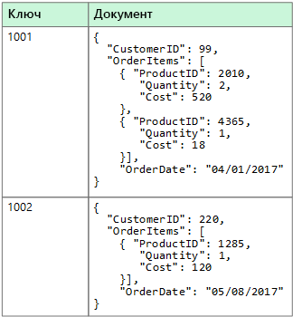
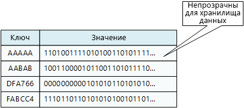
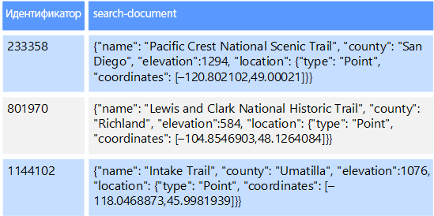

# Нереляционные данные и базы данных NoSQLNon-relational data and NoSQL

*Нереляционная база данных* — это база данных, в которой в отличие от большинства традиционных систем баз данных не используется табличная схема строк и столбцов.A *non-relational database* is a database that does not use the tabular schema of rows and columns found in most traditional database systems. В этих базах данных применяется модель хранения, оптимизированная под конкретные требования типа хранимых данных.Instead, non-relational databases use a storage model that is optimized for the specific requirements of the type of data being stored. Например, данные могут храниться как простые пары "ключ — значение", документы JSON или граф, состоящий из ребер и вершин.For example, data may be stored as simple key/value pairs, as JSON documents, or as a graph consisting of edges and vertices. 

Все эти хранилища данных не используют [реляционную модель](./relational-data.md).What all of these data stores have in common is that they don't use a [relational model](./relational-data.md). Кроме того, они, как правило, поддерживают определенные типы данных. Процесс запроса данных также специфический.Also, they tend to be more specific in the type of data they support and how data can be queried. Например, хранилища данных временных рядов рассчитаны на запросы к последовательностям данных, упорядоченных по времени, а хранилища данных графов — на анализ взвешенных связей между сущностями.For example, time series data stores are optimized for queries over time-based sequences of data, while graph data stores are optimized for exploring weighted relationships between entities. Ни один из форматов не подходит в полней мере при выполнении задач управления данными о транзакциях.Neither format would generalize well to the task of managing transactional data. 

Термин *NoSQL* применяется к хранилищам данных, которые не используют язык запросов SQL, а запрашивают данные с помощью других языков и конструкций.The term *NoSQL* refers to data stores that do not use SQL for queries, and instead use other programming languages and constructs to query the data. На практике NoSQL означает "нереляционная база данных", даже несмотря на то, что многие из этих баз данных не поддерживают совместимые с SQL запросы.In practice, "NoSQL" means "non-relational database," even though many of these databases do support SQL-compatible queries. Однако базовая стратегия выполнения запросов SQL обычно значительно отличается от применяемой в системе управления реляционной базой данных (реляционная СУБД).However, the underlying query execution strategy is usually very different from the way a traditional RDBMS would execute the same SQL query.

В разделах ниже описаны основные категории нереляционных баз данных или баз данных NoSQL.The following sections describe the major categories of non-relational or NoSQL database.

## Хранилища данных документовDocument data stores
Хранилище данных документов управляет набором значений именованных строковых полей и данных объекта в сущности, которая называется *документом*.A document data store manages a set of named string fields and object data values in an entity referred to as a *document*. Обычно данные в этих хранилищах содержатся в виде документов JSON.These data stores typically store data in the form of JSON documents. Каждое значение поля может представлять собой скалярный элемент, например число, или сложный объект, например список или коллекция типа "родитель — потомок".Each field value could be a scalar item, such as a number, or a compound element, such as a list or a parent-child collection. Данные в полях документа можно закодировать разными способами, например в формате XML, YAML, JSON, BSON, или хранить в виде обычного текста.The data in the fields of a document can be encoded in a variety of ways, including XML, YAML, JSON, BSON, or even stored as plain text. Поля документов доступны системе управления хранилищем, что позволяет приложению выполнять запросы и применять фильтры, основанные на значениях этих полей.The fields within documents are exposed to the storage management system, enabling an application to query and filter data by using the values in these fields.  

Как правило, документ содержит все данные одной сущности.Typically, a document contains the entire data for an entity. Состав элементов для каждой сущности зависит от конкретного приложения.What items constitute an entity are application specific. Например, сущность может содержать сведения о клиенте, заказе или и те, и другие.For example, an entity could contain the details of a customer, an order, or a combination of both. Один документ может содержать сведения, которые в реляционной СУБД обычно распределяются по нескольким реляционным таблицам.A single document might contain information that would be spread across several relational tables in a relational database management system (RDBMS). Хранилище документов не обязывает использовать одинаковую структуру для всех документов.A document store does not require that all documents have the same structure. Поддержка свободной формы обеспечивает большую гибкость.This free-form approach provides a great deal of flexibility. Например, приложения могут хранить в документах разные данные в соответствии с текущими требованиями компании.For example, applications can store different data in documents in response to a change in business requirements.  

  

Приложение может получать документы по ключу документа.The application can retrieve documents by using the document key. Это уникальный идентификатор документа. Часто к нему применяется хэширование для равномерного распределения данных.This is a unique identifier for the document, which is often hashed, to help distribute data evenly. Некоторые базы данных документов создают ключ документа автоматически.Some document databases create the document key automatically. Другие позволяют указать, какой атрибут документа следует использовать в качестве ключа.Others enable you to specify an attribute of the document to use as the key. Также приложение может запрашивать документы по значениям одного или нескольких полей.The application can also query documents based on the value of one or more fields. Некоторые базы данных документов поддерживают индексирование, что ускоряет поиск документов по одному или нескольким индексированным полям.Some document databases support indexing to facilitate fast lookup of documents based on one or more indexed fields.  

Многие базы данных документов поддерживают обновления "на месте", то есть позволяют приложению изменять значения отдельных полей без перезаписи всего документа.Many document databases support in-place updates, enabling an application to modify the values of specific fields in a document without rewriting the entire document. Операции чтения и записи в нескольких полях одного документа обычно являются атомарными.Read and write operations over multiple fields in a single document are usually atomic.

Соответствующие службы Azure:Relevant Azure service:  

- [База данных Azure CosmosAzure Cosmos DB](https://azure.microsoft.com/services/cosmos-db/)

## Столбчатые хранилища данныхColumnar data stores
Столбчатое хранилище данных или хранилище семейств столбцов упорядочивает данные по столбцам и строкам.A columnar or column-family data store organizes data into columns and rows. Столбчатое хранилище данных в простейшей форме почти неотличимо от реляционной базы данных, по крайней мере организационно.In its simplest form, a column-family data store can appear very similar to a relational database, at least conceptually. Настоящее преимущество столбчатого хранилища данных заключается в способности денормализованно структурировать разреженные данные, что связано со столбцово-ориентированным методом хранения данных.The real power of a column-family database lies in its denormalized approach to structuring sparse data, which stems from the column-oriented approach to storing data.  

Столбчатое хранилище данных можно представить как набор табличных данных со строками и столбцами, в которых столбцы разделяются на определенные группы или семейства столбцов.You can think of a column-family data store as holding tabular data with rows and columns, but the columns are divided into groups known as column families. Каждое семейство столбцов включает набор логически связанных столбцов, которые обычно извлекаются или управляются как единое целое.Each column family holds a set of columns that are logically related and are typically retrieved or manipulated as a unit. Другие данные, которые используются в других процессах, хранятся отдельно в других семействах столбцов.Other data that is accessed separately can be stored in separate column families. В семейство столбцов можно динамически добавить новые столбцы, а строки могут быть разреженными (то есть строки не обязаны иметь значение для каждого столбца).Within a column family, new columns can be added dynamically, and rows can be sparse (that is, a row doesn't need to have a value for every column). 

На следующей диаграмме представлен пример таблицы с двумя семействами столбцов: `Identity` и `Contact Info`.The following diagram shows an example with two column families, `Identity` and `Contact Info`. Данные одной сущности имеют одинаковые ключи строк во всех семействах столбцов.The data for a single entity has the same row key in each column family. Такая структура, в которой строки любого объекта в семействе столбцов могут динамически изменяться, определяет важное преимущество этой категории хранилищ. Семейства столбцов очень хорошо подходят для хранения данных с различными схемами.This structure, where the rows for any given object in a column family can vary dynamically, is an important benefit of the column-family approach, making this form of data store highly suited for storing data with varying schemas.

В отличие от хранилища пар "ключ — значение" и баз данных документов, большинство столбчатых баз данных упорядочивают хранимые данные с помощью самих значений ключей, а не хэш-кодов от них.Unlike a key/value store or a document database, most column-family databases physically store data in key order, rather than by computing a hash. Ключ строки рассматривается как первичный индекс и обеспечивает доступ на основе определенного ключа или их диапазона.The row key is considered the primary index and enables key-based access via a specific key or a range of keys. Некоторые реализации позволяют создавать вторичные индексы по определенным столбцам в семействе столбцов.Some implementations allow you to create secondary indexes over specific columns in a column family. Вторичные индексы позволяют получать данные по значениям столбцов, а не ключам строки.Secondary indexes let you retrieve data by columns value, rather than row key.

Все столбцы одного семейства хранятся на диске в одном файле. Каждый файл содержит определенное число строк.On disk, all of the columns within a column family are stored together in the same file, with a certain number of rows in each file. При использовании больших наборов данных этот подход позволяет повысить производительность за счет снижения объема данных, которые необходимо считывать с диска, когда отправляется запрос на получение нескольких столбцов за раз.With large data sets, this approach creates a performance benefit by reducing the amount of data that needs to be read from disk when only a few columns are queried together at a time. 

Чтение и запись одной строки из одного семейства столбцов обычно атомарные операции. Но некоторые реализации поддерживают атомарность всей строки, распределенной по нескольким семействам столбцов.Read and write operations for a row are usually atomic within a single column family, although some implementations provide atomicity across the entire row, spanning multiple column families.

Соответствующие службы Azure:Relevant Azure service:  

- [HBase в HDInsightHBase in HDInsight](/azure/hdinsight/hdinsight-hbase-overview)

## Хранилище пар "ключ — значение"Key/value data stores
Хранилище пар "ключ — значение" по сути представляет собой большую хэш-таблицу.A key/value store is essentially a large hash table. Каждое значение сопоставляется с уникальным ключом, и хранилище ключей использует этот ключ для хранения данных, применяя к нему некоторую функцию хэширования.You associate each data value with a unique key, and the key/value store uses this key to store the data by using an appropriate hashing function. Выбор функции хэширования должен обеспечить равномерное распределение хэшированных ключей по хранилищу данных.The hashing function is selected to provide an even distribution of hashed keys across the data storage.

Большинство хранилищ пар "ключ — значение" поддерживают только самые простые операции запроса, вставки и удаления.Most key/value stores only support simple query, insert, and delete operations. Чтобы частично или полностью изменить значение, приложение всегда перезаписывает существующее значение целиком.To modify a value (either partially or completely), an application must overwrite the existing data for the entire value. В большинстве реализаций атомарной операцией считается чтение или запись одного значения.In most implementations, reading or writing a single value is an atomic operation. Запись больших значений занимает относительно долгое время.If the value is large, writing may take some time.

Приложение может хранить в наборе значений произвольные данные, но некоторые хранилища пар "ключ — значение" накладывают ограничения на максимальный размер значений.An application can store arbitrary data as a set of values, although some key/value stores impose limits on the maximum size of values. Программное обеспечение хранилища ничего не знает о значениях, которые в нем хранятся.The stored values are opaque to the storage system software. Все сведения о схеме поддерживаются и применяются на уровне приложения.Any schema information must be provided and interpreted by the application. Эти значения по существу являются большими двоичными объектами, которые хранилище извлекает и сохраняет по соответствующему ключу.Essentially, values are blobs and the key/value store simply retrieves or stores the value by key.

Хранилища пар "ключ — значение" рассчитаны на приложения, выполняющие простые операции поиска на основе значения ключа или диапазона ключей, но не очень подходят для систем, которым нужно запрашивать данные из нескольких таблиц хранилищ пар "ключ — значение", например присоединенные данные в нескольких таблицах.Key/value stores are highly optimized for applications performing simple lookups using the value of the key, or by a range of keys, but are less suitable for systems that need to query data across different tables of keys/values, such as joining data across multiple tables. 

Кроме того, хранилища пар "ключ — значение" неудобны в сценариях, где могут выполняться запросы или фильтрация по значению, а не только по ключам.Key/value stores are also not optimized for scenarios where querying or filtering by non-key values is important, rather than performing lookups based only on keys. Например, в реляционной базе данных вы можете найти определенную запись с помощью предложения WHERE и отфильтровать ее по неключевым столбцам, но хранилища пар "ключ — значение" обычно не поддерживают такие возможности поиска значений или же этот процесс выполняется медленно.For example, with a relational database, you can find a record by using a WHERE clause to filter the non-key columns, but key/values stores usually do not have this type of lookup capability for values, or if they do it requires a slow scan of all values.

Одно хранилище пар "ключ — значение" очень легко масштабируется, поскольку позволяет удобно распределить данные среди нескольких узлов на разных компьютерах.A single key/value store can be extremely scalable, as the data store can easily distribute data across multiple nodes on separate machines.

Соответствующие службы Azure:Relevant Azure services:  
- [API таблиц Azure Cosmos DBAzure Cosmos DB Table API](/azure/cosmos-db/table-introduction)  
- [кэш Azure RedisAzure Redis Cache](https://azure.microsoft.com/services/cache/)  
- [хранилище таблиц AzureAzure Table Storage](https://azure.microsoft.com/services/storage/tables/)

## Хранилища данных графовGraph data stores
Хранилища данных графов управляют сведениями двух типов: узлами и ребрами.A graph data store manages two types of information, nodes and edges. Узлы в этом случае представляют сущности, а ребра определяют связи между ними.Nodes represent entities, and edges specify the relationships between these entities. Узлы и грани имеют свойства, которые предоставляют сведения о конкретном узле или грани, примерно как столбцы в реляционной таблице.Both nodes and edges can have properties that provide information about that node or edge, similar to columns in a table. Грани могут иметь направление, указывающее на характер связи.Edges can also have a direction indicating the nature of the relationship.  

Хранилища данных графов позволяют приложениям эффективно выполнять запросы, которые проходят через сеть узлов и ребер, а также анализировать связи между сущностями.The purpose of a graph data store is to allow an application to efficiently perform queries that traverse the network of nodes and edges, and to analyze the relationships between entities. На схеме ниже представлены данные персонала организации, структурированные в виде графа.The following diagram shows an organization's personnel data structured as a graph. Сущностями здесь являются сотрудники и отделы, а грани определяют отношения подчинения и отдел, в котором работает каждый сотрудник.The entities are employees and departments, and the edges indicate reporting relationships and the department in which employees work. На этом графе грани имеют строгое направление, которое на схеме обозначено стрелками.In this graph, the arrows on the edges show the direction of the relationships.

Такая структура позволяет легко выполнять такие запросы, как "найти всех сотрудников, которые прямо или косвенно подчиняются Светлане" или "найти всех, кто работает в одном отделе с Дмитрием".This structure makes it straightforward to perform queries such as "Find all employees who report directly or indirectly to Sarah" or "Who works in the same department as John?" Процессы сложного анализа выполняются очень быстро, даже на больших графах с большим количеством сущностей и связей.For large graphs with lots of entities and relationships, you can perform very complex analyses very quickly. Многие базы данных графов предоставляют язык запросов, который можно использовать для эффективного обхода сети связей.Many graph databases provide a query language that you can use to traverse a network of relationships efficiently.  

Соответствующие службы Azure:Relevant Azure service:  
- [API Graph в Azure Cosmos DBAzure Cosmos DB Graph API](/azure/cosmos-db/graph-introduction)  

## Хранилища данных временных рядовTime series data stores
Данными временных рядов называются наборы значений, которые упорядочены по времени. Соответственно хранилища данных временных рядов оптимизированы для хранения данных именно такого типа.Time series data is a set of values organized by time, and a time series data store is optimized for this type of data. Хранилища данных временных рядов должны поддерживать очень большое число операций записи, так как обычно в них в режиме реального времени собирается большой объем данных из большого количества источников.Time series data stores must support a very high number of writes, as they typically collect large amounts of data in real time from a large number of sources. Эти хранилища также хорошо подходят для хранения данных телеметрии.Time series data stores are optimized for storing telemetry data. Например, для сбора данных от датчиков Интернета вещей или счетчиков в приложениях или системах.Scenarios include IoT sensors or application/system counters. Обновления в таких базах данных выполняются редко, а удаление чаще всего является массовой операцией.Updates are rare, and deletes are often done as bulk operations.

Размер отдельных записей в базе данных временных рядов обычно невелик, но их очень много, а значит общий размер данных быстро увеличивается.Although the records written to a time series database are generally small, there are often a large number of records, and total data size can grow rapidly. Хранилища данных временных рядов также обрабатывают данные, полученные вне очереди или несвоевременно, автоматически индексируют точки данных и оптимизируют запросы, полученные в течение определенного промежутка времени.Time series data stores also handle out-of-order and late-arriving data, automatic indexing of data points, and optimizations for queries described in terms of windows of time. Эта последняя возможность позволяет быстро выполнять запросы к миллионам точек данных и нескольким потокам данных, что, в свою очередь, обеспечивает поддержку визуализации временных рядов (стандартный способ потребления данных временных рядов).This last feature enables queries to run across millions of data points and multiple data streams quickly, in order to support time series visualizations, which is a common way that time series data is consumed. 

Дополнительные сведения см. в статье [Решения для временных рядов](../scenarios/time-series.md).For more information, see [Time series solutions](../scenarios/time-series.md)

Соответствующие службы Azure:Relevant Azure service:  
- [Аналитика временных рядов AzureAzure Time Series Insights](https://azure.microsoft.com/services/time-series-insights/)  
- [OpenTSDB с HBase в HDInsightOpenTSDB with HBase on HDInsight](/azure/hdinsight/hdinsight-hbase-overview)

## Хранилище данных объектовObject data stores
Хранилища данных объектов оптимизированы для хранения и извлечения больших двоичных объектов, например изображений, текстовых файлов, видео- и аудиопотоков, объектов данных и документов приложений большого размера, образы дисков виртуальных машин.Object data stores are optimized for storing and retrieving large binary objects or blobs such as images, text files, video and audio streams, large application data objects and documents, and virtual machine disk images. Объект состоит из сохраненных данных, метаданных и уникального идентификатора доступа к объекту.An object consists of the stored data, some metadata, and a unique ID for accessing the object. Хранилища объектов поддерживают отдельные большие файлы, а также позволяют управлять всеми файлами за счет внушительного общего объема хранилища.Object stores are designed to support files that are individually very large, as well provide large amounts of total storage to manage all files.  

Некоторые хранилища данных объектов реплицируют определенный большой двоичный объект между несколькими узлами кластера, что обеспечивает быстрое параллельное чтение.Some object data stores replicate a given blob across multiple server nodes, which enables fast parallel reads. Это, в свою очередь, позволяет реализовать масштабируемую архитектуру запроса данных, хранящихся в больших файлах, так как несколько процессов, обычно выполняющихся на разных серверах, могут одновременно запрашивать большие файлы данных.This in turn enables the scale-out querying of data contained in large files, because multiple processes, typically running on different servers, can each query the large data file simultaneously.

Часто хранилища данных объектов используют как сетевые общие папки.One special case of object data stores is the network file share. Доступ к файлам, хранящимся в этих папках, можно получить через компьютерную сеть с использованием стандартных сетевых протоколов, например SMB.Using file shares enables files to be accessed across a network using standard networking protocols like server message block (SMB). Если созданы необходимые механизмы поддержки безопасности и одновременного доступа, такое совместное использование данных позволяет распределенным службам с высокой степенью масштабируемости предоставлять доступ к данным для базовых низкоуровневых операций, то есть для простых запросов на чтение и запись.Given appropriate security and concurrent access control mechanisms, sharing data in this way can enable distributed services to provide highly scalable data access for basic, low level operations such as simple read and write requests.

Соответствующие службы Azure:Relevant Azure service:   

- [Хранилище BLOB-объектов AzureAzure Blob Storage](https://azure.microsoft.com/services/storage/blobs/)  
- [Хранилище озера данных AzureAzure Data Lake Store](https://azure.microsoft.com/services/data-lake-store/)  
- [Хранилище файлов AzureAzure File Storage](https://azure.microsoft.com/services/storage/files/)  

## Хранилища данных внешних индексовExternal index data stores

Хранилища данных внешних индексов позволяют искать информацию, содержащуюся в других хранилищах данных и службах.External index data stores provide the ability to search for information held in other data stores and services. Внешний индекс выступает в роли вторичного индекса любого хранилища данных. Кроме того, с его помощью можно индексировать большие объемы данных и предоставлять доступ к этим индексам почти в реальном времени.An external index acts as a secondary index for any data store, and can be used to index massive volumes of data and provide near real-time access to these indexes. 

Например, в файловой системе могут храниться текстовые файлы.For example, you might have text files stored in a file system. По пути файл можно найти быстро, но поиск на основе содержимого выполняется медленно, так как сканируются все файлы.Finding a file by its file path is quick, but searching based on the contents of the file would require a scan of all of the files, which is slow. Внешний индекс позволяет создавать вторичные индексы, а затем быстро искать путь к файлам, соответствующим заданным условиям.An external index lets you create secondary search indexes and then quickly find the path to the files that match your criteria. Рассмотрим еще один пример использования внешнего индекса. Предположим, что хранилища пар "ключ — значение" поддерживают индексирование только по ключу.Another example application of an external index is with key/value stores that only index by the key. Вы можете создать вторичный индекс на основе значений данных и быстро найти ключ, однозначно определяющий каждый соответствующий элемент.You can build a secondary index based on the values in the data, and quickly look up the key that uniquely identifies each matched item. 

Индексы создаются в процессе индексирования,The indexes are created by running an indexing process. который может выполняться по модели извлечения, то есть по требованию хранилища данных, или по модели передачи, то есть по команде из кода приложения.This can be performed using a pull model, triggered by the data store, or using a push model, initiated by application code. В некоторых системах поддерживаются многомерные индексы и полнотекстовый поиск по большим объемам текстовых данных.Indexes can be multidimensional and may support free-text searches across large volumes of text data. 

Часто хранилища данных внешних индексов используют для реализации полнотекстового поиска и поиска в Интернете.External index data stores are often used to support full text and web based search. В этих случаях поддерживается точный или нечеткий поиск.In these cases, searching can be exact or fuzzy. Нечеткий поиск находит документы, которые соответствуют набору условий, и вычисляет для них коэффициент совпадения с этим набором.A fuzzy search finds documents that match a set of terms and calculates how closely they match. Некоторые внешние индексы также поддерживают лингвистический анализ, который возвращает соответствия с учетом синонимов, категорий (например, при поиске по запросу "собаки" соответствием считается "питомцы") и морфологии (например, при поиске по запросу "бег" соответствием считается "бегущий").Some external indexes also support linguistic analysis that can return matches based on synonyms, genre expansions (for example, matching "dogs" to "pets"), and stemming (for example, searching for "run" also matches "ran" and "running"). 

Соответствующие службы Azure:Relevant Azure service:  

- [Поиск Azure;Azure Search](https://azure.microsoft.com/services/search/)

## Стандартные требованияTypical requirements
Часто архитектура нереляционных хранилищ данных отличается от архитектуры реляционных баз данных.Non-relational data stores often use a different storage architecture from that used by relational databases. В частности эти хранилища, как правило, не имеют фиксированной схемы,Specifically, they tend towards having no fixed schema. а также не поддерживают транзакции или ограничивают их область. Из соображений масштабируемости они обычно не включают вторичные индексы.Also, they tend not to support transactions, or else restrict the scope of transactions, and they generally don't include secondary indexes for scalability reasons.

В таблице ниже приведено сравнение требований каждого нереляционного хранилища данных.The following compares the requirements for each of the non-relational data stores:

| ТребованиеRequirement | Хранилище данных документовDocument data | Столбчатое хранилище данныхColumn-family data | Хранилище данных пар "ключ — значение"Key/value data | Хранилище данных графовGraph data | 
| --- | --- | --- | --- | --- | 
| НормализацияNormalization | Денормализированные данныеDenormalized | Денормализированные данныеDenormalized | Денормализированные данныеDenormalized | Нормализированные данныеNormalized | 
| СхемаSchema | Схема при чтенииSchema on read | Семейства столбцов, определенные при записи, схема столбца при чтенииColumn families defined on write, column schema on read | Схема при чтенииSchema on read | Схема при чтенииSchema on read | 
| Согласованность (между параллельными транзакциями)Consistency (across concurrent transactions) | Настраиваемый уровень согласованности, гарантии на уровне документаTunable consistency, document-level guarantees | Гарантии на уровне семейства столбцовColumn-family&ndash;level guarantees | Гарантии на уровне ключейKey-level guarantees | Гарантии на уровне графаGraph-level guarantees 
| Атомарность (область транзакции)Atomicity (transaction scope) | КоллекцияCollection | ТаблицаTable | ТаблицаTable | ГрафикGraph | 
| Стратегия блокировкиLocking Strategy | Оптимистичная (без блокировки)Optimistic (lock free) | Пессимистичная (блокировка строк)Pessimistic (row locks) | Оптимистичная (ETag)Optimistic (ETag) | 
| Шаблон доступаAccess pattern | Прямой доступRandom access | Статистические выражения на основе данных большого форматаAggregates on tall/wide data | Прямой доступRandom access | Прямой доступRandom access |
| ИндексацияIndexing | Первичный и вторичные индексыPrimary and secondary indexes | Первичный и вторичные индексыPrimary and secondary indexes | Только первичный индексPrimary index only | Первичный и вторичные индексыPrimary and secondary indexes | 
| Форма представления данныхData shape | ДокументDocument | Таблица с семействами столбцовTabular with column families containing columns | Ключ и значениеKey and value | Граф с ребрами и вершинамиGraph containing edges and vertices | 
| разреженные;Sparse | YesYes | YesYes | YesYes | Нет No | 
| Масштабность (большое количество столбцов и атрибутов)Wide (lots of columns/attributes) | YesYes | YesYes | Нет No | Нет No |  
| Размер данныхDatum size | От малого (КБ) до среднего (несколько МБ)Small (KBs) to medium (low MBs) | От среднего (МБ) до большого (несколько ГБ)Medium (MBs) to Large (low GBs) | Небольшой (КБ)Small (KBs) | Небольшой (КБ)Small (KBs) | 
| Общий максимальный масштабOverall Maximum Scale | Очень большой (ПБ)Very Large (PBs) | Очень большой (ПБ)Very Large (PBs) | Очень большой (ПБ)Very Large (PBs) | Большой (ТБ)Large (TBs) | 

| ТребованиеRequirement | Хранилище данных временных рядовTime series data | Хранилище данных объектовObject data | Хранилище данных внешних индексовExternal index data |
| --- | --- | --- | --- |
| НормализацияNormalization | Нормализированные данныеNormalized | Денормализированные данныеDenormalized | Денормализированные данныеDenormalized |
| СхемаSchema | Схема при чтенииSchema on read | Схема при чтенииSchema on read | Схема при записиSchema on write | 
| Согласованность (между параллельными транзакциями)Consistency (across concurrent transactions) | НедоступноN/A | НедоступноN/A | НедоступноN/A | 
| Атомарность (область транзакции)Atomicity (transaction scope) | НедоступноN/A | Объект.Object | НедоступноN/A |
| Стратегия блокировкиLocking Strategy | НедоступноN/A | Пессимистичная (блокировка больших двоичных объектов)Pessimistic (blob locks) | НедоступноN/A |
| Шаблон доступаAccess pattern | Прямой доступ и агрегированиеRandom access and aggregation | Последовательный доступSequential access | Прямой доступRandom access | 
| ИндексацияIndexing | Первичный и вторичные индексыPrimary and secondary indexes | Только первичный индексPrimary index only | НедоступноN/A |
| Форма представления данныхData shape | ТаблицаTabular | Большой двоичный объект и метаданныеBlob and metadata | ДокументDocument |
| разреженные;Sparse | Нет No | НедоступноN/A | Нет No | 
| Масштабность (большое количество столбцов и атрибутов)Wide (lots of columns/attributes) |  Нет No | YesYes | YesYes |  
| Размер данныхDatum size | Небольшой (КБ)Small (KBs) | От большого (ГБ) до очень большого (ТБ)Large (GBs) to Very Large (TBs) | Небольшой (КБ)Small (KBs) |
| Общий максимальный масштабOverall Maximum Scale | Большой (несколько ТБ)Large (low TBs)  | Очень большой (ПБ)Very Large (PBs) | Большой (несколько ТБ)Large (low TBs) | 

