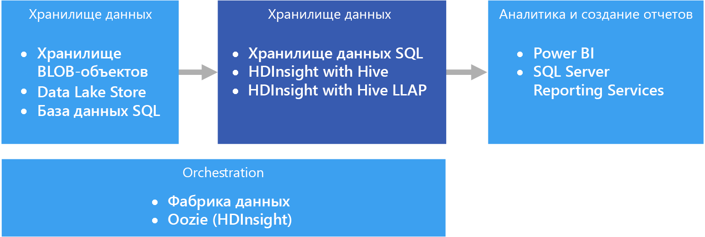

# Хранение данных и киоски данных

Хранилищем данных называется централизованный, организационный и реляционный репозиторий данных, собранных из одного или нескольких разнородных источников, по нескольким или многим предметным областям. Хранилища данных содержат текущие и архивные данные и обычно применяются для создания отчетов и разных технологий анализа данных.

Чтобы поместить данные в хранилище данных, они периодически извлекаются из разных источников важной бизнес-информации. В процессе перемещения эти данные можно отформатировать, очистить, проверить, свести и реорганизовать. Есть также возможность сохранить данные с самым низким уровнем детализации и применить для составления отчетов агрегированные представления, доступные в хранилище. В любом случае хранилище данных становится местом постоянного хранения данных, откуда они извлекаются средствами бизнес-аналитики (BI) для отчетов, анализа и принятия важных решений.

## Киоски данных и хранилища операционных данных

Управление данными в большом объеме — это сложная задача, и сейчас все реже встречаются системы с единым хранилищем для всех данных крупной организации. Вместо этого организации создают небольшие и более специализированные хранилища данных, получившие название *киоски данных*, которые предоставляют необходимые данные для анализа. В процессе оркестрации киоски данных заполняются информацией из хранилища операционных данных. В этой схеме хранилище операционных данных выполняет роль посредника между системой транзакций, используемой в качестве источника, и киоском данных. В хранилище операционных данных представлена очищенная версия данных, собранных в исходной системе транзакций. Как правило, это архивные данные в меньшем объеме из хранилища данных или киоска данных. 

## Когда следует использовать это решение

Используйте хранилище данных, если на основе большого объема данных из операционных систем вам нужно получить актуальные и точные данные в удобочитаемом формате. Для хранилища данных не обязательно применять такую же сжатую структуру данных, которая используется в оперативной базе данных или OLTP. Вы можете присвоить столбцам новые имена, понятные для бизнес-пользователей и аналитиков, изменить структуру схемы для упрощения связей и объединить несколько таблиц в одну. Следующие действия помогут тем пользователям, которые хотят создать специальные отчеты или создать отчеты и анализировать данные в системах бизнес-аналитики, не обращаясь за помощью к администраторам базы данных (DBA) или разработчикам.

Рассмотрите возможность применить хранилище данных, если вы намерены повысить производительность транзакционных систем, используемых в качестве источника данных, сохраняя архивные данные в другом месте. Хранилища данных упрощают доступ к архивным данным из множества расположений, предоставляя централизованное место хранения с поддержкой стандартных форматов, ключей, моделей данных и методов доступа.

Хранилища данных оптимизированы для чтения данных, что позволяет быстрее формировать отчеты по сравнению с запросами к исходной транзакционной системе. Хранилища данных предоставляют еще несколько важных преимуществ:

* Все исторические данные из нескольких источников можно хранить и получить из единственного "эталонного" хранилища данных.
* Очистка данных при импорте в хранилище данных повышает их качество, повышает точность сведений и позволяет согласовать коды и описания.
* Средства создания отчетов не мешают работе исходных транзакционных систем при обработке запросов. Хранилище данных позволяет транзакционной системе сосредоточиться на обработке операций записи, взяв на себя значительную часть запросов на чтение.
* Хранилище данных помогает объединить данные от разных программ.
* Средства интеллектуального анализа данных помогают найти скрытые закономерности, применяя автоматизированные методы анализа к данным, размещенным в хранилище.
* Хранилища данных позволяют предоставить безопасный доступ авторизованным пользователям и ограничить доступ для всех остальных. Нет необходимости предоставлять бизнес-пользователям доступ к исходным данным, что устраняет потенциальный вектор атак на одну или несколько рабочих транзакционных систем.
* Хранилища данных упрощают создание решений бизнес-аналитики на основе данных, таких как [кубы OLAP](online-analytical-processing.md).

## Сложности

Чтобы правильно настроить хранилища данных в соответствии с требованиями организации, вам нужно решить следующие проблемы:

* Достаточное время для правильного моделирования бизнес-концепции. Это очень важный шаг, так как хранилища данных основаны на информации, и правильное описание концепции станет основой для всего проекта. Среди прочего, необходимо стандартизировать деловые термины и форматы (валют, дат и т. п.), а также изменить структуру схемы данных, чтобы сделать ее понятной для бизнес-пользователей, сохраняя точность статистических выражений и связей между данными.
* Планирование и настройка оркестрации данных. Здесь нужно учесть такие факторы, как метод копирования данных из исходной транзакционной системы в хранилище данных и графики перемещения в него архивных данных из хранилищ операционных данных.
* Сохранение или повышение качества данных путем их очистки в процессе импорта в хранилище данных.

## Хранение данных в Azure

В Azure вы можете использовать один или несколько источников данных, например от систем взаимодействия с клиентами или различных бизнес-приложений, используемых в подразделениях организации. В большинстве случаев эти данные хранятся в одной или нескольких базах данных [OLTP](online-transaction-processing.md). Данные могут существовать и на других носителях, такие как сетевые папки, Azure Storage Blob или Data Lake. Также данные могут размещаться в самом хранилище данных или в реляционной базе данных, например Базе данных SQL Azure. Уровень хранилища аналитических данных создается для обработки запросов от средств аналитики и создания отчетов, которая выполняется в хранилище данных или в киоске данных. Эту функцию аналитического хранилища в Azure можно возложить на хранилище данных SQL Azure или Azure HDInsight в сочетании с Hive или Interactive Query. Кроме того, требуется некоторый уровень оркестрации, чтобы периодически перемещать или копировать данные в хранилище данных. Например, это можно сделать с помощью фабрики данных Azure или Oozie в Azure HDInsight.

Существует несколько вариантов реализации хранилища данных в Azure, выбор которых зависит от ваших потребностей. Ниже приведены списки, разбитые на две категории: [симметричная многопроцессорная обработка](https://en.wikipedia.org/wiki/Symmetric_multiprocessing) (SMP) и [массовая параллельная обработка](https://en.wikipedia.org/wiki/Massively_parallel) (MPP). 

SMP:

- [база данных SQL Azure;](/azure/sql-database/)
- [SQL Server на виртуальной машине.](/sql/sql-server/sql-server-technical-documentation)

MPP:

- [хранилище данных Azure;](/azure/sql-data-warehouse/sql-data-warehouse-overview-what-is)
- [Apache Hive в HDInsight;](/azure/hdinsight/hadoop/hdinsight-use-hive)
- [Interactive Query (Hive LLAP) в HDInsight](/azure/hdinsight/interactive-query/apache-interactive-query-get-started).

Как правило, хранилища данных SMP лучше всего подходят для небольших и средних наборов данных (от 4 до 100 ТБ), в то время как MPP часто используется для больших данных. Разграничение между небольшими, средними и большими данными частично связано с их определением в вашей организации и поддерживаемой инфраструктурой. (См. раздел о возможностях хранилищ в статье [Choosing an OLTP data store in Azure](online-transaction-processing.md#scalability-capabilities) (Выбор хранилища данных OLTP в Azure).) 

Помимо размеров данных важным определяющим фактором также выступает шаблон рабочей нагрузки. Например, сложные запросы могут быть слишком медленными для решения SMP, из-за чего для них потребуется решение MPP. Системы на основе MPP могут привести к некоторому снижению производительности операций с данными небольшого размера из-за того, как задачи распределяются и консолидируются между узлами. Если размеры данных уже превышают 1 ТБ и будут постоянно расти, рекомендуется выбрать решение MPP. Однако, если размеры данных меньше, но рабочие нагрузки превышают доступные ресурсы вашего решения SMP, тогда следует выбрать решение MPP.

Данные в вашем хранилище могут быть получены из нескольких источников данных, включая Data Lake, например [Azure Data Lake Store](/azure/data-lake-store/). Чтобы просмотреть видео-семинар, где сравниваются различные преимущества служб MPP, которые могут использовать Azure Data Lake, перейдите по [этой ссылке](https://azure.microsoft.com/resources/videos/build-2016-azure-data-lake-and-azure-data-warehouse-applying-modern-practices-to-your-app/).

Системы SMP характеризуются одним экземпляром системы управления реляционной базой данных, который использует все ресурсы (ЦП, память и диск). Систему SMP можно масштабировать. Если SQL Server запущен на виртуальной машине, ее размер можно увеличить. Базу данных SQL Azure можно масштабировать вертикально, выбрав другой уровень обслуживания. 

Системы MPP можно масштабировать горизонтально, добавляя дополнительные вычислительные узлы (которые имеют собственные ЦП, память и подсистемы ввода-вывода). Существуют физические ограничения для масштабирования сервера, при этом желательно горизонтальное масштабирование, в зависимости от рабочей нагрузки. Однако для решений MPP требуется другой набор возможностей из-за различий в отправке запросов, моделировании, разделении данных и других факторов, уникальных для параллельной обработки. 

Дополнительные сведения о решении SMP см. в разделе [Более детальный обзор базы данных SQL Azure и SQL Server на виртуальных машинах Azure](/azure/sql-database/sql-database-paas-vs-sql-server-iaas#a-closer-look-at-azure-sql-database-and-sql-server-on-azure-vms). 

Хранилище данных SQL Azure также может использоваться для небольших и средних наборов данных, где рабочая нагрузка интенсивно использует память и вычислительные ресурсы. Узнайте больше о шаблонах хранилищ данных SQL и типичных сценариях:

- [Шаблоны и антишаблоны рабочих нагрузок хранилища данных SQL Azure](https://blogs.msdn.microsoft.com/sqlcat/2017/09/05/azure-sql-data-warehouse-workload-patterns-and-anti-patterns/)
- [Стратегии и шаблоны загрузки данных в хранилище данных SQL Azure](https://blogs.msdn.microsoft.com/sqlcat/2017/05/17/azure-sql-data-warehouse-loading-patterns-and-strategies/)
- [Migrating data to Azure SQL Data Warehouse in practice](https://blogs.msdn.microsoft.com/sqlcat/2016/08/18/migrating-data-to-azure-sql-data-warehouse-in-practice/) (Перенос данных в хранилище данных SQL Azure на практике)
- [Общие шаблоны приложений ISV с использованием хранилища данных SQL Azure](https://blogs.msdn.microsoft.com/sqlcat/2017/09/05/common-isv-application-patterns-using-azure-sql-data-warehouse/)

## Основные критерии выбора

Чтобы ограничить количество вариантов, сначала ответьте на следующие вопросы:

- Вы хотите использовать управляемую службу, а не управлять собственными серверами?

- Вы работаете с очень большими наборами данных или с высоко сложными, долго выполняющимися запросами? Если да, выберите решение MPP. 

- Какой источник данных требуется для большого набора данных: структурированный или неструктурированный? Неструктурированные данные могут требовать обработки в среде больших данных, такой как Spark в HDInsight, Azure Databricks, Hive LLAP в HDInsight или Azure Data Lake Analytics. Все они могут использовать в качестве модулей ELT (извлечение, загрузка, преобразование) и ETL (извлечение, преобразование и загрузка). Они могут преобразовывать обработанные данные в структурированные данные, что упрощает загрузку в хранилище данных SQL и другое хранилище. Для структурированных данных хранилище данных SQL имеет уровень производительности, оптимизированный для ресурсоемких вычислительных нагрузок, требующих сверхвысокой производительности.

- Вы хотите отделить исторические данные от текущих рабочих данных? Если это так, выберите один из вариантов, для которого требуется [оркестрация](../technology-choices/pipeline-orchestration-data-movement.md). Это автономные хранилища данных, оптимизированные для интенсивного доступа на чтение, которые лучше всего подходят в качестве отдельного хранилища исторических данных.

- Нужно ли интегрировать данные из нескольких источников за пределами хранилища данных OLTP? Если да, рассмотрите варианты, которые позволяют легко интегрировать несколько источников данных. 

- Требуется ли вам мультитенантность? В этом случае хранилище данных SQL вам не подойдет. Дополнительные сведения см. в записи блога [Azure SQL Data Warehouse Workload Patterns and Anti-Patterns](https://blogs.msdn.microsoft.com/sqlcat/2017/09/05/azure-sql-data-warehouse-workload-patterns-and-anti-patterns/) (Шаблоны и антишаблоны рабочих нагрузок хранилища данных SQL Azure).

- Вы предпочитаете реляционное хранилище данных? В этом случае рассмотрите варианты с реляционным хранилищем данных. При этом обратите внимание, что при необходимости вы можете использовать такой инструмент, как PolyBase, для запроса нереляционных хранилищ данных. Если вы решили использовать PolyBase, выполните тесты производительности для неструктурированных наборов данных в рамках вашей рабочей нагрузки.

- Вам требуется отчетность в реальном времени? Если вам требуется быстрое время отклика запросов в больших томах одноэлементных вставок, рассмотрите варианты, в которых есть поддержка отчетов в режиме реального времени.

- Вам нужно поддерживать большое количество одновременных пользователей и подключений? Возможность поддержки нескольких одновременных пользователей и подключений зависит от некоторых факторов. 

    - Дополнительные сведения см. в статье [Ограничения ресурсов базы данных SQL Azure](/azure/sql-database/sql-database-resource-limits). 
    
    - SQL Server поддерживает не более 32 767 одновременных подключений пользователей. При запуске на виртуальной машине производительность будет зависеть от размера виртуальной машины и других факторов. 
    
    - Хранилище данных SQL имеет ограничения на параллельные запросы и подключения. Дополнительные сведения см. в статье [Управление параллелизмом и рабочей нагрузкой в хранилище данных SQL](/azure/sql-data-warehouse/sql-data-warehouse-develop-concurrency). Рассмотрите возможность использования дополнительных служб, таких как [Azure Analysis Services](/azure/analysis-services/analysis-services-overview), чтобы преодолеть ограничения хранилища данных SQL.

- Какой тип рабочей нагрузки вы используете? Как правило, решения хранилищ MPP лучше всего подходят для аналитических, пакетно-ориентированных рабочих нагрузок. Если ваши рабочие нагрузки являются транзакционными со множеством небольших операций чтения и записи или несколькими построчными операциями, рассмотрите возможность использования одного из вариантов SMP. Единственным исключением является использование потоковой обработки в кластере HDInsight, например Spark Streaming, и хранение данных в таблице Hive.

## Матрица возможностей

В следующих таблицах перечислены основные различия в возможностях.

### Общие возможности

| | Базы данных SQL Azure | SQL Server (виртуальная машина) | Хранилище данных SQL | Apache Hive в HDInsight | Hive LLAP в HDInsight |
| --- | --- | --- | --- | --- | --- | -- |
| Является управляемой службой | Yes | Нет  | Yes | Да 1 | Да 1 |
| Требуется оркестрация данных (содержит копию простых или исторических данных) | Нет  | Нет  | Yes | Да | Yes |
| Простая интеграция нескольких источников данных | Нет  | Нет  | Yes | Да | Yes |
| Поддержка приостановки вычислительных ресурсов | Нет  | Нет  | Yes | Нет 2 | Нет 2 |
| Реляционное хранилище данных | Yes | Да |  Да | Нет  | Нет  |
| Отчеты в реальном времени | Yes | Да | Нет  | Нет  | Yes |
| Гибкие точки восстановления и резервных копий | Yes | Yes | Нет3 | Да 4 | Да 4 |
| SMP/MPP | SMP | SMP | MPP | MPP | MPP |

[1] Настройка и масштабирование вручную.

[2] Кластеры HDInsight можно удалить, когда они не нужны, а затем повторно создать. Присоедините внешнее хранилище данных к кластеру, чтобы ваши данные сохранялись в случае его удаления. Можно использовать фабрику данных Azure для автоматизации жизненного цикла вашего кластера, создав кластер HDInsight по требованию для обработки рабочей нагрузки, а затем удалив его после завершения обработки.

[3] В хранилище данных SQL можно восстановить базу данных до любой точки восстановления за последние семь дней. Моментальные снимки создаются каждые четыре-восемь часов и доступны в течение семи дней. Если моментальный снимок старше семи дней, то срок его действия истекает и его точка восстановления перестает быть доступной.

[4] Рассмотрите возможность использования [внешнего хранилища метаданных Hive](/azure/hdinsight/hdinsight-hadoop-provision-linux-clusters#use-hiveoozie-metastore), которое можно заархивировать и восстановить при необходимости. Для данных могут использоваться стандартные варианты резервного копирования и восстановления, которые применяются к хранилищу BLOB-объектов или хранилищу Data Lake Store. Для большей гибкости и простоты можно также использовать сторонние решения для резервного копирования и восстановления HDInsight, например [Imanis Data](https://azure.microsoft.com/blog/imanis-data-cloud-migration-backup-for-your-big-data-applications-on-azure-hdinsight/).

### Масштабируемость

| | Базы данных SQL Azure | SQL Server (виртуальная машина) |  Хранилище данных SQL | Apache Hive в HDInsight | Hive LLAP в HDInsight |
| --- | --- | --- | --- | --- | --- | -- |
| Избыточные региональные серверы для высокого уровня доступности  | Yes | Да | Да | Нет  | Нет  |
| Поддержка масштабирования запросов (распределенных)  | Нет  | Нет  | Yes | Да | Yes |
| Динамическая масштабируемость | Yes | Нет  | Да 1 | Нет  | Нет  |
| Выполняющееся в памяти кэширование данных | Yes |  Да | Нет  | Yes | Yes |

[1] Хранилище данных SQL позволяет выполнять вертикальное или горизонтальное масштабирование, настраивая количество единиц использования хранилища данных (DWU). Дополнительные сведения см. в статье [Управление вычислительными ресурсами в хранилище данных SQL Azure (обзор)](/azure/sql-data-warehouse/sql-data-warehouse-manage-compute-overview).

### Возможности системы безопасности

|                         |           Базы данных SQL Azure            |  SQL Server на виртуальной машине  | Хранилище данных SQL |   Apache Hive в HDInsight    |    Hive LLAP в HDInsight     |
|-------------------------|-----------------------------------------|-----------------------------------|--------------------|-------------------------------|-------------------------------|
|     Authentication      | SQL / Azure Active Directory (Azure AD) | SQL / Azure AD / Active Directory |   SQL / Azure AD   | Локальные средства или Azure AD 1 | Локальные средства или Azure AD 1 |
|      Авторизация      |                   Yes                   |                Да                |        Да         |              Yes              |       Да 1        |
|        Аудит         |                   Yes                   |                Да                |        Да         |              Yes              |       Да 1        |
| Шифрование неактивных данных |            Да 2             |         Да 2          |  Да 2  |       Да 2        |       Да 1        |
|   Безопасность на уровне строк    |                   Yes                   |                Да                |        Да         |              Нет                |       Да 1        |
|   Поддержка брандмауэров    |                   Yes                   |                Да                |        Да         |              Yes              |       Да 3        |
|  Динамическое маскирование данных   |                   Yes                   |                Да                |        Да         |              Нет                |       Да 1        |

[1] Требуется использовать [присоединенный к домену кластер HDInsight](/azure/hdinsight/domain-joined/apache-domain-joined-introduction).

[2] Требуется использовать прозрачное шифрование данных (TDE) для шифрования и расшифровки неактивных данных.

[3] Поддерживается при [использовании в виртуальной сети Azure](/azure/hdinsight/hdinsight-extend-hadoop-virtual-network).

Дополнительные сведения о защите хранилища данных:

* [Защита Базы данных SQL](/azure/sql-database/sql-database-security-overview#connection-security)
* [Защита базы данных в хранилище данных SQL](/azure/sql-data-warehouse/sql-data-warehouse-overview-manage-security)
* [Расширение возможностей HDInsight с помощью виртуальной сети Azure](/azure/hdinsight/hdinsight-extend-hadoop-virtual-network)
* [Основные сведения о безопасности Hadoop в присоединенных к домену кластерах HDInsight](/azure/hdinsight/domain-joined/apache-domain-joined-introduction)

