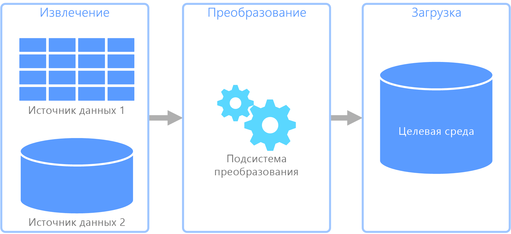
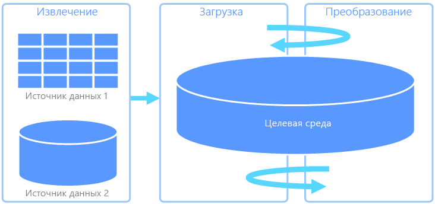
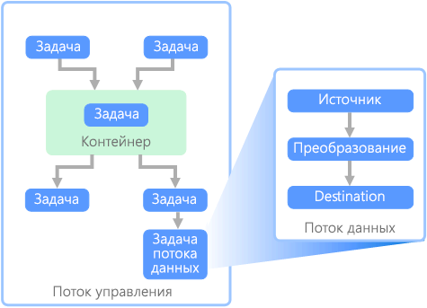

# Извлечение, преобразование и загрузка (ETL)Extract, transform, and load (ETL)

Распространенной проблемой, с которой сталкиваются организации, является сбор данных из нескольких источников в нескольких форматах и ​​перенос этих данных в одно или несколько хранилищ данных.A common problem that organizations face is how to gathering data from multiple sources, in multiple formats, and move it to one or more data stores. Тип хранилища данных в целевой и исходной средах может отличаться, также как и формат. Иногда данные необходимо форматировать или очистить до загрузки в конечное расположение.The destination may not be the same type of data store as the source, and often the format is different, or the data needs to be shaped or cleaned before loading it into its final destination.

За несколько лет для решения этих проблем было разработано много средств, служб и процессов.Various tools, services, and processes have been developed over the years to help address these challenges. Независимо от используемого процесса, существует общая потребность в координации работы и преобразовании данных в конвейере.No matter the process used, there is a common need to coordinate the work and apply some level of data transformation within the data pipeline. В следующих разделах описываются распространенные методы, используемые для выполнения этих задач.The following sections highlight the common methods used to perform these tasks.

## Извлечение, преобразование и загрузка (ETL)Extract, transform, and load (ETL)

Извлечение, преобразование и загрузка (ETL) представляет собой конвейер данных, в рамках которого данные собираются из различных источников, преобразовываются в соответствии с бизнес-правилами и загружаются в целевое хранилище данных.Extract, transform, and load (ETL) is a data pipeline used to collect data from various sources, transform the data according to business rules, and load it into a destination data store. Процесс преобразования в конвейере ETL выполняется в специальной подсистеме. Зачастую для временного хранения данных во время их преобразования и до загрузки в пункт назначения используются промежуточные таблицы.The transformation work in ETL takes place in a specialized engine, and often involves using staging tables to temporarily hold data as it is being transformed and ultimately loaded to its destination.

Обычно в процессе преобразования данных применяются различные операции (например, фильтрация, сортировка, агрегирование, объединение, очистка, дедупликация и проверка данных).The data transformation that takes place usually involves various operations, such as filtering, sorting, aggregating, joining data, cleaning data, deduplicating, and validating data.

Часто три этапа ETL выполняются параллельно, чтобы сэкономить время.Often, the three ETL phases are run in parallel to save time. Например, при извлечении данных процесс преобразования может уже обрабатывать полученные данные и подготавливать их для загрузки, а процесс загрузки может начать обрабатывать подготовленные данные, не дожидаясь полного завершения извлечения.For example, while data is being extracted, a transformation process could be working on data already received and prepare it for loading, and a loading process can begin working on the prepared data, rather than waiting for the entire extraction process to complete.

Соответствующие службы Azure:Relevant Azure service:
- [Фабрика данных Azure версии 2](https://azure.microsoft.com/services/data-factory/).[Azure Data Factory v2](https://azure.microsoft.com/services/data-factory/)

Другие средства:Other tools:
- [SQL Server Integration Services (SSIS)SQL Server Integration Services (SSIS)](/sql/integration-services/sql-server-integration-services)

## Извлечение, загрузка и преобразование (ELT)Extract, load, and transform (ELT)

Конвейер извлечения, загрузки и преобразования (ELT) отличается от ETL исключительно средой выполнения преобразования.Extract, load, and transform (ELT) differs from ETL solely in where the transformation takes place. В конвейере ELT преобразование происходит в целевом хранилище данных.In the ELT pipeline, the transformation occurs in the target data store. В этом случае для преобразования данных вместо специальной подсистемы используются средства обработки целевого хранилища данных.Instead of using a separate transformation engine, the processing capabilities of the target data store are used to transform data. Это упрощает архитектуру за счет удаления механизма преобразования из конвейера.This simplifies the architecture by removing the transformation engine from the pipeline. Еще одним преимуществом этого подхода является то, что масштабирование целевого хранилища данных также улучшает производительность конвейера ELT.Another benefit to this approach is that scaling the target data store also scales the ELT pipeline performance. Тем не менее ELT работает надлежащим образом, только если целевая система имеет достаточную производительность для эффективного преобразования данных.However, ELT only works well when the target system is powerful enough to transform the data efficiently.

Обычно конвейер ELT применяется для обработки больших объемов данных.Typical use cases for ELT fall within the big data realm. К примеру, вы можете извлечь все исходные данные в неструктурированные файлы в масштабируемое хранилище (например, распределенную файловую систему Hadoop (HDFS) или Azure Data Lake Store).For example, you might start by extracting all of the source data to flat files in scalable storage such as Hadoop distributed file system (HDFS) or Azure Data Lake Store. Затем для выполнения запроса исходных данных можно использовать такие технологии, как Spark, Hive или PolyBase.Technologies such as Spark, Hive, or PolyBase can then be used to query the source data. Ключевой особенностью ELT является то, что хранилище данных, используемое для выполнения преобразования, — это то же хранилище, в котором данные в конечном счете потребляются.The key point with ELT is that the data store used to perform the transformation is the same data store where the data is ultimately consumed. Это хранилище данных считывает данные непосредственно из масштабируемого хранилища, вместо того чтобы загружать их в собственное защищаемое хранилище.This data store reads directly from the scalable storage, instead of loading the data into its own proprietary storage. Этот подход пропускает этап копирования (присутствующий в ETL), который может занимать много времени при обработке больших наборов данных.This approach skips the data copy step present in ETL, which can be a time consuming operation for large data sets.

Обычно целевым хранилищем является [хранилище данных](./data-warehousing.md), использующее кластер Hadoop (с помощью Hive или Spark) или хранилище данных SQL.In practice, the target data store is a [data warehouse](./data-warehousing.md) using either a Hadoop cluster (using Hive or Spark) or a SQL Data Warehouse. Чаще всего схема накладывается на данные неструктурированных файлов во время выполнения запроса и сохраняется в виде таблиц, позволяя запрашивать данные таким же образом, как и любую другую таблицу в хранилище данных.In general, a schema is overlaid on the flat file data at query time and stored as a table, enabling the data to be queried like any other table in the data store. Они называются внешними таблицами, так как данные находятся не в хранилище, управляемом самим хранилищем данных, а во внешнем масштабируемом хранилище.These are referred to as external tables because the data does not reside in storage managed by the data store itself, but on some external scalable storage. 

Хранилище данных управляет только схемой данных и применяет ее при чтении.The data store only manages the schema of the data and applies the schema on read. Например, кластер Hadoop, использующий Hive, описывает таблицу Hive, где источником данных является фактический путь к набору файлов в HDFS.For example, a Hadoop cluster using Hive would describe a Hive table where the data source is effectively a path to a set of files in HDFS. В хранилище данных SQL технология PolyBase может достичь того же результата, создав таблицу с данными, хранящимися в самой базе данных.In SQL Data Warehouse, PolyBase can achieve the same result &mdash; creating a table against data stored externally to the database itself. Когда исходные данные загружены, данные, имеющиеся во внешних таблицах, можно обрабатывать, используя возможности хранилища данных.Once the source data is loaded, the data present in the external tables can be processed using the capabilities of the data store. В сценариях с большими данными это означает, что хранилище данных должно поддерживать массовую параллельную обработку (MPP), когда данные разбиваются на более мелкие фрагменты, а обработка этих фрагментов распределяется сразу между несколькими компьютерами в параллельном режиме.In big data scenarios, this means the data store must be capable of massively parallel processing (MPP), which breaks the data into smaller chunks and distributes processing of the chunks across multiple machines in parallel.

Последний этап конвейера ELT обычно заключается в преобразовании исходных данных в окончательный формат, более эффективный для тех типов запросов, которые необходимо поддерживать.The final phase of the ELT pipeline is typically to transform the source data into a final format that is more efficient for the types of queries that need to be supported. Например, данные могут быть секционированы.For example, the data may be partitioned. Кроме того, ELT может использовать оптимизированные форматы хранения (например, Parquet), в которых построчные данные хранятся в виде столбцов и предоставляется оптимизированная индексация.Also, ELT might use optimized storage formats like Parquet, which stores row-oriented data in a columnar fashion and providess optimized indexing. 

Соответствующие службы Azure:Relevant Azure service:

- [Хранилище данных Azure SQLAzure SQL Data Warehouse](/azure/sql-data-warehouse/sql-data-warehouse-overview-what-is)
- [HDInsight с Hive](/azure/hdinsight/hadoop/hdinsight-use-hive);[HDInsight with Hive](/azure/hdinsight/hadoop/hdinsight-use-hive)
- [фабрика данных Azure версии 2](https://azure.microsoft.com/services/data-factory/);[Azure Data Factory v2](https://azure.microsoft.com/services/data-factory/)
- [Oozie в HDInsight](/azure/hdinsight/hdinsight-use-oozie-linux-mac).[Oozie on HDInsight](/azure/hdinsight/hdinsight-use-oozie-linux-mac)

Другие средства:Other tools:

- [SQL Server Integration Services (SSIS)SQL Server Integration Services (SSIS)](/sql/integration-services/sql-server-integration-services)

## Поток данных и поток управленияData flow and control flow

В контексте конвейеров данных поток управления обеспечивает обработку набора задач в правильном порядке.In the context of data pipelines, the control flow ensures orderly processing of a set of tasks. Для этого используется управление очередностью.To enforce the correct processing order of these tasks, precedence constraints are used. Эти ограничения можно рассматривать как соединители на схеме рабочего процесса, показанной ниже.You can think of these constraints as connectors in a workflow diagram, as shown in the image below. Каждая задача имеет результат (успешное завершение, сбой или завершение).Each task has an outcome, such as success, failure, or completion. Все последующие задачи начинают обработку данных, только когда предыдущая задача завершена с одним из этих результатов.Any subsequent task does not initiate processing until its predecessor has completed with one of these outcomes.

Потоки управления выполняют потоки данных в качестве задачи.Control flows execute data flows as a task. В рамках задачи потока данных данные извлекаются из источника, преобразовываются и загружаются в хранилище данных.In a data flow task, data is extracted from a source, transformed, or loaded into a data store. Выходные данные одной задачи потока данных могут использоваться в качестве входных данных для следующей задачи потока данных, а эти потоки могут выполняться одновременно.The output of one data flow task can be the input to the next data flow task, and data flowss can run in parallel. В отличие от потоков управления, вы не можете добавить ограничения между задачами в потоке данных.Unlike control flows, you cannot add constraints between tasks in a data flow. Однако вы можете добавить средство просмотра данных для наблюдения за данными по мере их обрабатывания каждой задачей.You can, however, add a data viewer to observe the data as it is processed by each task.

На приведенной выше схеме показано несколько задач в потоке управления, одна из которых является задачей потока данных.In the diagram above, there are several tasks within the control flow, one of which is a data flow task. Одна из задач вложена в контейнер.One of the tasks is nested within a container. Контейнеры можно использовать для обеспечения структуры задач, тем самым формируя единицу работы.Containers can be used to provide structure to tasks, providing a unit of work. Одним из примеров является повторение элементов в коллекции (например, файлы в папке или инструкции базы данных).One such example is for repeating elements within a collection, such as files in a folder or database statements.

Соответствующие службы Azure:Relevant Azure service:
- [Фабрика данных Azure версии 2](https://azure.microsoft.com/services/data-factory/).[Azure Data Factory v2](https://azure.microsoft.com/services/data-factory/)

Другие средства:Other tools:
- [SQL Server Integration Services (SSIS)SQL Server Integration Services (SSIS)](/sql/integration-services/sql-server-integration-services)

## Выбор технологийTechnology choices

- [Хранилища данных оперативной обработки транзакций (OLTP)Online Transaction Processing (OLTP) data stores](./online-transaction-processing.md#oltp-in-azure)
- [Хранилища данных оперативной аналитической обработки (OLAP)Online Analytical Processing (OLAP) data stores](./online-analytical-processing.md#olap-in-azure)
- [Хранилища данныхData warehouses](./data-warehousing.md)
- [Оркестрация конвейеровPipeline orchestration](../technology-choices/pipeline-orchestration-data-movement.md)
