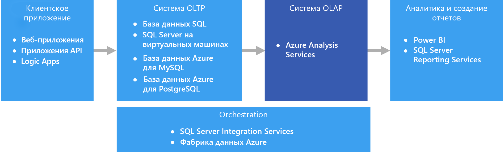
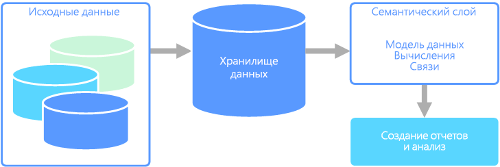

# Оперативная аналитическая обработка (OLAP)Online analytical processing (OLAP)

Оперативная аналитическая обработка (OLAP) — это технология, которая упорядочивает большие коммерческие базы данных и поддерживает сложный анализ.Online analytical processing (OLAP) is a technology that organizes large business databases and supports complex analysis. Ее можно использовать для выполнения сложных аналитических запросов без негативного воздействия на системы транзакций.It can be used to perform complex analytical queries without negatively affecting transactional systems.

Базы данных, в которых компании хранят свои транзакции и записи, называются базами данных [оперативной обработки транзакций (OLTP)](./online-transaction-processing.md).The databases that a business uses to store all its transactions and records are called [online transaction processing (OLTP)](./online-transaction-processing.md) databases. Такие базы данных обычно содержат записи, которые вводятся поочередно.These databases usually have records that are entered one at a time. Часто они содержат много ценных для организации сведений.Often they contain a great deal of information that is valuable to the organization. Но базы данных, используемые для OLTP, не предназначены для анализа.The databases that are used for OLTP, however, were not designed for analysis. Поэтому извлечение ответов из этих баз данных требует много времени и усилий.Therefore, retrieving answers from these databases is costly in terms of time and effort. Системы OLAP предназначены для извлечения этих сведений бизнес-аналитики из данных максимально оптимальным способом.OLAP systems were designed to help extract this business intelligence information from the data in a highly performant way. Это достигается благодаря тому, что базы данных OLAP оптимизированы для рабочих нагрузок с большим числом операций чтения и малым числом операций записи.This is because OLAP databases are optimized for heavy read, low write workloads.

## Семантическое моделированиеSemantic modeling

Семантическая модель данных — это концептуальная модель, в которой описаны значения содержащихся в ней элементов данных.A semantic data model is a conceptual model that describes the meaning of the data elements it contains. Организации часто используют собственные термины, иногда синонимы или даже разные значения одного и того же термина.Organizations often have their own terms for things, sometimes with synonyms, or even different meanings for the same term. Например, база данных инвентаризации может отслеживать компонент оборудования с ИД ресурса и серийным номером. Но база данных по продажам может ссылаться на серийный номер как на идентификатор ресурса.For example, an inventory database might track a piece of equipment with an asset ID and a serial number, but a sales database might refer to the serial number as the asset ID. Эти значения сложно связать без модели, в которой бы описывалась связь.There is no simple way to relate these values without a model that describes the relationship.

Семантическое моделирование обеспечивает абстракцию на уровне схемы базы данных. В этом случае пользователям не требуются знания о базовых структурах данных.Semantic modeling provides a level of abstraction over the database schema, so that users don't need to know the underlying data structures. Семантическое моделирование также упрощает подачу запросов данных для пользователей: им не нужно выполнять вычисления и соединения в базовой схеме.This makes it easier for end users to query data without performing aggregates and joins over the underlying schema. Кроме того, обычно имена столбцов преобразуются в понятные пользователям названия, чтобы контекст и значение данных были очевидными.Also, usually columns are renamed to more user-friendly names, so that the context and meaning of the data are more obvious.

Семантическое моделирование преимущественно используется для сценариев с большим числом операций чтения, например для аналитики и бизнес-аналитики (OLAP), которые отличаются от обработки данных о транзакциях с большим числом операций записи (OLTP).Semantic modeling is predominately used for read-heavy scenarios, such as analytics and business intelligence (OLAP), as opposed to more write-heavy transactional data processing (OLTP). В основном это связано с особенностями типичного семантического слоя:This is mostly due to the nature of a typical semantic layer:

- поведение агрегатов задано так, чтобы в средствах создания отчетов правильно отображались соответствующие данные;Aggregation behaviors are set so that reporting tools display them properly.
- определены бизнес-логика и вычисления;Business logic and calculations are defined.
- включены ориентированные на время вычисления;Time-oriented calculations are included.
- данные часто интегрируются из нескольких источников.Data is often integrated from multiple sources.

По этим причинам семантический слой обычно размещается над хранилищем данных.Traditionally, the semantic layer is placed over a data warehouse for these reasons.

Есть два основных типа семантических моделей:There are two primary types of semantic models:

- **Табличная.****Tabular**. Используются реляционные конструкции моделирования (модели, таблицы, столбцы).Uses relational modeling constructs (model, tables, columns). На внутреннем уровне метаданные наследуются из конструкций моделирования OLAP (кубы, измерения, меры).Internally, metadata is inherited from OLAP modeling constructs (cubes, dimensions, measures). В коде и скрипте используются метаданные OLAP.Code and script use OLAP metadata.
- **Многомерная.****Multidimensional**. Используются традиционные конструкции моделирования OLAP (кубы, измерения, меры).Uses traditional OLAP modeling constructs (cubes, dimensions, measures).

Соответствующие службы Azure:Relevant Azure service:

- [Azure Analysis Services](https://azure.microsoft.com/services/analysis-services/);[Azure Analysis Services](https://azure.microsoft.com/services/analysis-services/)

## Примеры использованияExample use case

Данные организации хранятся в большой базе данных.An organization has data stored in a large database. Доступ к ним нужно предоставить бизнес-пользователям и клиентам, чтобы они могли создавать собственные отчеты и проводить анализ.It wants to make this data available to business users and customers to create their own reports and do some analysis. Одно из решений — просто предоставить пользователям прямой доступ к базе данных.One option is just to give those users direct access to the database. Но это решение имеет недостатки, например проблемы с безопасностью и управлением доступом.However, there are several drawbacks to doing this, including managing security and controlling access. Кроме того, структура базы данных, в том числе имена таблиц и столбцов, может быть сложной для пользователя.Also, the design of the database, including the names of tables and columns, may be hard for a user to understand. Пользователям потребуется понять, к каким таблицам выполнять запросы, как эти таблицы должны объединяться, а также другие факторы бизнес-логики, которые следует учитывать для получения правильных результатов.Users would need to know which tables to query, how those tables should be joined, and other business logic that must be applied to get the correct results. Чтобы приступить к работе, пользователи также должны знать язык запросов, например SQL.Users would also need to know a query language like SQL even to get started. Обычно это приводит к тому, что несколько пользователей предоставляют в отчете одни и те же метрики, но с разными результатами.Typically this leads to multiple users reporting the same metrics but with different results.

Второй вариант решения — инкапсулировать всю информацию, необходимую пользователям, в семантическую модель.Another option is to encapsulate all of the information that users need into a semantic model. Пользователям будет проще отправлять запросы к семантической модели с помощью любого удобного средства создания отчетов.The semantic model can be more easily queried by users with a reporting tool of their choice. Данные, предоставленные семантической моделью, извлекаются из хранилища данных. Благодаря этому все пользователи получают единую версию данных.The data provided by the semantic model is pulled from a data warehouse, ensuring that all users see a single version of the truth. Семантическая модель также предоставляет понятные имена таблиц и столбцов, связи между таблицами, описания, удобные функции вычисления и безопасность на уровне строк.The semantic model also provides friendly table and column names, relationships between tables, descriptions, calculations, and row-level security.

## Типичные признаки семантического моделированияTypical traits of semantic modeling

Семантическое моделирование и аналитическая обработка обычно имеют следующие признаки:Semantic modeling and analytical processing tends to have the following traits:

| ТребованиеRequirement | ОПИСАНИЕDescription |
| --- | --- |
| СхемаSchema | Схема при записи (строгое соблюдение)Schema on write, strongly enforced|
| Использование транзакцийUses Transactions | Нет No |
| Стратегия блокировкиLocking Strategy | НетNone |
| Возможность обновленияUpdateable | Нет (обычно требуется повторное вычисление куба)No (typically requires recomputing cube) |
| Возможность добавленияAppendable | Нет (обычно требуется повторное вычисление куба)No (typically requires recomputing cube) |
| Рабочая нагрузкаWorkload | Большое число операций чтения, только для чтенияHeavy reads, read-only |
| ИндексацияIndexing | Многомерное индексированиеMultidimensional indexing |
| Размер данныхDatum size | Небольшой и средний размерSmall to medium sized |
| МодельModel | МногомернаяMultidimensional |
| Форма представления данныхData shape:| Схема типа "снежинка", куб или звездаCube or star/snowflake schema |
| Гибкость запросовQuery flexibility | Высокая гибкостьHighly flexible |
| МасштабScale: | Большой (от десятков до сотен ГБ)Large (10s-100s GBs) |

## Когда следует использовать это решениеWhen to use this solution

Рекомендуем использовать OLAP в следующих сценариях:Consider OLAP in the following scenarios:

- если нужно выполнять сложные аналитические и нерегламентированные запросы быстро и без негативного воздействия на системы OLTP;You need to execute complex analytical and ad hoc queries rapidly, without negatively affecting your OLTP systems.
- если нужно предоставить бизнес-пользователям компании простой способ создания отчетов на основе ваших данных;You want to provide business users with a simple way to generate reports from your data
- если нужно предоставить много агрегатов, с помощью которых пользователи смогут оперативно получать согласованные результаты.You want to provide a number of aggregations that will allow users to get fast, consistent results.

Технология OLAP особенно полезна при выполнении статистических вычислений для больших объемов данных.OLAP is especially useful for applying aggregate calculations over large amounts of data. Системы OLAP оптимизированы для сценариев с большим числом операций чтения, например для анализа и бизнес-аналитики.OLAP systems are optimized for read-heavy scenarios, such as analytics and business intelligence. OLAP позволяет пользователям сегментировать многомерные данные на срезы, которые можно просматривать в двух измерениях (например, в сводной таблице), или фильтровать данные по определенным значениям.OLAP allows users to segment multi-dimensional data into slices that can be viewed in two dimensions (such as a pivot table) or filter the data by specific values. Этот процесс иногда называется "сегментирование и фрагментирование" данных. Его можно выполнять, даже если данные секционированы по нескольким источникам.This process is sometimes called "slicing and dicing" the data, and can be done regardless of whether the data is partitioned across several data sources. Такой процесс помогает пользователям определять тенденции, выделять шаблоны и просматривать данные без специальных знаний о традиционном анализе.This helps users to find trends, spot patterns, and explore the data without having to know the details of traditional data analysis.

Семантические модели помогают бизнес-пользователям абстрагировать сложности связей и быстро анализировать данные.Semantic models can help business users abstract relationship complexities and make it easier to analyze data quickly.

## СложностиChallenges

При всех преимуществах систем OLAP они создают и некоторые проблемы:For all the benefits OLAP systems provide, they do produce a few challenges:

- Данные в системах OLTP постоянно обновляются за счет транзакций, передаваемых в из разных источников, а хранилища данных OLAP обычно обновляются гораздо реже, в зависимости от потребностей компании.Whereas data in OLTP systems is constantly updated through transactions flowing in from various sources, OLAP data stores are typically refreshed at a much slower intervals, depending on business needs. Это означает, что системы OLAP скорее подходят для стратегических бизнес-решений, чем для немедленной реакции на изменения.This means OLAP systems are better suited for strategic business decisions, rather than immediate responses to changes. Кроме того, для поддержки хранилищ данных OLAP в актуальном состоянии необходимо запланировать определенный уровень очистки данных и оркестрации.Also, some level of data cleansing and orchestration needs to be planned to keep the OLAP data stores up-to-date.
- В отличие от традиционных нормализованных реляционных таблиц в системах OLTP, модели данных OLAP обычно являются многомерными.Unlike traditional, normalized, relational tables found in OLTP systems, OLAP data models tend to be multidimensional. Из-за этого бывает сложно или невозможно непосредственно сопоставить отношения сущностей или объектно-ориентированные модели, где каждый атрибут сопоставляется с одним столбцом.This makes it difficult or impossible to directly map to entity-relationship or object-oriented models, where each attribute is mapped to one column. Поэтому вместо традиционной нормализации в системах OLAP обычно используются схемы типа "снежинка" или "звезда".Instead, OLAP systems typically use a star or snowflake schema in place of traditional normalization.

## OLAP в AzureOLAP in Azure

В Azure данные, хранящиеся в системах OLTP, например в службе "База данных SQL", копируются в систему OLAP, например в [Azure Analysis Services](/azure/analysis-services/analysis-services-overview).In Azure, data held in OLTP systems such as Azure SQL Database is copied into the OLAP system, such as [Azure Analysis Services](/azure/analysis-services/analysis-services-overview). Средства просмотра и визуализации данных, в том числе [Power BI](https://powerbi.microsoft.com), Excel и решения сторонних производителей, подключаются к серверам Analysis Services и предоставляют пользователям интерактивные визуальные представления моделей данных для анализа.Data exploration and visualization tools like [Power BI](https://powerbi.microsoft.com), Excel, and third-party options connect to Analysis Services servers and provide users with highly interactive and visually rich insights into the modeled data. Поток данных из системы OLTP в OLAP обычно оркестрируется с помощью SQL Server Integration Services и службы [Фабрика данных Azure](/azure/data-factory/concepts-integration-runtime).The flow of data from OLTP data to OLAP is typically orchestrated using SQL Server Integration Services, which can be executed using [Azure Data Factory](/azure/data-factory/concepts-integration-runtime).

Все следующие хранилища данных в Azure будут соответствовать основным требованиям для OLAP:In Azure, all of the following data stores will meet the core requirements for OLAP:

- [SQL Server с индексами columnstore](/sql/relational-databases/indexes/get-started-with-columnstore-for-real-time-operational-analytics);[SQL Server with Columnstore indexes](/sql/relational-databases/indexes/get-started-with-columnstore-for-real-time-operational-analytics)
- [Azure Analysis Services](/azure/analysis-services/analysis-services-overview);[Azure Analysis Services](/azure/analysis-services/analysis-services-overview)
- [SQL Server Analysis Services (SSAS)SQL Server Analysis Services (SSAS)](/sql/analysis-services/analysis-services)

В службах SQL Server Analysis Services (SSAS) предлагаются возможности OLAP и интеллектуального анализа данных для приложений бизнес-аналитики.SQL Server Analysis Services (SSAS) offers OLAP and data mining functionality for business intelligence applications. Вы можете установить службы SSAS на локальных серверах или разместить их на виртуальной машине в Azure.You can either install SSAS on local servers, or host within a virtual machine in Azure. Azure Analysis Services — это полностью управляемая служба, которая предоставляет те же основные функции, что и SSAS.Azure Analysis Services is a fully managed service that provides the same major features as SSAS. Службы Azure Analysis Services поддерживают подключение к различным облачным и локальным корпоративным [источникам данных](/azure/analysis-services/analysis-services-datasource).Azure Analysis Services supports connecting to [various data sources](/azure/analysis-services/analysis-services-datasource) in the cloud and on-premises in your organization.

Кластеризованные индексы columnstore доступны в SQL Server 2014 и более поздних версий, а также в Базе данных SQL Azure и отлично подходят для рабочих нагрузок OLAP.Clustered Columnstore indexes are available in SQL Server 2014 and above, as well as Azure SQL Database, and are ideal for OLAP workloads. Но начиная с версии SQL Server 2016 (включая Базу данных SQL Azure) вы можете воспользоваться гибридной транзакционно-аналитической обработкой (HTAP) благодаря обновляемым некластеризованным индексам columnstore.However, beginning with SQL Server 2016 (including Azure SQL Database), you can take advantage of hybrid transactional/analytics processing (HTAP) through the use of updateable nonclustered columnstore indexes. HTAP позволяет выполнять задачи обработки OLTP и OLAP на одной платформе, что избавляет от необходимости хранить несколько копий данных и использовать отдельные системы OLTP и OLAP.HTAP enables you to perform OLTP and OLAP processing on the same platform, which removes the need to store multiple copies of your data, and eliminates the need for distinct OLTP and OLAP systems. Дополнительные сведения см. в статье [Начало работы с Columnstore для получения операционной аналитики в реальном времени](/sql/relational-databases/indexes/get-started-with-columnstore-for-real-time-operational-analytics).For more information, see [Get started with Columnstore for real-time operational analytics](/sql/relational-databases/indexes/get-started-with-columnstore-for-real-time-operational-analytics).

## Основные критерии выбораKey selection criteria

Чтобы ограничить количество вариантов, сначала ответьте на следующие вопросы:To narrow the choices, start by answering these questions:

- Вы хотите использовать управляемую службу, а не управлять собственными серверами?Do you want a managed service rather than managing your own servers?

- Требуется ли безопасная аутентификация с использованием Azure Active Directory (Azure AD)?Do you require secure authentication using Azure Active Directory (Azure AD)?

- Вам нужно проводить анализ в реальном времени?Do you want to conduct real-time analytics? Если да, оставьте только те варианты, которые поддерживают аналитику в реальном времени.If so, narrow your options to those that support real-time analytics.

    *Аналитика в реальном времени* в этом контексте применяется к одному источнику данных, например к приложению для управления ресурсами предприятия (ERP), в котором будут выполняться операционная и аналитическая рабочие нагрузки.*Real-time analytics* in this context applies to a single data source, such as an enterprise resource planning (ERP) application, that will run both an operational and an analytics workload. Если требуется интегрировать данные из нескольких источников или обеспечить максимальную производительность для анализа с помощью предварительно вычисленных данных, таких как кубы, вам может потребоваться отдельное хранилище данных.If you need to integrate data from multiple sources, or require extreme analytics performance by using pre-aggregated data such as cubes, you might still require a separate data warehouse.

- Вам нужно использовать предварительно вычисленные данные, например, чтобы предоставлять семантические модели, которые делают анализ более удобным для организаций?Do you need to use pre-aggregated data, for example to provide semantic models that make analytics more business user friendly? Если да, выберите вариант, который поддерживает многомерные кубы или табличные семантические модели.If yes, choose an option that supports multidimensional cubes or tabular semantic models.

    Благодаря статистическим выражениям пользователи могут последовательно выполнять статистическое вычисление данных.Providing aggregates can help users consistently calculate data aggregates. Предварительно вычисленные данные также позволяют значительно повысить производительность при работе с несколькими столбцами с множеством строк.Pre-aggregated data can also provide a large performance boost when dealing with several columns across many rows. Предварительно вычисленные данные могут быть представлены в виде многомерного куба или табличной семантической модели.Data can be pre-aggregated in multidimensional cubes or tabular semantic models.

- Нужно ли интегрировать данные из нескольких источников за пределами хранилища данных OLTP?Do you need to integrate data from several sources, beyond your OLTP data store? Если да, рассмотрите варианты, которые позволяют легко интегрировать несколько источников данных.If so, consider options that easily integrate multiple data sources.

## Матрица возможностейCapability matrix

В следующих таблицах перечислены основные различия в возможностях.The following tables summarize the key differences in capabilities.

### Общие возможностиGeneral capabilities

<!-- markdownlint-disable MD033 -->

| | Службы Azure Analysis ServicesAzure Analysis Services | SQL Server Analysis ServicesSQL Server Analysis Services | SQL Server с индексами columnstoreSQL Server with Columnstore Indexes | База данных SQL Azure с индексами columnstoreAzure SQL Database with Columnstore Indexes |
| --- | --- | --- | --- | --- |
| Является управляемой службойIs managed service | YesYes | Нет No | Нет No | YesYes |
| Поддержка многомерных кубовSupports multidimensional cubes | Нет No | YesYes | Нет No | Нет No |
| Поддержка табличных семантических моделейSupports tabular semantic models | YesYes | ДаYes | Нет No | Нет No |
| Простая интеграция нескольких источников данныхEasily integrate multiple data sources | YesYes | YesYes | Нет 1No 1 | Нет 1No 1 |
| Поддержка аналитики в режиме реального времениSupports real-time analytics | Нет No | Нет No | YesYes | YesYes |
| Необходимость обработки данных для их копирования из источниковRequires process to copy data from source(s) | YesYes | ДаYes | Нет No | Нет No |
| Интеграция с Azure ADAzure AD integration | YesYes | Нет No | Нет 2No 2 | YesYes |

<!-- markdownlint-enable MD033 -->

[1] Хотя SQL Server и Базу данных SQL Azure нельзя использовать для отправки запросов и интеграции нескольких внешних источников данных, можно создать конвейер для этих задач с помощью [SSIS](/sql/integration-services/sql-server-integration-services) или [фабрики данных Azure](/azure/data-factory/).[1] Although SQL Server and Azure SQL Database cannot be used to query from and integrate multiple external data sources, you can still build a pipeline that does this for you using [SSIS](/sql/integration-services/sql-server-integration-services) or [Azure Data Factory](/azure/data-factory/). Сервер SQL Server, размещенный на виртуальной машине Azure, предоставляет дополнительные варианты, например связанные серверы и [PolyBase](/sql/relational-databases/polybase/polybase-guide).SQL Server hosted in an Azure VM has additional options, such as linked servers and [PolyBase](/sql/relational-databases/polybase/polybase-guide). Дополнительные сведения см. в статье [Choosing a data pipeline orchestration technology in Azure](../technology-choices/pipeline-orchestration-data-movement.md) (Выбор технологии оркестрации конвейера данных в Azure).For more information, see [Pipeline orchestration, control flow, and data movement](../technology-choices/pipeline-orchestration-data-movement.md).

[2] Подключение к SQL Server на виртуальной машине Azure с помощью учетной записи Azure AD не поддерживается.[2] Connecting to SQL Server running on an Azure Virtual Machine is not supported using an Azure AD account. Вместо этого используйте учетную запись домена Active Directory.Use a domain Active Directory account instead.

### МасштабируемостьScalability Capabilities

|                                                  | Службы Azure Analysis ServicesAzure Analysis Services | SQL Server Analysis ServicesSQL Server Analysis Services | SQL Server с индексами columnstoreSQL Server with Columnstore Indexes | База данных SQL Azure с индексами columnstoreAzure SQL Database with Columnstore Indexes |
|--------------------------------------------------|-------------------------|------------------------------|-------------------------------------|---------------------------------------------|
| Избыточные региональные серверы для высокого уровня доступностиRedundant regional servers for high availability |           YesYes           |              Нет No              |                 YesYes                 |                     YesYes                     |
|             Поддержка масштабирования запросовSupports query scale out             |           YesYes           |              Нет No              |                 YesYes                 |                     Нет No                      |
|          Динамическая масштабируемость (увеличение масштаба)Dynamic scalability (scale up)          |           YesYes           |              Нет No              |                 YesYes                 |                     Нет No                      |
