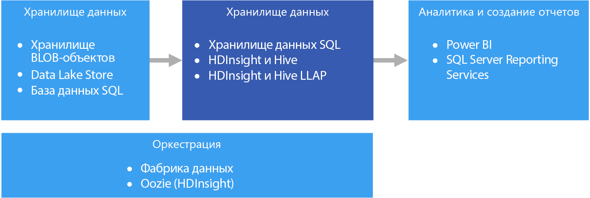

# Хранение данных и киоски данныхData warehousing and data marts

Хранилищем данных называется централизованный, организационный и реляционный репозиторий данных, собранных из одного или нескольких разнородных источников, по нескольким или многим предметным областям.A data warehouse is a central, organizational, relational repository of integrated data from one or more disparate sources, across many or all subject areas. Хранилища данных содержат текущие и архивные данные и обычно применяются для создания отчетов и разных технологий анализа данных.Data warehouses store current and historical data and are used for reporting and analysis of the data in different ways.

Чтобы поместить данные в хранилище данных, они периодически извлекаются из разных источников важной бизнес-информации.To move data into a data warehouse, it is extracted on a periodic basis from various sources that contain important business information. В процессе перемещения эти данные можно отформатировать, очистить, проверить, свести и реорганизовать.As the data is moved, it can be formatted, cleaned, validated, summarized, and reorganized. Есть также возможность сохранить данные с самым низким уровнем детализации и применить для составления отчетов агрегированные представления, доступные в хранилище.Alternately, the data can be stored in the lowest level of detail, with aggregated views provided in the warehouse for reporting. В любом случае хранилище данных становится местом постоянного хранения данных, откуда они извлекаются средствами бизнес-аналитики (BI) для отчетов, анализа и принятия важных решений.In either case, the data warehouse becomes a permanent storage space for data used for reporting, analysis, and forming important business decisions using business intelligence (BI) tools.

## Киоски данных и хранилища операционных данныхData marts and operational data stores

Управление данными в большом объеме — это сложная задача, и сейчас все реже встречаются системы с единым хранилищем для всех данных крупной организации.Managing data at scale is complex, and it is becoming less common to have a single data warehouse that represents all data across the entire enterprise. Вместо этого организации создают небольшие и более специализированные хранилища данных, получившие название *киоски данных*, которые предоставляют необходимые данные для анализа.Instead, organizations create smaller, more focused data warehouses, called *data marts*, that expose the desired data for analytics purposes. В процессе оркестрации киоски данных заполняются информацией из хранилища операционных данных.An orchestration process populates the data marts from data maintained in an operational data store. В этой схеме хранилище операционных данных выполняет роль посредника между системой транзакций, используемой в качестве источника, и киоском данных.The operational data store acts as an intermediary between the source transactional system and the data mart. В хранилище операционных данных представлена очищенная версия данных, собранных в исходной системе транзакций. Как правило, это архивные данные в меньшем объеме из хранилища данных или киоска данных.Data managed by the operational data store is a cleaned version of the data present in the source transactional system, and is typically a subset of the historical data that is maintained by the data warehouse or data mart. 

## Когда следует использовать это решениеWhen to use this solution

Используйте хранилище данных, если на основе большого объема данных из операционных систем вам нужно получить актуальные и точные данные в удобочитаемом формате.Choose a data warehouse when you need to turn massive amounts of data from operational systems into a format that is easy to understand, current, and accurate. Для хранилища данных не обязательно применять такую же сжатую структуру данных, которая используется в оперативной базе данных или OLTP.Data warehouses do not need to follow the same terse data structure you may be using in your operational/OLTP databases. Вы можете присвоить столбцам новые имена, понятные для бизнес-пользователей и аналитиков, изменить структуру схемы для упрощения связей и объединить несколько таблиц в одну.You can use column names that make sense to business users and analysts, restructure the schema to simplify data relationships, and consolidate several tables into one. Следующие действия помогут тем пользователям, которые хотят создать специальные отчеты или создать отчеты и анализировать данные в системах бизнес-аналитики, не обращаясь за помощью к администраторам базы данных (DBA) или разработчикам.These steps help guide users who need to create ad hoc reports, or create reports and analyze the data in BI systems, without the help of a database administrator (DBA) or data developer.

Рассмотрите возможность применить хранилище данных, если вы намерены повысить производительность транзакционных систем, используемых в качестве источника данных, сохраняя архивные данные в другом месте.Consider using a data warehouse when you need to keep historical data separate from the source transaction systems for performance reasons. Хранилища данных упрощают доступ к архивным данным из множества расположений, предоставляя централизованное место хранения с поддержкой стандартных форматов, ключей, моделей данных и методов доступа.Data warehouses make it easy to access historical data from multiple locations, by providing a centralized location using common formats, common keys, common data models, and common access methods.

Хранилища данных оптимизированы для чтения данных, что позволяет быстрее формировать отчеты по сравнению с запросами к исходной транзакционной системе.Data warehouses are optimized for read access, resulting in faster report generation compared to running reports against the source transaction system. Хранилища данных предоставляют еще несколько важных преимуществ:In addition, data warehouses provide the following benefits:

* Все исторические данные из нескольких источников можно хранить и получить из единственного "эталонного" хранилища данных.All historical data from multiple sources can be stored and accessed from a data warehouse as the single source of truth.
* Очистка данных при импорте в хранилище данных повышает их качество, повышает точность сведений и позволяет согласовать коды и описания.You can improve data quality by cleaning up data as it is imported into the data warehouse, providing more accurate data as well as providing consistent codes and descriptions.
* Средства создания отчетов не мешают работе исходных транзакционных систем при обработке запросов.Reporting tools do not compete with the transactional source systems for query processing cycles. Хранилище данных позволяет транзакционной системе сосредоточиться на обработке операций записи, взяв на себя значительную часть запросов на чтение.A data warehouse allows the transactional system to focus predominantly on handling writes, while the data warehouse satisfies the majority of read requests.
* Хранилище данных помогает объединить данные от разных программ.A data warehouse can help consolidate data from different software.
* Средства интеллектуального анализа данных помогают найти скрытые закономерности, применяя автоматизированные методы анализа к данным, размещенным в хранилище.Data mining tools can help you find hidden patterns using automatic methodologies against data stored in your warehouse.
* Хранилища данных позволяют предоставить безопасный доступ авторизованным пользователям и ограничить доступ для всех остальных.Data warehouses make it easier to provide secure access to authorized users, while restricting access to others. Нет необходимости предоставлять бизнес-пользователям доступ к исходным данным, что устраняет потенциальный вектор атак на одну или несколько рабочих транзакционных систем.There is no need to grant business users access to the source data, thereby removing a potential attack vector against one or more production transaction systems.
* Хранилища данных упрощают создание решений бизнес-аналитики на основе данных, таких как [кубы OLAP](online-analytical-processing.md).Data warehouses make it easier to create business intelligence solutions on top of the data, such as [OLAP cubes](online-analytical-processing.md).

## СложностиChallenges

Чтобы правильно настроить хранилища данных в соответствии с требованиями организации, вам нужно решить следующие проблемы:Properly configuring a data warehouse to fit the needs of your business can bring some of the following challenges:

* Достаточное время для правильного моделирования бизнес-концепции.Committing the time required to properly model your business concepts. Это очень важный шаг, так как хранилища данных основаны на информации, и правильное описание концепции станет основой для всего проекта.This is an important step, as data warehouses are information driven, where concept mapping drives the rest of the project. Среди прочего, необходимо стандартизировать деловые термины и форматы (валют, дат и т. п.), а также изменить структуру схемы данных, чтобы сделать ее понятной для бизнес-пользователей, сохраняя точность статистических выражений и связей между данными.This involves standardizing business-related terms and common formats (such as currency and dates), and restructuring the schema in a way that makes sense to business users but still ensures accuracy of data aggregates and relationships.
* Планирование и настройка оркестрации данных.Planning and setting up your data orchestration. Здесь нужно учесть такие факторы, как метод копирования данных из исходной транзакционной системы в хранилище данных и графики перемещения в него архивных данных из хранилищ операционных данных.Consideration include how to copy data from the source transactional system to the data warehouse, and when to move historical data out of your operational data stores and into the warehouse.
* Сохранение или повышение качества данных путем их очистки в процессе импорта в хранилище данных.Maintaining or improving data quality by cleaning the data as it is imported into the warehouse.

## Хранение данных в AzureData warehousing in Azure

В Azure вы можете использовать один или несколько источников данных, например от систем взаимодействия с клиентами или различных бизнес-приложений, используемых в подразделениях организации.In Azure, you may have one or more sources of data, whether from customer transactions, or from various business applications used by various departments. В большинстве случаев эти данные хранятся в одной или нескольких базах данных [OLTP](online-transaction-processing.md).This data is traditionally stored in one or more [OLTP](online-transaction-processing.md) databases. Данные могут существовать и на других носителях, такие как сетевые папки, Azure Storage Blob или Data Lake.The data could be persisted in other storage mediums such as network shares, Azure Storage Blobs, or a data lake. Также данные могут размещаться в самом хранилище данных или в реляционной базе данных, например Базе данных SQL Azure.The data could also be stored by the data warehouse itself or in a relational database such as Azure SQL Database. Уровень хранилища аналитических данных создается для обработки запросов от средств аналитики и создания отчетов, которая выполняется в хранилище данных или в киоске данных.The purpose of the analytical data store layer is to satisfy queries issued by analytics and reporting tools against the data warehouse or data mart. Эту функцию аналитического хранилища в Azure можно возложить на хранилище данных SQL Azure или Azure HDInsight в сочетании с Hive или Interactive Query.In Azure, this analytical store capability can be met with Azure SQL Data Warehouse, or with Azure HDInsight using Hive or Interactive Query. Кроме того, требуется некоторый уровень оркестрации, чтобы периодически перемещать или копировать данные в хранилище данных. Например, это можно сделать с помощью фабрики данных Azure или Oozie в Azure HDInsight.In addition, you will need some level of orchestration to periodically move or copy data from data storage to the data warehouse, which can be done using Azure Data Factory or Oozie on Azure HDInsight.

Связанные службы:Related services:

* [база данных SQL Azure;Azure SQL Database](/azure/sql-database/)
* [SQL Server на виртуальной машине](/sql/sql-server/sql-server-technical-documentation);[SQL Server in a VM](/sql/sql-server/sql-server-technical-documentation)
* [хранилище данных Azure](/azure/sql-data-warehouse/sql-data-warehouse-overview-what-is);[Azure Data Warehouse](/azure/sql-data-warehouse/sql-data-warehouse-overview-what-is)
* [Apache Hive в HDInsight;Apache Hive on HDInsight](/azure/hdinsight/hadoop/hdinsight-use-hive)
* [Interactive Query (Hive LLAP) в HDInsight](/azure/hdinsight/interactive-query/apache-interactive-query-get-started).[Interactive Query (Hive LLAP) on HDInsight](/azure/hdinsight/interactive-query/apache-interactive-query-get-started)

## Выбор технологийTechnology choices

- [Хранилища данныхData warehouses](../technology-choices/data-warehouses.md)
- [Оркестрация конвейеровPipeline orchestration](../technology-choices/pipeline-orchestration-data-movement.md)

