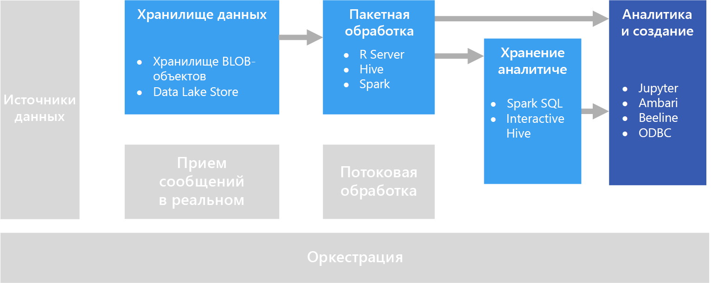

# Интерактивное исследование данныхInteractive data exploration

Во многих корпоративных решениях бизнес-аналитики (BI) специалисты по бизнес-аналитике централизованно создают отчеты и управляют ими.In many corporate business intelligence (BI) solutions, reports and semantic models are created by BI specialists and managed centrally. Но организации все чаще хотят предоставить пользователям возможность принимать решения на основе данных.Increasingly, however, organizations want to enable users to make data-driven decisions. Кроме того, все большее число организаций привлекают *специалистов по анализу данных* или *аналитиков*, в задачи которых входит интерактивный просмотр данных с применением статистических моделей и аналитических методов для поиска тенденций и закономерностей.Additionally, a growing number of organizations are hiring *data scientists* or *data analysts*, whose job is to explore data interactively and apply statistical models and analytical techniques to find trends and patterns in the data. Для интерактивного просмотра данных нужны инструменты и платформы, которые обеспечивают обработку специализированных запросов и визуализаций данных с низкой задержкой.Interactive data exploration requires tools and platforms that provide low-latency processing for ad-hoc queries and data visualizations.

## Бизнес-аналитика с поддержкой самообслуживанияSelf-service BI

Бизнес-аналитика с поддержкой самообслуживания обозначает современный подход к принятию бизнес-решений, при котором пользователи получают возможность в масштабах всего предприятия находить, изучать и совместно использовать результаты анализа данных.Self-service BI is a name given to a modern approach to business decision making in which users are empowered to find, explore, and share insights from data across the enterprise. Для поддержки этого подхода решение должно соответствовать нескольким требованиям:To accomplish this, the data solution must support several requirements:

* обнаружение источников бизнес-данных через каталог данных;Discovery of business data sources through a data catalog.
* управление основными данными для обеспечения согласованности определений и значений для сущностей данных;Master data management to ensure consistency of data entity definitions and values.
* применение инструментов для интерактивного моделирования и визуализации данных для бизнес-пользователей.Interactive data modeling and visualization tools for business users.

В типичном решении бизнес-аналитики с поддержкой самообслуживания бизнес-пользователи могут находить и использовать источники данных, имеющие отношение к конкретной предметной области, а также получают интуитивно удобные средства и повышающие эффективность приложения, позволяющие определять модели данных и отчеты, а также совместно использовать их с коллегами.In a self-service BI solution, business users typically find and consume data sources that are relevant to their particular area of the business, and use intuitive tools and productivity applications to define personal data models and reports that they can share with their colleagues.

Соответствующие службы Azure:Relevant Azure services:

- [Каталог данных AzureAzure Data Catalog](/azure/data-catalog/data-catalog-what-is-data-catalog)
- [Microsoft Power BIMicrosoft Power BI](https://powerbi.microsoft.com/)

## Экспериментирование для обработки и анализа данныхData science experimentation
Если организации требуется расширенная аналитика и прогнозное моделирование, задачи предварительной подготовки обычно выполняют специалисты по обработке и анализу данных.When an organization requires advanced analytics and predictive modeling, the initial preparation work is usually undertaken by specialist data scientists. Специалист по обработке и анализу данных изучает данные и применяет методы статистического анализа для поиска связей между *признаками* данных и требуемыми *метками* прогнозирования.A data scientist explores the data and applies statistical analytical techniques to find relationships between data *features* and the desired predicted *labels*. Просмотр данных обычно выполняется с помощью языков программирования, например Python или R, которые имеют встроенную поддержку статистического моделирования и визуализации.Data exploration is typically done using programming languages such as Python or R that natively support statistical modeling and visualization. Используемые для просмотра данных скрипты обычно размещаются в специализированных средах, например Jupyter Notebook.The scripts used to explore the data are typically hosted in specialized environments such as Jupyter Notebooks. Эти средства позволяют специалистам по обработке и анализу данных с помощью программных средств просматривать данные, а также документировать и совместно использовать обнаруженные закономерности.These tools enable data scientists to explore the data programmatically while documenting and sharing the insights they find.

Соответствующие службы Azure:Relevant Azure services:

- [Azure Notebooks](https://notebooks.azure.com/);[Azure Notebooks](https://notebooks.azure.com/)
- [Студия машинного обучения AzureAzure Machine Learning Studio](/azure/machine-learning/studio/what-is-ml-studio)
- [службы типа "Экспериментирование в Машинном обучении Azure"](/azure/machine-learning/preview/experimentation-service-configuration);[Azure Machine Learning Experimentation Services](/azure/machine-learning/preview/experimentation-service-configuration)
- [виртуальная машина для обработки и анализа данных](/azure/machine-learning/data-science-virtual-machine/overview).[The Data Science Virtual Machine](/azure/machine-learning/data-science-virtual-machine/overview)

## СложностиChallenges

- **Соответствие требованиям к конфиденциальности данных.****Data privacy compliance.** Необходимо соблюдать осторожность при передаче пользователям персональных данных для самостоятельного анализа и составления отчетов.You need to be careful about making personal data available to users for self-service analysis and reporting. Почти наверняка придется принять дополнительные меры для соответствия политикам организации и нормативным требованиям.There are likely to be compliance considerations, due to organizational policies and also regulatory issues. 

- **Объем данных.****Data volume.** Предоставления пользователям полного доступа к источнику данных может принести некоторую пользу, но одновременно приведет к увеличению длительности операций в Excel или Power BI или объема ресурсов кластера для обработки запросов Spark SQL.While it may be useful to give users access to the full data source, it can result in very long-running Excel or Power BI operations, or Spark SQL queries that use a lot of cluster resources.

- **Опыт и знания пользователей**.**User knowledge.** Пользователи создают собственные запросы и статистические функции для принятия бизнес-решений.Users create their own queries and aggregations in order to inform business decisions. Есть ли у вас гарантии того, что их навыков по аналитической обработке и составлению запросов достаточно для получения точных результатов?Are you confident that users have the necessary analytical and querying skills to get accurate results?

- **Совместное использование результатов**.**Sharing results.** Если пользователи могут создавать и совместно использовать отчеты и визуализации данных, возникают дополнительные требования к обеспечению безопасности.There may be security considerations if users can create and share reports or data visualizations.

## АрхитектураArchitecture

Несмотря на то, что основной задачей в этом сценарии является поддержка интерактивного анализа данных, обработка и анализ данных неизбежно сопряжены с процессами очистки, выборки и структурирования данных, которые часто требуют много времени.Although the goal of this scenario is to support interactive data analysis, the data cleansing, sampling, and structuring tasks involved in data science often include long-running processes. Это означает, что разумно применить архитектуру [пакетной обработки](../big-data/batch-processing.md).That makes a [batch processing](../big-data/batch-processing.md) architecture appropriate.

## Выбор технологийTechnology choices

Мы рекомендуем применять следующие технологии для интерактивного просмотра данных в Azure.The following technologies are recommended choices for interactive data exploration in Azure.

### Хранилище данныхData storage

- **Контейнеры хранилища BLOB-объектов Azure** или **Azure Data Lake Store**.**Azure Storage Blob Containers** or **Azure Data Lake Store**. Специалисты по обработке и анализу данных обычно начинают работу с необработанных исходных данных, чтобы получить доступ ко всем возможным признакам, выбросам и ошибкам в этих данных.Data scientists generally work with raw source data, to ensure they have access to all possible features, outliers, and errors in the data. При работе с большими данными это чаще всего файлы в хранилище данных.In a big data scenario, this data usually takes the form of files in a data store.

Дополнительные сведения см. в статье [Выбор технологии хранения больших данных в Azure](../technology-choices/data-storage.md).For more information, see [Data storage](../technology-choices/data-storage.md).

### Пакетная обработкаBatch processing

- **R Server** или **Spark**.**R Server** or **Spark**. Большинство специалистов по обработке и анализу данных используют языки программирования с эффективной поддержкой математических и статистических пакетов, например R или Python.Most data scientists use programming languages with strong support for mathematical and statistical packages, such as R or Python. При работе с большими объемами данных задержку можно снизить путем использования платформ, позволяющих применять в этих языках распределенную обработку.When working with large volumes of data, you can reduce latency by using platforms that enable these languages to use distributed processing. R Server (отдельно или в сочетании со Spark) позволяет масштабировать функции обработки R, а Spark предоставляет встроенную поддержку для аналогичных возможностей масштабирования на языке Python.R Server can be used on its own or in conjunction with Spark to scale out R processing functions, and Spark natively supports Python for similar scale-out capabilities in that language.
- **Hive**.**Hive**. Hive лучше всего подходит для преобразования данных с помощью языка запросов с семантикой SQL.Hive is a good choice for transforming data using SQL-like semantics. Пользователи могут создавать и загружать таблицы с помощью инструкций HiveQL, семантически близких к SQL.Users can create and load tables using HiveQL statements, which are semantically similar to SQL.

Дополнительные сведения см. в статье о [пакетной обработке](../technology-choices/batch-processing.md).For more information, see [Batch processing](../technology-choices/batch-processing.md).

### Хранилище аналитических данныхAnalytical Data Store

- **Spark SQL**.**Spark SQL**. Spark SQL представляет собой API на базе Spark, позволяющий создавать блоки данных и таблицы, к которым можно обращаться через запросы с синтаксисом SQL.Spark SQL is an API built on Spark that supports the creation of dataframes and tables that can be queried using SQL syntax. Независимо от того, какие файлы данных предоставлены для анализа — необработанные исходные файлы или новые файлы, очищенные и подготовленные в процессе пакетной обработки — пользователи могут определить на их основе таблицы Spark SQL и применять для них запросы и аналитические операции.Regardless of whether the data files to be analyzed are raw source files or new files that have been cleaned and prepared by a batch process, users can define Spark SQL tables on them for further querying an analysis. 
- **Hive**.**Hive**. Помимо пакетной обработки необработанных данных Hive позволяет создавать базу данных Hive с таблицами и представлениями Hive, основанными на папках с данными, а также поддерживает интерактивные запросы для аналитики и отчетности.In addition to batch processing raw data by using Hive, you can create a Hive database that contains Hive tables and views based on the folders where the data is stored, enabling interactive queries for analysis and reporting. HDInsight включает тип кластера Interactive Hive, который использует кэширование в памяти, чтобы уменьшить время отклика на запросы Hive.HDInsight includes an Interactive Hive cluster type that uses in-memory caching to reduce Hive query response times. Пользователи, хорошо знакомые с синтаксисом SQL, смогут применить Interactive Hive для изучения данных.Users who are comfortable with SQL-like syntax can use Interactive Hive to explore data.

Дополнительные сведения см. в статье о [хранилищах аналитических данных](../technology-choices/analytical-data-stores.md).For more information, see [Analytical data stores](../technology-choices/analytical-data-stores.md).

### Аналитика и отчетностьAnalytics and reporting

- **Jupyter**.**Jupyter**. Служба Jupyter Notebooks предоставляет браузерный интерфейс для выполнения кода на разных языках, например R, Python или Scala.Jupyter Notebooks provides a browser-based interface for running code in languages such as R, Python, or Scala. Если вы используете R Server или Spark для пакетной обработки данных или Spark SQL для определения схемы таблиц для запросов, Jupyter станет хорошим инструментом для запроса этих данных.When using R Server or Spark to batch process data, or when using Spark SQL to define a schema of tables for querying, Jupyter can be a good choice for querying the data. В Spark вы сможете применить стандартный API Spark для кадров данных или API Spark SQL, а также внедренные инструкции SQL для запроса данных и создания визуализаций.When using Spark, you can use the standard Spark dataframe API or the Spark SQL API as well as embedded SQL statements to query the data and produce visualizations.
- **Drill**.**Drill**. Чтобы выполнить ad-hoc-анализ, можно использовать специальный обработчик SQL-запросов [Apache Drill](https://drill.apache.org/).If you want to perform ad hoc data exploration, [Apache Drill](https://drill.apache.org/) is a schema-free SQL query engine. Так как в этом случае схема не требуется, вы можете запрашивать данные из разных источников данных. При этом обработчик будет автоматически распознавать структуру данных.Because it doesn't require a schema, you can query data from a variety of data sources, and the engine will automatically understand the structure of the data.  Вы можете использовать Apache Drill со службой хранилища BLOB-объектов Azure, применив [подключаемый модуль службы хранилища BLOB-объектов Azure](https://drill.apache.org/docs/azure-blob-storage-plugin/).You can use Drill with Azure Blob Storage, by using the [Azure Blob Storage Plugin](https://drill.apache.org/docs/azure-blob-storage-plugin/). Это позволяет выполнять запросы к данным в хранилище BLOB-объектов без необходимости перемещать эти данные.This lets you run queries against data in Blob Storage without having to move the data. 
- **Клиенты Interactive Hive**.**Interactive Hive Clients**. Если вы используете кластер Interactive Hive для запроса данных, вам доступны представления Hive на панели мониторинга для кластера Ambari, средство командной строки Beeline и любые средства на основе ODBC (с применением драйвера Hive ODBC), такие как Microsoft Excel и Power BI.If you use an Interactive Hive cluster to query the data, you can use the Hive view in the Ambari cluster dashboard, the Beeline command line tool, or any ODBC-based tool (using the Hive ODBC driver), such as Microsoft Excel or Power BI.

Дополнительные сведения см. в статье [о технологиях аналитики данных и отчетности](../technology-choices/analysis-visualizations-reporting.md).For more information, see [Data analytics and reporting technology](../technology-choices/analysis-visualizations-reporting.md).
