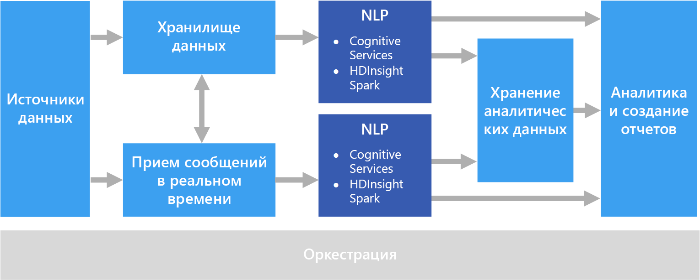

# Обработка естественного языка

Обработка естественного языка (NLP) используется для таких задач, как анализ тональности, распознавание тем, распознавание языка, извлечение ключевых фраз и классификация документов.

## Когда следует использовать это решение

NLP можно использовать для классификации документов, например, чтобы пометить документы как конфиденциальные или как спам. Выходные данные NLP можно использовать для последующей обработки или поиска. NLP также можно использовать для реферирования текста путем определения сущностей, присутствующих в документе. Эти сущности также можно использовать для добавления тегов к документам с использованием ключевых слов, что обеспечивает поиск и извлечение на основе содержимого. Сущности можно объединять в разделы с аннотациями, в которых описаны важные темы, присутствующие в каждом документе. С помощью распознанных тем можно классифицировать документы для навигации или перечисления связанных документов на основе выбранной темы. Кроме того, NLP может использоваться для определения тональности текста (положительной или отрицательной). Для этих подходов используется множество методов обработки естественного языка: 

- **Создатель маркеров**. Разделение текста на слова или фразы.
- **Выделение корней слов и лемматизация**. Нормализация слов таким образом, чтобы различные формы слов сопоставлялись с начальной формой слова с таким же значением. Например, "запускающийся" и "запущен" должны сопоставляться со словом "запуск". 
- **Извлечение сущностей**. Определение тем в тексте.
- **Определение части речи**. Определение в тексте глаголов, существительных, причастий, глагольных конструкций и т. д.
- **Определение границ предложений**. Определение полных предложений в абзацах текста.

При использовании NLP для извлечения сведений и данных из текста в свободной форме начальной точкой обычно являются необработанные документы, хранящиеся в хранилище объектов, например в службе хранилища Azure или Azure Data Lake Store. 

## Сложности

- Как правило, для обработки коллекции текстовых документов в свободной форме требуется много времени и вычислительных ресурсов.
- Без стандартного формата документов очень сложно достичь точных результатов, используя обработку текста в свободной форме для извлечения конкретных фактов из документа. Например, для такого текстового представления, как накладная, может быть сложно создать процесс, который правильно извлечет номер и дату накладной при обработке накладных от того или иного количества поставщиков.

## Архитектура

В решении NLP обработка текста в свободной форме выполняется для документов, содержащих абзацы. Общая архитектура может быть архитектурой [пакетной обработки](../big-data/batch-processing.md) или [потоковой обработки в режиме реального времени](../big-data/real-time-processing.md).

Фактическая обработка отличается в зависимости от желаемого результата. Но с точки зрения конвейера NLP может применяться в рамках пакетной обработки или в режиме реального времени. Например, анализ тональности может применяться к блокам текста, позволяя получить оценку тональности. Это можно сделать с помощью пакетной обработки данных в хранилище или в режиме реального времени с использованием небольших блоков данных, проходящих через службу обмена сообщениями.

## Выбор технологий

- [Обработка естественного языка](../technology-choices/natural-language-processing.md)