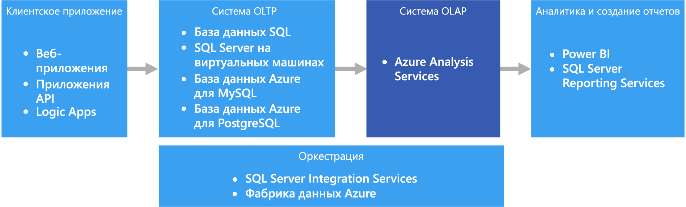

# Оперативная аналитическая обработка (OLAP)

Оперативная аналитическая обработка (OLAP) — это технология, которая упорядочивает большие коммерческие базы данных и поддерживает сложный анализ. Ее можно использовать для выполнения сложных аналитических запросов без негативного воздействия на системы транзакций.

Базы данных, в которых компании хранят свои транзакции и записи, называются базами данных [оперативной обработки транзакций (OLTP)](online-transaction-processing.md). Такие базы данных обычно содержат записи, которые вводятся поочередно. Часто они содержат много ценных для организации сведений. Но базы данных, используемые для OLTP, не предназначены для анализа. Поэтому извлечение ответов из этих баз данных требует много времени и усилий. Системы OLAP предназначены для извлечения этих сведений бизнес-аналитики из данных максимально оптимальным способом. Это достигается благодаря тому, что базы данных OLAP оптимизированы для рабочих нагрузок с большим числом операций чтения и малым числом операций записи.

 

## Когда следует использовать это решение

Рекомендуем использовать OLAP в следующих сценариях:

- если нужно выполнять сложные аналитические и нерегламентированные запросы быстро и без негативного воздействия на системы OLTP; 
- если нужно предоставить бизнес-пользователям компании простой способ создания отчетов на основе ваших данных;
- если нужно предоставить много агрегатов, с помощью которых пользователи смогут оперативно получать согласованные результаты. 

Технология OLAP особенно полезна при выполнении статистических вычислений для больших объемов данных. Системы OLAP оптимизированы для сценариев с большим числом операций чтения, например для анализа и бизнес-аналитики. OLAP позволяет пользователям сегментировать многомерные данные на срезы, которые можно просматривать в двух измерениях (например, в сводной таблице), или фильтровать данные по определенным значениям. Этот процесс иногда называется "сегментирование и фрагментирование" данных. Его можно выполнять, даже если данные секционированы по нескольким источникам. Такой процесс помогает пользователям определять тенденции, выделять шаблоны и просматривать данные без специальных знаний о традиционном анализе.

[Семантические модели](../concepts/semantic-modeling.md) помогают бизнес-пользователям абстрагировать сложности связей и быстро анализировать данные.

## Сложности

При всех преимуществах систем OLAP они создают и некоторые проблемы:

- Данные в системах OLTP постоянно обновляются за счет транзакций, передаваемых в из разных источников, а хранилища данных OLAP обычно обновляются гораздо реже, в зависимости от потребностей компании. Это означает, что системы OLAP скорее подходят для стратегических бизнес-решений, чем для немедленной реакции на изменения. Кроме того, для поддержки хранилищ данных OLAP в актуальном состоянии необходимо запланировать определенный уровень очистки данных и оркестрации.
- В отличие от традиционных нормализованных реляционных таблиц в системах OLTP, модели данных OLAP обычно являются многомерными. Из-за этого бывает сложно или невозможно непосредственно сопоставить отношения сущностей или объектно-ориентированные модели, где каждый атрибут сопоставляется с одним столбцом. Поэтому вместо традиционной нормализации в системах OLAP обычно используются схемы типа "снежинка" или "звезда".

## OLAP в Azure

В Azure данные, хранящиеся в системах OLTP, например в службе "База данных SQL", копируются в систему OLAP, например в [Azure Analysis Services](/azure/analysis-services/analysis-services-overview). Средства просмотра и визуализации данных, в том числе [Power BI](https://powerbi.microsoft.com), Excel и решения сторонних производителей, подключаются к серверам Analysis Services и предоставляют пользователям интерактивные визуальные представления моделей данных для анализа. Поток данных из системы OLTP в OLAP обычно оркестрируется с помощью SQL Server Integration Services и службы [Фабрика данных Azure](/azure/data-factory/concepts-integration-runtime).

## Выбор технологий

- [Хранилища данных OLAP](../technology-choices/olap-data-stores.md)

