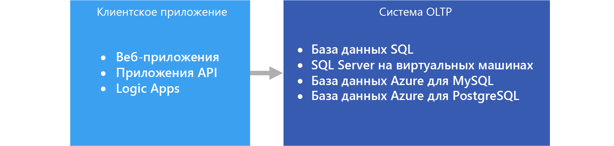

# Оперативная обработка транзакций (OLTP)Online transaction processing (OLTP)

Оперативная обработка транзакций (OLTP) — это управление [данными о транзакциях](../concepts/transactional-data.md) с помощью компьютерных систем.The management of [transactional data](../concepts/transactional-data.md) using computer systems is referred to as Online Transaction Processing (OLTP). Системы OLTP записывают операции обмена данными в организации, выполняющиеся каждый день, и поддерживают запрашивание этих данных, чтобы на их основе делать выводы.OLTP systems record business interactions as they occur in the day-to-day operation of the organization, and support querying of this data to make inferences.

## Когда следует использовать это решениеWhen to use this solution

Выбирайте OLTP, чтобы обеспечить эффективную обработку и хранение бизнес-транзакций, а также быстро и согласованно предоставлять доступ к ним для клиентских приложений.Choose OLTP when you need to efficiently process and store business transactions and immediately make them available to client applications in a consistent way. Используйте эту архитектуру, если любые ощутимые задержки при обработке отрицательно повлияют на повседневную работу организации.Use this architecture when any tangible delay in processing would have a negative impact on the day-to-day operations of the business.

Системы OLTP предназначены для эффективной обработки и хранения транзакций, а также для запрашивания данных о транзакциях.OLTP systems are designed to efficiently process and store transactions, as well as query transactional data. Эффективная обработка и хранение отдельных транзакций в системе OLTP частично достигается путем нормализации данных &mdash; разделения данных на более мелкие и менее избыточные блоки.The goal of efficiently processing and storing individual transactions by an OLTP system is partly accomplished by data normalization &mdash; that is, breaking the data up into smaller chunks that are less redundant. Это обеспечивает эффективность, так как система OLTP может независимо обрабатывать большое число транзакций, и позволяет избежать дополнительной обработки, необходимой для поддержания целостности данных при наличии избыточных данных.This supports efficiency because it enables the OLTP system to process large numbers of transactions independently, and avoids extra processing needed to maintain data integrity in the presence of redundant data.

## СложностиChallenges
При реализации и использовании системы OLTP могут возникнуть некоторые сложности:Implementing and using an OLTP system can create a few challenges:

- Системы OLTP не всегда подходят для обработки статистических выражений при больших объемах данных. Хотя существуют исключения, например хорошо продуманное решение на основе SQL Server.OLTP systems are not always good for handling aggregates over large amounts of data, although there are exceptions, such as a well-planned SQL Server-based solution. Анализ данных, которые основаны на статистических вычислениях более миллиона отдельных транзакций, является очень ресурсоемким для системы OLTP.Analytics against the data, that rely on aggregate calculations over millions of individual transactions, are very resource intensive for an OLTP system. Он может медленно выполняться и привести к снижению производительности из-за блокировки других транзакций в базе данных.They can be slow to execute and can cause a slow-down by blocking other transactions in the database.
- При проведении анализа и создании отчетов по данным с высокой степенью нормализации запросы, как правило, будут сложными, так как для большинства запросов требуется денормализовать данные с помощью соединений.When conducting analytics and reporting on data that is highly normalized, the queries tend to be complex, because most queries need to de-normalize the data by using joins. Кроме того, соглашения об именовании для объектов базы данных в системах OLTP, как правило, являются неполными и сжатыми.Also, naming conventions for database objects in OLTP systems tend to be terse and succinct. Из-за высокой нормализации и неполного соглашения об именовании бизнес-пользователям трудно выполнять запросы в системах OLTP без помощи разработчика архитектуры данных или администратора базы данных.The increased normalization coupled with terse naming conventions makes OLTP systems difficult for business users to query, without the help of a DBA or data developer.
- Бессрочное хранение журналов транзакций и хранение большого количества данных в одной таблице могут снизить производительность запросов в зависимости от числа хранящихся транзакций.Storing the history of transactions indefinitely and storing too much data in any one table can lead to slow query performance, depending on the number of transactions stored. Распространенным решением является поддержание соответствующего периода времени (например, текущий финансовый год) в системе OLTP и перезапись данных журнала в другие системы, такие как киоск данных или [хранилище данных](../technology-choices/data-warehouses.md).The common solution is to maintain a relevant window of time (such as the current fiscal year) in the OLTP system and offload historical data to other systems, such as a data mart or [data warehouse](../technology-choices/data-warehouses.md).

## OLTP в AzureOLTP in Azure

Как правило, такие приложения, как веб-сайты, размещенные в [веб-приложениях службы приложений](/azure/app-service/app-service-web-overview), REST API, запущенные в службе приложений, а также мобильные и классические приложения, взаимодействуют с системой OLTP через промежуточный интерфейс REST API.Applications such as websites hosted in [App Service Web Apps](/azure/app-service/app-service-web-overview), REST APIs running in App Service, or mobile or desktop applications communicate with the OLTP system, typically via a REST API intermediary.

На практике большинство рабочих нагрузок выполняются не только в системе OLTP.In practice, most workloads are not purely OLTP. Для них также требуется [аналитический компонент](../scenarios/online-analytical-processing.md).There tends to be an [analytical component](../scenarios/online-analytical-processing.md) as well. Кроме того, растет потребность в создании отчетов в режиме реального времени, например создание отчетов в операционной системе.In addition, there is an increasing demand for real-time reporting, such as running reports against the operational system. Также это называют HTAP (гибридная транзакционно-аналитическая обработка).This is also referred to as HTAP (Hybrid Transactional and Analytical Processing). Дополнительные сведения см. в статье [о хранилище данных OLAP](../technology-choices/olap-data-stores.md).For more information, see [Online Analytical Processing (OLAP) data stores](../technology-choices/olap-data-stores.md).

## Выбор технологийTechnology choices

Хранилище данных:Data storage:

- [база данных SQL Azure;Azure SQL Database](/azure/sql-database/)
- [SQL Server на виртуальной машине Azure](/azure/virtual-machines/windows/sql/virtual-machines-windows-sql-server-iaas-overview?toc=%2Fazure%2Fvirtual-machines%2Fwindows%2Ftoc.json);[SQL Server in an Azure VM](/azure/virtual-machines/windows/sql/virtual-machines-windows-sql-server-iaas-overview?toc=%2Fazure%2Fvirtual-machines%2Fwindows%2Ftoc.json)
- [База данных Azure для MySQLAzure Database for MySQL](/azure/mysql/)
- [База данных Azure для PostgreSQLAzure Database for PostgreSQL](/azure/postgresql/)

Дополнительные сведения см. в статье [Выбор хранилища данных OLAP в Azure](../technology-choices/oltp-data-stores.md).For more information, see [Choosing an OLTP data store](../technology-choices/oltp-data-stores.md)

Источники данных:Data sources:

- [Службы приложенийApp service](/azure/app-service/)
- [Мобильные приложенияMobile Apps](/azure/app-service-mobile/)

