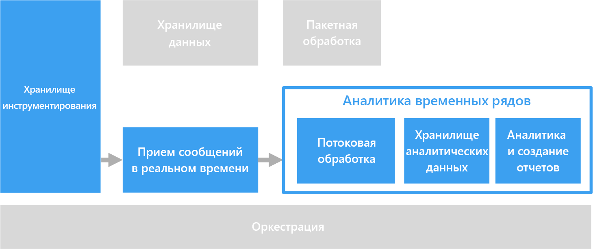

# Решения для временных рядов

Данные временных рядов — это набор значений, упорядоченных по времени. Примерами данных временных рядов являются данные датчиков, курса акций, посещаемости сайтов и данные телеметрии приложений. Благодаря анализу данных временных рядов можно узнавать исторические тенденции, получать оповещения в реальном времени или выполнять прогнозное моделирование.

Данные временных рядов — это сведения об изменении состояния ресурса или процесса с течением времени. У этих данных есть метка времени, но важнее то, что время — это самая значимая ось для просмотра и анализа данных. Обычно данные временных рядов поступают в строгой очередности, а их сохранение выполняется как вставка, а не обновление. Поэтому информация об изменениях поступает с течением времени, что позволяет анализировать прошедшие периоды и прогнозировать изменения на будущие. Следовательно, данные временных рядов лучше всего визуализировать с помощью точечных диаграмм или графиков.

Вот некоторые примеры данных временных рядов:

- Данные курса акций, записываемые в долгосрочной перспективе для определения тенденций.
- Данные производительности сервера, например загрузки ЦП, нагрузки ввода-вывода, использования памяти и пропускной способности сети.
- Данные телеметрии с датчиков промышленного оборудования, которые можно использовать для определения возможных сбоев и уведомления.
- Данные телеметрии автомобилей, получаемые в реальном времени, в том числе сведения о скорости, торможении и ускорении за временное окно, позволяющие создавать статистическую оценку риска для водителя.

Каждый из этих примеров подтверждает значимость времени как оси. Отображение событий в порядке их возникновения является ключевой характеристикой данных временных рядов, так как сохраняется естественная хронология. В этом заключается отличие от записи данных в стандартных конвейерах данных OLTP, где сведения можно вводить в любом порядке и обновлять в любое время.

## Когда следует использовать это решение

Решение временных рядов следует выбрать, если необходимо принимать данные, стратегическое значение которых основывается на динамике изменений за период времени, а новые данные требуется сохранять в основном путем вставки, и редко — обновления, если оно вообще используется. Эти сведения можно использовать, чтобы обнаруживать аномалии, визуализировать тенденции, сравнивать текущие данные с историческими, и для многого другого. Этот тип архитектуры также идеально подходит для прогнозного моделирования и прогнозирования результатов, так как имеющуюся историческую запись изменений можно применять ко множеству моделей прогнозирования.

Использование данных временных рядов предоставляет следующие преимущества:

- Ясно показывают то, как изменялось состояние ресурса или процесса с течением времени.
- Позволяют быстро выявить изменения в нескольких связанных источниках, четко выделяя аномалии и новые тенденции.
- Идеально подходят для прогнозного моделирования и прогнозирования.

### Интернет вещей.

Данные, собранные устройствами Интернета вещей, естественным образом подходят для хранения временных рядов и анализа. Входные данные вставляются, обновление ими базы данных используется редко, если вообще применяется. К данным прикрепляется метка времени, и они вставляются в порядке получения. Обычно эти данные отображаются в хронологическом порядке, что позволяет пользователям определять тенденции, выявлять аномалии и пользоваться этими сведениями для прогнозного анализа.

Дополнительные сведения см. в разделе [Интернет вещей](../big-data/index.md#internet-of-things-iot).

### Анализ в реальном времени

Данные временных рядов меняются с учетом времени, т. е. действия по определению тенденций в режиме реального времени и созданию предупреждений следует предпринимать быстро. В этих сценариях задержки в анализе могут повлечь простои и повлиять на бизнес. Кроме того, зачастую необходимо коррелировать данные из множества разных источников, таких как датчики.

Лучше всего создать уровень обработки потоков, способный обрабатывать входные данные в реальном времени с высокой точностью и степенью детализации. Но это не всегда возможно и зависит от компонентов буферизации и архитектуры потоковой передачи, а также уровней обработки потоков. Возможно, потребуется пренебречь точностью данных временных рядов, сократив их. Для этого используется обработка скользящих временных окон (например, длительностью несколько секунд), позволяющая своевременно выполнять вычисления на уровне обработки. Может также потребоваться уменьшить выборку и выполнить статистическое вычисление данных при отображении длительных периодов времени, например масштабировать, чтобы просмотреть данные, записанные в течение нескольких месяцев.

## Сложности

- Данные временных рядов зачастую отличаются очень большим объемом, особенно в сценариях с использованием Интернета вещей. Хранение, индексирование, выполнение запросов, анализ и визуализация данных временных рядов может представлять определенные трудности.

- Подбор правильного сочетания высокоскоростного хранилища и мощных вычислительных операций для анализа в реальном времени может оказаться сложной задачей, но это сокращает время выхода на рынок и уменьшает общую стоимость инвестиций.

## Архитектура

Во многих сценариях с использованием данных временных рядов, к примеру для Интернета вещей, данные записываются в реальном времени. Следовательно, архитектура [обработки в режиме реального времени](../big-data/real-time-processing.md) — подходящий вариант.

[Центр Интернета вещей](/azure/iot-hub/), [Центры событий](/azure/event-hubs/) или [Kafka HDInsight](/azure/hdinsight/kafka/apache-kafka-introduction) передают данные из одного или нескольких источников на уровень буферизации потоковой передачи. Затем на уровне обработки данных происходит соответствующий процесс, отсюда можно передать обработанные данные в службу машинного обучения для прогнозного анализа. Обработанные данные хранятся в хранилище аналитических данных, таком как [HBase](/azure/hdinsight/hbase/apache-hbase-overview), [Azure Cosmos DB](/azure/cosmos-db/), Azure Data Lake или хранилище BLOB-объектов. Чтобы просмотреть и проанализировать данные временных рядов, можно использовать приложения и службы анализа и создания отчетов, такие как Power BI или OpenTSDB (если данные хранятся в HBase).

Еще один способ — использовать службу [Аналитика временных рядов Azure](/azure/time-series-insights/). Это полностью управляемая служба для работы с данными временных рядов. В этой архитектуре служба "Аналитика временных рядов" выполняет такие функции, как потоковая передача, хранение данных, анализ и создание отчетов. Она принимает потоки данных из Центра Интернета вещей или Центров событий и хранилищ, обрабатывает, анализирует и показывает данные почти в реальном времени. Эта служба не выполняет статистические вычисления, но сохраняет необработанные события.

Аналитика временных рядов адаптируется к схемам. Это значит, что перед анализом не нужно подготавливать данные. Это позволяет легко просматривать, сравнивать и сопоставлять различные источники данных. В этой службе также предусмотрены фильтры и статистические выражения типа SQL, возможность создавать, визуализировать, сравнивать и накладывать различные шаблоны временных рядов, тепловые карты, а также сохранять и совместно использовать запросы.

## Выбор технологий

- [Хранение данных](../technology-choices/data-storage.md)
- [Анализ, визуализация и отчетность](../technology-choices/analysis-visualizations-reporting.md)
- [Хранилища аналитических данных](../technology-choices/analytical-data-stores.md)
- [Потоковая обработка](../technology-choices/stream-processing.md)