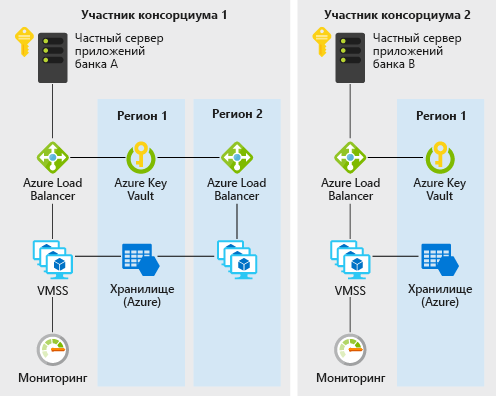

# Децентрализованное доверие между банками в AzureDecentralized trust between banks on Azure

Этот пример сценария полезен для банков или любых других учреждений, которые хотят реализовать доверенную среду для обмена данными без обращения к централизованной базе данных.This example scenario is useful for banks or any other institutions that want to establish a trusted environment for information sharing without resorting to a centralized database. В данном примере описывается сценарий в контексте обслуживания данных о кредитных баллах между банками, но архитектура может применяться к любому сценарию, в котором консорциум организаций хочет поделиться проверенными данными друг с другом без обращения к центральной системе, которой управляет одна сторона.For the purpose of this example, we will describe the scenario in the context of maintaining credit score information between banks, but the architecture can be applied to any scenario where a consortium of organizations want to share validated information with one another without resorting to the use of a central system ran by one single party.

Традиционно банки в рамках финансовой системы полагаются на централизованные источники, такие как кредитные бюро для получения данных о кредитных баллах и истории.Traditionally, banks within a financial system rely on centralized sources such as credit bureaus for information on an individual's credit score and history. Централизованный подход представляет собой концентрацию операционного риска, а иногда и ненужную третью сторону.A centralized approach presents a concentration of operational risk and sometimes an unnecessary third party.

С помощью DLT (технология распределенного реестра) консорциум банков может создать децентрализованную систему, которая может быть более эффективной, менее подверженной атакам и служить новой платформой, где инновационные структуры могут быть реализованы для решения традиционных задач обеспечения конфиденциальности, скорости и стоимости.With DLTs (distributed ledger technology), a consortium of banks can establish a decentralized system that can be more efficient, less susceptible to attack, and serve as a new platform where innovative structures can be implemented to solve traditional challenges with privacy, speed, and cost.

В этом примере показано, как можно быстро настроить службы Azure, такие как масштабируемый набор виртуальных машин, виртуальную сеть, Key Vault, службу хранилища, Load Balancer и Monitor для развертывания эффективного частного блокчейна Ethereum PoA, где банки-члены могут создавать собственные узлы.This example will show you how Azure services such as virtual machine scale set, Virtual Network, Key Vault, Storage, Load Balancer, and Monitor can be quickly provisioned for the deployment of an efficient private Ethereum PoA blockchain where member banks can establish their own nodes.

## Варианты соответствующего использованияRelevant use cases

Следующие варианты использования имеют похожие шаблоны проектирования.These other uses cases have similar design patterns:

* Перемещение выделенных бюджетов между различными бизнес-единицами многонациональной корпорацииMovement of allocated budgets between different business units of a multinational corporation
* Трансграничные платежиCross-border payments
* Сценарии торгового финансированияTrade finance scenarios
* Системы лояльности с участием разных компанийLoyalty systems involving different companies
* Экосистемы цепочки поставок и др.Supply chain ecosystems and many more

## АрхитектураArchitecture

В этом сценарии рассматриваются компоненты серверной части, необходимые для создания масштабируемой, защищенной и контролируемой частной сети корпоративного блокчейна в консорциуме из двух или более членов.This scenario covers the back-end components that are necessary to create a scalable, secure, and monitored private, enterprise blockchain network within a consortium of two or more members. Подробная информация о том, как эти компоненты предоставляются (то есть в разных подписях и группах ресурсов), а также требования к подключению (то есть VPN или ExpressRoute) оставляются для вашего рассмотрения на основе требований к политике вашей организации.Details of how these components are provisioned (that is, within different subscriptions and resource groups) as well as the connectivity requirements (that is, VPN or ExpressRoute) are left for your consideration based on your organization's policy requirements. Ниже приведен пример прохождения потока данных.Here's how data flows:

1. Банк А создает и обновляет кредитную запись отдельного лица, отправляя транзакции в сеть блокчейна с помощью JSON-RPC.Bank A creates/updates an individual's credit record by sending a transaction to the blockchain network via JSON-RPC.
2. Данные передаются с сервера частных приложений банка А в балансировщик нагрузки Azure, а затем в проверяющий узел масштабируемого набора виртуальных машин.Data flows from Bank A's private application server to the Azure load balancer and subsequently to a validating node VM on the virtual machine scale set.
3. Сеть Ethereum PoA создает блок в заданное время (2 секунды для этого сценария).The Ethereum PoA network creates a block at a preset time (2 seconds for this scenario).
4. Транзакция вставляется в созданный блок и проверяется через сеть блокчейна.The transaction is bundled into the created block and validated across the blockchain network.
5. Банк B может читать кредитную запись, созданную банком A, путем связи с собственным узлом аналогичным образом с помощью JSON-RPC.Bank B can read the credit record created by bank A by communicating with its own node similarly via JSON-RPC.

### КомпонентыComponents

* виртуальные машины в масштабируемых наборах виртуальных машин предоставляют средство вычислений по запросу для размещения процессов проверяющего элемента управления для блокчейна;Virtual Machines within Virtual Machine Scale Sets provides the on-demand compute facility to host the validator processes for the blockchain
* Key Vault используется как безопасное хранилище для закрытых ключей каждого проверяющего элемента управления;Key Vault is used as the secure storage facility for the private keys of each validator
* Load Balancer распределяет запросы RPC, пиринга и децентрализованного приложения системы управления;Load Balancer spreads the RPC, peering, and Governance DApp requests
* служба хранилища размещает сведения о сети и координации аренды;Storage hosting persistent network information and coordinating leasing
* Operations Management Suite (объединение нескольких служб Azure) предоставляет сведения о доступных узлах, транзакциях в минуту и членах консорциума.Operations Management Suite (a bundling of a few Azure services) provides insight into available nodes, transactions per minute and consortium members

### Альтернативные вариантыAlternatives

В этом примере выбран подход Ethereum PoA, поскольку он является хорошей точкой входа для консорциума организаций, которые хотят создать среду, в которой можно обмениваться данными и с легкостью совместно использовать их доверенным, децентрализованным и понятным способом.The Ethereum PoA approach is chosen for this example because it is a good entry point for a consortium of organizations that want to create an environment where information can be exchanged and shared with one another easily in a trusted, decentralized, and easy to understand way. Доступные шаблоны решений Azure также обеспечивают быстрый и удобный способ запуска блокчейна Ethereum PoA не только для лидера консорциума, но и для организаций-членов консорциума, чтобы развернуть собственные ресурсы Azure в рамках своей группы ресурсов и подписки для присоединения к существующей сети.The available Azure solution templates also provide a fast and convenient way not just for a consortium leader to start an Ethereum PoA blockchain, but also for member organizations in the consortium to spin up their own Azure resources within their own resource group and subscription to join an existing network.

Для других расширенных или разных сценариев может возникнуть такая проблема, как конфиденциальность транзакций.For other extended or different scenarios, concerns such as transaction privacy may arise. Например, в сценарии передачи ценных бумаг члены консорциума могут не хотеть, чтобы их транзакции отображались для других членов.For example, in a securities transfer scenario, members in a consortium may not want their transactions to be visible even to other members. Существуют и другие альтернативы Ethereum PoA, которые решают эти проблемы по-своему.Other alternatives to Ethereum PoA exist that addresses these concerns in their own way:

* CordaCorda
* КворумQuorum
* HyperledgerHyperledger

## РекомендацииConsiderations

### ДоступностьAvailability

[Azure Monitor][monitor] используется для непрерывного мониторинга сети блокчейна, чтобы обеспечить доступность.[Azure Monitor][monitor] is used to continuously monitor the blockchain network for issues to ensure availability. Ссылка на пользовательскую панель мониторинга на основе Azure Monitor будет отправлена вам после успешного развертывания шаблона решения блокчейна, используемого в этом сценарии.A link to a custom monitoring dashboard based on Azure Monitor will be sent to you upon successful deployment of the blockchain solution template used in this scenario. На панели мониторинга отображаются узлы, сообщающие о пакетах пульса за последние 30 минут, а также другая полезная статистика.The dashboard shows nodes that are reporting heartbeats in the past 30 minutes as well as other useful statistics. 

Дополнительные сведения по другим вопросам доступности см. в статье [с контрольным списком для обеспечения доступности][availability] в Центре архитектуры Azure.For other availability topics, see the [availability checklist][availability] in the Azure Architecture Center.

### МасштабируемостьScalability

Популярной проблемой для блокчейна является количество транзакций, которые он может включать в течение заданного промежутка времени.A popular concern for blockchain is the number of transactions that a blockchain can include within a preset amount of time. Этот сценарий использует алгоритм Proof-of-Authority, где такая масштабируемость может быть лучше управляемой, чем Proof-of-Work.This scenario uses Proof-of-Authority where such scalability can be better managed than Proof-of-Work. В сетях, основанных на алгоритме Proof-of-Authority, участники консенсуса известны и управляемы, что делает консенсус более подходящим для частного блокчейна консорциума организаций, которые известны друг другу.In Proof-of-Authority based networks, consensus participants are known and managed, making it more suitable for private blockchain for a consortium of organization that knows one another. Параметры, такие как среднее время блока, транзакции в минуту и потребление ресурсов вычислений, можно легко контролировать через пользовательскую панель мониторинга.Parameters such as average block time, transactions per minute and compute resource consumption can be easily monitored via the custom dashboard. Затем ресурсы можно настроить в зависимости от требований к масштабированию.Resources can then be adjusted accordingly based on scale requirements.

Общие рекомендации по разработке масштабируемого сценария см. в [контрольном списке для обеспечения масштабируемости][scalability] в Центре архитектуры Azure.For general guidance on designing scalable scenario, see the [scalability checklist][scalability] in the Azure Architecture Center.

### БезопасностьSecurity

[Azure Key Vault][vault] используется для простого хранения и управления закрытыми ключами проверяющего элемента управления.[Azure Key Vault][vault] is used to easily store and manage the private keys of validators. Развертывание по умолчанию в этом примере создает сеть блокчейна, доступную через Интернет.The default deployment in this example creates a blockchain network that is accessible via the internet. Для сценария производства, где требуется частная сеть, члены могут быть подключены друг к другу через подключение VPN-шлюза типа "виртуальная сеть — виртуальная сеть".For production scenario where a private network is desired, members can be connected to each other via VNet-to-VNet VPN gateway connections. Шаги по настройке VPN включены в разделе связанных ресурсов ниже.The steps for configuring a VPN are included in the related resources section below.

Общие рекомендации по разработке безопасных решений см. в разделе [Azure Security Documentation][security].For general guidance on designing secure solutions, see the [Azure Security Documentation][security].

### УстойчивостьResiliency

Блокчейн Ethereum PoA сам по себе может обеспечить некоторую степень устойчивости, поскольку узлы проверяющего элемента управления могут быть развернуты в разных регионах.The Ethereum PoA blockchain can itself provide some degree of resilience as the validator nodes can be deployed in different regions. Azure имеет параметры для развертывания в более чем 54 регионах по всему миру.Azure has options for deployments in over 54 regions worldwide. Блокчейн, как в этом сценарии, предоставляет уникальные и обновленные возможности сотрудничества для повышения устойчивости.A blockchain such as the one in this scenario provides unique and refreshing possibilities of cooperation to increase resilience. Устойчивость сети обеспечивается не только одной централизованной стороной, но и всеми членами консорциума.The resilience of the network is not just provided for by a single centralized party but all members of the consortium. Блокчейн, основанный на алгоритме Proof-of-Authority, позволяет повысить устойчивость сети и ее работоспособность.A Proof-of-Authority based blockchain allows network resilience to be even more planned and deliberate.

Общее руководство по проектированию устойчивых решений см. в разделе [Проектирование устойчивых приложений для Azure][resiliency].For general guidance on designing resilient solutions, see [Designing resilient applications for Azure][resiliency].

## ЦеныPricing

Чтобы изучить стоимость выполнения этого сценария, все услуги были предварительно сконфигурированы в калькуляторе стоимости.To explore the cost of running this scenario, all of the services are pre-configured in the cost calculator. Чтобы узнать, как изменится цена для вашего конкретного варианта использования, измените соответствующие переменные в соответствии с ожидаемыми требованиями к производительности и доступности.To see how the pricing would change for your particular use case, change the appropriate variables to match your expected performance and availability requirements.

Мы предоставили три примера профилей затрат, основанных на количестве экземпляров масштабируемых наборов виртуальных машин для запуска приложений (экземпляры могут находиться в разных регионах).We have provided three sample cost profiles based on the number of scale set VM instances that run your applications (the instances can reside in different regions).

* [Небольшой][small-pricing]. Этот пример тарификации предполагает наличие 2 виртуальных машин в месяц с отключенным мониторингом.[Small][small-pricing]: this pricing example correlates to 2 VMs per month with monitoring turned off
* [Средний][medium-pricing]. Этот пример тарификации предполагает наличие 7 виртуальных машин в месяц с включенным мониторингом.[Medium][medium-pricing]: this pricing example correlates to 7 VMs per month with monitoring turned on
* [Большой][large-pricing]. Этот пример тарификации предполагает наличие 15 виртуальных машин в месяц с включенным мониторингом.[Large][large-pricing]: this pricing example correlates to 15 VMs per month with monitoring turned on

Вышеуказанная цена предназначена для того, чтобы один участник консорциума запустил сеть блокчейна или подключился к ней.The above pricing is for one consortium member to start or join a blockchain network. Как правило, в консорциуме, где задействовано несколько компаний или организаций, каждый участник получит свою собственную подписку Azure.Typically in a consortium where there are multiple companies or organizations involved, each member will get their own Azure subscription.

## Дальнейшие действияNext Steps

Чтобы увидеть пример этого сценария, разверните [демонстрационное приложение блокчейна Ethereum PoA][deploy] в Azure, а затем перейдите к [README исходного кода сценария][source].To see an example of this scenario, deploy the [Ethereum PoA blockchain demo application][deploy] on Azure, then go through the [README of the scenario source code][source].

## Связанные ресурсыRelated resources

Дополнительные сведения об использовании шаблона решения сети Proof-of-Authority в Ethereum для Azure см. в [руководстве по использованию][guide].For more information on using the Ethereum Proof-of-Authority solution template for Azure, review this [usage guide][guide].

<!-- links -->
[small-pricing]: https://azure.com/e/4e429d721eb54adc9a1558fae3e67990
[medium-pricing]: https://azure.com/e/bb42cd77437744be8ed7064403bfe2ef
[large-pricing]: https://azure.com/e/e205b443de3e4adfadf4e09ffee30c56
[guide]: /azure/blockchain-workbench/ethereum-poa-deployment
[deploy]: https://portal.azure.com/?pub_source=email&pub_status=success#create/microsoft-azure-blockchain.azure-blockchain-ethereumethereum-poa-consortium
[source]: https://github.com/vitoc/creditscoreblockchain
[monitor]: /azure/monitoring-and-diagnostics/monitoring-overview-azure-monitor
[availability]: /azure/architecture/checklist/availability
[scalability]: /azure/architecture/checklist/scalability
[resiliency]: ../../resiliency/index.md
[security]: /azure/security/
[vault]: https://azure.microsoft.com/services/key-vault/
