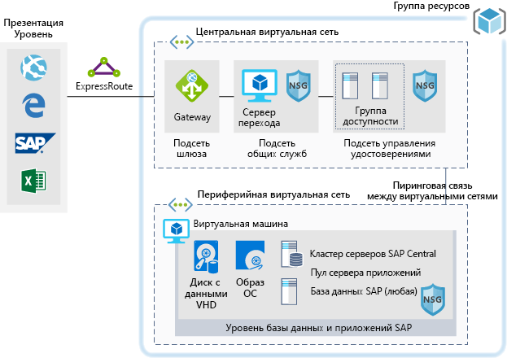

# Среды разработки и тестирования для рабочих нагрузок SAP в AzureDev/test environments for SAP workloads on Azure

В этом примере показано, как установить среду разработки и тестирования для SAP NetWeaver в окружении Windows или Linux в Azure.This example shows how to establish a dev/test environment for SAP NetWeaver in a Windows or Linux environment on Azure. База данных сторонних поставщиков, или так называемая база данных AnyDB, — это термин SAP, который применяется к любой поддерживаемой СУБД, кроме SAP HANA.The database used is AnyDB, the SAP term for any supported DBMS (that isn't SAP HANA). Так как эта архитектура предназначена для нерабочих сред, она развертывается только с одной виртуальной машиной, и ее размер может быть изменен для удовлетворения потребностей вашей организации.Because this architecture is designed for non-production environments, it's deployed with just a single virtual machine (VM) and it's size can be changed to accommodate your organization's needs.

Для примеров использования в рабочей среде рассмотрите эталонные архитектуры SAP, доступные ниже:For production use cases review the SAP reference architectures available below:

- [Развертывание SAP NetWeaver (Windows) для баз сторонних поставщиков на виртуальных машинах Azure][sap-netweaver][SAP NetWeaver for AnyDB][sap-netweaver]
- [SAP S/4HANA для виртуальных машин Linux в Azure][sap-hana][SAP S/4HANA][sap-hana]
- [SAP HANA на крупных экземплярах Azure][sap-large][SAP on Azure large instances][sap-large]

## Варианты соответствующего использованияRelevant use cases

Другие варианты использования:Other relevant use cases include:

- Некритические нерабочие нагрузки SAP (песочница, разработка, тестирование, контроль качества).Non-critical SAP non-productive workloads (sandbox, development, test, quality assurance)
- Некритические рабочие нагрузки бизнес-процессов SAP.Non-critical SAP business workloads

## АрхитектураArchitecture

В этом сценарии показана подготовка отдельной базы данных системы SAP и сервера приложений SAP в одной виртуальной машине.This scenario demonstrates provisioning a single SAP system database and SAP application server on a single virtual machine. Данные передаются в сценарии следующим образом:The data flows through the scenario as follows:

1. Для доступа к системе SAP на платформе Azure клиенты используют пользовательский интерфейс SAP или другие клиентские средства (Excel, веб-браузер или другие веб-приложения).Customers use the SAP user interface or other client tools (Excel, a web browser, or other web application) to access the Azure-based SAP system.
2. Связь обеспечивается с помощью установленного подключения ExpressRoute.Connectivity is provided through the use of an established ExpressRoute. Подключение ExpressRoute прерывается в Azure в шлюзе ExpressRoute.The ExpressRoute connection is terminated in Azure at the ExpressRoute gateway. Сетевой трафик проходит через шлюз Express Route к подсети шлюза, от подсети шлюза к подсети уровня приложения (см. шаблон [звездообразной топологии][hub-spoke]), а затем через сетевой шлюз безопасности к виртуальной машине приложения SAP.Network traffic routes through the ExpressRoute gateway to the gateway subnet, and from the gateway subnet to the application-tier spoke subnet (see the [hub-spoke network topology][hub-spoke]) and via a Network Security Gateway to the SAP application virtual machine.
3. Серверы управления идентификацией предоставляют услуги проверки подлинности.The identity management servers provide authentication services.
4. Переходная среда предоставляет возможности локального управления.The jump box provides local management capabilities.

### КомпонентыComponents

- [Виртуальные сети](/azure/virtual-network/virtual-networks-overview) служат основой для сетевого взаимодействия в Azure.[Virtual Networks](/azure/virtual-network/virtual-networks-overview) are the basis of network communication within Azure.
- [Виртуальная машина](/azure/virtual-machines/windows/overview). Виртуальные машины Azure предоставляют доступную по требованию, масштабируемую, безопасную виртуализированную инфраструктуру с помощью Windows Server или Linux Server.[Virtual Machine](/azure/virtual-machines/windows/overview) Azure Virtual Machines provides on-demand, high-scale, secure, virtualized infrastructure using Windows or Linux Server.
- [ExpressRoute](/azure/expressroute/expressroute-introduction) позволяет переносить локальные сети в Microsoft Cloud по частному подключению, которое обеспечивается поставщиком услуг подключения.[ExpressRoute](/azure/expressroute/expressroute-introduction) lets you extend your on-premises networks into the Microsoft cloud over a private connection facilitated by a connectivity provider.
- [Группы безопасности сети](/azure/virtual-network/security-overview) позволяют ограничить трафик к ресурсам в виртуальной сети.[Network Security Group](/azure/virtual-network/security-overview) lets you limit network traffic to resources in a virtual network. Группа безопасности сети содержит список правил безопасности, которые разрешают или запрещают входящий и исходящий трафик в зависимости от IP-адреса источника или назначения, порта и протокола.A network security group contains a list of security rules that allow or deny inbound or outbound network traffic based on source or destination IP address, port, and protocol.
- [Группы ресурсов](/azure/azure-resource-manager/resource-group-overview#resource-groups) действуют как логические контейнеры для ресурсов Azure.[Resource Groups](/azure/azure-resource-manager/resource-group-overview#resource-groups) act as logical containers for Azure resources.

## РекомендацииConsiderations

### ДоступностьAvailability

Корпорация Майкрософт предлагает Соглашение об уровне обслуживания (SLA) для отдельных экземпляров виртуальной машины.Microsoft offers a service level agreement (SLA) for single VM instances. Дополнительные сведения о Соглашении об уровне обслуживания Microsoft Azure для виртуальных машин см. в [этой статье](https://azure.microsoft.com/support/legal/sla/virtual-machines)For more information on Microsoft Azure Service Level Agreement for Virtual Machines [SLA For Virtual Machines](https://azure.microsoft.com/support/legal/sla/virtual-machines)

### МасштабируемостьScalability

Общие рекомендации по разработке масштабируемых решений см. в разделе [Контрольный список для обеспечения масштабируемости][scalability] в центре архитектуры Azure.For general guidance on designing scalable solutions, see the [scalability checklist][scalability] in the Azure Architecture Center.

### БезопасностьSecurity

Общие рекомендации по разработке безопасных решений см. в разделе [Azure Security Documentation][security].For general guidance on designing secure solutions, see the [Azure Security Documentation][security].

### УстойчивостьResiliency

Общее руководство по проектированию устойчивых решений см. в разделе [Проектирование устойчивых приложений для Azure][resiliency].For general guidance on designing resilient solutions, see [Designing resilient applications for Azure][resiliency].

## ЦеныPricing

Чтобы помочь вам изучить стоимость запуска этого сценария, все службы были предварительно сконфигурированы в приведенных ниже примерах калькулятора стоимости.To help you explore the cost of running this scenario, all of the services are pre-configured in the cost calculator examples below. Чтобы узнать, как изменится цена для вашего конкретного варианта использования, измените соответствующие переменные в соответствии с ожидаемым трафиком.To see how the pricing would change for your particular use case, change the appropriate variables to match your expected traffic.

Здесь предоставлено четыре примера профиля затрат в зависимости от объема трафика, который планируется принимать.We have provided four sample cost profiles based on amount of traffic you expect to receive:

|РазмерSize|Протоколы SAPSAPs|Тип виртуальной машиныVM Type|ХранилищеStorage|Калькулятор стоимости AzureAzure Pricing Calculator|
|----|----|-------|-------|---------------|
|МалыйSmall|80008000|D8s_v3D8s_v3|2xP20, 1xP102xP20, 1xP10|[МалыйSmall](https://azure.com/e/9d26b9612da9466bb7a800eab56e71d1)|
|СреднийMedium|1600016000|D16s_v3D16s_v3|3xP20, 1xP103xP20, 1xP10|[СреднийMedium](https://azure.com/e/465bd07047d148baab032b2f461550cd)|
большойLarge|3200032000|E32s_v3E32s_v3|3xP20, 1xP103xP20, 1xP10|[КрупныйLarge](https://azure.com/e/ada2e849d68b41c3839cc976000c6931)|
Очень крупныйExtra Large|6400064000|M64sM64s|4xP20, 1xP104xP20, 1xP10|[Очень крупныйExtra Large](https://azure.com/e/975fb58a965c4fbbb54c5c9179c61cef)|

> [!NOTE]
> Эти цены приведены в качестве руководства. В них указаны только затраты на виртуальные машины и хранилище.This pricing is a guide that only indicates the VMs and storage costs. Они не включают плату за сеть, хранилище резервных копий и передачу исходящих и входящих данных.It excludes networking, backup storage, and data ingress/egress charges.

- [Малый](https://azure.com/e/9d26b9612da9466bb7a800eab56e71d1). Небольшая система с виртуальной машиной типа D8s_v3 с восемью виртуальными ЦП, 32 ГБ оперативной памяти и 200 ГБ временного хранилища, а также дополнительными дисками хранения — двумя на 512 ГБ и одним на 128 ГБ класса "Премиум".[Small](https://azure.com/e/9d26b9612da9466bb7a800eab56e71d1): A small system consists of VM type D8s_v3 with 8x vCPUs, 32 GB RAM and 200 GB temp storage, additionally two 512 GB and one 128 GB premium storage disks.
- [Средний](https://azure.com/e/465bd07047d148baab032b2f461550cd). Средняя по производительности система с виртуальной машиной типа D16s_v3 с 16 виртуальными ЦП, 64 ГБ оперативной памяти и 400 ГБ временного хранилища, а также дополнительными дисками хранения — тремя на 512 ГБ и одним на 128 ГБ класса "Премиум".[Medium](https://azure.com/e/465bd07047d148baab032b2f461550cd): A medium system consists of VM type D16s_v3 with 16x vCPUs, 64 GB RAM and 400 GB temp storage, additionally three 512 GB and one 128 GB premium storage disks.
- [Большой](https://azure.com/e/ada2e849d68b41c3839cc976000c6931). Высокопроизводительная система с виртуальной машиной типа E32s_v3 с 32 виртуальными ЦП, 256 ГБ оперативной памяти и 512 ГБ временного хранилища, а также дополнительными дисками хранения — тремя на 512 ГБ и одним на 128 ГБ класса "Премиум".[Large](https://azure.com/e/ada2e849d68b41c3839cc976000c6931): A large system consists of VM type E32s_v3 with 32x vCPUs, 256 GB RAM and 512 GB temp storage, additionally three 512GB and one 128GB premium storage disks.
- [Сверхбольшой](https://azure.com/e/975fb58a965c4fbbb54c5c9179c61cef). Исключительно высокопроизводительная система с виртуальной машиной типа M64s с 64 виртуальными ЦП, 1024 ГБ оперативной памяти и 2000 ГБ временного хранилища, а также дополнительными дисками хранения — четырьмя на 512 ГБ и одним на 128 ГБ класса "Премиум".[Extra Large](https://azure.com/e/975fb58a965c4fbbb54c5c9179c61cef): An extra large system consists of a VM type M64s with 64x vCPUs, 1024 GB RAM and 2000 GB temp storage, additionally four 512 GB and one 128 GB premium storage disks.

## РазвертываниеDeployment

Щелкните здесь, чтобы развернуть базовую инфраструктуру для этого сценария.Click here to deploy the underlying infrastructure for this scenario.

<!-- markdownlint-disable MD033 -->

<!-- markdownlint-enable MD033 -->

> [!NOTE]
> В процессе этого развертывания SAP и Oracle не устанавливаются.SAP and Oracle are not installed during this deployment. Эти компоненты нужно будет развертывать отдельно.You will need to deploy these components separately.

<!-- links -->
[resiliency]: /azure/architecture/resiliency/
[security]: /azure/security/
[scalability]: /azure/architecture/checklist/scalability
[sap-netweaver]: /azure/architecture/reference-architectures/sap/sap-netweaver
[sap-hana]: /azure/architecture/reference-architectures/sap/sap-s4hana
[sap-large]: /azure/architecture/reference-architectures/sap/hana-large-instances
[hub-spoke]: /azure/architecture/reference-architectures/hybrid-networking/hub-spoke
