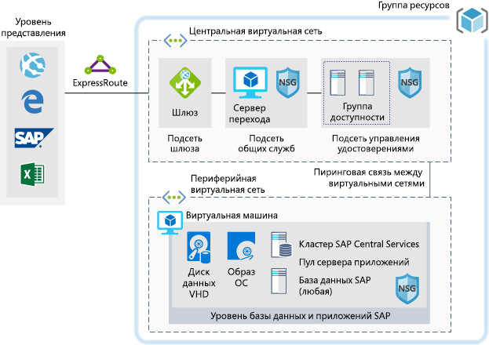

# SAP для рабочих нагрузок разработки и тестирования

В этом примере приведены рекомендации по выполнению реализации SAP NetWeaver для разработки и тестирования в среде Windows или Linux в Azure. База данных сторонних поставщиков, или так называемая база данных AnyDB, — это термин SAP, который применяется к любой поддерживаемой СУБД, кроме SAP HANA. Так как эта архитектура предназначена для нерабочих сред, она развертывается только с одной виртуальной машиной, и ее размер может быть изменен для удовлетворения потребностей вашей организации.

Для примеров использования в рабочей среде рассмотрите эталонные архитектуры SAP, доступные ниже:

* [SAP NetWeaver для баз данных сторонних поставщиков (AnyDB)][sap-netweaver]
* [SAP S/4 HANA][sap-hana]
* [SAP HANA на крупных экземплярах Azure][sap-large]

## Связанные варианты использования

Рассмотрите этот сценарий для следующих вариантов использования:

* Некритические нерабочие нагрузки SAP (песочница, разработка, тестирование, контроль качества).
* Некритические рабочие нагрузки бизнес-процессов SAP.

## Архитектура

Этот сценарий охватывает предоставление единой системной базы и сервера приложений SAP на одной виртуальной машине, где данные передаются следующим образом:

1. На уровне представления клиенты используют свой графический пользовательский интерфейс SAP или другие интерфейсы (Internet Explorer, Excel или другие веб-приложения) в локальной среде для доступа к системе SAP на основе Azure.
2. Связь обеспечивается с помощью установленного подключения Express Route. Подключение Express Route терминируется в Azure в шлюзе Express Route. Сетевой трафик проходит через шлюз Express Route к подсети шлюза и от подсети шлюза к подсети уровня приложения (см. шаблон [звездообразной топологии][hub-spoke]) и через сетевой шлюз безопасности виртуальной машины приложения SAP.
3. Серверы управления идентификацией предоставляют услуги проверки подлинности.
4. Переходная среда предоставляет возможности локального управления.

### Компоненты

* [Группа ресурсов](/azure/azure-resource-manager/resource-group-overview#resource-groups) — это логический контейнер для ресурсов Azure.
* [Виртуальные сети](/azure/virtual-network/virtual-networks-overview) — это основа сетевых коммуникаций в Azure.
* [Виртуальные машины](/azure/virtual-machines/windows/overview) Azure предоставляют по запросу безопасную высокомасштабируемую виртуализированную инфраструктуру с использованием сервера Windows или Linux.
* [ExpressRoute](/azure/expressroute/expressroute-introduction) позволяет переносить локальные сети в Microsoft Cloud по частному подключению, которое обеспечивается поставщиком услуг подключения.
* [Группы безопасности сети](/azure/virtual-network/security-overview) позволяют ограничить трафик к ресурсам в виртуальной сети. Группа безопасности сети содержит список правил безопасности, которые разрешают или запрещают входящий и исходящий трафик в зависимости от IP-адреса источника или назначения, порта и протокола. 

## Рекомендации

### Доступность

 Корпорация Майкрософт предлагает Соглашение об уровне обслуживания (SLA) для отдельных экземпляров виртуальной машины. Дополнительные сведения о Соглашении об уровне обслуживания Microsoft Azure для виртуальных машин см. в [этой статье](https://azure.microsoft.com/support/legal/sla/virtual-machines)

### Масштабируемость

Общие рекомендации по разработке масштабируемых решений см. в разделе [Контрольный список для обеспечения масштабируемости][scalability] в центре архитектуры Azure.

### Безопасность

Общие рекомендации по разработке безопасных решений см. в разделе [Azure Security Documentation][security].

### Устойчивость

Общее руководство по проектированию устойчивых решений см. в разделе [Проектирование устойчивых приложений для Azure][resiliency].

## Цены

Чтобы изучить стоимость выполнения этого сценария, все услуги были предварительно сконфигурированы в калькуляторе стоимости.  Чтобы узнать, как изменится цена для вашего конкретного варианта использования, измените соответствующие переменные в соответствии с ожидаемым трафиком.

Здесь предоставлено четыре примера профиля затрат в зависимости от объема трафика, который планируется принимать.

|Размер|Протоколы SAP|Тип виртуальной машины|служба хранилища.|Калькулятор стоимости Azure|
|----|----|-------|-------|---------------|
|Малый|8000|D8s_v3|2xP20, 1xP10|[Малый](https://azure.com/e/9d26b9612da9466bb7a800eab56e71d1)|
|Средний|16000|D16s_v3|3xP20, 1xP10|[Средний](https://azure.com/e/465bd07047d148baab032b2f461550cd)|
большой|32000|E32s_v3|3xP20, 1xP10|[Крупный](https://azure.com/e/ada2e849d68b41c3839cc976000c6931)|
Очень крупный|64000|M64s|4xP20, 1xP10|[Очень крупный](https://azure.com/e/975fb58a965c4fbbb54c5c9179c61cef)|

Примечание. Указана ориентировочная стоимость, учитывающая только расходы на виртуальную машину и хранение данных (не включая плату за сетевые ресурсы, резервное хранилище, а также входящий и исходящий трафик).

* [Малый](https://azure.com/e/9d26b9612da9466bb7a800eab56e71d1). Небольшая система с виртуальной машиной типа D8s_v3 с восемью виртуальными ЦП, 32 ГБ оперативной памяти и 200 ГБ временного хранилища, а также дополнительными дисками хранения — двумя на 512 ГБ и одним на 128 ГБ класса "Премиум".
* [Средний](https://azure.com/e/465bd07047d148baab032b2f461550cd). Средняя по производительности система с виртуальной машиной типа D16s_v3 с 16 виртуальными ЦП, 64 ГБ оперативной памяти и 400 ГБ временного хранилища, а также дополнительными дисками хранения — тремя на 512 ГБ и одним на 128 ГБ класса "Премиум".
* [Большой](https://azure.com/e/ada2e849d68b41c3839cc976000c6931). Высокопроизводительная система с виртуальной машиной типа E32s_v3 с 32 виртуальными ЦП, 256 ГБ оперативной памяти и 512 ГБ временного хранилища, а также дополнительными дисками хранения — тремя на 512 ГБ и одним на 128 ГБ класса "Премиум".
* [Сверхбольшой](https://azure.com/e/975fb58a965c4fbbb54c5c9179c61cef). Исключительно высокопроизводительная система с виртуальной машиной типа M64s с 64 виртуальными ЦП, 1024 ГБ оперативной памяти и 2000 ГБ временного хранилища, а также дополнительными дисками хранения — четырьмя на 512 ГБ и одним на 128 ГБ класса "Премиум".

## Развертывание

Чтобы развернуть базовую инфраструктуру, соответствующую описанному выше сценарию, используйте кнопку развертывания

\* SAP-ресурсы не будут автоматически установлены. Выполните установку самостоятельно после создания инфраструктуры.

<!-- links -->
[reference architecture]:  /azure/architecture/reference-architectures/sap
[resiliency]: /azure/architecture/resiliency/
[security]: /azure/security/
[scalability]: /azure/architecture/checklist/scalability
[sap-netweaver]: /azure/architecture/reference-architectures/sap/sap-netweaver
[sap-hana]: /azure/architecture/reference-architectures/sap/sap-s4hana
[sap-large]: /azure/architecture/reference-architectures/sap/hana-large-instances
[hub-spoke]: /azure/architecture/reference-architectures/hybrid-networking/hub-spoke