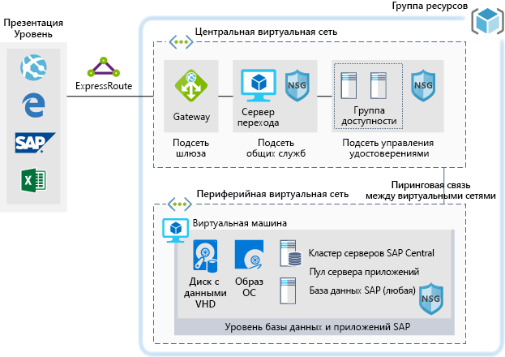

## Сценарии использования ИИAI Scenarios

<ul  class="panelContent cardsC">
<li style="display: flex; flex-direction: column;">
    <a href="./ai/commerce-chatbot.md" style="display: flex; flex-direction: column; flex: 1 0 auto;">
        

            

                

                    

                        

                            
                        

                    

                    

                        <h3>Виртуальный собеседник Azure для резервирования отелейConversational chatbot for hotel reservations on Azure</h3>
                        
Создание чат-ботов для коммерческих приложений с помощью службы Azure Bot.Build a conversational chatbot for commerce applications with Azure Bot Service.

                    

                

            

        

    </a>
</li>
<li style="display: flex; flex-direction: column;">
    <a href="./ai/intelligent-apps-image-processing.md" style="display: flex; flex-direction: column; flex: 1 0 auto;">
        

            

                

                    

                        

                            
                        

                    

                    

                        <h3>Классификация изображений в Azure для страховых требованийImage classification for insurance claims on Azure</h3>
                        
Создание сценария обработки изображений в приложениях Azure.Build image processing into your Azure applications.

                    

                

            

        

    </a>
</li>
</ul>

## Сценарии работы с приложениямиApplication Scenarios

<ul  class="panelContent cardsC">
<li style="display: flex; flex-direction: column;">
    <a href="./apps/apim-api-scenario.md" style="display: flex; flex-direction: column; flex: 1 0 auto;">
        

            

                

                    

                        

                            
                        

                    

                    

                        <h3>Перенос устаревших веб-приложений в архитектуру на основе API в AzureMigrating a legacy web application to an API-based architecture on Azure</h3>
                        
Использование службы "Управление API Azure" для модернизации устаревшего веб-приложения.Use Azure API Management to modernize a legacy web application.

                    

                

            

        

    </a>
</li>
<li style="display: flex; flex-direction: column;">
    <a href="./apps/app-monitoring.md" style="display: flex; flex-direction: column; flex: 1 0 auto;">
        

            

                

                    

                        

                            
                        

                    

                    

                        <h3>Мониторинг веб-приложений в AzureWeb application monitoring on Azure</h3>
                        
Мониторинг веб-приложения, размещенного в Службе приложений Azure.Monitor a web application hosted in Azure App Service.

                    

                

            

        

    </a>
</li>
<li style="display: flex; flex-direction: column;">
    <a href="./apps/decentralized-trust.md" style="display: flex; flex-direction: column; flex: 1 0 auto;">
        

            

                

                    

                        

                            
                        

                    

                    

                        <h3>Децентрализованное доверие между банками в AzureDecentralized trust between banks on Azure</h3>
                        
Реализация доверенной среды для взаимодействия и обмена данными без обращения к централизованной базе данных.Establish a trusted environment for communication and information sharing without resorting to a centralized database.

                    

                

            

        

    </a>
</li>
<li style="display: flex; flex-direction: column;">
    <a href="./apps/devops-dotnet-webapp.md" style="display: flex; flex-direction: column; flex: 1 0 auto;">
        

            

                

                    

                        

                            
                        

                    

                    

                        <h3>Использование конвейера CI/CD с помощью Azure DevOpsCI/CD pipeline with Azure DevOps</h3>
                        
Создание и выпуск приложения .NET в службе "Веб-приложения Azure" с помощью Azure DevOps.Build and release a .NET app to Azure Web Apps using Azure DevOps.

                    

                

            

        

    </a>
</li>
<li style="display: flex; flex-direction: column;">
    <a href="./apps/devops-with-aks.md" style="display: flex; flex-direction: column; flex: 1 0 auto;">
        

            

                

                    

                        

                            
                        

                    

                    

                        <h3>Конвейер CI/CD для рабочих нагрузок на основе контейнераCI/CD pipeline for container-based workloads</h3>
                        
Создание конвейера DevOps для веб-приложения Node.js, который использует Jenkins, Реестр контейнеров Azure, Службу Azure Kubernetes, Cosmos DB и Grafana.Build a DevOps pipeline for a Node.js web app with Jenkins, Azure Container Registry, Azure Kubernetes Service, Cosmos DB, and Grafana.

                    

                

            

        

    </a>
</li>
<li style="display: flex; flex-direction: column;">
    <a href="./apps/ecommerce-scenario.md" style="display: flex; flex-direction: column; flex: 1 0 auto;">
        

            

                

                    

                        

                            
                        

                    

                    

                        <h3>Внешний интерфейс для электронной коммерции в AzureE-commerce front end on Azure</h3>
                        
Размещения сайта электронной коммерции в Azure.Host an e-commerce site on Azure.

                    

                

            

        

    </a>
</li>
<li style="display: flex; flex-direction: column;">
    <a href="./apps/ecommerce-search.md" style="display: flex; flex-direction: column; flex: 1 0 auto;">
        

            

                

                    

                        

                            
                        

                    

                    

                        <h3>Интеллектуальная поисковая система для товаров, предназначенная для решений электронной коммерцииIntelligent product search engine for e-commerce</h3>
                        
Предоставление первоклассных возможностей поиска в приложении электронной коммерции.Provide a world-class search experience in an e-commerce application.

                    

                

            

        

    </a>
</li>
<li style="display: flex; flex-direction: column;">
    <a href="./apps/hpc-saas.md" style="display: flex; flex-direction: column; flex: 1 0 auto;">
        

            

                

                    

                        

                            
                        

                    

                    

                        <h3>Служба автоматизированного проектирования в AzureA computer-aided engineering service on Azure</h3>
                        
Предоставление платформы SaaS (программное обеспечение как услуга) для автоматизированного проектирования (CAE) в Azure.Provide a software-as-a-service (SaaS) platform for computer-aided engineering (CAE) on Azure.

                    

                

            

        

    </a>
</li>
<li style="display: flex; flex-direction: column;">
    <a href="./apps/sap-dev-test.md" style="display: flex; flex-direction: column; flex: 1 0 auto;">
        

            

                

                    

                        

                            
                        

                    

                    

                        <h3>Среды разработки и тестирования для рабочих нагрузок SAP в AzureDev/test enviroments for SAP workloads on Azure</h3>
                        
Создание сред разработки и тестирования для рабочих нагрузок SAP.Build a dev/test environment for SAP workloads.

                    

                

            

        

    </a>
</li>
<li style="display: flex; flex-direction: column;">
    <a href="./apps/sap-production.md" style="display: flex; flex-direction: column; flex: 1 0 auto;">
        

            

                

                    

                        

                            
                        

                    

                    

                        <h3>Выполнение рабочих нагрузок SAP в рабочей среде с помощью базы данных Oracle в AzureRunning SAP production workloads using an Oracle database on Azure</h3>
                        
Развертывание SAP в рабочей среде в Azure с использованием базы данных Oracle.Run an SAP production deployment in Azure using an Oracle database.

                    

                

            

        

    </a>
</li>
</ul>

## Сценарии работы с даннымиData Scenarios

<ul  class="panelContent cardsC">
<li style="display: flex; flex-direction: column;">
    <a href="./data/big-data-with-iot.md" style="display: flex; flex-direction: column; flex: 1 0 auto;">
        

            

                

                    

                        

                            
                        

                    

                    

                        <h3>Решения Интернета вещей и аналитики данных для строительной отраслиIoT and data analytics in the construction industry</h3>
                        
Использование решений Интернета вещей и анализа данных для комплексного администрирования и реализации строительных проектов.Use IoT devices and data analytics to provide comprehensive management and operation of construction projects.

                    

                

            

        

    </a>
</li>
<li style="display: flex; flex-direction: column;">
    <a href="./data/data-warehouse.md" style="display: flex; flex-direction: column; flex: 1 0 auto;">
        

            

                

                    

                        

                            
                        

                    

                    

                        <h3>Решения по хранению и анализу данных для продаж и маркетингаData warehousing and analytics for sales and marketing</h3>
                        
Объединение данных из нескольких источников и оптимизация аналитики данных.Consolidate data from multiple sources and optimize data analytics.

                    

                

            

        

    </a>
</li>
<li style="display: flex; flex-direction: column;">
    <a href="./data/ecommerce-order-processing.md" style="display: flex; flex-direction: column; flex: 1 0 auto;">
        

            

                

                    

                        

                            
                        

                    

                    

                        <h3>Масштабируемая обработка заказов в AzureScalable order processing on Azure</h3>
                        
Создание конвейера обработки заказа с высокой степенью масштабируемости с помощью Azure Cosmos DB.Build a highly scalable order processing pipeline using Azure Cosmos DB.

                    

                

            

        

    </a>
</li>
<li style="display: flex; flex-direction: column;">
    <a href="./data/fraud-detection.md" style="display: flex; flex-direction: column; flex: 1 0 auto;">
        

            

                

                    

                        

                            
                        

                    

                    

                        <h3>Выявление мошенничества в режиме реального времени в AzureReal-time fraud detection on Azure</h3>
                        
Обнаружения мошеннических действий в реальном времени с использованием Центров событий Azure и Stream Analytics.Detect fraudulent activity in real-time using Azure Event Hubs and Stream Analytics.

                    

                

            

        

    </a>
</li>
<li style="display: flex; flex-direction: column;">
    <a href="./data/realtime-analytics-vehicle-iot.md" style="display: flex; flex-direction: column; flex: 1 0 auto;">
        

            

                

                    

                        

                            
                        

                    

                    

                        <h3>Прием и обработка данных Интернета вещей в реальном времени в автомобильной промышленностиIngestion and processing of real-time automotive IoT data</h3>
                        
Использование Интернета вещей для получения и обработки данных об автомобилях в реальном времени.Ingest and process real-time vehicle data using IoT.

                    

                

            

        

    </a>
</li>
</ul>

## Сценарии для инфраструктурыInfrastructure Scenarios

<ul  class="panelContent cardsC">
<li style="display: flex; flex-direction: column;">
    <a href="./infrastructure/hpc-cfd.md" style="display: flex; flex-direction: column; flex: 1 0 auto;">
        

            

                

                    

                        

                            
                        

                    

                    

                        <h3>Моделирование сценариев вычислительной гидродинамики (CFD) в AzureRunning computational fluid dynamics (CFD) simulations on Azure</h3>
                        
Моделирование сценариев CFD в Azure.Execute computational fluid dynamics (CFD) simulations on Azure.

                    

                

            

        

    </a>
</li>
<li style="display: flex; flex-direction: column;">
    <a href="./infrastructure/linux-vdi-citrix.md" style="display: flex; flex-direction: column; flex: 1 0 auto;">
        

            

                

                    

                        

                            
                        

                    

                    

                        <h3>Виртуальный рабочий стол Linux с использованием CitrixLinux virtual desktops with Citrix</h3>
                        
Создание среды VDI для настольных компьютеров Linux с помощью Citrix в Azure.Build a VDI environment for Linux Desktops using Citrix on Azure.

                    

                

            

        

    </a>
</li>
<li style="display: flex; flex-direction: column;">
    <a href="./infrastructure/regulated-multitier-app.md" style="display: flex; flex-direction: column; flex: 1 0 auto;">
        

            

                

                    

                        

                            
                        

                    

                    

                        <h3>Безопасное веб-приложение Windows для отраслей с высокой степенью регулируемостиSecure Windows web application for regulated industries</h3>
                        
Создание безопасного многоуровневого веб-приложения с помощью Windows Server в Azure, которое использует масштабируемые наборы, Шлюз приложений и подсистемы балансировки нагрузки.Build a secure, multi-tier web application with Windows Server on Azure using scale sets, Application Gateway, and load balancers.

                    

                

            

        

    </a>
</li>
<li style="display: flex; flex-direction: column;">
    <a href="./infrastructure/service-fabric-microservices.md" style="display: flex; flex-direction: column; flex: 1 0 auto;">
        

            

                

                    

                        

                            
                        

                    

                    

                        <h3>Использование Service Fabric для декомпозиции монолитных приложенийUsing Service Fabric to decompose monolithic applications</h3>
                        
Декомпозиция больших монолитных приложений на микрослужбы.Decompose a large monolithic application into microservices.

                    

                

            

        

    </a>
</li>
<li style="display: flex; flex-direction: column;">
    <a href="./infrastructure/video-rendering.md" style="display: flex; flex-direction: column; flex: 1 0 auto;">
        

            

                

                    

                        

                            
                        

                    

                    

                        <h3>Отрисовка трехмерного видео на портале Azure3D video rendering on Azure</h3>
                        
Выполнение собственных рабочих нагрузок HPC в Azure с использованием пакетной службы Azure.Run native HPC workloads in Azure using the Azure Batch service.

                    

                

            

        

    </a>
</li>
<li style="display: flex; flex-direction: column;">
    <a href="./infrastructure/wordpress.md" style="display: flex; flex-direction: column; flex: 1 0 auto;">
        

            

                

                    

                        

                            
                        

                    

                    

                        <h3>Веб-сайты WordPress с высоким уровнем масштабируемости и защиты в AzureHighly scalable and secure WordPress websites on Azure</h3>
                        
Создание веб-сайта WordPress с высоким уровнем масштабируемости и защиты для событий мультимедиа.Build a highly scalable and secure WordPress website for media events.

                    

                

            

        

    </a>
</li>
</ul>

