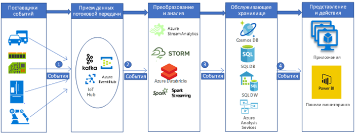

# Прием и обработка данных Интернета вещей в реальном времени в автомобильной промышленности

В этом примере сценария создается конвейер приема и обработки данных в реальном времени, используемый для приема и обработки сообщений от устройств Интернета вещей (в основном от датчиков) и их обработки на платформе аналитики больших данных в Azure. Платформы приема и обработки в телематике автомобиля являются ключом для создания в нем связанных решений. Данный сценарий был создан с помощью систем приема и обработки данных телематики автомобиля. Тем не менее созданные шаблоны подходят для многих отраслей, в которых датчики используются для управления и мониторинга таких сложных систем, как умные дома, коммуникации, производство, розничная торговля и здравоохранение.

В данном примере демонстрируется конвейер приема и обработки данных в реальном времени для сообщений, полученных от устройств Интернета вещей, установленных в транспортных средствах. Датчики и устройства Интернета вещей создают тысячи и миллионы сообщений (или событий). Сбор и анализ этих сообщений позволит расшифровать полезные сведения и предпринять соответствующие действия. Например, с помощью устройств телематики в автомобиле, если удастся собрать сообщения с устройств Интернета вещей в режиме реального времени, можно просматривать расположение автомобиля, планировать оптимальные маршруты, предоставлять помощь водителю, а также поддерживать телематику связанных отраслей, например автострахования.

В данном примере будет демонстрироваться выдуманная компания по производству автомобилей, которой требуется создать систему для сбора и обработки сообщений в реальном времени с устройств телематики. Компания поставила перед собой следующие цели.

- Получение и хранение данных в режиме реального времени с датчиков и устройств автомобиля.
- Анализ сообщений, что поможет получить общие сведения о местоположении автомобиля и другую информацию, отправляемую датчиками разных типов (например, теми, которые связаны с двигателем или которые связаны с окружающей средой).
- Хранение данных после проведения анализа для процесса последующей обработки, что позволит получать ценную информацию (например, в случае аварии страховые агенты смогут узнать, какие действия были предприняты водителем и т. д.).

## Варианты соответствующего использования

Другие варианты использования:

- Напоминания и предупреждение об обслуживании автомобиля.
- Службы для пассажиров автомобиля, основанные на его расположении (например, SOS).
- Автономность автомобиля (автопилот).

## Архитектура

В типичной реализации конвейера обработки больших данных они поступают слева направо. В этом конвейере обработки больших данных реального времени процесс передачи данных с помощью решения выглядит следующим образом:

1. События, создаваемые из источников данных Интернета вещей, с помощью Azure HDInsight Kafka передаются на уровень приема потока в качестве потока сообщений. HDInsight Kafka используется для хранения потока данных в разделах, настраиваемых со временем.
2. Пользователи Kafka, Azure Databricks получают сообщение в режиме реального времени из раздела Kafka, затем обрабатывают данные на основе бизнес-логики, а затем могут отправлять их на уровень обслуживания для хранения.
3. Затем нисходящие службы хранения, например Azure Cosmos DB, хранилище данных SQL Azure, База данных SQL Azure, становятся источником данных для уровня представления и действия.
4. Специалисты по бизнес-аналитике могут использовать Microsoft Power BI для анализа дынных, которые находятся в хранилище. Другие приложения также могут быть созданы на уровне обслуживания. Например, можно предоставить API-интерфейсы, основанные на данных уровня службы, для использования сторонними производителями.

### Компоненты

События, созданные с помощью устройств Интернета вещей (данных или сообщений), принимаются, обрабатываются и затем сохраняются для дальнейшего анализа, представления и действия с помощью следующих компонентов Azure:

- [Apache Kafka в HDInsight](/azure/hdinsight/kafka/apache-kafka-introduction) находится на уровне приема. С помощью API производителя Kafka данные записываются в раздел Kafka.
- [Azure Databricks](/services/databricks) расположен на уровне преобразования и анализа. В записных книжках Databricks реализуется API-интерфейс потребителя Kafka, используемый для чтения данных из раздела Kafka.
- [Azure Cosmos DB](/services/cosmos-db), [База данных SQL Azure](/azure/sql-database/sql-database-technical-overview) и Хранилище данных SQL Azure находятся на уровне хранилища обслуживания, в то время как Azure Databricks может использоваться для записи данных с помощью соединителей данных.
- [Хранилище данных SQL Azure](/azure/sql-data-warehouse/sql-data-warehouse-overview-what-is) — это распределенная система для хранения и анализа больших наборов данных. Использование ею массовой параллельной обработки (MPP) делает ее пригодной для запуска высокопроизводительной аналитики.
- [Power BI](https://docs.microsoft.com/power-bi) — набор средств бизнес-аналитики для анализа данных и обмена информацией. Power BI может запрашивать семантическую модель, хранящуюся в Analysis Services, или напрямую запрашивать Хранилище данных SQL.
- [Azure Active Directory (Azure AD)](/azure/active-directory) используется для проверки подлинности пользователей, которые подключаются к [Azure Databricks](https://azure.microsoft.com/services/databricks). AAD можно использовать для подключения к серверу Analysis Services через Power BI при создании куба в [Analysis Services](/azure/analysis-services), который будет основан на модели данных Хранилища данных SQL Azure. В Фабрике данных также можно использовать Azure AD для аутентификации в Хранилище данных SQL с помощью субъекта-службы или Управляемого удостоверения службы (MSI).
- [Службы приложений Azure](/azure/app-service/app-service-web-overview), к которым можно отнести [приложение API](/services/app-service/api), могут использоваться для предоставления данных третьим лицам на основе данных, хранящихся на уровне обслуживания.

## Альтернативные варианты

С помощью других компонентов Azure может быть реализован более обобщенный конвейер больших данных.

- Для приема данных на уровне брокера приема потоков данных можно использовать [Центр Интернета вещей](https://azure.microsoft.com/services/iot-hub), [Концентратор событий](https://azure.microsoft.com/services/event-hubs) или [HDInsight Kafka](/azure/hdinsight/kafka/apache-kafka-introduction).
- На уровне анализа и преобразования можно использовать [HDInsight Storm](/azure/hdinsight/storm/apache-storm-overview), [HDInsight Spark](/azure/hdinsight/spark/apache-spark-overview) или [Azure Stream Analytics](https://azure.microsoft.com/services/stream-analytics).
- [Analysis Services](/azure/analysis-services) предоставляет семантическую модель данных. А также может увеличить производительность системы при анализе данных. На основе данных из хранилища данных Azure можно создать модель.

## Рекомендации

Технологии, используемые в данной архитектуре, были выбраны в зависимости от масштаба, необходимого для обработки событий, служб Соглашения об уровне обслуживания, управления затратами и простоты управления компонентами.

- Управляемый [HDInsight Kafka](/azure/hdinsight/kafka/apache-kafka-introduction) поставляется с 99,9 % Соглашения об уровне обслуживания, интегрированного в Управляемые диски Azure
- Оптимизация [Azure Databricks](/azure/azure-databricks/what-is-azure-databricks) была выполнена с нуля. Это позволяет повысить производительность и эффективность затрат в облаке. Среда выполнения Databricks добавляет несколько ключевых возможностей для рабочих нагрузок Apache Spark, которые могут повысить производительность и снизить затраты от 10 до 100 раз при работе на Azure, в том числе:
- Azure Databricks тесно интегрируется с такими базами данных и хранилищами Azure: [Хранилище данных SQL Azure](/azure/sql-data-warehouse), [Azure Cosmos DB](https://azure.microsoft.com/services/cosmos-db), [Azure Data Lake Storage](https://azure.microsoft.com/services/storage/data-lake-storage) и [хранилище BLOB-объектов Azure](https://azure.microsoft.com/services/storage/blobs).
  - Использование автомасштабирования и автоматического завершения для кластеров Spark позволяет сократить затраты.
  - Оптимизация производительности, включая кэширование, индексирование и расширенную оптимизацию запросов, которая может повысить производительность от 10 до 100 раз по сравнению с традиционными развертываниями Apache Spark в облачных или локальных средах.
  - Интеграция с Azure Active Directory позволяет выполнить комплексные решения на основе Azure с помощью Azure Databricks.
  - Доступ на основе роли в Azure Databricks включает точные пользовательские разрешения для записных книжек, кластеров, заданий и данных.
  - Он поставляется вместе с Соглашениями об уровне обслуживания корпоративного уровня.
- Azure Cosmos DB — это глобально распределенная многомодельная база данных Майкрософт. Решение Azure Cosmos DB с самого начала разрабатывалось для глобального распределения и горизонтального масштабирования. Эта база данных предлагает готовое глобальное распределение в любом количестве в регионах Azure путем прозрачного масштабирования и репликации данных, независимо от местонахождения пользователей. Вы можете использовать возможности гибкого масштабирования пропускной способности и хранения по всему миру, а также платить только за необходимую пропускную способность и ресурсы хранения.
- Архитектура вычислений с массовым параллелизмом Хранилища данных SQL предоставляет такие возможности, как масштабируемость и высокую производительность.
- Хранилище данных SQL Azure обладает Соглашениями об уровне обслуживания и практическими рекомендациями для получения высокой производительности.
- Если анализ активности находится на низком уровне, компания может потребовать выполнение масштабируемости Хранилища данных SQL Azure, уменьшения или даже приостановки вычислений, чтобы уменьшить затраты.
- Модель безопасности Хранилища данных SQL Azure обеспечивает безопасность подключения, проверки подлинности и авторизации с помощью Azure AD или проверки подлинности SQL Server и шифрования.

## Цены

Используйте калькулятор цен Azure и ознакомьтесь с [ценами на Azure Databricks](https://azure.microsoft.com/pricing/details/databricks), [ценами на Azure HDInsight](https://azure.microsoft.com/pricing/details/hdinsight), [образцом цен для сценария хранения данных](https://azure.com/e/b798fb70c53e4dd19fdeacea4db78276). Изменяйте значения до тех пор, пока не увидите, как ваши требования влияют на затраты.

- [Azure HDInsight](/azure/hdinsight) — это полностью управляемая облачная служба, которая позволяет быстро, просто и без лишних затрат обрабатывать большие объемы данных
- В [Azure Databricks](https://azure.microsoft.com/services/databricks) на нескольких [экземплярах виртуальных машин](https://azure.microsoft.com/pricing/details/databricks/#instances) предоставляются две отдельные рабочие нагрузки, специально предназначенные для рабочих процессов анализа данных. Рабочая нагрузка "Инжиниринг данных" позволяет инженерам данных создавать и выполнять задания, а рабочая нагрузка "Аналитика данных" помогает специалистам по обработке и анализу данных изучать, визуализировать, преобразовывать и совместно использовать данные с помощью интерактивных средств.
- [Azure Cosmos DB](https://azure.microsoft.com/services/cosmos-db) гарантирует показатели задержки с точностью до одной цифры в миллисекундах на 99-м процентиле в любой точке мира, а также предлагает [несколько четко определенных моделей согласованности](/azure/cosmos-db/consistency-levels) для тонкой настройки производительности и обеспечивает высокую доступность с возможностями множественной адресации. Все это прописано в ведущих в отрасли универсальных [Соглашениях об уровне обслуживания](https://azure.microsoft.com/support/legal/sla/cosmos-db).
- [Хранилище данных SQL Azure](https://azure.microsoft.com/pricing/details/sql-data-warehouse/gen2) позволяет независимо масштабировать уровни вычисления и хранилища. Стоимость за использование вычислительных ресурсов взимается каждый час. По требованию пользователя может быть выполнена приостановка использования данных ресурсов или их масштабируемость. В ресурсах хранилища стоимость взимается за используемые терабайты, что значит, что при получении большего количества данных стоимость увеличится.
- [Analysis Services](https://azure.microsoft.com/pricing/details/analysis-services) предоставляются на уровнях "Разработка", "Базовый" и "Стандартный". Оценивание экземпляров происходит на основе используемых единиц обработки запроса (QPU) и доступной памяти. Чтобы снизить затраты, свести к минимуму количество запущенных запросов, необходимо знать, сколько данных они обрабатывают и как часто они запускаются.
- Существуют различные варианты решения [Power BI](https://powerbi.microsoft.com/pricing). С их помощью оно может соответствовать различным требованиям. [Power BI Embedded](https://azure.microsoft.com/pricing/details/power-bi-embedded) предоставляет опцию на основе Azure для внедрения функций Power BI в ваши приложения. Экземпляр Power BI Embedded включен в образец цены выше.

## Дальнейшие действия

- Ознакомьтесь со статьей [Проведение анализа в режиме реального времени](https://azure.microsoft.com/solutions/architecture/real-time-analytics), из которой можно узнать об архитектуре, включающей в себя большой поток данных.
- Ознакомьтесь со статьей [Расширенная аналитика с использованием больших данных](https://azure.microsoft.com/solutions/architecture/advanced-analytics-on-big-data), из которой можно узнать об архитектуре и получить представление о том, как различные компоненты Azure могут использоваться для построения конвейера больших данных.
- Чтобы получить общие сведения о том, как различные компоненты Azure используются для обработки потока данных в реальном времени, ознакомьтесь з документацией Azure [Обработка в режиме реального времени](/azure/architecture/data-guide/big-data/real-time-processing).
- Из [руководства по архитектуре данных в Azure](/azure/architecture/data-guide) можно получить общие сведения о конвейерах данных, их хранении, оперативной аналитической обработке (OLAP) и больших данных.
