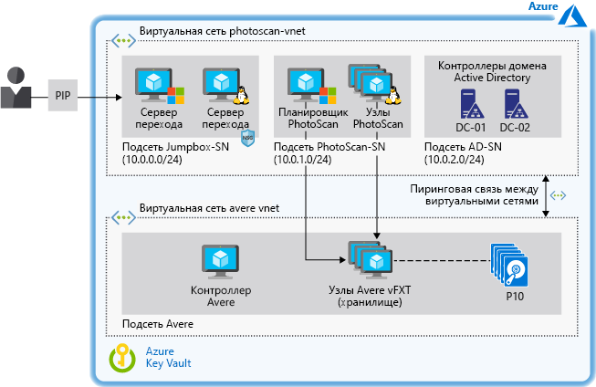

# Ускорение цифрового моделирования на основе изображений в Azure

В этом примере представлены рекомендации по выбору архитектуры и разработке для любой организации, которой потребуется выполнять моделирование на основе изображений в службе IaaS (инфраструктура как услуга) Azure. Этот сценарий реализует программу фотограмметрии на виртуальных машинах Azure, к которым для ускорения обработки подключено высокопроизводительное хранилище. Можно увеличивать и уменьшать масштаб среды выполнения по мере необходимости, и она поддерживает хранилища объемом в несколько терабайт без ущерба для производительности.

## Варианты соответствующего использования

Ниже перечислены возможные варианты использования.

- Моделирование и измерение зданий, инженерных структур, а также сцен преступлений и происшествий.
- Создание визуальных эффектов для компьютерных игр и фильмов.
- Использование цифровых изображений для косвенного измерения объектов разных масштабов для планирования городской застройки и других целей.

## Архитектура

В этом примере описывается использование программного обеспечения Agisoft PhotoScan для фотограмметрии с подключенным хранилищем Avere vFXT. Мы выбрали PhotoScan как очень популярную платформу для приложений геоинформационных систем (GIS), документации по региональному наследию, разработки игр и производства визуальных эффектов. Она поддерживает фотограмметрию как на близких расстояниях, так и с воздушной съемки.

Описанные в этой статье концепции относятся к любой рабочей нагрузке высокопроизводительных вычислений (HPC), которая использует планировщик и рабочие узлы, управляемые как инфраструктура.  Для этой рабочей нагрузки мы выбрали хранилище Avere vFXT, руководствуясь его высокой производительностью по результатам тестов.  Но в этом сценарии хранилище отделено от системы обработки, что позволяет применить любое другое решение хранения (см. [альтернативные варианты](#alternatives) далее в этой статье).

Эта архитектура также содержит контроллеры домена Active Directory, которые управляют доступом к ресурсам Azure и обеспечивают внутреннее разрешение имен через системы доменных имен (DNS). Серверы перехода предоставляют доступ с правами администратора к виртуальным машинам Windows и Linux, на которых выполняется это решение.

1. Пользователь передает в PhotoScan некоторое количество изображений.
2. Планировщик PhotoScan выполняется на виртуальной Машине Windows, которая назначена головным узлом, и управляет обработкой изображений пользователя.
3. PhotoScan ищет на фотографиях общие точки и создает для них геометрию (сетку), используя узлы обработки PhotoScan на виртуальных машинах с графическими процессорами (GPU).
4. Avere vFXT предоставляет высокопроизводительное хранилище в Azure, основанное на сетевой файловой системе версии 3 (NFSv3) и состоящее не менее чем из четырех виртуальных машин.
5. PhotoScan визуализирует модель.

### Компоненты

- [Agisoft PhotoScan](http://www.agisoft.com/). Планировщик PhotoScan работает на виртуальной машине под управлением Windows Server 2016, а узлы обработки используют пять виртуальных машин с графическими процессорами под управлением CentOS Linux 7.5.
- [Avere vFXT](/azure/avere-vfxt/avere-vfxt-overview) представляет собой решение для кэширования файлов, которое использует хранилище объектов и традиционное запоминающее устройство, подключаемое к сети (NAS) для оптимизации хранения больших наборов данных. Сюда входят:
  - Контроллер Avere. Эта виртуальная машина выполняет скрипт установки кластера vFXT Avere и работает под управлением Ubuntu 18.04 LTS. Эта виртуальная машина позволит позднее добавить или удалить узлы кластера, а также уничтожить весь кластер.
  - Кластер vFXT. Используются по крайней мере три виртуальные машины, по одной для каждого из узлов Avere vFXT на основе ОС Avere 5.0.2.1. Эти виртуальные машины формируют кластер vFXT, который прикреплен к хранилищу BLOB-объектов Azure.
- [Контроллеры домена Microsoft Active Directory](/windows/desktop/ad/active-directory-domain-services) позволяют узлу обращаться к ресурсам домена и обеспечивают разрешение имен DNS. Avere vFXT добавляет несколько записей A, например в кластере Avere vFXT эти записи указывают на IP-адреса всех узлов кластера Avere vFXT. В этой конфигурации все виртуальные машины обращаются к экспорту vFXT методом циклического перебора.
- [Другие виртуальные машины](/azure/virtual-machines/) выступают в качестве серверов перехода, позволяя администратору получить доступ к узлам планировщика и узлам обработки. Сервер перехода Windows является обязательным для доступа администратора к головному узлу через протокол удаленного рабочего стола. Второй (необязательный) сервер перехода работает под управлением Linux и используется для администрирования рабочих узлов.
- [Группы безопасности сети](/azure/virtual-network/manage-network-security-group) (NSG) ограничивают доступ к общедоступным IP-адресам и разрешают использовать порты 3389 и 22 для доступа к виртуальным машинам, подключенным к подсети перехода.
- [Пиринг между виртуальными сетями](/azure/virtual-network/virtual-network-peering-overview) подключает виртуальную сеть PhotoScan к виртуальной сети Avere.
- [Хранилище BLOB-объектов Azure](/azure/storage/blobs/storage-blobs-introduction) выполняет для Avere vFXT функцию основного файлового хранилища для обрабатываемых зафиксированных данных. Avere vFXT находит в BLOB-объекте Azure активные данные и передает их на диски SSD, которые используются для кэширования на вычислительных узлах, пока выполняется задание PhotoScan. Измененные данные асинхронно фиксируются обратно в основном файловом хранилище.
- [Azure Key Vault](/azure/key-vault/key-vault-overview) используется для хранения паролей администратора и кода активации PhotoScan.

### Альтернативные варианты

- Чтобы воспользоваться службами Azure для управления кластером HPC, лучше применить Azure CycleCloud, пакетную службу Azure и другие специальные средства, а не управлять ресурсами с помощью шаблонов или скриптов.
- В качестве серверного хранилища разверните в Azure параллельную виртуальную файловую систему BeeGFS вместо Avere vFXT. Используйте [шаблон BeeGFS](https://github.com/paulomarquesc/beegfs-template) для развертывания этого комплексного решения в Azure.
- Разверните любое решение хранилища, например GlusterFS, Lustre или Windows Storage Spaces Direct. Для этого измените [шаблон PhotoScan](https://github.com/paulomarquesc/photoscan-template) для работы с нужным решением хранилища.
- Разверните рабочие узлы с операционной системой Windows вместо Linux, которая используется по умолчанию. Если вы выберете узлы Windows, шаблоны развертывания не будут применять параметры интеграции хранилища. Вам придется вручную интегрировать в среду существующее решение хранилища или настроить шаблон PhotoScan для дополнительной автоматизации, как описано в [этом репозитории](https://github.com/paulomarquesc/photoscan-template/blob/master/docs/AverePostDeploymentSteps.md).

## Рекомендации

Этот сценарий предназначен специально для предоставления высокопроизводительного хранилища для рабочей нагрузки HPC, которая развернута на базе ОС Windows или Linux. В общем случае конфигурация хранилища для рабочей нагрузки HPC должна соответствовать всем рекомендациям, которые применимы для локальных развертываний.

Рекомендации по развертыванию зависят от используемых приложений и служб с учетом описанных далее аспектов.

- При создании приложений с высокой производительностью используйте хранилище Azure класса Premium и [оптимизируйте уровень приложения](/azure/virtual-machines/windows/premium-storage-performance). Оптимизируйте хранилище для частого доступа с помощью [горячего уровня доступа](/azure/storage/blobs/storage-blob-storage-tiers) для BLOB-объектов Azure.
- Используйте для хранилища [вариант репликации](/azure/storage/common/storage-redundancy), который соответствует вашим требованиям к доступности и производительности. В этом примере Avere vFXT настраивается для высокого уровня доступности (вариант по умолчанию) с локально избыточным хранилищем (LRS). Для балансировки нагрузки все виртуальные машины в этой конфигурации обращаются к экспорту vFXT методом циклического перебора.
- Если серверное хранилище будет использоваться одновременно для клиентов Windows и Linux, используйте серверы Samba для поддержки узлов Windows. В другой [версии](https://github.com/paulomarquesc/beegfs-template) этого сценария, основанной на BeeGFS, Samba используется для поддержки узла планировщика для рабочей нагрузки HPC (PhotoScan), который работает под управлением Windows. Также развернута подсистема балансировки нагрузки, которая выполняет роль более интеллектуальной замены метода циклического перебора DNS.
- Запустите приложения HPC, выбрав наиболее подходящий тип виртуальной машины для вашей рабочей нагрузки [Windows](/azure/virtual-machines/windows/sizes-hpc) или [Linux](/azure/virtual-machines/linux/sizes?toc=%2fazure%2fvirtual-machines%2flinux%2ftoc.json).
- Чтобы отделить рабочую нагрузку HPC от ресурсов хранения, развертывайте их в разных виртуальных сетях и настройте [пиринг](/azure/virtual-network/virtual-network-peering-overview) между виртуальными сетями, чтобы они могли взаимодействовать. Пиринг создает подключение с низкой задержкой и высокой пропускной способностью между ресурсами в разных виртуальных сетях, направляя трафик через магистральную инфраструктуру корпорации Майкрософт и используя только частные IP-адреса.

### Безопасность

Этот пример посвящен развертыванию высокопроизводительного хранилища для рабочей нагрузки HPC и не учитывает многие вопросы безопасности. При внесении любых изменений не забудьте проконсультироваться со специалистами по безопасности.

Чтобы повысить безопасность, в этом примере инфраструктуры все виртуальные машины Windows присоединяются к домену и используют централизованную аутентификацию на основе Active Directory. Также здесь предоставляются настраиваемые службы DNS для всех виртуальных машин. Для защиты среды в этом шаблоне применяются [группы безопасности сети (NSG)](/azure/virtual-network/security-overview). Группы безопасности сети обеспечивают базовые фильтры трафика и правила безопасности.

Для улучшения безопасности в этом сценарии попробуйте применить следующие варианты:

- Используйте виртуальные сетевые модули, например Fortinet, Checkpoint или Juniper.
- Примените к группам ресурсов [управление доступом на основе ролей](/azure/role-based-access-control/overview).
- Включите для виртуальной машины [JIT](/azure/security-center/security-center-just-in-time)-доступ, если серверы перехода доступны через Интернет.
- Примените [Azure Key Vault](/azure/key-vault/quick-create-portal) для хранения паролей, используемых для учетных записей администраторов.

## Цены

Затраты на выполнение этого сценария могут сильно различаться в зависимости от нескольких факторов.  На цену повлияют количество и размер виртуальных машин, требуемый объем хранилища, необходимое время на выполнение задания.

Следующий пример профиля стоимости в [калькуляторе цен Azure](https://azure.com/e/42362ddfd2e245a28a8e78bc609c80f3) основан на типичной конфигурации для Avere vFXT и PhotoScan.

- 1 виртуальная машина A1\_v2 c Ubuntu для контроллера Avere.
- 3 виртуальные машины D16s\_v3 с Avere ОС, по одной для каждого узла в кластере Avere vFXT.
- 5 виртуальных машин NC24\_v2 с ОС Linux, которые предоставляют GPU для вычислительных узлов PhotoScan.
- 1 виртуальная машина D8s\_v3 с ОС CentOS для узла планировщика PhotoScan.
- 1 виртуальная машина DS2\_v2 с ОС CentOS в качестве сервера перехода для администратора.
- 2 виртуальные машины DS2\_v2 для контроллеров домена Active Directory.
- Управляемые диски уровня "Премиум".
- Хранилище BLOB-объектов общего назначения версии 2 (GPv2) с локально избыточным хранилищем (LRS) и горячим уровнем доступа (только учетные записи хранения GPv2 предоставляют атрибут уровня доступа Access Tier).
- Виртуальная сеть с поддержкой передачи данных до 10 ТБ.

Дополнительные сведения об этой архитектуре см. в [этой электронной книге](https://azure.microsoft.com/en-us/resources/deploy-agisoft-photoscan-on-azure-with-azere-vfxt-for-azure-or-beegfs/). Чтобы узнать, как изменится цена для конкретного варианта использования, измените размер виртуальных машин в калькуляторе цен в соответствии с ожидаемым развертыванием.

## Развертывание

Пошаговые инструкции по развертыванию этой архитектуры, включая все необходимые компоненты для использования Avere FxT или BeeGFS, вы можете скачать в формате электронной книги: [Deploy Agisoft PhotoScan on Azure With Avere vFXT for Azure or BeeGFS](https://azure.microsoft.com/en-us/resources/deploy-agisoft-photoscan-on-azure-with-azere-vfxt-for-azure-or-beegfs/) (Развертывание Agisoft PhotoScan на Azure с помощью Avere vFXT для Azure или BeeGFS).

## Связанные ресурсы

Следующие ресурсы предоставят дополнительные сведения о компонентах для этого сценария и ряд альтернативных подходов к пакетной обработке в Azure.

- Общие сведения об [Avere vFXT для Azure](/azure/avere-vfxt/avere-vfxt-overview).
- Домашняя страница [Agisoft PhotoScan](https://www.agisoft.com/).
- [Производительность службы хранилища Azure и контрольный список масштабируемости](/azure/storage/common/storage-performance-checklist)
- [Parallel Virtual File Systems on Microsoft Azure: Performance tests of Lustre, GlusterFS, and BeeGFS](https://azure.microsoft.com/mediahandler/files/resourcefiles/parallel-virtual-file-systems-on-microsoft-azure/Parallel_Virtual_File_Systems_on_Microsoft_Azure.pdf) (PDF-файл) (Параллельные виртуальные файловые системы в Microsoft Azure: тесты производительности Lustre, GlusterFS и BeeGFS)
- Пример сценария для [автоматизированного проектирования в Azure](/azure/architecture/example-scenario/apps/hpc-saas)
- Домашняя страница [HPC в Azure](https://azure.microsoft.com/en-us/solutions/high-performance-computing/)
- Обзор [Большие вычисления: высокая производительность и пакетная служба](https://azure.microsoft.com/en-us/solutions/big-compute/)